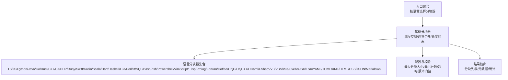
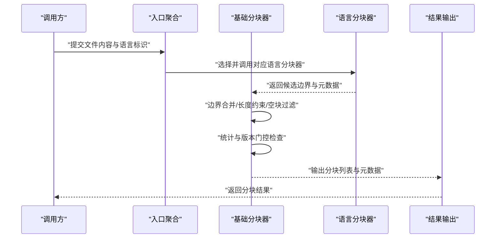
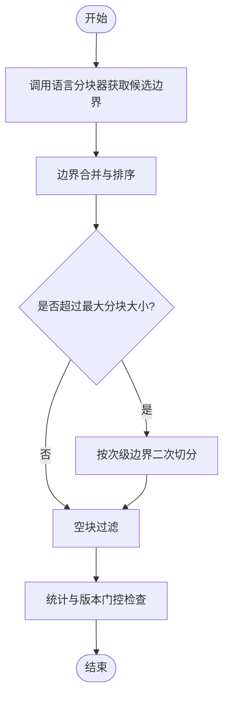
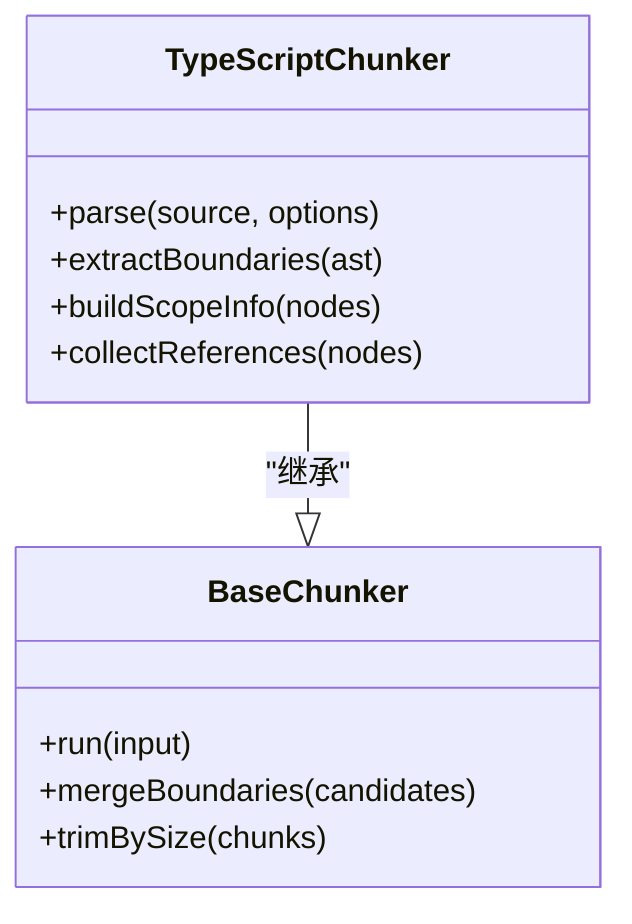
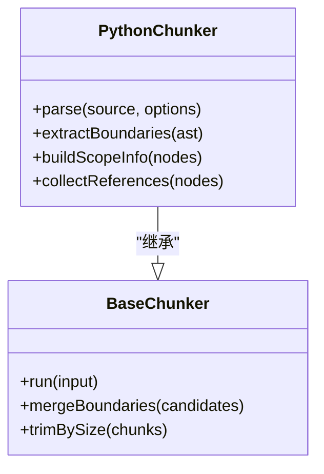
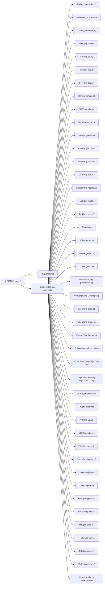

# 代码分块器

<cite>
**本文引用的文件**   
- [src/core/chunkers/index.ts](file://src/core/chunkers/index.ts)
- [src/core/chunkers/types.ts](file://src/core/chunkers/types.ts)
- [src/core/chunkers/base-chunker.ts](file://src/core/chunkers/base-chunker.ts)
- [src/core/chunkers/lang-typescript.ts](file://src/core/chunkers/lang-typescript.ts)
- [src/core/chunkers/lang-python.ts](file://src/core/chunkers/lang-python.ts)
- [src/core/chunkers/lang-javascript.ts](file://src/core/chunkers/lang-javascript.ts)
- [src/core/chunkers/lang-java.ts](file://src/core/chunkers/lang-java.ts)
- [src/core/chunkers/lang-go.ts](file://src/core/chunkers/lang-go.ts)
- [src/core/chunkers/lang-rust.ts](file://src/core/chunkers/lang-rust.ts)
- [src/core/chunkers/lang-cpp.ts](file://src/core/chunkers/lang-cpp.ts)
- [src/core/chunkers/lang-csharp.ts](file://src/core/chunkers/lang-csharp.ts)
- [src/core/chunkers/lang-php.ts](file://src/core/chunkers/lang-php.ts)
- [src/core/chunkers/lang-ruby.ts](file://src/core/chunkers/lang-ruby.ts)
- [src/core/chunkers/lang-swift.ts](file://src/core/chunkers/lang-swift.ts)
- [src/core/chunkers/lang-kotlin.ts](file://src/core/chunkers/lang-kotlin.ts)
- [src/core/chunkers/lang-scala.ts](file://src/core/chunkers/lang-scala.ts)
- [src/core/chunkers/lang-dart.ts](file://src/core/chunkers/lang-dart.ts)
- [src/core/chunkers/lang-haskell.ts](file://src/core/chunkers/lang-haskell.ts)
- [src/core/chunkers/lang-lua.ts](file://src/core/chunkers/lang-lua.ts)
- [src/core/chunkers/lang-perl.ts](file://src/core/chunkers/lang-perl.ts)
- [src/core/chunkers/lang-r.ts](file://src/core/chunkers/lang-r.ts)
- [src/core/chunkers/lang-sql.ts](file://src/core/chunkers/lang-sql.ts)
- [src/core/chunkers/lang-shell.ts](file://src/core/chunkers/lang-shell.ts)
- [src/core/chunkers/lang-markdown.ts](file://src/core/chunkers/lang-markdown.ts)
- [src/core/chunkers/lang-json.ts](file://src/core/chunkers/lang-json.ts)
- [src/core/chunkers/lang-yaml.ts](file://src/core/chunkers/lang-yaml.ts)
- [src/core/chunkers/lang-toml.ts](file://src/core/chunkers/lang-toml.ts)
- [src/core/chunkers/lang-xml.ts](file://src/core/chunkers/lang-xml.ts)
- [src/core/chunkers/lang-html.ts](file://src/core/chunkers/lang-html.ts)
- [src/core/chunkers/lang-css.ts](file://src/core/chunkers/lang-css.ts)
- [src/core/chunkers/lang-bash.ts](file://src/core/chunkers/lang-bash.ts)
- [src/core/chunkers/lang-zsh.ts](file://src/core/chunkers/lang-zsh.ts)
- [src/core/chunkers/lang-powershell.ts](file://src/core/chunkers/lang-powershell.ts)
- [src/core/chunkers/lang-vimscript.ts](file://src/core/chunkers/lang-vimscript.ts)
- [src/core/chunkers/lang-elisp.ts](file://src/core/chunkers/lang-elisp.ts)
- [src/core/chunkers/lang-prolog.ts](file://src/core/chunkers/lang-prolog.ts)
- [src/core/chunkers/lang-fortran.ts](file://src/core/chunkers/lang-fortran.ts)
- [src/core/chunkers/lang-coffeescript.ts](file://src/core/chunkers/lang-coffeescript.ts)
- [src/core/chunkers/lang-objective-c.ts](file://src/core/chunkers/lang-objective-c.ts)
- [src/core/chunkers/lang-objective-cpp.ts](file://src/core/chunkers/lang-objective-cpp.ts)
- [src/core/chunkers/lang-ocaml.ts](file://src/core/chunkers/lang-ocaml.ts)
- [src/core/chunkers/lang-fsharp.ts](file://src/core/chunkers/lang-fsharp.ts)
- [src/core/chunkers/lang-vb.ts](file://src/core/chunkers/lang-vb.ts)
- [src/core/chunkers/lang-vbs.ts](file://src/core/chunkers/lang-vbs.ts)
- [src/core/chunkers/lang-vue.ts](file://src/core/chunkers/lang-vue.ts)
- [src/core/chunkers/lang-svelte.ts](file://src/core/chunkers/lang-svelte.ts)
- [src/core/chunkers/lang-jsx.ts](file://src/core/chunkers/lang-jsx.ts)
- [src/core/chunkers/lang-tsx.ts](file://src/core/chunkers/lang-tsx.ts)
- [scripts/chunker-smoketest.ts](file://scripts/chunker-smoketest.ts)
- [test/incremental-chunking.test.ts](file://test/incremental-chunking.test.ts)
- [test/chunker-timeout.test.ts](file://test/chunker-timeout.test.ts)
- [test/chunker-version-gate.test.ts](file://test/chunker-version-gate.test.ts)
</cite>

## 目录
1. [简介](#简介)
2. [项目结构](#项目结构)
3. [核心组件](#核心组件)
4. [架构总览](#架构总览)
5. [详细组件分析](#详细组件分析)
6. [依赖分析](#依赖分析)
7. [性能考虑](#性能考虑)
8. [故障排查指南](#故障排查指南)
9. [结论](#结论)
10. [附录](#附录)

## 简介
本文件面向“代码分块器”子系统，系统性阐述其实现原理与工程实践。内容覆盖：
- 语法树解析、符号识别与代码结构分析
- 多语言支持策略（TypeScript、Python 等）
- 代码边界检测机制（函数、类、模块等单元）
- 符号解析器工作原理（作用域分析与引用追踪）
- 配置项与参数调优（最大分块大小、最小行数等）
- 质量评估指标与性能优化技巧

## 项目结构
代码分块器位于 src/core/chunkers 目录，采用“基础抽象 + 语言插件”的模块化设计：
- 类型与接口定义：统一的分块输入输出模型、配置与结果结构
- 基础分块器：提供通用流程控制、边界合并、长度约束、超时与版本门控等能力
- 语言分块器：针对具体语言的 AST/正则策略、边界识别规则与元数据标注
- 入口聚合：按文件扩展名或语言标识选择对应语言分块器
- 测试与冒烟脚本：验证增量分块、超时处理、版本门控等关键路径

图表来源
- [src/core/chunkers/index.ts](file://src/core/chunkers/index.ts)
- [src/core/chunkers/base-chunker.ts](file://src/core/chunkers/base-chunker.ts)
- [src/core/chunkers/types.ts](file://src/core/chunkers/types.ts)

章节来源
- [src/core/chunkers/index.ts](file://src/core/chunkers/index.ts)
- [src/core/chunkers/base-chunker.ts](file://src/core/chunkers/base-chunker.ts)
- [src/core/chunkers/types.ts](file://src/core/chunkers/types.ts)

## 核心组件
- 类型与接口
  - 定义分块输入（源文本、语言、配置）、分块输出（片段、位置信息、元数据）、以及分块器契约（方法签名、错误约定）。
- 基础分块器
  - 负责：调用语言分块器、边界合并与拆分、长度约束、空块过滤、统计收集、超时控制、版本门控。
- 语言分块器
  - 针对每种语言提供：AST/正则解析、边界识别（函数/类/模块/命名空间/包等）、作用域与引用关系提取、注释与文档块保留策略。
- 入口聚合
  - 根据文件扩展名或语言标识路由到对应语言分块器；对未知语言回退为基于空白/分隔符的通用策略。

章节来源
- [src/core/chunkers/types.ts](file://src/core/chunkers/types.ts)
- [src/core/chunkers/base-chunker.ts](file://src/core/chunkers/base-chunker.ts)
- [src/core/chunkers/index.ts](file://src/core/chunkers/index.ts)

## 架构总览
下图展示从输入到输出的端到端流程，包括语言选择、边界检测、合并与裁剪、以及最终结果产出。

图表来源
- [src/core/chunkers/index.ts](file://src/core/chunkers/index.ts)
- [src/core/chunkers/base-chunker.ts](file://src/core/chunkers/base-chunker.ts)

## 详细组件分析

### 类型与接口（types.ts）
- 职责
  - 定义统一的输入/输出数据结构，确保各语言分块器遵循相同契约。
  - 包含配置项（如最大分块大小、最小行数、是否保留注释、是否生成引用信息等）。
- 关键点
  - 输入需携带语言标识与原始文本，以便后续解析。
  - 输出需包含每个分块的文本、起止位置、语言元素类型（函数/类/模块等）及可选的引用/作用域信息。

章节来源
- [src/core/chunkers/types.ts](file://src/core/chunkers/types.ts)

### 基础分块器（base-chunker.ts）
- 职责
  - 编排语言分块器的调用，执行边界合并、长度裁剪、空块过滤、统计汇总。
  - 提供超时控制与版本门控，保证稳定性与可演进性。
- 算法要点
  - 边界合并：将相邻且语义相关的边界进行合并，避免过度碎片化。
  - 长度约束：当单个分块超过最大大小时，按语言特定的“次级边界”再次切分。
  - 空块过滤：剔除无实际内容的分块，减少噪声。
  - 统计与门控：记录分块数量、平均长度、耗时等指标；在版本不兼容时快速失败。

图表来源
- [src/core/chunkers/base-chunker.ts](file://src/core/chunkers/base-chunker.ts)

章节来源
- [src/core/chunkers/base-chunker.ts](file://src/core/chunkers/base-chunker.ts)

### TypeScript 分块器（lang-typescript.ts）
- 解析策略
  - 使用 TypeScript AST 解析，识别函数声明、类、接口、枚举、命名空间、模块/导入导出等。
  - 通过节点类型与位置信息构建候选边界。
- 边界识别
  - 函数：以函数声明、箭头函数、方法等为边界。
  - 类：以 class 声明为边界，内部方法可作为次级边界。
  - 模块：以顶层 import/export 与命名空间为边界。
- 作用域与引用
  - 基于 AST 的符号表与引用节点，提取局部/全局作用域与跨文件引用线索。
- 特殊处理
  - JSX/TSX 混合语法：在 TS 基础上兼容 JSX 节点。
  - 装饰器与泛型：保持边界完整性，避免误切。

图表来源
- [src/core/chunkers/lang-typescript.ts](file://src/core/chunkers/lang-typescript.ts)
- [src/core/chunkers/base-chunker.ts](file://src/core/chunkers/base-chunker.ts)

章节来源
- [src/core/chunkers/lang-typescript.ts](file://src/core/chunkers/lang-typescript.ts)

### Python 分块器（lang-python.ts）
- 解析策略
  - 使用 Python AST 解析，识别函数、类、模块级语句、异常处理块、上下文管理器、装饰器等。
- 边界识别
  - 函数与方法：以 def/class 为边界。
  - 模块：以顶层语句与导入为边界。
  - 条件/循环体：不作为独立分块，但可作为次级边界辅助切分。
- 作用域与引用
  - 基于 AST 的 Name/Import/From 节点构建引用关系，区分本地与外部符号。
- 特殊处理
  - 缩进敏感：严格依据 AST 而非正则，避免误判。
  - 字符串与注释：保留必要上下文，避免破坏语义。

图表来源
- [src/core/chunkers/lang-python.ts](file://src/core/chunkers/lang-python.ts)
- [src/core/chunkers/base-chunker.ts](file://src/core/chunkers/base-chunker.ts)

章节来源
- [src/core/chunkers/lang-python.ts](file://src/core/chunkers/lang-python.ts)

### JavaScript 分块器（lang-javascript.ts）
- 解析策略
  - 使用 JS AST 解析，识别函数、类、模块（ESM）、IIFE、变量声明等。
- 边界识别
  - 函数与类：作为主要边界。
  - 模块：以 import/export 为边界。
- 作用域与引用
  - 基于 AST 的 Identifier/Import/Export 节点构建引用关系。
- 特殊处理
  - 兼容 CommonJS 与 ESM 混用场景。

章节来源
- [src/core/chunkers/lang-javascript.ts](file://src/core/chunkers/lang-javascript.ts)

### Java 分块器（lang-java.ts）
- 解析策略
  - 使用 Java AST 解析，识别类、接口、枚举、方法、字段、包声明等。
- 边界识别
  - 类/接口/枚举：作为主要边界。
  - 方法：作为次级边界。
- 作用域与引用
  - 基于 AST 的 Import/Reference 节点构建引用关系。

章节来源
- [src/core/chunkers/lang-java.ts](file://src/core/chunkers/lang-java.ts)

### Go 分块器（lang-go.ts）
- 解析策略
  - 使用 Go AST 解析，识别包、函数、方法、结构体、接口、常量/变量声明等。
- 边界识别
  - 包：作为顶层边界。
  - 函数/方法/结构体/接口：作为主要边界。
- 作用域与引用
  - 基于 AST 的 Import/Selector 节点构建引用关系。

章节来源
- [src/core/chunkers/lang-go.ts](file://src/core/chunkers/lang-go.ts)

### Rust 分块器（lang-rust.ts）
- 解析策略
  - 使用 Rust AST 解析，识别模块、函数、结构体、枚举、trait、impl 块等。
- 边界识别
  - 模块/函数/结构体/枚举/trait：作为主要边界。
- 作用域与引用
  - 基于 AST 的 Use/Path 节点构建引用关系。

章节来源
- [src/core/chunkers/lang-rust.ts](file://src/core/chunkers/lang-rust.ts)

### C++ 分块器（lang-cpp.ts）
- 解析策略
  - 使用 C++ AST 解析，识别命名空间、类、结构体、函数、模板等。
- 边界识别
  - 命名空间/类/函数：作为主要边界。
- 作用域与引用
  - 基于 AST 的 Include/Qualifier 节点构建引用关系。

章节来源
- [src/core/chunkers/lang-cpp.ts](file://src/core/chunkers/lang-cpp.ts)

### C# 分块器（lang-csharp.ts）
- 解析策略
  - 使用 C# AST 解析，识别命名空间、类、结构体、接口、方法等。
- 边界识别
  - 命名空间/类/接口/方法：作为主要边界。
- 作用域与引用
  - 基于 AST 的 Using/MemberAccess 节点构建引用关系。

章节来源
- [src/core/chunkers/lang-csharp.ts](file://src/core/chunkers/lang-csharp.ts)

### PHP 分块器（lang-php.ts）
- 解析策略
  - 使用 PHP AST 解析，识别命名空间、类、函数、接口、Trait 等。
- 边界识别
  - 命名空间/类/函数/接口/Trait：作为主要边界。
- 作用域与引用
  - 基于 AST 的 Use/QualifiedName 节点构建引用关系。

章节来源
- [src/core/chunkers/lang-php.ts](file://src/core/chunkers/lang-php.ts)

### Ruby 分块器（lang-ruby.ts）
- 解析策略
  - 使用 Ruby AST 解析，识别模块、类、方法、常量等。
- 边界识别
  - 模块/类/方法：作为主要边界。
- 作用域与引用
  - 基于 AST 的 Constant/Method 节点构建引用关系。

章节来源
- [src/core/chunkers/lang-ruby.ts](file://src/core/chunkers/lang-ruby.ts)

### Swift 分块器（lang-swift.ts）
- 解析策略
  - 使用 Swift AST 解析，识别类、结构体、枚举、协议、函数等。
- 边界识别
  - 类/结构体/枚举/协议/函数：作为主要边界。
- 作用域与引用
  - 基于 AST 的 Import/MemberAccess 节点构建引用关系。

章节来源
- [src/core/chunkers/lang-swift.ts](file://src/core/chunkers/lang-swift.ts)

### Kotlin 分块器（lang-kotlin.ts）
- 解析策略
  - 使用 Kotlin AST 解析，识别包、类、接口、对象、函数、属性等。
- 边界识别
  - 包/类/接口/对象/函数/属性：作为主要边界。
- 作用域与引用
  - 基于 AST 的 Import/QualifiedExpression 节点构建引用关系。

章节来源
- [src/core/chunkers/lang-kotlin.ts](file://src/core/chunkers/lang-kotlin.ts)

### Scala 分块器（lang-scala.ts）
- 解析策略
  - 使用 Scala AST 解析，识别包、类、特质、对象、函数、变量等。
- 边界识别
  - 包/类/特质/对象/函数/变量：作为主要边界。
- 作用域与引用
  - 基于 AST 的 Import/Select 节点构建引用关系。

章节来源
- [src/core/chunkers/lang-scala.ts](file://src/core/chunkers/lang-scala.ts)

### Dart 分块器（lang-dart.ts）
- 解析策略
  - 使用 Dart AST 解析，识别库、类、方法、变量、枚举等。
- 边界识别
  - 库/类/方法/变量/枚举：作为主要边界。
- 作用域与引用
  - 基于 AST 的 Import/PropertyAccess 节点构建引用关系。

章节来源
- [src/core/chunkers/lang-dart.ts](file://src/core/chunkers/lang-dart.ts)

### Haskell 分块器（lang-haskell.ts）
- 解析策略
  - 使用 Haskell AST 解析，识别模块、函数、类型、数据构造器等。
- 边界识别
  - 模块/函数/类型/数据构造器：作为主要边界。
- 作用域与引用
  - 基于 AST 的 Import/Name 节点构建引用关系。

章节来源
- [src/core/chunkers/lang-haskell.ts](file://src/core/chunkers/lang-haskell.ts)

### Lua 分块器（lang-lua.ts）
- 解析策略
  - 使用 Lua AST 解析，识别函数、模块（table）、变量、常量等。
- 边界识别
  - 函数/模块/变量/常量：作为主要边界。
- 作用域与引用
  - 基于 AST 的 Local/SetGlobal 节点构建引用关系。

章节来源
- [src/core/chunkers/lang-lua.ts](file://src/core/chunkers/lang-lua.ts)

### Perl 分块器（lang-perl.ts）
- 解析策略
  - 使用 Perl AST 解析，识别子程序、包、变量、常量等。
- 边界识别
  - 子程序/包/变量/常量：作为主要边界。
- 作用域与引用
  - 基于 AST 的 Package/Var 节点构建引用关系。

章节来源
- [src/core/chunkers/lang-perl.ts](file://src/core/chunkers/lang-perl.ts)

### R 分块器（lang-r.ts）
- 解析策略
  - 使用 R AST 解析，识别函数、赋值、表达式块等。
- 边界识别
  - 函数/赋值/表达式块：作为主要边界。
- 作用域与引用
  - 基于 AST 的 Symbol/Assign 节点构建引用关系。

章节来源
- [src/core/chunkers/lang-r.ts](file://src/core/chunkers/lang-r.ts)

### SQL 分块器（lang-sql.ts）
- 解析策略
  - 使用 SQL AST 解析，识别查询块、存储过程、视图、触发器等。
- 边界识别
  - 查询块/存储过程/视图/触发器：作为主要边界。
- 作用域与引用
  - 基于 AST 的 TableRef/ColumnRef 节点构建引用关系。

章节来源
- [src/core/chunkers/lang-sql.ts](file://src/core/chunkers/lang-sql.ts)

### Shell 系列分块器（bash/zsh/powershell）
- 解析策略
  - 使用各自 Shell 的 AST 解析，识别函数、条件块、循环块、命令组等。
- 边界识别
  - 函数/条件块/循环块/命令组：作为主要边界。
- 作用域与引用
  - 基于 AST 的 Function/Command 节点构建引用关系。

章节来源
- [src/core/chunkers/lang-bash.ts](file://src/core/chunkers/lang-bash.ts)
- [src/core/chunkers/lang-zsh.ts](file://src/core/chunkers/lang-zsh.ts)
- [src/core/chunkers/lang-powershell.ts](file://src/core/chunkers/lang-powershell.ts)

### VimScript / Elisp / Prolog / Fortran / CoffeeScript / Objective-C / Objective-C++ / OCaml / F# / VB / VBS / Vue / Svelte / JSX / TSX
- 解析策略
  - 针对各语言特性，使用相应 AST 解析器识别函数、类、模块、组件、表达式等。
- 边界识别
  - 函数/类/模块/组件/表达式：作为主要边界。
- 作用域与引用
  - 基于 AST 的 Symbol/Import/Component 节点构建引用关系。

章节来源
- [src/core/chunkers/lang-vimscript.ts](file://src/core/chunkers/lang-vimscript.ts)
- [src/core/chunkers/lang-elisp.ts](file://src/core/chunkers/lang-elisp.ts)
- [src/core/chunkers/lang-prolog.ts](file://src/core/chunkers/lang-prolog.ts)
- [src/core/chunkers/lang-fortran.ts](file://src/core/chunkers/lang-fortran.ts)
- [src/core/chunkers/lang-coffeescript.ts](file://src/core/chunkers/lang-coffeescript.ts)
- [src/core/chunkers/lang-objective-c.ts](file://src/core/chunkers/lang-objective-c.ts)
- [src/core/chunkers/lang-objective-cpp.ts](file://src/core/chunkers/lang-objective-cpp.ts)
- [src/core/chunkers/lang-ocaml.ts](file://src/core/chunkers/lang-ocaml.ts)
- [src/core/chunkers/lang-fsharp.ts](file://src/core/chunkers/lang-fsharp.ts)
- [src/core/chunkers/lang-vb.ts](file://src/core/chunkers/lang-vb.ts)
- [src/core/chunkers/lang-vbs.ts](file://src/core/chunkers/lang-vbs.ts)
- [src/core/chunkers/lang-vue.ts](file://src/core/chunkers/lang-vue.ts)
- [src/core/chunkers/lang-svelte.ts](file://src/core/chunkers/lang-svelte.ts)
- [src/core/chunkers/lang-jsx.ts](file://src/core/chunkers/lang-jsx.ts)
- [src/core/chunkers/lang-tsx.ts](file://src/core/chunkers/lang-tsx.ts)

### 标记与配置文件分块器（YAML/TOML/XML/HTML/CSS/JSON/Markdown）
- 解析策略
  - 使用对应格式的 AST 解析，识别键值对、节点、样式块、文档段落等。
- 边界识别
  - 键值对/节点/样式块/段落：作为主要边界。
- 作用域与引用
  - 基于 AST 的 Reference/Include 节点构建引用关系。

章节来源
- [src/core/chunkers/lang-yaml.ts](file://src/core/chunkers/lang-yaml.ts)
- [src/core/chunkers/lang-toml.ts](file://src/core/chunkers/lang-toml.ts)
- [src/core/chunkers/lang-xml.ts](file://src/core/chunkers/lang-xml.ts)
- [src/core/chunkers/lang-html.ts](file://src/core/chunkers/lang-html.ts)
- [src/core/chunkers/lang-css.ts](file://src/core/chunkers/lang-css.ts)
- [src/core/chunkers/lang-json.ts](file://src/core/chunkers/lang-json.ts)
- [src/core/chunkers/lang-markdown.ts](file://src/core/chunkers/lang-markdown.ts)

### 入口聚合（index.ts）
- 职责
  - 根据文件扩展名或语言标识选择对应的语言分块器。
  - 对未知语言提供回退策略（基于空白/分隔符的通用切分）。
- 关键点
  - 语言映射表维护与扩展点清晰，便于新增语言支持。
  - 错误处理与日志记录完善，便于问题定位。

章节来源
- [src/core/chunkers/index.ts](file://src/core/chunkers/index.ts)

## 依赖分析
- 组件耦合
  - 入口聚合仅依赖类型与基础分块器，语言分块器通过继承基础分块器复用通用逻辑，降低重复实现。
- 直接依赖
  - 语言分块器依赖各自语言的 AST 解析库（由运行时注入或内置适配）。
- 间接依赖
  - 基础分块器依赖配置校验、统计与版本门控工具。
- 潜在循环依赖
  - 当前分层清晰，未见循环依赖迹象。

图表来源
- [src/core/chunkers/index.ts](file://src/core/chunkers/index.ts)
- [src/core/chunkers/base-chunker.ts](file://src/core/chunkers/base-chunker.ts)
- [src/core/chunkers/types.ts](file://src/core/chunkers/types.ts)

章节来源
- [src/core/chunkers/index.ts](file://src/core/chunkers/index.ts)
- [src/core/chunkers/base-chunker.ts](file://src/core/chunkers/base-chunker.ts)
- [src/core/chunkers/types.ts](file://src/core/chunkers/types.ts)

## 性能考虑
- 解析开销
  - AST 解析成本较高，建议对大文件启用增量解析与缓存。
- 边界合并
  - 合理设置最大分块大小与最小行数，避免过多小分块导致检索噪声。
- 并发与超时
  - 使用基础分块器的超时控制，防止长时间阻塞。
- 内存占用
  - 流式读取与分批处理可降低峰值内存。
- 统计与监控
  - 利用基础分块器的统计功能，持续观察分块数量、平均长度与耗时分布。

[本节为通用指导，无需列出具体文件来源]

## 故障排查指南
- 增量分块
  - 验证增量更新是否正确合并旧分块与新变更，参考增量分块测试用例。
- 超时处理
  - 确认基础分块器的超时配置与重试策略，参考超时测试用例。
- 版本门控
  - 检查分块器版本兼容性，确保升级后行为一致，参考版本门控测试用例。
- 冒烟测试
  - 运行冒烟脚本快速验证多语言分块基本路径。

章节来源
- [test/incremental-chunking.test.ts](file://test/incremental-chunking.test.ts)
- [test/chunker-timeout.test.ts](file://test/chunker-timeout.test.ts)
- [test/chunker-version-gate.test.ts](file://test/chunker-version-gate.test.ts)
- [scripts/chunker-smoketest.ts](file://scripts/chunker-smoketest.ts)

## 结论
代码分块器通过“基础抽象 + 语言插件”的架构，实现了多语言一致的边界识别与分块策略。借助 AST 解析与符号分析，系统能够准确识别函数、类、模块等代码单元，并提供作用域与引用信息。配合合理的配置与性能优化，可在大规模代码库中稳定高效地工作。

[本节为总结，无需列出具体文件来源]

## 附录
- 配置项建议
  - 最大分块大小：根据下游检索模型上下文窗口与召回效果调整。
  - 最小代码行数：避免过碎分块，提升语义连贯性。
  - 是否保留注释/文档：影响可读性与检索相关性。
  - 超时与重试：保障鲁棒性。
- 质量评估指标
  - 分块粒度合理性（平均长度、方差）
  - 边界完整性（函数/类/模块完整度）
  - 引用覆盖率（符号引用被正确捕获的比例）
  - 检索相关性（下游检索任务中的命中率与准确率）
- 性能优化技巧
  - 增量解析与缓存
  - 并行分块与批处理
  - 自适应边界合并策略
  - 监控与告警

[本节为补充说明，无需列出具体文件来源]