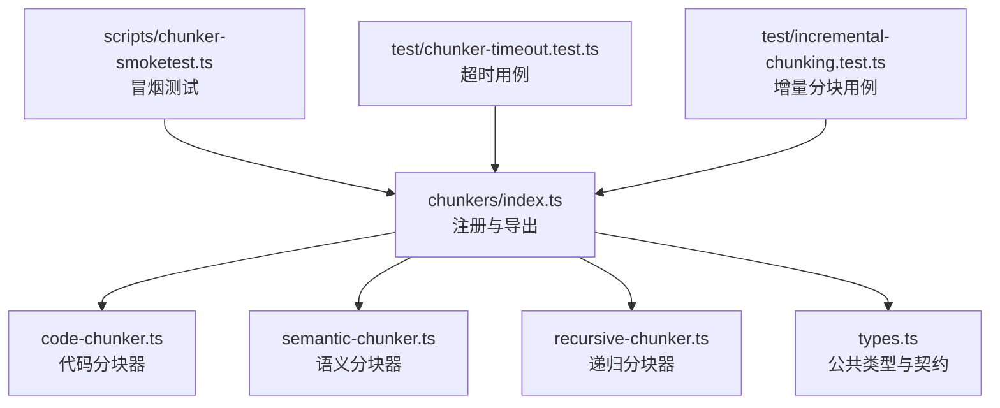
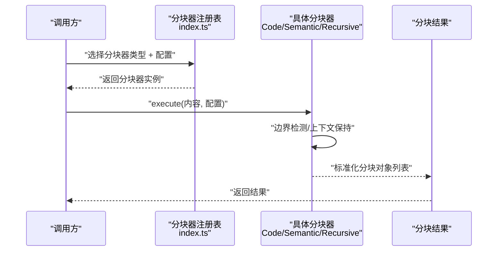
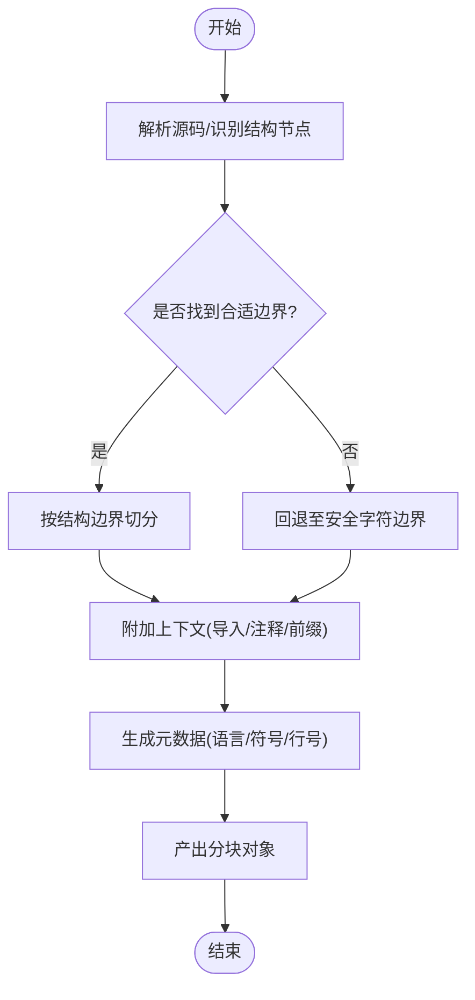
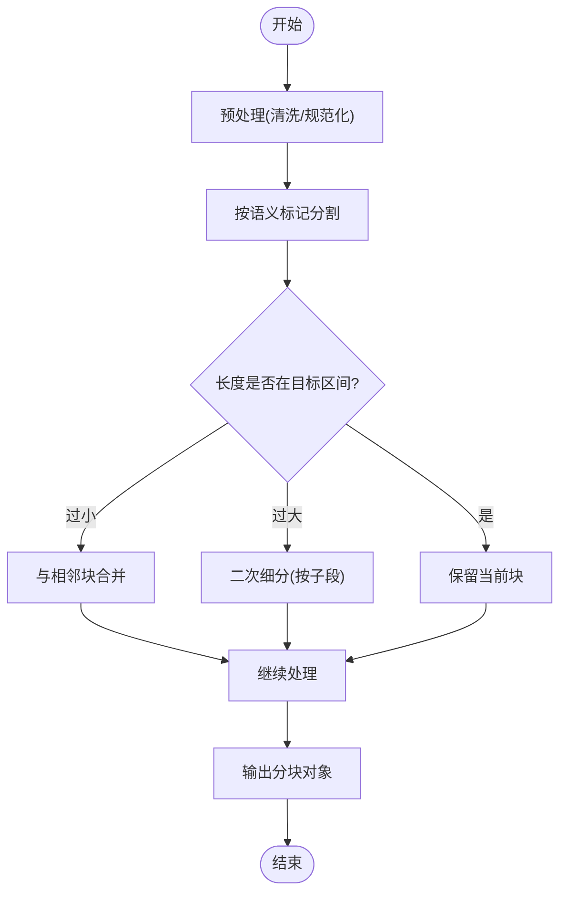
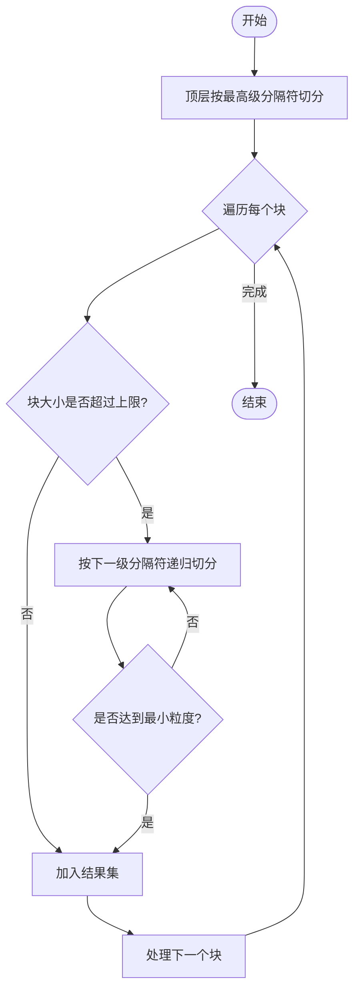
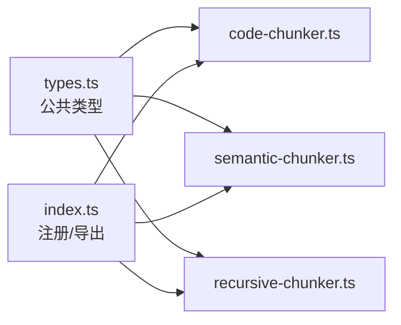

# 分块策略系统

<cite>
**本文引用的文件**   
- [src/core/chunkers/index.ts](file://src/core/chunkers/index.ts)
- [src/core/chunkers/code-chunker.ts](file://src/core/chunkers/code-chunker.ts)
- [src/core/chunkers/semantic-chunker.ts](file://src/core/chunkers/semantic-chunker.ts)
- [src/core/chunkers/recursive-chunker.ts](file://src/core/chunkers/recursive-chunker.ts)
- [src/core/chunkers/types.ts](file://src/core/chunkers/types.ts)
- [scripts/chunker-smoketest.ts](file://scripts/chunker-smoketest.ts)
- [test/chunker-timeout.test.ts](file://test/chunker-timeout.test.ts)
- [test/incremental-chunking.test.ts](file://test/incremental-chunking.test.ts)
</cite>

## 目录
1. [简介](#简介)
2. [项目结构](#项目结构)
3. [核心组件](#核心组件)
4. [架构总览](#架构总览)
5. [详细组件分析](#详细组件分析)
6. [依赖关系分析](#依赖关系分析)
7. [性能与内存优化](#性能与内存优化)
8. [故障排查指南](#故障排查指南)
9. [结论](#结论)
10. [附录：自定义分块器开发指南](#附录自定义分块器开发指南)

## 简介
本文件面向“分块策略系统”的开发者与维护者，系统性阐述代码分块器、语义分块器与递归分块器的实现原理、适用场景、边界检测与上下文保持机制，并给出质量评估指标、优化策略与性能调优参数。同时提供自定义分块器的接口规范、元数据提取与索引生成建议，帮助在工程实践中构建高质量、可维护的分块管线。

## 项目结构
分块子系统位于 core 层，采用“统一接口 + 多实现”的策略组织方式：
- 统一类型与注册入口：定义分块器通用契约与工厂/注册逻辑
- 具体分块器实现：
  - 代码分块器：面向 TypeScript、Python 等语言的结构化切分
  - 语义分块器：基于文本语义边界的切分
  - 递归分块器：按层级规则递归切分，兼顾粒度控制
- 测试与冒烟脚本：覆盖超时、增量、基础行为验证

图示来源
- [src/core/chunkers/index.ts](file://src/core/chunkers/index.ts)
- [src/core/chunkers/code-chunker.ts](file://src/core/chunkers/code-chunker.ts)
- [src/core/chunkers/semantic-chunker.ts](file://src/core/chunkers/semantic-chunker.ts)
- [src/core/chunkers/recursive-chunker.ts](file://src/core/chunkers/recursive-chunker.ts)
- [src/core/chunkers/types.ts](file://src/core/chunkers/types.ts)
- [scripts/chunker-smoketest.ts](file://scripts/chunker-smoketest.ts)
- [test/chunker-timeout.test.ts](file://test/chunker-timeout.test.ts)
- [test/incremental-chunking.test.ts](file://test/incremental-chunking.test.ts)

章节来源
- [src/core/chunkers/index.ts](file://src/core/chunkers/index.ts)
- [src/core/chunkers/types.ts](file://src/core/chunkers/types.ts)

## 核心组件
- 统一分块接口与类型：定义输入输出结构、元数据字段、配置项与错误约定，确保不同分块器可被统一调度与替换
- 代码分块器：识别语言语法单元（如函数、类、模块），按结构边界切分，保留必要上下文（如导入、注释）
- 语义分块器：依据段落、标题、空行或语义标记进行切分，适合文档、日志、对话等非结构化文本
- 递归分块器：自顶向下按层级规则切分，支持最大块大小、最小块大小、重叠度等参数，保证粒度可控

章节来源
- [src/core/chunkers/types.ts](file://src/core/chunkers/types.ts)
- [src/core/chunkers/code-chunker.ts](file://src/core/chunkers/code-chunker.ts)
- [src/core/chunkers/semantic-chunker.ts](file://src/core/chunkers/semantic-chunker.ts)
- [src/core/chunkers/recursive-chunker.ts](file://src/core/chunkers/recursive-chunker.ts)

## 架构总览
分块系统以“配置驱动 + 插件式实现”为核心思想。上层通过统一入口选择具体分块器，传入源内容与配置后得到标准化分块结果；各分块器内部负责边界检测、上下文拼接与元数据填充。

图示来源
- [src/core/chunkers/index.ts](file://src/core/chunkers/index.ts)
- [src/core/chunkers/code-chunker.ts](file://src/core/chunkers/code-chunker.ts)
- [src/core/chunkers/semantic-chunker.ts](file://src/core/chunkers/semantic-chunker.ts)
- [src/core/chunkers/recursive-chunker.ts](file://src/core/chunkers/recursive-chunker.ts)

## 详细组件分析

### 代码分块器（TypeScript、Python 等）
- 设计要点
  - 语言解析：优先使用轻量级语法树或启发式规则定位函数、类、模块等边界
  - 上下文保持：为每个块附加必要的导入、注释、前后文片段，提升检索可用性
  - 边界检测：避免在语句中间截断，必要时回退到字符级安全边界
  - 元数据：记录语言、符号名、行号范围、父作用域等
- 适用场景
  - 代码仓库索引、跨文件引用分析、智能补全与问答
- 关键流程
  - 扫描源码 → 识别结构节点 → 裁剪与合并 → 生成块与元数据

图示来源
- [src/core/chunkers/code-chunker.ts](file://src/core/chunkers/code-chunker.ts)

章节来源
- [src/core/chunkers/code-chunker.ts](file://src/core/chunkers/code-chunker.ts)

### 语义分块器
- 设计要点
  - 语义边界：利用标题、段落分隔、空行、列表、对话轮次等线索
  - 长度控制：结合目标长度与最小长度阈值，避免过碎或过大
  - 上下文保持：对相邻段落进行适度融合，减少信息割裂
- 适用场景
  - 文档、博客、会议记录、FAQ、知识库条目
- 关键流程
  - 文本预处理 → 语义分割 → 长度校验与合并 → 输出

图示来源
- [src/core/chunkers/semantic-chunker.ts](file://src/core/chunkers/semantic-chunker.ts)

章节来源
- [src/core/chunkers/semantic-chunker.ts](file://src/core/chunkers/semantic-chunker.ts)

### 递归分块器
- 设计要点
  - 层级规则：支持多级分隔符（如章节→小节→段落）
  - 粒度控制：最大块大小、最小块大小、重叠比例
  - 终止条件：达到最小粒度或无法再分则停止
- 适用场景
  - 长文档、书籍、技术手册、混合格式内容
- 关键流程
  - 顶层切分 → 递归细化 → 合并/裁剪 → 输出

图示来源
- [src/core/chunkers/recursive-chunker.ts](file://src/core/chunkers/recursive-chunker.ts)

章节来源
- [src/core/chunkers/recursive-chunker.ts](file://src/core/chunkers/recursive-chunker.ts)

### 统一类型与契约
- 输入：源内容、分块器配置（如目标大小、重叠度、语言、分隔符等）
- 输出：标准化分块对象集合（包含文本、位置信息、元数据）
- 错误：统一的异常结构与重试/降级策略约定

章节来源
- [src/core/chunkers/types.ts](file://src/core/chunkers/types.ts)

## 依赖关系分析
- 低耦合：各分块器仅依赖统一类型与工具函数，便于替换与扩展
- 集中注册：通过统一入口管理分块器选择与生命周期
- 外部集成：上游消费者通过配置选择分块器，无需感知实现细节

图示来源
- [src/core/chunkers/types.ts](file://src/core/chunkers/types.ts)
- [src/core/chunkers/index.ts](file://src/core/chunkers/index.ts)
- [src/core/chunkers/code-chunker.ts](file://src/core/chunkers/code-chunker.ts)
- [src/core/chunkers/semantic-chunker.ts](file://src/core/chunkers/semantic-chunker.ts)
- [src/core/chunkers/recursive-chunker.ts](file://src/core/chunkers/recursive-chunker.ts)

章节来源
- [src/core/chunkers/index.ts](file://src/core/chunkers/index.ts)
- [src/core/chunkers/types.ts](file://src/core/chunkers/types.ts)

## 性能与内存优化
- 流式处理：对大文件采用流式读取与增量分块，降低峰值内存占用
- 并行与批处理：对独立块进行并发处理，注意限制并发度以避免资源争用
- 缓存与去重：对重复片段或已计算元数据进行缓存，减少重复工作
- 边界快速判定：优先使用启发式规则快速定位边界，仅在必要时进行深度解析
- 内存回收：及时释放中间数据结构，避免长时间持有大对象引用

[本节为通用指导，不直接分析具体文件]

## 故障排查指南
- 超时问题
  - 现象：分块任务执行时间过长或被中断
  - 排查：检查分块器配置的目标大小与递归深度；确认是否存在超大无边界文本
  - 参考用例：[test/chunker-timeout.test.ts](file://test/chunker-timeout.test.ts)
- 增量分块
  - 现象：变更后的增量更新未生效或产生不一致
  - 排查：确认增量策略与边界一致性；核对元数据版本与指纹
  - 参考用例：[test/incremental-chunking.test.ts](file://test/incremental-chunking.test.ts)
- 冒烟测试
  - 用途：快速验证分块器基本能力与回归风险
  - 参考脚本：[scripts/chunker-smoketest.ts](file://scripts/chunker-smoketest.ts)

章节来源
- [test/chunker-timeout.test.ts](file://test/chunker-timeout.test.ts)
- [test/incremental-chunking.test.ts](file://test/incremental-chunking.test.ts)
- [scripts/chunker-smoketest.ts](file://scripts/chunker-smoketest.ts)

## 结论
本分块策略系统通过统一接口与多实现模式，将代码、语义与递归三类分块器有机整合，既满足结构化与非结构化内容的多样化需求，又具备良好的可扩展性与可观测性。配合合理的性能调优与质量评估体系，可在大规模知识工程中稳定落地。

[本节为总结性内容，不直接分析具体文件]

## 附录：自定义分块器开发指南
- 接口定义
  - 输入：统一的内容与配置对象
  - 输出：标准化的分块对象集合（含文本、位置、元数据）
  - 错误：遵循统一错误类型与重试/降级约定
- 元数据提取
  - 建议字段：来源标识、语言/类型、路径/URL、时间戳、作者/版本、哈希指纹、父块ID、重叠度等
  - 目的：支撑溯源、去重、版本管理与检索增强
- 索引生成
  - 建议：为每个分块生成轻量索引键（如路径+行号范围+哈希），用于快速定位与增量更新
- 开发步骤
  - 实现分块器类/函数，遵循统一类型契约
  - 在注册入口中暴露新分块器类型
  - 编写单元测试与冒烟用例，覆盖边界与异常路径
  - 接入性能与内存监控，验证在大文件下的稳定性

章节来源
- [src/core/chunkers/types.ts](file://src/core/chunkers/types.ts)
- [src/core/chunkers/index.ts](file://src/core/chunkers/index.ts)