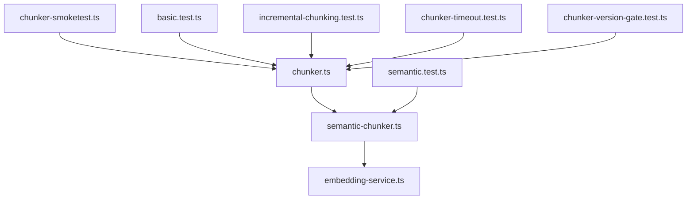
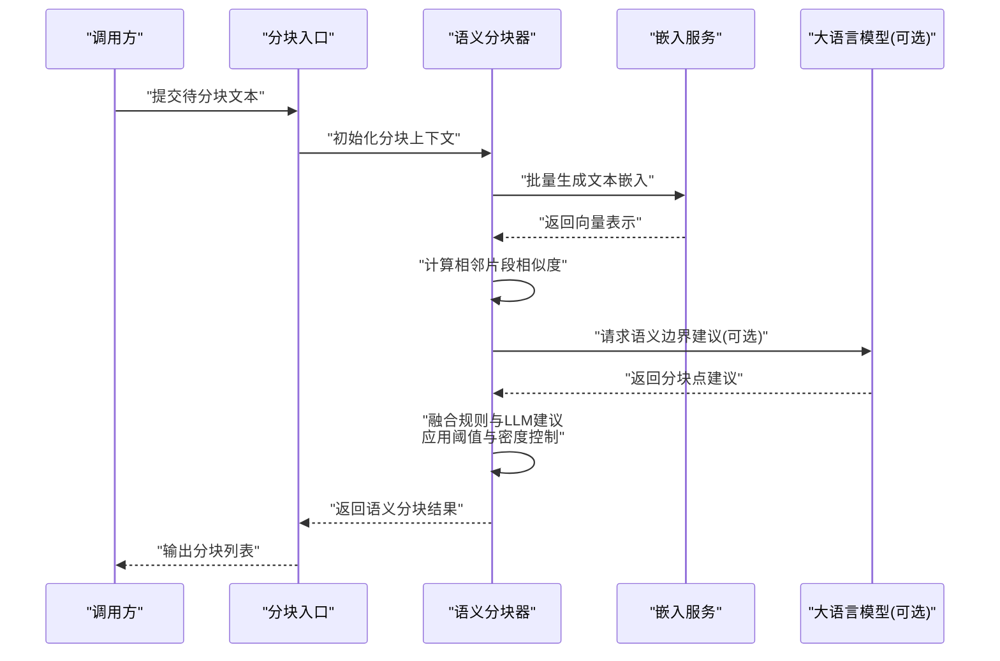
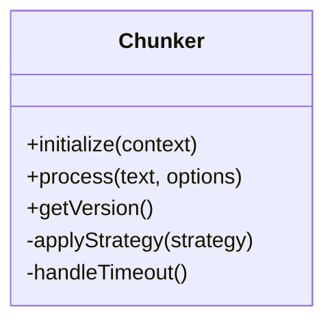
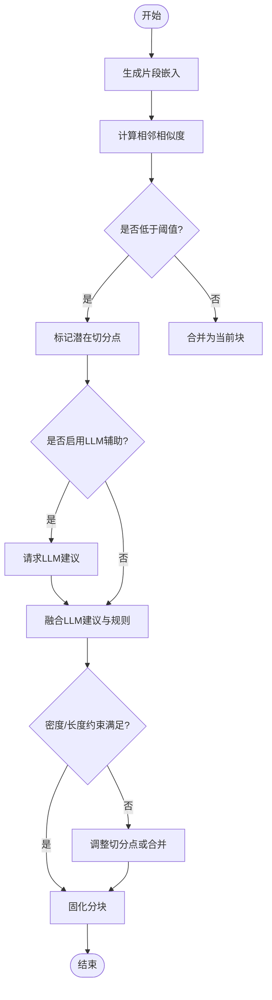
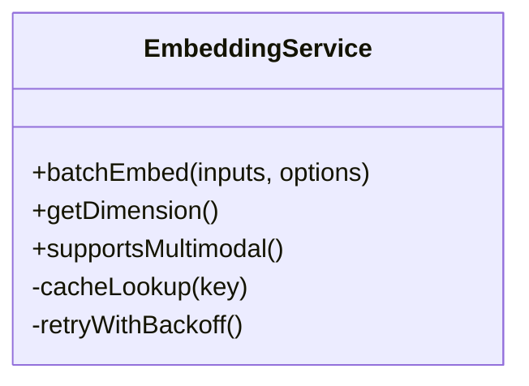
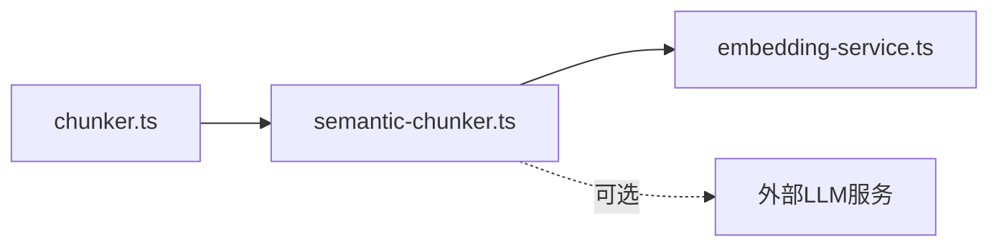

# 语义分块器

<cite>
**本文引用的文件**   
- [src/core/chunker.ts](file://src/core/chunker.ts)
- [src/core/embedding-service.ts](file://src/core/embedding-service.ts)
- [src/core/semantic-chunker.ts](file://src/core/semantic-chunker.ts)
- [scripts/chunker-smoketest.ts](file://scripts/chunker-smoketest.ts)
- [test/chunkers/basic.test.ts](file://test/chunkers/basic.test.ts)
- [test/chunkers/semantic.test.ts](file://test/chunkers/semantic.test.ts)
- [test/chunk-grain-fts.test.ts](file://test/chunk-grain-fts.test.ts)
- [test/incremental-chunking.test.ts](file://test/incremental-chunking.test.ts)
- [test/chunker-timeout.test.ts](file://test/chunker-timeout.test.ts)
- [test/chunker-version-gate.test.ts](file://test/chunker-version-gate.test.ts)
</cite>

## 目录
1. [简介](#简介)
2. [项目结构](#项目结构)
3. [核心组件](#核心组件)
4. [架构总览](#架构总览)
5. [详细组件分析](#详细组件分析)
6. [依赖分析](#依赖分析)
7. [性能考虑](#性能考虑)
8. [故障排查指南](#故障排查指南)
9. [结论](#结论)
10. [附录](#附录)

## 简介
本文件面向“语义分块器”的完整技术文档，聚焦以下目标：
- 基于语义相似性的文本分块算法：文本嵌入生成、相似度计算与聚类策略。
- LLM 辅助分块：如何利用大语言模型理解语义并确定最佳分块点。
- 语义边界检测：识别主题转换与段落逻辑边界的机制。
- 配置参数：相似度阈值、分块密度控制等关键可调项。
- 多语言支持与跨模态语义处理能力说明。

该文档既提供高层概览，也深入到代码级实现细节，帮助读者快速定位相关源码与测试用例，并在工程实践中正确调优与排障。

## 项目结构
语义分块相关代码主要位于 core 模块与脚本、测试中：
- 核心实现：chunker.ts、semantic-chunker.ts、embedding-service.ts
- 端到端冒烟测试：scripts/chunker-smoketest.ts
- 单元测试与集成测试：test/chunkers/*、test/chunk-grain-fts.test.ts、test/incremental-chunking.test.ts、test/chunker-timeout.test.ts、test/chunker-version-gate.test.ts

图表来源
- [src/core/chunker.ts](file://src/core/chunker.ts)
- [src/core/semantic-chunker.ts](file://src/core/semantic-chunker.ts)
- [src/core/embedding-service.ts](file://src/core/embedding-service.ts)
- [scripts/chunker-smoketest.ts](file://scripts/chunker-smoketest.ts)
- [test/chunkers/basic.test.ts](file://test/chunkers/basic.test.ts)
- [test/chunkers/semantic.test.ts](file://test/chunkers/semantic.test.ts)
- [test/incremental-chunking.test.ts](file://test/incremental-chunking.test.ts)
- [test/chunker-timeout.test.ts](file://test/chunker-timeout.test.ts)
- [test/chunker-version-gate.test.ts](file://test/chunker-version-gate.test.ts)

章节来源
- [src/core/chunker.ts](file://src/core/chunker.ts)
- [src/core/semantic-chunker.ts](file://src/core/semantic-chunker.ts)
- [src/core/embedding-service.ts](file://src/core/embedding-service.ts)
- [scripts/chunker-smoketest.ts](file://scripts/chunker-smoketest.ts)
- [test/chunkers/basic.test.ts](file://test/chunkers/basic.test.ts)
- [test/chunkers/semantic.test.ts](file://test/chunkers/semantic.test.ts)
- [test/incremental-chunking.test.ts](file://test/incremental-chunking.test.ts)
- [test/chunker-timeout.test.ts](file://test/chunker-timeout.test.ts)
- [test/chunker-version-gate.test.ts](file://test/chunker-version-gate.test.ts)

## 核心组件
- 分块入口与编排：负责接收原始文本、调用嵌入服务、执行相似度计算与切分策略，输出语义一致的片段集合。
- 语义分块器：在通用分块基础上引入语义相似度与聚类策略，支持 LLM 辅助决策与边界检测。
- 嵌入服务：封装向量化模型调用（文本/多模态），提供批量嵌入、缓存与维度校验等能力。

章节来源
- [src/core/chunker.ts](file://src/core/chunker.ts)
- [src/core/semantic-chunker.ts](file://src/core/semantic-chunker.ts)
- [src/core/embedding-service.ts](file://src/core/embedding-service.ts)

## 架构总览
下图展示了从输入到输出的端到端流程，包括嵌入生成、相似度计算、LLM 辅助决策与最终分块产出。

图表来源
- [src/core/chunker.ts](file://src/core/chunker.ts)
- [src/core/semantic-chunker.ts](file://src/core/semantic-chunker.ts)
- [src/core/embedding-service.ts](file://src/core/embedding-service.ts)

## 详细组件分析

### 组件A：分块入口与编排（chunker.ts）
职责与要点：
- 统一入口：对外暴露分块接口，屏蔽内部实现差异。
- 上下文管理：维护分块状态、进度与版本信息。
- 策略选择：根据配置选择纯相似度分块或 LLM 辅助分块。
- 错误与超时：对嵌入与 LLM 调用进行超时保护与重试策略。

图表来源
- [src/core/chunker.ts](file://src/core/chunker.ts)

章节来源
- [src/core/chunker.ts](file://src/core/chunker.ts)
- [test/chunker-timeout.test.ts](file://test/chunker-timeout.test.ts)
- [test/chunker-version-gate.test.ts](file://test/chunker-version-gate.test.ts)

### 组件B：语义分块器（semantic-chunker.ts）
职责与要点：
- 相似度计算：基于相邻片段嵌入计算余弦相似度，识别语义断裂点。
- 聚类策略：按相似度阈值将连续高相似片段聚合成块，低相似处切分。
- LLM 辅助：当启用时，将候选边界与上下文发送给 LLM，综合其建议调整分块点。
- 边界检测：结合段落结构、标题/分隔符与语义变化，提升边界准确性。
- 密度控制：通过最大/最小块长度与密度参数避免过细或过粗分块。

图表来源
- [src/core/semantic-chunker.ts](file://src/core/semantic-chunker.ts)

章节来源
- [src/core/semantic-chunker.ts](file://src/core/semantic-chunker.ts)
- [test/chunkers/semantic.test.ts](file://test/chunkers/semantic.test.ts)

### 组件C：嵌入服务（embedding-service.ts）
职责与要点：
- 模型适配：支持多种嵌入模型与多模态输入（文本/图像/音频等）。
- 批量优化：批处理请求、并发控制与缓存命中。
- 维度校验：确保输出向量维度一致，失败时回退或告警。
- 错误恢复：网络异常、模型限流时的重试与降级策略。

图表来源
- [src/core/embedding-service.ts](file://src/core/embedding-service.ts)

章节来源
- [src/core/embedding-service.ts](file://src/core/embedding-service.ts)

### 端到端冒烟测试（chunker-smoketest.ts）
- 目的：验证从输入到输出的基本链路可用，覆盖嵌入生成、相似度计算与分块输出。
- 关注点：端到端耗时、分块数量与大小分布、异常路径（空输入、超长文本）。

章节来源
- [scripts/chunker-smoketest.ts](file://scripts/chunker-smoketest.ts)

### 基础与增量分块测试（basic.test.ts、incremental-chunking.test.ts）
- 基础测试：验证默认分块行为、边界条件与错误处理。
- 增量分块：验证对新增/变更内容的局部重分块能力，减少重复计算。

章节来源
- [test/chunkers/basic.test.ts](file://test/chunkers/basic.test.ts)
- [test/incremental-chunking.test.ts](file://test/incremental-chunking.test.ts)

### 粒度与全文检索关联（chunk-grain-fts.test.ts）
- 目的：验证分块粒度与全文检索索引的一致性，确保检索召回质量。
- 关注点：分块大小与检索命中率的关系、边界碎片化影响。

章节来源
- [test/chunk-grain-fts.test.ts](file://test/chunk-grain-fts.test.ts)

## 依赖分析
- 内聚性：语义分块器与嵌入服务解耦良好，通过接口交互；分块入口集中编排策略。
- 耦合度：LLM 辅助为可选依赖，不影响基础相似度分块链路。
- 外部依赖：嵌入服务对接具体模型提供方；LLM 辅助可接入不同厂商模型。
- 循环依赖：未发现直接循环引用，分层清晰。

图表来源
- [src/core/chunker.ts](file://src/core/chunker.ts)
- [src/core/semantic-chunker.ts](file://src/core/semantic-chunker.ts)
- [src/core/embedding-service.ts](file://src/core/embedding-service.ts)

章节来源
- [src/core/chunker.ts](file://src/core/chunker.ts)
- [src/core/semantic-chunker.ts](file://src/core/semantic-chunker.ts)
- [src/core/embedding-service.ts](file://src/core/embedding-service.ts)

## 性能考虑
- 嵌入批处理：提高吞吐，降低延迟；合理设置批次大小与并发上限。
- 相似度计算：优先使用近似最近邻或预计算相似度矩阵，减少重复计算。
- 缓存策略：对稳定文本的嵌入与相似度结果进行缓存，加速增量更新。
- 密度控制：避免过小分块导致检索噪声，过大分块降低召回精度。
- 超时与重试：对嵌入与 LLM 调用设置合理超时与指数退避，保障稳定性。

[本节为通用指导，不直接分析具体文件]

## 故障排查指南
常见问题与定位方法：
- 分块超时：检查 chunker-timeout 相关测试与实现，确认超时阈值与重试策略。
- 版本门控：参考 version gate 测试，确保分块器版本与上游兼容。
- 嵌入维度不一致：查看 embedding-service 的维度校验与回退逻辑。
- 边界不准确：调整相似度阈值与密度参数，必要时启用 LLM 辅助以修正边界。
- 增量分块失效：核对增量触发条件与缓存一致性。

章节来源
- [test/chunker-timeout.test.ts](file://test/chunker-timeout.test.ts)
- [test/chunker-version-gate.test.ts](file://test/chunker-version-gate.test.ts)
- [src/core/embedding-service.ts](file://src/core/embedding-service.ts)

## 结论
语义分块器通过“嵌入+相似度+聚类+LLM辅助”的组合策略，有效提升了文本切分的语义一致性与边界准确性。配合合理的配置参数与性能优化手段，可在多语言与跨模态场景下保持稳定的分块质量。建议在工程中优先采用相似度阈值与密度控制作为基线，再按需启用 LLM 辅助以提升复杂场景下的表现。

[本节为总结性内容，不直接分析具体文件]

## 附录

### 配置参数清单（示例）
- 相似度阈值：用于判定相邻片段是否属于同一语义块，值越低越容易切分。
- 分块密度控制：限制最小/最大块长度，避免过细或过粗分块。
- 最大块数：防止单文档产生过多片段，便于后续检索与存储。
- 嵌入批次大小：平衡吞吐与内存占用。
- LLM 辅助开关：决定是否调用大模型进行边界建议。
- 多语言模式：指定语言或自动检测，影响嵌入模型选择与预处理。
- 跨模态支持：允许图像/音频等多模态输入参与嵌入与相似度计算。

[本节为概念性说明，不直接分析具体文件]