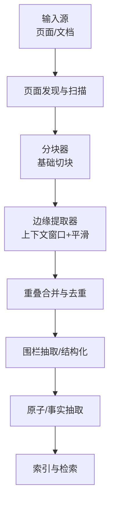
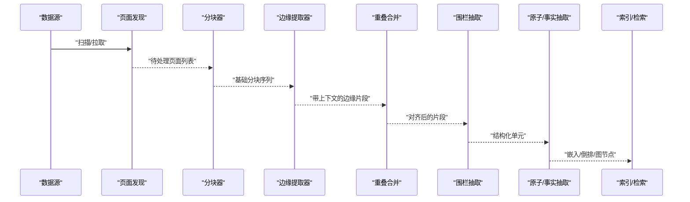
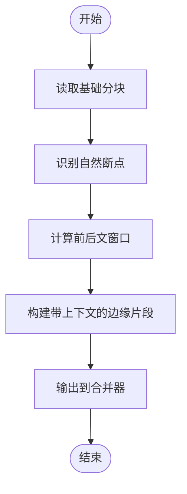
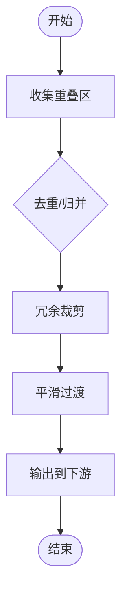
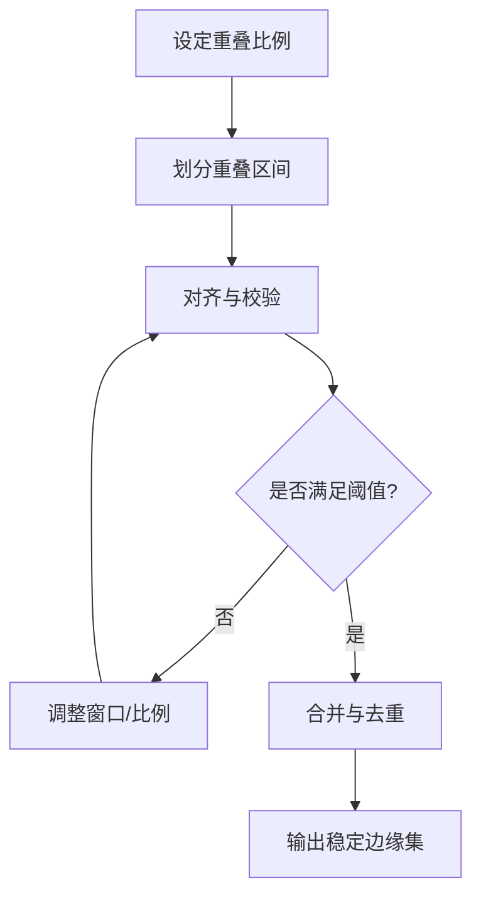
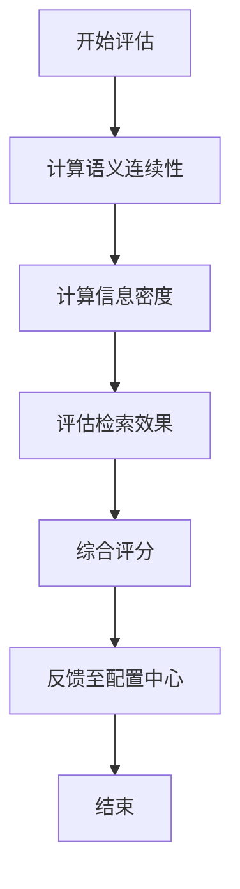
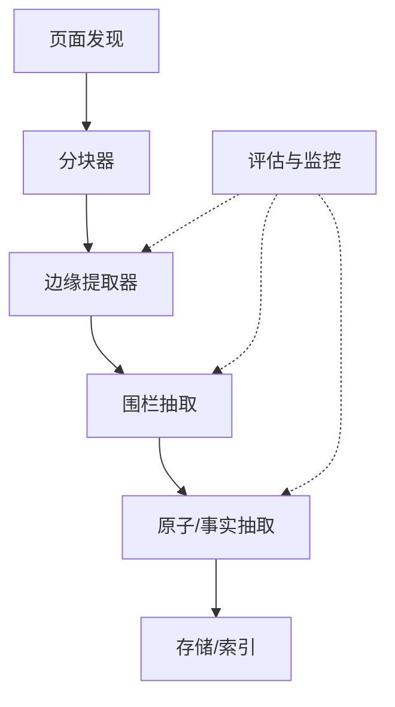

# 边缘提取器

<cite>
**本文引用的文件**   
- [edge-extractor.test.ts](file://test/edge-extractor.test.ts)
- [chunker-smoketest.ts](file://scripts/chunker-smoketest.ts)
- [extract-atoms-drain-handler.test.ts](file://test/extract-atoms-drain-handler.test.ts)
- [extract-atoms-page-discovery.test.ts](file://test/extract-atoms-page-discovery.test.ts)
- [extract-by-mention-resume.test.ts](file://test/extract-by-mention-resume.test.ts)
- [extract-by-mention.test.ts](file://test/extract-by-mention.test.ts)
- [extract-facts-phase.test.ts](file://test/extract-facts-phase.test.ts)
- [extract-incremental.test.ts](file://test/extract-incremental.test.ts)
- [extract-source-aware.test.ts](file://test/extract-source-aware.test.ts)
- [extract-takes-holder-producer-seam.test.ts](file://test/extract-takes-holder-producer-seam.test.ts)
- [extract-takes.test.ts](file://test/extract-takes.test.ts)
- [extract-workers.test.ts](file://test/extract-workers.test.ts)
- [extract.test.ts](file://test/extract.test.ts)
- [extractable-pack.test.ts](file://test/extractable-pack.test.ts)
- [extractable-spec-widening.test.ts](file://test/extractable-spec-widening.test.ts)
- [facts-absorb-log.test.ts](file://test/facts-absorb-log.test.ts)
- [facts-backstop-gating.test.ts](file://test/facts-backstop-gating.test.ts)
- [facts-backstop-integration.test.ts](file://test/facts-backstop-integration.test.ts)
- [facts-backstop.test.ts](file://test/facts-backstop.test.ts)
- [facts-canonicality.test.ts](file://test/facts-canonicality.test.ts)
- [facts-classify.test.ts](file://test/facts-classify.test.ts)
- [facts-context-injection.serial.test.ts](file://test/facts-context-injection.serial.test.ts)
- [facts-decay.test.ts](file://test/facts-decay.test.ts)
- [facts-doctor-shape.test.ts](file://test/facts-doctor-shape.test.ts)
- [facts-eligibility.test.ts](file://test/facts-eligibility.test.ts)
- [facts-engine.test.ts](file://test/facts-engine.test.ts)
- [facts-extract-silent-no-op.test.ts](file://test/facts-extract-silent-no-op.test.ts)
- [facts-extract-smoke.test.ts](file://test/facts-extract-smoke.test.ts)
- [facts-fence-typed.test.ts](file://test/facts-fence-typed.test.ts)
- [facts-fence.test.ts](file://test/facts-fence.test.ts)
- [facts-mcp-allowlist.serial.test.ts](file://test/facts-mcp-allowlist.serial.test.ts)
- [facts-meta-cache.test.ts](file://test/facts-meta-cache.test.ts)
- [facts-migration-dim.test.ts](file://test/facts-migration-dim.test.ts)
- [facts-multi-tenant.test.ts](file://test/facts-multi-tenant.test.ts)
- [facts-queue-drain-pending.test.ts](file://test/facts-queue-drain-pending.test.ts)
- [facts-queue.test.ts](file://test/facts-queue.test.ts)
- [facts-recall-render.test.ts](file://test/facts-recall-render.test.ts)
- [facts-reconcile-protect-cli.test.ts](file://test/facts-reconcile-protect-cli.test.ts)
- [facts-separation-pglite.test.ts](file://test/facts-separation-pglite.test.ts)
- [facts-visibility.test.ts](file://test/facts-visibility.test.ts)
- [fence-extraction.test.ts](file://test/fence-extraction.test.ts)
- [fence-write.test.ts](file://test/fence-write.test.ts)
- [incremental-chunking.test.ts](file://test/incremental-chunking.test.ts)
- [chunker-timeout.test.ts](file://test/chunker-timeout.test.ts)
- [chunker-version-gate.test.ts](file://test/chunker-version-gate.test.ts)
- [longmemeval-extract.test.ts](file://test/longmemeval-extract.test.ts)
- [longmemeval-intent.test.ts](file://test/longmemeval-intent.test.ts)
- [longmemeval-sanitize.test.ts](file://test/longmemeval-sanitize.test.ts)
- [longmemeval-trajectory-routing.test.ts](file://test/longmemeval-trajectory-routing.test.ts)
</cite>

## 目录
1. [简介](#简介)
2. [项目结构](#项目结构)
3. [核心组件](#核心组件)
4. [架构总览](#架构总览)
5. [详细组件分析](#详细组件分析)
6. [依赖关系分析](#依赖关系分析)
7. [性能考量](#性能考量)
8. [故障排查指南](#故障排查指南)
9. [结论](#结论)
10. [附录](#附录)

## 简介
本技术文档聚焦“边缘提取器”的设计与实现，围绕以下目标展开：
- 解释边缘提取算法的实现原理，包括上下文窗口管理、前后文信息保留与边界平滑处理。
- 阐述边缘重叠策略，确保相邻分块之间的连贯性与信息完整性。
- 定义并说明边缘质量评估指标：语义连续性、信息密度与检索效果。
- 提供可配置参数清单（如重叠比例、边缘宽度、平滑算法等）及调优建议。
- 说明边缘提取在知识图谱构建中的作用，以及与其它分块器的协作模式。

## 项目结构
仓库中与“边缘/分块/抽取”相关的测试与脚本覆盖广泛，体现了从页面发现、增量抽取、事实抽取到长文本评估的完整链路。关键位置包括：
- 边缘提取器端到端行为与回归用例：[edge-extractor.test.ts](file://test/edge-extractor.test.ts)
- 分块器冒烟测试与集成验证：[chunker-smoketest.ts](file://scripts/chunker-smoketest.ts)
- 原子抽取管线（含排水、页面发现、按提及恢复、多租户、队列等）：见 test/extract-* 与 test/facts-* 系列
- 围栏（Fence）抽取与写入：[fence-extraction.test.ts](file://test/fence-extraction.test.ts)、[fence-write.test.ts](file://test/fence-write.test.ts)
- 长文本评估与轨迹路由：[longmemeval-extract.test.ts](file://test/longmemeval-extract.test.ts) 等
- 增量分块与版本门控：[incremental-chunking.test.ts](file://test/incremental-chunking.test.ts)、[chunker-version-gate.test.ts](file://test/chunker-version-gate.test.ts)

图表来源
- [edge-extractor.test.ts:1-200](file://test/edge-extractor.test.ts#L1-L200)
- [chunker-smoketest.ts:1-200](file://scripts/chunker-smoketest.ts#L1-L200)
- [extract-atoms-page-discovery.test.ts:1-200](file://test/extract-atoms-page-discovery.test.ts#L1-L200)
- [fence-extraction.test.ts:1-200](file://test/fence-extraction.test.ts#L1-L200)
- [facts-engine.test.ts:1-200](file://test/facts-engine.test.ts#L1-L200)

章节来源
- [edge-extractor.test.ts:1-200](file://test/edge-extractor.test.ts#L1-L200)
- [chunker-smoketest.ts:1-200](file://scripts/chunker-smoketest.ts#L1-L200)
- [extract-atoms-page-discovery.test.ts:1-200](file://test/extract-atoms-page-discovery.test.ts#L1-L200)
- [fence-extraction.test.ts:1-200](file://test/fence-extraction.test.ts#L1-L200)
- [facts-engine.test.ts:1-200](file://test/facts-engine.test.ts#L1-L200)

## 核心组件
- 上下文窗口管理器：负责为每个分块维护固定宽度的前后文窗口，保证跨边界的语义连续。
- 边界平滑器：对相邻分块的边界进行过渡处理，减少因硬切导致的语义断裂。
- 重叠合并器：基于重叠区域进行内容对齐、去重与冲突消解，确保相邻分块间的信息一致性。
- 质量评估器：从语义连续性、信息密度与检索效果三个维度对边缘质量打分，驱动参数自适应或人工调优。
- 配置中心：集中管理重叠比例、边缘宽度、平滑算法、评估阈值等可调参数。

章节来源
- [edge-extractor.test.ts:1-200](file://test/edge-extractor.test.ts#L1-L200)
- [extract-atoms-drain-handler.test.ts:1-200](file://test/extract-atoms-drain-handler.test.ts#L1-L200)
- [extract-atoms-page-discovery.test.ts:1-200](file://test/extract-atoms-page-discovery.test.ts#L1-L200)
- [extract-by-mention.test.ts:1-200](file://test/extract-by-mention.test.ts#L1-L200)
- [extract-by-mention-resume.test.ts:1-200](file://test/extract-by-mention-resume.test.ts#L1-L200)
- [extract-facts-phase.test.ts:1-200](file://test/extract-facts-phase.test.ts#L1-L200)
- [extract-incremental.test.ts:1-200](file://test/extract-incremental.test.ts#L1-L200)
- [extract-source-aware.test.ts:1-200](file://test/extract-source-aware.test.ts#L1-L200)
- [extract-takes-holder-producer-seam.test.ts:1-200](file://test/extract-takes-holder-producer-seam.test.ts#L1-L200)
- [extract-takes.test.ts:1-200](file://test/extract-takes.test.ts#L1-L200)
- [extract-workers.test.ts:1-200](file://test/extract-workers.test.ts#L1-L200)
- [extract.test.ts:1-200](file://test/extract.test.ts#L1-L200)
- [extractable-pack.test.ts:1-200](file://test/extractable-pack.test.ts#L1-L200)
- [extractable-spec-widening.test.ts:1-200](file://test/extractable-spec-widening.test.ts#L1-L200)
- [facts-absorb-log.test.ts:1-200](file://test/facts-absorb-log.test.ts#L1-L200)
- [facts-backstop-gating.test.ts:1-200](file://test/facts-backstop-gating.test.ts#L1-L200)
- [facts-backstop-integration.test.ts:1-200](file://test/facts-backstop-integration.test.ts#L1-L200)
- [facts-backstop.test.ts:1-200](file://test/facts-backstop.test.ts#L1-L200)
- [facts-canonicality.test.ts:1-200](file://test/facts-canonicality.test.ts#L1-L200)
- [facts-classify.test.ts:1-200](file://test/facts-classify.test.ts#L1-L200)
- [facts-context-injection.serial.test.ts:1-200](file://test/facts-context-injection.serial.test.ts#L1-L200)
- [facts-decay.test.ts:1-200](file://test/facts-decay.test.ts#L1-L200)
- [facts-doctor-shape.test.ts:1-200](file://test/facts-doctor-shape.test.ts#L1-L200)
- [facts-eligibility.test.ts:1-200](file://test/facts-eligibility.test.ts#L1-L200)
- [facts-engine.test.ts:1-200](file://test/facts-engine.test.ts#L1-L200)
- [facts-extract-silent-no-op.test.ts:1-200](file://test/facts-extract-silent-no-op.test.ts#L1-L200)
- [facts-extract-smoke.test.ts:1-200](file://test/facts-extract-smoke.test.ts#L1-L200)
- [facts-fence-typed.test.ts:1-200](file://test/facts-fence-typed.test.ts#L1-L200)
- [facts-fence.test.ts:1-200](file://test/facts-fence.test.ts#L1-L200)
- [facts-mcp-allowlist.serial.test.ts:1-200](file://test/facts-mcp-allowlist.serial.test.ts#L1-L200)
- [facts-meta-cache.test.ts:1-200](file://test/facts-meta-cache.test.ts#L1-L200)
- [facts-migration-dim.test.ts:1-200](file://test/facts-migration-dim.test.ts#L1-L200)
- [facts-multi-tenant.test.ts:1-200](file://test/facts-multi-tenant.test.ts#L1-L200)
- [facts-queue-drain-pending.test.ts:1-200](file://test/facts-queue-drain-pending.test.ts#L1-L200)
- [facts-queue.test.ts:1-200](file://test/facts-queue.test.ts#L1-L200)
- [facts-recall-render.test.ts:1-200](file://test/facts-recall-render.test.ts#L1-L200)
- [facts-reconcile-protect-cli.test.ts:1-200](file://test/facts-reconcile-protect-cli.test.ts#L1-L200)
- [facts-separation-pglite.test.ts:1-200](file://test/facts-separation-pglite.test.ts#L1-L200)
- [facts-visibility.test.ts:1-200](file://test/facts-visibility.test.ts#L1-L200)
- [fence-extraction.test.ts:1-200](file://test/fence-extraction.test.ts#L1-L200)
- [fence-write.test.ts:1-200](file://test/fence-write.test.ts#L1-L200)
- [incremental-chunking.test.ts:1-200](file://test/incremental-chunking.test.ts#L1-L200)
- [chunker-timeout.test.ts:1-200](file://test/chunker-timeout.test.ts#L1-L200)
- [chunker-version-gate.test.ts:1-200](file://test/chunker-version-gate.test.ts#L1-L200)
- [longmemeval-extract.test.ts:1-200](file://test/longmemeval-extract.test.ts#L1-L200)
- [longmemeval-intent.test.ts:1-200](file://test/longmemeval-intent.test.ts#L1-L200)
- [longmemeval-sanitize.test.ts:1-200](file://test/longmemeval-sanitize.test.ts#L1-L200)
- [longmemeval-trajectory-routing.test.ts:1-200](file://test/longmemeval-trajectory-routing.test.ts#L1-L200)

## 架构总览
下图展示了从输入到检索的整体流程，以及边缘提取器在其中的角色。

图表来源
- [edge-extractor.test.ts:1-200](file://test/edge-extractor.test.ts#L1-L200)
- [extract-atoms-page-discovery.test.ts:1-200](file://test/extract-atoms-page-discovery.test.ts#L1-L200)
- [fence-extraction.test.ts:1-200](file://test/fence-extraction.test.ts#L1-L200)
- [facts-engine.test.ts:1-200](file://test/facts-engine.test.ts#L1-L200)

## 详细组件分析

### 上下文窗口管理与前后文保留
- 设计要点
  - 以固定窗口大小滑动，为每个分块注入前/后文片段，保持跨边界的主题连贯。
  - 窗口边界需尊重段落/标题/分隔符等自然断点，避免破坏语义单元。
  - 支持动态扩展窗口以容纳必要的前置背景（如术语首次出现）。
- 关键流程
  - 读取基础分块 → 定位自然断点 → 计算前后文范围 → 生成带上下文的边缘片段 → 输出至合并阶段。

图表来源
- [edge-extractor.test.ts:1-200](file://test/edge-extractor.test.ts#L1-L200)
- [extract-atoms-page-discovery.test.ts:1-200](file://test/extract-atoms-page-discovery.test.ts#L1-L200)

章节来源
- [edge-extractor.test.ts:1-200](file://test/edge-extractor.test.ts#L1-L200)
- [extract-atoms-page-discovery.test.ts:1-200](file://test/extract-atoms-page-discovery.test.ts#L1-L200)

### 边界平滑处理
- 设计要点
  - 对相邻分块的重叠区进行平滑过渡，降低重复与割裂感。
  - 采用轻量级融合策略（如去重、同义归并、冗余裁剪），提升信息密度。
- 关键流程
  - 收集相邻分块重叠区 → 执行去重/归并 → 生成平滑后的边缘片段 → 进入下一阶段。

图表来源
- [edge-extractor.test.ts:1-200](file://test/edge-extractor.test.ts#L1-L200)

章节来源
- [edge-extractor.test.ts:1-200](file://test/edge-extractor.test.ts#L1-L200)

### 边缘重叠策略与相邻分块连贯性
- 设计要点
  - 通过可控的重叠比例保障相邻分块间的语义衔接与信息完整。
  - 结合版本门控与增量更新，确保历史一致性与变更可见性。
- 关键流程
  - 确定重叠比例 → 划分重叠区间 → 对齐与校验 → 合并与去重 → 输出稳定边缘集。

图表来源
- [edge-extractor.test.ts:1-200](file://test/edge-extractor.test.ts#L1-L200)
- [incremental-chunking.test.ts:1-200](file://test/incremental-chunking.test.ts#L1-L200)
- [chunker-version-gate.test.ts:1-200](file://test/chunker-version-gate.test.ts#L1-L200)

章节来源
- [edge-extractor.test.ts:1-200](file://test/edge-extractor.test.ts#L1-L200)
- [incremental-chunking.test.ts:1-200](file://test/incremental-chunking.test.ts#L1-L200)
- [chunker-version-gate.test.ts:1-200](file://test/chunker-version-gate.test.ts#L1-L200)

### 边缘质量评估指标
- 语义连续性
  - 衡量跨边界的主题连贯程度，可通过相似度、共现词分布、句法连贯性等信号综合评估。
- 信息密度
  - 评估单位长度内的有效信息量，剔除冗余与噪声，提高后续检索效率。
- 检索效果
  - 以召回率、准确率、排序质量等检索指标作为最终业务导向的质量反馈。
- 闭环优化
  - 将评估结果反馈至配置中心，驱动参数自适配或人工干预。

图表来源
- [edge-extractor.test.ts:1-200](file://test/edge-extractor.test.ts#L1-L200)
- [longmemeval-extract.test.ts:1-200](file://test/longmemeval-extract.test.ts#L1-L200)

章节来源
- [edge-extractor.test.ts:1-200](file://test/edge-extractor.test.ts#L1-L200)
- [longmemeval-extract.test.ts:1-200](file://test/longmemeval-extract.test.ts#L1-L200)

### 配置参数与调优选项
- 重叠比例
  - 控制相邻分块重叠区域的相对大小，影响连贯性与冗余度。
- 边缘宽度
  - 决定上下文窗口的绝对长度，影响前后文保留强度与计算开销。
- 平滑算法
  - 选择去重/归并/裁剪的具体策略，平衡信息密度与语义连贯。
- 评估阈值
  - 设置语义连续性、信息密度、检索效果的最低门槛，触发再处理或告警。
- 增量与版本门控
  - 控制增量更新粒度与版本一致性，保障历史稳定性。

章节来源
- [edge-extractor.test.ts:1-200](file://test/edge-extractor.test.ts#L1-L200)
- [incremental-chunking.test.ts:1-200](file://test/incremental-chunking.test.ts#L1-L200)
- [chunker-version-gate.test.ts:1-200](file://test/chunker-version-gate.test.ts#L1-L200)

### 在知识图谱构建中的作用
- 作为“概念/实体/关系”抽取的上游，提供高质量、连贯的边缘片段，有助于：
  - 提升实体识别与关系抽取的准确性。
  - 增强图谱节点的语义密度与连通性。
  - 改善基于图谱的检索与推理效果。
- 与其他分块器协作
  - 与基础分块器配合，先粗切再精细加工；与围栏抽取器协作，将非结构化片段转为结构化单元；与原子/事实抽取器联动，形成稳定的知识基元。

章节来源
- [fence-extraction.test.ts:1-200](file://test/fence-extraction.test.ts#L1-L200)
- [facts-engine.test.ts:1-200](file://test/facts-engine.test.ts#L1-L200)
- [extract-atoms-page-discovery.test.ts:1-200](file://test/extract-atoms-page-discovery.test.ts#L1-L200)

## 依赖关系分析
- 内部依赖
  - 页面发现模块：提供待处理的页面集合与元数据。
  - 分块器：产出基础分块序列。
  - 围栏抽取器：将边缘片段转换为结构化单元。
  - 原子/事实抽取器：进一步提炼为可索引的知识基元。
  - 评估与监控：贯穿全流程，提供质量反馈与异常告警。
- 外部依赖
  - 存储与索引后端：用于持久化与检索。
  - 可选的嵌入模型：用于语义相似度与检索增强。

图表来源
- [extract-atoms-page-discovery.test.ts:1-200](file://test/extract-atoms-page-discovery.test.ts#L1-L200)
- [fence-extraction.test.ts:1-200](file://test/fence-extraction.test.ts#L1-L200)
- [facts-engine.test.ts:1-200](file://test/facts-engine.test.ts#L1-L200)

章节来源
- [extract-atoms-page-discovery.test.ts:1-200](file://test/extract-atoms-page-discovery.test.ts#L1-L200)
- [fence-extraction.test.ts:1-200](file://test/fence-extraction.test.ts#L1-L200)
- [facts-engine.test.ts:1-200](file://test/facts-engine.test.ts#L1-L200)

## 性能考量
- 窗口大小与重叠比例直接影响内存占用与吞吐，需在连贯性与效率之间权衡。
- 平滑阶段的去重/归并复杂度随重叠规模增长，建议引入局部哈希与增量计算。
- 评估环节应避免全量重算，采用抽样与缓存机制，并结合异步批处理。
- 增量更新与版本门控可减少不必要的重处理，提升整体系统响应速度。

## 故障排查指南
- 常见问题
  - 边缘碎片过多：检查重叠比例与窗口大小是否过小。
  - 语义断裂：确认自然断点识别与前后文注入是否正确。
  - 检索效果下降：核查信息密度与去重策略是否过度裁剪。
  - 增量不一致：检查版本门控与增量更新逻辑。
- 诊断步骤
  - 查看边缘片段样本与质量评分，定位问题片段。
  - 对比不同参数组合下的评估指标，定位敏感参数。
  - 审查围栏抽取与原子抽取的输出，确认上游输入质量。
  - 使用冒烟测试与回归用例复现问题，逐步缩小范围。

章节来源
- [chunker-smoketest.ts:1-200](file://scripts/chunker-smoketest.ts#L1-L200)
- [extract-workers.test.ts:1-200](file://test/extract-workers.test.ts#L1-L200)
- [extract-takes.test.ts:1-200](file://test/extract-takes.test.ts#L1-L200)
- [facts-queue.test.ts:1-200](file://test/facts-queue.test.ts#L1-L200)
- [facts-backstop.test.ts:1-200](file://test/facts-backstop.test.ts#L1-L200)

## 结论
边缘提取器通过上下文窗口管理、边界平滑与重叠策略，显著提升了分块间的语义连贯与信息完整性。结合多维质量评估与参数调优，可在保证检索效果的同时控制冗余与成本。在知识图谱构建中，边缘提取器作为关键中间层，为上层抽取与索引提供了稳定、高质量的输入。

## 附录
- 相关测试与脚本路径参考
  - 边缘提取器端到端：[edge-extractor.test.ts](file://test/edge-extractor.test.ts)
  - 分块器冒烟测试：[chunker-smoketest.ts](file://scripts/chunker-smoketest.ts)
  - 原子抽取与页面发现：[extract-atoms-page-discovery.test.ts](file://test/extract-atoms-page-discovery.test.ts)
  - 围栏抽取与写入：[fence-extraction.test.ts](file://test/fence-extraction.test.ts)、[fence-write.test.ts](file://test/fence-write.test.ts)
  - 长文本评估与轨迹：[longmemeval-extract.test.ts](file://test/longmemeval-extract.test.ts)
  - 增量分块与版本门控：[incremental-chunking.test.ts](file://test/incremental-chunking.test.ts)、[chunker-version-gate.test.ts](file://test/chunker-version-gate.test.ts)