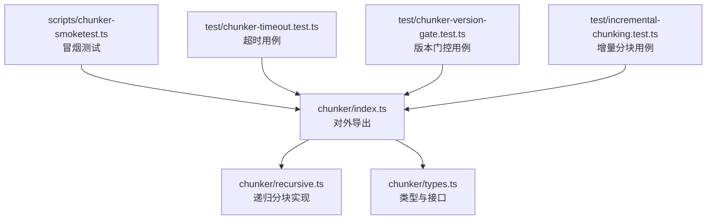
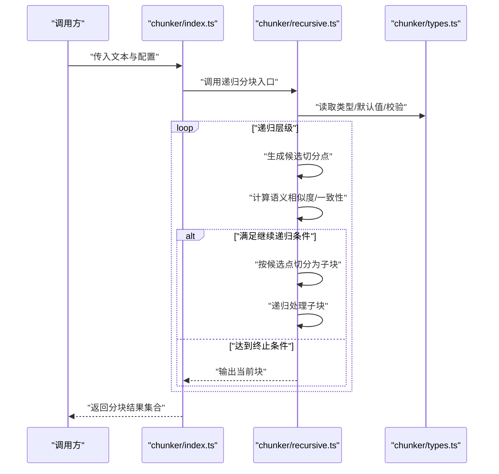
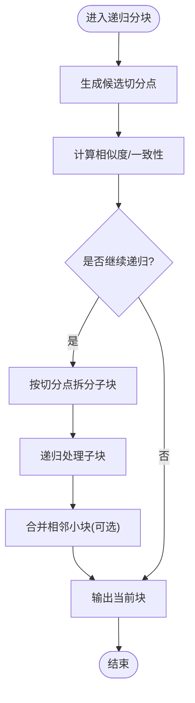
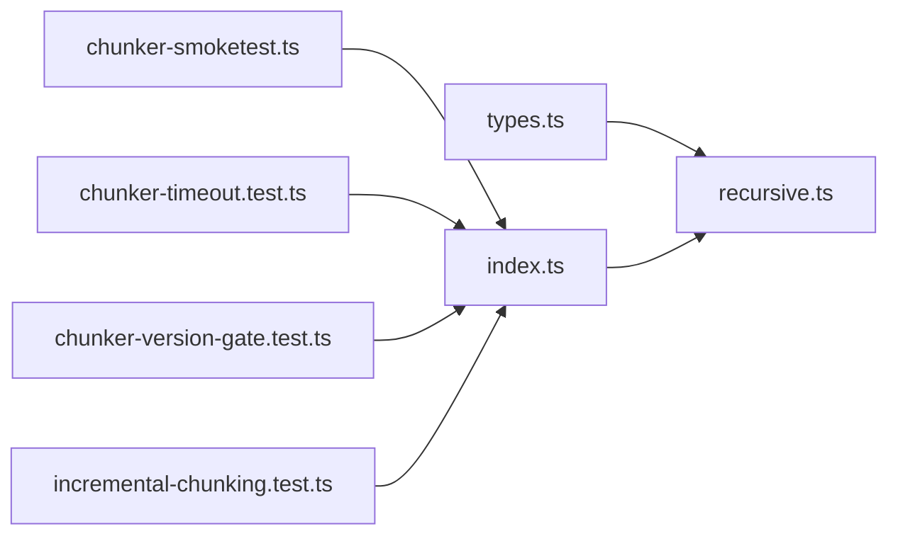

# 递归分块器

<cite>
**本文引用的文件**   
- [src/core/chunker/recursive.ts](file://src/core/chunker/recursive.ts)
- [src/core/chunker/types.ts](file://src/core/chunker/types.ts)
- [src/core/chunker/index.ts](file://src/core/chunker/index.ts)
- [scripts/chunker-smoketest.ts](file://scripts/chunker-smoketest.ts)
- [test/chunker-timeout.test.ts](file://test/chunker-timeout.test.ts)
- [test/chunker-version-gate.test.ts](file://test/chunker-version-gate.test.ts)
- [test/incremental-chunking.test.ts](file://test/incremental-chunking.test.ts)
</cite>

## 目录
1. [简介](#简介)
2. [项目结构](#项目结构)
3. [核心组件](#核心组件)
4. [架构总览](#架构总览)
5. [详细组件分析](#详细组件分析)
6. [依赖分析](#依赖分析)
7. [性能考量](#性能考量)
8. [故障排查指南](#故障排查指南)
9. [结论](#结论)
10. [附录](#附录)

## 简介
本文件面向“递归分块器”的实现与使用，系统性阐述其算法思想、层次化分割策略、递归深度控制、粒度调整与边界优化，并重点说明中文语义分块的适配要点（分词、语义单元识别与文化语境）。文档同时给出终止条件、质量评估机制以及关键配置项的调优建议，帮助读者在工程实践中稳定落地。

## 项目结构
仓库中与递归分块相关的核心代码位于 src/core/chunker 目录，配套测试与冒烟脚本位于 test 与 scripts 目录。整体组织遵循“类型定义 + 实现 + 导出入口”的分层方式：
- 类型与接口：集中定义分块配置、结果结构与回调契约
- 实现模块：提供递归分块主流程、切分策略、边界处理与质量评估
- 导出入口：对外暴露统一 API，便于上层编排调用
- 测试与脚本：覆盖超时、版本门控、增量分块等场景

图表来源
- [src/core/chunker/index.ts](file://src/core/chunker/index.ts)
- [src/core/chunker/recursive.ts](file://src/core/chunker/recursive.ts)
- [src/core/chunker/types.ts](file://src/core/chunker/types.ts)
- [scripts/chunker-smoketest.ts](file://scripts/chunker-smoketest.ts)
- [test/chunker-timeout.test.ts](file://test/chunker-timeout.test.ts)
- [test/chunker-version-gate.test.ts](file://test/chunker-version-gate.test.ts)
- [test/incremental-chunking.test.ts](file://test/incremental-chunking.test.ts)

章节来源
- [src/core/chunker/index.ts](file://src/core/chunker/index.ts)
- [src/core/chunker/recursive.ts](file://src/core/chunker/recursive.ts)
- [src/core/chunker/types.ts](file://src/core/chunker/types.ts)
- [scripts/chunker-smoketest.ts](file://scripts/chunker-smoketest.ts)
- [test/chunker-timeout.test.ts](file://test/chunker-timeout.test.ts)
- [test/chunker-version-gate.test.ts](file://test/chunker-version-gate.test.ts)
- [test/incremental-chunking.test.ts](file://test/incremental-chunking.test.ts)

## 核心组件
- 递归分块主流程：负责将输入文本按策略进行层次化切分，并在每层评估是否继续递归或输出当前块
- 切分策略：支持基于规则（如段落、标题、分隔符）与语义相似度驱动的自适应切分
- 边界优化：对跨段落的语义连贯性进行合并与裁剪，避免破坏上下文完整性
- 中文适配：结合中文分词与语义单元识别，考虑文化语境与表达习惯，提升切分质量
- 终止条件：通过最大递归深度、最小分块大小、相似度阈值等参数控制停止
- 质量评估：对每个候选块计算内部一致性与外部可检索性指标，作为是否继续递归的依据

章节来源
- [src/core/chunker/recursive.ts](file://src/core/chunker/recursive.ts)
- [src/core/chunker/types.ts](file://src/core/chunker/types.ts)

## 架构总览
下图展示递归分块器的端到端流程：从输入文本开始，逐层尝试切分；若满足继续递归的条件则进入下一层，否则输出当前块；最终汇总所有块供下游索引或检索使用。

图表来源
- [src/core/chunker/index.ts](file://src/core/chunker/index.ts)
- [src/core/chunker/recursive.ts](file://src/core/chunker/recursive.ts)
- [src/core/chunker/types.ts](file://src/core/chunker/types.ts)

## 详细组件分析

### 递归分块主流程（recursive.ts）
- 设计模式：采用“策略+工厂”的组合，外层为递归调度，内层为切分策略与评估函数
- 数据流：输入文本 → 候选切分点生成 → 相似度/一致性评估 → 决策（继续递归或输出）→ 子块聚合
- 错误处理：对异常切分点、空块、超长片段进行兜底处理，保证鲁棒性
- 并发与资源：在合适层级引入批处理与限流，避免内存峰值过高

图表来源
- [src/core/chunker/recursive.ts](file://src/core/chunker/recursive.ts)

章节来源
- [src/core/chunker/recursive.ts](file://src/core/chunker/recursive.ts)

### 类型与配置（types.ts）
- 核心配置项：
  - 最大递归深度：限制递归层级，防止过深导致性能问题
  - 最小分块大小：低于该阈值的块将被合并或丢弃
  - 语义相似度阈值：用于判断是否继续递归或输出当前块
  - 切分策略选择：规则驱动或语义驱动，或两者混合
  - 边界优化开关：是否执行跨段合并与尾部裁剪
- 数据结构：
  - 分块结果：包含内容、元信息（来源、位置、长度）、质量评分
  - 评估指标：内部一致性、外部可检索性、冗余度等
- 默认值与校验：提供合理默认值并对非法输入进行快速失败

章节来源
- [src/core/chunker/types.ts](file://src/core/chunker/types.ts)

### 对外导出与集成（index.ts）
- 统一入口：封装递归分块调用，屏蔽内部复杂度
- 参数透传：将用户配置映射到内部类型与默认值
- 结果标准化：确保返回结构符合上游消费约定
- 扩展点：预留插件式策略注册位，便于后续接入新的切分或评估方法

章节来源
- [src/core/chunker/index.ts](file://src/core/chunker/index.ts)

### 中文语义分块的特殊处理
- 中文分词：在候选切分点生成阶段引入中文分词，提高切分准确性
- 语义单元识别：结合句法与语义特征，识别完整语义单元，避免断句不当
- 文化语境考虑：对成语、固定搭配、专有名词等进行保护，减少误切
- 标点与空白：针对中文标点与全角/半角差异进行规范化处理
- 领域适配：允许通过词典或规则注入领域术语，增强切分鲁棒性

章节来源
- [src/core/chunker/recursive.ts](file://src/core/chunker/recursive.ts)
- [src/core/chunker/types.ts](file://src/core/chunker/types.ts)

### 终止条件与质量评估
- 终止条件：
  - 达到最大递归深度
  - 当前块长度小于最小分块大小
  - 相似度高于阈值且无需进一步细分
- 质量评估：
  - 内部一致性：衡量块内语义连贯程度
  - 外部可检索性：评估块在检索任务中的有效性
  - 冗余度：检测重复或高度相似片段，必要时合并或剔除

章节来源
- [src/core/chunker/recursive.ts](file://src/core/chunker/recursive.ts)
- [src/core/chunker/types.ts](file://src/core/chunker/types.ts)

### 边界优化策略
- 跨段合并：对相邻小块进行语义合并，保持上下文完整
- 尾部裁剪：去除无意义的尾部碎片，避免噪声影响检索
- 重叠窗口：在必要场景下引入可控重叠，提升召回率
- 回退策略：当切分失败时回退到更粗粒度的切分方案

章节来源
- [src/core/chunker/recursive.ts](file://src/core/chunker/recursive.ts)

## 依赖分析
递归分块器主要依赖类型定义与自身实现，测试与脚本通过入口模块间接依赖核心逻辑。依赖关系清晰，耦合度低，便于替换与扩展。

图表来源
- [src/core/chunker/types.ts](file://src/core/chunker/types.ts)
- [src/core/chunker/recursive.ts](file://src/core/chunker/recursive.ts)
- [src/core/chunker/index.ts](file://src/core/chunker/index.ts)
- [scripts/chunker-smoketest.ts](file://scripts/chunker-smoketest.ts)
- [test/chunker-timeout.test.ts](file://test/chunker-timeout.test.ts)
- [test/chunker-version-gate.test.ts](file://test/chunker-version-gate.test.ts)
- [test/incremental-chunking.test.ts](file://test/incremental-chunking.test.ts)

章节来源
- [src/core/chunker/types.ts](file://src/core/chunker/types.ts)
- [src/core/chunker/recursive.ts](file://src/core/chunker/recursive.ts)
- [src/core/chunker/index.ts](file://src/core/chunker/index.ts)
- [scripts/chunker-smoketest.ts](file://scripts/chunker-smoketest.ts)
- [test/chunker-timeout.test.ts](file://test/chunker-timeout.test.ts)
- [test/chunker-version-gate.test.ts](file://test/chunker-version-gate.test.ts)
- [test/incremental-chunking.test.ts](file://test/incremental-chunking.test.ts)

## 性能考量
- 递归深度控制：设置合理的最大递归深度，避免指数级增长
- 批量处理：在高层级进行批量切分与评估，降低系统开销
- 相似度计算优化：采用近似最近邻或哈希技巧加速评估
- 内存管理：及时释放中间结果，避免长文本导致的内存峰值
- 超时与熔断：在长时间运行场景下启用超时保护，防止阻塞

[本节为通用指导，不直接分析具体文件]

## 故障排查指南
- 超时问题：检查递归深度与切分策略，必要时增大超时阈值或简化策略
- 版本门控：确认分块器版本与上游兼容，避免接口变更导致失败
- 增量分块：验证增量标记与状态一致性，确保仅处理变更部分
- 日志与指标：关注分块数量、平均长度、相似度分布等指标，定位异常

章节来源
- [test/chunker-timeout.test.ts](file://test/chunker-timeout.test.ts)
- [test/chunker-version-gate.test.ts](file://test/chunker-version-gate.test.ts)
- [test/incremental-chunking.test.ts](file://test/incremental-chunking.test.ts)

## 结论
递归分块器通过层次化分割与自适应策略，在保持语义完整性的前提下实现了高效、稳定的文本切分。配合中文语义适配与边界优化，能够显著提升检索与索引质量。通过合理的配置与监控，可在不同业务场景中取得良好效果。

[本节为总结性内容，不直接分析具体文件]

## 附录
- 配置项速查：
  - 最大递归深度：建议根据文本复杂度与性能预算设定
  - 最小分块大小：过小会导致碎片过多，过大可能丢失细节
  - 语义相似度阈值：越高越保守，越低越激进
  - 切分策略：规则优先适合结构化文本，语义优先适合自由文本
  - 边界优化：开启后可改善上下文连贯性，但会增加计算成本
- 调优建议：
  - 先以默认配置跑通基准集，再逐步调整阈值与策略
  - 结合业务指标（如检索命中率）进行闭环优化
  - 对中文文本引入领域词典与术语库，提升切分精度

[本节为补充信息，不直接分析具体文件]