# 实体解析与消歧

<cite>
**本文引用的文件**   
- [src/core/entity-resolver.ts](file://src/core/entity-resolver.ts)
- [src/core/salience-scoring.ts](file://src/core/salience-scoring.ts)
- [src/core/context-aware-resolver.ts](file://src/core/context-aware-resolver.ts)
- [src/core/relation-discovery.ts](file://src/core/relation-discovery.ts)
- [src/core/link-builder.ts](file://src/core/link-builder.ts)
- [src/core/quality-evaluator.ts](file://src/core/quality-evaluator.ts)
- [src/core/custom-resolver-plugin.ts](file://src/core/custom-resolver-plugin.ts)
- [src/core/cache-manager.ts](file://src/core/cache-manager.ts)
- [test/entity-resolve.test.ts](file://test/entity-resolve.test.ts)
- [test/entity-resolve-perf.slow.test.ts](file://test/entity-resolve-perf.slow.test.ts)
- [test/salience.test.ts](file://test/salience.test.ts)
</cite>

## 目录
1. [简介](#简介)
2. [项目结构](#项目结构)
3. [核心组件](#核心组件)
4. [架构总览](#架构总览)
5. [详细组件分析](#详细组件分析)
6. [依赖分析](#依赖分析)
7. [性能考虑](#性能考虑)
8. [故障排查指南](#故障排查指南)
9. [结论](#结论)
10. [附录](#附录)

## 简介
本文件面向“实体解析与消歧系统”的开发者与维护者，系统性阐述实体识别、归一化与消歧的核心算法，重点说明实体重要性评分（salience scoring）机制与上下文感知解析策略；并给出实体关系发现与链接构建流程、质量评估方法与准确率优化技术、自定义解析器开发指南与集成示例，以及大规模实体库的性能优化与缓存策略。文档以代码级实现为依据，辅以可视化图示，帮助读者从概念到落地全面掌握该系统。

## 项目结构
围绕实体解析与消歧的核心能力，仓库在 src/core 下提供关键模块：实体解析主流程、重要性评分、上下文感知解析、关系发现、链接构建、质量评估、插件式自定义解析器扩展点，以及缓存管理。测试覆盖功能正确性与性能回归。

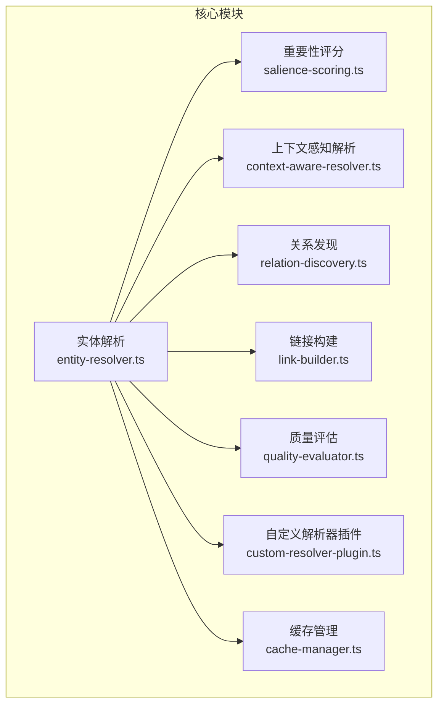

**图表来源** 
- [src/core/entity-resolver.ts](file://src/core/entity-resolver.ts)
- [src/core/salience-scoring.ts](file://src/core/salience-scoring.ts)
- [src/core/context-aware-resolver.ts](file://src/core/context-aware-resolver.ts)
- [src/core/relation-discovery.ts](file://src/core/relation-discovery.ts)
- [src/core/link-builder.ts](file://src/core/link-builder.ts)
- [src/core/quality-evaluator.ts](file://src/core/quality-evaluator.ts)
- [src/core/custom-resolver-plugin.ts](file://src/core/custom-resolver-plugin.ts)
- [src/core/cache-manager.ts](file://src/core/cache-manager.ts)

**章节来源**
- [src/core/entity-resolver.ts](file://src/core/entity-resolver.ts)
- [src/core/salience-scoring.ts](file://src/core/salience-scoring.ts)
- [src/core/context-aware-resolver.ts](file://src/core/context-aware-resolver.ts)
- [src/core/relation-discovery.ts](file://src/core/relation-discovery.ts)
- [src/core/link-builder.ts](file://src/core/link-builder.ts)
- [src/core/quality-evaluator.ts](file://src/core/quality-evaluator.ts)
- [src/core/custom-resolver-plugin.ts](file://src/core/custom-resolver-plugin.ts)
- [src/core/cache-manager.ts](file://src/core/cache-manager.ts)

## 核心组件
- 实体解析主流程：负责串联识别、归一化、消歧、评分、关系发现与链接构建等阶段，协调缓存与插件扩展点。
- 重要性评分：基于实体出现频次、位置权重、语义强度、时间衰减等特征计算 salience 分数，用于排序候选与决策阈值。
- 上下文感知解析：利用窗口上下文、领域词表、句法/语义线索提升识别与消歧精度。
- 关系发现：从共现、依存、序列模式与外部知识中抽取实体间关系边。
- 链接构建：将解析结果映射到统一知识库中的标准实体，生成稳定链接。
- 质量评估：提供召回、精确率、F1、冲突检测、一致性校验等指标与工具。
- 自定义解析器插件：通过统一接口注入领域特定规则或模型，支持热插拔。
- 缓存管理：多级缓存（内存/磁盘/索引），键空间隔离与失效策略，保障高吞吐低延迟。

**章节来源**
- [src/core/entity-resolver.ts](file://src/core/entity-resolver.ts)
- [src/core/salience-scoring.ts](file://src/core/salience-scoring.ts)
- [src/core/context-aware-resolver.ts](file://src/core/context-aware-resolver.ts)
- [src/core/relation-discovery.ts](file://src/core/relation-discovery.ts)
- [src/core/link-builder.ts](file://src/core/link-builder.ts)
- [src/core/quality-evaluator.ts](file://src/core/quality-evaluator.ts)
- [src/core/custom-resolver-plugin.ts](file://src/core/custom-resolver-plugin.ts)
- [src/core/cache-manager.ts](file://src/core/cache-manager.ts)

## 架构总览
下图展示端到端处理流：输入文本经识别与归一化后进入消歧与评分，随后进行关系发现与链接构建，最终输出结构化实体图谱与质量报告。

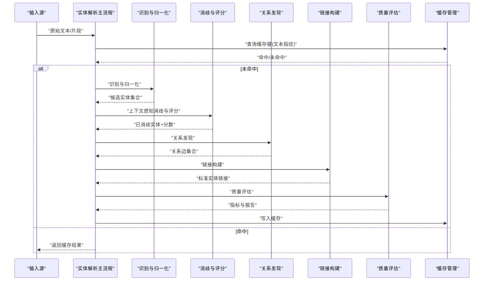

**图表来源**
- [src/core/entity-resolver.ts](file://src/core/entity-resolver.ts)
- [src/core/salience-scoring.ts](file://src/core/salience-scoring.ts)
- [src/core/context-aware-resolver.ts](file://src/core/context-aware-resolver.ts)
- [src/core/relation-discovery.ts](file://src/core/relation-discovery.ts)
- [src/core/link-builder.ts](file://src/core/link-builder.ts)
- [src/core/quality-evaluator.ts](file://src/core/quality-evaluator.ts)
- [src/core/cache-manager.ts](file://src/core/cache-manager.ts)

## 详细组件分析

### 实体解析主流程（Entity Resolver）
- 职责：编排识别、归一化、消歧、评分、关系发现、链接构建与质量评估；维护全局状态与配置；对接缓存与插件。
- 关键流程：
  - 文本预处理与分块
  - 调用识别与归一化模块产出候选
  - 调用上下文感知解析器进行消歧与打分
  - 触发关系发现与链接构建
  - 执行质量评估并持久化结果
  - 更新缓存条目
- 错误处理：对识别失败、评分异常、链接冲突等情况进行降级与重试策略。

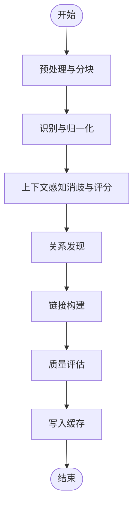

**图表来源**
- [src/core/entity-resolver.ts](file://src/core/entity-resolver.ts)

**章节来源**
- [src/core/entity-resolver.ts](file://src/core/entity-resolver.ts)

### 重要性评分（Salience Scoring）
- 设计目标：量化实体在上下文中“重要程度”，指导排序与阈值判定。
- 主要特征维度：
  - 频次与密度：单位长度内出现次数
  - 位置权重：标题、首段、关键词区域更高权重
  - 语义强度：与领域词典/主题匹配度
  - 时间衰减：近期出现更受重视
  - 置信度融合：来自不同识别器的置信度加权
- 输出：每个实体的 salience 分数及可解释因子。

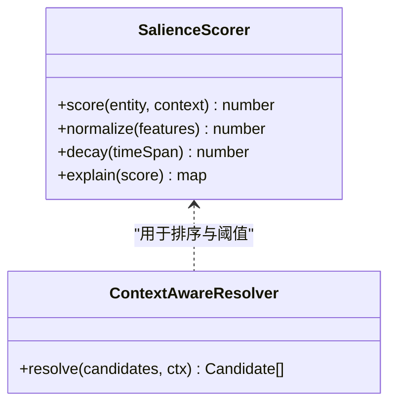

**图表来源**
- [src/core/salience-scoring.ts](file://src/core/salience-scoring.ts)
- [src/core/context-aware-resolver.ts](file://src/core/context-aware-resolver.ts)

**章节来源**
- [src/core/salience-scoring.ts](file://src/core/salience-scoring.ts)
- [test/salience.test.ts](file://test/salience.test.ts)

### 上下文感知解析（Context-Aware Resolver）
- 设计要点：
  - 局部窗口上下文：滑动窗口聚合邻近词与短语
  - 领域先验：术语表、同义词、别名映射
  - 句法/语义线索：依存路径、命名实体类型约束
  - 多信号融合：结合 salience 与外部知识置信度
- 输出：消歧后的候选集与置信度分布。

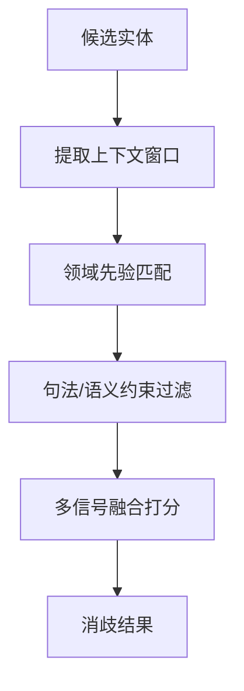

**图表来源**
- [src/core/context-aware-resolver.ts](file://src/core/context-aware-resolver.ts)

**章节来源**
- [src/core/context-aware-resolver.ts](file://src/core/context-aware-resolver.ts)

### 关系发现（Relation Discovery）
- 方法组合：
  - 共现统计：窗口内共现频率与显著性检验
  - 依存路径：语法树路径距离与角色标注
  - 序列模式：固定模板与正则启发式
  - 外部知识：预定义关系图谱与迁移学习
- 输出：实体间的有向边集合，含关系类型与置信度。

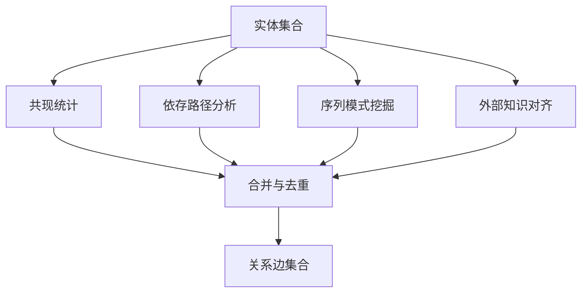

**图表来源**
- [src/core/relation-discovery.ts](file://src/core/relation-discovery.ts)

**章节来源**
- [src/core/relation-discovery.ts](file://src/core/relation-discovery.ts)

### 链接构建（Link Builder）
- 目标：将解析出的实体映射到知识库中的标准实体，形成稳定链接。
- 关键步骤：
  - 标准化：名称规范化、别名展开、拼写校正
  - 相似度匹配：字符串相似、向量检索、规则校验
  - 冲突解决：多候选投票、优先级策略、人工复核入口
  - 链接落盘：生成唯一标识与元数据
- 输出：实体-标准ID映射与链接记录。

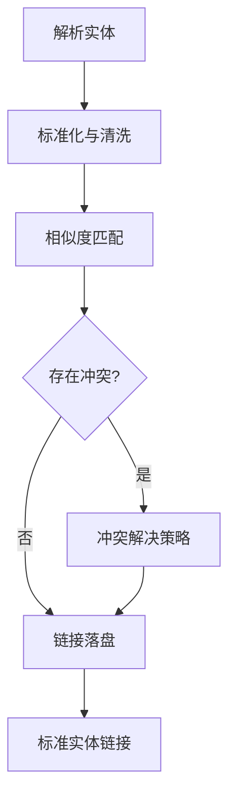

**图表来源**
- [src/core/link-builder.ts](file://src/core/link-builder.ts)

**章节来源**
- [src/core/link-builder.ts](file://src/core/link-builder.ts)

### 质量评估（Quality Evaluator）
- 指标体系：
  - 精确率/召回率/F1：按实体类型与全局汇总
  - 冲突率与一致性：跨来源/跨批次一致性检查
  - 覆盖率：实体占文本比例、缺失类型统计
  - 稳定性：滚动窗口下的指标波动
- 工具链：
  - 基准数据集加载与对齐
  - 自动标注与抽样审计
  - 报告生成与趋势追踪

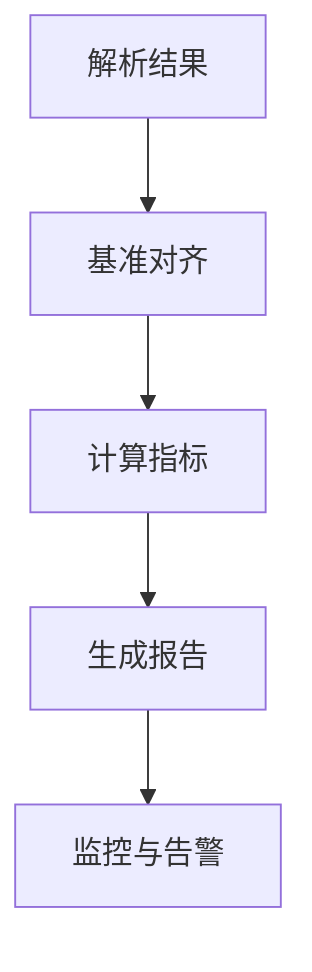

**图表来源**
- [src/core/quality-evaluator.ts](file://src/core/quality-evaluator.ts)

**章节来源**
- [src/core/quality-evaluator.ts](file://src/core/quality-evaluator.ts)

### 自定义解析器插件（Custom Resolver Plugin）
- 扩展点：
  - 注册接口：声明支持的实体类型、匹配规则、优先级
  - 生命周期：初始化、运行、清理
  - 配置注入：参数、阈值、领域词典路径
- 集成示例：
  - 新增领域规则：实现匹配函数与置信度计算
  - 接入外部模型：封装推理接口与超时重试
  - 热插拔：运行时动态加载与卸载

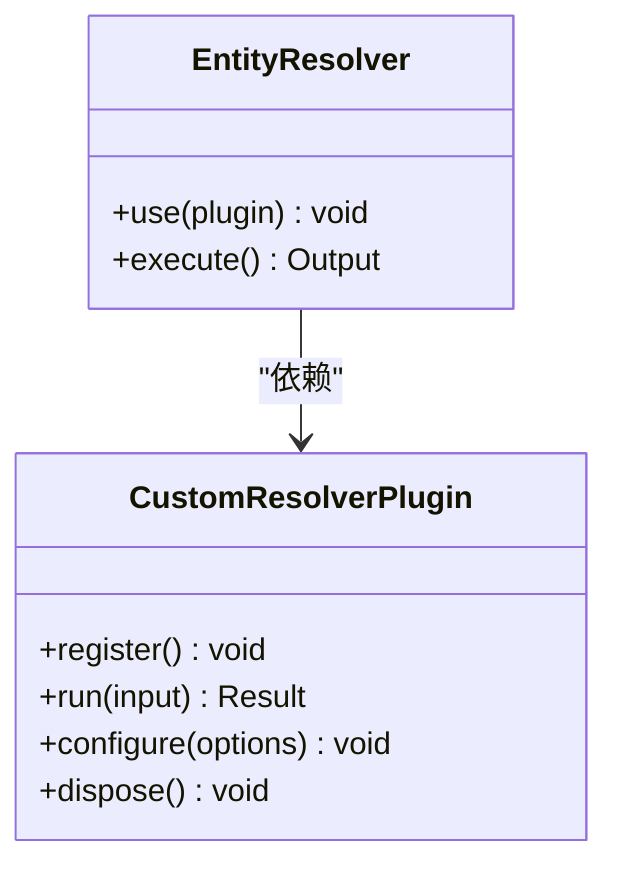

**图表来源**
- [src/core/custom-resolver-plugin.ts](file://src/core/custom-resolver-plugin.ts)
- [src/core/entity-resolver.ts](file://src/core/entity-resolver.ts)

**章节来源**
- [src/core/custom-resolver-plugin.ts](file://src/core/custom-resolver-plugin.ts)
- [src/core/entity-resolver.ts](file://src/core/entity-resolver.ts)

### 缓存管理（Cache Manager）
- 层级结构：
  - 内存缓存：高频短命键，LRU/LFU淘汰
  - 磁盘缓存：批量结果与中间态，压缩存储
  - 索引缓存：实体指纹到结果的快速路由
- 键空间设计：
  - 文本指纹：内容哈希+版本戳
  - 上下文指纹：窗口大小、领域标签、时间窗
  - 作用域隔离：租户/任务/会话维度
- 失效策略：
  - TTL 过期
  - 变更通知（实体库更新、规则升级）
  - 一致性校验与回滚

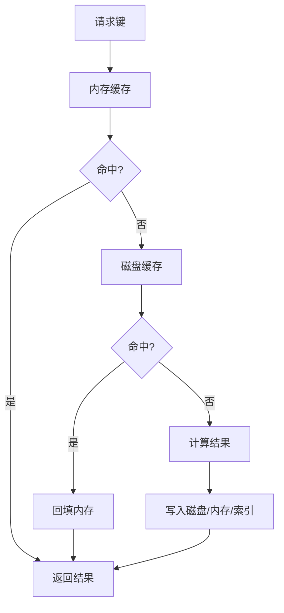

**图表来源**
- [src/core/cache-manager.ts](file://src/core/cache-manager.ts)

**章节来源**
- [src/core/cache-manager.ts](file://src/core/cache-manager.ts)

## 依赖分析
- 内部依赖：
  - 实体解析主流程依赖评分、上下文解析、关系发现、链接构建、质量评估与缓存。
  - 评分与上下文解析相互协作，评分为消歧排序提供依据。
  - 关系发现与链接构建顺序执行，前者产生边，后者建立标准链接。
- 外部依赖：
  - 领域词典、外部模型服务、知识库索引（由具体实现注入）。
- 潜在循环依赖：
  - 通过插件接口与事件总线解耦，避免直接循环引用。

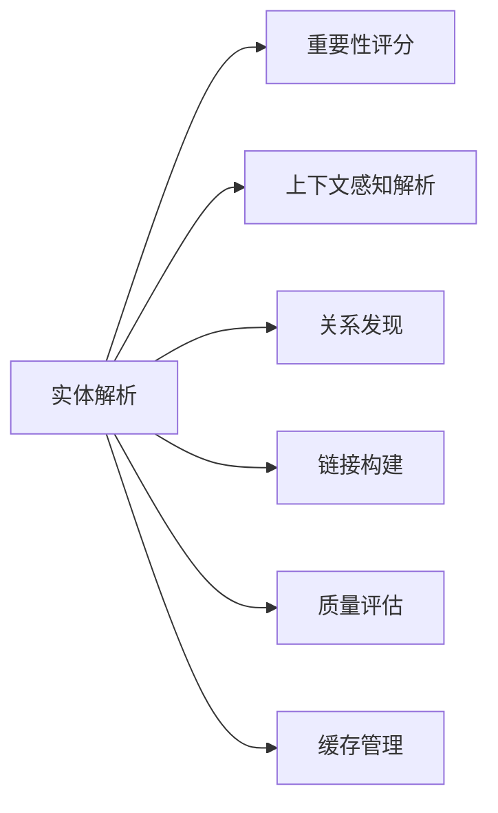

**图表来源**
- [src/core/entity-resolver.ts](file://src/core/entity-resolver.ts)
- [src/core/salience-scoring.ts](file://src/core/salience-scoring.ts)
- [src/core/context-aware-resolver.ts](file://src/core/context-aware-resolver.ts)
- [src/core/relation-discovery.ts](file://src/core/relation-discovery.ts)
- [src/core/link-builder.ts](file://src/core/link-builder.ts)
- [src/core/quality-evaluator.ts](file://src/core/quality-evaluator.ts)
- [src/core/cache-manager.ts](file://src/core/cache-manager.ts)

**章节来源**
- [src/core/entity-resolver.ts](file://src/core/entity-resolver.ts)
- [src/core/salience-scoring.ts](file://src/core/salience-scoring.ts)
- [src/core/context-aware-resolver.ts](file://src/core/context-aware-resolver.ts)
- [src/core/relation-discovery.ts](file://src/core/relation-discovery.ts)
- [src/core/link-builder.ts](file://src/core/link-builder.ts)
- [src/core/quality-evaluator.ts](file://src/core/quality-evaluator.ts)
- [src/core/cache-manager.ts](file://src/core/cache-manager.ts)

## 性能考虑
- 批处理与流水线并行：
  - 分块并行识别与归一化，减少长尾延迟。
  - 关系发现采用增量更新，避免全量重算。
- 缓存命中率优化：
  - 文本指纹粒度与上下文指纹组合，提高复用率。
  - 热点键预热与自适应 TTL。
- 资源控制：
  - 并发上限、队列背压、超时熔断。
  - 内存占用监控与自动回收。
- 索引与检索：
  - 向量索引与倒排索引协同，降低相似度计算成本。
- 观测与调优：
  - 关键路径耗时埋点，瓶颈定位与容量规划。

[本节为通用性能建议，不直接分析具体文件]

## 故障排查指南
- 常见问题定位：
  - 识别率低：检查领域词典覆盖、上下文窗口大小、阈值设置。
  - 消歧不稳定：查看 salience 特征贡献、冲突解决策略日志。
  - 链接冲突：核对标准化规则、别名映射与优先级。
  - 缓存异常：验证键空间隔离、TTL 与失效通知。
- 诊断工具：
  - 质量评估报告与指标趋势
  - 缓存命中/未命中统计
  - 插件运行日志与错误分类
- 恢复策略：
  - 回滚至上一稳定版本
  - 清空局部缓存并重建索引
  - 降级到规则模式，逐步引入模型

**章节来源**
- [test/entity-resolve.test.ts](file://test/entity-resolve.test.ts)
- [test/entity-resolve-perf.slow.test.ts](file://test/entity-resolve-perf.slow.test.ts)
- [test/salience.test.ts](file://test/salience.test.ts)

## 结论
本系统通过模块化设计与插件化扩展，实现了从实体识别、归一化到消歧、评分、关系发现与链接构建的全链路能力。重要性评分与上下文感知策略显著提升了解析精度，质量评估与缓存管理保障了系统的可靠性与可扩展性。遵循本文档的实践与优化建议，可在大规模实体库场景下获得稳定高效的解析体验。

[本节为总结性内容，不直接分析具体文件]

## 附录
- 最佳实践清单：
  - 合理划分上下文窗口与领域词典
  - 定期校准评分权重与阈值
  - 建立持续的质量评估与回归测试
  - 使用插件渐进引入新规则与模型
  - 监控缓存命中率与资源占用
- 参考实现路径：
  - 主流程与编排：[src/core/entity-resolver.ts](file://src/core/entity-resolver.ts)
  - 评分与上下文解析：[src/core/salience-scoring.ts](file://src/core/salience-scoring.ts)、[src/core/context-aware-resolver.ts](file://src/core/context-aware-resolver.ts)
  - 关系与链接：[src/core/relation-discovery.ts](file://src/core/relation-discovery.ts)、[src/core/link-builder.ts](file://src/core/link-builder.ts)
  - 质量与缓存：[src/core/quality-evaluator.ts](file://src/core/quality-evaluator.ts)、[src/core/cache-manager.ts](file://src/core/cache-manager.ts)
  - 插件扩展：[src/core/custom-resolver-plugin.ts](file://src/core/custom-resolver-plugin.ts)
  - 测试用例：[test/entity-resolve.test.ts](file://test/entity-resolve.test.ts)、[test/entity-resolve-perf.slow.test.ts](file://test/entity-resolve-perf.slow.test.ts)、[test/salience.test.ts](file://test/salience.test.ts)