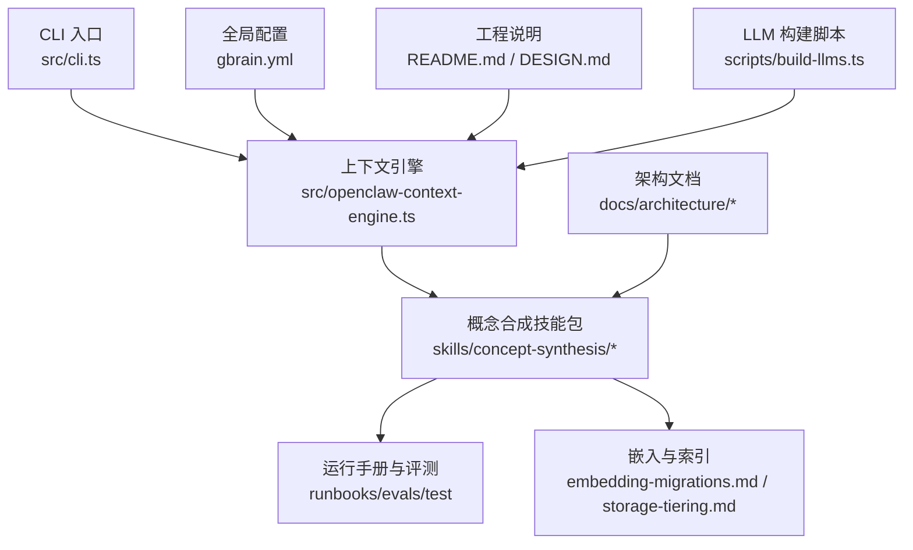
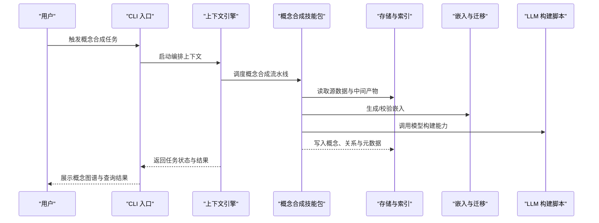
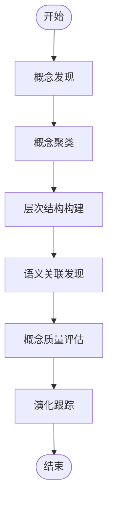
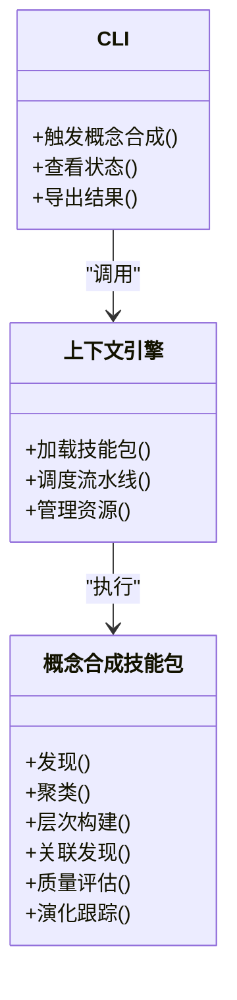
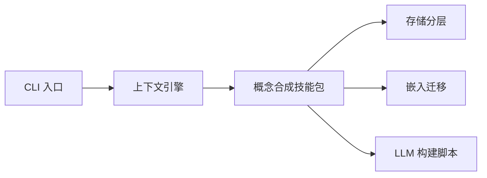

# 概念合成引擎

<cite>
**本文引用的文件**   
- [README.md](file://README.md)
- [DESIGN.md](file://DESIGN.md)
- [gbrain.yml](file://gbrain.yml)
- [src/cli.ts](file://src/cli.ts)
- [src/openclaw-context-engine.ts](file://src/openclaw-context-engine.ts)
- [skills/concept-synthesis/manifest.json](file://skills/concept-synthesis/manifest.json)
- [skills/concept-synthesis/skillpack.json](file://skills/concept-synthesis/skillpack.json)
- [skills/concept-synthesis/runbooks/README.md](file://skills/concept-synthesis/runbooks/README.md)
- [skills/concept-synthesis/evals/README.md](file://skills/concept-synthesis/evals/README.md)
- [skills/concept-synthesis/test/README.md](file://skills/concept-synthesis/test/README.md)
- [docs/guides/ENGINES.md](file://docs/guides/ENGINES.md)
- [docs/architecture/overview.md](file://docs/architecture/overview.md)
- [docs/architecture/cycle.md](file://docs/architecture/cycle.md)
- [docs/architecture/storage-tiering.md](file://docs/architecture/storage-tiering.md)
- [docs/architecture/embedding-migrations.md](file://docs/architecture/embedding-migrations.md)
- [scripts/build-llms.ts](file://scripts/build-llms.ts)
</cite>

## 目录
1. [简介](#简介)
2. [项目结构](#项目结构)
3. [核心组件](#核心组件)
4. [架构总览](#架构总览)
5. [详细组件分析](#详细组件分析)
6. [依赖分析](#依赖分析)
7. [性能考虑](#性能考虑)
8. [故障排查指南](#故障排查指南)
9. [结论](#结论)
10. [附录](#附录)

## 简介
本文件面向“概念合成引擎”的开发者与使用者，系统性阐述从分散信息中自动发现、聚类、组织并演化追踪概念的端到端能力。内容覆盖：
- 概念聚类算法与层次结构构建
- 语义关联发现机制
- 概念质量评估标准与演化跟踪策略
- 配置选项与调优参数
- 概念图谱可视化与查询接口使用指南
- 性能优化与增量更新机制

该引擎以技能包（Skillpack）形式集成到系统中，通过编排式周期任务驱动数据摄取、嵌入生成、检索增强与知识整合，最终产出可查询、可演进的概念图谱。

## 项目结构
概念合成相关代码与文档主要分布在以下位置：
- 技能包定义与运行手册：skills/concept-synthesis/*
- 系统入口与上下文引擎：src/cli.ts、src/openclaw-context-engine.ts
- 全局配置与工程说明：gbrain.yml、README.md、DESIGN.md
- 架构与流程文档：docs/architecture/*、docs/guides/ENGINES.md
- 辅助脚本：scripts/build-llms.ts

图表来源
- [src/cli.ts](file://src/cli.ts)
- [src/openclaw-context-engine.ts](file://src/openclaw-context-engine.ts)
- [skills/concept-synthesis/manifest.json](file://skills/concept-synthesis/manifest.json)
- [skills/concept-synthesis/skillpack.json](file://skills/concept-synthesis/skillpack.json)
- [docs/architecture/embedding-migrations.md](file://docs/architecture/embedding-migrations.md)
- [docs/architecture/storage-tiering.md](file://docs/architecture/storage-tiering.md)
- [gbrain.yml](file://gbrain.yml)
- [README.md](file://README.md)
- [DESIGN.md](file://DESIGN.md)
- [scripts/build-llms.ts](file://scripts/build-llms.ts)

章节来源
- [README.md](file://README.md)
- [DESIGN.md](file://DESIGN.md)
- [gbrain.yml](file://gbrain.yml)
- [src/cli.ts](file://src/cli.ts)
- [src/openclaw-context-engine.ts](file://src/openclaw-context-engine.ts)
- [skills/concept-synthesis/manifest.json](file://skills/concept-synthesis/manifest.json)
- [skills/concept-synthesis/skillpack.json](file://skills/concept-synthesis/skillpack.json)
- [docs/architecture/overview.md](file://docs/architecture/overview.md)
- [docs/architecture/cycle.md](file://docs/architecture/cycle.md)
- [docs/architecture/storage-tiering.md](file://docs/architecture/storage-tiering.md)
- [docs/architecture/embedding-migrations.md](file://docs/architecture/embedding-migrations.md)
- [scripts/build-llms.ts](file://scripts/build-llms.ts)

## 核心组件
- 概念合成技能包：提供概念发现、聚类、层次化组织、关联发现、质量评估与演化的完整流水线。其清单与元数据由 manifest.json 与 skillpack.json 描述，运行手册与测试位于 runbooks 与 test 目录，评测方案在 evals 目录。
- 上下文引擎：负责将技能包纳入统一执行上下文，协调生命周期、资源与外部服务调用。
- CLI 入口：对外暴露命令与交互界面，用于触发概念合成任务、查看状态与结果。
- 配置与工程说明：gbrain.yml 提供全局配置项；README.md 与 DESIGN.md 给出总体设计约束与约定。
- 架构文档：涵盖周期编排、存储分层、嵌入迁移等关键机制，为概念合成提供基础设施支撑。
- LLM 构建脚本：支持模型与提示工程的构建与缓存，提升推理效率。

章节来源
- [skills/concept-synthesis/manifest.json](file://skills/concept-synthesis/manifest.json)
- [skills/concept-synthesis/skillpack.json](file://skills/concept-synthesis/skillpack.json)
- [skills/concept-synthesis/runbooks/README.md](file://skills/concept-synthesis/runbooks/README.md)
- [skills/concept-synthesis/evals/README.md](file://skills/concept-synthesis/evals/README.md)
- [skills/concept-synthesis/test/README.md](file://skills/concept-synthesis/test/README.md)
- [src/openclaw-context-engine.ts](file://src/openclaw-context-engine.ts)
- [src/cli.ts](file://src/cli.ts)
- [gbrain.yml](file://gbrain.yml)
- [README.md](file://README.md)
- [DESIGN.md](file://DESIGN.md)
- [docs/architecture/overview.md](file://docs/architecture/overview.md)
- [docs/architecture/cycle.md](file://docs/architecture/cycle.md)
- [docs/architecture/storage-tiering.md](file://docs/architecture/storage-tiering.md)
- [docs/architecture/embedding-migrations.md](file://docs/architecture/embedding-migrations.md)
- [scripts/build-llms.ts](file://scripts/build-llms.ts)

## 架构总览
概念合成引擎采用“编排+技能包”的架构模式：
- 编排层：基于周期任务与阶段化流水线，驱动数据摄取、分块、嵌入、检索、聚合与输出。
- 技能层：概念合成技能包封装具体算法与业务逻辑，包括聚类、层次构建、关联发现、质量评估与演化跟踪。
- 基础设施层：存储分层、嵌入迁移、向量索引与全文检索共同构成底层能力。
- 交互层：CLI 与上下文引擎提供命令、状态与结果访问。

图表来源
- [src/cli.ts](file://src/cli.ts)
- [src/openclaw-context-engine.ts](file://src/openclaw-context-engine.ts)
- [skills/concept-synthesis/manifest.json](file://skills/concept-synthesis/manifest.json)
- [skills/concept-synthesis/skillpack.json](file://skills/concept-synthesis/skillpack.json)
- [docs/architecture/cycle.md](file://docs/architecture/cycle.md)
- [docs/architecture/storage-tiering.md](file://docs/architecture/storage-tiering.md)
- [docs/architecture/embedding-migrations.md](file://docs/architecture/embedding-migrations.md)
- [scripts/build-llms.ts](file://scripts/build-llms.ts)

## 详细组件分析

### 概念合成技能包
- 职责范围：
  - 概念发现：从多源文本与结构化数据中提取候选概念。
  - 概念聚类：基于语义相似度与上下文特征进行分组。
  - 层次结构构建：依据包含、派生、并列等关系形成树/图结构。
  - 语义关联发现：识别跨主题、跨来源的弱/强关联。
  - 质量评估：对概念完整性、一致性、稳定性与可解释性打分。
  - 演化跟踪：记录概念版本、变更轨迹与影响面。
- 配置与元数据：
  - manifest.json 与 skillpack.json 定义技能包的版本、依赖、输入输出契约与运行参数。
- 运行与评测：
  - runbooks 提供操作手册与最佳实践。
  - evals 提供评测指标与基准用例。
  - test 提供单元测试与回归用例。

图表来源
- [skills/concept-synthesis/manifest.json](file://skills/concept-synthesis/manifest.json)
- [skills/concept-synthesis/skillpack.json](file://skills/concept-synthesis/skillpack.json)
- [skills/concept-synthesis/runbooks/README.md](file://skills/concept-synthesis/runbooks/README.md)
- [skills/concept-synthesis/evals/README.md](file://skills/concept-synthesis/evals/README.md)
- [skills/concept-synthesis/test/README.md](file://skills/concept-synthesis/test/README.md)

章节来源
- [skills/concept-synthesis/manifest.json](file://skills/concept-synthesis/manifest.json)
- [skills/concept-synthesis/skillpack.json](file://skills/concept-synthesis/skillpack.json)
- [skills/concept-synthesis/runbooks/README.md](file://skills/concept-synthesis/runbooks/README.md)
- [skills/concept-synthesis/evals/README.md](file://skills/concept-synthesis/evals/README.md)
- [skills/concept-synthesis/test/README.md](file://skills/concept-synthesis/test/README.md)

### 上下文引擎与 CLI
- 上下文引擎：
  - 管理技能包生命周期、资源隔离与并发控制。
  - 提供与存储、嵌入、LLM 服务的统一接入点。
- CLI：
  - 暴露命令用于触发概念合成、查看进度与导出结果。
  - 支持交互式或批处理模式。

图表来源
- [src/cli.ts](file://src/cli.ts)
- [src/openclaw-context-engine.ts](file://src/openclaw-context-engine.ts)
- [skills/concept-synthesis/manifest.json](file://skills/concept-synthesis/manifest.json)
- [skills/concept-synthesis/skillpack.json](file://skills/concept-synthesis/skillpack.json)

章节来源
- [src/cli.ts](file://src/cli.ts)
- [src/openclaw-context-engine.ts](file://src/openclaw-context-engine.ts)

### 配置与工程说明
- gbrain.yml：集中管理全局配置项，如并发度、超时、存储路径、嵌入维度、模型选择等。
- README.md 与 DESIGN.md：定义工程目标、约束与设计原则，指导技能包与扩展开发。

章节来源
- [gbrain.yml](file://gbrain.yml)
- [README.md](file://README.md)
- [DESIGN.md](file://DESIGN.md)

### 架构与基础设施
- 周期编排：按阶段推进数据摄取、分块、嵌入、检索、聚合与输出，确保可观测与可恢复。
- 存储分层：热/温/冷分层存储，平衡延迟与成本。
- 嵌入迁移：保证嵌入维度与签名的一致性，支持回滚与重建。

章节来源
- [docs/architecture/overview.md](file://docs/architecture/overview.md)
- [docs/architecture/cycle.md](file://docs/architecture/cycle.md)
- [docs/architecture/storage-tiering.md](file://docs/architecture/storage-tiering.md)
- [docs/architecture/embedding-migrations.md](file://docs/architecture/embedding-migrations.md)

## 依赖分析
概念合成引擎的依赖关系如下：
- 上层：CLI 与上下文引擎
- 中层：概念合成技能包（含运行手册、评测与测试）
- 下层：存储分层、嵌入迁移、LLM 构建脚本

图表来源
- [src/cli.ts](file://src/cli.ts)
- [src/openclaw-context-engine.ts](file://src/openclaw-context-engine.ts)
- [skills/concept-synthesis/manifest.json](file://skills/concept-synthesis/manifest.json)
- [skills/concept-synthesis/skillpack.json](file://skills/concept-synthesis/skillpack.json)
- [docs/architecture/storage-tiering.md](file://docs/architecture/storage-tiering.md)
- [docs/architecture/embedding-migrations.md](file://docs/architecture/embedding-migrations.md)
- [scripts/build-llms.ts](file://scripts/build-llms.ts)

章节来源
- [src/cli.ts](file://src/cli.ts)
- [src/openclaw-context-engine.ts](file://src/openclaw-context-engine.ts)
- [skills/concept-synthesis/manifest.json](file://skills/concept-synthesis/manifest.json)
- [skills/concept-synthesis/skillpack.json](file://skills/concept-synthesis/skillpack.json)
- [docs/architecture/storage-tiering.md](file://docs/architecture/storage-tiering.md)
- [docs/architecture/embedding-migrations.md](file://docs/architecture/embedding-migrations.md)
- [scripts/build-llms.ts](file://scripts/build-llms.ts)

## 性能考虑
- 并发与批处理：合理设置并发度与批次大小，避免资源争用与内存峰值。
- 增量更新：仅对变更数据进行重新嵌入与聚合，减少全量计算开销。
- 缓存与复用：复用嵌入与中间结果，降低重复计算。
- 存储分层：热点数据驻留高性能介质，历史数据归档至低成本介质。
- 模型构建：利用构建脚本缓存模型与提示，缩短冷启动时间。

[本节为通用性能建议，不直接分析具体文件]

## 故障排查指南
- 常见问题定位：
  - 任务失败：检查 CLI 输出与上下文引擎日志，确认阶段边界与错误码。
  - 嵌入异常：核对嵌入维度与签名，必要时触发迁移与重建。
  - 存储问题：验证分层策略与权限，确认读写路径可用。
  - LLM 调用：检查模型构建脚本与网络连通性，确认配额与限流。
- 诊断工具：
  - 使用 CLI 查看任务状态与进度。
  - 参考运行手册中的排错步骤与样例。
  - 结合评测用例复现问题并收集证据。

章节来源
- [skills/concept-synthesis/runbooks/README.md](file://skills/concept-synthesis/runbooks/README.md)
- [skills/concept-synthesis/evals/README.md](file://skills/concept-synthesis/evals/README.md)
- [skills/concept-synthesis/test/README.md](file://skills/concept-synthesis/test/README.md)
- [src/cli.ts](file://src/cli.ts)
- [src/openclaw-context-engine.ts](file://src/openclaw-context-engine.ts)

## 结论
概念合成引擎通过技能包化与编排式流水线，实现了从分散信息到结构化概念图谱的自动化生产。其核心能力涵盖概念发现、聚类、层次构建、关联发现、质量评估与演化跟踪，并在存储分层、嵌入迁移与 LLM 构建等基础设施的支持下，具备良好的可扩展性与可维护性。配合 CLI 与上下文引擎，用户可便捷地触发任务、监控进度与获取结果。

[本节为总结性内容，不直接分析具体文件]

## 附录

### 概念图谱可视化与查询接口使用指南
- 可视化：
  - 通过 CLI 导出概念与关系数据，结合可视化工具渲染图谱。
  - 关注节点属性（名称、类型、权重、版本）与边属性（关系类型、强度、来源）。
- 查询：
  - 支持关键词检索、语义相似检索与组合过滤。
  - 可按时间窗口、来源域、概念层级进行筛选。
  - 导出结果为 JSON 或 CSV，便于下游分析。

[本节为通用使用指南，不直接分析具体文件]

### 概念质量评估标准与演化跟踪策略
- 质量评估维度：
  - 完整性：是否覆盖关键要素与上下文。
  - 一致性：是否与既有知识体系无冲突。
  - 稳定性：在增量更新后是否保持结构稳定。
  - 可解释性：是否有清晰来源与证据链。
- 演化跟踪策略：
  - 版本化：每个概念具备唯一标识与版本号。
  - 变更日志：记录新增、合并、拆分、重命名等操作。
  - 影响面分析：评估变更对相关概念与下游任务的影响。

[本节为通用策略说明，不直接分析具体文件]

### 配置选项与调优参数
- 全局配置（示例字段，具体以配置文件为准）：
  - 并发度：控制并行任务数量。
  - 批次大小：控制单次处理的条目数。
  - 超时与重试：设置任务超时与重试策略。
  - 存储路径：指定热/温/冷存储根路径。
  - 嵌入维度与签名：确保与模型一致。
  - 模型选择：指定 LLM 提供商与模型 ID。
- 技能包参数（示例字段，具体以技能包清单为准）：
  - 聚类阈值：控制概念聚类的松紧程度。
  - 层次深度：限制层次结构的最大深度。
  - 关联强度阈值：控制关联发现的敏感度。
  - 质量评分权重：调整各评估维度的权重。

章节来源
- [gbrain.yml](file://gbrain.yml)
- [skills/concept-synthesis/manifest.json](file://skills/concept-synthesis/manifest.json)
- [skills/concept-synthesis/skillpack.json](file://skills/concept-synthesis/skillpack.json)