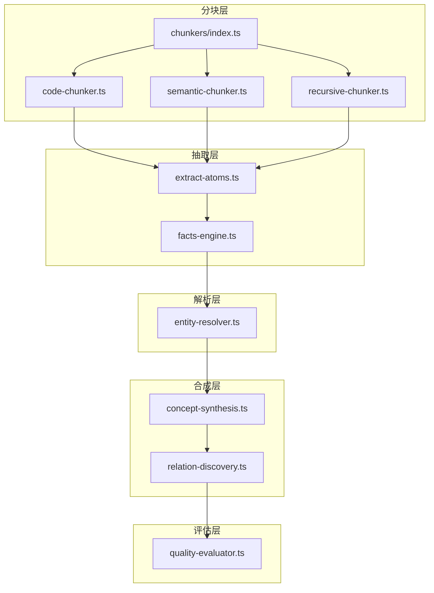
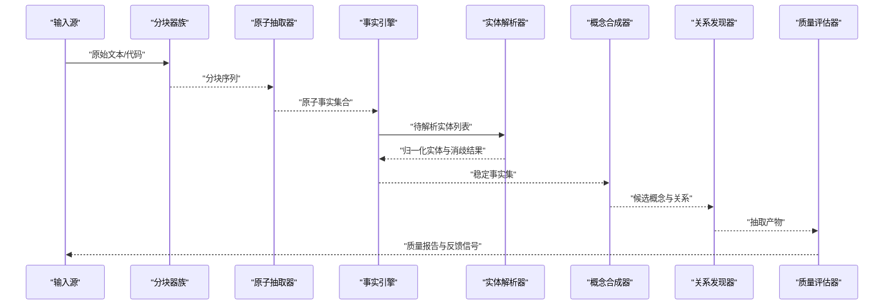
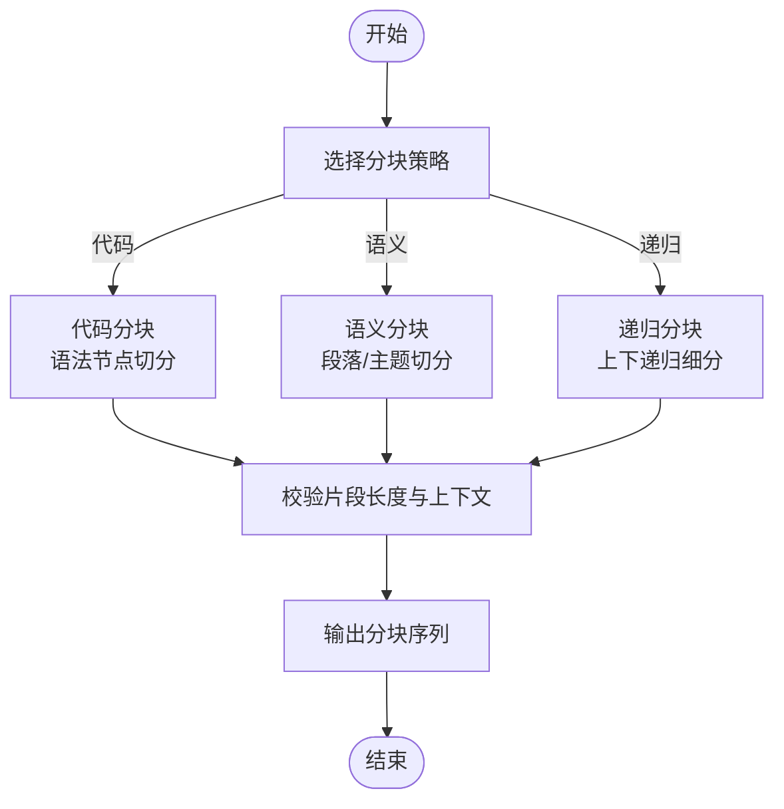
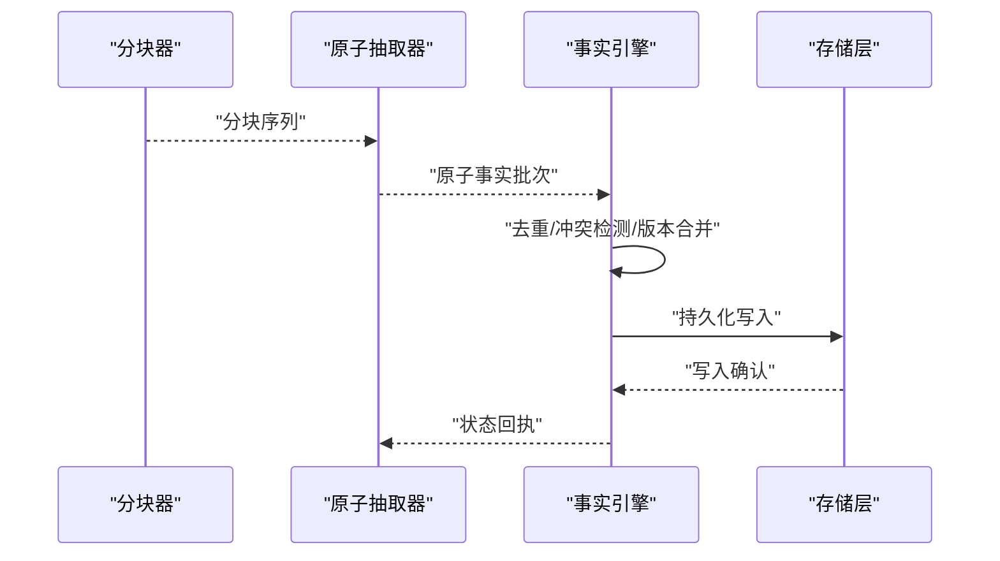
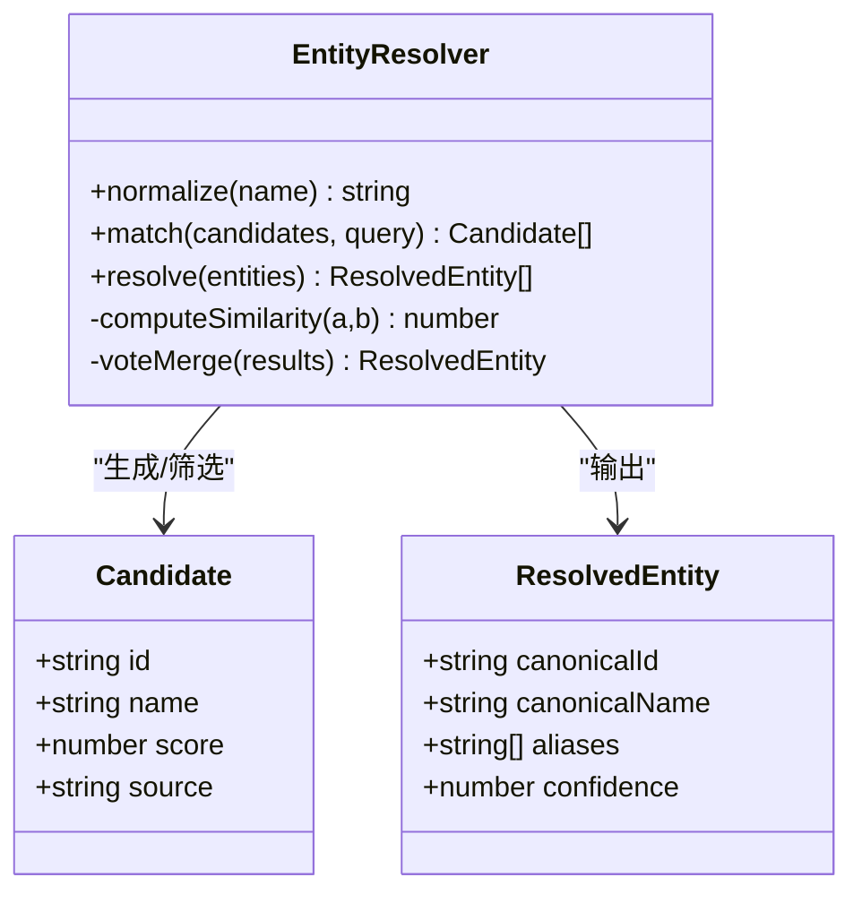
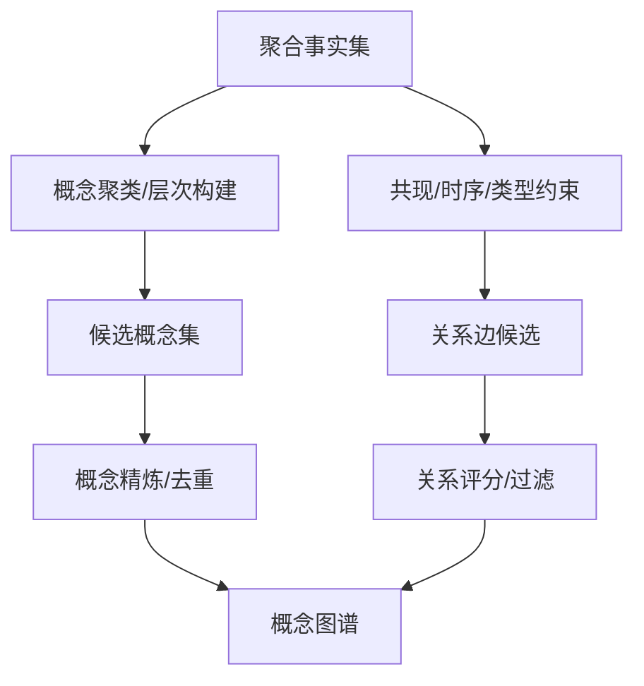
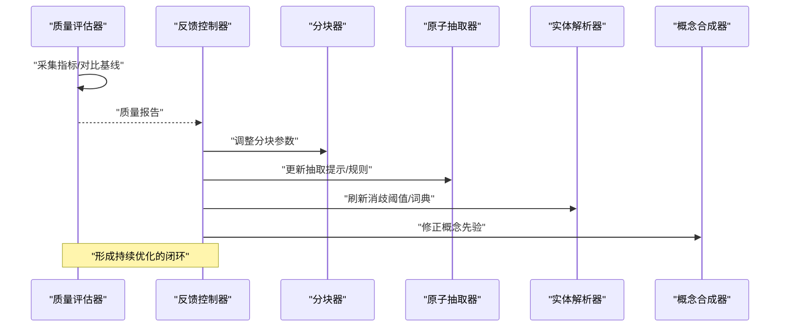
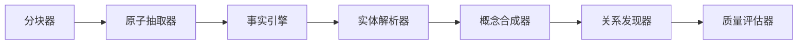

# 知识抽取引擎

<cite>
**本文引用的文件**   
- [src/core/chunkers/index.ts](file://src/core/chunkers/index.ts)
- [src/core/chunkers/code-chunker.ts](file://src/core/chunkers/code-chunker.ts)
- [src/core/chunkers/semantic-chunker.ts](file://src/core/chunkers/semantic-chunker.ts)
- [src/core/chunkers/recursive-chunker.ts](file://src/core/chunkers/recursive-chunker.ts)
- [src/core/facts-engine.ts](file://src/core/facts-engine.ts)
- [src/core/entity-resolver.ts](file://src/core/entity-resolver.ts)
- [src/core/relation-discovery.ts](file://src/core/relation-discovery.ts)
- [src/core/concept-synthesis.ts](file://src/core/concept-synthesis.ts)
- [src/core/extract-atoms.ts](file://src/core/extract-atoms.ts)
- [src/core/quality-evaluator.ts](file://src/core/quality-evaluator.ts)
- [src/core/custom-extractor.ts](file://src/core/custom-extractor.ts)
- [scripts/chunker-smoketest.ts](file://scripts/chunker-smoketest.ts)
- [test/chunker-timeout.test.ts](file://test/chunker-timeout.test.ts)
- [test/chunker-version-gate.test.ts](file://test/chunker-version-gate.test.ts)
- [test/incremental-chunking.test.ts](file://test/incremental-chunking.test.ts)
- [test/entity-resolve.test.ts](file://test/entity-resolve.test.ts)
- [test/entity-resolve-perf.slow.test.ts](file://test/entity-resolve-perf.slow.test.ts)
- [test/extract-facts-phase.test.ts](file://test/extract-facts-phase.test.ts)
- [test/extract-workers.test.ts](file://test/extract-workers.test.ts)
- [test/extract-conversation-facts.test.ts](file://test/extract-conversation-facts.test.ts)
- [test/extract-by-mention.test.ts](file://test/extract-by-mention.test.ts)
- [test/extract-takes.test.ts](file://test/extract-takes.test.ts)
- [test/edge-extractor.test.ts](file://test/edge-extractor.test.ts)
- [test/benchmark-knowledge-runtime.ts](file://test/benchmark-knowledge-runtime.ts)
</cite>

## 目录
1. [简介](#简介)
2. [项目结构](#项目结构)
3. [核心组件](#核心组件)
4. [架构总览](#架构总览)
5. [详细组件分析](#详细组件分析)
6. [依赖关系分析](#依赖关系分析)
7. [性能考量](#性能考量)
8. [故障排查指南](#故障排查指南)
9. [结论](#结论)
10. [附录](#附录)

## 简介
本文件面向“知识抽取引擎”的开发者与使用者，系统性阐述事实抽取、概念合成、实体识别与关系发现的核心算法；解释分块策略（代码分块、语义分块、递归分块）的实现与应用场景；说明实体解析与消歧机制；描述抽取质量评估与反馈闭环；并提供自定义抽取器的开发指南、最佳实践以及性能调优与内存管理策略。文档以仓库中的源码与测试为依据，确保内容可追溯、可验证。

## 项目结构
知识抽取相关能力集中在 src/core 下，围绕“分块—抽取—解析—合成—评估”的主流程组织：
- 分块层：提供多种 chunker 实现，负责将长文本或代码切分为适合下游处理的片段。
- 抽取层：基于原子化抽取管线，产出结构化事实与边。
- 解析层：对实体进行归一化与消歧，保证跨来源一致性。
- 合成层：在聚合基础上进行概念抽象与关系发现。
- 评估层：对抽取结果进行质量度量并驱动反馈优化。

图表来源
- [src/core/chunkers/index.ts](file://src/core/chunkers/index.ts)
- [src/core/chunkers/code-chunker.ts](file://src/core/chunkers/code-chunker.ts)
- [src/core/chunkers/semantic-chunker.ts](file://src/core/chunkers/semantic-chunker.ts)
- [src/core/chunkers/recursive-chunker.ts](file://src/core/chunkers/recursive-chunker.ts)
- [src/core/extract-atoms.ts](file://src/core/extract-atoms.ts)
- [src/core/facts-engine.ts](file://src/core/facts-engine.ts)
- [src/core/entity-resolver.ts](file://src/core/entity-resolver.ts)
- [src/core/concept-synthesis.ts](file://src/core/concept-synthesis.ts)
- [src/core/relation-discovery.ts](file://src/core/relation-discovery.ts)
- [src/core/quality-evaluator.ts](file://src/core/quality-evaluator.ts)

章节来源
- [src/core/chunkers/index.ts](file://src/core/chunkers/index.ts)
- [src/core/extract-atoms.ts](file://src/core/extract-atoms.ts)
- [src/core/facts-engine.ts](file://src/core/facts-engine.ts)
- [src/core/entity-resolver.ts](file://src/core/entity-resolver.ts)
- [src/core/concept-synthesis.ts](file://src/core/concept-synthesis.ts)
- [src/core/relation-discovery.ts](file://src/core/relation-discovery.ts)
- [src/core/quality-evaluator.ts](file://src/core/quality-evaluator.ts)

## 核心组件
- 分块器族（Chunkers）
  - 代码分块：面向源代码的结构化切分，保留语法边界与上下文，便于后续符号级抽取。
  - 语义分块：按自然语言语义边界切分，强调段落/主题连贯性，适用于文档与对话。
  - 递归分块：自顶向下递归细分，控制最大粒度与最小粒度，平衡召回与精度。
- 原子抽取与事实引擎
  - 原子抽取：从分块中识别实体、属性与初步关系，输出标准化原子单元。
  - 事实引擎：汇聚原子单元，执行去重、冲突检测、版本管理与持久化。
- 实体解析与消歧
  - 统一命名空间、别名映射、相似度匹配与投票合并，解决同物异名与异物同名问题。
- 概念合成与关系发现
  - 概念合成：在聚合层面提炼高阶概念、分类与层级。
  - 关系发现：基于共现、时序、类型约束与图模式挖掘关系边。
- 质量评估与反馈
  - 指标覆盖完整性、准确性、一致性与稳定性；结合人工标注与自动探针形成闭环优化。

章节来源
- [src/core/chunkers/code-chunker.ts](file://src/core/chunkers/code-chunker.ts)
- [src/core/chunkers/semantic-chunker.ts](file://src/core/chunkers/semantic-chunker.ts)
- [src/core/chunkers/recursive-chunker.ts](file://src/core/chunkers/recursive-chunker.ts)
- [src/core/extract-atoms.ts](file://src/core/extract-atoms.ts)
- [src/core/facts-engine.ts](file://src/core/facts-engine.ts)
- [src/core/entity-resolver.ts](file://src/core/entity-resolver.ts)
- [src/core/concept-synthesis.ts](file://src/core/concept-synthesis.ts)
- [src/core/relation-discovery.ts](file://src/core/relation-discovery.ts)
- [src/core/quality-evaluator.ts](file://src/core/quality-evaluator.ts)

## 架构总览
下图展示端到端数据流：输入源经分块器生成片段，原子抽取器产出原子事实，事实引擎完成吸收与治理，实体解析器进行归一化与消歧，随后进入概念合成与关系发现阶段，最终由质量评估模块度量并触发反馈优化。

图表来源
- [src/core/chunkers/index.ts](file://src/core/chunkers/index.ts)
- [src/core/extract-atoms.ts](file://src/core/extract-atoms.ts)
- [src/core/facts-engine.ts](file://src/core/facts-engine.ts)
- [src/core/entity-resolver.ts](file://src/core/entity-resolver.ts)
- [src/core/concept-synthesis.ts](file://src/core/concept-synthesis.ts)
- [src/core/relation-discovery.ts](file://src/core/relation-discovery.ts)
- [src/core/quality-evaluator.ts](file://src/core/quality-evaluator.ts)

## 详细组件分析

### 分块策略（Chunkers）
- 代码分块（Code Chunker）
  - 适用场景：源码扫描、API 契约、配置清单等结构化文本。
  - 关键特性：按语法节点切分、保留导入/导出与注释上下文、支持增量更新。
  - 典型参数：最大节点深度、最小片段长度、是否包含签名头。
- 语义分块（Semantic Chunker）
  - 适用场景：文章、论文、会议记录、对话日志等自然语言材料。
  - 关键特性：依据段落/标题/主题切换点切分，保持语义连贯。
  - 典型参数：段落阈值、重叠比例、语言模型辅助断句开关。
- 递归分块（Recursive Chunker）
  - 适用场景：超长文档、混合体裁资料。
  - 关键特性：自上而下递归细分，直至满足粒度约束；支持回溯合并。
  - 典型参数：最大长度、最小长度、递归深度上限。

图表来源
- [src/core/chunkers/code-chunker.ts](file://src/core/chunkers/code-chunker.ts)
- [src/core/chunkers/semantic-chunker.ts](file://src/core/chunkers/semantic-chunker.ts)
- [src/core/chunkers/recursive-chunker.ts](file://src/core/chunkers/recursive-chunker.ts)

章节来源
- [src/core/chunkers/index.ts](file://src/core/chunkers/index.ts)
- [src/core/chunkers/code-chunker.ts](file://src/core/chunkers/code-chunker.ts)
- [src/core/chunkers/semantic-chunker.ts](file://src/core/chunkers/semantic-chunker.ts)
- [src/core/chunkers/recursive-chunker.ts](file://src/core/chunkers/recursive-chunker.ts)
- [scripts/chunker-smoketest.ts](file://scripts/chunker-smoketest.ts)
- [test/chunker-timeout.test.ts](file://test/chunker-timeout.test.ts)
- [test/chunker-version-gate.test.ts](file://test/chunker-version-gate.test.ts)
- [test/incremental-chunking.test.ts](file://test/incremental-chunking.test.ts)

### 事实抽取与原子化（Facts & Atoms）
- 原子抽取流程
  - 输入为分块序列，输出为标准化的原子三元组/四元组（主体-谓词-客体-上下文）。
  - 支持多模态上下文注入（如文件名、行号、时间戳），增强溯源能力。
- 事实引擎
  - 负责批量吸收、去重、冲突检测、版本演进与可见性控制。
  - 提供事务性写入与回滚保障，确保大规模抽取的稳定性。

图表来源
- [src/core/extract-atoms.ts](file://src/core/extract-atoms.ts)
- [src/core/facts-engine.ts](file://src/core/facts-engine.ts)

章节来源
- [src/core/extract-atoms.ts](file://src/core/extract-atoms.ts)
- [src/core/facts-engine.ts](file://src/core/facts-engine.ts)
- [test/extract-facts-phase.test.ts](file://test/extract-facts-phase.test.ts)
- [test/extract-workers.test.ts](file://test/extract-workers.test.ts)
- [test/extract-conversation-facts.test.ts](file://test/extract-conversation-facts.test.ts)
- [test/extract-by-mention.test.ts](file://test/extract-by-mention.test.ts)
- [test/extract-takes.test.ts](file://test/extract-takes.test.ts)

### 实体解析与消歧（Entity Resolution）
- 目标：将不同来源的同义实体归一到唯一标识，消除别名与拼写变体带来的噪声。
- 方法要点：
  - 名称规范化（大小写、缩写、标点处理）。
  - 相似度计算（编辑距离、嵌入向量余弦、领域词典匹配）。
  - 投票与置信度融合（多证据加权、阈值判定）。
  - 冲突仲裁（时间优先、来源可信度、上下文一致性）。

图表来源
- [src/core/entity-resolver.ts](file://src/core/entity-resolver.ts)

章节来源
- [src/core/entity-resolver.ts](file://src/core/entity-resolver.ts)
- [test/entity-resolve.test.ts](file://test/entity-resolve.test.ts)
- [test/entity-resolve-perf.slow.test.ts](file://test/entity-resolve-perf.slow.test.ts)

### 概念合成与关系发现（Concept Synthesis & Relation Discovery）
- 概念合成
  - 在聚合事实之上进行聚类与层次构建，产出类别、子类别与属性模板。
  - 引入先验约束（领域本体、类型系统）提升合成质量。
- 关系发现
  - 基于共现统计、时序关联、类型兼容性与图模式匹配发现关系边。
  - 支持关系强度评分与可解释性证据链接。

图表来源
- [src/core/concept-synthesis.ts](file://src/core/concept-synthesis.ts)
- [src/core/relation-discovery.ts](file://src/core/relation-discovery.ts)

章节来源
- [src/core/concept-synthesis.ts](file://src/core/concept-synthesis.ts)
- [src/core/relation-discovery.ts](file://src/core/relation-discovery.ts)
- [test/edge-extractor.test.ts](file://test/edge-extractor.test.ts)

### 抽取质量评估与反馈循环（Quality Evaluation & Feedback Loop）
- 评估维度
  - 完整性：关键信息覆盖率。
  - 准确性：实体/关系正确率。
  - 一致性：跨来源冲突率与消歧效果。
  - 稳定性：增量更新后的波动程度。
- 反馈机制
  - 自动探针：周期性抽样评估，触发再抽取或参数微调。
  - 人工标注：高质量样本回流至训练/提示工程，持续改进抽取器。
  - 指标看板：可视化趋势，定位退化环节。

图表来源
- [src/core/quality-evaluator.ts](file://src/core/quality-evaluator.ts)

章节来源
- [src/core/quality-evaluator.ts](file://src/core/quality-evaluator.ts)

### 自定义抽取器开发指南与最佳实践
- 开发入口
  - 通过扩展接口定义新的抽取器，注册到抽取管线，参与原子事实生产。
- 设计原则
  - 幂等与可重试：同一输入多次运行应得到等价结果。
  - 可观测性：输出结构化日志与指标，便于追踪与回归。
  - 可配置性：关键阈值与策略通过配置项暴露。
- 集成步骤
  - 实现抽取器接口，提供批处理能力与错误恢复。
  - 在工厂或注册表中声明依赖与优先级。
  - 编写单元测试与基准用例，覆盖异常路径与边界条件。
- 最佳实践
  - 小步快跑：先实现最小可用版本，逐步增加复杂逻辑。
  - 分层解耦：将预处理、抽取、后处理拆分为独立函数，便于替换与复用。
  - 资源保护：限制并发、设置超时与熔断，避免 OOM 与雪崩。

章节来源
- [src/core/custom-extractor.ts](file://src/core/custom-extractor.ts)

## 依赖关系分析
- 组件耦合
  - 分块器与原子抽取器松耦合，通过标准分块接口交互。
  - 事实引擎作为中心枢纽，向上承接抽取器，向下对接存储与索引。
  - 实体解析器与概念合成/关系发现共享“稳定事实集”，降低重复计算。
- 外部依赖
  - 存储层：用于持久化事实、索引与元数据。
  - 可选 LLM/嵌入服务：用于语义切分、相似度计算与概念归纳。
- 潜在环路与规避
  - 抽取器不应反向依赖事实引擎的写入路径，避免循环调用。
  - 评估器仅读取快照与指标，不直接修改抽取管线。

图表来源
- [src/core/chunkers/index.ts](file://src/core/chunkers/index.ts)
- [src/core/extract-atoms.ts](file://src/core/extract-atoms.ts)
- [src/core/facts-engine.ts](file://src/core/facts-engine.ts)
- [src/core/entity-resolver.ts](file://src/core/entity-resolver.ts)
- [src/core/concept-synthesis.ts](file://src/core/concept-synthesis.ts)
- [src/core/relation-discovery.ts](file://src/core/relation-discovery.ts)
- [src/core/quality-evaluator.ts](file://src/core/quality-evaluator.ts)

章节来源
- [src/core/chunkers/index.ts](file://src/core/chunkers/index.ts)
- [src/core/extract-atoms.ts](file://src/core/extract-atoms.ts)
- [src/core/facts-engine.ts](file://src/core/facts-engine.ts)
- [src/core/entity-resolver.ts](file://src/core/entity-resolver.ts)
- [src/core/concept-synthesis.ts](file://src/core/concept-synthesis.ts)
- [src/core/relation-discovery.ts](file://src/core/relation-discovery.ts)
- [src/core/quality-evaluator.ts](file://src/core/quality-evaluator.ts)

## 性能考量
- 分块阶段
  - 合理设置最大片段长度与重叠比例，减少冗余与上下文丢失。
  - 使用增量分块与变更检测，避免全量重算。
- 抽取阶段
  - 批处理与流水线并行，控制并发度与队列长度，防止内存峰值过高。
  - 对大对象进行惰性加载与流式处理，及时释放引用。
- 解析与合成
  - 实体解析采用近似最近邻与哈希桶加速候选检索。
  - 概念合成引入剪枝与早停策略，限制搜索空间。
- 监控与压测
  - 通过基准脚本评估吞吐与延迟，定位瓶颈。
  - 建立回归测试，确保优化不引入退化。

章节来源
- [test/benchmark-knowledge-runtime.ts](file://test/benchmark-knowledge-runtime.ts)
- [test/chunker-timeout.test.ts](file://test/chunker-timeout.test.ts)
- [test/incremental-chunking.test.ts](file://test/incremental-chunking.test.ts)

## 故障排查指南
- 常见问题
  - 分块超时：检查分块器超时配置与输入规模，必要时启用递归分块降级。
  - 版本门控失败：确认分块器版本标记与迁移兼容性。
  - 实体解析不稳定：调整相似度阈值与投票权重，补充领域词典。
  - 事实写入阻塞：检查事实引擎并发与存储层健康状态。
- 诊断手段
  - 查看分块器冒烟测试与增量分块用例输出，定位切分异常。
  - 使用实体解析性能用例观察候选集规模与耗时分布。
  - 核对事实抽取各阶段的中间产物与日志，确认数据形状与字段完整性。

章节来源
- [scripts/chunker-smoketest.ts](file://scripts/chunker-smoketest.ts)
- [test/chunker-timeout.test.ts](file://test/chunker-timeout.test.ts)
- [test/chunker-version-gate.test.ts](file://test/chunker-version-gate.test.ts)
- [test/incremental-chunking.test.ts](file://test/incremental-chunking.test.ts)
- [test/entity-resolve-perf.slow.test.ts](file://test/entity-resolve-perf.slow.test.ts)
- [test/extract-facts-phase.test.ts](file://test/extract-facts-phase.test.ts)
- [test/extract-workers.test.ts](file://test/extract-workers.test.ts)

## 结论
本引擎以“分块—抽取—解析—合成—评估”为主线，提供了可扩展的事实抽取与知识构建能力。通过多样化的分块策略、稳健的实体解析与消歧、可解释的关系发现与持续的质量评估，系统能够在复杂数据源上稳定产出高质量知识图谱。建议在生产环境中结合业务先验与在线反馈，持续迭代抽取器与参数，以获得更优的召回与准确率。

## 附录
- 术语表
  - 分块（Chunking）：将长文本/代码切分为较小片段的预处理过程。
  - 原子事实（Atomic Fact）：不可再分的最小知识单元。
  - 实体解析（Entity Resolution）：将不同来源的同义实体归一化。
  - 概念合成（Concept Synthesis）：从聚合事实中提炼高阶概念。
  - 关系发现（Relation Discovery）：从数据中挖掘实体间的关系边。
- 参考用例
  - 代码分块与增量更新：参见分块冒烟与增量分块测试。
  - 实体解析与性能：参见实体解析单测与性能用例。
  - 事实抽取阶段与并发：参见事实抽取阶段与工作者测试。