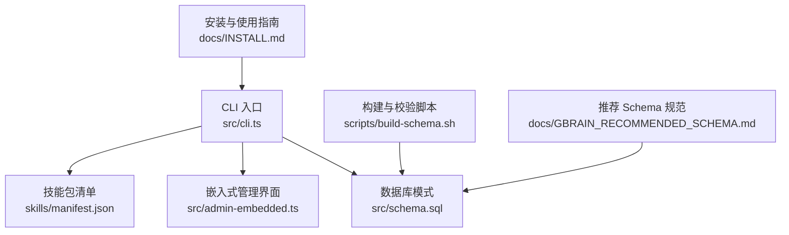
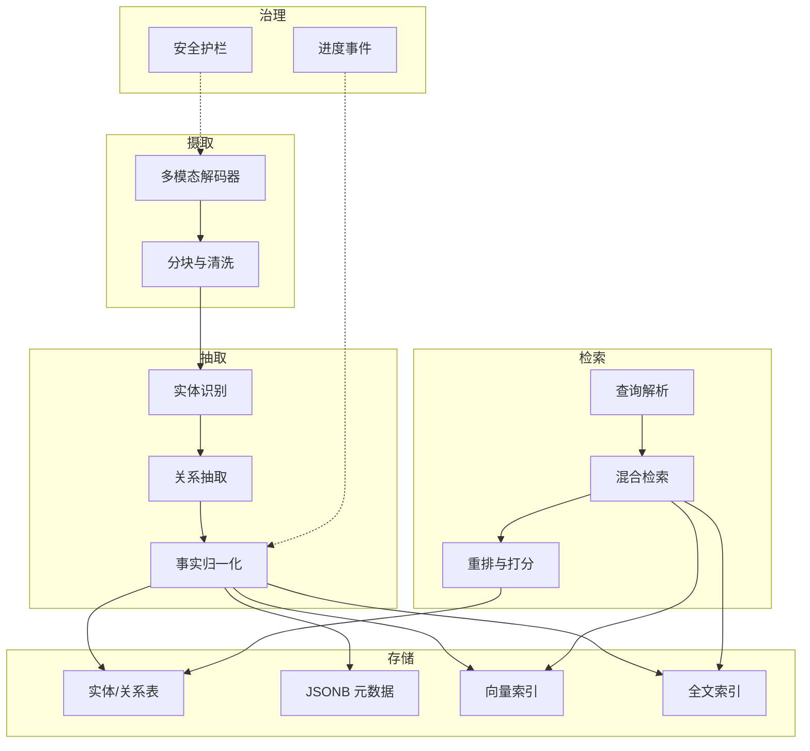
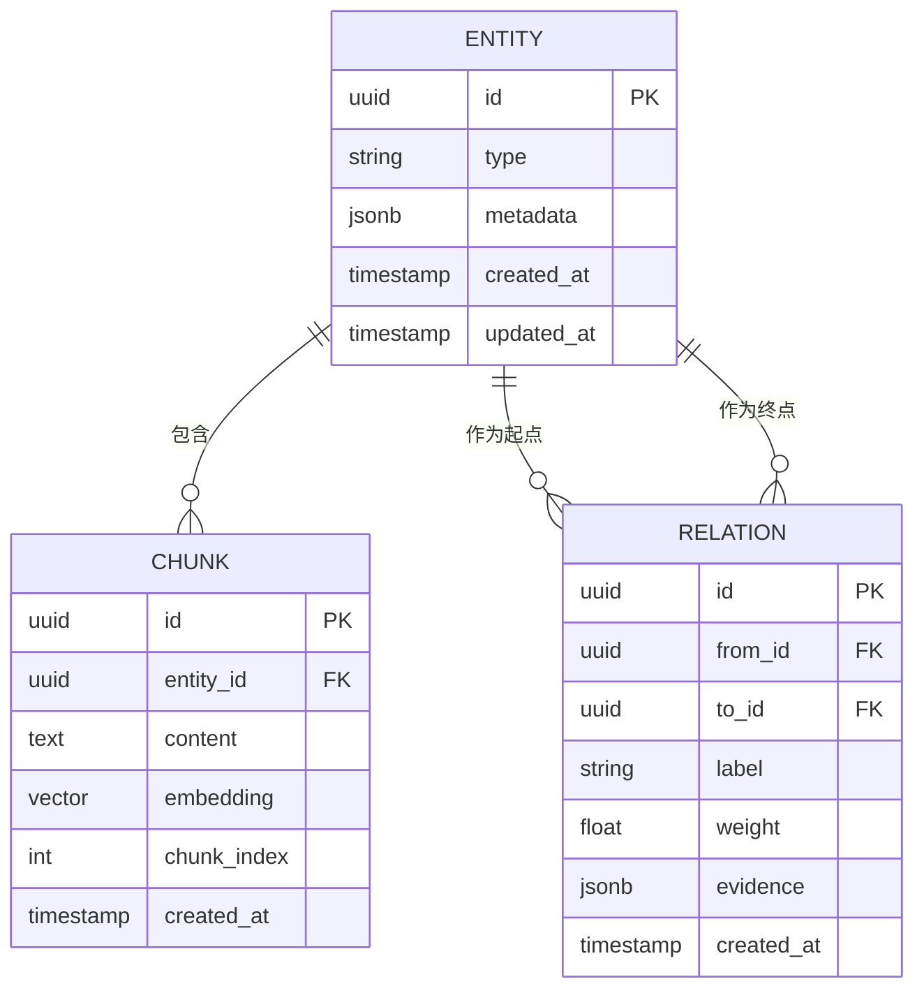
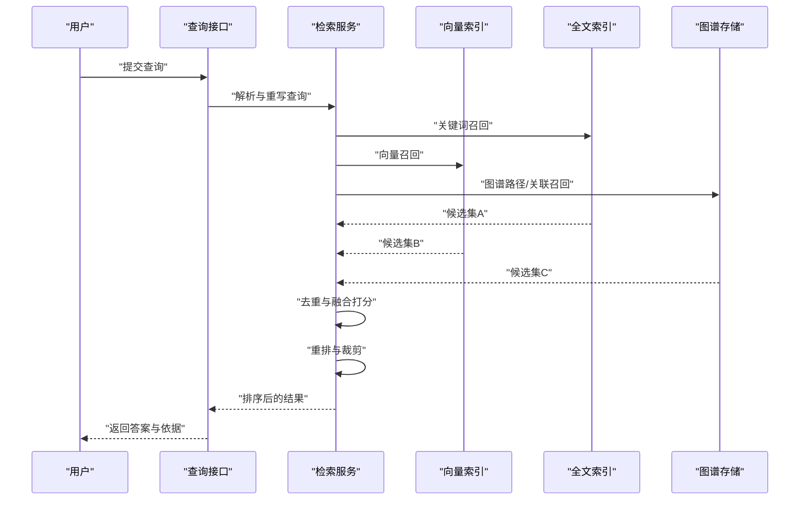
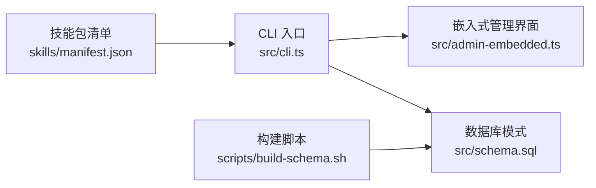

# 知识管理系统

<cite>
**本文引用的文件**   
- [README.md](file://README.md)
- [INSTALL.md](file://docs/INSTALL.md)
- [GBRAIN_RECOMMENDED_SCHEMA.md](file://docs/GBRAIN_RECOMMENDED_SCHEMA.md)
- [storage-tiering.md](file://docs/storage-tiering.md)
- [embedding-migrations.md](file://docs/embedding-migrations.md)
- [schema-author-tutorial.md](file://docs/schema-author-tutorial.md)
- [takes-vs-facts.md](file://docs/takes-vs-facts.md)
- [guardrails.md](file://docs/guardrails.md)
- [progress-events.md](file://docs/progress-events.md)
- [src/schema.sql](file://src/schema.sql)
- [src/cli.ts](file://src/cli.ts)
- [src/admin-embedded.ts](file://src/admin-embedded.ts)
- [skills/manifest.json](file://skills/manifest.json)
- [scripts/build-schema.sh](file://scripts/build-schema.sh)
</cite>

## 目录
1. [简介](#简介)
2. [项目结构](#项目结构)
3. [核心组件](#核心组件)
4. [架构总览](#架构总览)
5. [详细组件分析](#详细组件分析)
6. [依赖分析](#依赖分析)
7. [性能考虑](#性能考虑)
8. [故障排查指南](#故障排查指南)
9. [结论](#结论)
10. [附录](#附录)

## 简介
本文件系统性地梳理知识管理系统的整体能力与实现要点，覆盖数据摄取、知识抽取、图谱存储与语义搜索等关键流程。文档面向不同技术背景的读者，既提供高层概览，也给出代码级映射与可操作的最佳实践，帮助快速上手并稳定运行大规模多模态知识工程。

## 项目结构
仓库采用“核心引擎 + 技能包（Skills）+ 文档与脚本”的分层组织方式：
- 核心引擎位于 src/，包含 CLI 入口、嵌入式管理界面、数据库模式定义等。
- 技能包位于 skills/，以清单驱动的方式组织摄取、抽取、查询、迁移等能力。
- docs/ 提供架构设计、安装升级、Schema 规范、嵌入向量迁移等权威说明。
- scripts/ 提供构建、校验、测试与运维脚本。

图表来源
- [src/cli.ts](file://src/cli.ts)
- [src/admin-embedded.ts](file://src/admin-embedded.ts)
- [src/schema.sql](file://src/schema.sql)
- [skills/manifest.json](file://skills/manifest.json)
- [scripts/build-schema.sh](file://scripts/build-schema.sh)
- [docs/INSTALL.md](file://docs/INSTALL.md)
- [docs/GBRAIN_RECOMMENDED_SCHEMA.md](file://docs/GBRAIN_RECOMMENDED_SCHEMA.md)

章节来源
- [README.md](file://README.md)
- [docs/INSTALL.md](file://docs/INSTALL.md)

## 核心组件
- 数据摄取
  - 通过技能包驱动的多源接入，支持文本、图像、音频等多模态输入；结合增量同步与批处理策略，保障吞吐与一致性。
- 知识抽取
  - 基于规则与模型协同的抽取管线，产出结构化事实与关系；具备版本化与质量门禁。
- 图谱存储
  - 以关系型表结构与 JSONB 扩展承载实体、关系与元数据；配合向量化列与全文索引，支撑检索与推理。
- 语义搜索
  - 混合检索（关键词 + 向量），结合重排与相关性打分；提供缓存、分页与结果裁剪优化。

章节来源
- [skills/manifest.json](file://skills/manifest.json)
- [docs/GBRAIN_RECOMMENDED_SCHEMA.md](file://docs/GBRAIN_RECOMMENDED_SCHEMA.md)
- [src/schema.sql](file://src/schema.sql)

## 架构总览
系统由“摄取—抽取—存储—检索”四段式流水线构成，辅以治理与可观测性能力：
- 摄取层：统一入口，按类型路由到相应解码器与分块器。
- 抽取层：将非结构化内容转化为实体、属性与关系的事实集合。
- 存储层：持久化实体与关系，维护向量与全文索引。
- 检索层：解析查询意图，执行混合检索与排序，返回高相关结果。
- 治理与可观测：包括安全护栏、进度事件、错误分类与审计日志。

图表来源
- [src/schema.sql](file://src/schema.sql)
- [docs/GBRAIN_RECOMMENDED_SCHEMA.md](file://docs/GBRAIN_RECOMMENDED_SCHEMA.md)
- [docs/guardrails.md](file://docs/guardrails.md)
- [docs/progress-events.md](file://docs/progress-events.md)

## 详细组件分析

### 数据摄取与多模态处理
- 目标
  - 统一接入文本、图像、音频等多模态数据，完成解码、去噪、分块与标准化。
- 关键流程
  - 类型识别与路由：根据 MIME/扩展名或内容签名选择解码器。
  - 解码与转写：图像 OCR/描述生成，音频转文本，PDF/网页提取正文。
  - 分块与清洗：按段落/语义边界切块，去除噪声与冗余。
  - 元数据注入：来源、时间戳、权限、指纹等写入 JSONB。
- 配置要点
  - 解码器开关与超时、并发度、重试策略。
  - 分块大小与重叠比例、语言与停用词配置。
  - 存储分层策略（热/温/冷）与压缩选项。
- 最佳实践
  - 对大文件启用流式处理与断点续传。
  - 为高频类型建立专用解码器缓存。
  - 在摄取阶段即计算内容指纹，便于后续去重与增量更新。

章节来源
- [docs/INSTALL.md](file://docs/INSTALL.md)
- [docs/storage-tiering.md](file://docs/storage-tiering.md)

### 知识抽取算法与配置
- 目标
  - 从非结构化内容中抽取实体、属性与关系，形成可查询的事实。
- 算法原理
  - 规则与模型双轨：正则/词典匹配用于高召回基础项，LLM/NER 模型用于复杂语义。
  - 冲突消解与合并：同指消解、权重投票、时间衰减与置信度阈值控制。
  - 版本化：每次抽取产出版本号与变更摘要，支持回滚与对比。
- 配置选项
  - 抽取策略（仅规则/仅模型/混合）、模型 ID 与温度参数。
  - 实体/关系白名单与黑名单、字段映射与规范化字典。
  - 批量大小、并发度、失败重试与退避策略。
- 质量门禁
  - 抽取后校验（完整性、唯一性、外键约束）。
  - 抽样人工复核与自动评估指标（精确率/召回率/F1）。

章节来源
- [docs/takes-vs-facts.md](file://docs/takes-vs-facts.md)
- [docs/GBRAIN_RECOMMENDED_SCHEMA.md](file://docs/GBRAIN_RECOMMENDED_SCHEMA.md)

### 图谱数据模型、关系建模与索引策略
- 数据模型
  - 实体与关系表：主键、外键、时间戳、状态位。
  - JSONB 扩展：灵活存放异构元数据、标签、评分与上下文片段。
  - 向量列：保存文本/图像/音频的嵌入向量，供相似度检索。
- 关系建模
  - 显式边表承载关系类型、方向、权重与证据来源。
  - 复合索引加速常见查询路径（如按实体、时间窗口、关系类型过滤）。
- 索引策略
  - 全文索引：针对标题、摘要与正文片段，支持多语言分词。
  - 向量索引：HNSW/IVF 等近似最近邻索引，平衡精度与延迟。
  - 分区与归档：按时间或来源进行表分区，冷热分离提升查询效率。

图表来源
- [src/schema.sql](file://src/schema.sql)
- [docs/GBRAIN_RECOMMENDED_SCHEMA.md](file://docs/GBRAIN_RECOMMENDED_SCHEMA.md)

章节来源
- [src/schema.sql](file://src/schema.sql)
- [docs/GBRAIN_RECOMMENDED_SCHEMA.md](file://docs/GBRAIN_RECOMMENDED_SCHEMA.md)

### 语义搜索：查询处理、相关性排序与性能优化
- 查询处理
  - 意图识别与改写：将自然语言转为结构化子查询与过滤条件。
  - 多路召回：关键词检索 + 向量相似度检索 + 图谱路径检索。
- 相关性排序
  - 融合打分：BM25/TF-IDF 与向量余弦相似度加权组合。
  - 重排器：基于领域特征（时效性、来源可信度、引用密度）二次排序。
- 性能优化
  - 查询缓存：对热点查询做短期缓存与失效策略。
  - 分页与投影：只返回必要字段，减少网络与序列化开销。
  - 索引调优：调整 HNSW M/efConstruction 等参数，权衡召回与延迟。

图表来源
- [src/schema.sql](file://src/schema.sql)
- [docs/GBRAIN_RECOMMENDED_SCHEMA.md](file://docs/GBRAIN_RECOMMENDED_SCHEMA.md)

章节来源
- [docs/GBRAIN_RECOMMENDED_SCHEMA.md](file://docs/GBRAIN_RECOMMENDED_SCHEMA.md)

### 配置示例与最佳实践
- 摄取
  - 开启多模态解码器，设置合理的并发与超时；为大文件启用分片与重试。
  - 在摄取阶段计算内容指纹，避免重复入库。
- 抽取
  - 先规则后模型，逐步放开模型复杂度；为关键实体/关系建立白名单。
  - 设定置信度阈值与冲突消解策略，输出带证据的事实。
- 存储
  - 为常用查询路径建立复合索引；对向量列选择合适的索引类型与参数。
  - 按时间或来源分区，定期归档历史数据。
- 检索
  - 默认开启混合检索；对高延迟场景引入查询缓存与结果裁剪。
  - 监控命中率与 P95/P99 延迟，动态调整重排权重。

章节来源
- [docs/storage-tiering.md](file://docs/storage-tiering.md)
- [docs/GBRAIN_RECOMMENDED_SCHEMA.md](file://docs/GBRAIN_RECOMMENDED_SCHEMA.md)

### 数据质量保证、版本管理与迁移策略
- 数据质量
  - 摄取与抽取阶段均设置校验门控，异常数据进入隔离区并告警。
  - 定期运行一致性检查与修复任务，确保外键与唯一性约束。
- 版本管理
  - 所有事实与 Schema 变更附带版本号与变更摘要，支持回滚与对比。
  - 抽取产物与模型版本绑定，保证可复现性。
- 迁移策略
  - 渐进式迁移：新增字段默认空值，灰度切换读写路径。
  - 回滚预案：保留旧表快照与反向迁移脚本，快速恢复。
  - 嵌入向量迁移：记录维度与签名，必要时触发重建。

章节来源
- [docs/embedding-migrations.md](file://docs/embedding-migrations.md)
- [docs/GBRAIN_RECOMMENDED_SCHEMA.md](file://docs/GBRAIN_RECOMMENDED_SCHEMA.md)

## 依赖分析
- 内部依赖
  - CLI 入口负责命令分发与生命周期管理；嵌入式管理界面提供可视化能力。
  - 数据库模式由 SQL 文件集中定义，并通过构建脚本生成/校验。
  - 技能包清单驱动功能装配，决定启用的摄取、抽取与查询能力。
- 外部依赖
  - 向量数据库/索引库、全文搜索引擎、对象存储与 LLM 服务。
  - 运行时依赖（Node/Bun 环境、系统库）由安装指南说明。

图表来源
- [src/cli.ts](file://src/cli.ts)
- [src/admin-embedded.ts](file://src/admin-embedded.ts)
- [src/schema.sql](file://src/schema.sql)
- [scripts/build-schema.sh](file://scripts/build-schema.sh)
- [skills/manifest.json](file://skills/manifest.json)

章节来源
- [src/cli.ts](file://src/cli.ts)
- [src/admin-embedded.ts](file://src/admin-embedded.ts)
- [src/schema.sql](file://src/schema.sql)
- [scripts/build-schema.sh](file://scripts/build-schema.sh)
- [skills/manifest.json](file://skills/manifest.json)

## 性能考虑
- 摄取
  - 并行解码与分块，I/O 与 CPU 资源隔离；大文件流式处理降低峰值内存。
- 抽取
  - 批量调用模型，合理设置批大小与并发；对高频实体预取上下文。
- 存储
  - 向量索引参数调优（M、efConstruction、efSearch）；全文索引分词器与停用词优化。
  - 表分区与冷热分层，减少扫描范围。
- 检索
  - 查询缓存命中优先；对长尾查询降级为轻量模式。
  - 结果裁剪与投影，避免传输大对象。

[本节为通用指导，不直接分析具体文件]

## 故障排查指南
- 常见问题定位
  - 摄取失败：检查解码器日志、超时与重试策略；确认存储配额与权限。
  - 抽取异常：查看置信度分布与冲突计数；核对白名单与模型版本。
  - 检索缓慢：分析索引统计与查询计划；调整重排权重与缓存策略。
- 可观测性与治理
  - 安全护栏：拦截敏感内容与越权访问，记录审计日志。
  - 进度事件：追踪各阶段耗时与失败率，辅助容量规划与扩容决策。

章节来源
- [docs/guardrails.md](file://docs/guardrails.md)
- [docs/progress-events.md](file://docs/progress-events.md)

## 结论
本系统以“摄取—抽取—存储—检索”为主线，结合多模态处理能力与严格的治理机制，满足企业级知识管理的稳定性与可扩展性需求。通过合理的配置与索引策略，可在保证质量的同时获得良好的性能表现。建议在生产环境中持续监控关键指标，并按需迭代抽取策略与检索排序。

## 附录
- 快速开始
  - 参考安装指南完成环境准备与初始化。
- Schema 作者教程
  - 学习如何定义实体、关系与字段，遵循推荐规范以保证兼容性。

章节来源
- [docs/INSTALL.md](file://docs/INSTALL.md)
- [docs/schema-author-tutorial.md](file://docs/schema-author-tutorial.md)