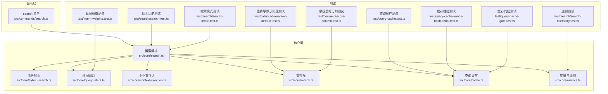
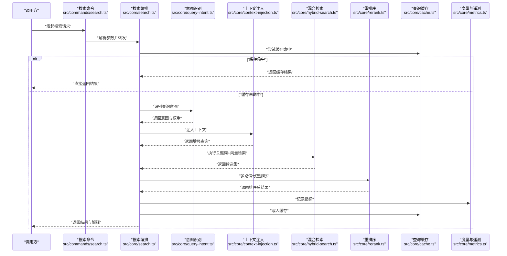
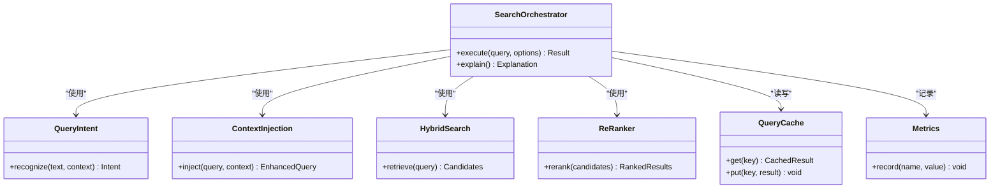

# 语义搜索与检索

<cite>
**本文引用的文件**   
- [README.md](file://README.md)
- [DESIGN.md](file://DESIGN.md)
- [src/core/search.ts](file://src/core/search.ts)
- [src/core/hybrid-search.ts](file://src/core/hybrid-search.ts)
- [src/core/query-intent.ts](file://src/core/query-intent.ts)
- [src/core/context-injection.ts](file://src/core/context-injection.ts)
- [src/core/rerank.ts](file://src/core/rerank.ts)
- [src/core/cache.ts](file://src/core/cache.ts)
- [src/core/metrics.ts](file://src/core/metrics.ts)
- [src/commands/search.ts](file://src/commands/search.ts)
- [test/search/search.test.ts](file://test/search/search.test.ts)
- [test/search/search-mode.test.ts](file://test/search/search-mode.test.ts)
- [test/search/search-telemetry.test.ts](file://test/search/search-telemetry.test.ts)
- [test/balanced-reranker-default.test.ts](file://test/balanced-reranker-default.test.ts)
- [test/cosine-rescore-column.test.ts](file://test/cosine-rescore-column.test.ts)
- [test/intent-weights.test.ts](file://test/intent-weights.test.ts)
- [test/query-cache.test.ts](file://test/query-cache.test.ts)
- [test/query-cache-knobs-hash.serial.test.ts](file://test/query-cache-knobs-hash.serial.test.ts)
- [test/query-cache-gate.test.ts](file://test/query-cache-gate.test.ts)
</cite>

## 目录
1. [简介](#简介)
2. [项目结构](#项目结构)
3. [核心组件](#核心组件)
4. [架构总览](#架构总览)
5. [详细组件分析](#详细组件分析)
6. [依赖关系分析](#依赖关系分析)
7. [性能考量](#性能考量)
8. [故障排查指南](#故障排查指南)
9. [结论](#结论)
10. [附录](#附录)

## 简介
本文件面向“语义搜索与检索”系统，聚焦混合搜索架构（关键词、向量与相关性排序融合）、查询意图识别、上下文注入、结果重排序、搜索模式切换、缓存策略与性能优化、结果解释性与可追溯性、配置调优与A/B测试框架、质量评估指标与监控告警机制。文档以代码级分析与可视化为主，辅以实践指南，帮助读者快速理解并高效使用该系统。

## 项目结构
仓库采用分层组织：核心能力位于 src/core，命令入口在 src/commands，测试覆盖于 test。与搜索相关的关键模块包括搜索编排、混合检索、意图识别、上下文注入、重排序、缓存与度量等。

图表来源
- [src/commands/search.ts](file://src/commands/search.ts)
- [src/core/search.ts](file://src/core/search.ts)
- [src/core/hybrid-search.ts](file://src/core/hybrid-search.ts)
- [src/core/query-intent.ts](file://src/core/query-intent.ts)
- [src/core/context-injection.ts](file://src/core/context-injection.ts)
- [src/core/rerank.ts](file://src/core/rerank.ts)
- [src/core/cache.ts](file://src/core/cache.ts)
- [src/core/metrics.ts](file://src/core/metrics.ts)
- [test/search/search.test.ts](file://test/search/search.test.ts)
- [test/search/search-mode.test.ts](file://test/search/search-mode.test.ts)
- [test/search/search-telemetry.test.ts](file://test/search/search-telemetry.test.ts)
- [test/balanced-reranker-default.test.ts](file://test/balanced-reranker-default.test.ts)
- [test/cosine-rescore-column.test.ts](file://test/cosine-rescore-column.test.ts)
- [test/intent-weights.test.ts](file://test/intent-weights.test.ts)
- [test/query-cache.test.ts](file://test/query-cache.test.ts)
- [test/query-cache-knobs-hash.serial.test.ts](file://test/query-cache-knobs-hash.serial.test.ts)
- [test/query-cache-gate.test.ts](file://test/query-cache-gate.test.ts)

章节来源
- [README.md](file://README.md)
- [DESIGN.md](file://DESIGN.md)

## 核心组件
- 搜索编排：统一接收查询参数，协调意图识别、上下文注入、混合检索与重排序，输出最终结果与解释信息。
- 混合检索：并行或串行执行关键词检索与向量检索，并对候选集进行合并与归一化打分。
- 意图识别：基于查询文本与上下文推断用户意图，驱动后续检索策略与权重分配。
- 上下文注入：将会话历史、领域知识、权限范围等上下文注入到查询中，提升召回与排序准确性。
- 重排序：对候选结果应用多路信号（如余弦相似度、BM25、时间衰减、来源权重）进行精细排序。
- 查询缓存：对稳定查询进行缓存，支持键控、门控与失效策略，降低重复查询延迟。
- 度量与遥测：采集关键指标（延迟、命中率、评分分布、错误率），用于监控与A/B对比。

章节来源
- [src/core/search.ts](file://src/core/search.ts)
- [src/core/hybrid-search.ts](file://src/core/hybrid-search.ts)
- [src/core/query-intent.ts](file://src/core/query-intent.ts)
- [src/core/context-injection.ts](file://src/core/context-injection.ts)
- [src/core/rerank.ts](file://src/core/rerank.ts)
- [src/core/cache.ts](file://src/core/cache.ts)
- [src/core/metrics.ts](file://src/core/metrics.ts)

## 架构总览
下图展示一次典型搜索请求的端到端流程，从命令入口到最终结果返回，包含意图识别、上下文注入、混合检索、重排序与缓存命中路径。

图表来源
- [src/commands/search.ts](file://src/commands/search.ts)
- [src/core/search.ts](file://src/core/search.ts)
- [src/core/query-intent.ts](file://src/core/query-intent.ts)
- [src/core/context-injection.ts](file://src/core/context-injection.ts)
- [src/core/hybrid-search.ts](file://src/core/hybrid-search.ts)
- [src/core/rerank.ts](file://src/core/rerank.ts)
- [src/core/cache.ts](file://src/core/cache.ts)
- [src/core/metrics.ts](file://src/core/metrics.ts)

## 详细组件分析

### 搜索编排（Search Orchestration）
- 职责：统一入口，管理生命周期，串联意图识别、上下文注入、混合检索与重排序；负责结果解释与可追溯性字段填充；对接缓存与度量。
- 关键点：
  - 参数校验与模式选择（关键词、向量、混合）。
  - 并行度控制与超时处理。
  - 结果拼接与去重。
  - 解释字段生成（来源、分数构成、意图标签）。
- 建议：
  - 为不同模式提供独立流水线，便于A/B实验与灰度发布。
  - 引入可插拔的重排序器与上下文提供者，保持扩展性。

章节来源
- [src/core/search.ts](file://src/core/search.ts)
- [test/search/search.test.ts](file://test/search/search.test.ts)
- [test/search/search-mode.test.ts](file://test/search/search-mode.test.ts)

### 混合检索（Hybrid Search）
- 职责：组合关键词检索与向量检索，产出高质量候选集。
- 关键点：
  - 关键词检索：利用倒排索引与分词策略，保证精确匹配与术语召回。
  - 向量检索：基于嵌入模型与近似最近邻算法，捕获语义相似性。
  - 候选合并：按分数归一化与阈值过滤，避免低质量结果污染。
- 建议：
  - 动态调整两路召回比例，依据意图识别结果与历史表现。
  - 对长尾查询启用模糊匹配与同义词扩展。

章节来源
- [src/core/hybrid-search.ts](file://src/core/hybrid-search.ts)
- [test/cosine-rescore-column.test.ts](file://test/cosine-rescore-column.test.ts)

### 意图识别（Query Intent Recognition）
- 职责：从查询文本与上下文中推断用户意图，决定检索策略与权重。
- 关键点：
  - 规则与模型结合：短规则快速分类，复杂场景由轻量模型判断。
  - 意图标签体系：如“事实型”、“探索型”、“比较型”等。
  - 权重映射：将意图映射到关键词与向量的权重系数。
- 建议：
  - 维护意图-权重映射表，支持在线热更新。
  - 针对特定领域训练专用分类器，提高准确率。

章节来源
- [src/core/query-intent.ts](file://src/core/query-intent.ts)
- [test/intent-weights.test.ts](file://test/intent-weights.test.ts)

### 上下文注入（Context Injection）
- 职责：将会话历史、领域知识、权限范围等上下文注入查询，提升召回与排序准确性。
- 关键点：
  - 会话摘要：压缩历史对话为关键片段。
  - 领域提示：注入业务术语与约束条件。
  - 权限过滤：根据用户角色与数据可见性裁剪候选集。
- 建议：
  - 提供上下文模板与变量替换机制，便于配置管理。
  - 对敏感信息进行脱敏处理，保障隐私合规。

章节来源
- [src/core/context-injection.ts](file://src/core/context-injection.ts)

### 重排序（Re-ranking）
- 职责：对候选结果应用多路信号进行精细排序，平衡相关性、时效性与多样性。
- 关键点：
  - 多路信号：余弦相似度、BM25、时间衰减、来源权重、点击反馈。
  - 归一化与加权：确保各信号在同一量纲下可比。
  - 可解释性：输出每路信号的贡献度，便于调试与优化。
- 建议：
  - 提供多种重排序策略（如平衡型、时效优先、权威优先），按需切换。
  - 引入学习排序（Learning to Rank）模型，持续优化权重。

章节来源
- [src/core/rerank.ts](file://src/core/rerank.ts)
- [test/balanced-reranker-default.test.ts](file://test/balanced-reranker-default.test.ts)
- [test/cosine-rescore-column.test.ts](file://test/cosine-rescore-column.test.ts)

### 查询缓存（Query Cache）
- 职责：对稳定查询进行缓存，降低重复查询延迟，提升吞吐。
- 关键点：
  - 键控策略：基于查询指纹、上下文哈希与模式标识生成唯一键。
  - 门控机制：根据查询复杂度、实时性要求决定是否走缓存。
  - 失效策略：基于TTL、内容变更事件或人工刷新。
- 建议：
  - 区分读多写少与高并发场景，选择合适的缓存后端。
  - 监控命中率与过期率，动态调整TTL与容量。

章节来源
- [src/core/cache.ts](file://src/core/cache.ts)
- [test/query-cache.test.ts](file://test/query-cache.test.ts)
- [test/query-cache-knobs-hash.serial.test.ts](file://test/query-cache-knobs-hash.serial.test.ts)
- [test/query-cache-gate.test.ts](file://test/query-cache-gate.test.ts)

### 度量与遥测（Metrics & Telemetry）
- 职责：采集关键指标，支撑监控、告警与A/B实验。
- 关键点：
  - 延迟指标：P50/P95/P99延迟，分阶段统计。
  - 质量指标：NDCG、Recall@K、Precision@K、平均倒数排名。
  - 资源指标：CPU、内存、缓存命中率、错误率。
- 建议：
  - 集成分布式追踪，定位瓶颈环节。
  - 设置阈值告警，异常自动降级或熔断。

章节来源
- [src/core/metrics.ts](file://src/core/metrics.ts)
- [test/search/search-telemetry.test.ts](file://test/search/search-telemetry.test.ts)

## 依赖关系分析
搜索编排作为中心节点，依赖意图识别、上下文注入、混合检索、重排序、缓存与度量模块。测试用例覆盖各组件行为与边界条件，确保稳定性与正确性。

图表来源
- [src/core/search.ts](file://src/core/search.ts)
- [src/core/query-intent.ts](file://src/core/query-intent.ts)
- [src/core/context-injection.ts](file://src/core/context-injection.ts)
- [src/core/hybrid-search.ts](file://src/core/hybrid-search.ts)
- [src/core/rerank.ts](file://src/core/rerank.ts)
- [src/core/cache.ts](file://src/core/cache.ts)
- [src/core/metrics.ts](file://src/core/metrics.ts)

章节来源
- [src/core/search.ts](file://src/core/search.ts)
- [src/core/hybrid-search.ts](file://src/core/hybrid-search.ts)
- [src/core/query-intent.ts](file://src/core/query-intent.ts)
- [src/core/context-injection.ts](file://src/core/context-injection.ts)
- [src/core/rerank.ts](file://src/core/rerank.ts)
- [src/core/cache.ts](file://src/core/cache.ts)
- [src/core/metrics.ts](file://src/core/metrics.ts)

## 性能考量
- 并行与异步：混合检索的两路召回可并行执行，减少整体延迟。
- 缓存命中：对高频查询启用缓存，显著降低后端压力。
- 流式处理：大结果集采用分页与增量加载，避免内存峰值。
- 资源隔离：为不同租户或任务分配独立线程池与连接池。
- 监控与告警：实时监控关键指标，异常自动降级或熔断。

[本节为通用指导，无需源码引用]

## 故障排查指南
- 常见问题：
  - 缓存未命中：检查键控策略与门控逻辑，确认上下文变化是否导致键冲突。
  - 意图识别偏差：查看意图标签分布与权重映射，必要时调整分类器或规则。
  - 重排序异常：核对各信号归一化与加权逻辑，验证解释字段一致性。
  - 延迟飙升：分析P95/P99延迟分布，定位瓶颈环节（如向量检索、数据库IO）。
- 诊断工具：
  - 启用详细日志与分布式追踪，记录每个阶段的耗时与状态。
  - 使用A/B测试框架对比不同策略的效果与性能。
  - 定期运行回归测试与基准测试，确保版本升级无退化。

章节来源
- [test/query-cache.test.ts](file://test/query-cache.test.ts)
- [test/query-cache-knobs-hash.serial.test.ts](file://test/query-cache-knobs-hash.serial.test.ts)
- [test/query-cache-gate.test.ts](file://test/query-cache-gate.test.ts)
- [test/search/search-telemetry.test.ts](file://test/search/search-telemetry.test.ts)

## 结论
本系统通过混合检索、意图识别、上下文注入与重排序的协同工作，实现了高精度、低延迟的语义搜索体验。配合完善的缓存策略、度量监控与A/B测试框架，可在生产环境中持续优化与演进。建议团队关注可解释性与可追溯性，建立闭环的质量评估体系，确保搜索效果与用户体验稳步提升。

[本节为总结性内容，无需源码引用]

## 附录

### 搜索配置调优指南
- 关键词与向量权重：根据意图识别结果动态调整，事实型查询偏向关键词，探索型查询偏向向量。
- 重排序策略：提供多种策略（平衡型、时效优先、权威优先），按业务需求选择。
- 缓存TTL：根据数据更新频率与查询热点设定合理TTL，平衡一致性与性能。
- 并发与超时：根据资源负载与SLA要求调整并发度与超时阈值。

[本节为通用指导，无需源码引用]

### A/B测试框架
- 实验设计：定义对照组与实验组，明确评估指标（如NDCG、延迟、转化率）。
- 流量切分：按比例随机分配用户流量，确保样本代表性。
- 结果分析：统计显著性检验，结合业务目标做出决策。
- 灰度发布：逐步扩大实验范围，观察长期效果与稳定性。

[本节为通用指导，无需源码引用]

### 搜索质量评估指标
- 相关性：NDCG@K、Precision@K、Recall@K。
- 时效性：平均更新时间、新鲜度得分。
- 多样性：类别覆盖率、新颖性指数。
- 稳定性：延迟分布、错误率、缓存命中率。

[本节为通用指导，无需源码引用]

### 监控告警机制
- 指标采集：延迟、QPS、错误率、缓存命中率、资源使用率。
- 阈值告警：设置多级阈值，触发通知与自动恢复。
- 仪表盘：可视化关键指标趋势，支持钻取与关联分析。
- 自动化：集成CI/CD流水线，自动执行回归测试与性能基准。

[本节为通用指导，无需源码引用]