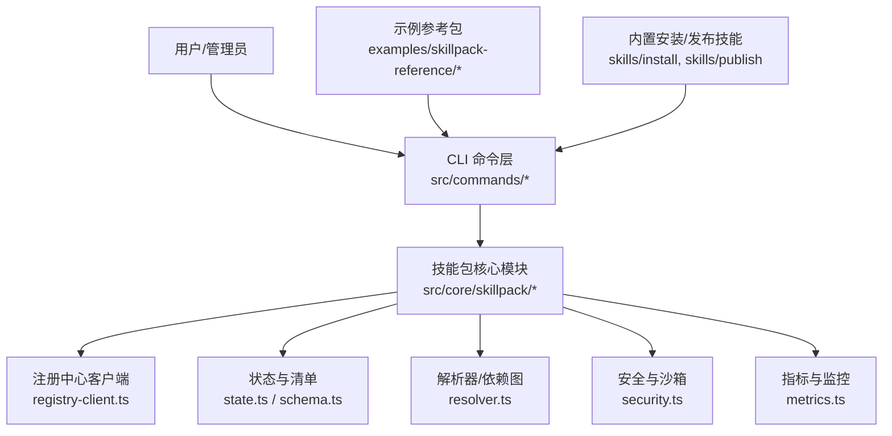
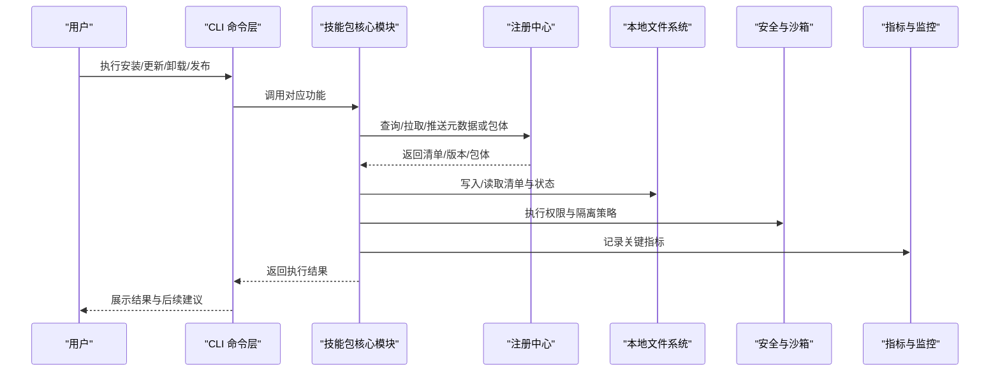
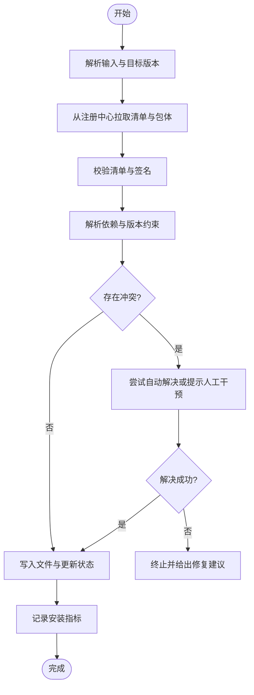
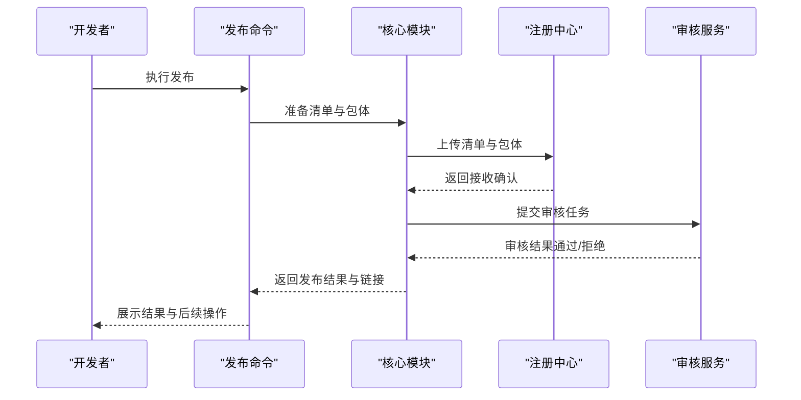
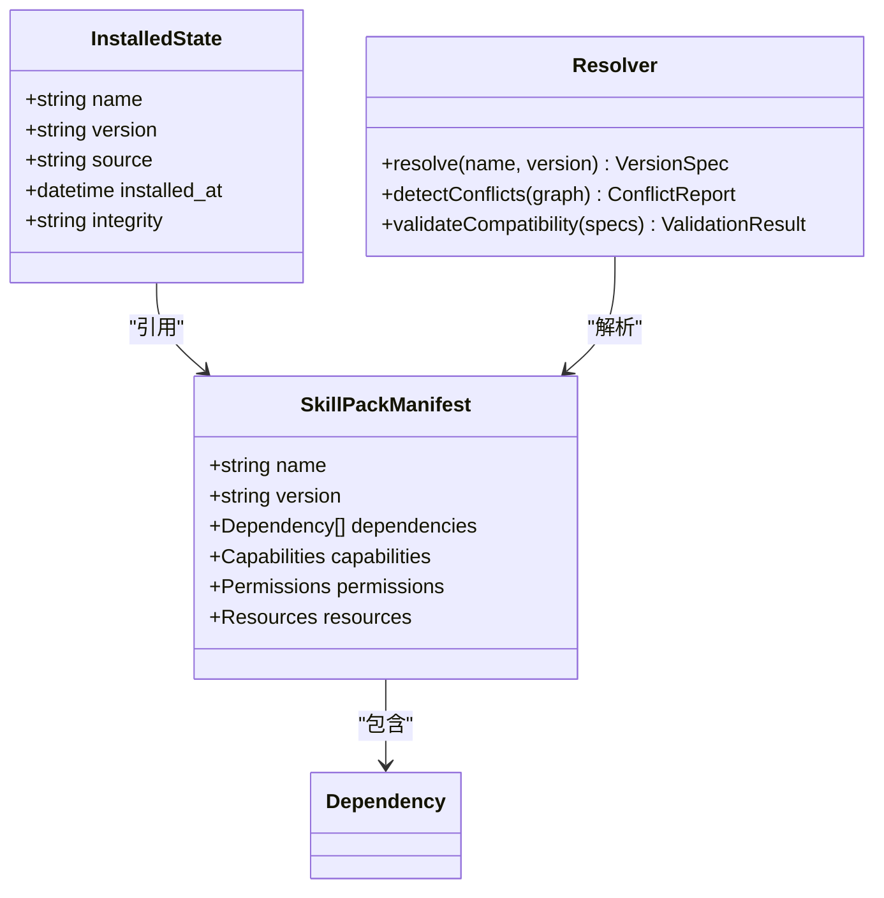
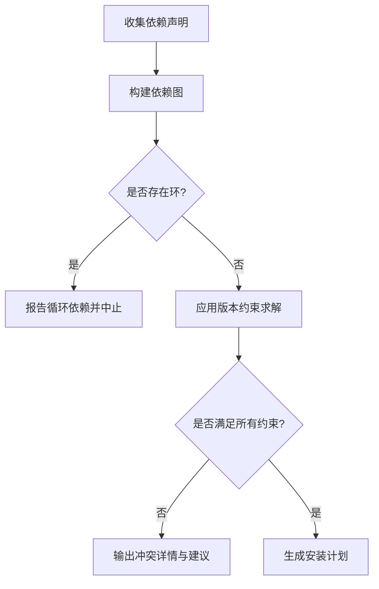
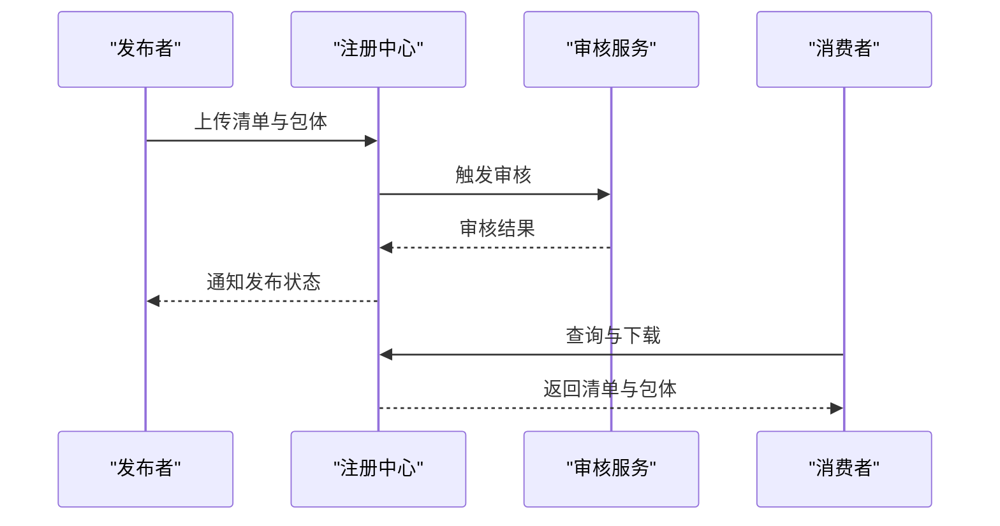
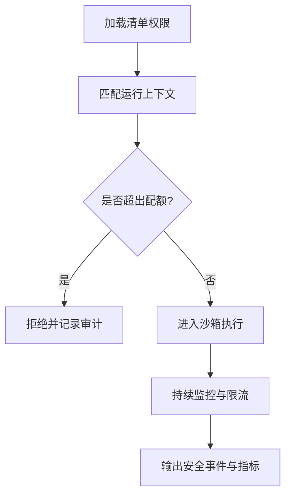

# 技能包管理

<cite>
**本文引用的文件**   
- [README.md](file://README.md)
- [INSTALL.md](file://INSTALL.md)
- [GBRAIN_SKILLPACK.md](file://docs/GBRAIN_SKILLPACK.md)
- [skillpack-anatomy.md](file://docs/skillpack-anatomy.md)
- [RELEASING.md](file://docs/RELEASING.md)
- [TESTING.md](file://docs/TESTING.md)
- [guardrails.md](file://docs/guardrails.md)
- [examples/skillpack-reference/README.md](file://examples/skillpack-reference/README.md)
- [examples/skillpack-reference/skillpack.json](file://examples/skillpack-reference/skillpack.json)
- [skills/install/index.ts](file://skills/install/index.ts)
- [skills/publish/index.ts](file://skills/publish/index.ts)
- [src/commands/skillpack-install.ts](file://src/commands/skillpack-install.ts)
- [src/commands/skillpack-publish.ts](file://src/commands/skillpack-publish.ts)
- [src/core/skillpack/registry-client.ts](file://src/core/skillpack/registry-client.ts)
- [src/core/skillpack/state.ts](file://src/core/skillpack/state.ts)
- [src/core/skillpack/schema.ts](file://src/core/skillpack/schema.ts)
- [src/core/skillpack/resolver.ts](file://src/core/skillpack/resolver.ts)
- [src/core/skillpack/security.ts](file://src/core/skillpack/security.ts)
- [src/core/skillpack/metrics.ts](file://src/core/skillpack/metrics.ts)
</cite>

## 目录
1. [简介](#简介)
2. [项目结构](#项目结构)
3. [核心组件](#核心组件)
4. [架构总览](#架构总览)
5. [详细组件分析](#详细组件分析)
6. [依赖关系与冲突检测](#依赖关系与冲突检测)
7. [注册中心、发布流程与审核机制](#注册中心发布流程与审核机制)
8. [开发环境搭建与本地测试调试](#开发环境搭建与本地测试调试)
9. [权限控制、沙箱隔离与安全策略](#权限控制沙箱隔离与安全策略)
10. [性能监控、使用统计与优化建议](#性能监控使用统计与优化建议)
11. [故障排查指南](#故障排查指南)
12. [结论](#结论)

## 简介
本文件面向技能包（Skillpack）的开发者与运维人员，系统化说明技能包的安装、更新、卸载与版本管理；阐述依赖关系、冲突检测与兼容性验证；解释注册中心、发布流程与审核机制；提供开发环境搭建、本地测试与调试工具的使用指南；并覆盖权限控制、沙箱隔离与安全策略配置，以及性能监控、使用统计和优化建议。

## 项目结构
仓库中与“技能包”相关的文档与实现主要分布在以下位置：
- 规范与指南：docs/GBRAIN_SKILLPACK.md、docs/skillpack-anatomy.md、docs/RELEASING.md、docs/TESTING.md、docs/guardrails.md
- 示例参考：examples/skillpack-reference/
- 内置技能与命令入口：skills/install、skills/publish、src/commands/*
- 核心实现：src/core/skillpack/*

图表来源
- [src/commands/skillpack-install.ts](file://src/commands/skillpack-install.ts)
- [src/commands/skillpack-publish.ts](file://src/commands/skillpack-publish.ts)
- [src/core/skillpack/registry-client.ts](file://src/core/skillpack/registry-client.ts)
- [src/core/skillpack/state.ts](file://src/core/skillpack/state.ts)
- [src/core/skillpack/schema.ts](file://src/core/skillpack/schema.ts)
- [src/core/skillpack/resolver.ts](file://src/core/skillpack/resolver.ts)
- [src/core/skillpack/security.ts](file://src/core/skillpack/security.ts)
- [src/core/skillpack/metrics.ts](file://src/core/skillpack/metrics.ts)
- [examples/skillpack-reference/README.md](file://examples/skillpack-reference/README.md)
- [skills/install/index.ts](file://skills/install/index.ts)
- [skills/publish/index.ts](file://skills/publish/index.ts)

章节来源
- [README.md](file://README.md)
- [INSTALL.md](file://INSTALL.md)
- [docs/GBRAIN_SKILLPACK.md](file://docs/GBRAIN_SKILLPACK.md)
- [docs/skillpack-anatomy.md](file://docs/skillpack-anatomy.md)
- [examples/skillpack-reference/README.md](file://examples/skillpack-reference/README.md)

## 核心组件
- 命令层：提供安装、发布等 CLI 能力，负责参数校验、交互提示与结果输出。
- 注册中心客户端：封装与远程注册中心的通信，支持查询、拉取、推送等操作。
- 清单与状态：定义技能包清单格式、版本元数据与本地已安装状态。
- 解析器：构建依赖图、进行版本选择、冲突检测与兼容性校验。
- 安全与沙箱：执行权限检查、资源限制与运行隔离策略。
- 指标与监控：采集安装/更新/卸载、依赖解析、网络请求与运行时指标。

章节来源
- [src/commands/skillpack-install.ts](file://src/commands/skillpack-install.ts)
- [src/commands/skillpack-publish.ts](file://src/commands/skillpack-publish.ts)
- [src/core/skillpack/registry-client.ts](file://src/core/skillpack/registry-client.ts)
- [src/core/skillpack/state.ts](file://src/core/skillpack/state.ts)
- [src/core/skillpack/schema.ts](file://src/core/skillpack/schema.ts)
- [src/core/skillpack/resolver.ts](file://src/core/skillpack/resolver.ts)
- [src/core/skillpack/security.ts](file://src/core/skillpack/security.ts)
- [src/core/skillpack/metrics.ts](file://src/core/skillpack/metrics.ts)

## 架构总览
下图展示了从用户操作到核心处理再到外部系统的端到端流程。

图表来源
- [src/commands/skillpack-install.ts](file://src/commands/skillpack-install.ts)
- [src/commands/skillpack-publish.ts](file://src/commands/skillpack-publish.ts)
- [src/core/skillpack/registry-client.ts](file://src/core/skillpack/registry-client.ts)
- [src/core/skillpack/state.ts](file://src/core/skillpack/state.ts)
- [src/core/skillpack/security.ts](file://src/core/skillpack/security.ts)
- [src/core/skillpack/metrics.ts](file://src/core/skillpack/metrics.ts)

## 详细组件分析

### 安装/更新/卸载与版本管理
- 安装：解析目标标识（名称+版本），通过注册中心获取清单与包体，校验依赖与兼容性后落盘，并更新本地状态。
- 更新：对比当前版本与远端可用版本，按依赖拓扑顺序执行升级，必要时回滚失败步骤。
- 卸载：按依赖反向拓扑移除不再被引用的包，清理残留文件与状态。
- 版本管理：基于语义化版本与约束表达式进行选择与锁定，确保可重复安装。

图表来源
- [src/commands/skillpack-install.ts](file://src/commands/skillpack-install.ts)
- [src/core/skillpack/resolver.ts](file://src/core/skillpack/resolver.ts)
- [src/core/skillpack/state.ts](file://src/core/skillpack/state.ts)
- [src/core/skillpack/metrics.ts](file://src/core/skillpack/metrics.ts)

章节来源
- [src/commands/skillpack-install.ts](file://src/commands/skillpack-install.ts)
- [src/core/skillpack/resolver.ts](file://src/core/skillpack/resolver.ts)
- [src/core/skillpack/state.ts](file://src/core/skillpack/state.ts)
- [src/core/skillpack/metrics.ts](file://src/core/skillpack/metrics.ts)

### 发布流程
- 打包：依据清单生成可分发包，包含元数据、资源与可选签名。
- 推送：将包体与清单推送到注册中心，触发审核工作流（如启用）。
- 版本策略：遵循语义化版本，禁止覆盖已发布版本，仅允许增量发布。
- 回滚：通过保留历史版本与撤销标记实现快速回滚。

图表来源
- [src/commands/skillpack-publish.ts](file://src/commands/skillpack-publish.ts)
- [src/core/skillpack/registry-client.ts](file://src/core/skillpack/registry-client.ts)

章节来源
- [src/commands/skillpack-publish.ts](file://src/commands/skillpack-publish.ts)
- [src/core/skillpack/registry-client.ts](file://src/core/skillpack/registry-client.ts)
- [docs/RELEASING.md](file://docs/RELEASING.md)

### 清单与状态模型
- 清单：描述包名、版本、依赖、能力声明、权限需求、资源清单等。
- 状态：记录本地已安装包、版本锁定、安装时间、来源与完整性指纹。
- 校验：加载时进行结构校验与完整性校验，异常时阻断后续流程。

图表来源
- [src/core/skillpack/schema.ts](file://src/core/skillpack/schema.ts)
- [src/core/skillpack/state.ts](file://src/core/skillpack/state.ts)
- [src/core/skillpack/resolver.ts](file://src/core/skillpack/resolver.ts)

章节来源
- [src/core/skillpack/schema.ts](file://src/core/skillpack/schema.ts)
- [src/core/skillpack/state.ts](file://src/core/skillpack/state.ts)
- [src/core/skillpack/resolver.ts](file://src/core/skillpack/resolver.ts)

### 示例参考包
- 参考包提供了最小可用的清单与目录结构，便于快速上手。
- 可通过参考包作为模板创建新包，逐步添加能力与资源。

章节来源
- [examples/skillpack-reference/README.md](file://examples/skillpack-reference/README.md)
- [examples/skillpack-reference/skillpack.json](file://examples/skillpack-reference/skillpack.json)

## 依赖关系与冲突检测
- 依赖解析：根据清单中的依赖声明与版本约束，构建有向无环图（DAG）。
- 冲突检测：识别循环依赖、版本不兼容、能力缺失等情况。
- 兼容性验证：结合平台、运行时与上游包的 API 变更进行断言。
- 解决策略：优先满足最严格约束，必要时提示降级或替换方案。

图表来源
- [src/core/skillpack/resolver.ts](file://src/core/skillpack/resolver.ts)
- [src/core/skillpack/schema.ts](file://src/core/skillpack/schema.ts)

章节来源
- [src/core/skillpack/resolver.ts](file://src/core/skillpack/resolver.ts)
- [src/core/skillpack/schema.ts](file://src/core/skillpack/schema.ts)

## 注册中心、发布流程与审核机制
- 注册中心职责：存储清单与包体、提供查询与下载接口、维护版本历史与访问控制。
- 发布流程：打包→上传→触发审核→审核通过后公开。
- 审核机制：可配置自动化检查（签名、清单合规、依赖扫描）与人工复核。
- 访问控制：区分只读消费者与发布者角色，支持组织级白名单。

图表来源
- [src/core/skillpack/registry-client.ts](file://src/core/skillpack/registry-client.ts)
- [src/commands/skillpack-publish.ts](file://src/commands/skillpack-publish.ts)

章节来源
- [src/core/skillpack/registry-client.ts](file://src/core/skillpack/registry-client.ts)
- [src/commands/skillpack-publish.ts](file://src/commands/skillpack-publish.ts)
- [docs/RELEASING.md](file://docs/RELEASING.md)

## 开发环境搭建与本地测试调试
- 环境准备：安装运行时与 CLI，配置注册中心地址与认证信息。
- 初始化包：基于参考包或脚手架创建新项目，完善清单与能力声明。
- 本地测试：使用本地注册中心或模拟服务进行端到端验证。
- 调试技巧：开启详细日志、导出依赖图与安装计划、定位失败阶段。

章节来源
- [INSTALL.md](file://INSTALL.md)
- [docs/TESTING.md](file://docs/TESTING.md)
- [examples/skillpack-reference/README.md](file://examples/skillpack-reference/README.md)

## 权限控制、沙箱隔离与安全策略
- 权限模型：基于清单中声明的权限进行最小授权，运行时逐项校验。
- 沙箱隔离：限制文件系统、网络、进程与内存使用，防止越权与滥用。
- 安全策略：强制签名校验、白名单域名、资源配额与审计日志。
- 合规检查：在发布前与安装前执行安全检查，阻断高风险行为。

图表来源
- [src/core/skillpack/security.ts](file://src/core/skillpack/security.ts)
- [src/core/skillpack/schema.ts](file://src/core/skillpack/schema.ts)

章节来源
- [docs/guardrails.md](file://docs/guardrails.md)
- [src/core/skillpack/security.ts](file://src/core/skillpack/security.ts)
- [src/core/skillpack/schema.ts](file://src/core/skillpack/schema.ts)

## 性能监控、使用统计与优化建议
- 指标采集：安装耗时、依赖解析时长、网络往返、I/O 吞吐、错误率。
- 使用统计：包安装量、更新频率、活跃实例数、失败原因分布。
- 优化建议：缓存清单与包体、并行解析依赖、增量更新、压缩传输。
- 告警与看板：对关键阈值设置告警，建立可视化看板跟踪趋势。

章节来源
- [src/core/skillpack/metrics.ts](file://src/core/skillpack/metrics.ts)

## 故障排查指南
- 常见问题
  - 依赖冲突：查看冲突报告，调整版本约束或替换依赖。
  - 权限不足：核对清单权限与实际运行上下文，补充必要授权。
  - 网络超时：检查注册中心可达性与代理配置，重试或切换镜像源。
  - 清单校验失败：修正清单结构与必填字段，重新打包。
- 诊断步骤
  - 启用详细日志，捕获完整调用链。
  - 导出依赖图与安装计划，定位问题节点。
  - 使用本地注册中心复现问题，隔离外部因素。
  - 检查安全策略与沙箱限制，确认未误拦截。

章节来源
- [src/core/skillpack/resolver.ts](file://src/core/skillpack/resolver.ts)
- [src/core/skillpack/security.ts](file://src/core/skillpack/security.ts)
- [src/core/skillpack/metrics.ts](file://src/core/skillpack/metrics.ts)

## 结论
通过清晰的清单与状态模型、健壮的依赖解析与冲突检测、完善的注册中心与审核机制、严格的权限与沙箱策略，以及全面的监控与排障能力，技能包体系能够在保证安全与稳定的前提下，高效支撑能力的复用与演进。建议在实践中持续完善清单规范、强化安全基线、沉淀最佳实践与自动化流水线，以提升整体质量与效率。