# 智能体安全与权限

<cite>
**本文引用的文件**   
- [README.md](file://README.md)
- [SECURITY.md](file://SECURITY.md)
- [gbrain.yml](file://gbrain.yml)
- [src/schema.sql](file://src/schema.sql)
- [templates/ACCESS_POLICY.md.template](file://templates/ACCESS_POLICY.md.template)
- [scripts/check-privacy.sh](file://scripts/check-privacy.sh)
- [scripts/check-no-pii-in-agent-voice.sh](file://scripts/check-no-pii-in-agent-voice.sh)
- [scripts/check-proposal-pii.sh](file://scripts/check-proposal-pii.sh)
- [scripts/check-fixture-privacy.sh](file://scripts/check-fixture-privacy.sh)
- [scripts/check-source-config-leak.sh](file://scripts/check-source-config-leak.sh)
- [scripts/check-pg-url-redaction.sh](file://scripts/check-pg-url-redaction.sh)
- [scripts/check-test-isolation.sh](file://scripts/check-test隔离.sh)
- [test/file-upload-security.test.ts](file://test/file-upload-security.test.ts)
- [test/mcp-client-hardening.test.ts](file://test/mcp-client-hardening.test.ts)
- [test/ssrf-validate.test.ts](file://test/ssrf-validate.test.ts)
- [test/oauth.test.ts](file://test/oauth.test.ts)
- [test/oauth-authorize-scope-default.test.ts](file://test/oauth-authorize-scope-default.test.ts)
- [test/oauth-confidential-client.test.ts](file://test/oauth-confidential-client.test.ts)
- [test/supervisor-audit.test.ts](file://test/supervisor-audit.test.ts)
- [test/subagent-audit.test.ts](file://test/subagent-audit.test.ts)
- [test/facts-multi-tenant.test.ts](file://test/facts-multi-tenant.test.ts)
- [test/scope-agent-isolation.test.ts](file://test/scope-agent-isolation.test.ts)
- [test/operations-trust-boundary.test.ts](file://test/operations-trust-boundary.test.ts)
- [test/trust-boundary-contract.test.ts](file://test/trust-boundary-contract.test.ts)
- [test/serve-http-cors.test.ts](file://test/serve-http-cors.test.ts)
- [test/serve-http-health.test.ts](file://test/serve-http-health.test.ts)
- [test/serve-http-trust-proxy.test.ts](file://test/serve-http-trust-proxy.test.ts)
- [test/serve-http-bootstrap-token.test.ts](file://test/serve-http-bootstrap-token.test.ts)
- [test/gbrain-home-isolation.test.ts](file://test/gbrain-home-isolation.test.ts)
- [test/minions-shell-redact.test.ts](file://test/minions-shell-redact.test.ts)
- [test/minions-shell-validate.test.ts](file://test/minions-shell-validate.test.ts)
- [test/minions-shell-inherit.test.ts](file://test/minions-shell-inherit.test.ts)
- [test/privacy-strip-and-forget.test.ts](file://test/privacy-strip-and-forget.test.ts)
- [test/privacy-script-wired.test.ts](file://test/privacy-script-wired.test.ts)
- [test/source-config-redact.test.ts](file://test/source-config-redact.test.ts)
- [test/url-redact.test.ts](file://test/url-redact.test.ts)
- [test/timing-safe.test.ts](file://test/timing-safe.test.ts)
- [test/redos-hardening.test.ts](file://test/redos-hardening.test.ts)
- [test/process-watchdog.test.ts](file://test/process-watchdog.test.ts)
- [test/process-watchdog.serial.test.ts](file://test/process-watchdog.serial.test.ts)
- [test/worker-rss.test.ts](file://test/worker-rss.test.ts)
- [test/worker-supervised-db-probe.test.ts](file://test/worker-supervised-db-probe.test.ts)
- [test/worker-lock-renewal-shape.test.ts](file://test/worker-lock-renewal-shape.test.ts)
- [test/worker-lock-renewal.test.ts](file://test/worker-lock-renewal.test.ts)
- [test/worker-lock-renewal-e2e.serial.test.ts](file://test/worker-lock-renewal-e2e.serial.test.ts)
- [test/queue-child-done.test.ts](file://test/queue-child-done.test.ts)
- [test/queue-getstats-wedge.test.ts](file://test/queue-getstats-wedge.test.ts)
- [test/queue-lock-retry.test.ts](file://test/queue-lock-retry.test.ts)
- [test/rate-leases.test.ts](file://test/rate-leases.test.ts)
- [test/rate-leases-uncapped.test.ts](file://test/rate-leases-uncapped.test.ts)
- [test/lease-cap-controller.test.ts](file://test/lease-cap-controller.test.ts)
- [test/budget-meter.test.ts](file://test/budget-meter.test.ts)
- [test/budget-tracker.test.ts](file://test/budget-tracker.test.ts)
- [test/token-budget.test.ts](file://test/token-budget.test.ts)
- [test/spend-off-switch.test.ts](file://test/spend-off-switch.test.ts)
- [test/abort-check.test.ts](file://test/abort-check.test.ts)
- [test/timeout.test.ts](file://test/timeout.test.ts)
- [test/worker-pool.test.ts](file://test/worker-pool.test.ts)
- [test/worker-registry.serial.test.ts](file://test/worker-registry.serial.test.ts)
- [test/worker-shutdown-disconnect.test.ts](file://test/worker-shutdown-disconnect.test.ts)
- [test/worker-watchdog-trigger.test.ts](file://test/worker-watchdog-trigger.test.ts)
- [test/worker-rss.test.ts](file://test/worker-rss.test.ts)
- [test/worker-supervised-db-probe.test.ts](file://test/worker-supervised-db-probe.test.ts)
- [test/worker-lock-renewal-shape.test.ts](file://test/worker-lock-renewal-shape.test.ts)
- [test/worker-lock-renewal.test.ts](file://test/worker-lock-renewal.test.ts)
- [test/worker-lock-renewal-e2e.serial.test.ts](file://test/worker-lock-renewal-e2e.serial.test.ts)
</cite>

## 目录
1. [简介](#简介)
2. [项目结构](#项目结构)
3. [核心组件](#核心组件)
4. [架构总览](#架构总览)
5. [详细组件分析](#详细组件分析)
6. [依赖关系分析](#依赖关系分析)
7. [性能考量](#性能考量)
8. [故障排查指南](#故障排查指南)
9. [结论](#结论)
10. [附录](#附录)

## 简介
本文件面向“智能体安全与权限”主题，系统化梳理身份认证、授权与访问控制策略；角色权限模型、资源访问限制与操作审计；沙箱隔离、网络与文件系统权限；API密钥管理、令牌刷新与安全通信；安全策略配置、漏洞扫描与合规检查；多租户隔离、数据保护与隐私措施。文档以仓库中的测试与脚本为依据，确保内容可追溯、可落地。

## 项目结构
围绕安全与权限的相关实现与验证主要分布在以下位置：
- 根级安全策略与说明：README、SECURITY、gbrain.yml
- 模板与策略定义：templates/ACCESS_POLICY.md.template
- 隐私与敏感信息检测脚本：scripts/check-*.sh
- 数据库模式：src/schema.sql（用于理解实体与约束）
- 大量端到端与单元测试：test/*（覆盖认证、授权、审计、沙箱、网络、隐私等）

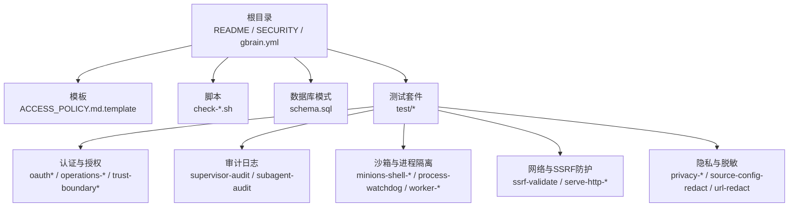

图表来源
- [README.md](file://README.md)
- [SECURITY.md](file://SECURITY.md)
- [gbrain.yml](file://gbrain.yml)
- [templates/ACCESS_POLICY.md.template](file://templates/ACCESS_POLICY.md.template)
- [src/schema.sql](file://src/schema.sql)
- [scripts/check-privacy.sh](file://scripts/check-privacy.sh)
- [scripts/check-no-pii-in-agent-voice.sh](file://scripts/check-no-pii-in-agent-voice.sh)
- [scripts/check-proposal-pii.sh](file://scripts/check-proposal-pii.sh)
- [scripts/check-fixture-privacy.sh](file://scripts/check-fixture-privacy.sh)
- [scripts/check-source-config-leak.sh](file://scripts/check-source-config-leak.sh)
- [scripts/check-pg-url-redaction.sh](file://scripts/check-pg-url-redaction.sh)
- [test/oauth.test.ts](file://test/oauth.test.ts)
- [test/operations-trust-boundary.test.ts](file://test/operations-trust-boundary.test.ts)
- [test/trust-boundary-contract.test.ts](file://test/trust-boundary-contract.test.ts)
- [test/supervisor-audit.test.ts](file://test/supervisor-audit.test.ts)
- [test/subagent-audit.test.ts](file://test/subagent-audit.test.ts)
- [test/minions-shell-redact.test.ts](file://test/minions-shell-redact.test.ts)
- [test/ssrf-validate.test.ts](file://test/ssrf-validate.test.ts)
- [test/serve-http-cors.test.ts](file://test/serve-http-cors.test.ts)
- [test/privacy-strip-and-forget.test.ts](file://test/privacy-strip-and-forget.test.ts)
- [test/source-config-redact.test.ts](file://test/source-config-redact.test.ts)
- [test/url-redact.test.ts](file://test/url-redact.test.ts)

章节来源
- [README.md](file://README.md)
- [SECURITY.md](file://SECURITY.md)
- [gbrain.yml](file://gbrain.yml)
- [templates/ACCESS_POLICY.md.template](file://templates/ACCESS_POLICY.md.template)
- [src/schema.sql](file://src/schema.sql)

## 核心组件
- 身份认证与令牌
  - OAuth 流程与客户端类型、作用域默认值、保密客户端行为由测试覆盖。
  - HTTP 启动引导令牌、CORS、健康检查、信任代理等由HTTP层测试覆盖。
- 授权与访问控制
  - 操作信任边界、范围与作用域、多租户隔离在多个测试中验证。
- 审计日志
  - 监督器与子代理的审计路径与事件记录通过测试断言。
- 沙箱与进程隔离
  - 子进程最小权限、环境变量继承、输入校验与脱敏、看门狗与资源上限。
- 网络与外部访问
  - SSRF 校验、HTTP 服务安全头与跨域策略。
- 隐私与数据保护
  - PII 检测脚本、隐私剥离与遗忘、URL 与配置脱敏。
- 配额与预算
  - 速率限制、租约上限、预算计量与开关。

章节来源
- [test/oauth.test.ts](file://test/oauth.test.ts)
- [test/oauth-authorize-scope-default.test.ts](file://test/oauth-authorize-scope-default.test.ts)
- [test/oauth-confidential-client.test.ts](file://test/oauth-confidential-client.test.ts)
- [test/serve-http-bootstrap-token.test.ts](file://test/serve-http-bootstrap-token.test.ts)
- [test/serve-http-cors.test.ts](file://test/serve-http-cors.test.ts)
- [test/serve-http-health.test.ts](file://test/serve-http-health.test.ts)
- [test/serve-http-trust-proxy.test.ts](file://test/serve-http-trust-proxy.test.ts)
- [test/operations-trust-boundary.test.ts](file://test/operations-trust-boundary.test.ts)
- [test/trust-boundary-contract.test.ts](file://test/trust-boundary-contract.test.ts)
- [test/scope-agent-isolation.test.ts](file://test/scope-agent-isolation.test.ts)
- [test/facts-multi-tenant.test.ts](file://test/facts-multi-tenant.test.ts)
- [test/supervisor-audit.test.ts](file://test/supervisor-audit.test.ts)
- [test/subagent-audit.test.ts](file://test/subagent-audit.test.ts)
- [test/minions-shell-redact.test.ts](file://test/minions-shell-redact.test.ts)
- [test/minions-shell-validate.test.ts](file://test/minions-shell-validate.test.ts)
- [test/minions-shell-inherit.test.ts](file://test/minions-shell-inherit.test.ts)
- [test/ssrf-validate.test.ts](file://test/ssrf-validate.test.ts)
- [test/privacy-strip-and-forget.test.ts](file://test/privacy-strip-and-forget.test.ts)
- [test/privacy-script-wired.test.ts](file://test/privacy-script-wired.test.ts)
- [test/source-config-redact.test.ts](file://test/source-config-redact.test.ts)
- [test/url-redact.test.ts](file://test/url-redact.test.ts)
- [test/rate-leases.test.ts](file://test/rate-leases.test.ts)
- [test/rate-leases-uncapped.test.ts](file://test/rate-leases-uncapped.test.ts)
- [test/lease-cap-controller.test.ts](file://test/lease-cap-controller.test.ts)
- [test/budget-meter.test.ts](file://test/budget-meter.test.ts)
- [test/budget-tracker.test.ts](file://test/budget-tracker.test.ts)
- [test/token-budget.test.ts](file://test/token-budget.test.ts)
- [test/spend-off-switch.test.ts](file://test/spend-off-switch.test.ts)

## 架构总览
下图展示从请求进入、认证鉴权、到执行与审计的关键路径，以及安全控制点。

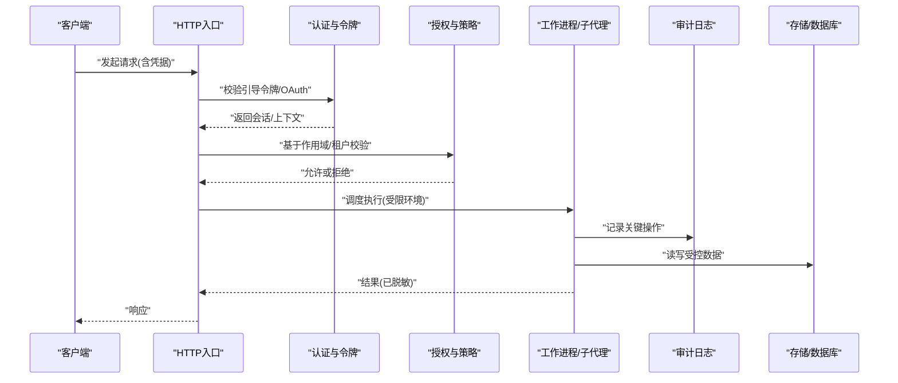

图表来源
- [test/serve-http-bootstrap-token.test.ts](file://test/serve-http-bootstrap-token.test.ts)
- [test/oauth.test.ts](file://test/oauth.test.ts)
- [test/operations-trust-boundary.test.ts](file://test/operations-trust-boundary.test.ts)
- [test/supervisor-audit.test.ts](file://test/supervisor-audit.test.ts)
- [test/subagent-audit.test.ts](file://test/subagent-audit.test.ts)
- [test/facts-multi-tenant.test.ts](file://test/facts-multi-tenant.test.ts)

## 详细组件分析

### 身份认证与令牌
- OAuth 客户端类型、作用域默认值与授权流程
  - 通过测试覆盖保密客户端、作用域默认值等行为，确保最小权限原则。
- HTTP 引导令牌与服务安全
  - 引导令牌初始化、CORS 策略、健康检查端点、信任代理设置均被测试覆盖。
- 令牌刷新与安全通信
  - 结合OAuth与HTTP入口测试，体现令牌生命周期管理与传输安全。

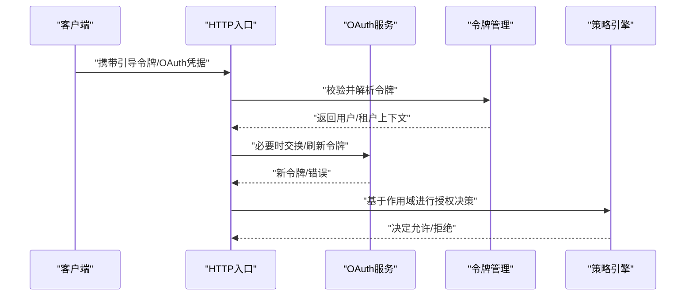

图表来源
- [test/oauth.test.ts](file://test/oauth.test.ts)
- [test/oauth-authorize-scope-default.test.ts](file://test/oauth-authorize-scope-default.test.ts)
- [test/oauth-confidential-client.test.ts](file://test/oauth-confidential-client.test.ts)
- [test/serve-http-bootstrap-token.test.ts](file://test/serve-http-bootstrap-token.test.ts)
- [test/serve-http-cors.test.ts](file://test/serve-http-cors.test.ts)
- [test/serve-http-trust-proxy.test.ts](file://test/serve-http-trust-proxy.test.ts)

章节来源
- [test/oauth.test.ts](file://test/oauth.test.ts)
- [test/oauth-authorize-scope-default.test.ts](file://test/oauth-authorize-scope-default.test.ts)
- [test/oauth-confidential-client.test.ts](file://test/oauth-confidential-client.test.ts)
- [test/serve-http-bootstrap-token.test.ts](file://test/serve-http-bootstrap-token.test.ts)
- [test/serve-http-cors.test.ts](file://test/serve-http-cors.test.ts)
- [test/serve-http-trust-proxy.test.ts](file://test/serve-http-trust-proxy.test.ts)

### 授权与访问控制
- 操作信任边界与契约
  - 通过“信任边界”相关测试验证操作是否越界、是否遵循最小权限。
- 作用域与多租户隔离
  - 作用域归一化、范围解析与多租户事实隔离测试保障数据与操作边界。
- 访问策略模板
  - ACCESS_POLICY 模板提供策略描述规范，便于统一治理。

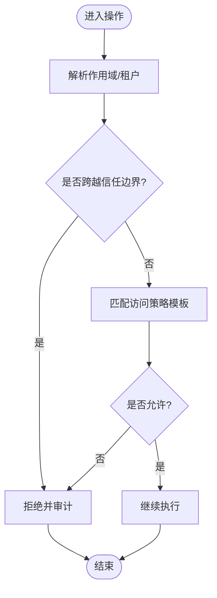

图表来源
- [test/operations-trust-boundary.test.ts](file://test/operations-trust-boundary.test.ts)
- [test/trust-boundary-contract.test.ts](file://test/trust-boundary-contract.test.ts)
- [test/scope-agent-isolation.test.ts](file://test/scope-agent-isolation.test.ts)
- [test/facts-multi-tenant.test.ts](file://test/facts-multi-tenant.test.ts)
- [templates/ACCESS_POLICY.md.template](file://templates/ACCESS_POLICY.md.template)

章节来源
- [test/operations-trust-boundary.test.ts](file://test/operations-trust-boundary.test.ts)
- [test/trust-boundary-contract.test.ts](file://test/trust-boundary-contract.test.ts)
- [test/scope-agent-isolation.test.ts](file://test/scope-agent-isolation.test.ts)
- [test/facts-multi-tenant.test.ts](file://test/facts-multi-tenant.test.ts)
- [templates/ACCESS_POLICY.md.template](file://templates/ACCESS_POLICY.md.template)

### 操作审计日志
- 监督器与子代理审计
  - 监督器与子代理的关键事件（如生命周期、错误、状态变更）被审计记录，便于追踪与回溯。
- 审计写入时机
  - 在关键路径（授权后、执行前/后、异常分支）写入审计条目。

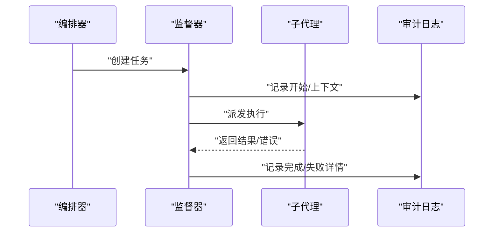

图表来源
- [test/supervisor-audit.test.ts](file://test/supervisor-audit.test.ts)
- [test/subagent-audit.test.ts](file://test/subagent-audit.test.ts)

章节来源
- [test/supervisor-audit.test.ts](file://test/supervisor-audit.test.ts)
- [test/subagent-audit.test.ts](file://test/subagent-audit.test.ts)

### 沙箱隔离与进程安全
- 子进程最小权限与环境隔离
  - 环境变量继承控制、输入参数校验与脱敏、进程看门狗与资源上限。
- 工作进程池与锁续期
  - 工作进程注册、RSS 监控、锁续期与优雅关闭，避免资源泄漏与僵尸进程。

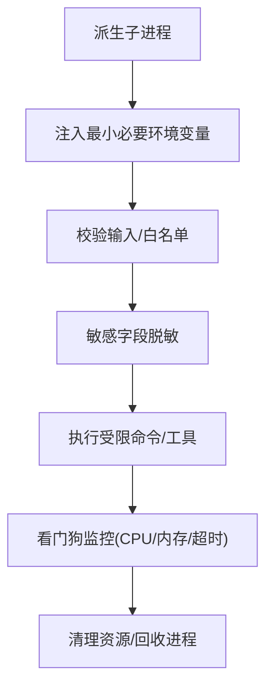

图表来源
- [test/minions-shell-inherit.test.ts](file://test/minions-shell-inherit.test.ts)
- [test/minions-shell-validate.test.ts](file://test/minions-shell-validate.test.ts)
- [test/minions-shell-redact.test.ts](file://test/minions-shell-redact.test.ts)
- [test/process-watchdog.test.ts](file://test/process-watchdog.serial.test.ts)
- [test/worker-pool.test.ts](file://test/worker-pool.test.ts)
- [test/worker-registry.serial.test.ts](file://test/worker-registry.serial.test.ts)
- [test/worker-rss.test.ts](file://test/worker-rss.test.ts)
- [test/worker-lock-renewal.test.ts](file://test/worker-lock-renewal-shape.test.ts)
- [test/worker-lock-renewal-e2e.serial.test.ts](file://test/worker-lock-renewal-e2e.serial.test.ts)
- [test/worker-shutdown-disconnect.test.ts](file://test/worker-shutdown-disconnect.test.ts)
- [test/worker-watchdog-trigger.test.ts](file://test/worker-watchdog-trigger.test.ts)

章节来源
- [test/minions-shell-inherit.test.ts](file://test/minions-shell-inherit.test.ts)
- [test/minions-shell-validate.test.ts](file://test/minions-shell-validate.test.ts)
- [test/minions-shell-redact.test.ts](file://test/minions-shell-redact.test.ts)
- [test/process-watchdog.test.ts](file://test/process-watchdog.serial.test.ts)
- [test/worker-pool.test.ts](file://test/worker-pool.test.ts)
- [test/worker-registry.serial.test.ts](file://test/worker-registry.serial.test.ts)
- [test/worker-rss.test.ts](file://test/worker-rss.test.ts)
- [test/worker-lock-renewal.test.ts](file://test/worker-lock-renewal-shape.test.ts)
- [test/worker-lock-renewal-e2e.serial.test.ts](file://test/worker-lock-renewal-e2e.serial.test.ts)
- [test/worker-shutdown-disconnect.test.ts](file://test/worker-shutdown-disconnect.test.ts)
- [test/worker-watchdog-trigger.test.ts](file://test/worker-watchdog-trigger.test.ts)

### 网络访问控制与SSRF防护
- SSRF 校验
  - 对外部URL访问进行严格校验，防止内网探测与越权访问。
- HTTP 服务安全
  - CORS 策略、健康检查端点、信任代理配置，降低横向移动风险。

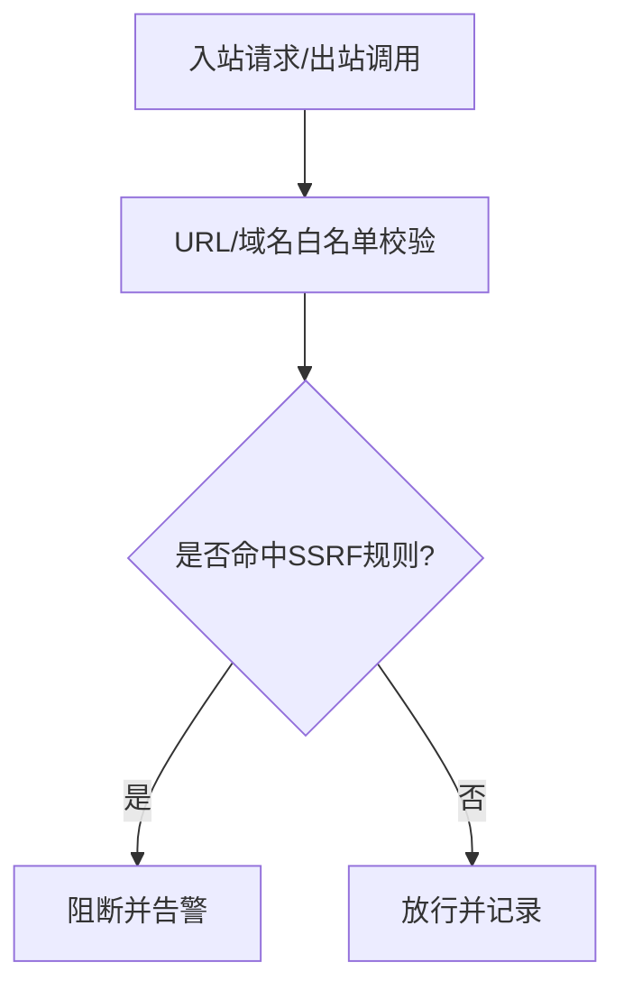

图表来源
- [test/ssrf-validate.test.ts](file://test/ssrf-validate.test.ts)
- [test/serve-http-cors.test.ts](file://test/serve-http-cors.test.ts)
- [test/serve-http-health.test.ts](file://test/serve-http-health.test.ts)
- [test/serve-http-trust-proxy.test.ts](file://test/serve-http-trust-proxy.test.ts)

章节来源
- [test/ssrf-validate.test.ts](file://test/ssrf-validate.test.ts)
- [test/serve-http-cors.test.ts](file://test/serve-http-cors.test.ts)
- [test/serve-http-health.test.ts](file://test/serve-http-health.test.ts)
- [test/serve-http-trust-proxy.test.ts](file://test/serve-http-trust-proxy.test.ts)

### 文件系统与上传安全
- 文件上传安全
  - 对上传内容进行类型、大小、路径与内容安全检查，防止恶意载荷。
- 家目录隔离
  - 智能体家目录隔离测试确保不同实例间不互相影响。

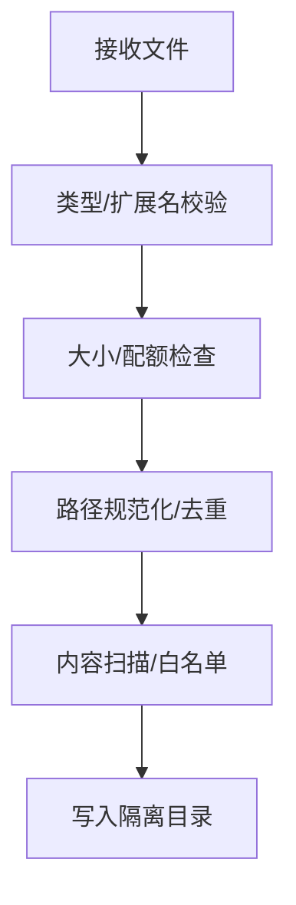

图表来源
- [test/file-upload-security.test.ts](file://test/file-upload-security.test.ts)
- [test/gbrain-home-isolation.test.ts](file://test/gbrain-home-isolation.test.ts)

章节来源
- [test/file-upload-security.test.ts](file://test/file-upload-security.test.ts)
- [test/gbrain-home-isolation.test.ts](file://test/gbrain-home-isolation.test.ts)

### API密钥管理与安全通信
- 引导令牌与HTTP入口
  - 通过引导令牌初始化服务，配合CORS与信任代理，确保初始接入安全。
- OAuth 与保密客户端
  - 支持保密客户端与标准授权流程，确保密钥不外泄。

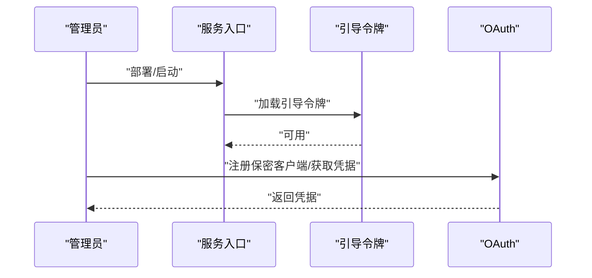

图表来源
- [test/serve-http-bootstrap-token.test.ts](file://test/serve-http-bootstrap-token.test.ts)
- [test/oauth-confidential-client.test.ts](file://test/oauth-confidential-client.test.ts)

章节来源
- [test/serve-http-bootstrap-token.test.ts](file://test/serve-http-bootstrap-token.test.ts)
- [test/oauth-confidential-client.test.ts](file://test/oauth-confidential-client.test.ts)

### 安全策略配置、漏洞扫描与合规检查
- 隐私与PII检测脚本
  - 针对代码、提案、夹具与语音内容的PII检测，预防敏感信息泄露。
- 配置与连接串脱敏
  - 检查PG URL脱敏、源配置泄露检测，避免密钥落盘或日志外泄。
- 测试隔离与稳定性
  - 测试隔离脚本确保并发与资源隔离，减少侧信道风险。

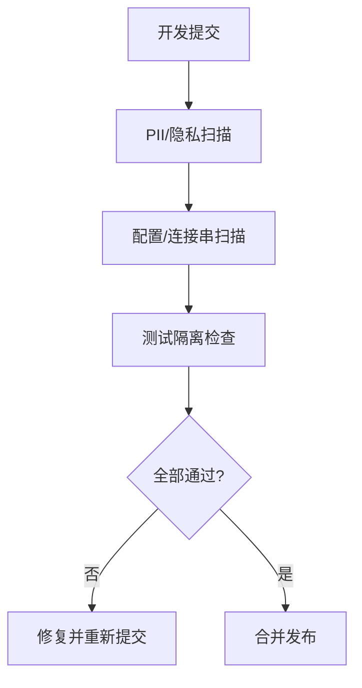

图表来源
- [scripts/check-privacy.sh](file://scripts/check-privacy.sh)
- [scripts/check-no-pii-in-agent-voice.sh](file://scripts/check-no-pii-in-agent-voice.sh)
- [scripts/check-proposal-pii.sh](file://scripts/check-proposal-pii.sh)
- [scripts/check-fixture-privacy.sh](file://scripts/check-fixture-privacy.sh)
- [scripts/check-source-config-leak.sh](file://scripts/check-source-config-leak.sh)
- [scripts/check-pg-url-redaction.sh](file://scripts/check-pg-url-redaction.sh)
- [scripts/check-test-isolation.sh](file://scripts/check-test-isolation.sh)

章节来源
- [scripts/check-privacy.sh](file://scripts/check-privacy.sh)
- [scripts/check-no-pii-in-agent-voice.sh](file://scripts/check-no-pii-in-agent-voice.sh)
- [scripts/check-proposal-pii.sh](file://scripts/check-proposal-pii.sh)
- [scripts/check-fixture-privacy.sh](file://scripts/check-fixture-privacy.sh)
- [scripts/check-source-config-leak.sh](file://scripts/check-source-config-leak.sh)
- [scripts/check-pg-url-redaction.sh](file://scripts/check-pg-url-redaction.sh)
- [scripts/check-test-isolation.sh](file://scripts/check-test-isolation.sh)

### 多租户隔离、数据保护与隐私措施
- 多租户与范围隔离
  - 通过作用域与多租户事实隔离测试，确保不同租户数据互不可见。
- 隐私剥离与遗忘
  - 运行时隐私剥离与“遗忘”机制，满足合规要求。
- URL与配置脱敏
  - 输出与日志中对URL与配置进行脱敏处理。

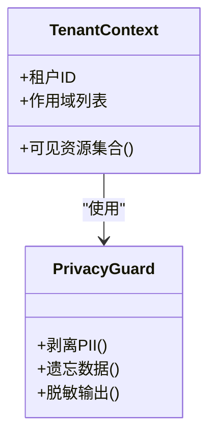

图表来源
- [test/facts-multi-tenant.test.ts](file://test/facts-multi-tenant.test.ts)
- [test/scope-agent-isolation.test.ts](file://test/scope-agent-isolation.test.ts)
- [test/privacy-strip-and-forget.test.ts](file://test/privacy-strip-and-forget.test.ts)
- [test/privacy-script-wired.test.ts](file://test/privacy-script-wired.test.ts)
- [test/source-config-redact.test.ts](file://test/source-config-redact.test.ts)
- [test/url-redact.test.ts](file://test/url-redact.test.ts)

章节来源
- [test/facts-multi-tenant.test.ts](file://test/facts-multi-tenant.test.ts)
- [test/scope-agent-isolation.test.ts](file://test/scope-agent-isolation.test.ts)
- [test/privacy-strip-and-forget.test.ts](file://test/privacy-strip-and-forget.test.ts)
- [test/privacy-script-wired.test.ts](file://test/privacy-script-wired.test.ts)
- [test/source-config-redact.test.ts](file://test/source-config-redact.test.ts)
- [test/url-redact.test.ts](file://test/url-redact.test.ts)

### 配额、预算与抗滥用
- 速率限制与租约上限
  - 通过速率限制与租约上限测试，防止资源耗尽与滥用。
- 预算计量与开关
  - 预算跟踪、令牌预算与支出开关，确保成本可控。

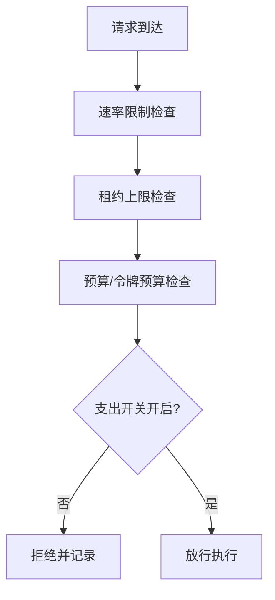

图表来源
- [test/rate-leases.test.ts](file://test/rate-leases.test.ts)
- [test/rate-leases-uncapped.test.ts](file://test/rate-leases-uncapped.test.ts)
- [test/lease-cap-controller.test.ts](file://test/lease-cap-controller.test.ts)
- [test/budget-meter.test.ts](file://test/budget-meter.test.ts)
- [test/budget-tracker.test.ts](file://test/budget-tracker.test.ts)
- [test/token-budget.test.ts](file://test/token-budget.test.ts)
- [test/spend-off-switch.test.ts](file://test/spend-off-switch.test.ts)

章节来源
- [test/rate-leases.test.ts](file://test/rate-leases.test.ts)
- [test/rate-leases-uncapped.test.ts](file://test/rate-leases-uncapped.test.ts)
- [test/lease-cap-controller.test.ts](file://test/lease-cap-controller.test.ts)
- [test/budget-meter.test.ts](file://test/budget-meter.test.ts)
- [test/budget-tracker.test.ts](file://test/budget-tracker.test.ts)
- [test/token-budget.test.ts](file://test/token-budget.test.ts)
- [test/spend-off-switch.test.ts](file://test/spend-off-switch.test.ts)

## 依赖关系分析
- 组件耦合与内聚
  - 认证与授权集中在HTTP入口与策略层；审计贯穿各子系统；沙箱与进程管理独立成模块，降低耦合。
- 外部依赖与集成点
  - OAuth 提供方、HTTP 服务、数据库与文件系统为关键集成点，均有相应测试覆盖。
- 潜在循环依赖
  - 通过职责分层（入口-策略-执行-审计）避免循环依赖。

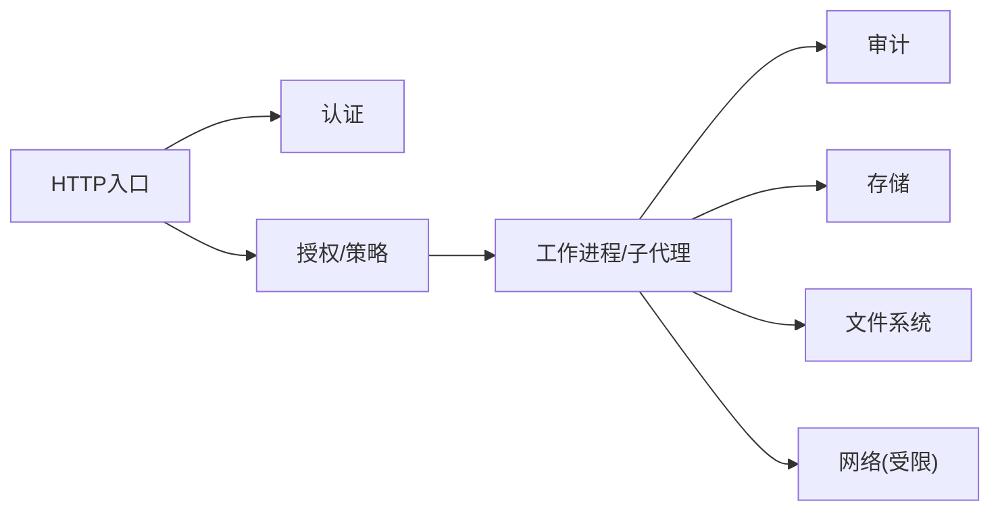

图表来源
- [test/serve-http-bootstrap-token.test.ts](file://test/serve-http-bootstrap-token.test.ts)
- [test/oauth.test.ts](file://test/oauth.test.ts)
- [test/operations-trust-boundary.test.ts](file://test/operations-trust-boundary.test.ts)
- [test/supervisor-audit.test.ts](file://test/supervisor-audit.test.ts)
- [test/subagent-audit.test.ts](file://test/subagent-audit.test.ts)
- [test/ssrf-validate.test.ts](file://test/ssrf-validate.test.ts)
- [test/file-upload-security.test.ts](file://test/file-upload-security.test.ts)

章节来源
- [test/serve-http-bootstrap-token.test.ts](file://test/serve-http-bootstrap-token.test.ts)
- [test/oauth.test.ts](file://test/oauth.test.ts)
- [test/operations-trust-boundary.test.ts](file://test/operations-trust-boundary.test.ts)
- [test/supervisor-audit.test.ts](file://test/supervisor-audit.test.ts)
- [test/subagent-audit.test.ts](file://test/subagent-audit.test.ts)
- [test/ssrf-validate.test.ts](file://test/ssrf-validate.test.ts)
- [test/file-upload-security.test.ts](file://test/file-upload-security.test.ts)

## 性能考量
- 进程与资源上限
  - 通过看门狗与RSS监控避免内存泄漏与CPU占用过高。
- 队列与锁优化
  - 队列重试与锁续期保证高可用与低延迟。
- 预算与限流
  - 预算与速率限制避免雪崩效应，提升整体稳定性。

[本节为通用指导，无需特定文件引用]

## 故障排查指南
- 常见安全问题定位
  - 认证失败：检查引导令牌与OAuth配置。
  - 授权拒绝：核对作用域与信任边界策略。
  - 审计缺失：确认审计写入路径与权限。
  - 沙箱异常：查看子进程输入校验与脱敏日志。
  - 网络问题：核查SSRF规则与CORS配置。
  - 隐私泄露：运行PII与配置脱敏脚本。
- 建议步骤
  - 启用更详细的审计日志。
  - 复现最小用例并对比测试用例。
  - 逐步放开限制定位瓶颈。

章节来源
- [test/supervisor-audit.test.ts](file://test/supervisor-audit.test.ts)
- [test/subagent-audit.test.ts](file://test/subagent-audit.test.ts)
- [test/operations-trust-boundary.test.ts](file://test/operations-trust-boundary.test.ts)
- [test/ssrf-validate.test.ts](file://test/ssrf-validate.test.ts)
- [test/privacy-strip-and-forget.test.ts](file://test/privacy-strip-and-forget.test.ts)

## 结论
本仓库在认证、授权、审计、沙箱、网络、隐私与配额等方面具备完善的测试覆盖与脚本支撑，形成从入口到执行的全链路安全闭环。建议在持续集成中强化隐私与配置扫描，完善审计可观测性，并定期演练故障场景以提升韧性。

[本节为总结性内容，无需特定文件引用]

## 附录
- 参考文件
  - README、SECURITY、gbrain.yml 提供总体安全策略与配置指引。
  - ACCESS_POLICY 模板用于统一策略描述。
  - schema.sql 帮助理解数据实体与约束，辅助权限建模。

章节来源
- [README.md](file://README.md)
- [SECURITY.md](file://SECURITY.md)
- [gbrain.yml](file://gbrain.yml)
- [templates/ACCESS_POLICY.md.template](file://templates/ACCESS_POLICY.md.template)
- [src/schema.sql](file://src/schema.sql)