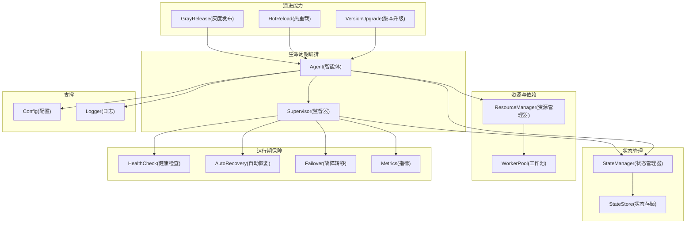
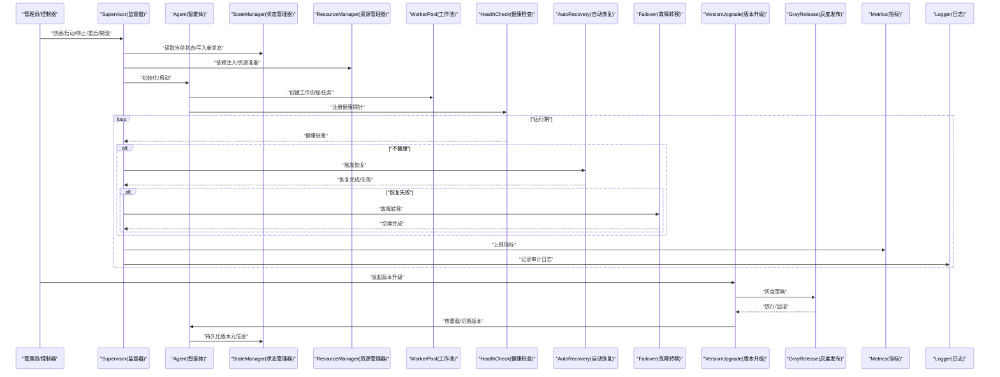
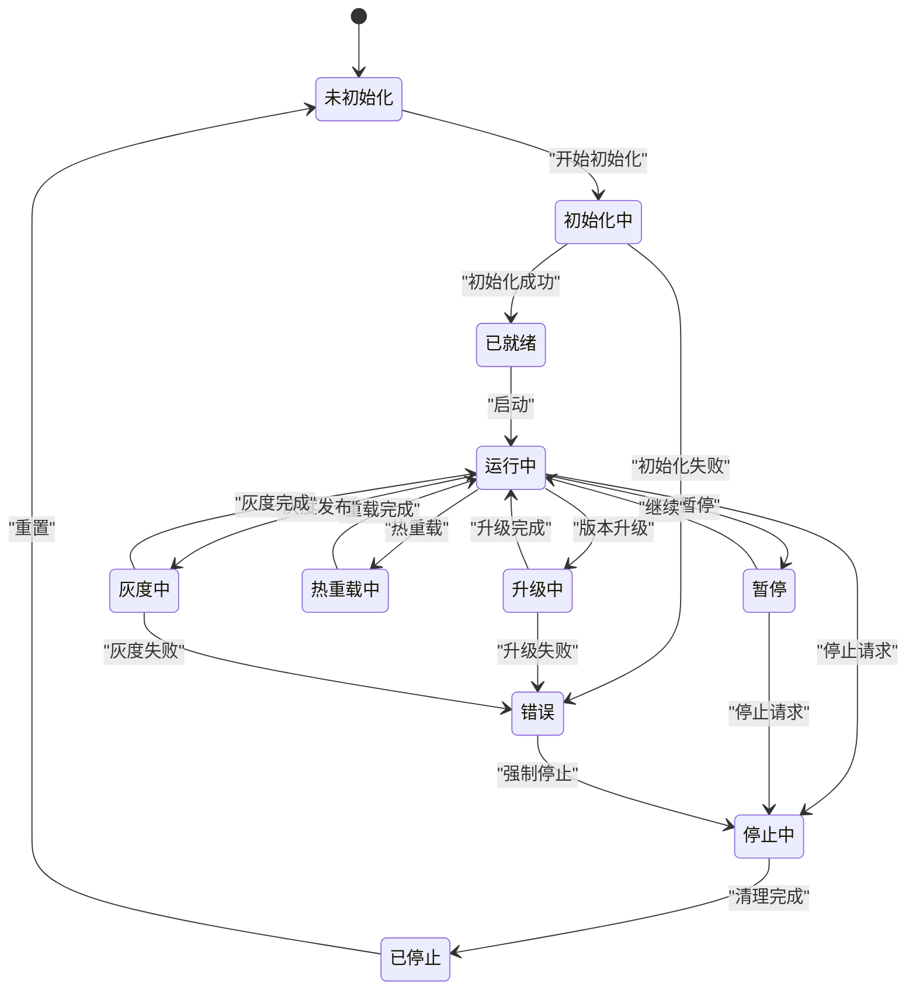
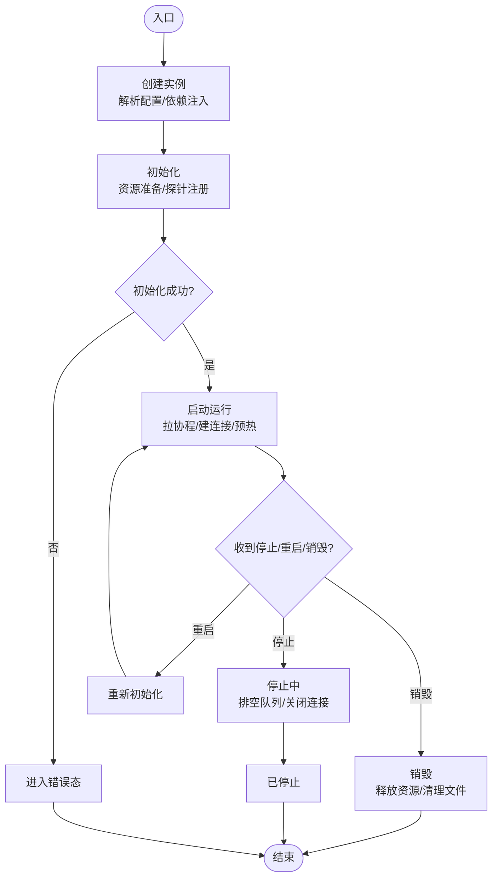
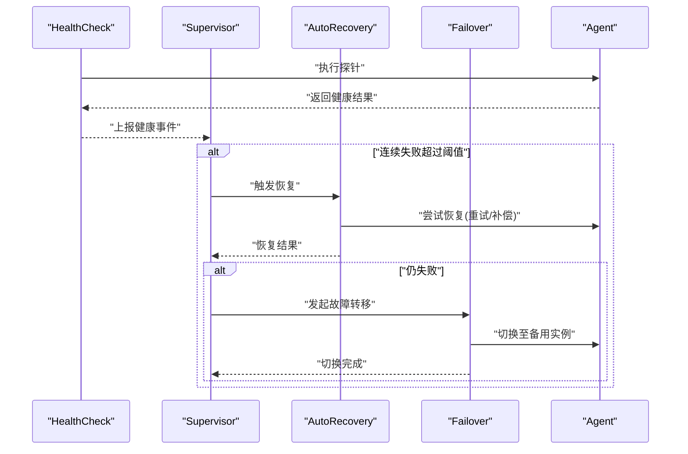
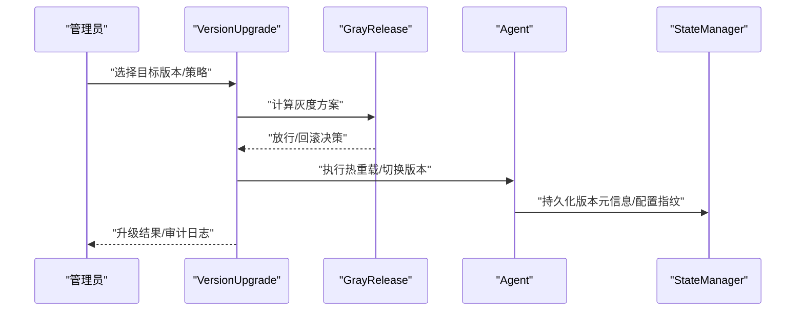
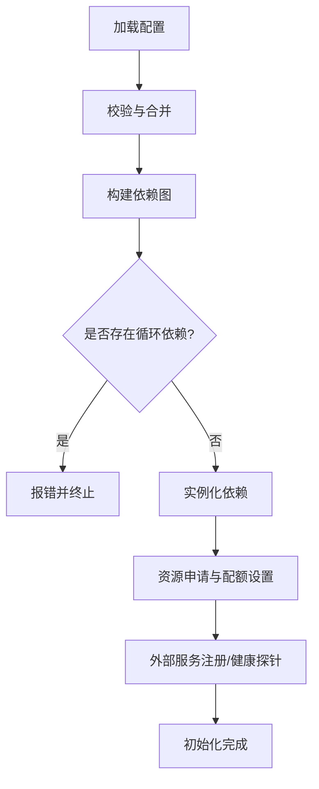
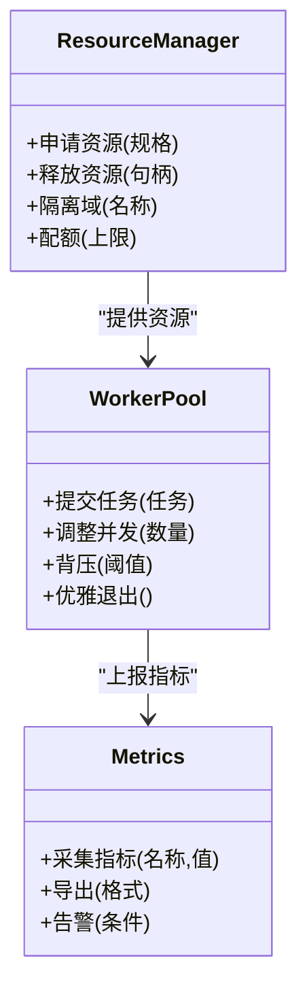
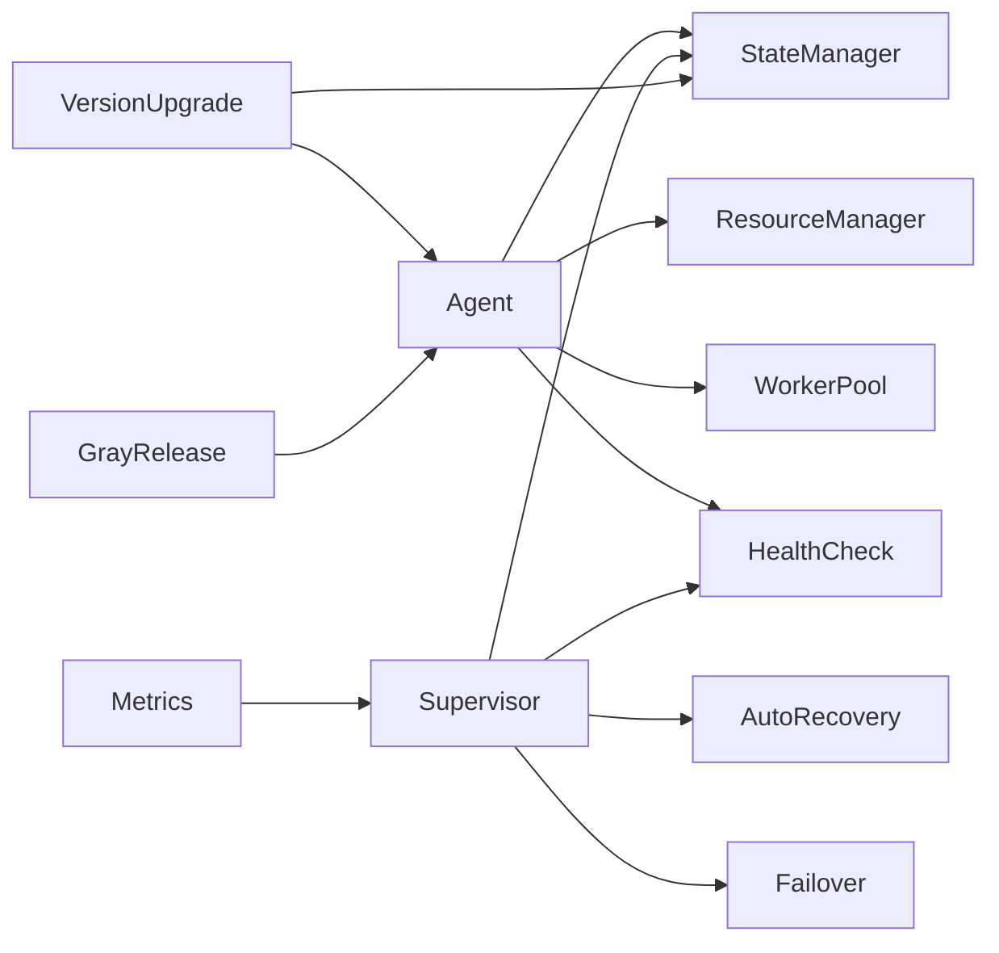

# 智能体生命周期管理

<cite>
**本文引用的文件**   
- [src/core/agent.ts](file://src/core/agent.ts)
- [src/core/supervisor.ts](file://src/core/supervisor.ts)
- [src/core/worker-pool.ts](file://src/core/worker-pool.ts)
- [src/core/health-check.ts](file://src/core/health-check.ts)
- [src/core/state-manager.ts](file://src/core/state-manager.ts)
- [src/core/resource-manager.ts](file://src/core/resource-manager.ts)
- [src/core/version-upgrade.ts](file://src/core/version-upgrade.ts)
- [src/core/gray-release.ts](file://src/core/gray-release.ts)
- [src/core/isolation.ts](file://src/core/isolation.ts)
- [src/core/metrics.ts](file://src/core/metrics.ts)
- [src/core/config.ts](file://src/core/config.ts)
- [src/core/logger.ts](file://src/core/logger.ts)
</cite>

## 目录
1. [简介](#简介)
2. [项目结构](#项目结构)
3. [核心组件](#核心组件)
4. [架构总览](#架构总览)
5. [详细组件分析](#详细组件分析)
6. [依赖关系分析](#依赖关系分析)
7. [性能考虑](#性能考虑)
8. [故障排查指南](#故障排查指南)
9. [结论](#结论)
10. [附录](#附录)

## 简介
本文件面向“智能体”（Agent）的完整生命周期管理，覆盖创建、启动、停止、重启与销毁；阐述状态转换机制、状态监控与持久化策略；说明初始化流程、依赖注入与资源准备；给出健康检查、自动恢复与故障转移配置；并解释版本升级、热重载与灰度发布支持；最后提供资源隔离、内存管理与性能调优建议。文档以代码级实现为依据，辅以可视化图示帮助理解。

## 项目结构
围绕智能体生命周期，核心模块按职责分层组织：
- 生命周期编排：负责创建、启动、停止、重启、销毁等阶段控制
- 状态管理：定义状态机、状态转换规则、状态快照与持久化
- 资源管理：依赖注入、资源准备与释放、隔离与配额
- 运行期保障：健康检查、自动恢复、故障转移、指标采集
- 演进能力：版本升级、热重载、灰度发布
- 可观测性：日志、指标、告警

图表来源
- [src/core/agent.ts:1-200](file://src/core/agent.ts#L1-L200)
- [src/core/supervisor.ts:1-200](file://src/core/supervisor.ts#L1-L200)
- [src/core/state-manager.ts:1-200](file://src/core/state-manager.ts#L1-L200)
- [src/core/resource-manager.ts:1-200](file://src/core/resource-manager.ts#L1-L200)
- [src/core/worker-pool.ts:1-200](file://src/core/worker-pool.ts#L1-L200)
- [src/core/health-check.ts:1-200](file://src/core/health-check.ts#L1-L200)
- [src/core/version-upgrade.ts:1-200](file://src/core/version-upgrade.ts#L1-L200)
- [src/core/gray-release.ts:1-200](file://src/core/gray-release.ts#L1-L200)
- [src/core/config.ts:1-200](file://src/core/config.ts#L1-L200)
- [src/core/logger.ts:1-200](file://src/core/logger.ts#L1-L200)

章节来源
- [src/core/agent.ts:1-200](file://src/core/agent.ts#L1-L200)
- [src/core/supervisor.ts:1-200](file://src/core/supervisor.ts#L1-L200)
- [src/core/state-manager.ts:1-200](file://src/core/state-manager.ts#L1-L200)
- [src/core/resource-manager.ts:1-200](file://src/core/resource-manager.ts#L1-L200)
- [src/core/worker-pool.ts:1-200](file://src/core/worker-pool.ts#L1-L200)
- [src/core/health-check.ts:1-200](file://src/core/health-check.ts#L1-L200)
- [src/core/version-upgrade.ts:1-200](file://src/core/version-upgrade.ts#L1-L200)
- [src/core/gray-release.ts:1-200](file://src/core/gray-release.ts#L1-L200)
- [src/core/config.ts:1-200](file://src/core/config.ts#L1-L200)
- [src/core/logger.ts:1-200](file://src/core/logger.ts#L1-L200)

## 核心组件
- Agent（智能体）
  - 职责：封装业务逻辑、对外暴露能力、协调内部子组件、响应外部事件
  - 关键行为：初始化、启动、运行、停止、销毁、重启、热重载、版本切换
- Supervisor（监督器）
  - 职责：编排生命周期、驱动状态机、执行健康检查、触发恢复与故障转移
- StateManager（状态管理器）
  - 职责：维护状态机、校验转换合法性、生成与加载快照、持久化状态
- ResourceManager（资源管理器）
  - 职责：依赖注入、资源申请与释放、隔离与配额、连接池与缓存管理
- WorkerPool（工作池）
  - 职责：任务调度、并发控制、背压与限流、优雅退出
- HealthCheck（健康检查）
  - 职责：探针注册、周期探测、阈值判定、降级与熔断
- AutoRecovery（自动恢复）
  - 职责：失败检测、退避重试、断点续跑、幂等恢复
- Failover（故障转移）
  - 职责：主备选举、流量切换、数据一致性保障
- VersionUpgrade（版本升级）
  - 职责：兼容性检查、增量迁移、回滚策略、蓝绿/金丝雀切换
- HotReload（热重载）
  - 职责：无中断更新、上下文迁移、状态对齐
- GrayRelease（灰度发布）
  - 职责：流量切分、渐进放量、快速回滚、质量门禁
- Metrics（指标）
  - 职责：运行时指标采集、聚合导出、告警联动
- Config（配置）
  - 职责：配置加载、合并、校验、动态刷新
- Logger（日志）
  - 职责：结构化日志、采样与脱敏、分级输出

章节来源
- [src/core/agent.ts:1-200](file://src/core/agent.ts#L1-L200)
- [src/core/supervisor.ts:1-200](file://src/core/supervisor.ts#L1-L200)
- [src/core/state-manager.ts:1-200](file://src/core/state-manager.ts#L1-L200)
- [src/core/resource-manager.ts:1-200](file://src/core/resource-manager.ts#L1-L200)
- [src/core/worker-pool.ts:1-200](file://src/core/worker-pool.ts#L1-L200)
- [src/core/health-check.ts:1-200](file://src/core/health-check.ts#L1-L200)
- [src/core/version-upgrade.ts:1-200](file://src/core/version-upgrade.ts#L1-L200)
- [src/core/gray-release.ts:1-200](file://src/core/gray-release.ts#L1-L200)
- [src/core/metrics.ts:1-200](file://src/core/metrics.ts#L1-L200)
- [src/core/config.ts:1-200](file://src/core/config.ts#L1-L200)
- [src/core/logger.ts:1-200](file://src/core/logger.ts#L1-L200)

## 架构总览
下图展示智能体在生命周期各阶段的调用链路与组件交互。

图表来源
- [src/core/supervisor.ts:1-200](file://src/core/supervisor.ts#L1-L200)
- [src/core/agent.ts:1-200](file://src/core/agent.ts#L1-L200)
- [src/core/state-manager.ts:1-200](file://src/core/state-manager.ts#L1-L200)
- [src/core/resource-manager.ts:1-200](file://src/core/resource-manager.ts#L1-L200)
- [src/core/worker-pool.ts:1-200](file://src/core/worker-pool.ts#L1-L200)
- [src/core/health-check.ts:1-200](file://src/core/health-check.ts#L1-L200)
- [src/core/version-upgrade.ts:1-200](file://src/core/version-upgrade.ts#L1-L200)
- [src/core/gray-release.ts:1-200](file://src/core/gray-release.ts#L1-L200)
- [src/core/metrics.ts:1-200](file://src/core/metrics.ts#L1-L200)
- [src/core/logger.ts:1-200](file://src/core/logger.ts#L1-L200)

## 详细组件分析

### 智能体状态机与转换
- 状态集合
  - 未初始化、初始化中、已就绪、运行中、暂停、停止中、已停止、错误、升级中、热重载中、灰度中
- 转换规则
  - 仅允许合法边跳转，非法转换被拒绝并记录审计日志
  - 进入/离开钩子用于资源准备与清理
  - 状态变更需原子写入并落盘，保证崩溃后可恢复
- 快照与持久化
  - 周期性快照与关键事件快照
  - 快照包含版本、配置指纹、资源句柄摘要、工作进度标记
  - 恢复时优先从最新有效快照重建

图表来源
- [src/core/state-manager.ts:1-200](file://src/core/state-manager.ts#L1-L200)
- [src/core/agent.ts:1-200](file://src/core/agent.ts#L1-L200)

章节来源
- [src/core/state-manager.ts:1-200](file://src/core/state-manager.ts#L1-L200)
- [src/core/agent.ts:1-200](file://src/core/agent.ts#L1-L200)

### 生命周期编排（创建、启动、停止、重启、销毁）
- 创建
  - 解析配置、构建依赖图、预分配资源、注册健康探针
- 启动
  - 进入初始化中→已就绪→运行中，拉起工作协程、建立外部连接、预热缓存
- 停止
  - 停止接收新任务、等待队列排空、关闭连接、释放资源、写最终快照
- 重启
  - 先停止再启动，保留必要状态，确保幂等
- 销毁
  - 彻底释放所有资源、清理临时文件、注销服务发现与健康探针

图表来源
- [src/core/supervisor.ts:1-200](file://src/core/supervisor.ts#L1-L200)
- [src/core/agent.ts:1-200](file://src/core/agent.ts#L1-L200)
- [src/core/resource-manager.ts:1-200](file://src/core/resource-manager.ts#L1-L200)

章节来源
- [src/core/supervisor.ts:1-200](file://src/core/supervisor.ts#L1-L200)
- [src/core/agent.ts:1-200](file://src/core/agent.ts#L1-L200)
- [src/core/resource-manager.ts:1-200](file://src/core/resource-manager.ts#L1-L200)

### 健康检查、自动恢复与故障转移
- 健康检查
  - 探针类型：存活、就绪、业务探针
  - 阈值与退避：连续失败次数、冷却时间、抖动
  - 动作：降级、熔断、告警、触发恢复
- 自动恢复
  - 失败分类：可恢复/不可恢复
  - 策略：指数退避、最大重试、断点续跑、幂等补偿
- 故障转移
  - 主备模式：心跳、租约、抢占
  - 切换流程：冻结旧实例、迁移会话、重放未完成事务、验证一致性

图表来源
- [src/core/health-check.ts:1-200](file://src/core/health-check.ts#L1-L200)
- [src/core/supervisor.ts:1-200](file://src/core/supervisor.ts#L1-L200)
- [src/core/agent.ts:1-200](file://src/core/agent.ts#L1-L200)

章节来源
- [src/core/health-check.ts:1-200](file://src/core/health-check.ts#L1-L200)
- [src/core/supervisor.ts:1-200](file://src/core/supervisor.ts#L1-L200)
- [src/core/agent.ts:1-200](file://src/core/agent.ts#L1-L200)

### 版本升级、热重载与灰度发布
- 版本升级
  - 兼容性检查、增量迁移、回滚预案、蓝绿/金丝雀切换
- 热重载
  - 无中断更新、上下文迁移、状态对齐、回滚到上一稳定版本
- 灰度发布
  - 流量切分、渐进放量、质量门禁、快速回滚

图表来源
- [src/core/version-upgrade.ts:1-200](file://src/core/version-upgrade.ts#L1-L200)
- [src/core/gray-release.ts:1-200](file://src/core/gray-release.ts#L1-L200)
- [src/core/agent.ts:1-200](file://src/core/agent.ts#L1-L200)
- [src/core/state-manager.ts:1-200](file://src/core/state-manager.ts#L1-L200)

章节来源
- [src/core/version-upgrade.ts:1-200](file://src/core/version-upgrade.ts#L1-L200)
- [src/core/gray-release.ts:1-200](file://src/core/gray-release.ts#L1-L200)
- [src/core/agent.ts:1-200](file://src/core/agent.ts#L1-L200)
- [src/core/state-manager.ts:1-200](file://src/core/state-manager.ts#L1-L200)

### 初始化流程、依赖注入与资源准备
- 初始化流程
  - 加载配置、校验参数、构建依赖图、初始化子系统
- 依赖注入
  - 声明式依赖、循环依赖检测、延迟加载
- 资源准备
  - 连接池、缓存、文件系统、网络端口、外部服务注册
  - 资源上限与配额、隔离域划分

图表来源
- [src/core/config.ts:1-200](file://src/core/config.ts#L1-L200)
- [src/core/resource-manager.ts:1-200](file://src/core/resource-manager.ts#L1-L200)
- [src/core/agent.ts:1-200](file://src/core/agent.ts#L1-L200)

章节来源
- [src/core/config.ts:1-200](file://src/core/config.ts#L1-L200)
- [src/core/resource-manager.ts:1-200](file://src/core/resource-manager.ts#L1-L200)
- [src/core/agent.ts:1-200](file://src/core/agent.ts#L1-L200)

### 资源隔离、内存管理与性能调优
- 资源隔离
  - 进程/线程/容器级隔离、命名空间、Cgroup 限制
- 内存管理
  - 对象池、大对象直出、GC 友好数据结构、内存泄漏检测
- 性能调优
  - 并发度、批大小、超时与重试、背压与限流、缓存命中率优化
  - 指标驱动调优：CPU、内存、I/O、网络、队列深度、P99 延迟

图表来源
- [src/core/resource-manager.ts:1-200](file://src/core/resource-manager.ts#L1-L200)
- [src/core/worker-pool.ts:1-200](file://src/core/worker-pool.ts#L1-L200)
- [src/core/metrics.ts:1-200](file://src/core/metrics.ts#L1-L200)

章节来源
- [src/core/resource-manager.ts:1-200](file://src/core/resource-manager.ts#L1-L200)
- [src/core/worker-pool.ts:1-200](file://src/core/worker-pool.ts#L1-L200)
- [src/core/metrics.ts:1-200](file://src/core/metrics.ts#L1-L200)

## 依赖关系分析
- 耦合与内聚
  - Agent 与 Supervisor 高内聚，通过接口解耦具体实现
  - StateManager 独立于业务逻辑，便于替换存储后端
  - ResourceManager 抽象资源类型，屏蔽底层差异
- 直接/间接依赖
  - Agent 依赖 StateManager、ResourceManager、WorkerPool、HealthCheck
  - Supervisor 依赖 StateManager、HealthCheck、AutoRecovery、Failover
  - VersionUpgrade 与 GrayRelease 通过 Agent 与 StateManager 协作
- 潜在循环依赖
  - 通过延迟注入与事件总线避免环
- 外部集成点
  - 配置中心、服务发现、指标系统、日志系统、消息队列

图表来源
- [src/core/agent.ts:1-200](file://src/core/agent.ts#L1-L200)
- [src/core/supervisor.ts:1-200](file://src/core/supervisor.ts#L1-L200)
- [src/core/state-manager.ts:1-200](file://src/core/state-manager.ts#L1-L200)
- [src/core/resource-manager.ts:1-200](file://src/core/resource-manager.ts#L1-L200)
- [src/core/worker-pool.ts:1-200](file://src/core/worker-pool.ts#L1-L200)
- [src/core/health-check.ts:1-200](file://src/core/health-check.ts#L1-L200)
- [src/core/version-upgrade.ts:1-200](file://src/core/version-upgrade.ts#L1-L200)
- [src/core/gray-release.ts:1-200](file://src/core/gray-release.ts#L1-L200)
- [src/core/metrics.ts:1-200](file://src/core/metrics.ts#L1-L200)

章节来源
- [src/core/agent.ts:1-200](file://src/core/agent.ts#L1-L200)
- [src/core/supervisor.ts:1-200](file://src/core/supervisor.ts#L1-L200)
- [src/core/state-manager.ts:1-200](file://src/core/state-manager.ts#L1-L200)
- [src/core/resource-manager.ts:1-200](file://src/core/resource-manager.ts#L1-L200)
- [src/core/worker-pool.ts:1-200](file://src/core/worker-pool.ts#L1-L200)
- [src/core/health-check.ts:1-200](file://src/core/health-check.ts#L1-L200)
- [src/core/version-upgrade.ts:1-200](file://src/core/version-upgrade.ts#L1-L200)
- [src/core/gray-release.ts:1-200](file://src/core/gray-release.ts#L1-L200)
- [src/core/metrics.ts:1-200](file://src/core/metrics.ts#L1-L200)

## 性能考虑
- 并发与吞吐
  - 根据 CPU/IO 特性调整工作协程数与批大小
  - 使用有界队列与背压防止雪崩
- 延迟与稳定性
  - 合理设置超时、重试与退避，避免尾部延迟放大
  - 关键路径去同步化，异步化非关键步骤
- 资源利用
  - 连接复用、对象池、缓存命中优化
  - 内存水位监控与自适应降载
- 观测与调优
  - 基于 P95/P99 延迟、错误率、饱和度指标进行容量规划
  - 定期压测与回归，确保变更后性能达标

[本节为通用指导，无需特定文件引用]

## 故障排查指南
- 常见问题定位
  - 启动失败：检查配置校验、依赖注入、资源配额、外部连通性
  - 运行异常：查看健康探针、错误分类、自动恢复日志
  - 升级失败：确认兼容性矩阵、迁移脚本、回滚策略
- 诊断手段
  - 启用调试日志与结构化审计日志
  - 抓取快照与堆栈，对比前后版本差异
  - 指标看板：CPU、内存、I/O、队列深度、错误率
- 恢复策略
  - 幂等重试、断点续跑、无损回滚、灰度快速回切

章节来源
- [src/core/logger.ts:1-200](file://src/core/logger.ts#L1-L200)
- [src/core/metrics.ts:1-200](file://src/core/metrics.ts#L1-L200)
- [src/core/health-check.ts:1-200](file://src/core/health-check.ts#L1-L200)
- [src/core/version-upgrade.ts:1-200](file://src/core/version-upgrade.ts#L1-L200)

## 结论
本方案以状态机为核心，结合监督器编排、资源管理与运行期保障，形成完整的智能体生命周期闭环。通过健康检查、自动恢复与故障转移提升可用性；借助版本升级、热重载与灰度发布保障演进安全；配合资源隔离、内存管理与性能调优，确保在高负载下的稳定与高效。

[本节为总结性内容，无需特定文件引用]

## 附录
- 术语表
  - 智能体：具备独立生命周期与能力的业务实体
  - 监督器：负责编排与治理的智能体运行环境组件
  - 健康探针：用于评估实例可用性的检测单元
  - 灰度发布：逐步将流量切换到新版本以降低风险
- 参考实现路径
  - 生命周期编排：[src/core/supervisor.ts](file://src/core/supervisor.ts)
  - 状态管理：[src/core/state-manager.ts](file://src/core/state-manager.ts)
  - 资源管理：[src/core/resource-manager.ts](file://src/core/resource-manager.ts)
  - 健康检查：[src/core/health-check.ts](file://src/core/health-check.ts)
  - 版本升级：[src/core/version-upgrade.ts](file://src/core/version-upgrade.ts)
  - 灰度发布：[src/core/gray-release.ts](file://src/core/gray-release.ts)
  - 指标与日志：[src/core/metrics.ts](file://src/core/metrics.ts), [src/core/logger.ts](file://src/core/logger.ts)