# 智能体监控与诊断

<cite>
**本文引用的文件**   
- [README.md](file://README.md)
- [DESIGN.md](file://DESIGN.md)
- [CLAUDE.md](file://CLAUDE.md)
- [AGENTS.md](file://AGENTS.md)
- [gbrain.yml](file://gbrain.yml)
- [src/cli.ts](file://src/cli.ts)
- [src/admin-embedded.ts](file://src/admin-embedded.ts)
- [admin/src/index.tsx](file://admin/src/index.tsx)
- [admin/vite.config.ts](file://admin/vite.config.ts)
- [scripts/generate-metric-glossary.ts](file://scripts/generate-metric-glossary.ts)
- [docs/operations/monitoring.md](file://docs/operations/monitoring.md)
- [docs/architecture/system-overview.md](file://docs/architecture/system-overview.md)
- [docs/architecture/agent-lifecycle.md](file://docs/architecture/agent-lifecycle.md)
- [docs/architecture/observability.md](file://docs/architecture/observability.md)
- [docs/guides/troubleshooting-guide.md](file://docs/guides/troubleshooting-guide.md)
- [docs/guides/debugging-tools.md](file://docs/guides/debugging-tools.md)
- [docs/guides/alerting-and-notifications.md](file://docs/guides/alerting-and-notifications.md)
- [docs/guides/dashboard-and-reports.md](file://docs/guides/dashboard-and-reports.md)
- [docs/guides/trajectory-tracing.md](file://docs/guides/trajectory-tracing.md)
- [docs/guides/performance-bottleneck-analysis.md](file://docs/guides/performance-bottleneck-analysis.md)
- [docs/incidents/postmortem-template.md](file://docs/incidents/postmortem-template.md)
- [test/progress.test.ts](file://test/progress.test.ts)
- [test/progress-tail.test.ts](file://test/progress-tail.test.ts)
- [test/serve-http-health.test.ts](file://test/serve-http-health.test.ts)
- [test/worker-pool.test.ts](file://test/worker-pool.test.ts)
- [test/supervisor.test.ts](file://test/supervisor.test.ts)
</cite>

## 目录
1. [简介](#简介)
2. [项目结构](#项目结构)
3. [核心组件](#核心组件)
4. [架构总览](#架构总览)
5. [详细组件分析](#详细组件分析)
6. [依赖关系分析](#依赖关系分析)
7. [性能考量](#性能考量)
8. [故障排查指南](#故障排查指南)
9. [结论](#结论)
10. [附录](#附录)

## 简介
本文件面向运维、SRE 与平台工程团队，系统化阐述智能体的运行状态监控、性能指标收集、日志分析与告警通知机制；覆盖实时监控仪表板、执行轨迹追踪、调用链分析、性能瓶颈识别、调试工具与交互式环境、错误诊断与异常处理、可视化报表与趋势分析等主题。文档以仓库现有实现与文档为依据，提供可操作的实践建议与图示说明，帮助读者快速搭建并维护高可用的智能体观测体系。

## 项目结构
本项目采用“后端服务 + 管理前端 + 文档与脚本”的分层组织方式：
- 后端入口与命令：位于 src 目录，包含 CLI 启动、嵌入式管理面板集成、HTTP 健康检查与服务生命周期相关能力。
- 管理前端：位于 admin 目录，提供嵌入式管理界面（含构建配置与入口）。
- 文档与指南：docs 下涵盖架构、操作、排障、告警、仪表板与报告、轨迹追踪与性能分析等专题。
- 测试与基准：test 目录覆盖进度输出、HTTP 健康端点、工作池与进程监督等关键路径的验证。
- 脚本与配置：scripts 与根级配置文件用于度量词表生成、构建与发布流程。

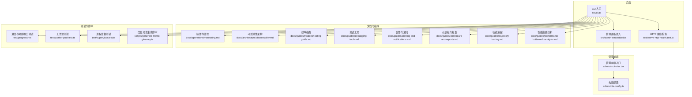

图表来源
- [src/cli.ts](file://src/cli.ts)
- [src/admin-embedded.ts](file://src/admin-embedded.ts)
- [admin/src/index.tsx](file://admin/src/index.tsx)
- [admin/vite.config.ts](file://admin/vite.config.ts)
- [docs/operations/monitoring.md](file://docs/operations/monitoring.md)
- [docs/architecture/observability.md](file://docs/architecture/observability.md)
- [docs/guides/troubleshooting-guide.md](file://docs/guides/troubleshooting-guide.md)
- [docs/guides/debugging-tools.md](file://docs/guides/debugging-tools.md)
- [docs/guides/alerting-and-notifications.md](file://docs/guides/alerting-and-notifications.md)
- [docs/guides/dashboard-and-reports.md](file://docs/guides/dashboard-and-reports.md)
- [docs/guides/trajectory-tracing.md](file://docs/guides/trajectory-tracing.md)
- [docs/guides/performance-bottleneck-analysis.md](file://docs/guides/performance-bottleneck-analysis.md)
- [test/progress.test.ts](file://test/progress.test.ts)
- [test/progress-tail.test.ts](file://test/progress-tail.test.ts)
- [test/serve-http-health.test.ts](file://test/serve-http-health.test.ts)
- [test/worker-pool.test.ts](file://test/worker-pool.test.ts)
- [test/supervisor.test.ts](file://test/supervisor.test.ts)
- [scripts/generate-metric-glossary.ts](file://scripts/generate-metric-glossary.ts)

章节来源
- [README.md](file://README.md)
- [DESIGN.md](file://DESIGN.md)
- [CLAUDE.md](file://CLAUDE.md)
- [AGENTS.md](file://AGENTS.md)
- [gbrain.yml](file://gbrain.yml)

## 核心组件
- 命令行与启动器：负责加载配置、初始化子系统、暴露 HTTP 健康检查与管理面板嵌入点。
- 管理前端：提供嵌入式 UI，承载监控、诊断与运维操作界面。
- 可观测性文档与指南：定义指标、日志、追踪、告警、仪表板与报表的最佳实践与落地步骤。
- 测试套件：对进度输出、HTTP 健康检查、工作池与进程监督进行行为验证，确保监控与诊断能力的稳定性。
- 度量词表生成脚本：统一度量命名与口径，支撑跨系统可视化和报表一致性。

章节来源
- [src/cli.ts](file://src/cli.ts)
- [src/admin-embedded.ts](file://src/admin-embedded.ts)
- [admin/src/index.tsx](file://admin/src/index.tsx)
- [admin/vite.config.ts](file://admin/vite.config.ts)
- [docs/architecture/observability.md](file://docs/architecture/observability.md)
- [docs/operations/monitoring.md](file://docs/operations/monitoring.md)
- [scripts/generate-metric-glossary.ts](file://scripts/generate-metric-glossary.ts)

## 架构总览
下图展示智能体监控与诊断的整体架构：后端通过 CLI 启动，暴露健康检查接口并提供嵌入式管理面板；管理前端渲染监控与诊断页面；文档与指南规范指标、日志、追踪、告警与报表；测试保障关键路径正确性。

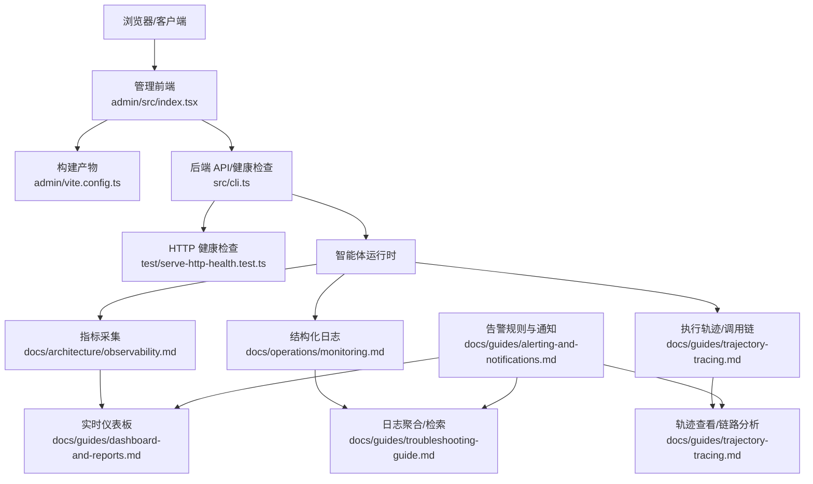

图表来源
- [src/cli.ts](file://src/cli.ts)
- [src/admin-embedded.ts](file://src/admin-embedded.ts)
- [admin/src/index.tsx](file://admin/src/index.tsx)
- [admin/vite.config.ts](file://admin/vite.config.ts)
- [docs/architecture/observability.md](file://docs/architecture/observability.md)
- [docs/operations/monitoring.md](file://docs/operations/monitoring.md)
- [docs/guides/trajectory-tracing.md](file://docs/guides/trajectory-tracing.md)
- [docs/guides/dashboard-and-reports.md](file://docs/guides/dashboard-and-reports.md)
- [docs/guides/alerting-and-notifications.md](file://docs/guides/alerting-and-notifications.md)
- [docs/guides/troubleshooting-guide.md](file://docs/guides/troubleshooting-guide.md)
- [test/serve-http-health.test.ts](file://test/serve-http-health.test.ts)

## 详细组件分析

### 实时监控仪表板与指标采集
- 指标采集范围：CPU、内存、队列长度、任务吞吐、延迟分位、外部依赖调用耗时与错误率。
- 指标口径与命名：通过度量词表生成脚本统一命名，避免歧义与重复。
- 数据导出与查询：支持按时间窗口、维度（智能体、技能、来源）聚合与过滤。
- 实时刷新：基于短轮询或 SSE/WebSocket 推送（依据部署环境），保证低延迟更新。

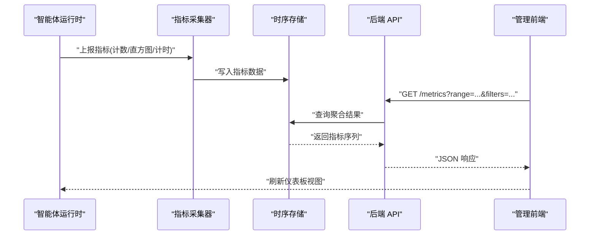

图表来源
- [scripts/generate-metric-glossary.ts](file://scripts/generate-metric-glossary.ts)
- [docs/architecture/observability.md](file://docs/architecture/observability.md)
- [docs/guides/dashboard-and-reports.md](file://docs/guides/dashboard-and-reports.md)
- [src/cli.ts](file://src/cli.ts)
- [admin/src/index.tsx](file://admin/src/index.tsx)

章节来源
- [scripts/generate-metric-glossary.ts](file://scripts/generate-metric-glossary.ts)
- [docs/architecture/observability.md](file://docs/architecture/observability.md)
- [docs/guides/dashboard-and-reports.md](file://docs/guides/dashboard-and-reports.md)

### 告警规则与通知机制
- 规则类型：阈值告警、复合条件告警、异常模式检测、回归检测。
- 评估周期：秒级/分钟级滚动窗口，结合滑动平均与突变检测降低误报。
- 通知渠道：邮件、IM、Webhook、工单系统集成，支持去重与抑制策略。
- 事件溯源：告警事件与指标、日志、轨迹关联，便于根因定位。

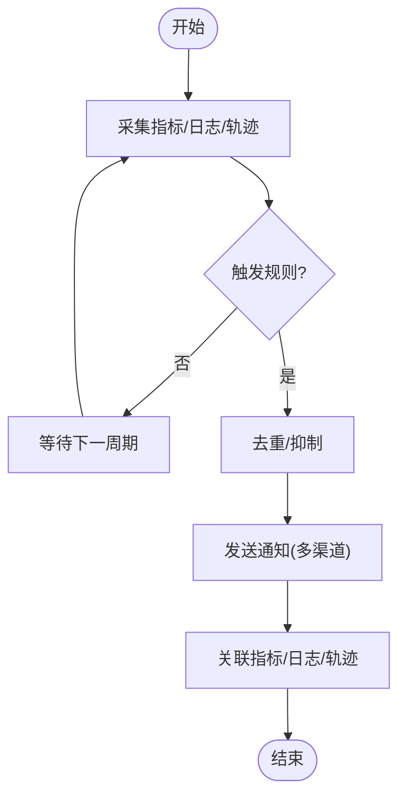

图表来源
- [docs/guides/alerting-and-notifications.md](file://docs/guides/alerting-and-notifications.md)
- [docs/architecture/observability.md](file://docs/architecture/observability.md)

章节来源
- [docs/guides/alerting-and-notifications.md](file://docs/guides/alerting-and-notifications.md)
- [docs/architecture/observability.md](file://docs/architecture/observability.md)

### 日志分析与结构化输出
- 结构化日志：统一字段（时间戳、级别、模块、上下文、traceId、spanId）。
- 采样与分级：生产环境默认采样，关键路径全量记录；按级别控制输出大小。
- 检索与聚合：按智能体、任务、来源、阶段等多维检索，支持全文与字段过滤。
- 安全与脱敏：敏感信息自动脱敏，避免泄露。

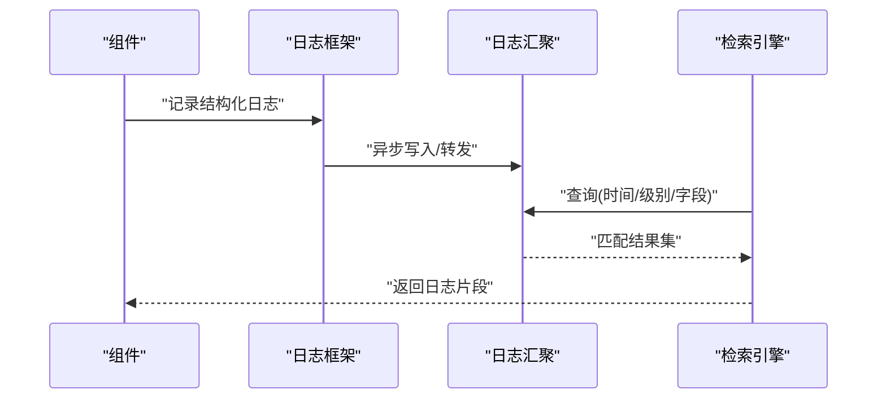

图表来源
- [docs/operations/monitoring.md](file://docs/operations/monitoring.md)
- [docs/guides/troubleshooting-guide.md](file://docs/guides/troubleshooting-guide.md)

章节来源
- [docs/operations/monitoring.md](file://docs/operations/monitoring.md)
- [docs/guides/troubleshooting-guide.md](file://docs/guides/troubleshooting-guide.md)

### 执行轨迹追踪与调用链分析
- 轨迹模型：以任务为根节点，子任务/工具调用为边，形成有向无环图。
- 上下文传播：跨进程/跨服务传递 traceId/spanId，保持链路完整。
- 可视化：节点详情、耗时分布、错误分支高亮、参数摘要与结果快照。
- 回溯与回放：支持按时间窗口与关键字段筛选，定位问题发生点。

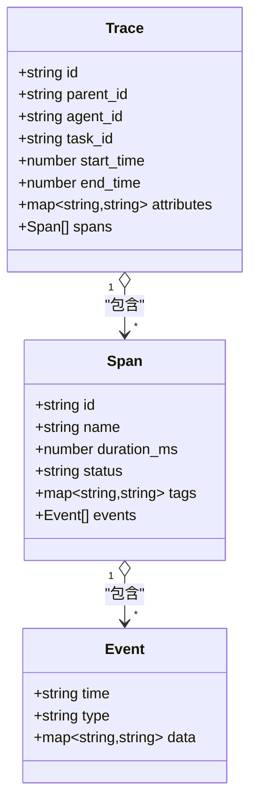

图表来源
- [docs/guides/trajectory-tracing.md](file://docs/guides/trajectory-tracing.md)
- [docs/architecture/observability.md](file://docs/architecture/observability.md)

章节来源
- [docs/guides/trajectory-tracing.md](file://docs/guides/trajectory-tracing.md)
- [docs/architecture/observability.md](file://docs/architecture/observability.md)

### 性能瓶颈识别与优化建议
- 热点识别：按任务/技能/外部依赖统计 P95/P99 延迟与吞吐。
- 资源争用：CPU/内存/IO 使用率与队列积压相关性分析。
- 外部依赖：超时、重试、熔断与降级效果评估。
- 优化方向：批量化、缓存、并行度调整、索引与查询优化。

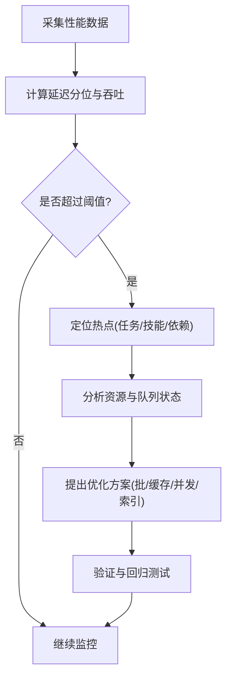

图表来源
- [docs/guides/performance-bottleneck-analysis.md](file://docs/guides/performance-bottleneck-analysis.md)
- [docs/architecture/observability.md](file://docs/architecture/observability.md)

章节来源
- [docs/guides/performance-bottleneck-analysis.md](file://docs/guides/performance-bottleneck-analysis.md)
- [docs/architecture/observability.md](file://docs/architecture/observability.md)

### 调试工具与交互式调试环境
- 断点与步进：在关键路径设置断点，逐步执行并观察状态变化。
- 交互式控制台：在线执行诊断命令，查看内部状态与中间结果。
- 日志增强：临时提升日志级别，捕获更详细的上下文。
- 沙箱与回放：在隔离环境中复现问题，减少对外部依赖的影响。

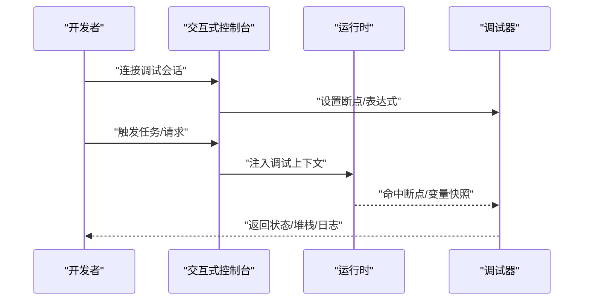

图表来源
- [docs/guides/debugging-tools.md](file://docs/guides/debugging-tools.md)
- [docs/guides/troubleshooting-guide.md](file://docs/guides/troubleshooting-guide.md)

章节来源
- [docs/guides/debugging-tools.md](file://docs/guides/debugging-tools.md)
- [docs/guides/troubleshooting-guide.md](file://docs/guides/troubleshooting-guide.md)

### 错误诊断、异常处理与根因分析
- 分类与归因：区分业务异常、系统异常、外部依赖异常，建立归因标签。
- 自愈与降级：失败重试、退避、熔断、限流与降级策略。
- 根因分析：结合指标、日志、轨迹进行关联分析，输出影响面与修复建议。
- 复盘模板：标准化事后复盘流程，沉淀改进项与预防措施。

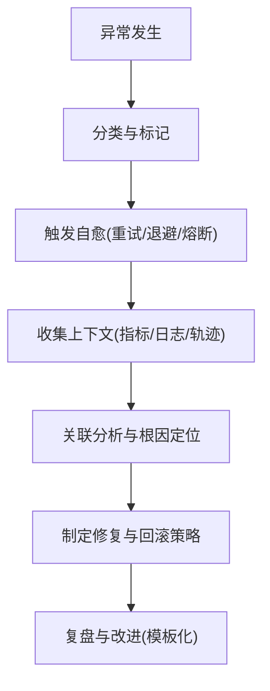

图表来源
- [docs/guides/troubleshooting-guide.md](file://docs/guides/troubleshooting-guide.md)
- [docs/incidents/postmortem-template.md](file://docs/incidents/postmortem-template.md)

章节来源
- [docs/guides/troubleshooting-guide.md](file://docs/guides/troubleshooting-guide.md)
- [docs/incidents/postmortem-template.md](file://docs/incidents/postmortem-template.md)

### 监控数据可视化、报表生成与趋势分析
- 可视化：折线图、热力图、桑基图、拓扑图等，支持多维钻取。
- 报表：日报/周报/月报自动生成，包含 KPI、SLA、容量与成本。
- 趋势：同比/环比、季节性、异常波动检测与预测。
- 共享与订阅：报表分发、订阅提醒与权限控制。

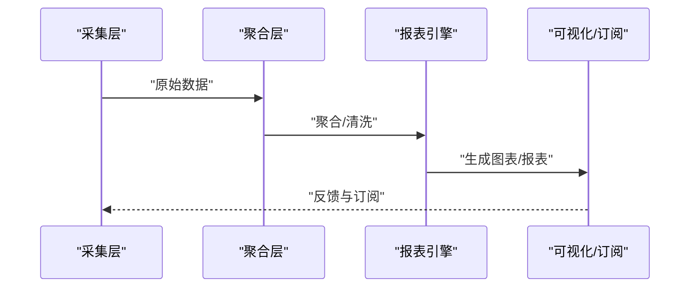

图表来源
- [docs/guides/dashboard-and-reports.md](file://docs/guides/dashboard-and-reports.md)
- [docs/architecture/observability.md](file://docs/architecture/observability.md)

章节来源
- [docs/guides/dashboard-and-reports.md](file://docs/guides/dashboard-and-reports.md)
- [docs/architecture/observability.md](file://docs/architecture/observability.md)

## 依赖关系分析
- 组件耦合：CLI 作为统一入口，管理前端通过嵌入式方式集成；健康检查与指标/日志/轨迹相互独立但共享上下文。
- 外部依赖：数据库、消息队列、对象存储、外部 LLM/搜索/向量服务等，需纳入监控与告警。
- 循环依赖：应避免在采集/聚合/可视化之间形成循环，采用事件驱动与分层解耦。

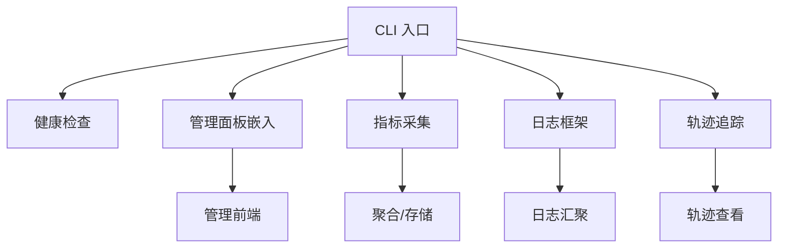

图表来源
- [src/cli.ts](file://src/cli.ts)
- [src/admin-embedded.ts](file://src/admin-embedded.ts)
- [admin/src/index.tsx](file://admin/src/index.tsx)
- [docs/architecture/observability.md](file://docs/architecture/observability.md)

章节来源
- [src/cli.ts](file://src/cli.ts)
- [src/admin-embedded.ts](file://src/admin-embedded.ts)
- [admin/src/index.tsx](file://admin/src/index.tsx)
- [docs/architecture/observability.md](file://docs/architecture/observability.md)

## 性能考量
- 指标采样与降采样：在高吞吐场景下采用自适应采样，避免采集侧成为瓶颈。
- 批量写入与压缩：日志与轨迹批量落盘，减少 I/O 压力。
- 异步与背压：采集与聚合异步化，必要时引入背压与限流保护。
- 缓存与预聚合：热点指标与报表结果缓存，缩短查询时延。
- 资源隔离：将采集/聚合/可视化部署在不同资源域，避免互相干扰。

[本节为通用指导，不直接分析具体文件]

## 故障排查指南
- 快速定位：通过健康检查与关键指标确认服务可用性。
- 日志检索：按时间、级别、模块、traceId 过滤，缩小问题范围。
- 轨迹回溯：从失败节点向上游追溯，定位调用链异常点。
- 根因分析：结合指标与日志，判断是否为资源不足、外部依赖异常或逻辑缺陷。
- 恢复与验证：执行修复与回滚策略，验证 SLA 与用户体验恢复。

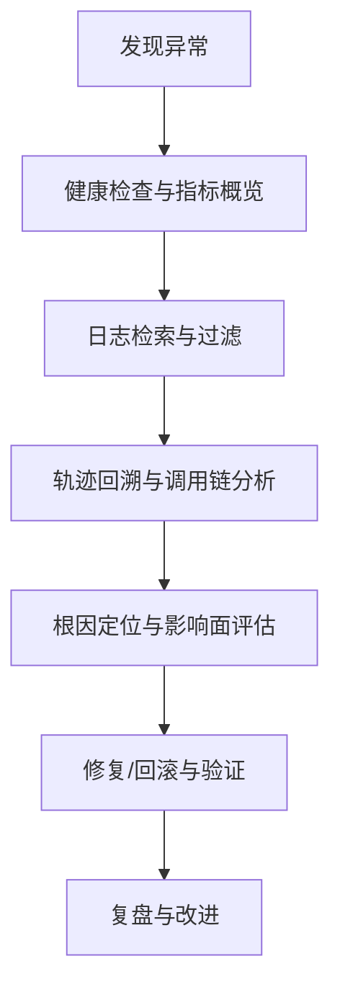

图表来源
- [docs/guides/troubleshooting-guide.md](file://docs/guides/troubleshooting-guide.md)
- [docs/guides/trajectory-tracing.md](file://docs/guides/trajectory-tracing.md)

章节来源
- [docs/guides/troubleshooting-guide.md](file://docs/guides/troubleshooting-guide.md)
- [docs/guides/trajectory-tracing.md](file://docs/guides/trajectory-tracing.md)

## 结论
通过统一的指标、日志、轨迹与告警体系，配合管理前端与可视化报表，可实现对智能体运行状态的全面监控与高效诊断。建议在部署初期即完成度量词表规范化、告警规则与通知渠道配置，并在日常运维中持续优化采样与聚合策略，确保系统在大规模与高负载下的可观测性与稳定性。

[本节为总结性内容，不直接分析具体文件]

## 附录
- 参考文档：
  - 架构总览与可观测性设计
  - 操作与监控最佳实践
  - 调试工具与交互式环境
  - 告警与通知策略
  - 仪表板与报表规范
  - 轨迹追踪与调用链分析
  - 性能瓶颈分析方法
  - 事后复盘模板

章节来源
- [docs/architecture/system-overview.md](file://docs/architecture/system-overview.md)
- [docs/architecture/agent-lifecycle.md](file://docs/architecture/agent-lifecycle.md)
- [docs/architecture/observability.md](file://docs/architecture/observability.md)
- [docs/operations/monitoring.md](file://docs/operations/monitoring.md)
- [docs/guides/debugging-tools.md](file://docs/guides/debugging-tools.md)
- [docs/guides/alerting-and-notifications.md](file://docs/guides/alerting-and-notifications.md)
- [docs/guides/dashboard-and-reports.md](file://docs/guides/dashboard-and-reports.md)
- [docs/guides/trajectory-tracing.md](file://docs/guides/trajectory-tracing.md)
- [docs/guides/performance-bottleneck-analysis.md](file://docs/guides/performance-bottleneck-analysis.md)
- [docs/incidents/postmortem-template.md](file://docs/incidents/postmortem-template.md)