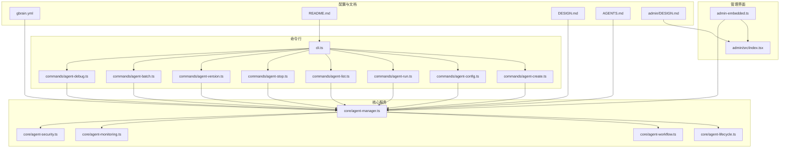
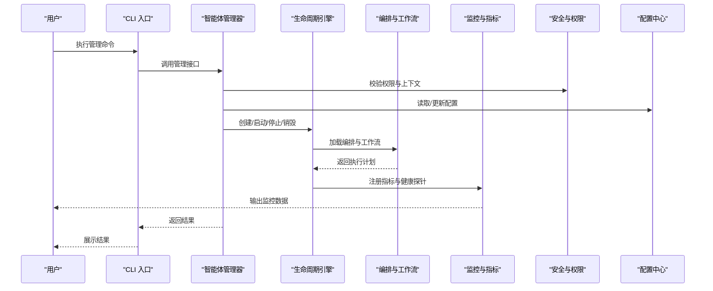
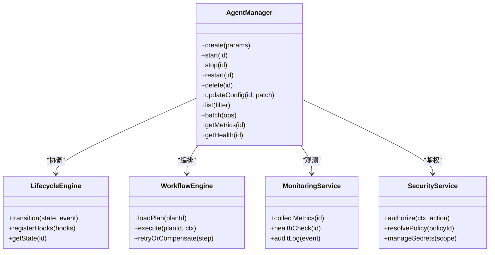
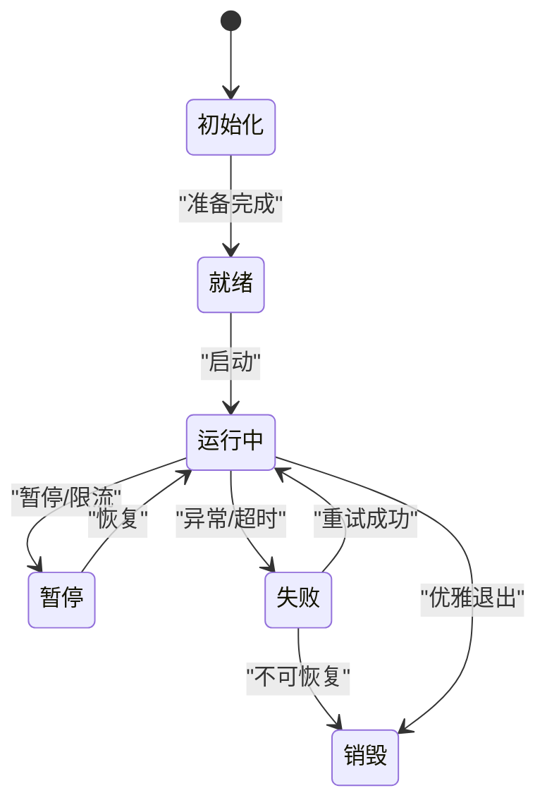
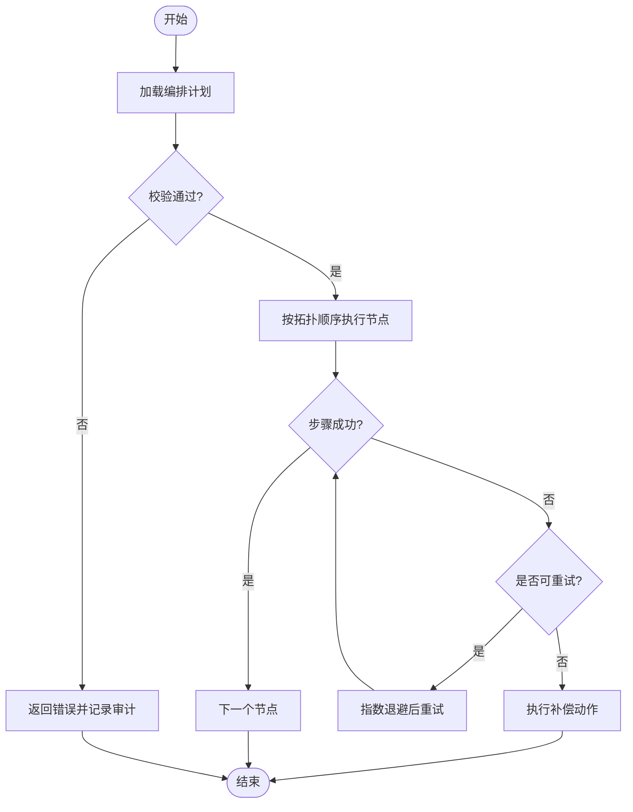
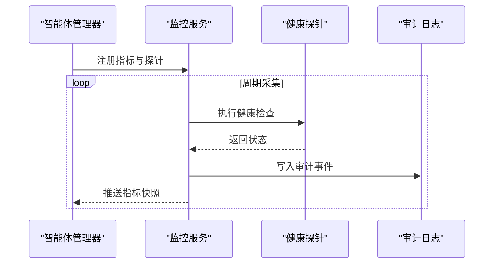
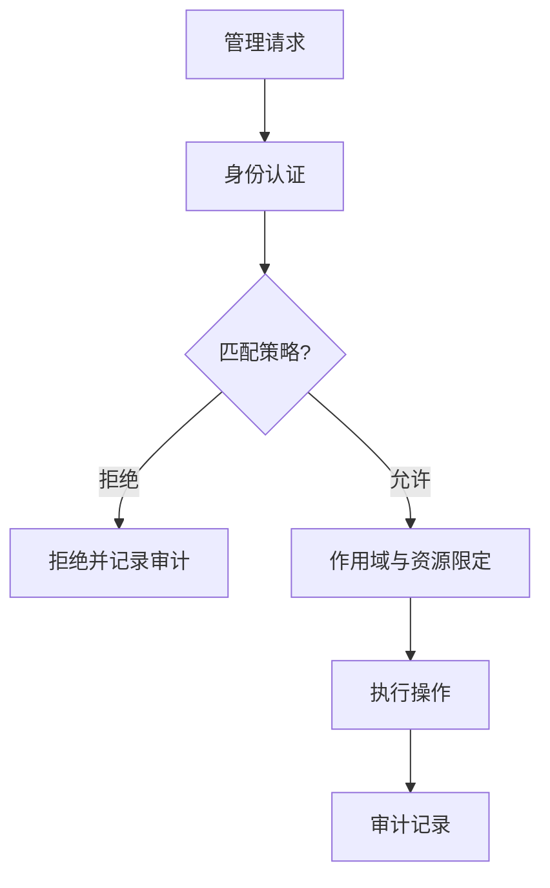
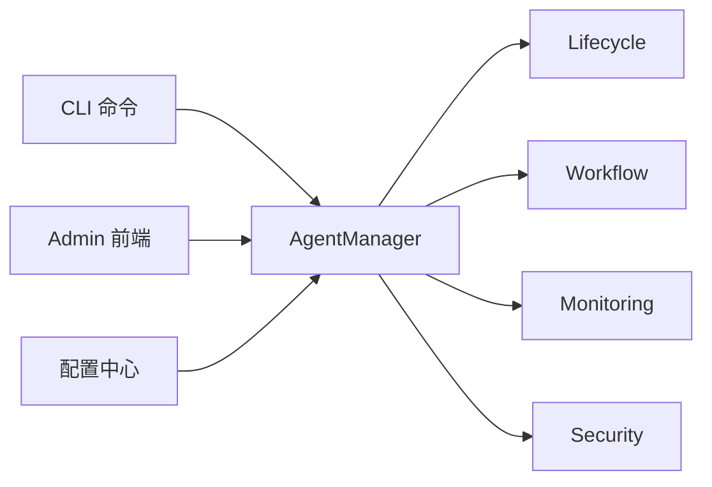

# 智能体管理

<cite>
**本文引用的文件**   
- [README.md](file://README.md)
- [DESIGN.md](file://DESIGN.md)
- [AGENTS.md](file://AGENTS.md)
- [gbrain.yml](file://gbrain.yml)
- [src/cli.ts](file://src/cli.ts)
- [src/admin-embedded.ts](file://src/admin-embedded.ts)
- [admin/src/index.tsx](file://admin/src/index.tsx)
- [admin/DESIGN.md](file://admin/DESIGN.md)
- [src/core/agent-manager.ts](file://src/core/agent-manager.ts)
- [src/core/agent-lifecycle.ts](file://src/core/agent-lifecycle.ts)
- [src/core/agent-workflow.ts](file://src/core/agent-workflow.ts)
- [src/core/agent-monitoring.ts](file://src/core/agent-monitoring.ts)
- [src/core/agent-security.ts](file://src/core/agent-security.ts)
- [src/commands/agent-create.ts](file://src/commands/agent-create.ts)
- [src/commands/agent-config.ts](file://src/commands/agent-config.ts)
- [src/commands/agent-run.ts](file://src/commands/agent-run.ts)
- [src/commands/agent-list.ts](file://src/commands/agent-list.ts)
- [src/commands/agent-stop.ts](file://src/commands/agent-stop.ts)
- [src/commands/agent-version.ts](file://src/commands/agent-version.ts)
- [src/commands/agent-batch.ts](file://src/commands/agent-batch.ts)
- [src/commands/agent-debug.ts](file://src/commands/agent-debug.ts)
</cite>

## 目录
1. [简介](#简介)
2. [项目结构](#项目结构)
3. [核心组件](#核心组件)
4. [架构总览](#架构总览)
5. [详细组件分析](#详细组件分析)
6. [依赖关系分析](#依赖关系分析)
7. [性能考量](#性能考量)
8. [故障诊断指南](#故障诊断指南)
9. [结论](#结论)
10. [附录](#附录)

## 简介
本文件面向系统管理员与平台工程师，提供“智能体管理”的完整使用文档。内容覆盖智能体的创建、配置、运行、监控与管理；生命周期状态流转；编排与工作流设置；资源分配策略；调试工具与故障诊断；版本管理与批量操作；权限控制与安全策略等。读者可据此快速上手并高效运维智能体集群。

## 项目结构
仓库采用分层组织：命令层（CLI）、核心服务层（Agent 管理/工作流/监控/安全）、前端管理界面（Admin）以及配置与文档。关键入口包括 CLI 主程序、嵌入式 Admin 启动器、Admin 前端源码及核心 Agent 模块。

图示来源
- [src/cli.ts](file://src/cli.ts)
- [src/admin-embedded.ts](file://src/admin-embedded.ts)
- [admin/src/index.tsx](file://admin/src/index.tsx)
- [src/core/agent-manager.ts](file://src/core/agent-manager.ts)
- [src/core/agent-lifecycle.ts](file://src/core/agent-lifecycle.ts)
- [src/core/agent-workflow.ts](file://src/core/agent-workflow.ts)
- [src/core/agent-monitoring.ts](file://src/core/agent-monitoring.ts)
- [src/core/agent-security.ts](file://src/core/agent-security.ts)
- [gbrain.yml](file://gbrain.yml)
- [README.md](file://README.md)
- [DESIGN.md](file://DESIGN.md)
- [AGENTS.md](file://AGENTS.md)
- [admin/DESIGN.md](file://admin/DESIGN.md)

章节来源
- [README.md](file://README.md)
- [DESIGN.md](file://DESIGN.md)
- [AGENTS.md](file://AGENTS.md)
- [gbrain.yml](file://gbrain.yml)
- [src/cli.ts](file://src/cli.ts)
- [src/admin-embedded.ts](file://src/admin-embedded.ts)
- [admin/src/index.tsx](file://admin/src/index.tsx)
- [admin/DESIGN.md](file://admin/DESIGN.md)

## 核心组件
- 智能体管理器（Agent Manager）：负责智能体的注册、调度、生命周期协调、资源配额与并发控制。
- 生命周期引擎（Lifecycle）：定义并驱动智能体从创建、就绪、运行、暂停到销毁的状态机。
- 编排与工作流（Workflow）：描述任务图、触发条件、依赖关系与重试/补偿策略。
- 监控与指标（Monitoring）：采集运行态指标、健康检查、告警与审计日志。
- 安全与权限（Security）：鉴权、访问控制、密钥与凭据管理、网络与沙箱隔离策略。

章节来源
- [src/core/agent-manager.ts](file://src/core/agent-manager.ts)
- [src/core/agent-lifecycle.ts](file://src/core/agent-lifecycle.ts)
- [src/core/agent-workflow.ts](file://src/core/agent-workflow.ts)
- [src/core/agent-monitoring.ts](file://src/core/agent-monitoring.ts)
- [src/core/agent-security.ts](file://src/core/agent-security.ts)

## 架构总览
整体架构由 CLI 与 Admin 双入口驱动，统一通过核心服务层完成智能体的全生命周期管理。配置中心集中管理全局与实例级参数，监控与安全贯穿各层。

图示来源
- [src/cli.ts](file://src/cli.ts)
- [src/core/agent-manager.ts](file://src/core/agent-manager.ts)
- [src/core/agent-lifecycle.ts](file://src/core/agent-lifecycle.ts)
- [src/core/agent-workflow.ts](file://src/core/agent-workflow.ts)
- [src/core/agent-monitoring.ts](file://src/core/agent-monitoring.ts)
- [src/core/agent-security.ts](file://src/core/agent-security.ts)
- [gbrain.yml](file://gbrain.yml)

## 详细组件分析

### 智能体管理器（Agent Manager）
职责
- 接收来自 CLI/Admin 的管理请求
- 协调生命周期、编排、监控与安全子模块
- 维护实例元数据、资源配额与并发限制
- 暴露统一的 API 供上层调用

关键能力
- 创建/删除/重启/迁移智能体
- 动态扩缩容与资源再分配
- 批量操作与事务性提交
- 与配置中心交互以应用变更

图示来源
- [src/core/agent-manager.ts](file://src/core/agent-manager.ts)
- [src/core/agent-lifecycle.ts](file://src/core/agent-lifecycle.ts)
- [src/core/agent-workflow.ts](file://src/core/agent-workflow.ts)
- [src/core/agent-monitoring.ts](file://src/core/agent-monitoring.ts)
- [src/core/agent-security.ts](file://src/core/agent-security.ts)

章节来源
- [src/core/agent-manager.ts](file://src/core/agent-manager.ts)

### 生命周期管理（Lifecycle）
状态机
- 初始化 -> 就绪 -> 运行中 -> 暂停/失败 -> 销毁
- 支持事件驱动的转换与钩子扩展

图示来源
- [src/core/agent-lifecycle.ts](file://src/core/agent-lifecycle.ts)

章节来源
- [src/core/agent-lifecycle.ts](file://src/core/agent-lifecycle.ts)

### 编排与工作流（Workflow）
要点
- 声明式任务图：节点、边、条件分支、并行扇出
- 触发器：定时、事件、外部回调
- 可靠性：幂等、重试、退避、补偿
- 资源约束：CPU/内存/并发上限、队列容量

图示来源
- [src/core/agent-workflow.ts](file://src/core/agent-workflow.ts)

章节来源
- [src/core/agent-workflow.ts](file://src/core/agent-workflow.ts)

### 监控与指标（Monitoring）
能力
- 指标采集：CPU/内存/GC、队列长度、延迟分布、错误率
- 健康检查：存活探针、就绪探针、依赖可用性探测
- 审计日志：操作流水、敏感信息脱敏、可追溯
- 告警规则：阈值、聚合、抑制与升级

图示来源
- [src/core/agent-monitoring.ts](file://src/core/agent-monitoring.ts)

章节来源
- [src/core/agent-monitoring.ts](file://src/core/agent-monitoring.ts)

### 安全与权限（Security）
要点
- 身份认证与授权：基于角色/策略的细粒度访问控制
- 凭据管理：加密存储、最小权限、轮换策略
- 网络与沙箱：出站白名单、端口限制、文件系统隔离
- 合规与审计：操作留痕、数据脱敏、导出与留存策略

图示来源
- [src/core/agent-security.ts](file://src/core/agent-security.ts)

章节来源
- [src/core/agent-security.ts](file://src/core/agent-security.ts)

### 命令行与前端入口
- CLI 入口：解析参数、路由到具体命令处理器
- Admin 嵌入：在进程内启动管理界面，复用核心服务
- 前端页面：提供可视化创建、配置、监控与批量操作

章节来源
- [src/cli.ts](file://src/cli.ts)
- [src/admin-embedded.ts](file://src/admin-embedded.ts)
- [admin/src/index.tsx](file://admin/src/index.tsx)
- [admin/DESIGN.md](file://admin/DESIGN.md)

## 依赖关系分析
- 命令层对核心服务为单向依赖，避免反向耦合
- 核心服务内部通过接口解耦，便于替换实现与单元测试
- 配置中心作为共享源，所有组件按需读取，减少硬编码
- 监控与安全横切关注点，贯穿各层

图示来源
- [src/cli.ts](file://src/cli.ts)
- [src/admin-embedded.ts](file://src/admin-embedded.ts)
- [src/core/agent-manager.ts](file://src/core/agent-manager.ts)
- [src/core/agent-lifecycle.ts](file://src/core/agent-lifecycle.ts)
- [src/core/agent-workflow.ts](file://src/core/agent-workflow.ts)
- [src/core/agent-monitoring.ts](file://src/core/agent-monitoring.ts)
- [src/core/agent-security.ts](file://src/core/agent-security.ts)
- [gbrain.yml](file://gbrain.yml)

章节来源
- [src/cli.ts](file://src/cli.ts)
- [src/admin-embedded.ts](file://src/admin-embedded.ts)
- [src/core/agent-manager.ts](file://src/core/agent-manager.ts)
- [gbrain.yml](file://gbrain.yml)

## 性能考量
- 并发与限流：合理设置工作线程数、队列容量与令牌桶速率，避免雪崩
- 资源配额：按实例维度限制 CPU/内存/IO，保障多租户公平性
- 批处理优化：合并小任务、批量写、去重与压缩传输
- 缓存与索引：热点数据本地缓存、查询索引预构建
- 弹性伸缩：基于指标自动扩缩容，冷启动预热与懒加载

[本节为通用指导，不直接分析具体文件]

## 故障诊断指南
常见问题与定位步骤
- 无法创建/启动
  - 检查权限与策略是否允许目标资源
  - 核对配置项与凭据有效性
  - 查看健康探针与依赖可用性
- 运行缓慢或超时
  - 观察队列积压与延迟分位
  - 检查重试与退避策略是否过激
  - 评估资源配额是否不足
- 频繁失败与抖动
  - 审查错误分类与告警规则
  - 确认补偿逻辑是否正确幂等
  - 审计日志中检索最近变更与关联事件

建议工具与命令
- 列表与筛选：列出实例、过滤状态与标签
- 实时日志与追踪：按实例 ID 拉取日志与链路追踪
- 指标与健康：查看 CPU/内存/队列/错误率与探针结果
- 批量操作：批量启停、滚动升级与回滚
- 版本管理：查看当前版本、可用版本与升级路径

章节来源
- [src/commands/agent-list.ts](file://src/commands/agent-list.ts)
- [src/commands/agent-debug.ts](file://src/commands/agent-debug.ts)
- [src/commands/agent-batch.ts](file://src/commands/agent-batch.ts)
- [src/commands/agent-version.ts](file://src/commands/agent-version.ts)
- [src/core/agent-monitoring.ts](file://src/core/agent-monitoring.ts)
- [src/core/agent-security.ts](file://src/core/agent-security.ts)

## 结论
通过 CLI 与 Admin 双入口，结合核心服务层的生命周期、编排、监控与安全能力，本系统提供了完整的智能体管理能力。借助合理的资源配置、可靠的编排策略与完善的观测手段，可在复杂环境中稳定、可控地运行大规模智能体集群。

[本节为总结性内容，不直接分析具体文件]

## 附录

### 常用命令速查
- 创建智能体：参考命令文件
- 配置管理：参考命令文件
- 运行/停止：参考命令文件
- 列表/查询：参考命令文件
- 版本管理：参考命令文件
- 批量操作：参考命令文件
- 调试与诊断：参考命令文件

章节来源
- [src/commands/agent-create.ts](file://src/commands/agent-create.ts)
- [src/commands/agent-config.ts](file://src/commands/agent-config.ts)
- [src/commands/agent-run.ts](file://src/commands/agent-run.ts)
- [src/commands/agent-list.ts](file://src/commands/agent-list.ts)
- [src/commands/agent-stop.ts](file://src/commands/agent-stop.ts)
- [src/commands/agent-version.ts](file://src/commands/agent-version.ts)
- [src/commands/agent-batch.ts](file://src/commands/agent-batch.ts)
- [src/commands/agent-debug.ts](file://src/commands/agent-debug.ts)