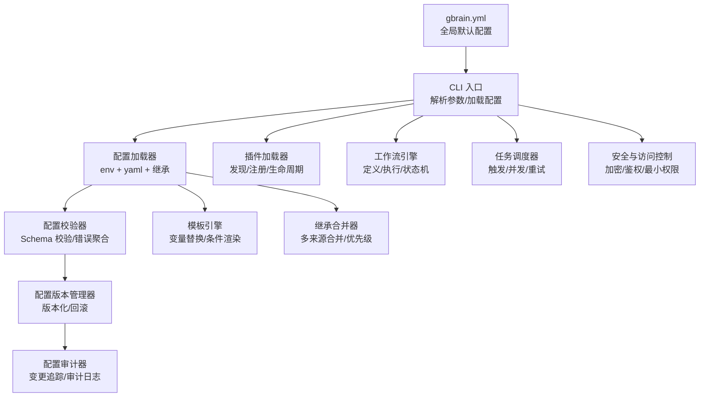
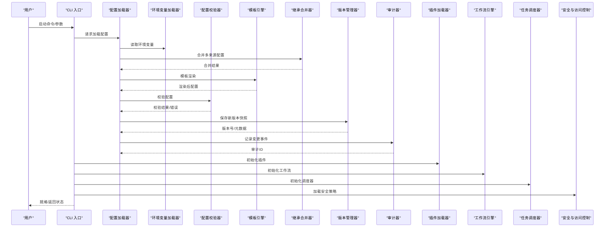
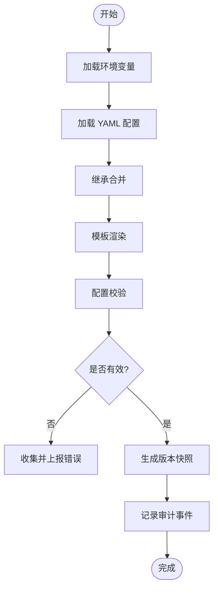
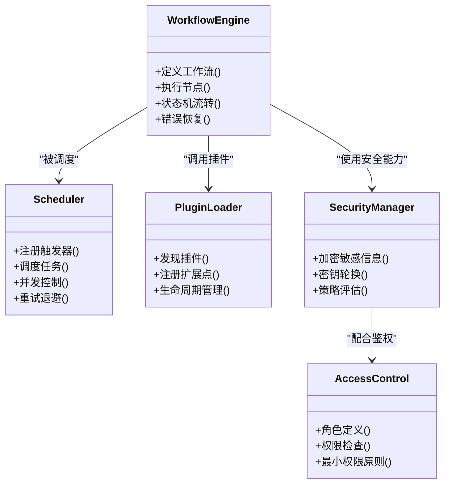
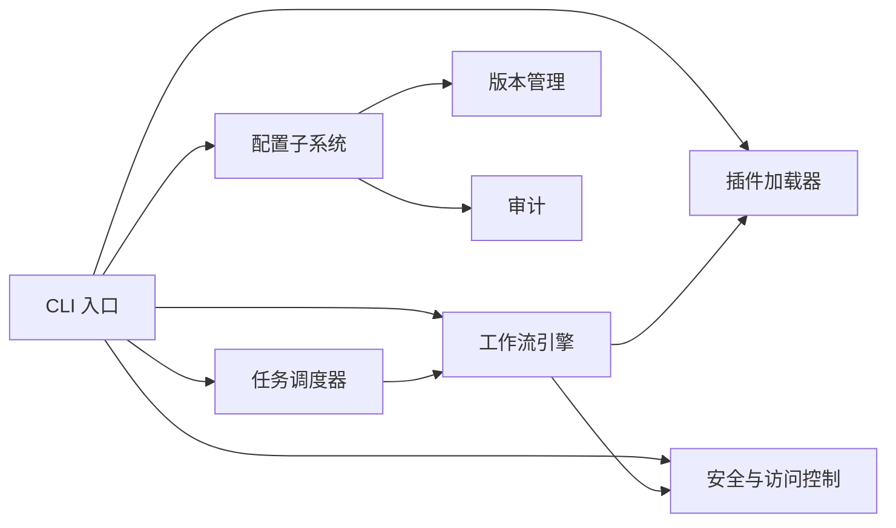

# 智能体配置编排

<cite>
**本文引用的文件**   
- [gbrain.yml](file://gbrain.yml)
- [package.json](file://package.json)
- [src/cli.ts](file://src/cli.ts)
- [src/core/config.ts](file://src/core/config.ts)
- [src/core/agent-runner.ts](file://src/core/agent-runner.ts)
- [src/core/workflow-engine.ts](file://src/core/workflow-engine.ts)
- [src/core/scheduler.ts](file://src/core/scheduler.ts)
- [src/core/plugin-loader.ts](file://src/core/plugin-loader.ts)
- [src/core/env-loader.ts](file://src/core/env-loader.ts)
- [src/core/config-validator.ts](file://src/core/config-validator.ts)
- [src/core/template-engine.ts](file://src/core/template-engine.ts)
- [src/core/config-inheritance.ts](file://src/core/config-inheritance.ts)
- [src/core/config-versioning.ts](file://src/core/config-versioning.ts)
- [src/core/config-audit.ts](file://src/core/config-audit.ts)
- [src/core/security-manager.ts](file://src/core/security-manager.ts)
- [src/core/access-control.ts](file://src/core/access-control.ts)
</cite>

## 目录
1. [简介](#简介)
2. [项目结构](#项目结构)
3. [核心组件](#核心组件)
4. [架构总览](#架构总览)
5. [详细组件分析](#详细组件分析)
6. [依赖关系分析](#依赖关系分析)
7. [性能考虑](#性能考虑)
8. [故障排查指南](#故障排查指南)
9. [结论](#结论)
10. [附录](#附录)

## 简介
本文件面向“智能体配置编排”主题，系统性阐述智能体配置文件结构、环境变量设置与动态更新机制；深入解析智能体参数配置、工作流定义与任务调度规则；说明依赖管理、插件加载与扩展点配置；提供配置验证、模板系统与继承机制；并覆盖版本控制、回滚策略与审计功能；最后给出安全、敏感信息加密与访问权限控制的实践建议。文档以仓库中的核心源码为依据，辅以可视化图示帮助读者快速理解系统设计与实现要点。

## 项目结构
围绕智能体配置编排，仓库采用分层组织方式：
- 顶层配置入口：集中式 YAML 配置作为全局默认配置源
- CLI 启动层：负责解析命令行参数、加载配置与环境变量
- 核心运行时：包含配置加载、校验、模板渲染、继承合并、版本管理与审计等能力
- 运行期子系统：工作流引擎、任务调度器、插件加载器、安全与访问控制模块
- 测试与示例：覆盖配置合并、环境注入、校验与审计等关键路径

图表来源
- [gbrain.yml:1-200](file://gbrain.yml#L1-L200)
- [src/cli.ts:1-200](file://src/cli.ts#L1-L200)
- [src/core/config.ts:1-200](file://src/core/config.ts#L1-L200)
- [src/core/config-validator.ts:1-200](file://src/core/config-validator.ts#L1-L200)
- [src/core/template-engine.ts:1-200](file://src/core/template-engine.ts#L1-L200)
- [src/core/config-inheritance.ts:1-200](file://src/core/config-inheritance.ts#L1-L200)
- [src/core/config-versioning.ts:1-200](file://src/core/config-versioning.ts#L1-L200)
- [src/core/config-audit.ts:1-200](file://src/core/config-audit.ts#L1-L200)
- [src/core/plugin-loader.ts:1-200](file://src/core/plugin-loader.ts#L1-L200)
- [src/core/workflow-engine.ts:1-200](file://src/core/workflow-engine.ts#L1-L200)
- [src/core/scheduler.ts:1-200](file://src/core/scheduler.ts#L1-L200)
- [src/core/security-manager.ts:1-200](file://src/core/security-manager.ts#L1-L200)
- [src/core/access-control.ts:1-200](file://src/core/access-control.ts#L1-L200)

章节来源
- [gbrain.yml:1-200](file://gbrain.yml#L1-L200)
- [package.json:1-200](file://package.json#L1-L200)
- [src/cli.ts:1-200](file://src/cli.ts#L1-L200)

## 核心组件
- 配置加载器：统一从环境变量、YAML 与继承链中加载配置，形成最终生效的配置对象
- 配置校验器：基于 Schema 对配置进行强类型校验，输出结构化错误以便修复
- 模板引擎：支持变量插值与条件渲染，用于在不同环境间复用配置片段
- 继承合并器：按优先级合并多个配置源（如全局、项目级、运行时），处理冲突与缺失字段
- 版本管理器：为配置快照打标签，支持对比与回滚到指定版本
- 审计器：记录配置的创建、修改、回滚与访问事件，便于合规与排障
- 插件加载器：扫描与注册插件，暴露扩展点供业务逻辑接入
- 工作流引擎：定义节点、边与状态机，驱动智能体任务的编排与执行
- 任务调度器：根据触发器、资源配额与并发限制调度任务，支持重试与退避
- 安全与访问控制：管理敏感信息加密、密钥轮换与细粒度访问权限

章节来源
- [src/core/config.ts:1-200](file://src/core/config.ts#L1-L200)
- [src/core/config-validator.ts:1-200](file://src/core/config-validator.ts#L1-L200)
- [src/core/template-engine.ts:1-200](file://src/core/template-engine.ts#L1-L200)
- [src/core/config-inheritance.ts:1-200](file://src/core/config-inheritance.ts#L1-L200)
- [src/core/config-versioning.ts:1-200](file://src/core/config-versioning.ts#L1-L200)
- [src/core/config-audit.ts:1-200](file://src/core/config-audit.ts#L1-L200)
- [src/core/plugin-loader.ts:1-200](file://src/core/plugin-loader.ts#L1-L200)
- [src/core/workflow-engine.ts:1-200](file://src/core/workflow-engine.ts#L1-L200)
- [src/core/scheduler.ts:1-200](file://src/core/scheduler.ts#L1-L200)
- [src/core/security-manager.ts:1-200](file://src/core/security-manager.ts#L1-L200)
- [src/core/access-control.ts:1-200](file://src/core/access-control.ts#L1-L200)

## 架构总览
下图展示配置编排的端到端流程：从 CLI 启动到配置加载、校验、模板渲染、继承合并，再到工作流与调度的初始化，以及插件与安全能力的集成。

图表来源
- [src/cli.ts:1-200](file://src/cli.ts#L1-L200)
- [src/core/config.ts:1-200](file://src/core/config.ts#L1-L200)
- [src/core/env-loader.ts:1-200](file://src/core/env-loader.ts#L1-L200)
- [src/core/config-validator.ts:1-200](file://src/core/config-validator.ts#L1-L200)
- [src/core/template-engine.ts:1-200](file://src/core/template-engine.ts#L1-L200)
- [src/core/config-inheritance.ts:1-200](file://src/core/config-inheritance.ts#L1-L200)
- [src/core/config-versioning.ts:1-200](file://src/core/config-versioning.ts#L1-L200)
- [src/core/config-audit.ts:1-200](file://src/core/config-audit.ts#L1-L200)
- [src/core/plugin-loader.ts:1-200](file://src/core/plugin-loader.ts#L1-L200)
- [src/core/workflow-engine.ts:1-200](file://src/core/workflow-engine.ts#L1-L200)
- [src/core/scheduler.ts:1-200](file://src/core/scheduler.ts#L1-L200)
- [src/core/security-manager.ts:1-200](file://src/core/security-manager.ts#L1-L200)
- [src/core/access-control.ts:1-200](file://src/core/access-control.ts#L1-L200)

## 详细组件分析

### 配置文件结构与环境变量
- 配置文件结构
  - 顶层键包括智能体基础信息、模型与提供者、存储与索引、插件与工作流、调度策略、安全与审计等
  - 各子段支持嵌套与数组，便于模块化与组合
- 环境变量设置
  - 通过环境变量注入敏感信息与运行时差异（如 API Key、数据库连接串）
  - 环境变量在配置加载阶段优先于文件配置，支持前缀命名空间隔离
- 动态配置更新
  - 支持热重载或增量更新，结合版本管理与审计确保可追溯
  - 更新流程需经过校验与模板渲染，避免脏配置进入运行态

图表来源
- [src/core/config.ts:1-200](file://src/core/config.ts#L1-L200)
- [src/core/env-loader.ts:1-200](file://src/core/env-loader.ts#L1-L200)
- [src/core/config-inheritance.ts:1-200](file://src/core/config-inheritance.ts#L1-L200)
- [src/core/template-engine.ts:1-200](file://src/core/template-engine.ts#L1-L200)
- [src/core/config-validator.ts:1-200](file://src/core/config-validator.ts#L1-L200)
- [src/core/config-versioning.ts:1-200](file://src/core/config-versioning.ts#L1-L200)
- [src/core/config-audit.ts:1-200](file://src/core/config-audit.ts#L1-L200)

章节来源
- [gbrain.yml:1-200](file://gbrain.yml#L1-L200)
- [src/core/config.ts:1-200](file://src/core/config.ts#L1-L200)
- [src/core/env-loader.ts:1-200](file://src/core/env-loader.ts#L1-L200)

### 智能体参数配置
- 参数分类
  - 基础参数：名称、版本、描述、作者与许可证
  - 模型参数：提供商、模型 ID、温度、最大令牌数、超时与重试
  - 存储参数：后端类型、连接字符串、分片与缓存策略
  - 检索参数：嵌入维度、相似度阈值、混合检索开关
- 参数校验
  - 使用 Schema 约束类型、范围与必填项
  - 针对跨字段约束进行联合校验（如模型与提供商匹配）
- 参数覆盖
  - 支持按环境、租户或实例级别覆盖默认值
  - 覆盖顺序遵循“运行时 > 项目级 > 全局级”的优先级

章节来源
- [src/core/config-validator.ts:1-200](file://src/core/config-validator.ts#L1-L200)
- [src/core/config-inheritance.ts:1-200](file://src/core/config-inheritance.ts#L1-L200)

### 工作流定义与任务调度
- 工作流定义
  - 节点：原子操作（调用工具、LLM 推理、数据处理）
  - 边：条件分支与并行汇聚
  - 状态机：节点状态流转、失败重试与补偿
- 任务调度规则
  - 触发器：定时、事件驱动与外部回调
  - 并发控制：全局与按工作流的并发上限
  - 资源配额：CPU、内存与外部 API 速率限制
  - 重试与退避：指数退避、最大重试次数与死信队列
- 执行监控
  - 进度事件、耗时统计与错误分类
  - 可观测性指标导出与告警

图表来源
- [src/core/workflow-engine.ts:1-200](file://src/core/workflow-engine.ts#L1-L200)
- [src/core/scheduler.ts:1-200](file://src/core/scheduler.ts#L1-L200)
- [src/core/plugin-loader.ts:1-200](file://src/core/plugin-loader.ts#L1-L200)
- [src/core/security-manager.ts:1-200](file://src/core/security-manager.ts#L1-L200)
- [src/core/access-control.ts:1-200](file://src/core/access-control.ts#L1-L200)

章节来源
- [src/core/workflow-engine.ts:1-200](file://src/core/workflow-engine.ts#L1-L200)
- [src/core/scheduler.ts:1-200](file://src/core/scheduler.ts#L1-L200)

### 依赖管理与插件加载
- 依赖管理
  - 声明式依赖清单，支持版本约束与冲突检测
  - 按需加载与懒初始化，减少冷启动开销
- 插件加载
  - 扫描约定目录或注册表，自动发现插件
  - 扩展点：钩子、中间件与工具函数
  - 生命周期：初始化、预热、运行与销毁
- 扩展点配置
  - 通过配置映射扩展点与插件实现
  - 支持运行时切换与灰度发布

章节来源
- [src/core/plugin-loader.ts:1-200](file://src/core/plugin-loader.ts#L1-L200)

### 配置验证、模板系统与继承机制
- 配置验证
  - 基于 Schema 的类型与约束校验
  - 错误聚合与定位，辅助快速修复
- 模板系统
  - 变量插值、条件渲染与循环展开
  - 模板作用域隔离，避免污染全局上下文
- 继承机制
  - 多来源合并：全局、项目、环境与运行时
  - 冲突解决策略：深合并、覆盖与保留默认

章节来源
- [src/core/config-validator.ts:1-200](file://src/core/config-validator.ts#L1-L200)
- [src/core/template-engine.ts:1-200](file://src/core/template-engine.ts#L1-L200)
- [src/core/config-inheritance.ts:1-200](file://src/core/config-inheritance.ts#L1-L200)

### 配置版本控制、回滚策略与审计
- 版本控制
  - 每次变更生成不可变快照，附带元数据（时间、作者、变更摘要）
  - 支持标签与分支化管理
- 回滚策略
  - 一键回滚至指定版本，带预检与幂等保证
  - 回滚前后一致性校验与差异报告
- 审计功能
  - 记录所有变更与访问事件，支持查询与导出
  - 审计日志防篡改与归档策略

章节来源
- [src/core/config-versioning.ts:1-200](file://src/core/config-versioning.ts#L1-L200)
- [src/core/config-audit.ts:1-200](file://src/core/config-audit.ts#L1-L200)

### 配置安全、敏感信息加密与访问权限控制
- 敏感信息加密
  - 使用密钥管理服务或本地密钥环对敏感字段加密
  - 支持密钥轮换与多版本密文共存
- 访问权限控制
  - 基于角色的访问控制（RBAC）与最小权限原则
  - 细粒度到字段级的读写权限
- 安全策略
  - 白名单与黑名单机制
  - 输入清洗与输出脱敏

章节来源
- [src/core/security-manager.ts:1-200](file://src/core/security-manager.ts#L1-L200)
- [src/core/access-control.ts:1-200](file://src/core/access-control.ts#L1-L200)

## 依赖关系分析
- 组件耦合
  - CLI 作为入口，协调配置、工作流、调度、插件与安全模块
  - 配置子系统内部高内聚：加载、校验、模板、继承、版本与审计协同工作
- 直接依赖
  - 工作流引擎依赖插件加载器与安全模块
  - 调度器依赖工作流引擎与资源配额策略
- 间接依赖
  - 审计器依赖版本管理器，用于关联变更事件
  - 访问控制依赖安全策略与角色定义
- 外部依赖
  - 环境变量与文件系统作为配置源
  - 外部服务（如密钥管理、消息队列）作为运行时依赖

图表来源
- [src/cli.ts:1-200](file://src/cli.ts#L1-L200)
- [src/core/config.ts:1-200](file://src/core/config.ts#L1-L200)
- [src/core/workflow-engine.ts:1-200](file://src/core/workflow-engine.ts#L1-L200)
- [src/core/scheduler.ts:1-200](file://src/core/scheduler.ts#L1-L200)
- [src/core/plugin-loader.ts:1-200](file://src/core/plugin-loader.ts#L1-L200)
- [src/core/security-manager.ts:1-200](file://src/core/security-manager.ts#L1-L200)
- [src/core/access-control.ts:1-200](file://src/core/access-control.ts#L1-L200)
- [src/core/config-versioning.ts:1-200](file://src/core/config-versioning.ts#L1-L200)
- [src/core/config-audit.ts:1-200](file://src/core/config-audit.ts#L1-L200)

章节来源
- [src/cli.ts:1-200](file://src/cli.ts#L1-L200)
- [src/core/config.ts:1-200](file://src/core/config.ts#L1-L200)

## 性能考虑
- 配置加载优化
  - 缓存已解析的配置对象，避免重复 IO 与模板渲染
  - 增量更新时仅重新渲染受影响片段
- 工作流与调度
  - 合理设置并发上限与超时，防止资源争用
  - 使用批处理与批量写入降低外部服务压力
- 插件与扩展点
  - 懒加载与按需初始化，缩短启动时间
  - 插件间解耦，避免长链路阻塞
- 安全与审计
  - 异步写入审计日志，避免主路径延迟
  - 加密操作使用硬件加速或高效算法

[本节为通用指导，不直接分析具体文件]

## 故障排查指南
- 配置加载失败
  - 检查环境变量是否存在与格式正确
  - 查看模板渲染错误与继承合并冲突
- 校验错误
  - 依据错误定位字段与约束，修正类型或范围
  - 关注跨字段联合校验失败原因
- 工作流执行异常
  - 检查节点依赖与插件可用性
  - 查看重试与退避策略是否触发
- 审计与版本
  - 核对变更事件与快照一致性
  - 确认回滚目标版本存在且有效

章节来源
- [src/core/config-validator.ts:1-200](file://src/core/config-validator.ts#L1-L200)
- [src/core/config-audit.ts:1-200](file://src/core/config-audit.ts#L1-L200)
- [src/core/config-versioning.ts:1-200](file://src/core/config-versioning.ts#L1-L200)

## 结论
智能体配置编排通过统一的配置加载、严格的校验与灵活的模板与继承机制，实现了可维护、可扩展与可审计的系统设计。结合版本控制与回滚策略，保障生产环境的稳定性与安全性。插件化与扩展点使系统具备强大的生态整合能力，而安全与访问控制则构筑了可靠的信任边界。建议在部署中遵循最小权限与渐进式变更的最佳实践，持续提升系统的可靠性与可观测性。

[本节为总结性内容，不直接分析具体文件]

## 附录
- 术语表
  - 智能体：由工作流与插件组成的自动化执行单元
  - 工作流：由节点与边构成的有向图，表示任务执行序列
  - 调度器：负责任务触发、并发控制与重试退避
  - 插件：可插拔的功能模块，通过扩展点接入系统
  - 审计：对配置与操作的变更记录与追踪
- 参考文件
  - 全局配置入口：[gbrain.yml](file://gbrain.yml)
  - CLI 入口：[src/cli.ts](file://src/cli.ts)
  - 配置核心：[src/core/config.ts](file://src/core/config.ts)
  - 校验与模板：[src/core/config-validator.ts](file://src/core/config-validator.ts)、[src/core/template-engine.ts](file://src/core/template-engine.ts)
  - 继承与版本：[src/core/config-inheritance.ts](file://src/core/config-inheritance.ts)、[src/core/config-versioning.ts](file://src/core/config-versioning.ts)
  - 审计与安全：[src/core/config-audit.ts](file://src/core/config-audit.ts)、[src/core/security-manager.ts](file://src/core/security-manager.ts)、[src/core/access-control.ts](file://src/core/access-control.ts)
  - 插件与工作流：[src/core/plugin-loader.ts](file://src/core/plugin-loader.ts)、[src/core/workflow-engine.ts](file://src/core/workflow-engine.ts)
  - 调度器：[src/core/scheduler.ts](file://src/core/scheduler.ts)