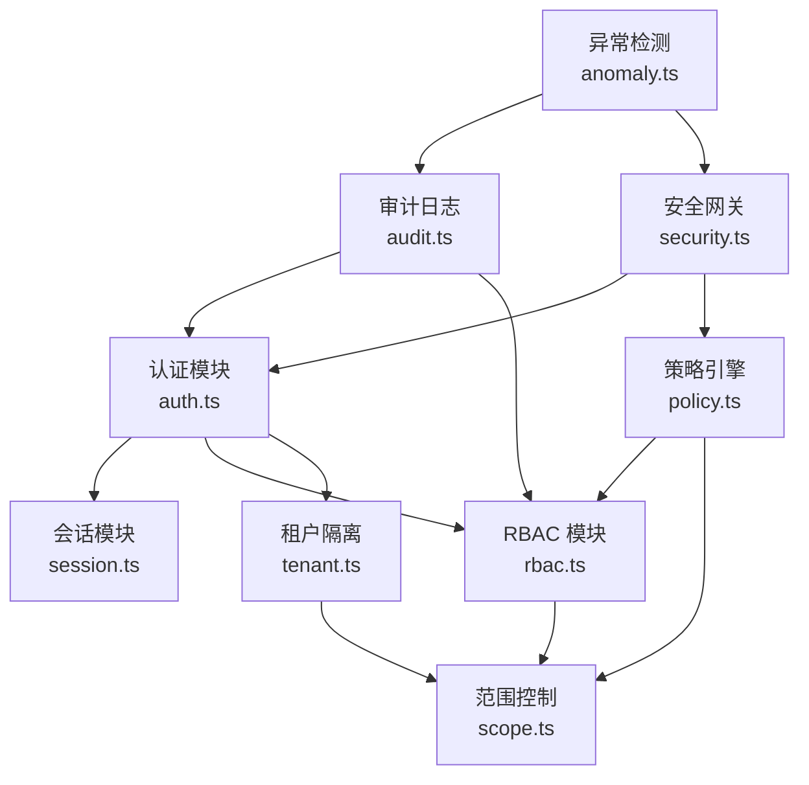
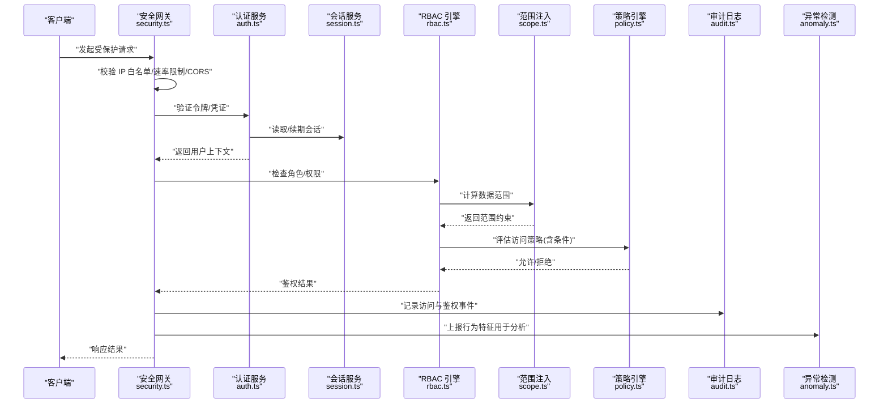
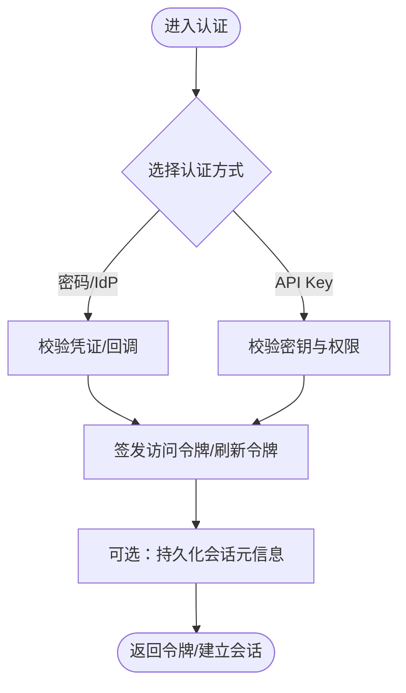
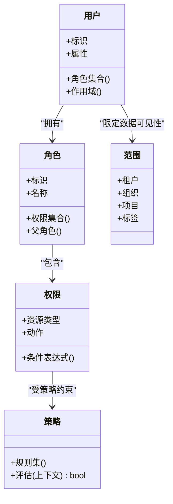
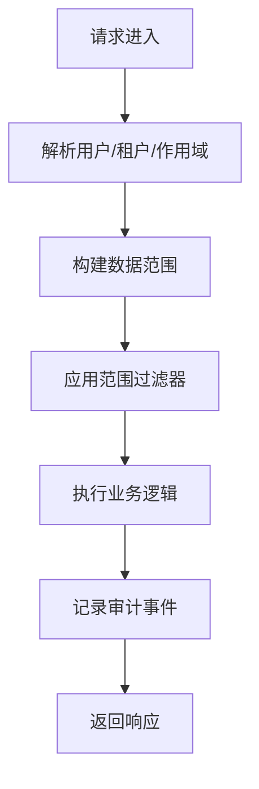
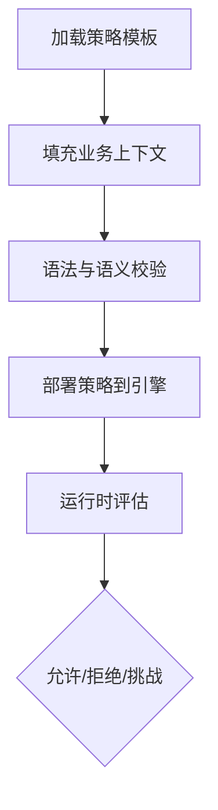
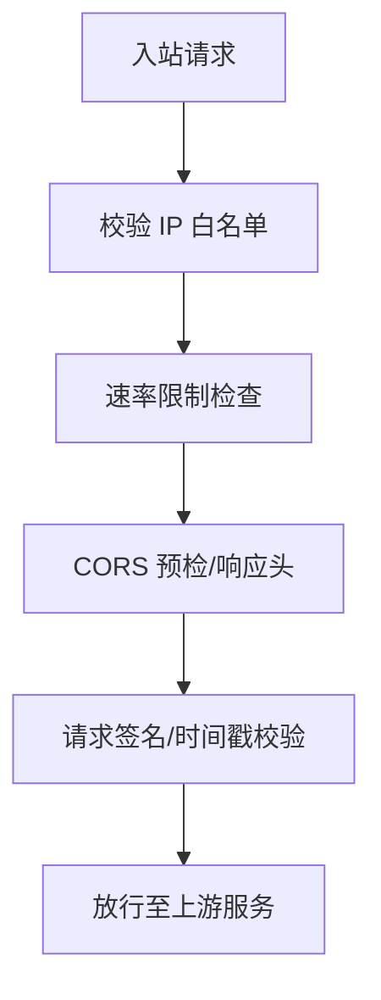
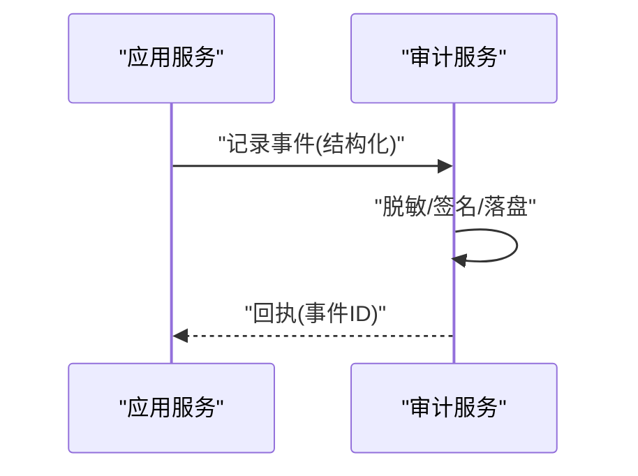
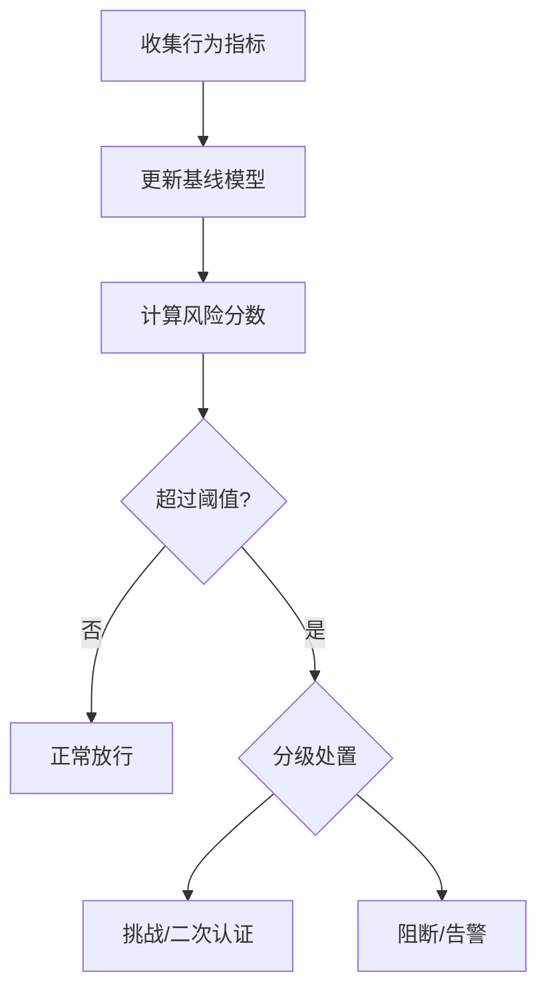

# 用户与访问控制

<cite>
**本文引用的文件**   
- [src/core/auth.ts](file://src/core/auth.ts)
- [src/core/session.ts](file://src/core/session.ts)
- [src/core/rbac.ts](file://src/core/rbac.ts)
- [src/core/tenant.ts](file://src/core/tenant.ts)
- [src/core/scope.ts](file://src/core/scope.ts)
- [src/core/policy.ts](file://src/core/policy.ts)
- [src/core/audit.ts](file://src/core/audit.ts)
- [src/core/security.ts](file://src/core/security.ts)
- [src/core/anomaly.ts](file://src/core/anomaly.ts)
- [templates/ACCESS_POLICY.md.template](file://templates/ACCESS_POLICY.md.template)
</cite>

## 目录
1. [简介](#简介)
2. [项目结构](#项目结构)
3. [核心组件](#核心组件)
4. [架构总览](#架构总览)
5. [详细组件分析](#详细组件分析)
6. [依赖关系分析](#依赖关系分析)
7. [性能考量](#性能考量)
8. [故障排查指南](#故障排查指南)
9. [结论](#结论)
10. [附录](#附录)

## 简介
本文件面向系统管理员与安全工程师，提供“用户管理与访问控制”的完整使用文档。内容覆盖：
- 用户账户管理、角色权限配置与访问策略设置
- 多租户隔离、数据范围控制与操作审计日志
- 认证方式、会话管理与安全令牌处理
- RBAC 模型、细粒度权限与动态授权实现指南
- 安全策略、IP 白名单与访问频率限制的配置方法
- 用户行为分析、异常检测与风险评估

## 项目结构
围绕用户与访问控制的核心代码位于 src/core 下，按职责拆分为认证、会话、RBAC、租户、范围、策略、审计、安全与异常等模块；模板目录提供访问策略模板，便于快速落地策略文档化。

**图表来源**
- [src/core/auth.ts](file://src/core/auth.ts)
- [src/core/session.ts](file://src/core/session.ts)
- [src/core/rbac.ts](file://src/core/rbac.ts)
- [src/core/scope.ts](file://src/core/scope.ts)
- [src/core/tenant.ts](file://src/core/tenant.ts)
- [src/core/policy.ts](file://src/core/policy.ts)
- [src/core/audit.ts](file://src/core/audit.ts)
- [src/core/security.ts](file://src/core/security.ts)
- [src/core/anomaly.ts](file://src/core/anomaly.ts)

**章节来源**
- [src/core/auth.ts](file://src/core/auth.ts)
- [src/core/session.ts](file://src/core/session.ts)
- [src/core/rbac.ts](file://src/core/rbac.ts)
- [src/core/scope.ts](file://src/core/scope.ts)
- [src/core/tenant.ts](file://src/core/tenant.ts)
- [src/core/policy.ts](file://src/core/policy.ts)
- [src/core/audit.ts](file://src/core/audit.ts)
- [src/core/security.ts](file://src/core/security.ts)
- [src/core/anomaly.ts](file://src/core/anomaly.ts)
- [templates/ACCESS_POLICY.md.template](file://templates/ACCESS_POLICY.md.template)

## 核心组件
- 认证模块：负责身份核验（密码、外部 IdP、API Key 等）、签发与校验令牌、绑定上下文（用户、租户、作用域）。
- 会话模块：维护短期会话状态、刷新与过期策略、并发与会话一致性保障。
- RBAC 模块：定义角色、权限、资源与动作的映射，支持继承与组合。
- 范围控制：在查询与写入时自动注入数据范围（如租户、部门、项目），确保最小可见性。
- 策略引擎：将访问策略（含条件表达式）与 RBAC 结合，实现动态授权。
- 审计日志：记录关键操作、鉴权结果与异常事件，支持检索与导出。
- 安全网关：统一入口，执行 IP 白名单、速率限制、CORS、请求签名校验等。
- 异常检测：基于行为基线与阈值进行风险评分与告警。

**章节来源**
- [src/core/auth.ts](file://src/core/auth.ts)
- [src/core/session.ts](file://src/core/session.ts)
- [src/core/rbac.ts](file://src/core/rbac.ts)
- [src/core/scope.ts](file://src/core/scope.ts)
- [src/core/policy.ts](file://src/core/policy.ts)
- [src/core/audit.ts](file://src/core/audit.ts)
- [src/core/security.ts](file://src/core/security.ts)
- [src/core/anomaly.ts](file://src/core/anomaly.ts)

## 架构总览
下图展示一次受控 API 调用的端到端流程：从安全网关到认证、RBAC、范围注入、策略评估、审计与异常检测。

**图表来源**
- [src/core/security.ts](file://src/core/security.ts)
- [src/core/auth.ts](file://src/core/auth.ts)
- [src/core/session.ts](file://src/core/session.ts)
- [src/core/rbac.ts](file://src/core/rbac.ts)
- [src/core/scope.ts](file://src/core/scope.ts)
- [src/core/policy.ts](file://src/core/policy.ts)
- [src/core/audit.ts](file://src/core/audit.ts)
- [src/core/anomaly.ts](file://src/core/anomaly.ts)

## 详细组件分析

### 认证与会话
- 认证方式
  - 用户名/密码、外部 IdP（OAuth/OIDC）、API Key、证书或硬件密钥等。
  - 建议为敏感通道启用双向 TLS 与请求签名校验。
- 令牌处理
  - 短生命周期访问令牌 + 可刷新令牌；令牌包含用户标识、租户与作用域声明。
  - 服务端需校验签名、有效期、撤销列表与设备指纹。
- 会话管理
  - 无状态令牌为主，必要时配合有状态会话存储以支持强制下线与设备管理。
  - 并发与会话一致性：同一用户多设备场景下的互斥登录与静默踢出策略。
- 最佳实践
  - 最小权限原则：仅授予必要作用域。
  - 令牌轮换与吊销：定期轮换、异常立即吊销。
  - 防重放：时间戳+随机数+签名校验。

**图表来源**
- [src/core/auth.ts](file://src/core/auth.ts)
- [src/core/session.ts](file://src/core/session.ts)

**章节来源**
- [src/core/auth.ts](file://src/core/auth.ts)
- [src/core/session.ts](file://src/core/session.ts)

### RBAC 与细粒度权限
- 模型
  - 用户-角色-权限-资源-动作的多维关系；支持角色继承与权限聚合。
  - 资源维度包括类型、实例 ID、标签与层级。
- 动态授权
  - 通过策略引擎对上下文（时间、地点、设备、风险等级）进行条件判断。
  - 支持临时授权与审批流集成。
- 范围控制
  - 在查询与写入路径自动注入范围过滤（如 tenant_id、org_id、project_id）。
  - 范围由用户上下文与策略共同决定，遵循最小可见性。

**图表来源**
- [src/core/rbac.ts](file://src/core/rbac.ts)
- [src/core/scope.ts](file://src/core/scope.ts)
- [src/core/policy.ts](file://src/core/policy.ts)

**章节来源**
- [src/core/rbac.ts](file://src/core/rbac.ts)
- [src/core/scope.ts](file://src/core/scope.ts)
- [src/core/policy.ts](file://src/core/policy.ts)

### 多租户隔离与数据范围
- 隔离级别
  - 逻辑隔离：所有表携带租户标识，查询层强制注入过滤条件。
  - 物理隔离：按租户分库/分表，适用于高合规要求场景。
- 范围注入点
  - 读路径：自动附加范围谓词，避免越权读取。
  - 写路径：校验写入对象归属，防止跨租户污染。
- 边界与例外
  - 跨租户共享数据需显式标记并受策略严格管控。
  - 超级管理员操作需二次确认与强审计。

**图表来源**
- [src/core/tenant.ts](file://src/core/tenant.ts)
- [src/core/scope.ts](file://src/core/scope.ts)

**章节来源**
- [src/core/tenant.ts](file://src/core/tenant.ts)
- [src/core/scope.ts](file://src/core/scope.ts)

### 访问策略与模板
- 策略要素
  - 主体（用户/角色/组）、客体（资源/接口）、动作（读/写/删除/导出）、环境（时间/IP/设备/风险）。
- 策略语言
  - 基于声明式的规则集，支持布尔组合与函数调用（如 isWeekday、isTrustedIP）。
- 模板化
  - 使用访问策略模板快速生成策略文档与配置草案，便于评审与版本化管理。

**图表来源**
- [src/core/policy.ts](file://src/core/policy.ts)
- [templates/ACCESS_POLICY.md.template](file://templates/ACCESS_POLICY.md.template)

**章节来源**
- [src/core/policy.ts](file://src/core/policy.ts)
- [templates/ACCESS_POLICY.md.template](file://templates/ACCESS_POLICY.md.template)

### 安全网关：IP 白名单与速率限制
- IP 白名单
  - 支持 CIDR 与精确地址；支持按区域/代理跳板区分可信来源。
- 速率限制
  - 基于用户/租户/接口的多维限流；滑动窗口与令牌桶算法。
- 其他防护
  - CORS 白名单、请求体大小限制、敏感头脱敏、请求签名校验。

**图表来源**
- [src/core/security.ts](file://src/core/security.ts)

**章节来源**
- [src/core/security.ts](file://src/core/security.ts)

### 操作审计日志
- 采集点
  - 认证、授权、数据变更、策略评估结果、异常与告警。
- 字段规范
  - 时间戳、主体、客体、动作、结果、来源 IP、租户、范围、追踪 ID。
- 留存与检索
  - 分级留存策略；索引关键字段；支持导出与合规报表。

**图表来源**
- [src/core/audit.ts](file://src/core/audit.ts)

**章节来源**
- [src/core/audit.ts](file://src/core/audit.ts)

### 用户行为分析与异常检测
- 基线建模
  - 按用户/角色/租户建立行为基线（登录时段、常用 IP、操作频次、资源访问模式）。
- 风险评分
  - 综合偏离度、失败率、地理跳跃、设备变更等因素计算风险分数。
- 处置策略
  - 低：观察；中：挑战（二次认证/验证码）；高：阻断并告警。

**图表来源**
- [src/core/anomaly.ts](file://src/core/anomaly.ts)

**章节来源**
- [src/core/anomaly.ts](file://src/core/anomaly.ts)

## 依赖关系分析
- 松耦合设计
  - 认证不直接依赖具体存储，通过接口抽象；RBAC 与策略解耦，便于替换策略引擎。
- 关键依赖链
  - 安全网关 -> 认证 -> RBAC -> 范围 -> 策略 -> 审计 -> 异常检测。
- 潜在环路与规避
  - 策略不应反向依赖认证细节；范围注入应在 RBAC 之后、策略之前完成，避免循环。

**图表来源**
- [src/core/security.ts](file://src/core/security.ts)
- [src/core/auth.ts](file://src/core/auth.ts)
- [src/core/rbac.ts](file://src/core/rbac.ts)
- [src/core/scope.ts](file://src/core/scope.ts)
- [src/core/policy.ts](file://src/core/policy.ts)
- [src/core/audit.ts](file://src/core/audit.ts)
- [src/core/anomaly.ts](file://src/core/anomaly.ts)

**章节来源**
- [src/core/security.ts](file://src/core/security.ts)
- [src/core/auth.ts](file://src/core/auth.ts)
- [src/core/rbac.ts](file://src/core/rbac.ts)
- [src/core/scope.ts](file://src/core/scope.ts)
- [src/core/policy.ts](file://src/core/policy.ts)
- [src/core/audit.ts](file://src/core/audit.ts)
- [src/core/anomaly.ts](file://src/core/anomaly.ts)

## 性能考量
- 令牌校验缓存：对高频只读校验引入本地缓存，注意失效与一致性。
- 策略评估优化：预编译规则、短路求值、批量评估。
- 范围注入：利用数据库索引与分区键，减少全表扫描。
- 审计写入：异步批处理与压缩，降低主链路延迟。
- 异常检测：离线训练 + 在线轻量打分，避免阻塞请求。

[本节为通用指导，无需特定文件引用]

## 故障排查指南
- 认证失败
  - 检查令牌签名、有效期、撤销列表与 IdP 连通性。
  - 核对会话存储可用性与时钟同步。
- 权限不足
  - 查看 RBAC 分配与策略规则；确认作用域是否被正确注入。
- 范围越权
  - 审查范围注入点与 SQL/ORM 生成的过滤条件。
- 速率限制触发
  - 检查客户端重试策略与限流阈值；定位热点接口与租户。
- 审计缺失
  - 确认审计服务健康与写入队列；核查脱敏与签名步骤。
- 误报/漏报
  - 调整行为基线窗口与阈值；复核风险因子权重。

**章节来源**
- [src/core/auth.ts](file://src/core/auth.ts)
- [src/core/session.ts](file://src/core/session.ts)
- [src/core/rbac.ts](file://src/core/rbac.ts)
- [src/core/scope.ts](file://src/core/scope.ts)
- [src/core/policy.ts](file://src/core/policy.ts)
- [src/core/security.ts](file://src/core/security.ts)
- [src/core/audit.ts](file://src/core/audit.ts)
- [src/core/anomaly.ts](file://src/core/anomaly.ts)

## 结论
通过将认证、RBAC、范围、策略、审计与异常检测分层解耦，系统在安全性、可扩展性与可观测性之间取得平衡。建议在生产环境中：
- 采用短令牌与强刷新策略
- 以策略驱动动态授权
- 强制范围注入与最小可见性
- 完善审计与异常闭环
- 持续演练与压测安全能力

[本节为总结性内容，无需特定文件引用]

## 附录
- 访问策略模板
  - 使用模板快速生成策略文档与配置草案，便于团队评审与版本化管理。
- 术语表
  - 主体、客体、动作、范围、策略、风险评分等。

**章节来源**
- [templates/ACCESS_POLICY.md.template](file://templates/ACCESS_POLICY.md.template)