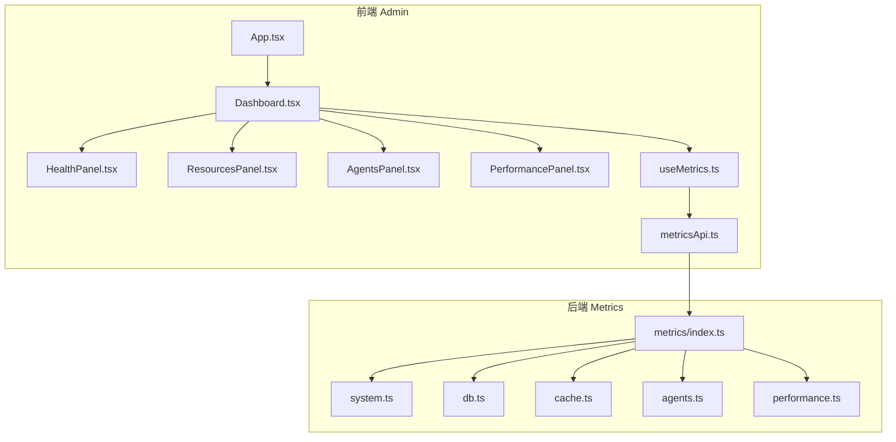
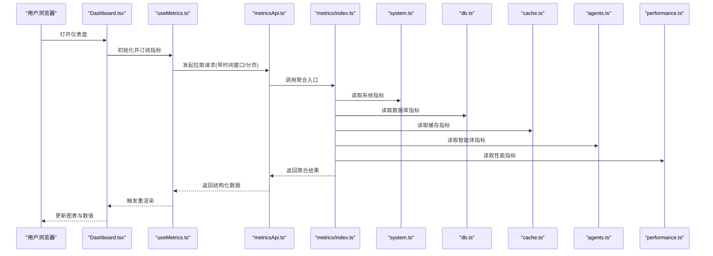
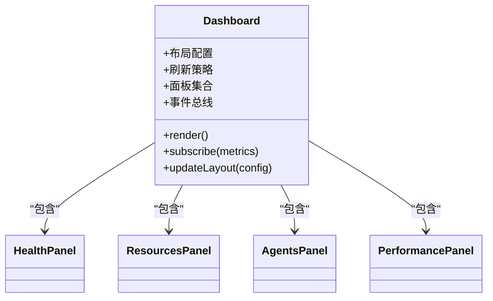
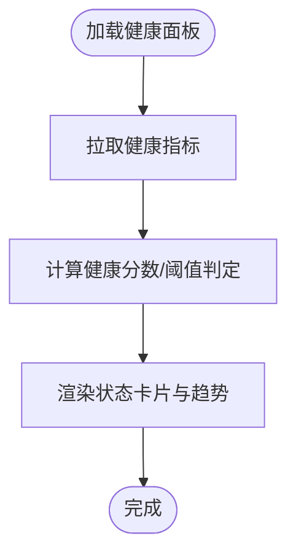
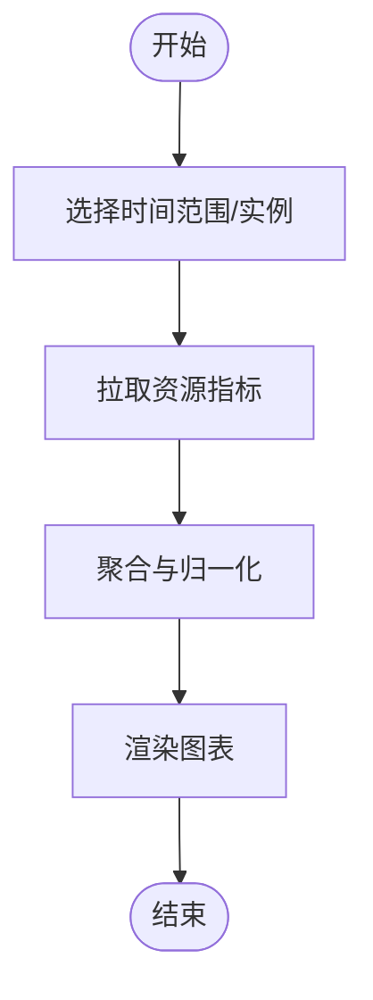
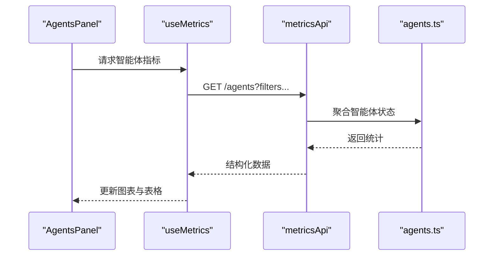
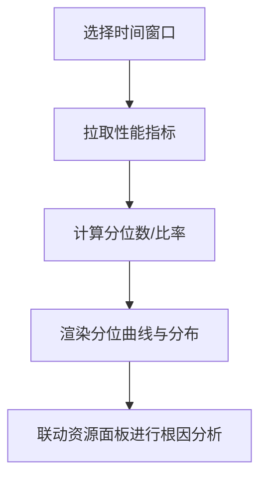
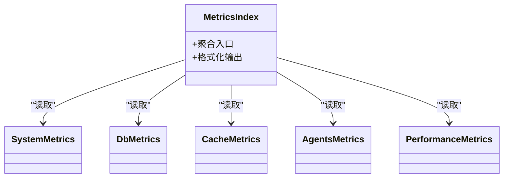
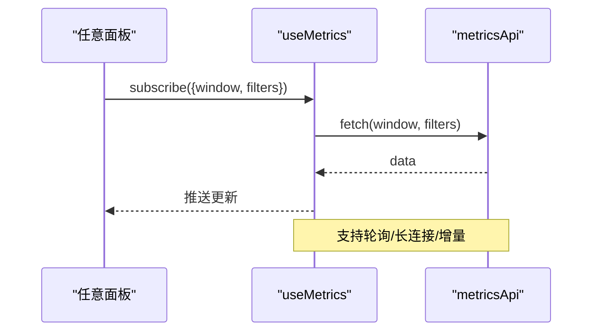
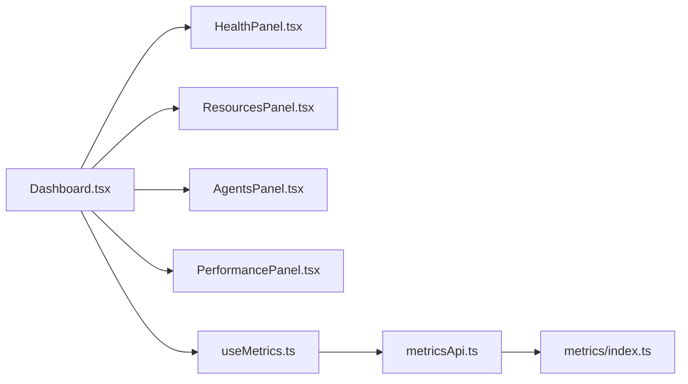

# 仪表盘概览

<cite>
**本文引用的文件**   
- [admin/src/App.tsx](file://admin/src/App.tsx)
- [admin/src/components/Dashboard.tsx](file://admin/src/components/Dashboard.tsx)
- [admin/src/components/HealthPanel.tsx](file://admin/src/components/HealthPanel.tsx)
- [admin/src/components/ResourcesPanel.tsx](file://admin/src/components/ResourcesPanel.tsx)
- [admin/src/components/AgentsPanel.tsx](file://admin/src/components/AgentsPanel.tsx)
- [admin/src/components/PerformancePanel.tsx](file://admin/src/components/PerformancePanel.tsx)
- [admin/src/hooks/useMetrics.ts](file://admin/src/hooks/useMetrics.ts)
- [admin/src/services/metricsApi.ts](file://admin/src/services/metricsApi.ts)
- [admin/src/types/dashboard.ts](file://admin/src/types/dashboard.ts)
- [src/core/metrics/index.ts](file://src/core/metrics/index.ts)
- [src/core/metrics/system.ts](file://src/core/metrics/system.ts)
- [src/core/metrics/db.ts](file://src/core/metrics/db.ts)
- [src/core/metrics/cache.ts](file://src/core/metrics/cache.ts)
- [src/core/metrics/agents.ts](file://src/core/metrics/agents.ts)
- [src/core/metrics/performance.ts](file://src/core/metrics/performance.ts)
</cite>

## 目录
1. [简介](#简介)
2. [项目结构](#项目结构)
3. [核心组件](#核心组件)
4. [架构总览](#架构总览)
5. [详细组件分析](#详细组件分析)
6. [依赖分析](#依赖分析)
7. [性能考虑](#性能考虑)
8. [故障排查指南](#故障排查指南)
9. [结论](#结论)
10. [附录](#附录)

## 简介
本文件面向系统管理员与运维人员，提供“仪表盘概览”功能的完整使用文档。内容涵盖：
- 主仪表盘各监控面板：系统健康状态、资源使用情况、智能体运行状态、性能指标
- 关键图表与可视化含义：CPU使用率、内存占用、数据库连接数、缓存命中率等
- 仪表盘自定义配置：面板布局调整、指标选择、数据刷新频率设置
- 实时数据更新机制与历史数据查看
- 常见视图的使用场景与最佳实践建议

## 项目结构
仪表盘功能由前端 admin 应用与后端 metrics 模块共同实现。前端负责展示与交互，后端负责采集与聚合指标并提供查询接口。

图示来源
- [admin/src/App.tsx](file://admin/src/App.tsx)
- [admin/src/components/Dashboard.tsx](file://admin/src/components/Dashboard.tsx)
- [admin/src/components/HealthPanel.tsx](file://admin/src/components/HealthPanel.tsx)
- [admin/src/components/ResourcesPanel.tsx](file://admin/src/components/ResourcesPanel.tsx)
- [admin/src/components/AgentsPanel.tsx](file://admin/src/components/AgentsPanel.tsx)
- [admin/src/components/PerformancePanel.tsx](file://admin/src/components/PerformancePanel.tsx)
- [admin/src/hooks/useMetrics.ts](file://admin/src/hooks/useMetrics.ts)
- [admin/src/services/metricsApi.ts](file://admin/src/services/metricsApi.ts)
- [src/core/metrics/index.ts](file://src/core/metrics/index.ts)
- [src/core/metrics/system.ts](file://src/core/metrics/system.ts)
- [src/core/metrics/db.ts](file://src/core/metrics/db.ts)
- [src/core/metrics/cache.ts](file://src/core/metrics/cache.ts)
- [src/core/metrics/agents.ts](file://src/core/metrics/agents.ts)
- [src/core/metrics/performance.ts](file://src/core/metrics/performance.ts)

章节来源
- [admin/src/App.tsx](file://admin/src/App.tsx)
- [admin/src/components/Dashboard.tsx](file://admin/src/components/Dashboard.tsx)
- [admin/src/hooks/useMetrics.ts](file://admin/src/hooks/useMetrics.ts)
- [admin/src/services/metricsApi.ts](file://admin/src/services/metricsApi.ts)
- [src/core/metrics/index.ts](file://src/core/metrics/index.ts)

## 核心组件
- 仪表盘容器（Dashboard）
  - 职责：编排各子面板、统一时间窗口与刷新策略、承载全局配置（如刷新间隔、默认指标集）。
  - 交互：支持拖拽/切换面板顺序、按维度筛选（如按环境或实例）、展开/收起详情。
- 健康状态面板（HealthPanel）
  - 展示：服务存活、关键进程/线程状态、错误率、告警计数、最近异常摘要。
  - 阈值：内置健康阈值与颜色分级，便于快速识别异常。
- 资源使用面板（ResourcesPanel）
  - 展示：CPU使用率、内存占用、磁盘I/O、网络吞吐、文件描述符等。
  - 图表：折线图（趋势）、柱状图（对比）、热力图（时段分布）。
- 智能体运行状态面板（AgentsPanel）
  - 展示：活跃智能体数量、任务队列长度、成功率/失败率、平均耗时、重试次数。
  - 过滤：按智能体类型、工作负载、命名空间筛选。
- 性能指标面板（PerformancePanel）
  - 展示：请求延迟分位（P50/P90/P99）、QPS、错误码分布、缓存命中率、数据库连接池使用率。
  - 关联：可与资源面板联动，定位瓶颈。

章节来源
- [admin/src/components/Dashboard.tsx](file://admin/src/components/Dashboard.tsx)
- [admin/src/components/HealthPanel.tsx](file://admin/src/components/HealthPanel.tsx)
- [admin/src/components/ResourcesPanel.tsx](file://admin/src/components/ResourcesPanel.tsx)
- [admin/src/components/AgentsPanel.tsx](file://admin/src/components/AgentsPanel.tsx)
- [admin/src/components/PerformancePanel.tsx](file://admin/src/components/PerformancePanel.tsx)

## 架构总览
仪表盘的数据流从后端指标采集到前端渲染的端到端流程如下：

图示来源
- [admin/src/components/Dashboard.tsx](file://admin/src/components/Dashboard.tsx)
- [admin/src/hooks/useMetrics.ts](file://admin/src/hooks/useMetrics.ts)
- [admin/src/services/metricsApi.ts](file://admin/src/services/metricsApi.ts)
- [src/core/metrics/index.ts](file://src/core/metrics/index.ts)
- [src/core/metrics/system.ts](file://src/core/metrics/system.ts)
- [src/core/metrics/db.ts](file://src/core/metrics/db.ts)
- [src/core/metrics/cache.ts](file://src/core/metrics/cache.ts)
- [src/core/metrics/agents.ts](file://src/core/metrics/agents.ts)
- [src/core/metrics/performance.ts](file://src/core/metrics/performance.ts)

## 详细组件分析

### 仪表盘容器（Dashboard）
- 布局与可定制性
  - 网格布局：支持响应式栅格，面板可拖拽排序、折叠/展开。
  - 面板注册表：新增面板需注册至容器，以便在工具栏中显示/隐藏。
- 全局配置
  - 刷新频率：支持秒级到分钟级可调，默认值可在配置文件或环境变量中设定。
  - 默认指标集：可按角色或环境预设不同指标组合。
- 事件总线
  - 跨面板联动：例如点击某智能体时，其他面板自动过滤该智能体的相关指标。

图示来源
- [admin/src/components/Dashboard.tsx](file://admin/src/components/Dashboard.tsx)

章节来源
- [admin/src/components/Dashboard.tsx](file://admin/src/components/Dashboard.tsx)

### 健康状态面板（HealthPanel）
- 关键指标
  - 服务存活探针、错误率、告警计数、最近异常摘要、依赖服务可用性。
- 可视化
  - 状态卡片（绿/黄/红）、时间序列折线（错误率趋势）、列表（异常摘要）。
- 阈值与告警
  - 阈值可配置；超过阈值时高亮并提示进入告警详情。

图示来源
- [admin/src/components/HealthPanel.tsx](file://admin/src/components/HealthPanel.tsx)

章节来源
- [admin/src/components/HealthPanel.tsx](file://admin/src/components/HealthPanel.tsx)

### 资源使用面板（ResourcesPanel）
- 关键指标
  - CPU使用率、内存占用、磁盘I/O、网络吞吐、文件描述符。
- 可视化
  - 多指标叠加折线图、堆叠面积图（资源占比）、热力图（时段峰值）。
- 联动
  - 与性能面板联动，定位资源瓶颈与延迟上升的相关性。

图示来源
- [admin/src/components/ResourcesPanel.tsx](file://admin/src/components/ResourcesPanel.tsx)

章节来源
- [admin/src/components/ResourcesPanel.tsx](file://admin/src/components/ResourcesPanel.tsx)

### 智能体运行状态面板（AgentsPanel）
- 关键指标
  - 活跃智能体数、任务队列长度、成功率/失败率、平均耗时、重试次数。
- 可视化
  - 双轴图（QPS与延迟）、饼图（任务类型分布）、表格（实例明细）。
- 过滤与钻取
  - 按智能体类型、命名空间、版本过滤；点击行可下钻到具体任务轨迹。

图示来源
- [admin/src/components/AgentsPanel.tsx](file://admin/src/components/AgentsPanel.tsx)
- [admin/src/hooks/useMetrics.ts](file://admin/src/hooks/useMetrics.ts)
- [admin/src/services/metricsApi.ts](file://admin/src/services/metricsApi.ts)
- [src/core/metrics/agents.ts](file://src/core/metrics/agents.ts)

章节来源
- [admin/src/components/AgentsPanel.tsx](file://admin/src/components/AgentsPanel.tsx)
- [src/core/metrics/agents.ts](file://src/core/metrics/agents.ts)

### 性能指标面板（PerformancePanel）
- 关键指标
  - 请求延迟分位（P50/P90/P99）、QPS、错误码分布、缓存命中率、数据库连接池使用率。
- 可视化
  - 分位曲线、直方图（错误码分布）、环形图（命中率）、水位线（连接池使用率）。
- 诊断辅助
  - 与资源面板联动，结合CPU/内存/IO判断是否资源受限导致性能下降。

图示来源
- [admin/src/components/PerformancePanel.tsx](file://admin/src/components/PerformancePanel.tsx)

章节来源
- [admin/src/components/PerformancePanel.tsx](file://admin/src/components/PerformancePanel.tsx)

### 指标采集与聚合（后端）
- 入口与组织
  - 统一入口聚合各子系统指标，对外暴露标准化数据结构。
- 子系统
  - 系统指标：CPU、内存、磁盘、网络等。
  - 数据库指标：连接池大小、活跃连接、慢查询、锁等待。
  - 缓存指标：命中率、淘汰率、内存使用、键数量。
  - 智能体指标：任务队列、执行时长、成功率、重试。
  - 性能指标：延迟分位、吞吐、错误率、资源利用率。

图示来源
- [src/core/metrics/index.ts](file://src/core/metrics/index.ts)
- [src/core/metrics/system.ts](file://src/core/metrics/system.ts)
- [src/core/metrics/db.ts](file://src/core/metrics/db.ts)
- [src/core/metrics/cache.ts](file://src/core/metrics/cache.ts)
- [src/core/metrics/agents.ts](file://src/core/metrics/agents.ts)
- [src/core/metrics/performance.ts](file://src/core/metrics/performance.ts)

章节来源
- [src/core/metrics/index.ts](file://src/core/metrics/index.ts)
- [src/core/metrics/system.ts](file://src/core/metrics/system.ts)
- [src/core/metrics/db.ts](file://src/core/metrics/db.ts)
- [src/core/metrics/cache.ts](file://src/core/metrics/cache.ts)
- [src/core/metrics/agents.ts](file://src/core/metrics/agents.ts)
- [src/core/metrics/performance.ts](file://src/core/metrics/performance.ts)

### 前端数据层（hooks 与 API）
- useMetrics 钩子
  - 封装定时拉取、去抖/节流、错误重试、增量更新、本地缓存。
  - 暴露统一的订阅接口供各面板消费。
- metricsApi 服务
  - 定义指标查询参数（时间窗口、分组、过滤条件）、分页与排序。
  - 处理鉴权、超时、重试与降级策略。

图示来源
- [admin/src/hooks/useMetrics.ts](file://admin/src/hooks/useMetrics.ts)
- [admin/src/services/metricsApi.ts](file://admin/src/services/metricsApi.ts)

章节来源
- [admin/src/hooks/useMetrics.ts](file://admin/src/hooks/useMetrics.ts)
- [admin/src/services/metricsApi.ts](file://admin/src/services/metricsApi.ts)

### 类型与配置（types）
- dashboard.ts
  - 定义面板配置、指标元数据、刷新策略、布局模型等类型。
  - 为前后端契约提供强类型保障，减少运行时错误。

章节来源
- [admin/src/types/dashboard.ts](file://admin/src/types/dashboard.ts)

## 依赖分析
- 组件耦合
  - Dashboard 作为容器，低耦合地组合各面板；面板通过 hooks 获取数据，避免直接依赖 API。
- 外部依赖
  - 图表库：用于折线、柱状、环形、热力图等可视化。
  - 网络层：HTTP/WebSocket/SSE 等用于实时数据。
- 潜在循环依赖
  - 通过 hooks 与 API 解耦，避免组件间直接互相引用。

图示来源
- [admin/src/components/Dashboard.tsx](file://admin/src/components/Dashboard.tsx)
- [admin/src/components/HealthPanel.tsx](file://admin/src/components/HealthPanel.tsx)
- [admin/src/components/ResourcesPanel.tsx](file://admin/src/components/ResourcesPanel.tsx)
- [admin/src/components/AgentsPanel.tsx](file://admin/src/components/AgentsPanel.tsx)
- [admin/src/components/PerformancePanel.tsx](file://admin/src/components/PerformancePanel.tsx)
- [admin/src/hooks/useMetrics.ts](file://admin/src/hooks/useMetrics.ts)
- [admin/src/services/metricsApi.ts](file://admin/src/services/metricsApi.ts)
- [src/core/metrics/index.ts](file://src/core/metrics/index.ts)

章节来源
- [admin/src/components/Dashboard.tsx](file://admin/src/components/Dashboard.tsx)
- [admin/src/hooks/useMetrics.ts](file://admin/src/hooks/useMetrics.ts)
- [admin/src/services/metricsApi.ts](file://admin/src/services/metricsApi.ts)
- [src/core/metrics/index.ts](file://src/core/metrics/index.ts)

## 性能考虑
- 前端
  - 使用虚拟滚动与按需渲染，避免大数据量导致的卡顿。
  - 对高频指标采用节流与增量更新，降低重绘开销。
  - 合理设置刷新频率，避免频繁请求造成抖动。
- 后端
  - 指标聚合采用批处理与窗口化计算，降低数据库压力。
  - 热点指标启用内存缓存，缩短首屏与翻页延迟。
  - 对慢查询与高并发路径增加限流与熔断保护。

[本节为通用指导，不直接分析具体文件]

## 故障排查指南
- 常见问题
  - 数据不更新：检查网络连通、鉴权令牌、轮询/长连接状态。
  - 图表空白：确认时间窗口有效、过滤条件未过严、后端返回字段完整。
  - 刷新过快：调大刷新间隔，开启节流与去抖。
  - 指标缺失：核对子系统上报链路、权限与命名空间过滤。
- 定位步骤
  - 打开浏览器开发者工具，观察网络请求与错误日志。
  - 在后端查看指标采集日志与聚合错误。
  - 逐步缩小时间窗口与过滤条件，复现问题。

章节来源
- [admin/src/hooks/useMetrics.ts](file://admin/src/hooks/useMetrics.ts)
- [admin/src/services/metricsApi.ts](file://admin/src/services/metricsApi.ts)

## 结论
仪表盘概览将系统健康、资源、智能体与性能四大维度的关键指标集中呈现，配合灵活的自定义能力与实时数据更新机制，帮助团队快速掌握系统状态、定位瓶颈并做出决策。建议在生产环境中根据业务特征调整刷新频率与指标集，并结合告警与历史回溯形成闭环。

[本节为总结，不直接分析具体文件]

## 附录

### 关键指标说明
- CPU使用率：反映处理器繁忙程度，过高可能引发排队与延迟上升。
- 内存占用：关注增长趋势与泄漏迹象，结合GC行为评估稳定性。
- 数据库连接数：连接池使用率接近上限时需扩容或优化慢查询。
- 缓存命中率：命中率过低可能导致回源放大，需优化热点键与过期策略。
- 请求延迟分位：P90/P99更能体现尾部延迟，是用户体验的关键。
- 错误率与错误码分布：快速发现回归与上游依赖异常。

[本节为概念性说明，不直接分析具体文件]

### 仪表盘自定义配置方法
- 面板布局调整
  - 拖拽排序、折叠/展开、全屏预览、导出当前布局快照。
- 指标选择
  - 通过面板注册表勾选/取消指标；按角色或环境保存预设。
- 数据刷新频率
  - 支持秒级到分钟级调节；对非关键指标可降低频率以节省资源。
- 历史数据查看
  - 选择时间窗口（近1小时/24小时/7天/自定义），支持缩放与平移。
  - 对比模式：同一指标在不同实例或时间段上的对比。

章节来源
- [admin/src/components/Dashboard.tsx](file://admin/src/components/Dashboard.tsx)
- [admin/src/types/dashboard.ts](file://admin/src/types/dashboard.ts)

### 实时数据更新机制
- 拉取模式：定时轮询，适合大多数场景，易于扩展与降级。
- 推送模式：WebSocket/SSE，适合高频指标与低延迟需求。
- 增量更新：仅传输差异数据，降低带宽与解析成本。
- 断线恢复：自动重连与指数退避，保证连续性。

章节来源
- [admin/src/hooks/useMetrics.ts](file://admin/src/hooks/useMetrics.ts)
- [admin/src/services/metricsApi.ts](file://admin/src/services/metricsApi.ts)

### 常见视图与最佳实践
- 值班巡检视图
  - 聚焦健康状态与错误率，设置较短刷新间隔，开启告警高亮。
- 容量规划视图
  - 关注资源使用趋势与峰值，结合历史数据进行容量评估。
- 故障复盘视图
  - 拉取故障时段全量指标，联动资源与性能面板进行根因分析。
- 发布验证视图
  - 对比发布前后关键指标变化，确保无显著退化。

[本节为概念性说明，不直接分析具体文件]