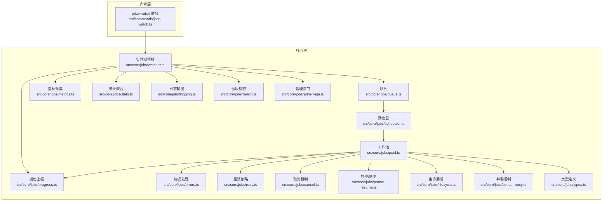
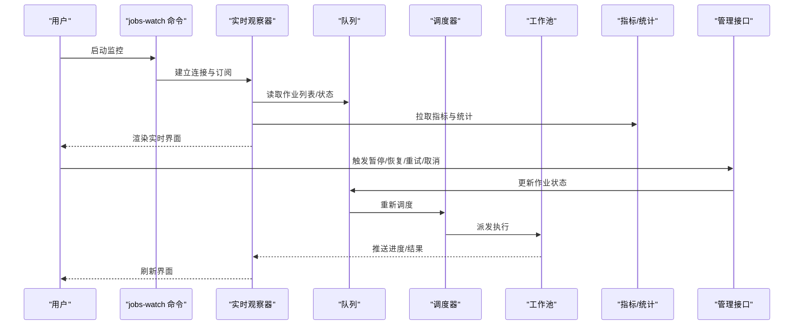
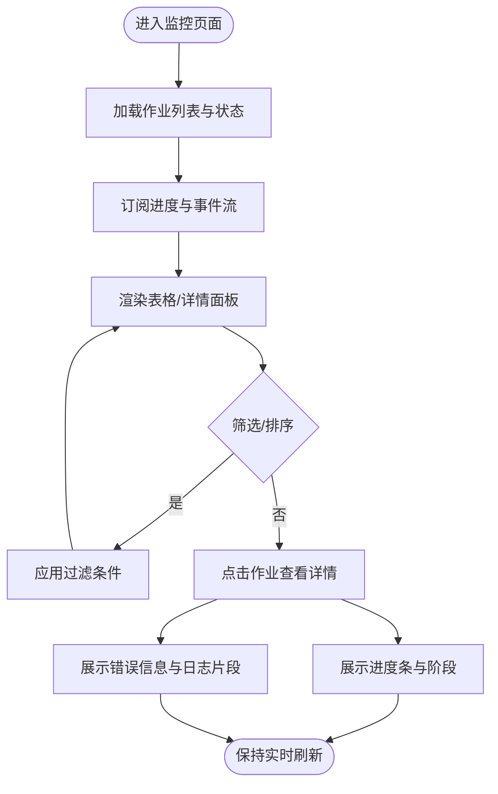
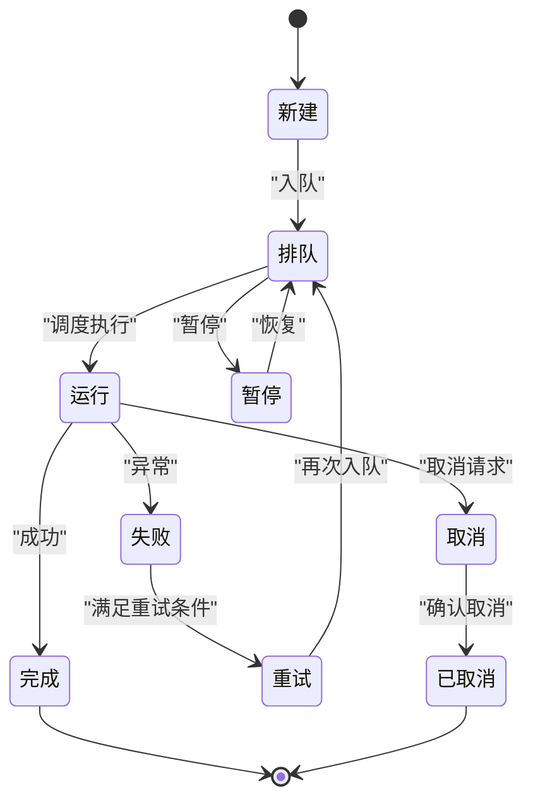
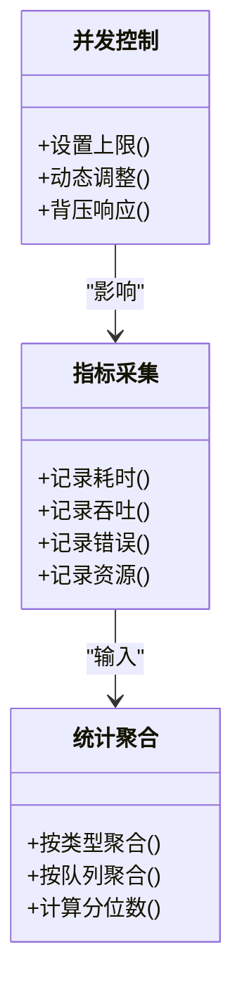
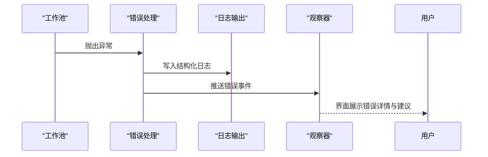
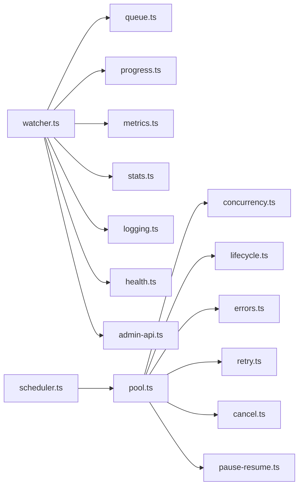

# 作业监控

<cite>
**本文引用的文件**   
- [README.md](file://README.md)
- [src/commands/jobs-watch.ts](file://src/commands/jobs-watch.ts)
- [src/core/jobs/watcher.ts](file://src/core/jobs/watcher.ts)
- [src/core/jobs/queue.ts](file://src/core/jobs/queue.ts)
- [src/core/jobs/scheduler.ts](file://src/core/jobs/scheduler.ts)
- [src/core/jobs/types.ts](file://src/core/jobs/types.ts)
- [src/core/jobs/metrics.ts](file://src/core/jobs/metrics.ts)
- [src/core/jobs/errors.ts](file://src/core/jobs/errors.ts)
- [src/core/jobs/pool.ts](file://src/core/jobs/pool.ts)
- [src/core/jobs/retry.ts](file://src/core/jobs/retry.ts)
- [src/core/jobs/cancel.ts](file://src/core/jobs/cancel.ts)
- [src/core/jobs/pause-resume.ts](file://src/core/jobs/pause-resume.ts)
- [src/core/jobs/lifecycle.ts](file://src/core/jobs/lifecycle.ts)
- [src/core/jobs/stats.ts](file://src/core/jobs/stats.ts)
- [src/core/jobs/logging.ts](file://src/core/jobs/logging.ts)
- [src/core/jobs/progress.ts](file://src/core/jobs/progress.ts)
- [src/core/jobs/concurrency.ts](file://src/core/jobs/concurrency.ts)
- [src/core/jobs/health.ts](file://src/core/jobs/health.ts)
- [src/core/jobs/admin-api.ts](file://src/core/jobs/admin-api.ts)
</cite>

## 目录
1. [简介](#简介)
2. [项目结构](#项目结构)
3. [核心组件](#核心组件)
4. [架构总览](#架构总览)
5. [详细组件分析](#详细组件分析)
6. [依赖关系分析](#依赖关系分析)
7. [性能考量](#性能考量)
8. [故障排除指南](#故障排除指南)
9. [结论](#结论)
10. [附录](#附录)

## 简介
本文件面向运维与开发者，系统化说明“作业监控”能力的使用方法与最佳实践。内容覆盖：
- 后台作业队列的实时监控界面（状态跟踪、执行进度、错误信息）
- 不同类型作业的监控方法与指标含义（数据摄取、知识提取、索引构建等）
- 作业生命周期管理（暂停、恢复、重试、取消）
- 性能分析工具（执行时间统计、资源消耗、并发控制）
- 失败诊断、错误日志查看与排障流程
- 调度策略优化与性能调优建议

## 项目结构
作业监控相关代码主要分布在 src/core/jobs 与 src/commands 下，采用分层组织：
- 命令层：提供 CLI 与 Web 监控入口
- 核心层：队列、调度器、工作池、进度、指标、错误、重试、取消、暂停/恢复、健康检查等
- 类型与配置：统一类型定义与可观测性字段

图表来源
- [src/commands/jobs-watch.ts](file://src/commands/jobs-watch.ts)
- [src/core/jobs/watcher.ts](file://src/core/jobs/watcher.ts)
- [src/core/jobs/queue.ts](file://src/core/jobs/queue.ts)
- [src/core/jobs/scheduler.ts](file://src/core/jobs/scheduler.ts)
- [src/core/jobs/pool.ts](file://src/core/jobs/pool.ts)
- [src/core/jobs/progress.ts](file://src/core/jobs/progress.ts)
- [src/core/jobs/metrics.ts](file://src/core/jobs/metrics.ts)
- [src/core/jobs/errors.ts](file://src/core/jobs/errors.ts)
- [src/core/jobs/retry.ts](file://src/core/jobs/retry.ts)
- [src/core/jobs/cancel.ts](file://src/core/jobs/cancel.ts)
- [src/core/jobs/pause-resume.ts](file://src/core/jobs/pause-resume.ts)
- [src/core/jobs/lifecycle.ts](file://src/core/jobs/lifecycle.ts)
- [src/core/jobs/stats.ts](file://src/core/jobs/stats.ts)
- [src/core/jobs/logging.ts](file://src/core/jobs/logging.ts)
- [src/core/jobs/concurrency.ts](file://src/core/jobs/concurrency.ts)
- [src/core/jobs/health.ts](file://src/core/jobs/health.ts)
- [src/core/jobs/admin-api.ts](file://src/core/jobs/admin-api.ts)
- [src/core/jobs/types.ts](file://src/core/jobs/types.ts)

章节来源
- [README.md](file://README.md)

## 核心组件
- 实时观察器（watcher）：订阅队列事件与进度流，驱动监控界面的实时更新
- 队列（queue）：持久化作业元数据、状态机与优先级
- 调度器（scheduler）：按策略挑选待执行作业并派发至工作池
- 工作池（pool）：并发执行作业，负责资源隔离与回收
- 进度上报（progress）：结构化进度事件（阶段、百分比、子任务）
- 指标采集（metrics）：收集耗时、吞吐、错误率、资源占用等
- 错误处理（errors）：标准化错误分类、上下文附加与告警
- 重试策略（retry）：退避算法、最大重试次数、幂等保障
- 取消机制（cancel）：基于令牌或信号的中断传播
- 暂停/恢复（pause-resume）：全局或按队列维度的暂停与恢复
- 生命周期（lifecycle）：入队、运行、完成、失败、重试、取消等状态流转
- 统计聚合（stats）：汇总各维度统计（按类型、队列、标签）
- 日志输出（logging）：结构化日志、采样与脱敏
- 并发控制（concurrency）：限流、配额、背压
- 健康检查（health）：存活探针、就绪探针、阻塞检测
- 管理接口（admin-api）：暴露查询、控制与导出能力
- 类型定义（types）：作业模型、事件、指标、配置

章节来源
- [src/core/jobs/watcher.ts](file://src/core/jobs/watcher.ts)
- [src/core/jobs/queue.ts](file://src/core/jobs/queue.ts)
- [src/core/jobs/scheduler.ts](file://src/core/jobs/scheduler.ts)
- [src/core/jobs/pool.ts](file://src/core/jobs/pool.ts)
- [src/core/jobs/progress.ts](file://src/core/jobs/progress.ts)
- [src/core/jobs/metrics.ts](file://src/core/jobs/metrics.ts)
- [src/core/jobs/errors.ts](file://src/core/jobs/errors.ts)
- [src/core/jobs/retry.ts](file://src/core/jobs/retry.ts)
- [src/core/jobs/cancel.ts](file://src/core/jobs/cancel.ts)
- [src/core/jobs/pause-resume.ts](file://src/core/jobs/pause-resume.ts)
- [src/core/jobs/lifecycle.ts](file://src/core/jobs/lifecycle.ts)
- [src/core/jobs/stats.ts](file://src/core/jobs/stats.ts)
- [src/core/jobs/logging.ts](file://src/core/jobs/logging.ts)
- [src/core/jobs/concurrency.ts](file://src/core/jobs/concurrency.ts)
- [src/core/jobs/health.ts](file://src/core/jobs/health.ts)
- [src/core/jobs/admin-api.ts](file://src/core/jobs/admin-api.ts)
- [src/core/jobs/types.ts](file://src/core/jobs/types.ts)

## 架构总览
下图展示从命令到核心组件的调用链路与数据流向，体现“监控—控制—执行—反馈”的闭环。

图表来源
- [src/commands/jobs-watch.ts](file://src/commands/jobs-watch.ts)
- [src/core/jobs/watcher.ts](file://src/core/jobs/watcher.ts)
- [src/core/jobs/queue.ts](file://src/core/jobs/queue.ts)
- [src/core/jobs/scheduler.ts](file://src/core/jobs/scheduler.ts)
- [src/core/jobs/pool.ts](file://src/core/jobs/pool.ts)
- [src/core/jobs/metrics.ts](file://src/core/jobs/metrics.ts)
- [src/core/jobs/admin-api.ts](file://src/core/jobs/admin-api.ts)

## 详细组件分析

### 实时监控界面（状态、进度、错误）
- 状态跟踪：通过观察器订阅队列变更事件，展示作业的生命周期状态（新建、排队、运行、完成、失败、重试、取消、暂停）
- 执行进度：消费进度事件流，显示阶段、百分比、子任务明细；支持增量更新与去抖
- 错误信息：聚合错误分类、堆栈摘要、上下文键值对；支持按作业ID筛选与跳转

图表来源
- [src/core/jobs/watcher.ts](file://src/core/jobs/watcher.ts)
- [src/core/jobs/progress.ts](file://src/core/jobs/progress.ts)
- [src/core/jobs/errors.ts](file://src/core/jobs/errors.ts)
- [src/core/jobs/stats.ts](file://src/core/jobs/stats.ts)

章节来源
- [src/core/jobs/watcher.ts](file://src/core/jobs/watcher.ts)
- [src/core/jobs/progress.ts](file://src/core/jobs/progress.ts)
- [src/core/jobs/errors.ts](file://src/core/jobs/errors.ts)
- [src/core/jobs/stats.ts](file://src/core/jobs/stats.ts)

### 作业类型与指标含义
- 数据摄取（ingest）：关注源端连通性、抓取速率、解析成功率、重复率
- 知识提取（extract）：关注抽取质量、实体/关系覆盖率、置信度分布、失败原因
- 索引构建（index/build）：关注写入吞吐、倒排/向量索引大小、重建耗时、碎片率
- 通用指标：
  - 执行时间：平均/分位耗时、长尾占比
  - 吞吐：每秒作业数、字节/条目吞吐
  - 错误率：按类型/阶段/队列维度
  - 资源：CPU/内存/IO 使用率、GC 停顿、锁等待
  - 队列深度与积压时长：等待时间分布、超时比例

章节来源
- [src/core/jobs/metrics.ts](file://src/core/jobs/metrics.ts)
- [src/core/jobs/stats.ts](file://src/core/jobs/stats.ts)
- [src/core/jobs/types.ts](file://src/core/jobs/types.ts)

### 生命周期管理（暂停、恢复、重试、取消）
- 暂停/恢复：支持全局或按队列粒度暂停；恢复后按优先级与权重继续
- 重试：自动重试遵循退避策略，支持最大次数与指数退避；幂等键避免重复写入
- 取消：基于令牌/信号中断；支持优雅终止与回滚点
- 状态机：严格的状态转换约束，防止非法操作

图表来源
- [src/core/jobs/lifecycle.ts](file://src/core/jobs/lifecycle.ts)
- [src/core/jobs/pause-resume.ts](file://src/core/jobs/pause-resume.ts)
- [src/core/jobs/retry.ts](file://src/core/jobs/retry.ts)
- [src/core/jobs/cancel.ts](file://src/core/jobs/cancel.ts)

章节来源
- [src/core/jobs/lifecycle.ts](file://src/core/jobs/lifecycle.ts)
- [src/core/jobs/pause-resume.ts](file://src/core/jobs/pause-resume.ts)
- [src/core/jobs/retry.ts](file://src/core/jobs/retry.ts)
- [src/core/jobs/cancel.ts](file://src/core/jobs/cancel.ts)

### 性能分析工具（耗时、资源、并发）
- 执行时间统计：端到端耗时、阶段耗时、分位统计与直方图
- 资源消耗：进程级与作业级 CPU/内存/IO 采样，结合 GC 与锁等待
- 并发控制：工作池大小、队列限流、背压阈值、热点键隔离
- 可视化：在监控界面中切换视图（趋势、热力图、TopN 慢作业）

图表来源
- [src/core/jobs/metrics.ts](file://src/core/jobs/metrics.ts)
- [src/core/jobs/stats.ts](file://src/core/jobs/stats.ts)
- [src/core/jobs/concurrency.ts](file://src/core/jobs/concurrency.ts)

章节来源
- [src/core/jobs/metrics.ts](file://src/core/jobs/metrics.ts)
- [src/core/jobs/stats.ts](file://src/core/jobs/stats.ts)
- [src/core/jobs/concurrency.ts](file://src/core/jobs/concurrency.ts)

### 失败诊断与错误日志
- 错误分类：网络、权限、解析、业务校验、资源不足等
- 上下文增强：作业ID、阶段、参数摘要、上游链路标识
- 日志聚合：按作业/队列/时间窗口检索；支持采样与脱敏
- 诊断建议：常见根因与修复步骤、关联指标联动

图表来源
- [src/core/jobs/errors.ts](file://src/core/jobs/errors.ts)
- [src/core/jobs/logging.ts](file://src/core/jobs/logging.ts)
- [src/core/jobs/watcher.ts](file://src/core/jobs/watcher.ts)

章节来源
- [src/core/jobs/errors.ts](file://src/core/jobs/errors.ts)
- [src/core/jobs/logging.ts](file://src/core/jobs/logging.ts)
- [src/core/jobs/watcher.ts](file://src/core/jobs/watcher.ts)

### 作业调度策略优化
- 优先级与权重：按业务重要性、SLA、队列容量分配
- 批处理与合并：减少小批量抖动，提升吞吐
- 自适应退避：根据错误率与延迟动态调整重试间隔
- 分区与隔离：按租户/源/类型分区，避免热点干扰

章节来源
- [src/core/jobs/scheduler.ts](file://src/core/jobs/scheduler.ts)
- [src/core/jobs/retry.ts](file://src/core/jobs/retry.ts)
- [src/core/jobs/concurrency.ts](file://src/core/jobs/concurrency.ts)

## 依赖关系分析
- 低耦合高内聚：命令层仅依赖观察器与管理接口；核心模块通过类型与事件解耦
- 关键依赖链：
  - watcher → queue/progress/metrics/stats/logging/health/admin-api
  - scheduler → pool/concurrency/lifecycle
  - pool → progress/errors/retry/cancel/pause-resume
- 外部集成点：存储后端（队列持久化）、消息通道（进度/事件）、监控系统（指标导出）

图表来源
- [src/core/jobs/watcher.ts](file://src/core/jobs/watcher.ts)
- [src/core/jobs/queue.ts](file://src/core/jobs/queue.ts)
- [src/core/jobs/scheduler.ts](file://src/core/jobs/scheduler.ts)
- [src/core/jobs/pool.ts](file://src/core/jobs/pool.ts)
- [src/core/jobs/concurrency.ts](file://src/core/jobs/concurrency.ts)
- [src/core/jobs/lifecycle.ts](file://src/core/jobs/lifecycle.ts)
- [src/core/jobs/errors.ts](file://src/core/jobs/errors.ts)
- [src/core/jobs/retry.ts](file://src/core/jobs/retry.ts)
- [src/core/jobs/cancel.ts](file://src/core/jobs/cancel.ts)
- [src/core/jobs/pause-resume.ts](file://src/core/jobs/pause-resume.ts)
- [src/core/jobs/metrics.ts](file://src/core/jobs/metrics.ts)
- [src/core/jobs/stats.ts](file://src/core/jobs/stats.ts)
- [src/core/jobs/logging.ts](file://src/core/jobs/logging.ts)
- [src/core/jobs/health.ts](file://src/core/jobs/health.ts)
- [src/core/jobs/admin-api.ts](file://src/core/jobs/admin-api.ts)

## 性能考量
- 合理设置工作池大小与队列限流，避免过载与雪崩
- 启用进度采样与指标采样，降低监控开销
- 对热点作业进行分区与隔离，避免相互影响
- 使用幂等键与去重策略，减少重复计算
- 定期清理历史作业与归档日志，控制存储增长

[本节为通用指导，不直接分析具体文件]

## 故障排除指南
- 常见问题定位：
  - 作业长时间排队：检查队列深度、调度策略与工作池容量
  - 频繁失败：查看错误分类与上下文，核对依赖服务与健康状态
  - 进度停滞：检查进度上报通道与消费者是否活跃
  - 资源耗尽：观察 CPU/内存/IO 峰值，调整并发与批大小
- 快速操作：
  - 暂停/恢复：用于临时止血与恢复
  - 重试/取消：针对个别异常作业进行干预
  - 导出日志与指标：便于离线分析与回溯
- 健康检查：
  - 存活/就绪探针：确认服务可用性与就绪状态
  - 阻塞检测：识别卡住的作业与死锁风险

章节来源
- [src/core/jobs/health.ts](file://src/core/jobs/health.ts)
- [src/core/jobs/admin-api.ts](file://src/core/jobs/admin-api.ts)
- [src/core/jobs/errors.ts](file://src/core/jobs/errors.ts)
- [src/core/jobs/logging.ts](file://src/core/jobs/logging.ts)

## 结论
通过统一的监控界面与完善的生命周期管理能力，系统可实现对后台作业的全链路可视、可控与可优化。结合性能分析与调度策略调优，可在保证稳定性的同时持续提升吞吐与质量。

[本节为总结性内容，不直接分析具体文件]

## 附录
- 常用命令与入口：
  - jobs-watch 命令：启动实时监控界面
- 参考文档：
  - README：项目概览与使用说明

章节来源
- [src/commands/jobs-watch.ts](file://src/commands/jobs-watch.ts)
- [README.md](file://README.md)