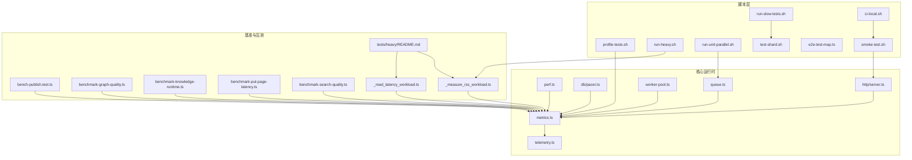
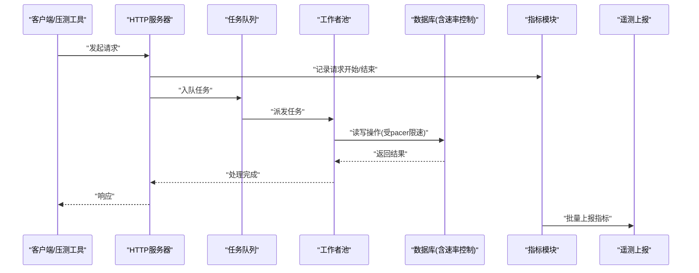
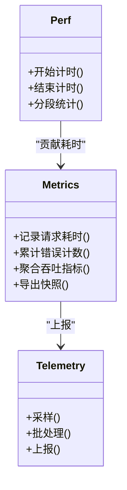
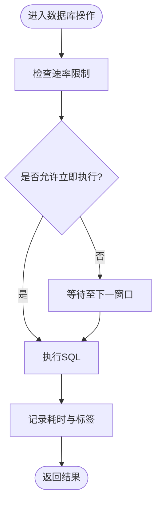
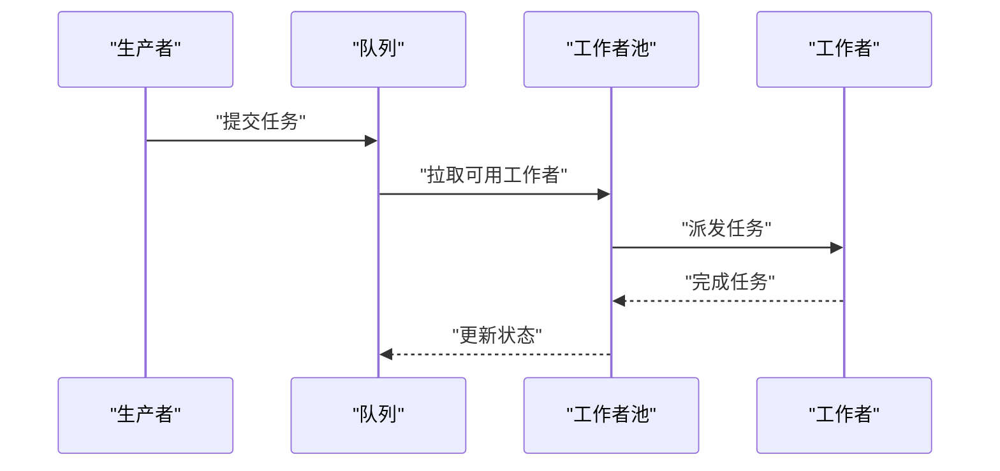
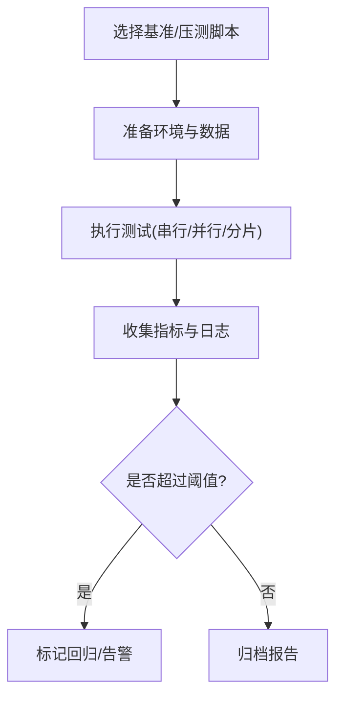
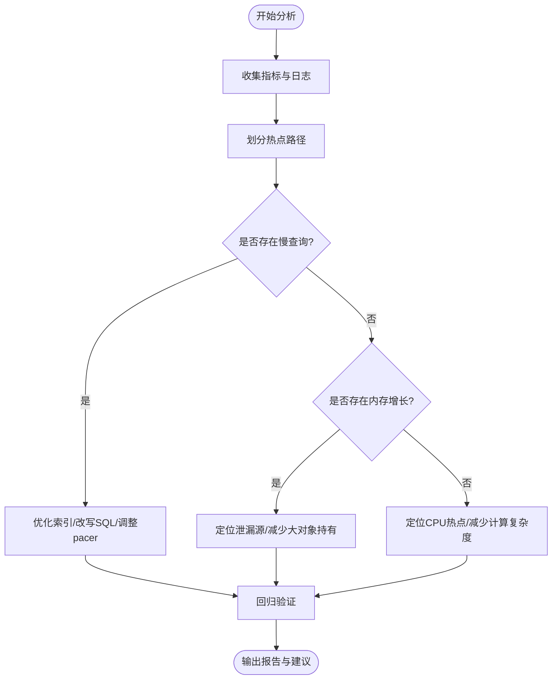
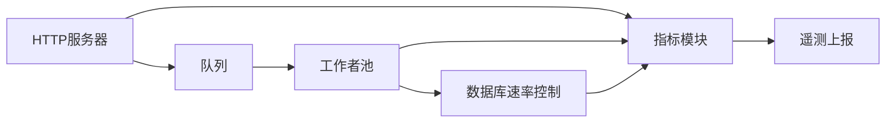

# 性能分析

<cite>
**本文引用的文件**   
- [README.md](file://README.md)
- [package.json](file://package.json)
- [bunfig.toml](file://bunfig.toml)
- [scripts/profile-tests.sh](file://scripts/profile-tests.sh)
- [scripts/run-heavy.sh](file://scripts/run-heavy.sh)
- [scripts/run-slow-tests.sh](file://scripts/run-slow-tests.sh)
- [scripts/run-unit-parallel.sh](file://scripts/run-unit-parallel.sh)
- [scripts/ci-local.sh](file://scripts/ci-local.sh)
- [scripts/smoke-test.sh](file://scripts/smoke-test.sh)
- [scripts/e2e-test-map.ts](file://scripts/e2e-test-map.ts)
- [scripts/test-shard.sh](file://scripts/test-shard.sh)
- [scripts/worker-pool-atomicity.sh](file://scripts/check-worker-pool-atomicity.sh)
- [scripts/worker-lock-renewal-shape.sh](file://scripts/check-worker-lock-renewal-shape.sh)
- [scripts/generate-metric-glossary.ts](file://scripts/generate-metric-glossary.ts)
- [test/bench/bench-publish.test.ts](file://test/bench/bench-publish.test.ts)
- [test/benchmark-graph-quality.ts](file://test/benchmark-graph-quality.ts)
- [test/benchmark-knowledge-runtime.ts](file://test/benchmark-knowledge-runtime.ts)
- [test/benchmark-put-page-latency.ts](file://test/benchmark-put-page-latency.ts)
- [test/benchmark-search-quality.ts](file://test/benchmark-search-quality.ts)
- [tests/heavy/_measure_rss_workload.ts](file://tests/heavy/_measure_rss_workload.ts)
- [tests/heavy/_read_latency_workload.ts](file://tests/heavy/_read_latency_workload.ts)
- [tests/heavy/README.md](file://tests/heavy/README.md)
- [src/core/metrics.ts](file://src/core/metrics.ts)
- [src/core/perf.ts](file://src/core/perf.ts)
- [src/core/telemetry.ts](file://src/core/telemetry.ts)
- [src/core/db/pacer.ts](file://src/core/db/pacer.ts)
- [src/core/queue.ts](file://src/core/queue.ts)
- [src/core/worker-pool.ts](file://src/core/worker-pool.ts)
- [src/core/http/server.ts](file://src/core/http/server.ts)
</cite>

## 目录
1. [简介](#简介)
2. [项目结构](#项目结构)
3. [核心组件](#核心组件)
4. [架构总览](#架构总览)
5. [详细组件分析](#详细组件分析)
6. [依赖关系分析](#依赖关系分析)
7. [性能考量](#性能考量)
8. [故障排查指南](#故障排查指南)
9. [结论](#结论)
10. [附录](#附录)

## 简介
本文件面向需要系统性开展性能分析与优化的工程师与运维人员，围绕以下目标展开：
- 明确系统关键性能指标(KPI)的定义、采集方式与展示方法，包括响应时间、吞吐量、资源利用率与错误率。
- 说明基准测试工具链的用法，覆盖单测性能回归检测、集成测试性能验证与压力测试执行。
- 提供瓶颈分析方法论，如慢查询识别、内存泄漏检测与CPU热点分析。
- 阐述如何自动生成优化建议并评估改进效果。
- 建立长期趋势分析、容量规划指导与预警机制配置流程。

## 项目结构
仓库中与性能相关的关键位置如下：
- 脚本层：用于运行重型测试、慢用例、并行单元、CI本地化执行与冒烟测试等。
- 基准与压测：位于 test/bench 与 tests/heavy 下的专用基准与负载脚本。
- 核心运行时：包含指标、性能计时、遥测、数据库速率控制、队列与工作者池、HTTP 服务器等。
- 文档与配置：根级 README、包管理与构建配置。

图表来源
- [scripts/profile-tests.sh](file://scripts/profile-tests.sh)
- [scripts/run-heavy.sh](file://scripts/run-heavy.sh)
- [scripts/run-slow-tests.sh](file://scripts/run-slow-tests.sh)
- [scripts/run-unit-parallel.sh](file://scripts/run-unit-parallel.sh)
- [scripts/ci-local.sh](file://scripts/ci-local.sh)
- [scripts/smoke-test.sh](file://scripts/smoke-test.sh)
- [scripts/e2e-test-map.ts](file://scripts/e2e-test-map.ts)
- [scripts/test-shard.sh](file://scripts/test-shard.sh)
- [test/bench/bench-publish.test.ts](file://test/bench/bench-publish.test.ts)
- [test/benchmark-graph-quality.ts](file://test/benchmark-graph-quality.ts)
- [test/benchmark-knowledge-runtime.ts](file://test/benchmark-knowledge-runtime.ts)
- [test/benchmark-put-page-latency.ts](file://test/benchmark-put-page-latency.ts)
- [test/benchmark-search-quality.ts](file://test/benchmark-search-quality.ts)
- [tests/heavy/_measure_rss_workload.ts](file://tests/heavy/_measure_rss_workload.ts)
- [tests/heavy/_read_latency_workload.ts](file://tests/heavy/_read_latency_workload.ts)
- [tests/heavy/README.md](file://tests/heavy/README.md)
- [src/core/metrics.ts](file://src/core/metrics.ts)
- [src/core/perf.ts](file://src/core/perf.ts)
- [src/core/telemetry.ts](file://src/core/telemetry.ts)
- [src/core/db/pacer.ts](file://src/core/db/pacer.ts)
- [src/core/queue.ts](file://src/core/queue.ts)
- [src/core/worker-pool.ts](file://src/core/worker-pool.ts)
- [src/core/http/server.ts](file://src/core/http/server.ts)

章节来源
- [README.md](file://README.md)
- [package.json](file://package.json)
- [bunfig.toml](file://bunfig.toml)

## 核心组件
- 指标与遥测
  - metrics.ts：定义与聚合关键指标（请求耗时、吞吐、错误计数、资源使用等），并提供上报接口。
  - telemetry.ts：负责将指标持久化或发送到外部观测平台，支持采样与批处理。
- 性能计时
  - perf.ts：提供高精度计时与分段统计能力，便于定位热点路径与阶段耗时。
- 数据与并发
  - db/pacer.ts：数据库访问速率控制，避免突发写入导致抖动。
  - queue.ts：任务队列的吞吐与延迟监控，支持背压与限流。
  - worker-pool.ts：工作者池的并发度、排队与回收策略，影响整体吞吐与延迟。
- HTTP 服务
  - http/server.ts：暴露健康检查与状态端点，输出服务级KPI（QPS、P95/P99、错误率）。

章节来源
- [src/core/metrics.ts](file://src/core/metrics.ts)
- [src/core/telemetry.ts](file://src/core/telemetry.ts)
- [src/core/perf.ts](file://src/core/perf.ts)
- [src/core/db/pacer.ts](file://src/core/db/pacer.ts)
- [src/core/queue.ts](file://src/core/queue.ts)
- [src/core/worker-pool.ts](file://src/core/worker-pool.ts)
- [src/core/http/server.ts](file://src/core/http/server.ts)

## 架构总览
下图展示了从请求进入、内部处理到指标采集与上报的整体链路，以及基准与压测如何注入负载以驱动指标生成。

图表来源
- [src/core/http/server.ts](file://src/core/http/server.ts)
- [src/core/queue.ts](file://src/core/queue.ts)
- [src/core/worker-pool.ts](file://src/core/worker-pool.ts)
- [src/core/db/pacer.ts](file://src/core/db/pacer.ts)
- [src/core/metrics.ts](file://src/core/metrics.ts)
- [src/core/telemetry.ts](file://src/core/telemetry.ts)

## 详细组件分析

### 指标与遥测子系统
- 指标维度
  - 响应时间：端到端请求耗时分布（均值、分位数）。
  - 吞吐量：单位时间成功请求数、队列入队/出队速率。
  - 资源利用率：进程RSS、GC次数、CPU占用（由压测脚本与系统工具辅助）。
  - 错误率：服务端错误、下游超时与重试失败比例。
- 采集与上报
  - 在HTTP入口与关键路径埋点，按标签聚合。
  - 通过遥测模块进行采样、批处理与去重，降低开销。
- 可视化与告警
  - 指标可导出为结构化格式，供外部看板与告警系统消费。

图表来源
- [src/core/metrics.ts](file://src/core/metrics.ts)
- [src/core/telemetry.ts](file://src/core/telemetry.ts)
- [src/core/perf.ts](file://src/core/perf.ts)

章节来源
- [src/core/metrics.ts](file://src/core/metrics.ts)
- [src/core/telemetry.ts](file://src/core/telemetry.ts)
- [src/core/perf.ts](file://src/core/perf.ts)

### 数据库速率控制与慢查询识别
- pacer 的作用
  - 限制写放大与突发流量，平滑数据库压力，降低尾部延迟。
- 慢查询识别
  - 结合指标模块对数据库操作的耗时进行分段统计，识别长尾与异常。
  - 在基准与压测中注入典型查询模式，观察P95/P99变化。

图表来源
- [src/core/db/pacer.ts](file://src/core/db/pacer.ts)
- [src/core/metrics.ts](file://src/core/metrics.ts)

章节来源
- [src/core/db/pacer.ts](file://src/core/db/pacer.ts)
- [src/core/metrics.ts](file://src/core/metrics.ts)

### 队列与工作者池的吞吐与延迟
- 队列
  - 监控入队/出队速率、积压长度与过期丢弃事件。
- 工作者池
  - 监控并发度、任务分配均匀性、空闲回收与OOM风险。
- 协同效应
  - 在高并发下，队列与工作者池共同决定整体吞吐与延迟稳定性。

图表来源
- [src/core/queue.ts](file://src/core/queue.ts)
- [src/core/worker-pool.ts](file://src/core/worker-pool.ts)

章节来源
- [src/core/queue.ts](file://src/core/queue.ts)
- [src/core/worker-pool.ts](file://src/core/worker-pool.ts)

### HTTP 服务与健康检查
- 健康检查端点
  - 暴露服务就绪与依赖健康状态，便于编排与自愈。
- 服务级KPI
  - 汇总QPS、P95/P99、错误率与上游依赖延迟。

章节来源
- [src/core/http/server.ts](file://src/core/http/server.ts)

### 基准测试与压测工具链
- 单测性能回归检测
  - 使用专门的基准测试用例，对比历史基线，发现回归。
- 集成测试性能验证
  - 在更接近真实环境的场景下验证端到端性能。
- 压力测试执行
  - 通过重型工作负载脚本模拟高并发与大数据量场景。

图表来源
- [scripts/profile-tests.sh](file://scripts/profile-tests.sh)
- [scripts/run-heavy.sh](file://scripts/run-heavy.sh)
- [scripts/run-slow-tests.sh](file://scripts/run-slow-tests.sh)
- [scripts/run-unit-parallel.sh](file://scripts/run-unit-parallel.sh)
- [scripts/ci-local.sh](file://scripts/ci-local.sh)
- [scripts/smoke-test.sh](file://scripts/smoke-test.sh)
- [scripts/e2e-test-map.ts](file://scripts/e2e-test-map.ts)
- [scripts/test-shard.sh](file://scripts/test-shard.sh)
- [test/bench/bench-publish.test.ts](file://test/bench/bench-publish.test.ts)
- [test/benchmark-graph-quality.ts](file://test/benchmark-graph-quality.ts)
- [test/benchmark-knowledge-runtime.ts](file://test/benchmark-knowledge-runtime.ts)
- [test/benchmark-put-page-latency.ts](file://test/benchmark-put-page-latency.ts)
- [test/benchmark-search-quality.ts](file://test/benchmark-search-quality.ts)
- [tests/heavy/_measure_rss_workload.ts](file://tests/heavy/_measure_rss_workload.ts)
- [tests/heavy/_read_latency_workload.ts](file://tests/heavy/_read_latency_workload.ts)
- [tests/heavy/README.md](file://tests/heavy/README.md)

章节来源
- [scripts/profile-tests.sh](file://scripts/profile-tests.sh)
- [scripts/run-heavy.sh](file://scripts/run-heavy.sh)
- [scripts/run-slow-tests.sh](file://scripts/run-slow-tests.sh)
- [scripts/run-unit-parallel.sh](file://scripts/run-unit-parallel.sh)
- [scripts/ci-local.sh](file://scripts/ci-local.sh)
- [scripts/smoke-test.sh](file://scripts/smoke-test.sh)
- [scripts/e2e-test-map.ts](file://scripts/e2e-test-map.ts)
- [scripts/test-shard.sh](file://scripts/test-shard.sh)
- [test/bench/bench-publish.test.ts](file://test/bench/bench-publish.test.ts)
- [test/benchmark-graph-quality.ts](file://test/benchmark-graph-quality.ts)
- [test/benchmark-knowledge-runtime.ts](file://test/benchmark-knowledge-runtime.ts)
- [test/benchmark-put-page-latency.ts](file://test/benchmark-put-page-latency.ts)
- [test/benchmark-search-quality.ts](file://test/benchmark-search-quality.ts)
- [tests/heavy/_measure_rss_workload.ts](file://tests/heavy/_measure_rss_workload.ts)
- [tests/heavy/_read_latency_workload.ts](file://tests/heavy/_read_latency_workload.ts)
- [tests/heavy/README.md](file://tests/heavy/README.md)

### 性能瓶颈分析方法
- 慢查询识别
  - 基于数据库速率控制与指标分段统计，定位长尾查询与锁竞争。
- 内存泄漏检测
  - 使用RSS工作负载脚本持续观察进程内存增长趋势，结合GC行为判断泄漏。
- CPU热点分析
  - 利用性能计时模块对热点路径进行分段统计，配合系统级剖析工具定位热点函数。

图表来源
- [src/core/db/pacer.ts](file://src/core/db/pacer.ts)
- [src/core/metrics.ts](file://src/core/metrics.ts)
- [src/core/perf.ts](file://src/core/perf.ts)
- [tests/heavy/_measure_rss_workload.ts](file://tests/heavy/_measure_rss_workload.ts)

章节来源
- [src/core/db/pacer.ts](file://src/core/db/pacer.ts)
- [src/core/metrics.ts](file://src/core/metrics.ts)
- [src/core/perf.ts](file://src/core/perf.ts)
- [tests/heavy/_measure_rss_workload.ts](file://tests/heavy/_measure_rss_workload.ts)

### 优化建议自动生成与效果评估
- 自动建议
  - 基于指标阈值与回归检测结果，自动生成优化建议（如扩容、限流、索引优化）。
- 效果评估
  - 通过前后对比（P95/P99、错误率、吞吐）量化改进效果，纳入变更评审。

章节来源
- [src/core/metrics.ts](file://src/core/metrics.ts)
- [src/core/telemetry.ts](file://src/core/telemetry.ts)

### 长期趋势分析、容量规划与预警
- 趋势分析
  - 定期导出指标快照，绘制时间序列，识别季节性波动与增长趋势。
- 容量规划
  - 根据吞吐与资源利用率曲线，制定扩缩容策略与预算模型。
- 预警机制
  - 配置阈值与SLO，触发告警与自动化处置（如弹性扩容、降级开关）。

章节来源
- [src/core/metrics.ts](file://src/core/metrics.ts)
- [src/core/telemetry.ts](file://src/core/telemetry.ts)

## 依赖关系分析
- 组件耦合
  - HTTP 服务依赖队列与工作者池；队列与工作者池依赖指标模块；数据库访问受速率控制。
- 外部依赖
  - 遥测模块可能对接外部观测平台；压测脚本依赖系统工具与测试框架。
- 潜在循环依赖
  - 指标与遥测应保持单向依赖，避免反向调用造成启动时环。

图表来源
- [src/core/http/server.ts](file://src/core/http/server.ts)
- [src/core/queue.ts](file://src/core/queue.ts)
- [src/core/worker-pool.ts](file://src/core/worker-pool.ts)
- [src/core/db/pacer.ts](file://src/core/db/pacer.ts)
- [src/core/metrics.ts](file://src/core/metrics.ts)
- [src/core/telemetry.ts](file://src/core/telemetry.ts)

章节来源
- [src/core/http/server.ts](file://src/core/http/server.ts)
- [src/core/queue.ts](file://src/core/queue.ts)
- [src/core/worker-pool.ts](file://src/core/worker-pool.ts)
- [src/core/db/pacer.ts](file://src/core/db/pacer.ts)
- [src/core/metrics.ts](file://src/core/metrics.ts)
- [src/core/telemetry.ts](file://src/core/telemetry.ts)

## 性能考量
- 采样与批处理
  - 在高吞吐场景下，合理设置采样率与批大小，平衡精度与开销。
- 背压与限流
  - 通过队列与pacer实现背压，防止雪崩与尾部延迟恶化。
- 资源隔离
  - 将基准与生产流量隔离，避免相互干扰。
- 可观测性
  - 统一指标命名与标签规范，确保跨环境可比性与可追溯性。

[本节为通用指导，不直接分析具体文件]

## 故障排查指南
- 常见症状
  - 响应时间飙升、错误率上升、RSS持续增长、队列积压。
- 快速定位
  - 查看HTTP健康端点与服务级KPI。
  - 检查队列与工作者池状态，确认是否有阻塞或死锁。
  - 分析数据库慢查询与锁等待。
- 恢复策略
  - 临时扩容、降级非关键路径、重启工作者、清理缓存与临时文件。

章节来源
- [src/core/http/server.ts](file://src/core/http/server.ts)
- [src/core/queue.ts](file://src/core/queue.ts)
- [src/core/worker-pool.ts](file://src/core/worker-pool.ts)
- [src/core/db/pacer.ts](file://src/core/db/pacer.ts)

## 结论
通过统一的指标与遥测体系、完善的基准与压测工具链，以及系统的瓶颈分析方法，团队可以持续发现与修复性能问题，形成“测量—分析—优化—验证”的闭环。建议将性能基线与SLO纳入日常CI与发布流程，确保质量与稳定性。

[本节为总结，不直接分析具体文件]

## 附录
- 术语表生成
  - 可通过脚本生成指标术语表，统一口径与文档一致性。

章节来源
- [scripts/generate-metric-glossary.ts](file://scripts/generate-metric-glossary.ts)