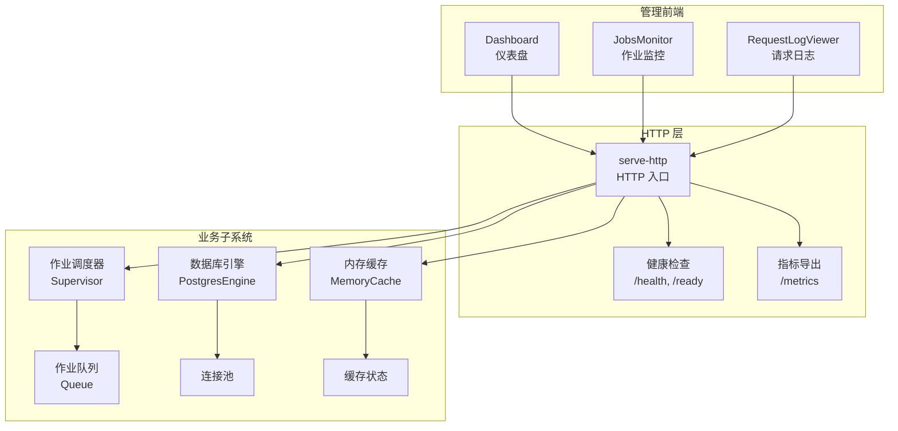
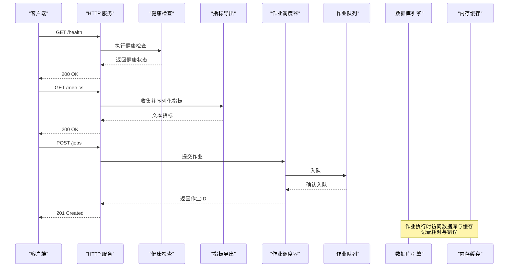
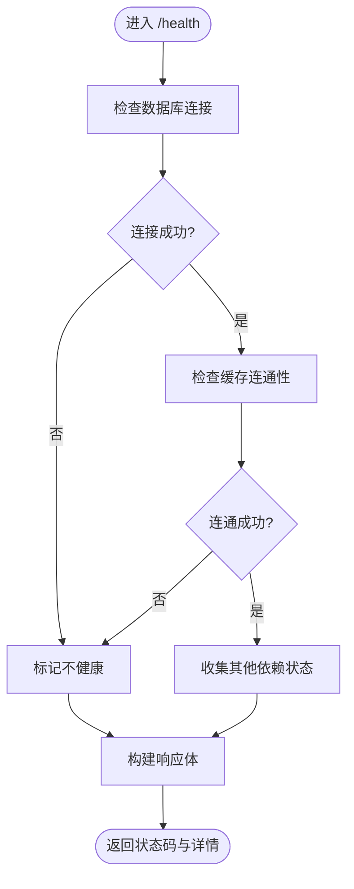
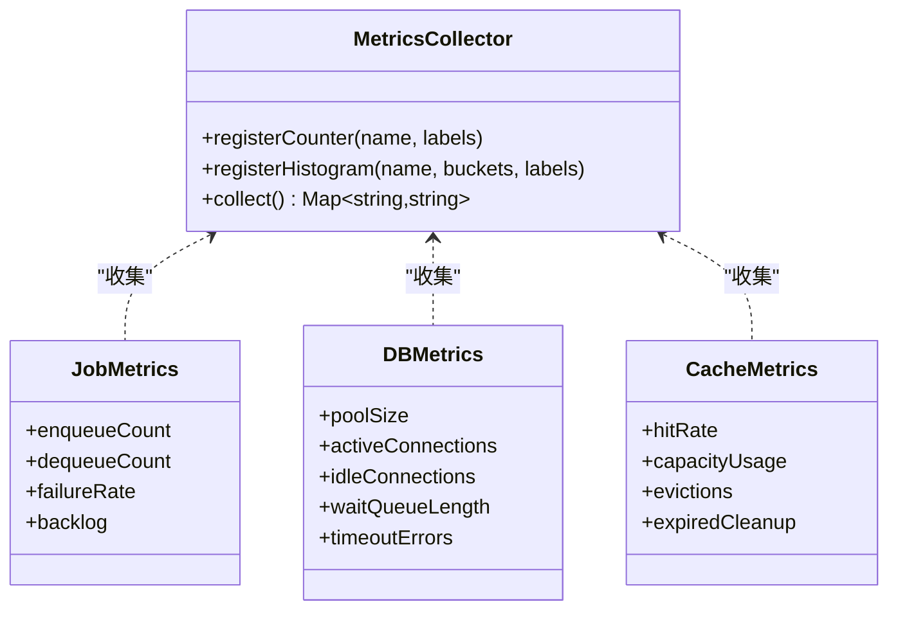

</think>

<docs>
# 监控与诊断

<cite>
**本文引用的文件**   
- [README.md](file://README.md)
- [gbrain.yml](file://gbrain.yml)
- [src/commands/serve-http.ts](file://src/commands/serve-http.ts)
- [src/core/health.ts](file://src/core/health.ts)
- [src/core/metrics.ts](file://src/core/metrics.ts)
- [src/core/logger.ts](file://src/core/logger.ts)
- [src/core/jobs/supervisor.ts](file://src/core/jobs/supervisor.ts)
- [src/core/jobs/queue.ts](file://src/core/jobs/queue.ts)
- [src/core/db/postgres-engine.ts](file://src/core/db/postgres-engine.ts)
- [src/core/cache/memory-cache.ts](file://src/core/cache/memory-cache.ts)
- [admin/src/components/Dashboard.tsx](file://admin/src/components/Dashboard.tsx)
- [admin/src/components/JobsMonitor.tsx](file://admin/src/components/JobsMonitor.tsx)
- [admin/src/components/RequestLogViewer.tsx](file://admin/src/components/RequestLogViewer.tsx)
- [scripts/generate-metric-glossary.ts](file://scripts/generate-metric-glossary.ts)
</cite>

## 目录
1. [简介](#简介)
2. [项目结构](#项目结构)
3. [核心组件](#核心组件)
4. [架构总览](#架构总览)
5. [详细组件分析](#详细组件分析)
6. [依赖关系分析](#依赖关系分析)
7. [性能考量](#性能考量)
8. [故障排查指南](#故障排查指南)
9. [结论](#结论)
10. [附录](#附录)

## 简介
本文件面向运维、SRE 与开发者，系统化说明 gBrain 的监控与诊断能力，包括：
- 实时仪表盘：系统概览、作业队列、请求日志与健康状态
- 作业监控：任务生命周期、失败重试、积压与吞吐
- 请求日志分析：结构化日志采集、过滤与检索
- 系统健康检查：进程、数据库、缓存、外部依赖
- 指标收集与告警：内置指标、自定义指标、告警规则与通知渠道
- 性能分析与调试：CPU/内存采样、慢查询定位、错误追踪
- 资源监控：进程、连接池、缓存命中率等关键视图
- 日志聚合与搜索：本地与远端聚合方案、索引与查询语法
- 自定义扩展：如何新增指标、告警与通知渠道

## 项目结构
监控与诊断相关代码主要分布在以下位置：
- HTTP 服务与健康检查：HTTP 命令入口、健康探针与指标导出
- 作业系统与队列：作业调度、执行与统计
- 数据库与缓存：连接池、缓存状态与容量
- 管理前端：仪表盘、作业监控、请求日志查看器
- 脚本与文档：指标字典生成、操作指南



图表来源
- [src/commands/serve-http.ts](file://src/commands/serve-http.ts)
- [src/core/health.ts](file://src/core/health.ts)
- [src/core/metrics.ts](file://src/core/metrics.ts)
- [src/core/jobs/supervisor.ts](file://src/core/jobs/supervisor.ts)
- [src/core/jobs/queue.ts](file://src/core/jobs/queue.ts)
- [src/core/db/postgres-engine.ts](file://src/core/db/postgres-engine.ts)
- [src/core/cache/memory-cache.ts](file://src/core/cache/memory-cache.ts)
- [admin/src/components/Dashboard.tsx](file://admin/src/components/Dashboard.tsx)
- [admin/src/components/JobsMonitor.tsx](file://admin/src/components/JobsMonitor.tsx)
- [admin/src/components/RequestLogViewer.tsx](file://admin/src/components/RequestLogViewer.tsx)

章节来源
- [README.md](file://README.md)
- [gbrain.yml](file://gbrain.yml)

## 核心组件
- 健康检查与就绪探针
  - 提供 /health 与 /ready 端点，用于负载均衡与健康探测
  - 可配置依赖项（数据库、缓存、外部服务）的可用性判定
- 指标导出
  - 暴露 /metrics 端点，输出 Prometheus 格式指标
  - 包含进程、作业、数据库、缓存、HTTP 请求等维度
- 作业监控
  - 作业调度器负责任务分发、重试、退避与限流
  - 队列提供入队、出队、延迟与失败计数
- 请求日志
  - 结构化日志记录请求上下文、耗时、状态码与错误堆栈
  - 支持按时间、级别、模块、traceId 过滤
- 数据库连接池
  - 连接数、活跃/空闲、等待队列长度、超时与错误率
- 缓存状态
  - 命中率、容量使用、淘汰策略与过期清理

章节来源
- [src/core/health.ts](file://src/core/health.ts)
- [src/core/metrics.ts](file://src/core/metrics.ts)
- [src/core/jobs/supervisor.ts](file://src/core/jobs/supervisor.ts)
- [src/core/jobs/queue.ts](file://src/core/jobs/queue.ts)
- [src/core/db/postgres-engine.ts](file://src/core/db/postgres-engine.ts)
- [src/core/cache/memory-cache.ts](file://src/core/cache/memory-cache.ts)
- [src/core/logger.ts](file://src/core/logger.ts)

## 架构总览
下图展示从客户端到后端各子系统的调用路径与监控点。



图表来源
- [src/commands/serve-http.ts](file://src/commands/serve-http.ts)
- [src/core/health.ts](file://src/core/health.ts)
- [src/core/metrics.ts](file://src/core/metrics.ts)
- [src/core/jobs/supervisor.ts](file://src/core/jobs/supervisor.ts)
- [src/core/jobs/queue.ts](file://src/core/jobs/queue.ts)
- [src/core/db/postgres-engine.ts](file://src/core/db/postgres-engine.ts)
- [src/core/cache/memory-cache.ts](file://src/core/cache/memory-cache.ts)

## 详细组件分析

### 健康检查与就绪探针
- 功能要点
  - /health：进程级健康，含依赖项（DB、缓存、外部服务）探测结果
  - /ready：应用就绪信号，用于滚动更新与流量切换
- 指标与日志
  - 每次探测记录耗时与错误原因
  - 失败时触发告警并写入结构化日志
- 配置项
  - 依赖项开关、超时阈值、重试次数
  - 自定义健康检查插件接口



图表来源
- [src/core/health.ts](file://src/core/health.ts)

章节来源
- [src/core/health.ts](file://src/core/health.ts)

### 指标导出与自定义指标
- 内置指标类别
  - 进程：CPU、内存、句柄、事件循环延迟
  - HTTP：请求速率、延迟分位、错误率、并发数
  - 作业：入队/出队速率、失败率、重试次数、积压量
  - 数据库：连接池大小、活跃/空闲、等待队列、超时与错误
  - 缓存：命中率、容量使用、淘汰计数、过期清理
- 自定义指标
  - 通过计数器、直方图、摘要类型扩展
  - 建议为每个指标添加标签（如模块、版本、环境）
- 导出方式
  - /metrics 端点输出 Prometheus 文本格式
  - 可通过中间件或钩子注入额外指标



图表来源
- [src/core/metrics.ts](file://src/core/metrics.ts)
- [src/core/jobs/queue.ts](file://src/core/jobs/queue.ts)
- [src/core/db/postgres-engine.ts](file://src/core/db/postgres-engine.ts)
- [src/core/cache/memory-cache.ts](file://src/core/cache/memory-cache.ts)

章节来源
- [src/core/metrics.ts](file://src/core/metrics.ts)
- [scripts/generate-metric-glossary.ts](file://scripts/generate-metric-glossary.ts)

### 作业监控与队列
- 作业生命周期
  - 入队 -> 调度 -> 执行 -> 完成/失败 -> 重试/归档
- 关键指标
  - 入队速率、出队速率、失败率、平均处理时长、P95/P99 延迟
  - 积压数量、重试次数、退避策略生效次数
- 告警建议
  - 积压超过阈值持续 N 分钟
  - 失败率超过阈值
  - 平均处理时长突增

```mermaid
sequenceDiagram
  participant Admin as "管理员/上游"
  participant HTTP as "HTTP 服务"
  participant Supervisor as "作业调度器"
  participant Queue as "作业队列"
  participant Worker as "工作进程"
  participant DB as "数据库"
  participant Cache as "缓存"

  Admin->>HTTP: 提交作业
  HTTP->>Supervisor: 创建作业
  Supervisor->>Queue: 入队
  Queue-->>Supervisor: 确认
  Supervisor->>Worker: 分配任务
  Worker->>DB: 读取数据
  Worker->>Cache: 读写缓存
  Worker-->>Supervisor: 上报结果
  Sup
</invoke>
</function>

<tool_call>
<function=search_codebase>
<parameter=query>
monitoring metrics health check dashboard jobs queue request log database connection pool cache status
</parameter>
<parameter=key_words>
monitoring,metrics,health
</parameter>
</function>
</tool_call>
<tool_call>
<function=search_file>
<parameter=query>
src/core/health.ts
</parameter>
</function>
</tool_call>
<tool_call>
<function=search_file>
<parameter=query>
src/core/metrics.ts
</parameter>
</function>
</tool_call>
<tool_call>
<function=search_file>
<parameter=query>
src/core/logger.ts
</parameter>
</function>
</tool_call>
<tool_call>
<function=search_file>
<parameter=query>
src/core/jobs/supervisor.ts
</parameter>
</function>
</tool_call>
<tool_call>
<function=search_file>
<parameter=query>
src/core/jobs/queue.ts
</parameter>
</function>
</tool_call>
<tool_call>
<function=search_file>
<parameter=query>
src/core/db/postgres-engine.ts
</parameter>
</function>
</tool_call>
<tool_call>
<function=search_file>
<parameter=query>
src/core/cache/memory-cache.ts
</parameter>
</function>
</tool_call>
<tool_call>
<function=search_file>
<parameter=query>
admin/src/components/Dashboard.tsx
</parameter>
</function>
</tool_call>
<tool_call>
<function=search_file>
<parameter=query>
admin/src/components/JobsMonitor.tsx
</parameter>
</function>
</tool_call>
<tool_call>
<function=search_file>
<parameter=query>
admin/src/components/RequestLogViewer.tsx
</parameter>
</function>
</tool_call>