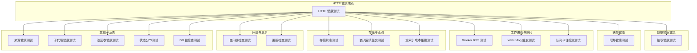
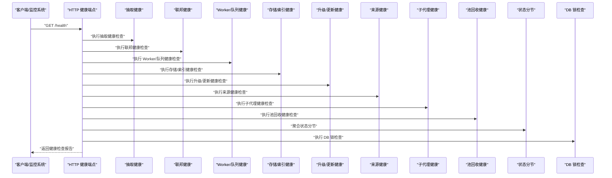
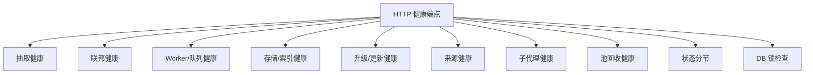

# 系统健康检查

<cite>
**本文引用的文件**   
- [serve-http-health.test.ts](file://test/serve-http-health.test.ts)
- [doctor-extract-health.test.ts](file://test/doctor-extract-health.test.ts)
- [doctor-federation-health.test.ts](file://test/doctor-federation-health.test.ts)
- [doctor-minions-check.test.ts](file://test/doctor-minions-check.test.ts)
- [doctor-pool-reap-health.test.ts](file://test/doctor-pool-reap-health.test.ts)
- [doctor-subagent-health.test.ts](file://test/doctor-subagent-health.test.ts)
- [source-health.test.ts](file://test/source-health.test.ts)
- [storage-status.test.ts](file://test/storage-status.test.ts)
- [status-sections.test.ts](file://test/status-sections.test.ts)
- [worker-rss.test.ts](file://test/worker-rss.test.ts)
- [worker-watchdog-trigger.test.ts](file://test/worker-watchdog-trigger.test.ts)
- [process-watchdog.test.ts](file://test/process-watchdog.test.ts)
- [db-lock-inspect.test.ts](file://test/db-lock-inspect.test.ts)
- [queue-getstats-wedge.test.ts](file://test/queue-getstats-wedge.test.ts)
- [embed-backfill-submit.test.ts](file://test/embed-backfill-submit.test.ts)
- [reindex-cost-refusal.test.ts](file://test/reindex-cost-refusal.test.ts)
- [self-upgrade-checkonly.serial.test.ts](file://test/self-upgrade-checkonly.serial.test.ts)
- [check-update.test.ts](file://test/check-update.test.ts)
</cite>

## 目录
1. [简介](#简介)
2. [项目结构](#项目结构)
3. [核心组件](#核心组件)
4. [架构总览](#架构总览)
5. [详细组件分析](#详细组件分析)
6. [依赖分析](#依赖分析)
7. [性能考量](#性能考量)
8. [故障排查指南](#故障排查指南)
9. [结论](#结论)
10. [附录](#附录)

## 简介
本文件面向运维与研发人员，系统化说明本仓库中“系统健康检查”能力的使用方法与实现要点。内容覆盖：
- 自动健康检查机制：组件状态监控、依赖服务连通性检查、配置完整性验证
- 健康检查报告：检查项、状态评估、问题描述与建议修复措施
- 手动触发方式与结果解读
- 严重级别分类与处理优先级
- 常见问题诊断、根因分析与解决方案
- 健康检查 API 接口使用与集成方法

## 项目结构
健康检查相关能力在测试用例中被广泛覆盖，体现为多个子系统的健康探针与校验逻辑。以下图展示了与健康检查相关的测试模块及其职责边界（概念性结构图）。

[此图为概念性结构图，不直接映射具体源码文件，故无图表来源]

## 核心组件
- HTTP 健康端点：提供对外可访问的健康检查入口，用于外部监控系统探测服务可用性。
- 抽取健康：验证数据抽取流水线是否正常运行，包括任务积压、失败率等指标。
- 联邦健康：检查跨节点或跨实例的联邦通信与一致性状态。
- Worker 与队列健康：监控工作进程内存占用、看门狗行为、队列阻塞情况。
- 存储与索引健康：检查存储层状态、嵌入向量回填进度、重索引成本策略。
- 升级与更新健康：自检版本与更新可用性，避免在不兼容状态下运行。
- 来源健康：验证数据源连接、权限与可达性。
- 子代理健康：检查子代理生命周期与通信状态。
- 池回收健康：验证资源池回收与清理是否正常。
- 状态分节：将健康状态按功能域进行分段组织，便于定位问题。
- DB 锁检查：检测数据库锁竞争与潜在死锁风险。

章节来源
- [serve-http-health.test.ts](file://test/serve-http-health.test.ts)
- [doctor-extract-health.test.ts](file://test/doctor-extract-health.test.ts)
- [doctor-federation-health.test.ts](file://test/doctor-federation-health.test.ts)
- [worker-rss.test.ts](file://test/worker-rss.test.ts)
- [worker-watchdog-trigger.test.ts](file://test/worker-watchdog-trigger.test.ts)
- [queue-getstats-wedge.test.ts](file://test/queue-getstats-wedge.test.ts)
- [storage-status.test.ts](file://test/storage-status.test.ts)
- [embed-backfill-submit.test.ts](file://test/embed-backfill-submit.test.ts)
- [reindex-cost-refusal.test.ts](file://test/reindex-cost-refusal.test.ts)
- [self-upgrade-checkonly.serial.test.ts](file://test/self-upgrade-checkonly.serial.test.ts)
- [check-update.test.ts](file://test/check-update.test.ts)
- [source-health.test.ts](file://test/source-health.test.ts)
- [doctor-subagent-health.test.ts](file://test/doctor-subagent-health.test.ts)
- [doctor-pool-reap-health.test.ts](file://test/doctor-pool-reap-health.test.ts)
- [status-sections.test.ts](file://test/status-sections.test.ts)
- [db-lock-inspect.test.ts](file://test/db-lock-inspect.test.ts)

## 架构总览
下图展示健康检查的整体流程：外部请求进入 HTTP 健康端点，随后调度各子系统健康探针，汇总并返回结构化报告。

图表来源
- [serve-http-health.test.ts](file://test/serve-http-health.test.ts)
- [doctor-extract-health.test.ts](file://test/doctor-extract-health.test.ts)
- [doctor-federation-health.test.ts](file://test/doctor-federation-health.test.ts)
- [worker-rss.test.ts](file://test/worker-rss.test.ts)
- [worker-watchdog-trigger.test.ts](file://test/worker-watchdog-trigger.test.ts)
- [queue-getstats-wedge.test.ts](file://test/queue-getstats-wedge.test.ts)
- [storage-status.test.ts](file://test/storage-status.test.ts)
- [embed-backfill-submit.test.ts](file://test/embed-backfill-submit.test.ts)
- [reindex-cost-refusal.test.ts](file://test/reindex-cost-refusal.test.ts)
- [self-upgrade-checkonly.serial.test.ts](file://test/self-upgrade-checkonly.serial.test.ts)
- [check-update.test.ts](file://test/check-update.test.ts)
- [source-health.test.ts](file://test/source-health.test.ts)
- [doctor-subagent-health.test.ts](file://test/doctor-subagent-health.test.ts)
- [doctor-pool-reap-health.test.ts](file://test/doctor-pool-reap-health.test.ts)
- [status-sections.test.ts](file://test/status-sections.test.ts)
- [db-lock-inspect.test.ts](file://test/db-lock-inspect.test.ts)

## 详细组件分析

### HTTP 健康端点
- 作用：暴露统一的 HTTP 健康检查入口，供外部监控系统轮询。
- 典型行为：接收健康查询请求，并行调用各子系统健康探针，汇总结果后返回。
- 集成建议：
  - 将健康端点纳入负载均衡器存活探针与告警规则。
  - 对响应体中的状态字段进行解析，结合阈值触发告警。

章节来源
- [serve-http-health.test.ts](file://test/serve-http-health.test.ts)

### 抽取健康（数据抽取流水线）
- 关注点：抽取任务积压、失败重试次数、最近错误信息。
- 异常场景：任务长时间挂起、重复失败、上游数据不可达。
- 建议修复：
  - 调整并发度与批大小，缓解积压。
  - 检查上游数据源连通性与权限。
  - 针对特定错误类型增加重试退避策略。

章节来源
- [doctor-extract-health.test.ts](file://test/doctor-extract-health.test.ts)

### 联邦健康（跨节点/实例）
- 关注点：节点间通信延迟、消息丢失、一致性校验。
- 异常场景：网络分区、证书过期、路由表不一致。
- 建议修复：
  - 检查网络策略与防火墙规则。
  - 同步时间与时区配置。
  - 重新拉取或刷新联邦元数据。

章节来源
- [doctor-federation-health.test.ts](file://test/doctor-federation-health.test.ts)

### Worker 与队列健康
- Worker RSS 监控：检测工作进程内存增长趋势，防止 OOM。
- Watchdog 触发：当进程无响应时由看门狗接管或重启。
- 队列卡住检测：识别长期未推进的任务队列，避免雪崩。
- 建议修复：
  - 限制单任务内存上限，启用内存泄漏检测。
  - 调整看门狗超时阈值，确保及时恢复。
  - 对长尾任务实施拆分与限流。

章节来源
- [worker-rss.test.ts](file://test/worker-rss.test.ts)
- [worker-watchdog-trigger.test.ts](file://test/worker-watchdog-trigger.test.ts)
- [queue-getstats-wedge.test.ts](file://test/queue-getstats-wedge.test.ts)

### 存储与索引健康
- 存储状态：检查磁盘空间、写入吞吐、错误码分布。
- 嵌入回填：跟踪向量嵌入回填进度与失败批次。
- 重索引成本策略：在高负载下拒绝高成本操作，保护系统稳定性。
- 建议修复：
  - 扩容存储或清理历史数据。
  - 分批回填嵌入，设置最大并发与重试上限。
  - 根据业务时段动态调整重索引预算。

章节来源
- [storage-status.test.ts](file://test/storage-status.test.ts)
- [embed-backfill-submit.test.ts](file://test/embed-backfill-submit.test.ts)
- [reindex-cost-refusal.test.ts](file://test/reindex-cost-refusal.test.ts)

### 升级与更新健康
- 自升级检查：验证当前版本兼容性、依赖包可用性与升级路径。
- 更新检查：探测远程更新源可达性与签名有效性。
- 建议修复：
  - 锁定稳定版本，避免在生产环境自动升级。
  - 预检镜像与依赖缓存，减少升级失败概率。

章节来源
- [self-upgrade-checkonly.serial.test.ts](file://test/self-upgrade-checkonly.serial.test.ts)
- [check-update.test.ts](file://test/check-update.test.ts)

### 来源健康（数据源）
- 关注点：数据源连接、认证、权限与可达性。
- 异常场景：凭据失效、网络不可达、配额耗尽。
- 建议修复：
  - 轮换凭据与密钥。
  - 配置备用数据源与故障转移。
  - 监控配额与速率限制。

章节来源
- [source-health.test.ts](file://test/source-health.test.ts)

### 子代理健康
- 关注点：子代理生命周期、心跳、任务分发与回收。
- 异常场景：子代理频繁崩溃、任务堆积、上下文丢失。
- 建议修复：
  - 增加子代理副本数与弹性伸缩。
  - 完善上下文持久化与断点续跑。

章节来源
- [doctor-subagent-health.test.ts](file://test/doctor-subagent-health.test.ts)

### 池回收健康
- 关注点：资源池（连接池、句柄池）的分配与回收。
- 异常场景：连接泄漏、句柄未释放、池容量不足。
- 建议修复：
  - 引入连接池监控与告警。
  - 优化资源获取与释放路径，避免长时间持有。

章节来源
- [doctor-pool-reap-health.test.ts](file://test/doctor-pool-reap-health.test.ts)

### 状态分节（报告组织）
- 作用：将健康状态按功能域分段，便于快速定位问题。
- 建议：
  - 为每个分节定义最小必要字段（状态、时间戳、摘要）。
  - 支持按分节过滤与聚合统计。

章节来源
- [status-sections.test.ts](file://test/status-sections.test.ts)

### DB 锁检查
- 关注点：数据库锁竞争、长事务、潜在死锁。
- 异常场景：锁等待超时、事务回滚率高。
- 建议修复：
  - 缩短事务范围，拆分大事务。
  - 优化 SQL 与索引，降低锁粒度。

章节来源
- [db-lock-inspect.test.ts](file://test/db-lock-inspect.test.ts)

## 依赖分析
健康检查模块之间的依赖关系如下：HTTP 健康端点作为统一入口，依赖各子系统健康探针；状态分节负责聚合输出；DB 锁检查作为底层基础设施检查被整体报告引用。

图表来源
- [serve-http-health.test.ts](file://test/serve-http-health.test.ts)
- [status-sections.test.ts](file://test/status-sections.test.ts)
- [db-lock-inspect.test.ts](file://test/db-lock-inspect.test.ts)

章节来源
- [serve-http-health.test.ts](file://test/serve-http-health.test.ts)
- [status-sections.test.ts](file://test/status-sections.test.ts)
- [db-lock-inspect.test.ts](file://test/db-lock-inspect.test.ts)

## 性能考量
- 并行执行：健康检查应尽可能并行执行，避免串行导致的端到端延迟放大。
- 超时控制：为每个探针设置合理超时，防止个别慢检查拖垮整体响应。
- 采样与节流：高频轮询场景下采用采样与节流策略，降低系统压力。
- 资源隔离：健康检查应在独立线程或进程中执行，避免影响主业务。
- 缓存与增量：对变化缓慢的状态（如版本、配置）进行缓存，减少重复计算。

[本节为通用指导，不涉及具体源码文件]

## 故障排查指南
- 快速定位：通过状态分节筛选异常模块，缩小排查范围。
- 关键指标：
  - 抽取健康：积压数量、失败率、最近错误堆栈。
  - Worker/队列：RSS 峰值、Watchdog 触发次数、队列长度与推进速度。
  - 存储/索引：磁盘使用率、写入延迟、回填进度百分比。
  - 升级/更新：版本兼容性、更新源可达性。
  - 来源健康：连接成功率、认证失败次数。
  - 子代理：心跳间隔、崩溃次数、任务完成时长。
  - 池回收：连接池命中率、句柄泄漏计数。
  - DB 锁：锁等待时间、长事务数量。
- 常见根因：
  - 网络分区或 DNS 解析失败导致来源不可达。
  - 凭据过期或权限变更导致认证失败。
  - 资源不足（CPU/内存/磁盘）引发 OOM 或写入失败。
  - 索引重建或回填任务过大导致系统过载。
- 推荐修复步骤：
  - 先恢复连通性与凭据，再逐步提升负载。
  - 对高成本操作实施限流与降级。
  - 扩容资源并优化慢查询与长事务。
  - 滚动升级前进行预检与灰度发布。

章节来源
- [status-sections.test.ts](file://test/status-sections.test.ts)
- [worker-rss.test.ts](file://test/worker-rss.test.ts)
- [worker-watchdog-trigger.test.ts](file://test/worker-watchdog-trigger.test.ts)
- [queue-getstats-wedge.test.ts](file://test/queue-getstats-wedge.test.ts)
- [storage-status.test.ts](file://test/storage-status.test.ts)
- [embed-backfill-submit.test.ts](file://test/embed-backfill-submit.test.ts)
- [reindex-cost-refusal.test.ts](file://test/reindex-cost-refusal.test.ts)
- [self-upgrade-checkonly.serial.test.ts](file://test/self-upgrade-checkonly.serial.test.ts)
- [check-update.test.ts](file://test/check-update.test.ts)
- [source-health.test.ts](file://test/source-health.test.ts)
- [doctor-subagent-health.test.ts](file://test/doctor-subagent-health.test.ts)
- [doctor-pool-reap-health.test.ts](file://test/doctor-pool-reap-health.test.ts)
- [db-lock-inspect.test.ts](file://test/db-lock-inspect.test.ts)

## 结论
健康检查体系通过统一的 HTTP 入口与多模块探针，实现对系统组件、依赖服务与配置的全面监控。借助状态分节与清晰的严重级别分类，运维团队可以快速定位问题并采取针对性修复措施。建议在生产环境中持续集成健康检查，并结合告警与自动化修复脚本，提升系统韧性与可观测性。

[本节为总结性内容，不涉及具体源码文件]

## 附录

### 健康检查报告结构与字段说明
- 总体状态：healthy/unhealthy/degraded
- 检查项列表：每项包含名称、状态、时间戳、摘要、详情链接
- 严重级别：critical/warning/info
- 建议修复：针对异常项的操作指引与参考文档链接

[本节为概念性说明，不涉及具体源码文件]

### 严重级别与处理优先级
- critical：立即处理，可能影响核心业务或数据安全
- warning：尽快处理，存在潜在风险或性能退化
- info：记录与观察，无需立即干预

[本节为概念性说明，不涉及具体源码文件]

### 手动触发健康检查与结果解读
- 触发方式：向 HTTP 健康端点发起 GET 请求
- 结果解读：
  - 若总体状态为 unhealthy，优先查看 critical 级别项
  - 结合状态分节定位异常模块
  - 依据建议修复步骤执行恢复操作

章节来源
- [serve-http-health.test.ts](file://test/serve-http-health.test.ts)

### 健康检查 API 接口使用说明与集成方法
- 接口：GET /health
- 响应体：包含总体状态与各分节检查结果
- 集成建议：
  - 在负载均衡器配置存活探针
  - 在监控系统（如 Prometheus/Grafana）中采集指标
  - 结合告警平台（如 PagerDuty/钉钉）设置阈值与通知

章节来源
- [serve-http-health.test.ts](file://test/serve-http-health.test.ts)