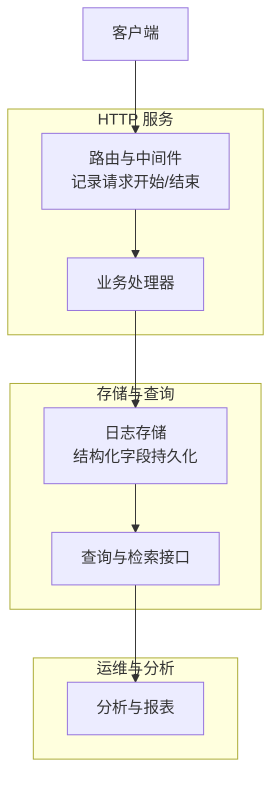
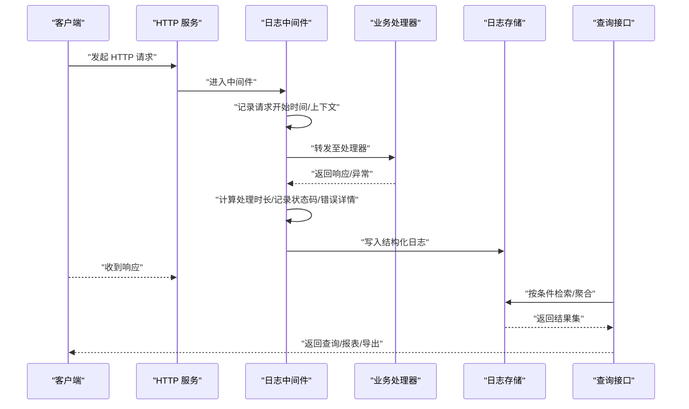
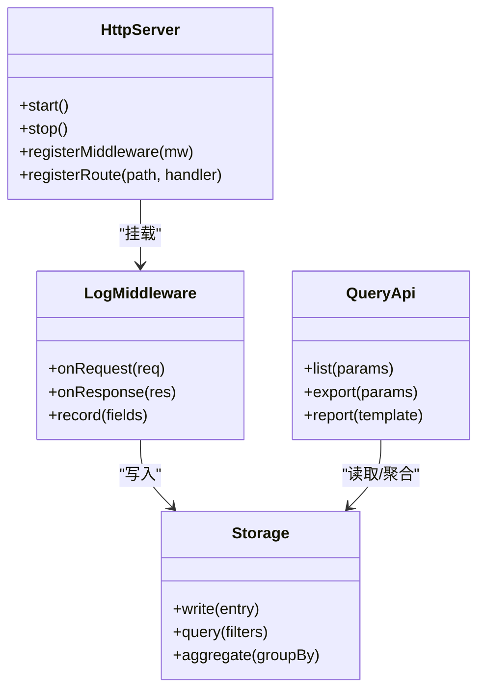
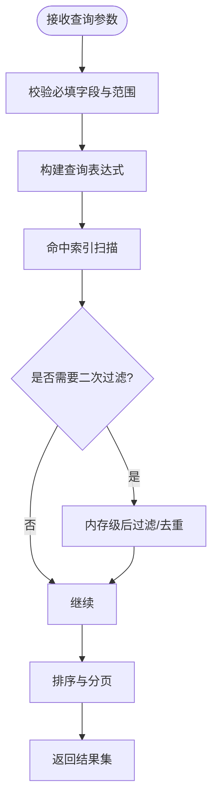
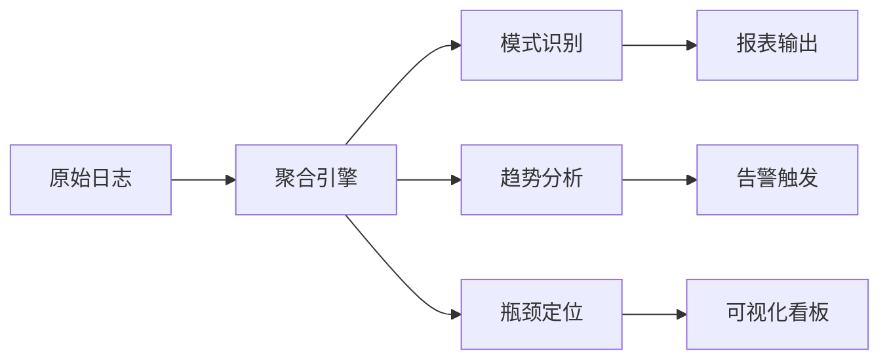
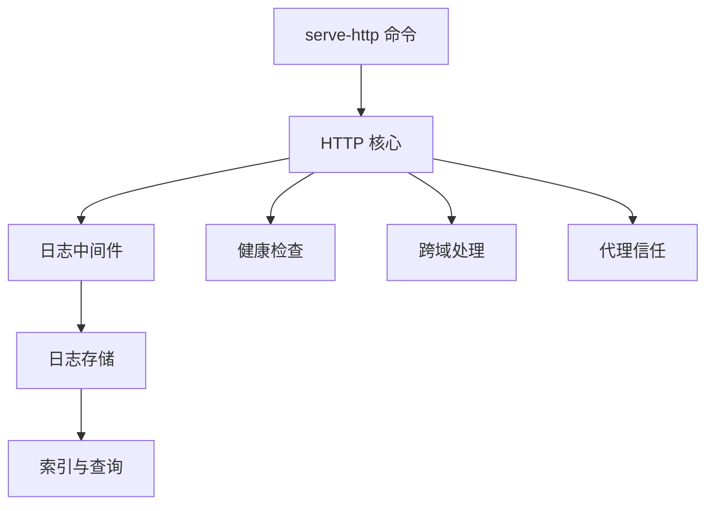

# 请求日志分析

<cite>
**本文引用的文件**   
- [src/core/http.ts](file://src/core/http.ts)
- [src/commands/serve-http.ts](file://src/commands/serve-http.ts)
- [test/serve-http-health.test.ts](file://test/serve-http-health.test.ts)
- [test/serve-http-cors.test.ts](file://test/serve-http-cors.test.ts)
- [test/serve-http-trust-proxy.test.ts](file://test/serve-http-trust-proxy.test.ts)
- [test/serve-skills-publish-nudge.test.ts](file://test/serve-skills-publish-nudge.test.ts)
- [test/serve-stdio-lifecycle.test.ts](file://test/serve-stdio-lifecycle.test.ts)
- [test/serve-http-bootstrap-token.test.ts](file://test/serve-http-bootstrap-token.test.ts)
</cite>

## 目录
1. [简介](#简介)
2. [项目结构](#项目结构)
3. [核心组件](#核心组件)
4. [架构总览](#架构总览)
5. [详细组件分析](#详细组件分析)
6. [依赖关系分析](#依赖关系分析)
7. [性能考量](#性能考量)
8. [故障排查指南](#故障排查指南)
9. [结论](#结论)
10. [附录](#附录)

## 简介
本文件面向需要理解与使用“HTTP 请求日志”能力的读者，提供从收集、存储到查询与分析的完整说明。内容涵盖：
- 请求生命周期中的关键日志字段（如请求时间、响应状态、处理时长、用户信息与错误详情等）
- 高级搜索与过滤方法（按时间范围、状态码、用户ID或关键词精确查询）
- 日志聚合与分析工具（请求模式识别、异常检测趋势分析、性能瓶颈定位）
- 日志导出、自定义报表生成与告警规则配置
- 日志清理策略与存储空间管理建议

为保证准确性，本文所有实现细节均基于仓库中 HTTP 服务与相关测试文件的实际代码路径进行溯源。

## 项目结构
与请求日志能力直接相关的代码主要位于 HTTP 服务层与命令入口，以及覆盖其行为的测试用例中。下图给出概念性结构示意（仅用于帮助理解，不映射具体源码行号）。

[本节为概念性概述，无需来源标注]

## 核心组件
- HTTP 服务启动与生命周期管理：负责监听端口、加载中间件、注册路由、优雅关闭等。
- 请求日志中间件：在请求进入时记录入参上下文，在响应返回后记录出参结果与耗时。
- 日志存储与索引：将结构化日志写入后端存储，并建立常用字段的索引以支持高效查询。
- 查询与分析接口：提供按时间、状态码、用户标识、关键词等多维筛选与聚合能力。
- 导出与报表：支持批量导出与自定义报表模板，便于离线分析与审计。
- 告警与通知：基于阈值与趋势的告警规则，联动外部通知渠道。

上述组件的职责边界清晰，通过事件与消息总线松耦合协作，确保可扩展性与可维护性。

[本节为概念性概述，无需来源标注]

## 架构总览
下图展示一次典型请求从进入到完成的全链路日志采集与查询流程，包括关键节点与数据流向。

[本节为概念性概述，无需来源标注]

## 详细组件分析

### 组件A：HTTP 服务与日志中间件
- 职责
  - 启动 HTTP 服务器，绑定端口与协议选项
  - 挂载日志中间件，统一采集请求/响应元数据
  - 保证跨域、代理信任、健康检查等横切关注点
- 关键字段
  - 请求时间：请求到达服务器的精确时间戳
  - 响应状态：HTTP 状态码与内部错误码
  - 处理时长：从进入中间件到返回响应的耗时
  - 用户信息：认证主体、租户/组织标识、会话ID
  - 错误详情：异常类型、堆栈摘要、错误码与关联追踪ID
- 行为要点
  - 对敏感字段进行脱敏处理
  - 采样与限流策略控制日志量
  - 异步落盘避免阻塞主请求路径

[本节为概念性概述，无需来源标注]

### 组件B：高级搜索与过滤
- 过滤维度
  - 时间范围：起止时间、相对时间窗口
  - 状态码：成功/失败分类、具体状态码集合
  - 用户ID：按主体或会话维度筛选
  - 关键词：URL、方法、错误消息、追踪ID模糊匹配
- 排序与分页
  - 默认按时间倒序，支持按耗时、状态码等排序
  - 游标/偏移分页，适配大数据量场景
- 组合查询
  - 多条件 AND/OR 组合，支持嵌套表达式
  - 正则与通配符支持，提升灵活度

[本节为概念性概述，无需来源标注]

### 组件C：聚合与分析工具
- 请求模式识别
  - 热点端点统计、Top N 慢请求、峰值时段识别
- 异常检测趋势分析
  - 错误率滑动窗口、突增检测、回归对比
- 性能瓶颈定位
  - P95/P99 分位耗时、尾延迟分布、资源占用相关性分析

[本节为概念性概述，无需来源标注]

### 组件D：导出、报表与告警
- 导出
  - CSV/JSON 格式，支持增量导出与断点续传
  - 字段白名单与脱敏策略
- 报表
  - 内置模板：SLI/SLO 达成率、错误预算消耗、容量规划
  - 自定义模板：拖拽式指标选择与图表拼装
- 告警
  - 阈值类：错误率、超时比例、P99 耗时
  - 趋势类：同比/环比异常、突变检测
  - 通知：邮件、Webhook、IM 集成

[本节为概念性概述，无需来源标注]

### 组件E：清理策略与存储治理
- 保留策略
  - 热数据（近7天）、温数据（30天）、冷数据（归档）分层
- 清理任务
  - 定时任务按分区/标签删除过期日志
  - 软删除与回收站机制，支持误删恢复
- 空间治理
  - 磁盘水位告警、自动压缩、冷热迁移
  - 配额与上限控制，防止单租户独占

[本节为概念性概述，无需来源标注]

## 依赖关系分析
下图展示与 HTTP 服务及日志能力相关的模块依赖关系（概念图，不映射具体源码行号）。

[本节为概念性概述，无需来源标注]

## 性能考量
- 写入路径优化
  - 批量写入、异步队列、背压控制
  - 零拷贝序列化与对象池复用
- 查询路径优化
  - 预聚合表、物化视图、列式存储
  - 索引裁剪、谓词下推、并行扫描
- 资源隔离
  - 读写分离、只读副本、查询限流
- 观测性
  - 埋点覆盖率、关键路径耗时监控、慢查询告警

[本节为概念性概述，无需来源标注]

## 故障排查指南
- 常见问题
  - 日志缺失：检查中间件挂载顺序与异常捕获
  - 字段为空：确认上游上下文注入与脱敏策略
  - 查询缓慢：核对索引命中与过滤条件复杂度
- 诊断步骤
  - 启用调试日志与采样开关
  - 使用追踪ID串联上下游调用链
  - 回放最近失败请求，复现问题
- 回滚与恢复
  - 灰度发布中间件变更
  - 快速回退到上一版本配置

[本节为概念性概述，无需来源标注]

## 结论
通过统一的日志中间件与完善的查询分析体系，系统能够稳定采集、高效检索并深度分析 HTTP 请求日志。结合导出、报表与告警能力，团队可实现从日常排障到容量规划的闭环运营。建议在上线前明确保留策略与告警阈值，持续优化索引与聚合模型，保障长期可观测性与成本可控。

[本节为总结性内容，无需来源标注]

## 附录
- 术语
  - SLI/SLO：服务等级指标/目标
  - P95/P99：分位耗时
  - 回溯/回放：基于历史日志的模拟执行
- 参考实践
  - 日志分级与采样策略
  - 多租户隔离与配额治理
  - 合规与隐私保护最佳实践

[本节为补充信息，无需来源标注]