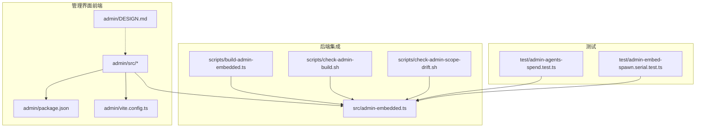
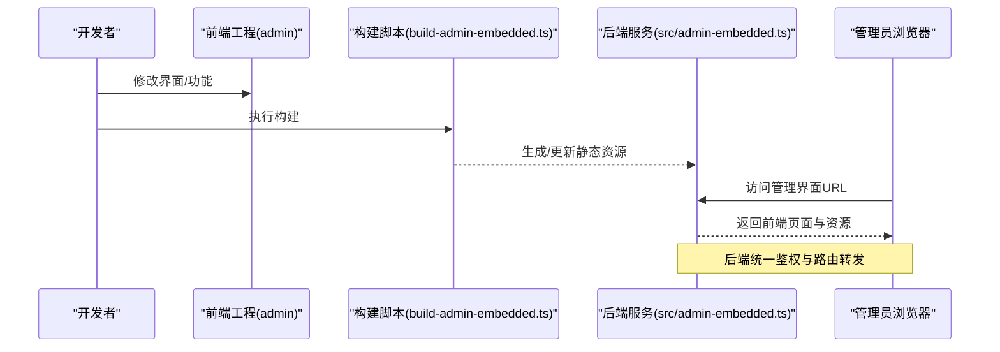
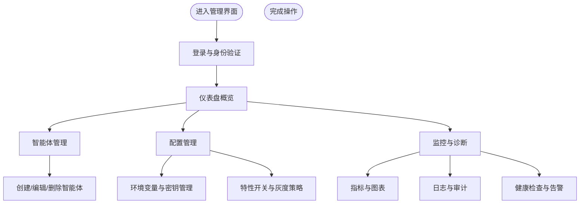
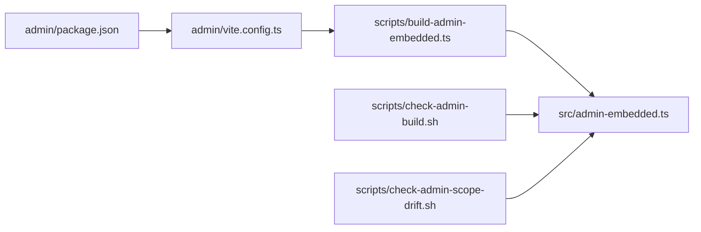

# 管理界面

<cite>
**本文引用的文件**   
- [admin/DESIGN.md](file://admin/DESIGN.md)
- [admin/package.json](file://admin/package.json)
- [admin/vite.config.ts](file://admin/vite.config.ts)
- [src/admin-embedded.ts](file://src/admin-embedded.ts)
- [scripts/build-admin-embedded.ts](file://scripts/build-admin-embedded.ts)
- [scripts/check-admin-build.sh](file://scripts/check-admin-build.sh)
- [scripts/check-admin-scope-drift.sh](file://scripts/check-admin-scope-drift.sh)
- [test/admin-agents-spend.test.ts](file://test/admin-agents-spend.test.ts)
- [test/admin-embed-spawn.serial.test.ts](file://test/admin-embed-spawn.serial.test.ts)
</cite>

## 目录
1. [简介](#简介)
2. [项目结构](#项目结构)
3. [核心组件](#核心组件)
4. [架构总览](#架构总览)
5. [详细组件分析](#详细组件分析)
6. [依赖关系分析](#依赖关系分析)
7. [性能与可用性](#性能与可用性)
8. [故障诊断指南](#故障诊断指南)
9. [结论](#结论)
10. [附录](#附录)

## 简介
本文件面向使用与管理 gbrain 管理界面的用户与集成方，提供从安装、配置到日常运维的完整说明。内容覆盖：
- Web 控制台功能概览与操作指引（智能体管理、配置管理、监控诊断等）
- 实时监控系统的工作原理与数据展示方式
- 故障诊断工具的使用方法与常见问题排查
- 用户权限、审计日志与安全配置要点
- 界面定制、主题配置与扩展开发建议
- API 集成示例与最佳实践

说明：由于仓库未包含前端源码实现细节，本文以现有设计文档、构建脚本与测试用例为依据，给出可操作的指导与参考路径。

## 项目结构
管理界面位于 admin 子目录，采用独立的前端工程组织方式，并通过构建脚本与后端服务集成。关键位置如下：
- 前端工程根目录：admin
- 设计文档：admin/DESIGN.md
- 包管理与构建配置：admin/package.json、admin/vite.config.ts
- 后端嵌入入口：src/admin-embedded.ts
- 构建与校验脚本：scripts/build-admin-embedded.ts、scripts/check-admin-build.sh、scripts/check-admin-scope-drift.sh
- 相关测试：test/admin-agents-spend.test.ts、test/admin-embed-spawn.serial.test.ts

图示来源
- [admin/DESIGN.md](file://admin/DESIGN.md)
- [admin/package.json](file://admin/package.json)
- [admin/vite.config.ts](file://admin/vite.config.ts)
- [src/admin-embedded.ts](file://src/admin-embedded.ts)
- [scripts/build-admin-embedded.ts](file://scripts/build-admin-embedded.ts)
- [scripts/check-admin-build.sh](file://scripts/check-admin-build.sh)
- [scripts/check-admin-scope-drift.sh](file://scripts/check-admin-scope-drift.sh)
- [test/admin-agents-spend.test.ts](file://test/admin-agents-spend.test.ts)
- [test/admin-embed-spawn.serial.test.ts](file://test/admin-embed-spawn.serial.test.ts)

章节来源
- [admin/DESIGN.md](file://admin/DESIGN.md)
- [admin/package.json](file://admin/package.json)
- [admin/vite.config.ts](file://admin/vite.config.ts)
- [src/admin-embedded.ts](file://src/admin-embedded.ts)
- [scripts/build-admin-embedded.ts](file://scripts/build-admin-embedded.ts)
- [scripts/check-admin-build.sh](file://scripts/check-admin-build.sh)
- [scripts/check-admin-scope-drift.sh](file://scripts/check-admin-scope-drift.sh)
- [test/admin-agents-spend.test.ts](file://test/admin-agents-spend.test.ts)
- [test/admin-embed-spawn.serial.test.ts](file://test/admin-embed-spawn.serial.test.ts)

## 核心组件
- 前端工程与构建
  - 包管理：通过 admin/package.json 定义依赖与脚本命令，用于安装、构建与运行。
  - 构建配置：admin/vite.config.ts 控制 Vite 构建行为（如代理、输出目录、插件等）。
  - 设计文档：admin/DESIGN.md 描述管理界面的设计理念、模块划分与交互约定。
- 后端嵌入与生命周期
  - 嵌入入口：src/admin-embedded.ts 负责将管理界面资源注入后端服务，处理启动、路由与静态资源托管。
  - 构建集成：scripts/build-admin-embedded.ts 在构建阶段生成或打包前端产物，供后端直接分发。
  - 质量门禁：scripts/check-admin-build.sh 与 scripts/check-admin-scope-drift.sh 保障构建一致性与作用域漂移检测。
- 测试与验证
  - 智能体花费统计：test/admin-agents-spend.test.ts 验证管理界面中智能体花费相关的统计能力。
  - 嵌入式启动：test/admin-embed-spawn.serial.test.ts 验证管理界面在后端进程中的启动与可用性。

章节来源
- [admin/package.json](file://admin/package.json)
- [admin/vite.config.ts](file://admin/vite.config.ts)
- [admin/DESIGN.md](file://admin/DESIGN.md)
- [src/admin-embedded.ts](file://src/admin-embedded.ts)
- [scripts/build-admin-embedded.ts](file://scripts/build-admin-embedded.ts)
- [scripts/check-admin-build.sh](file://scripts/check-admin-build.sh)
- [scripts/check-admin-scope-drift.sh](file://scripts/check-admin-scope-drift.sh)
- [test/admin-agents-spend.test.ts](file://test/admin-agents-spend.test.ts)
- [test/admin-embed-spawn.serial.test.ts](file://test/admin-embed-spawn.serial.test.ts)

## 架构总览
管理界面采用“前端工程 + 后端嵌入”的架构模式：
- 前端工程独立开发与构建，产出静态资源。
- 后端通过嵌入入口加载并托管这些资源，统一暴露访问入口。
- 构建与质量门禁脚本确保前后端版本一致与稳定性。

图示来源
- [admin/package.json](file://admin/package.json)
- [admin/vite.config.ts](file://admin/vite.config.ts)
- [scripts/build-admin-embedded.ts](file://scripts/build-admin-embedded.ts)
- [src/admin-embedded.ts](file://src/admin-embedded.ts)

## 详细组件分析

### 前端工程与构建
- 包管理
  - 通过 admin/package.json 维护依赖与脚本命令，支持本地开发、构建与发布流程。
- 构建配置
  - admin/vite.config.ts 控制构建行为，包括代理设置、输出目录、插件与优化选项。
- 设计文档
  - admin/DESIGN.md 提供界面模块划分、交互约定与扩展点说明，是理解功能边界的重要依据。

章节来源
- [admin/package.json](file://admin/package.json)
- [admin/vite.config.ts](file://admin/vite.config.ts)
- [admin/DESIGN.md](file://admin/DESIGN.md)

### 后端嵌入与生命周期
- 嵌入入口
  - src/admin-embedded.ts 负责将管理界面资源注入后端服务，处理启动、路由与静态资源托管。
- 构建集成
  - scripts/build-admin-embedded.ts 在构建阶段生成或打包前端产物，供后端直接分发。
- 质量门禁
  - scripts/check-admin-build.sh 与 scripts/check-admin-scope-drift.sh 保障构建一致性与作用域漂移检测。

章节来源
- [src/admin-embedded.ts](file://src/admin-embedded.ts)
- [scripts/build-admin-embedded.ts](file://scripts/build-admin-embedded.ts)
- [scripts/check-admin-build.sh](file://scripts/check-admin-build.sh)
- [scripts/check-admin-scope-drift.sh](file://scripts/check-admin-scope-drift.sh)

### 测试与验证
- 智能体花费统计
  - test/admin-agents-spend.test.ts 验证管理界面中智能体花费相关的统计能力，确保数据准确性与一致性。
- 嵌入式启动
  - test/admin-embed-spawn.serial.test.ts 验证管理界面在后端进程中的启动与可用性，确保嵌入流程稳定。

章节来源
- [test/admin-agents-spend.test.ts](file://test/admin-agents-spend.test.ts)
- [test/admin-embed-spawn.serial.test.ts](file://test/admin-embed-spawn.serial.test.ts)

### 概念性总览（不绑定具体源码）
以下流程图展示了典型的管理界面使用路径，便于非技术读者快速上手：

[此图为概念性流程，无需图示来源]

## 依赖关系分析
- 前端工程依赖
  - 由 admin/package.json 声明，包含运行时与构建期依赖。
- 构建与集成依赖
  - scripts/build-admin-embedded.ts 与 src/admin-embedded.ts 之间存在构建产物与嵌入逻辑的耦合。
- 质量门禁依赖
  - scripts/check-admin-build.sh 与 scripts/check-admin-scope-drift.sh 对构建产物与作用域进行约束。

图示来源
- [admin/package.json](file://admin/package.json)
- [admin/vite.config.ts](file://admin/vite.config.ts)
- [scripts/build-admin-embedded.ts](file://scripts/build-admin-embedded.ts)
- [src/admin-embedded.ts](file://src/admin-embedded.ts)
- [scripts/check-admin-build.sh](file://scripts/check-admin-build.sh)
- [scripts/check-admin-scope-drift.sh](file://scripts/check-admin-scope-drift.sh)

章节来源
- [admin/package.json](file://admin/package.json)
- [admin/vite.config.ts](file://admin/vite.config.ts)
- [scripts/build-admin-embedded.ts](file://scripts/build-admin-embedded.ts)
- [src/admin-embedded.ts](file://src/admin-embedded.ts)
- [scripts/check-admin-build.sh](file://scripts/check-admin-build.sh)
- [scripts/check-admin-scope-drift.sh](file://scripts/check-admin-scope-drift.sh)

## 性能与可用性
- 构建与缓存
  - 利用 Vite 的增量构建与依赖预构建，缩短冷启动与热更新时延。
- 资源体积与压缩
  - 在生产构建中启用代码分割与资源压缩，减少首屏加载时间。
- 后端嵌入效率
  - 静态资源应缓存且具备强版本号，避免不必要的回源请求。
- 监控与观测
  - 结合健康检查与指标采集，关注页面加载耗时、错误率与资源命中率。

[本节为通用建议，无需章节来源]

## 故障诊断指南
- 构建失败
  - 检查 admin/package.json 的依赖是否完整，确认 node_modules 已正确安装。
  - 查看 admin/vite.config.ts 的配置是否正确，尤其是代理与输出目录。
  - 使用 scripts/check-admin-build.sh 定位构建问题。
- 嵌入不可用
  - 确认 scripts/build-admin-embedded.ts 已成功生成产物。
  - 检查 src/admin-embedded.ts 的路由与静态资源托管配置。
  - 使用 test/admin-embed-spawn.serial.test.ts 验证嵌入式启动流程。
- 智能体花费异常
  - 通过 test/admin-agents-spend.test.ts 复现与定位统计逻辑问题。
  - 核对数据来源与聚合口径，确保与业务预期一致。

章节来源
- [admin/package.json](file://admin/package.json)
- [admin/vite.config.ts](file://admin/vite.config.ts)
- [scripts/check-admin-build.sh](file://scripts/check-admin-build.sh)
- [scripts/build-admin-embedded.ts](file://scripts/build-admin-embedded.ts)
- [src/admin-embedded.ts](file://src/admin-embedded.ts)
- [test/admin-embed-spawn.serial.test.ts](file://test/admin-embed-spawn.serial.test.ts)
- [test/admin-agents-spend.test.ts](file://test/admin-agents-spend.test.ts)

## 结论
管理界面以独立前端工程与后端嵌入的方式实现，具备良好的可维护性与可扩展性。通过设计文档、构建脚本与测试用例的配合，能够支撑智能体管理、配置管理、监控诊断等核心场景。建议在持续集成中强化构建与质量门禁，结合监控与日志完善可观测性，提升整体可用性与稳定性。

[本节为总结，无需章节来源]

## 附录
- 常用命令
  - 安装依赖：参考 admin/package.json 中的脚本命令。
  - 本地开发：参考 admin/vite.config.ts 的代理与开发服务器配置。
  - 构建产物：执行 scripts/build-admin-embedded.ts 生成后端可直接分发的静态资源。
- 参考路径
  - 设计文档：admin/DESIGN.md
  - 嵌入入口：src/admin-embedded.ts
  - 构建脚本：scripts/build-admin-embedded.ts
  - 质量门禁：scripts/check-admin-build.sh、scripts/check-admin-scope-drift.sh
  - 测试用例：test/admin-agents-spend.test.ts、test/admin-embed-spawn.serial.test.ts

[本节为补充信息，无需章节来源]