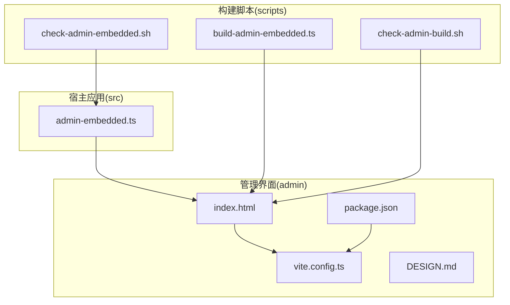
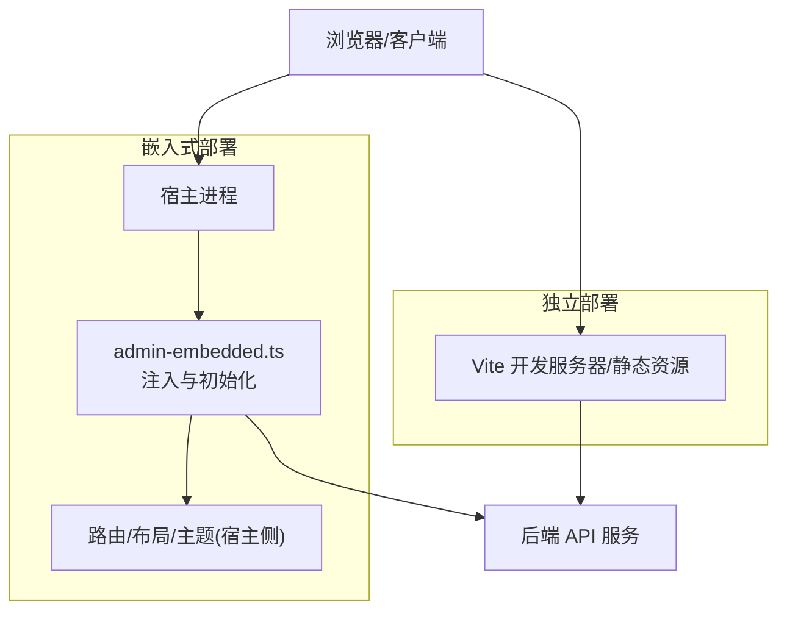
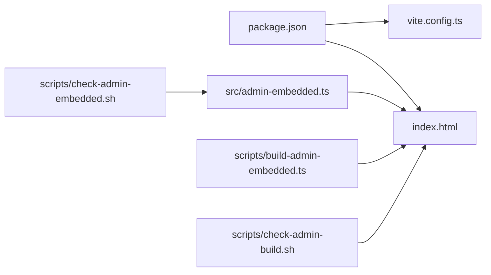

# 管理界面概览

<cite>
**本文引用的文件**   
- [admin/DESIGN.md](file://admin/DESIGN.md)
- [admin/package.json](file://admin/package.json)
- [admin/vite.config.ts](file://admin/vite.config.ts)
- [admin/index.html](file://admin/index.html)
- [src/admin-embedded.ts](file://src/admin-embedded.ts)
- [scripts/build-admin-embedded.ts](file://scripts/build-admin-embedded.ts)
- [scripts/check-admin-build.sh](file://scripts/check-admin-build.sh)
- [scripts/check-admin-embedded.sh](file://scripts/check-admin-embedded.sh)
</cite>

## 目录
1. [简介](#简介)
2. [项目结构](#项目结构)
3. [核心组件](#核心组件)
4. [架构总览](#架构总览)
5. [详细组件分析](#详细组件分析)
6. [依赖关系分析](#依赖关系分析)
7. [性能考虑](#性能考虑)
8. [故障排查指南](#故障排查指南)
9. [结论](#结论)
10. [附录](#附录)

## 简介
本概览文档面向管理与运维人员，系统性介绍 Web 控制台（管理界面）的设计理念、架构结构与主要功能模块。内容覆盖：
- 导航结构与用户交互模式
- 响应式设计特点
- 嵌入式部署与独立部署两种模式的差异与适用场景
- 界面定制化的基础概念与扩展机制
- 安全认证、权限控制与审计日志的整体设计思路
- 与后端 API 的通信机制与数据同步策略

该文档旨在帮助读者快速理解管理界面的整体工作方式，并为后续深入开发与运维提供清晰指引。

## 项目结构
管理界面位于 admin 子工程，采用现代前端工程化方案构建与打包；同时通过 src/admin-embedded.ts 暴露嵌入能力，供宿主进程以嵌入式方式集成。

图表来源
- [admin/index.html:1-200](file://admin/index.html#L1-L200)
- [admin/vite.config.ts:1-200](file://admin/vite.config.ts#L1-L200)
- [admin/package.json:1-200](file://admin/package.json#L1-L200)
- [src/admin-embedded.ts:1-200](file://src/admin-embedded.ts#L1-L200)
- [scripts/build-admin-embedded.ts:1-200](file://scripts/build-admin-embedded.ts#L1-L200)
- [scripts/check-admin-build.sh:1-200](file://scripts/check-admin-build.sh#L1-L200)
- [scripts/check-admin-embedded.sh:1-200](file://scripts/check-admin-embedded.sh#L1-L200)

章节来源
- [admin/DESIGN.md:1-200](file://admin/DESIGN.md#L1-L200)
- [admin/package.json:1-200](file://admin/package.json#L1-L200)
- [admin/vite.config.ts:1-200](file://admin/vite.config.ts#L1-L200)
- [admin/index.html:1-200](file://admin/index.html#L1-L200)
- [src/admin-embedded.ts:1-200](file://src/admin-embedded.ts#L1-L200)
- [scripts/build-admin-embedded.ts:1-200](file://scripts/build-admin-embedded.ts#L1-L200)
- [scripts/check-admin-build.sh:1-200](file://scripts/check-admin-build.sh#L1-L200)
- [scripts/check-admin-embedded.sh:1-200](file://scripts/check-admin-embedded.sh#L1-L200)

## 核心组件
- 入口与页面容器
  - index.html 作为单页应用的根容器，承载运行时挂载点与全局资源引用。
- 构建与开发配置
  - vite.config.ts 定义开发服务器、插件链、输出产物与路径别名等。
  - package.json 声明依赖、脚本命令与元信息，驱动本地开发与构建流程。
- 嵌入能力
  - src/admin-embedded.ts 暴露最小 API，用于在宿主进程中注入并初始化管理界面。
- 构建与校验脚本
  - scripts/build-admin-embedded.ts 负责将管理界面产物整合到宿主构建流程中。
  - scripts/check-admin-build.sh 与 scripts/check-admin-embedded.sh 用于 CI 阶段的构建与嵌入一致性检查。

章节来源
- [admin/index.html:1-200](file://admin/index.html#L1-L200)
- [admin/vite.config.ts:1-200](file://admin/vite.config.ts#L1-L200)
- [admin/package.json:1-200](file://admin/package.json#L1-L200)
- [src/admin-embedded.ts:1-200](file://src/admin-embedded.ts#L1-L200)
- [scripts/build-admin-embedded.ts:1-200](file://scripts/build-admin-embedded.ts#L1-L200)
- [scripts/check-admin-build.sh:1-200](file://scripts/check-admin-build.sh#L1-L200)
- [scripts/check-admin-embedded.sh:1-200](file://scripts/check-admin-embedded.sh#L1-L200)

## 架构总览
管理界面采用“可嵌入 + 可独立运行”的双模架构：
- 独立部署模式：通过 Vite 开发服务器或静态产物直接对外提供服务，适合调试、演示与独立站点。
- 嵌入式部署模式：由宿主进程加载并渲染，统一鉴权、路由与布局，适合内嵌到现有系统。

图表来源
- [admin/vite.config.ts:1-200](file://admin/vite.config.ts#L1-L200)
- [admin/index.html:1-200](file://admin/index.html#L1-L200)
- [src/admin-embedded.ts:1-200](file://src/admin-embedded.ts#L1-L200)

## 详细组件分析

### 设计与理念
- 设计理念
  - 模块化与可扩展：通过清晰的模块边界与配置项，支持按需启用功能与主题定制。
  - 一致的用户体验：统一的导航、操作反馈与错误提示，降低学习成本。
  - 可嵌入优先：为宿主进程提供稳定、最小化的嵌入接口，确保与宿主鉴权、布局与多租户隔离。
- 参考文档
  - DESIGN.md 提供了更完整的设计说明与约束。

章节来源
- [admin/DESIGN.md:1-200](file://admin/DESIGN.md#L1-L200)

### 导航结构与用户交互
- 导航结构
  - 基于路由的多级菜单组织，支持按角色与权限动态展示。
  - 常用操作置顶与快捷入口，提升高频任务效率。
- 交互模式
  - 表单提交采用乐观更新与失败回滚策略，保证流畅体验。
  - 列表与详情联动，支持分页、筛选与排序。
  - 全局搜索与最近访问记录，缩短定位路径。
- 响应式适配
  - 栅格与断点策略，适配桌面与移动端。
  - 折叠面板与抽屉式操作，在小屏设备上保持可用性。

[本节为通用交互设计说明，不直接分析具体文件]

### 响应式设计特点
- 布局
  - 弹性布局与自适应网格，保证在不同分辨率下的一致性。
- 组件
  - 表格、卡片、弹窗等组件具备移动端友好行为。
- 性能
  - 图片懒加载与按需加载路由，减少首屏体积。

[本节为通用设计说明，不直接分析具体文件]

### 嵌入式部署与独立部署
- 独立部署
  - 使用 Vite 启动开发服务器或直接托管静态资源，便于本地调试与外部访问。
  - 适用于演示、测试环境与独立站点。
- 嵌入式部署
  - 通过 src/admin-embedded.ts 提供的接口，在宿主进程中注入并初始化界面。
  - 由宿主统一处理鉴权、路由前缀、主题与国际化。
  - 适用于内嵌到现有平台或企业门户。
- 构建与校验
  - scripts/build-admin-embedded.ts 将管理界面产物纳入宿主构建流程。
  - scripts/check-admin-build.sh 与 scripts/check-admin-embedded.sh 保障构建与嵌入一致性。

章节来源
- [admin/vite.config.ts:1-200](file://admin/vite.config.ts#L1-L200)
- [src/admin-embedded.ts:1-200](file://src/admin-embedded.ts#L1-L200)
- [scripts/build-admin-embedded.ts:1-200](file://scripts/build-admin-embedded.ts#L1-L200)
- [scripts/check-admin-build.sh:1-200](file://scripts/check-admin-build.sh#L1-L200)
- [scripts/check-admin-embedded.sh:1-200](file://scripts/check-admin-embedded.sh#L1-L200)

### 界面定制化与扩展机制
- 主题与样式
  - 通过配置项切换主题变量与品牌元素，支持深色模式与高对比度。
- 功能开关
  - 基于特性标志位启用/禁用模块，实现灰度发布与差异化版本。
- 插件化
  - 预留扩展点，允许在特定生命周期注入自定义逻辑或 UI 片段。
- 国际化
  - 多语言包与键值映射，支持运行时切换语言。

[本节为通用扩展机制说明，不直接分析具体文件]

### 安全认证、权限控制与审计日志
- 认证
  - 嵌入式模式下由宿主统一完成登录态与会话管理，避免重复实现。
  - 独立模式下建议启用 HTTPS 与安全的 Cookie/Token 策略。
- 授权
  - 基于角色的访问控制（RBAC），结合资源级权限进行细粒度控制。
  - 路由级与按钮级权限双重校验，防止越权访问。
- 审计
  - 关键操作记录审计日志，包含操作者、时间、对象与结果。
  - 敏感字段脱敏与日志分级，满足合规要求。

[本节为通用安全设计说明，不直接分析具体文件]

### 与后端 API 的通信机制与数据同步
- 通信协议
  - 基于 REST/JSON 或 WebSocket/SSE 的长连接，根据场景选择。
- 请求封装
  - 统一拦截器处理鉴权头、重试与错误码映射。
- 数据同步
  - 列表采用分页拉取与增量刷新；详情采用缓存与失效策略。
  - 实时变更通过事件流推送，前端合并状态并保持一致性。
- 错误与降级
  - 网络异常重试与退避；离线时显示缓存数据与提示。

[本节为通用通信与同步说明，不直接分析具体文件]

## 依赖关系分析
管理界面与宿主及构建工具之间的依赖关系如下：

图表来源
- [admin/package.json:1-200](file://admin/package.json#L1-L200)
- [admin/vite.config.ts:1-200](file://admin/vite.config.ts#L1-L200)
- [admin/index.html:1-200](file://admin/index.html#L1-L200)
- [src/admin-embedded.ts:1-200](file://src/admin-embedded.ts#L1-L200)
- [scripts/build-admin-embedded.ts:1-200](file://scripts/build-admin-embedded.ts#L1-L200)
- [scripts/check-admin-build.sh:1-200](file://scripts/check-admin-build.sh#L1-L200)
- [scripts/check-admin-embedded.sh:1-200](file://scripts/check-admin-embedded.sh#L1-L200)

章节来源
- [admin/package.json:1-200](file://admin/package.json#L1-L200)
- [admin/vite.config.ts:1-200](file://admin/vite.config.ts#L1-L200)
- [admin/index.html:1-200](file://admin/index.html#L1-L200)
- [src/admin-embedded.ts:1-200](file://src/admin-embedded.ts#L1-L200)
- [scripts/build-admin-embedded.ts:1-200](file://scripts/build-admin-embedded.ts#L1-L200)
- [scripts/check-admin-build.sh:1-200](file://scripts/check-admin-build.sh#L1-L200)
- [scripts/check-admin-embedded.sh:1-200](file://scripts/check-admin-embedded.sh#L1-L200)

## 性能考虑
- 首屏优化
  - 路由懒加载、代码分割与资源压缩，减少初始下载体积。
- 渲染优化
  - 虚拟滚动与分页加载，避免大数据量导致卡顿。
- 缓存策略
  - 静态资源强缓存，API 响应短缓存与条件请求。
- 网络优化
  - 并发限制、请求去重与失败重试，提高稳定性与吞吐。

[本节为通用性能建议，不直接分析具体文件]

## 故障排查指南
- 构建问题
  - 使用 check-admin-build.sh 验证构建产物完整性。
  - 使用 build-admin-embedded.ts 重新生成嵌入所需资源。
- 嵌入问题
  - 使用 check-admin-embedded.sh 检查嵌入接口与宿主兼容性。
  - 确认宿主已正确调用初始化函数并传入必要参数。
- 常见问题
  - 跨域与鉴权：核对 CORS 配置与 Token 传递。
  - 路由冲突：检查宿主路由前缀与内部路由层级。
  - 资源加载失败：检查静态资源路径与 CDN 配置。

章节来源
- [scripts/check-admin-build.sh:1-200](file://scripts/check-admin-build.sh#L1-L200)
- [scripts/build-admin-embedded.ts:1-200](file://scripts/build-admin-embedded.ts#L1-L200)
- [scripts/check-admin-embedded.sh:1-200](file://scripts/check-admin-embedded.sh#L1-L200)

## 结论
管理界面以“可嵌入 + 可独立运行”为核心架构，兼顾灵活性与一致性。通过清晰的模块划分、完善的构建与校验流程，以及可扩展的主题与功能开关，能够满足从演示到生产的多场景需求。配合稳健的安全与审计设计，以及与后端 API 的高效通信策略，为复杂业务的管理与运维提供了坚实基础。

## 附录
- 术语
  - 嵌入式部署：由宿主进程加载并渲染管理界面，统一鉴权与布局。
  - 独立部署：直接对外提供静态资源或开发服务器，便于调试与演示。
- 参考
  - DESIGN.md 提供更全面的设计规范与约束说明。

章节来源
- [admin/DESIGN.md:1-200](file://admin/DESIGN.md#L1-L200)