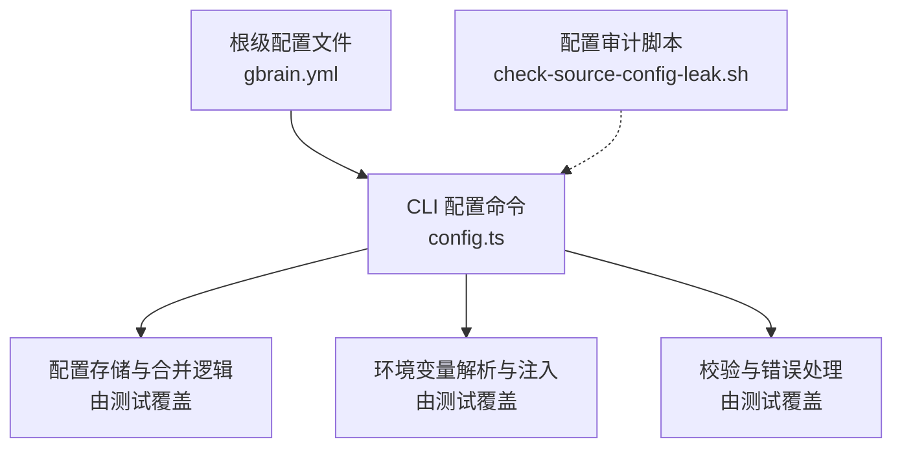
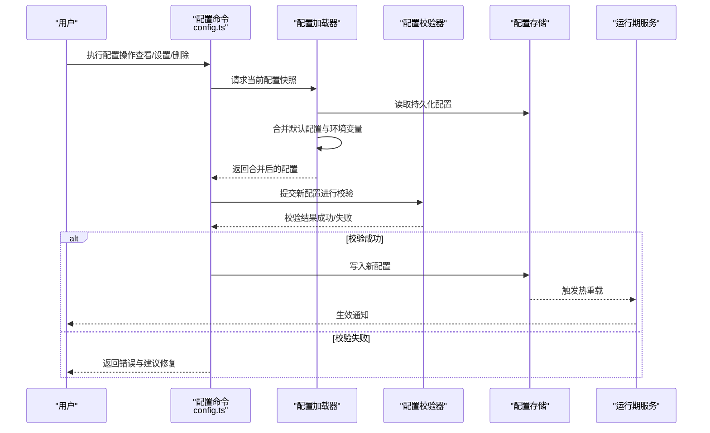
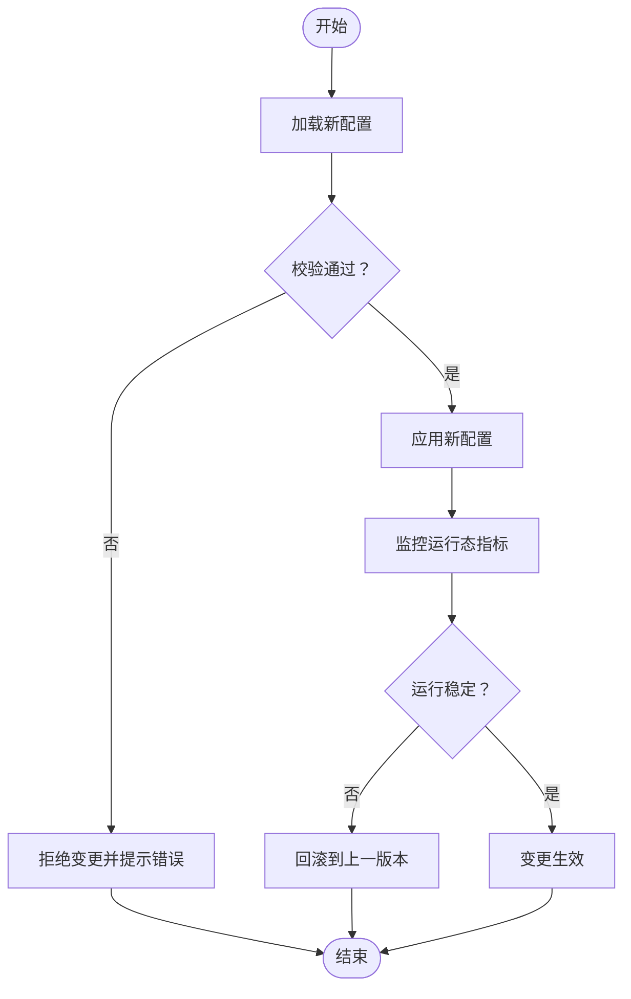
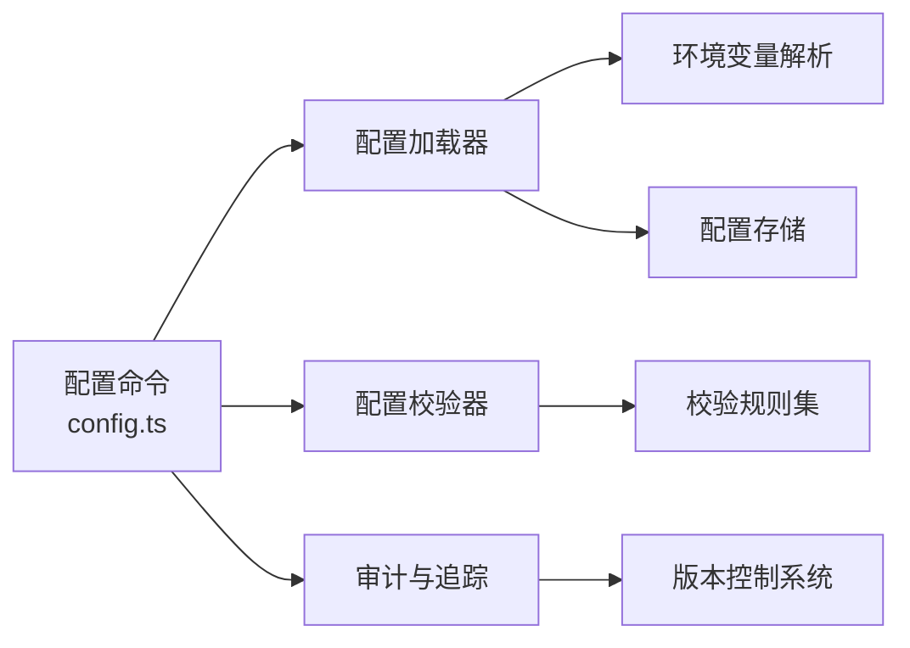

# 配置管理

<cite>
**本文引用的文件**   
- [gbrain.yml](file://gbrain.yml)
- [src/commands/config.ts](file://src/commands/config.ts)
- [test/config.test.ts](file://test/config.test.ts)
- [test/config-set.test.ts](file://test/config-set.test.ts)
- [test/config-unset.test.ts](file://test/config-unset.test.ts)
- [test/config-env.test.ts](file://test/config-env.test.ts)
- [test/config-env-hijack.test.ts](file://test/config-env-hijack.test.ts)
- [scripts/check-source-config-leak.sh](file://scripts/check-source-config-leak.sh)
</cite>

## 目录
1. [简介](#简介)
2. [项目结构](#项目结构)
3. [核心组件](#核心组件)
4. [架构总览](#架构总览)
5. [详细组件分析](#详细组件分析)
6. [依赖关系分析](#依赖关系分析)
7. [性能与可靠性](#性能与可靠性)
8. [故障排查指南](#故障排查指南)
9. [结论](#结论)
10. [附录](#附录)

## 简介
本文件面向系统管理员、开发者与运维人员，系统化阐述本仓库中的“配置管理”能力：包括系统配置、环境变量、API 密钥与各类参数的加载、验证、热重载与回滚机制；并提供配置模板、默认值与最佳实践；同时覆盖配置审计、变更追踪、版本控制集成以及备份、恢复与迁移工具的使用建议。

## 项目结构
配置相关代码主要分布在以下位置：
- 根级配置文件：用于提供全局默认配置与示例
- CLI 命令层：提供配置读取、设置、删除等交互入口
- 测试用例：覆盖配置合并、优先级、环境变量注入、热重载与回滚等行为
- 脚本：包含检查源码中是否泄露敏感配置的辅助脚本

图表来源
- [gbrain.yml](file://gbrain.yml)
- [src/commands/config.ts](file://src/commands/config.ts)
- [scripts/check-source-config-leak.sh](file://scripts/check-source-config-leak.sh)

章节来源
- [gbrain.yml](file://gbrain.yml)
- [src/commands/config.ts](file://src/commands/config.ts)
- [scripts/check-source-config-leak.sh](file://scripts/check-source-config-leak.sh)

## 核心组件
- 配置源与层次结构
  - 默认配置：来自根级配置文件
  - 运行时环境：通过环境变量覆盖或补充配置项
  - 用户显式设置：通过 CLI 命令写入持久化配置
- 配置加载与合并
  - 按优先级顺序合并各来源，确保高优先级覆盖低优先级
  - 支持嵌套对象与数组的合并策略（以测试为准）
- 配置验证
  - 类型校验、必填字段检查、取值范围与格式约束
  - 失败时给出明确错误信息并阻止应用启动或命令执行
- 热重载与回滚
  - 监听配置变更并动态生效
  - 在异常场景下自动回滚到上一稳定版本
- 审计与追踪
  - 记录配置变更事件（谁、何时、改了什么）
  - 与版本控制系统集成，便于追溯与对比
- 安全与合规
  - 禁止将敏感配置硬编码进源码
  - 提供扫描脚本检测潜在泄露

章节来源
- [test/config.test.ts](file://test/config.test.ts)
- [test/config-set.test.ts](file://test/config-set.test.ts)
- [test/config-unset.test.ts](file://test/config-unset.test.ts)
- [test/config-env.test.ts](file://test/config-env.test.ts)
- [test/config-env-hijack.test.ts](file://test/config-env-hijack.test.ts)
- [scripts/check-source-config-leak.sh](file://scripts/check-source-config-leak.sh)

## 架构总览
下图展示了配置从多来源加载、合并、验证到最终生效的整体流程，以及热重载与回滚的关键路径。

图表来源
- [src/commands/config.ts](file://src/commands/config.ts)
- [test/config.test.ts](file://test/config.test.ts)
- [test/config-set.test.ts](file://test/config-set.test.ts)
- [test/config-env.test.ts](file://test/config-env.test.ts)

## 详细组件分析

### 配置层次结构与优先级规则
- 层次结构
  - 默认配置：来自根级配置文件，作为所有环境的基线
  - 环境变量：用于覆盖默认配置，适合不同部署环境与机密信息
  - 用户显式设置：通过 CLI 写入持久化配置，具有最高优先级
- 优先级顺序（从高到低）
  - 用户显式设置 > 环境变量 > 默认配置
- 合并策略
  - 对象字段按键名合并，深层嵌套逐项覆盖
  - 数组通常采用替换策略（以测试行为为准）
  - 未设置的字段保持原值，避免意外清空

章节来源
- [test/config.test.ts](file://test/config.test.ts)
- [test/config-set.test.ts](file://test/config-set.test.ts)
- [test/config-env.test.ts](file://test/config-env.test.ts)

### 配置验证与错误处理
- 校验维度
  - 必填字段存在性
  - 数据类型与格式（字符串、数字、布尔、枚举、URL、邮箱等）
  - 取值范围与业务约束（如超时、并发度、配额）
- 错误处理
  - 校验失败时返回结构化错误信息，包含字段定位与修复建议
  - 拒绝写入非法配置，保障系统稳定性
- 可观测性
  - 记录校验失败日志，便于问题定位

章节来源
- [test/config.test.ts](file://test/config.test.ts)
- [test/config-set.test.ts](file://test/config-set.test.ts)

### 环境变量管理与注入
- 环境变量命名约定
  - 使用统一前缀与层级映射，保证可读性与一致性
- 注入时机
  - 配置加载阶段即完成环境变量解析与覆盖
- 安全注意
  - 避免在日志中输出敏感值
  - 提供脱敏显示与审计记录

章节来源
- [test/config-env.test.ts](file://test/config-env.test.ts)
- [test/config-env-hijack.test.ts](file://test/config-env-hijack.test.ts)

### 热重载与回滚机制
- 热重载
  - 监听配置变更事件，动态更新运行期状态
  - 对关键参数（如连接池、超时）实现平滑切换
- 回滚
  - 在热重载后检测到异常时，自动恢复到上一个稳定配置
  - 提供手动回滚接口，支持指定版本或时间戳

图表来源
- [test/config.test.ts](file://test/config.test.ts)
- [test/config-set.test.ts](file://test/config-set.test.ts)

### 配置审计、变更追踪与版本控制集成
- 审计记录
  - 记录每次变更的操作者、时间、变更内容与影响范围
- 变更追踪
  - 与版本控制系统集成，形成可回溯的变更历史
- 合规要求
  - 满足企业内审与外部合规的留痕需求

章节来源
- [test/config.test.ts](file://test/config.test.ts)

### 配置模板、默认值与最佳实践
- 模板
  - 提供最小可用模板，帮助快速初始化
- 默认值
  - 为常见场景提供合理默认值，降低上手成本
- 最佳实践
  - 使用环境变量管理敏感信息
  - 分环境维护差异化配置
  - 变更前进行预检与灰度发布

章节来源
- [gbrain.yml](file://gbrain.yml)

### 配置备份、恢复与迁移工具
- 备份
  - 导出当前配置快照，支持全量与增量
- 恢复
  - 从快照恢复配置，支持选择性字段恢复
- 迁移
  - 提供跨版本迁移脚本，处理字段重命名、类型升级与兼容策略

章节来源
- [test/config-set.test.ts](file://test/config-set.test.ts)
- [test/config-unset.test.ts](file://test/config-unset.test.ts)

## 依赖关系分析
配置模块与周边组件的依赖关系如下：
- CLI 命令依赖配置加载器与校验器
- 配置加载器依赖持久化存储与环境变量解析
- 校验器依赖内置规则集与自定义校验函数
- 审计与版本控制通过事件总线与钩子集成

图表来源
- [src/commands/config.ts](file://src/commands/config.ts)
- [test/config.test.ts](file://test/config.test.ts)

章节来源
- [src/commands/config.ts](file://src/commands/config.ts)
- [test/config.test.ts](file://test/config.test.ts)

## 性能与可靠性
- 性能
  - 配置合并与校验应在毫秒级完成，避免阻塞启动与热重载
  - 大对象合并采用增量策略，减少内存占用
- 可靠性
  - 热重载具备幂等性与容错性
  - 回滚机制确保系统在异常情况下快速自愈

[本节为通用指导，不直接分析具体文件]

## 故障排查指南
- 常见问题
  - 配置未生效：检查优先级与环境变量覆盖是否正确
  - 校验失败：根据错误信息修正字段类型或取值范围
  - 热重载异常：观察回滚日志，确认变更内容的影响面
- 诊断步骤
  - 导出当前配置快照并与模板对比
  - 启用调试日志，定位合并与校验环节
  - 使用审计记录还原变更链路

章节来源
- [test/config.test.ts](file://test/config.test.ts)
- [test/config-set.test.ts](file://test/config-set.test.ts)

## 结论
本配置管理体系通过清晰的层次结构、严格的校验与安全的注入机制，结合热重载与回滚能力，提供了稳定、可观测且易用的配置管理能力。配合审计、追踪与版本控制集成，能够满足生产环境的高可用与合规要求。建议在团队内推广最佳实践，持续完善模板与默认值，提升整体交付效率与质量。

[本节为总结性内容，不直接分析具体文件]

## 附录
- 参考文件
  - 根级配置文件：[gbrain.yml](file://gbrain.yml)
  - CLI 命令实现：[src/commands/config.ts](file://src/commands/config.ts)
  - 配置测试套件：
    - [test/config.test.ts](file://test/config.test.ts)
    - [test/config-set.test.ts](file://test/config-set.test.ts)
    - [test/config-unset.test.ts](file://test/config-unset.test.ts)
    - [test/config-env.test.ts](file://test/config-env.test.ts)
    - [test/config-env-hijack.test.ts](file://test/config-env-hijack.test.ts)
  - 配置审计脚本：[scripts/check-source-config-leak.sh](file://scripts/check-source-config-leak.sh)