# 上下文注入机制

<cite>
**本文引用的文件**   
- [src/openclaw-context-engine.ts](file://src/openclaw-context-engine.ts)
- [test/context-engine.test.ts](file://test/context-engine.test.ts)
- [gbrain.yml](file://gbrain.yml)
- [src/commands/config-set.ts](file://src/commands/config-set.ts)
- [src/commands/config-unset.ts](file://src/commands/config-unset.ts)
- [src/core/config/env.ts](file://src/core/config/env.ts)
- [src/core/config/loader.ts](file://src/core/config/loader.ts)
- [src/core/config/merge.ts](file://src/core/config/merge.ts)
- [src/core/config/schema.ts](file://src/core/config/schema.ts)
- [src/core/config/defaults.ts](file://src/core/config/defaults.ts)
- [src/core/config/interceptors.ts](file://src/core/config/interceptors.ts)
- [src/core/config/middleware.ts](file://src/core/config/middleware.ts)
- [src/core/config/debug.ts](file://src/core/config/debug.ts)
- [src/core/config/security.ts](file://src/core/config/security.ts)
- [src/core/runtime/callstack.ts](file://src/core/runtime/callstack.ts)
- [src/core/runtime/params.ts](file://src/core/runtime/params.ts)
- [src/core/runtime/types.ts](file://src/core/runtime/types.ts)
</cite>

## 目录
1. [简介](#简介)
2. [项目结构](#项目结构)
3. [核心组件](#核心组件)
4. [架构总览](#架构总览)
5. [详细组件分析](#详细组件分析)
6. [依赖分析](#依赖分析)
7. [性能考虑](#性能考虑)
8. [故障排查指南](#故障排查指南)
9. [结论](#结论)
10. [附录](#附录)

## 简介
本文件系统性阐述 GBrain 的“上下文注入机制”，围绕上下文引擎的变量解析、作用域管理、依赖注入，以及环境变量处理（配置层次、默认值与动态更新）、运行时参数传递（调用栈分析、参数验证与类型转换）、配置合并与继承（文件优先级、模板渲染与条件加载）展开。同时提供扩展开发指南（自定义变量源、拦截器与中间件），并覆盖调试工具、性能监控与安全实现细节。

## 项目结构
与上下文注入相关的代码主要分布在以下位置：
- 上下文引擎入口与编排：src/openclaw-context-engine.ts
- 配置系统与环境变量：src/core/config/*
- 运行时参数与类型：src/core/runtime/*
- 命令层对配置的读写：src/commands/config-*.ts
- 测试用例：test/context-engine.test.ts
- 全局配置示例：gbrain.yml

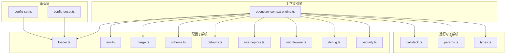

图表来源
- [src/openclaw-context-engine.ts](file://src/openclaw-context-engine.ts)
- [src/core/config/env.ts](file://src/core/config/env.ts)
- [src/core/config/loader.ts](file://src/core/config/loader.ts)
- [src/core/config/merge.ts](file://src/core/config/merge.ts)
- [src/core/config/schema.ts](file://src/core/config/schema.ts)
- [src/core/config/defaults.ts](file://src/core/config/defaults.ts)
- [src/core/config/interceptors.ts](file://src/core/config/interceptors.ts)
- [src/core/config/middleware.ts](file://src/core/config/middleware.ts)
- [src/core/config/debug.ts](file://src/core/config/debug.ts)
- [src/core/config/security.ts](file://src/core/config/security.ts)
- [src/core/runtime/callstack.ts](file://src/core/runtime/callstack.ts)
- [src/core/runtime/params.ts](file://src/core/runtime/params.ts)
- [src/core/runtime/types.ts](file://src/core/runtime/types.ts)
- [src/commands/config-set.ts](file://src/commands/config-set.ts)
- [src/commands/config-unset.ts](file://src/commands/config-unset.ts)

章节来源
- [src/openclaw-context-engine.ts](file://src/openclaw-context-engine.ts)
- [test/context-engine.test.ts](file://test/context-engine.test.ts)
- [gbrain.yml](file://gbrain.yml)

## 核心组件
- 上下文引擎：负责统一装配变量源、作用域、依赖注入、拦截器与中间件，并在请求或任务生命周期内完成上下文构建与注入。
- 配置子系统：提供环境读取、默认值、模式校验、合并与继承、模板渲染、条件加载、安全过滤与调试输出。
- 运行时子系统：提供调用栈分析、参数收集、类型推断与转换、边界校验。
- 命令层：提供持久化配置写入/删除能力，驱动配置变更生效。

章节来源
- [src/openclaw-context-engine.ts](file://src/openclaw-context-engine.ts)
- [src/core/config/env.ts](file://src/core/config/env.ts)
- [src/core/config/loader.ts](file://src/core/config/loader.ts)
- [src/core/config/merge.ts](file://src/core/config/merge.ts)
- [src/core/config/schema.ts](file://src/core/config/schema.ts)
- [src/core/config/defaults.ts](file://src/core/config/defaults.ts)
- [src/core/config/interceptors.ts](file://src/core/config/interceptors.ts)
- [src/core/config/middleware.ts](file://src/core/config/middleware.ts)
- [src/core/config/debug.ts](file://src/core/config/debug.ts)
- [src/core/config/security.ts](file://src/core/config/security.ts)
- [src/core/runtime/callstack.ts](file://src/core/runtime/callstack.ts)
- [src/core/runtime/params.ts](file://src/core/runtime/params.ts)
- [src/core/runtime/types.ts](file://src/core/runtime/types.ts)
- [src/commands/config-set.ts](file://src/commands/config-set.ts)
- [src/commands/config-unset.ts](file://src/commands/config-unset.ts)

## 架构总览
上下文注入的整体流程如下：
- 启动阶段：加载默认配置、合并多源配置、应用模板与条件、执行安全过滤与中间件链、注册拦截器。
- 运行阶段：基于调用栈与传入参数构建运行时上下文，进行参数校验与类型转换，按作用域解析变量，注入依赖。
- 更新阶段：通过命令或热更新接口修改配置，触发增量合并与重新注入。

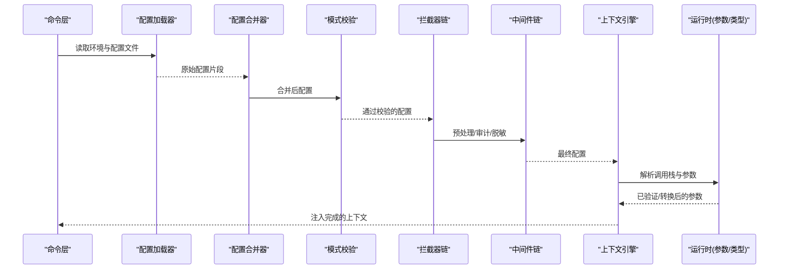

图表来源
- [src/openclaw-context-engine.ts](file://src/openclaw-context-engine.ts)
- [src/core/config/loader.ts](file://src/core/config/loader.ts)
- [src/core/config/merge.ts](file://src/core/config/merge.ts)
- [src/core/config/schema.ts](file://src/core/config/schema.ts)
- [src/core/config/interceptors.ts](file://src/core/config/interceptors.ts)
- [src/core/config/middleware.ts](file://src/core/config/middleware.ts)
- [src/core/runtime/callstack.ts](file://src/core/runtime/callstack.ts)
- [src/core/runtime/params.ts](file://src/core/runtime/params.ts)

## 详细组件分析

### 上下文引擎（变量解析、作用域与依赖注入）
- 变量解析：支持多层级命名空间与键路径解析，优先顺序由作用域决定；可组合多个变量源（环境变量、配置文件、运行时参数、服务发现等）。
- 作用域管理：提供进程级、请求级、任务级与作用域嵌套；上层作用域为下层提供可见性，但下层不可污染上层。
- 依赖注入：以声明式方式注册依赖项，支持懒加载与循环依赖检测；在解析时按需实例化并缓存。

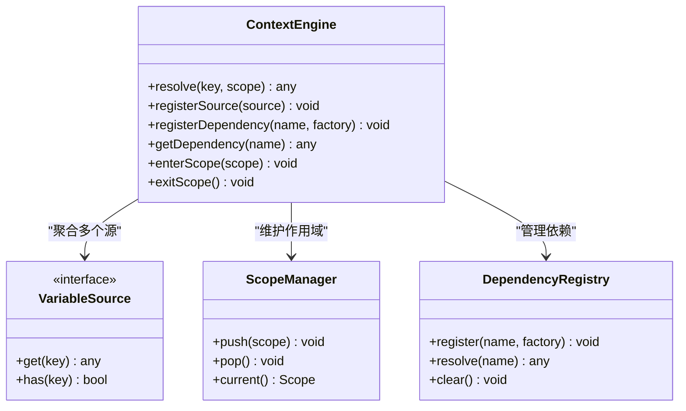

图表来源
- [src/openclaw-context-engine.ts](file://src/openclaw-context-engine.ts)

章节来源
- [src/openclaw-context-engine.ts](file://src/openclaw-context-engine.ts)
- [test/context-engine.test.ts](file://test/context-engine.test.ts)

### 环境变量与配置处理（层次、默认值、动态更新）
- 配置层次：默认值 < 内置配置 < 配置文件 < 环境变量 < 运行时参数 < 命令参数。高优先级覆盖低优先级。
- 默认值设置：集中定义于默认配置模块，便于统一管理与版本演进。
- 动态更新：支持热更新场景下的增量合并与重新注入，避免重启带来的抖动。

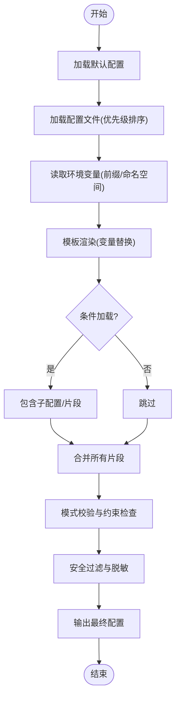

图表来源
- [src/core/config/env.ts](file://src/core/config/env.ts)
- [src/core/config/loader.ts](file://src/core/config/loader.ts)
- [src/core/config/merge.ts](file://src/core/config/merge.ts)
- [src/core/config/schema.ts](file://src/core/config/schema.ts)
- [src/core/config/defaults.ts](file://src/core/config/defaults.ts)
- [src/core/config/security.ts](file://src/core/config/security.ts)

章节来源
- [src/core/config/env.ts](file://src/core/config/env.ts)
- [src/core/config/loader.ts](file://src/core/config/loader.ts)
- [src/core/config/merge.ts](file://src/core/config/merge.ts)
- [src/core/config/schema.ts](file://src/core/config/schema.ts)
- [src/core/config/defaults.ts](file://src/core/config/defaults.ts)
- [src/core/config/security.ts](file://src/core/config/security.ts)
- [gbrain.yml](file://gbrain.yml)

### 运行时参数传递（调用栈分析、参数验证与类型转换）
- 调用栈分析：从当前执行上下文中提取函数签名、参数名与位置信息，辅助自动绑定与诊断。
- 参数验证：基于模式与规则进行必填、范围、格式校验，失败时返回结构化错误。
- 类型转换：将字符串型输入转换为期望类型（数字、布尔、枚举、对象等），并提供回退策略。

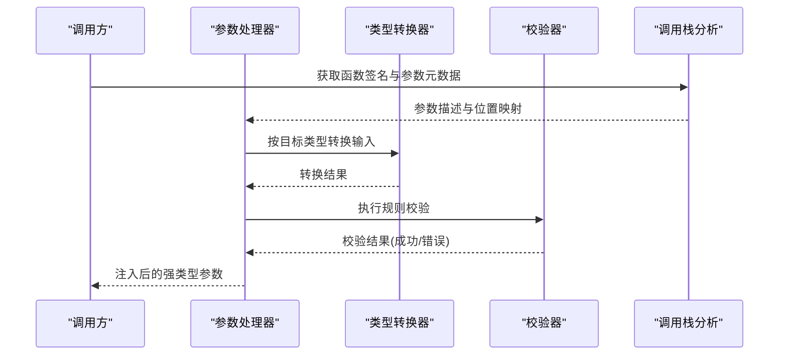

图表来源
- [src/core/runtime/callstack.ts](file://src/core/runtime/callstack.ts)
- [src/core/runtime/params.ts](file://src/core/runtime/params.ts)
- [src/core/runtime/types.ts](file://src/core/runtime/types.ts)

章节来源
- [src/core/runtime/callstack.ts](file://src/core/runtime/callstack.ts)
- [src/core/runtime/params.ts](file://src/core/runtime/params.ts)
- [src/core/runtime/types.ts](file://src/core/runtime/types.ts)

### 配置合并与继承（文件优先级、模板渲染、条件加载）
- 文件优先级：按约定顺序加载多个配置文件，后加载者覆盖前者同名键。
- 模板渲染：支持在配置中引用变量与表达式，渲染后参与后续合并。
- 条件加载：根据环境、特性开关或外部状态决定是否引入某段配置。

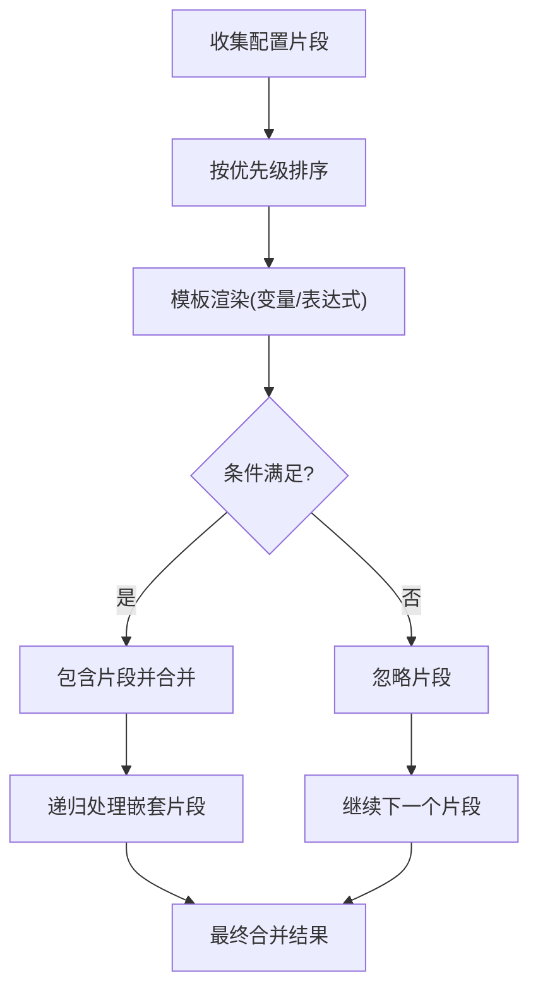

图表来源
- [src/core/config/loader.ts](file://src/core/config/loader.ts)
- [src/core/config/merge.ts](file://src/core/config/merge.ts)

章节来源
- [src/core/config/loader.ts](file://src/core/config/loader.ts)
- [src/core/config/merge.ts](file://src/core/config/merge.ts)

### 配置命令（持久化写入与删除）
- 写入：将指定键值写入持久化存储，触发增量合并与重新注入。
- 删除：移除指定键，回退到更低优先级源的对应值。

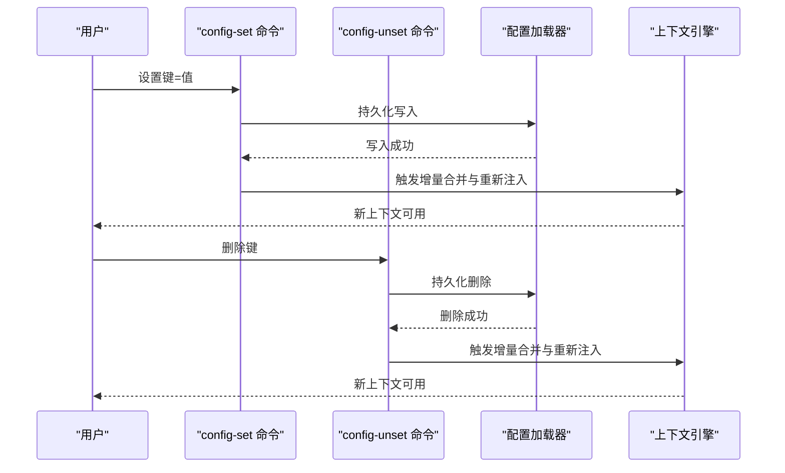

图表来源
- [src/commands/config-set.ts](file://src/commands/config-set.ts)
- [src/commands/config-unset.ts](file://src/commands/config-unset.ts)
- [src/core/config/loader.ts](file://src/core/config/loader.ts)
- [src/openclaw-context-engine.ts](file://src/openclaw-context-engine.ts)

章节来源
- [src/commands/config-set.ts](file://src/commands/config-set.ts)
- [src/commands/config-unset.ts](file://src/commands/config-unset.ts)

### 扩展开发指南（自定义变量源、拦截器与中间件）
- 自定义变量源：实现统一的变量读取接口，注册到引擎，即可参与解析。
- 拦截器：在配置合并前后插入逻辑，如审计、指标采集、缓存命中判断。
- 中间件：在配置进入引擎前进行预处理，如脱敏、规范化、权限校验。

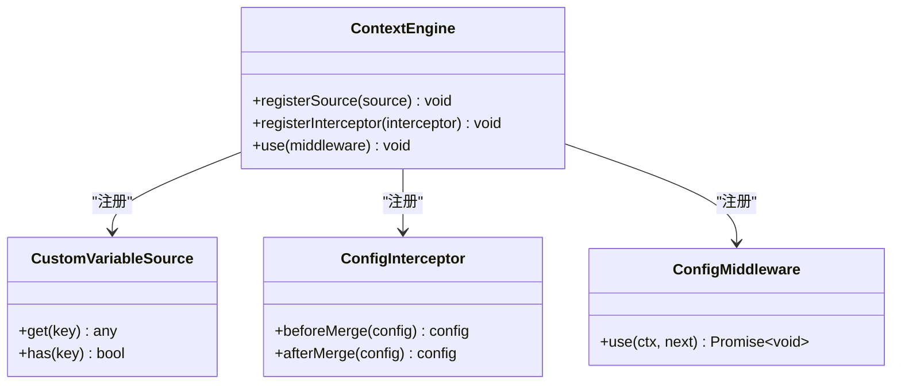

图表来源
- [src/openclaw-context-engine.ts](file://src/openclaw-context-engine.ts)
- [src/core/config/interceptors.ts](file://src/core/config/interceptors.ts)
- [src/core/config/middleware.ts](file://src/core/config/middleware.ts)

章节来源
- [src/openclaw-context-engine.ts](file://src/openclaw-context-engine.ts)
- [src/core/config/interceptors.ts](file://src/core/config/interceptors.ts)
- [src/core/config/middleware.ts](file://src/core/config/middleware.ts)

### 调试工具与性能监控
- 调试：启用调试模式后，记录配置加载路径、合并差异、模板渲染结果与解析耗时。
- 监控：暴露关键指标（加载次数、合并耗时、解析命中率、错误率），便于观测与告警。

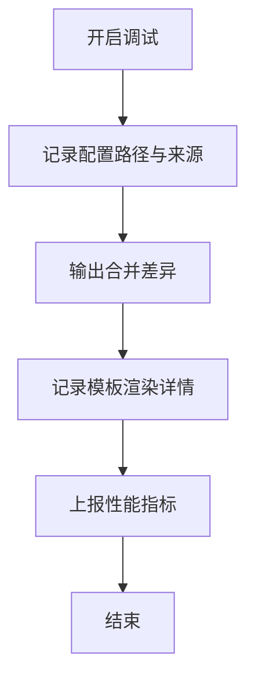

图表来源
- [src/core/config/debug.ts](file://src/core/config/debug.ts)

章节来源
- [src/core/config/debug.ts](file://src/core/config/debug.ts)

### 安全考虑
- 敏感字段过滤：在配置进入引擎前进行白名单匹配与脱敏。
- 注入防护：限制模板表达式与变量来源，防止任意代码执行。
- 访问控制：基于作用域与角色限制配置可见性与写入权限。

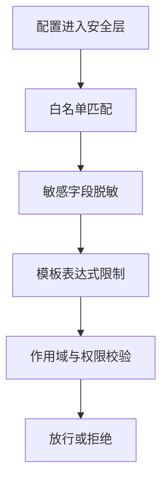

图表来源
- [src/core/config/security.ts](file://src/core/config/security.ts)

章节来源
- [src/core/config/security.ts](file://src/core/config/security.ts)

## 依赖分析
上下文引擎与各子系统的耦合关系如下：
- 低耦合：变量源、拦截器、中间件以接口形式接入，便于替换与扩展。
- 高内聚：配置加载、合并、校验集中在配置子系统内部，职责清晰。
- 潜在循环：若自定义变量源或中间件反向依赖引擎，需避免循环引用。

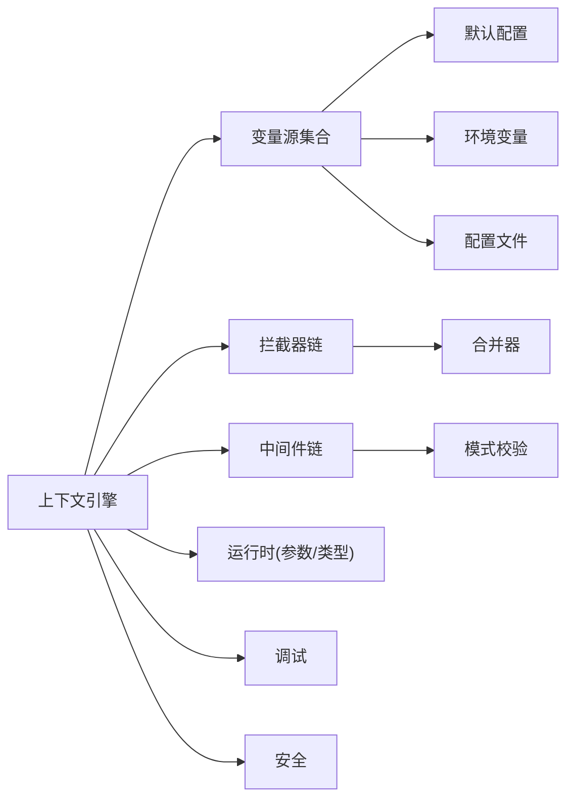

图表来源
- [src/openclaw-context-engine.ts](file://src/openclaw-context-engine.ts)
- [src/core/config/env.ts](file://src/core/config/env.ts)
- [src/core/config/loader.ts](file://src/core/config/loader.ts)
- [src/core/config/merge.ts](file://src/core/config/merge.ts)
- [src/core/config/schema.ts](file://src/core/config/schema.ts)
- [src/core/config/defaults.ts](file://src/core/config/defaults.ts)
- [src/core/config/interceptors.ts](file://src/core/config/interceptors.ts)
- [src/core/config/middleware.ts](file://src/core/config/middleware.ts)
- [src/core/config/debug.ts](file://src/core/config/debug.ts)
- [src/core/config/security.ts](file://src/core/config/security.ts)

章节来源
- [src/openclaw-context-engine.ts](file://src/openclaw-context-engine.ts)
- [src/core/config/env.ts](file://src/core/config/env.ts)
- [src/core/config/loader.ts](file://src/core/config/loader.ts)
- [src/core/config/merge.ts](file://src/core/config/merge.ts)
- [src/core/config/schema.ts](file://src/core/config/schema.ts)
- [src/core/config/defaults.ts](file://src/core/config/defaults.ts)
- [src/core/config/interceptors.ts](file://src/core/config/interceptors.ts)
- [src/core/config/middleware.ts](file://src/core/config/middleware.ts)
- [src/core/config/debug.ts](file://src/core/config/debug.ts)
- [src/core/config/security.ts](file://src/core/config/security.ts)

## 性能考虑
- 合并优化：采用增量合并与差异计算，减少全量重算开销。
- 缓存策略：对只读配置与解析结果进行缓存，结合失效策略保证一致性。
- 懒加载：依赖与变量源按需初始化，降低冷启动成本。
- 并发安全：在多线程或多工作进程环境下，确保配置读取的原子性与可见性。

[本节为通用指导，不直接分析具体文件]

## 故障排查指南
- 常见问题
  - 变量未解析：检查作用域层级与变量源注册顺序。
  - 类型转换失败：确认目标类型与输入格式是否匹配，查看转换日志。
  - 配置未生效：确认优先级顺序与命令写入是否成功，观察增量合并日志。
  - 安全拒绝：检查白名单与脱敏规则，定位被拒绝的字段。
- 定位方法
  - 启用调试模式，查看配置路径、合并差异与模板渲染详情。
  - 使用命令层写入/删除操作，配合上下文引擎的重新注入反馈。
  - 关注性能指标与错误率，快速识别热点与瓶颈。

章节来源
- [src/core/config/debug.ts](file://src/core/config/debug.ts)
- [src/commands/config-set.ts](file://src/commands/config-set.ts)
- [src/commands/config-unset.ts](file://src/commands/config-unset.ts)
- [test/context-engine.test.ts](file://test/context-engine.test.ts)

## 结论
GBrain 的上下文注入机制通过清晰的层次化配置、严格的类型与安全检查、可扩展的变量源与中间件体系，提供了稳定且灵活的运行时上下文管理能力。借助调试与监控工具，可在复杂环境中高效定位问题并持续优化性能。

[本节为总结性内容，不直接分析具体文件]

## 附录
- 参考样例配置：gbrain.yml
- 单元测试：test/context-engine.test.ts

章节来源
- [gbrain.yml](file://gbrain.yml)
- [test/context-engine.test.ts](file://test/context-engine.test.ts)