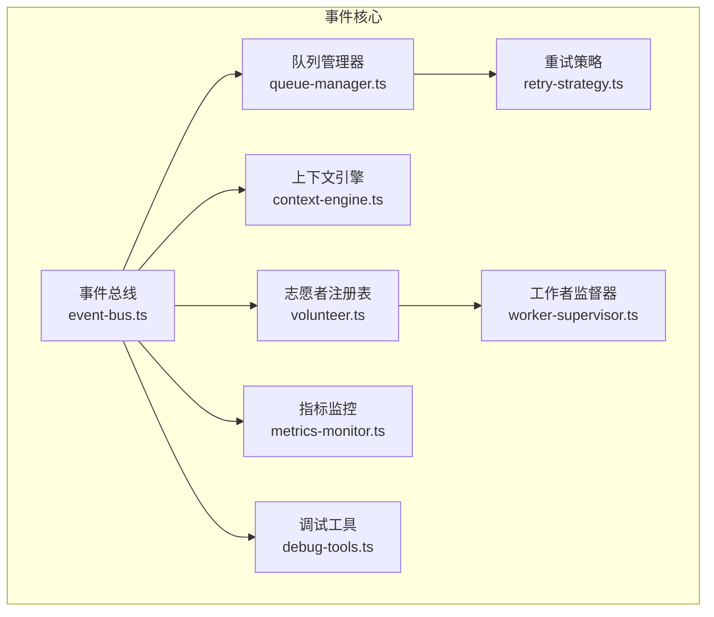
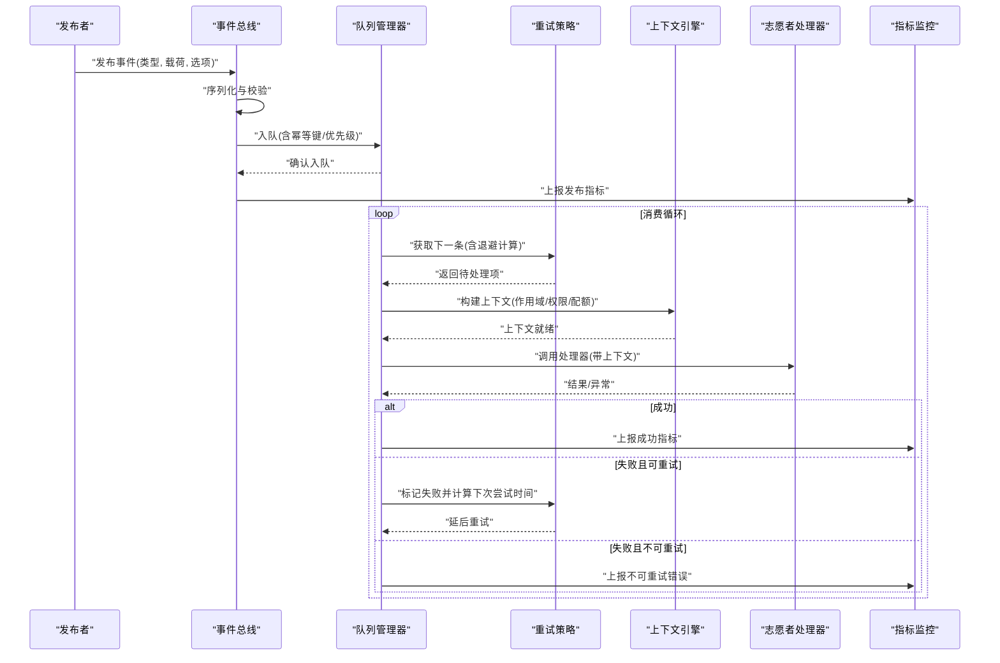
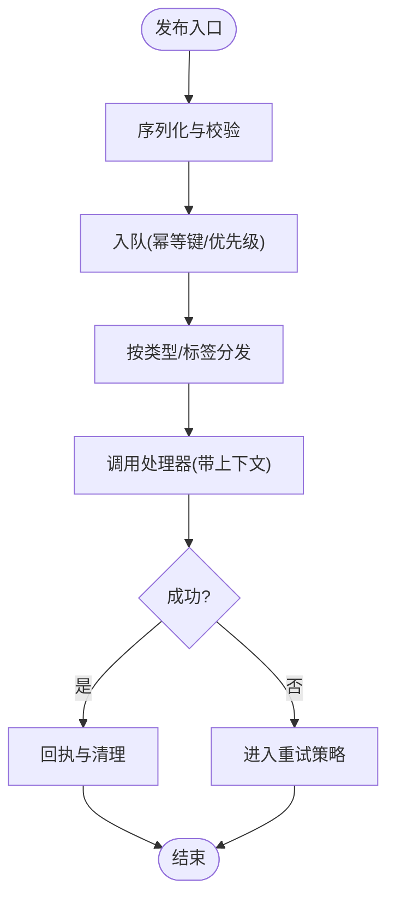
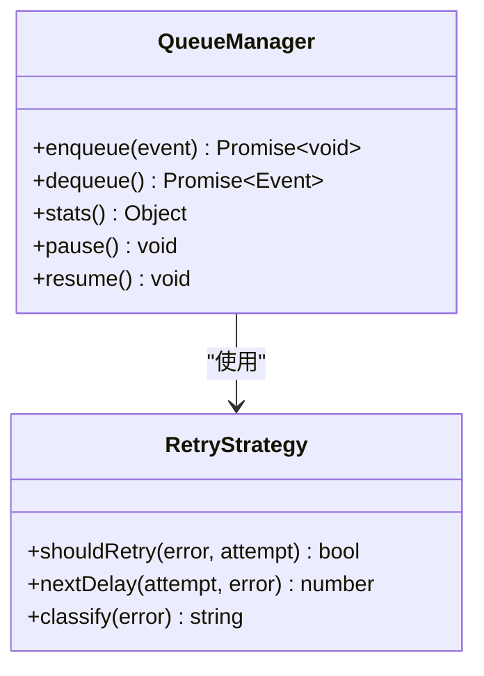
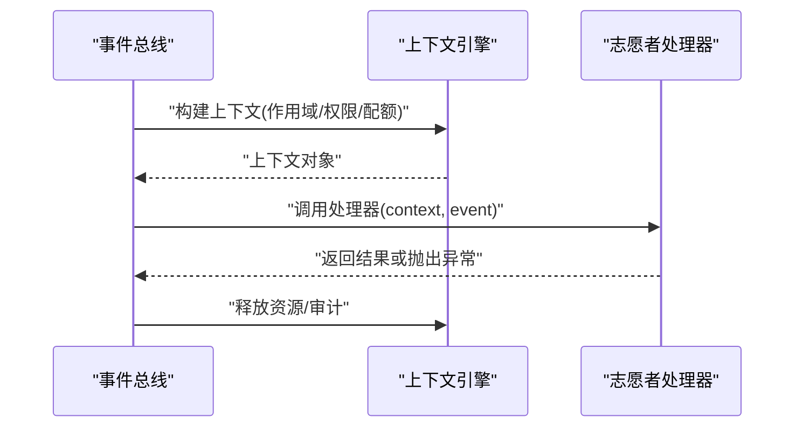
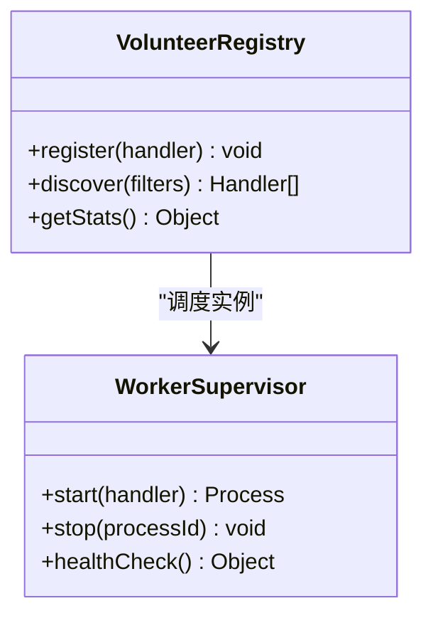
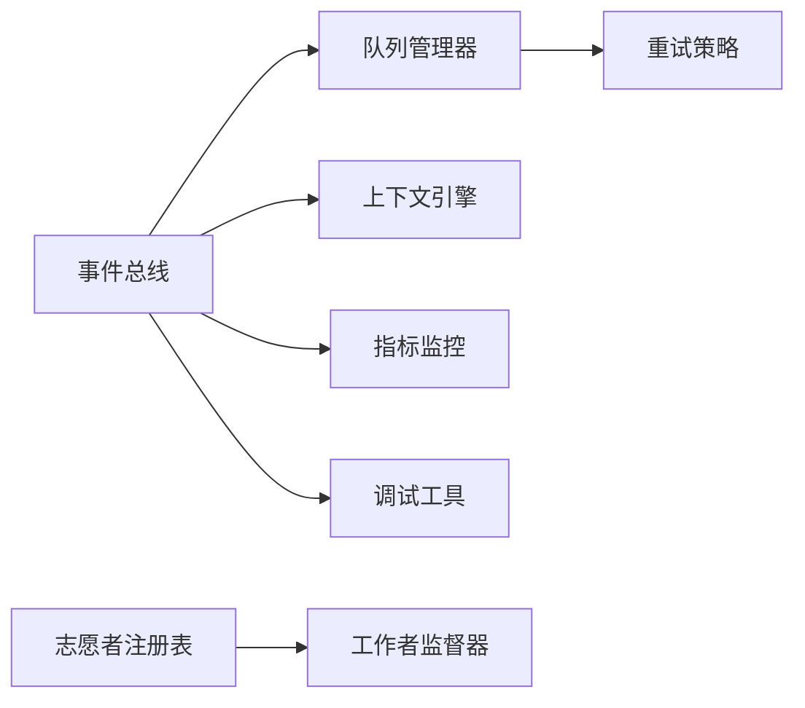

# 志愿者事件系统

<cite>
**本文引用的文件**   
- [src/core/volunteer.ts](file://src/core/volunteer.ts)
- [src/core/event-bus.ts](file://src/core/event-bus.ts)
- [src/core/queue-manager.ts](file://src/core/queue-manager.ts)
- [src/core/context-engine.ts](file://src/core/context-engine.ts)
- [src/core/worker-supervisor.ts](file://src/core/worker-supervisor.ts)
- [src/core/retry-strategy.ts](file://src/core/retry-strategy.ts)
- [src/core/metrics-monitor.ts](file://src/core/metrics-monitor.ts)
- [src/core/debug-tools.ts](file://src/core/debug-tools.ts)
- [test/volunteer-context.test.ts](file://test/volunteer-context.test.ts)
- [test/handlers.test.ts](file://test/handlers.test.ts)
- [test/queue-lock-retry.test.ts](file://test/queue-lock-retry.test.ts)
</cite>

## 目录
1. [简介](#简介)
2. [项目结构](#项目结构)
3. [核心组件](#核心组件)
4. [架构总览](#架构总览)
5. [详细组件分析](#详细组件分析)
6. [依赖关系分析](#依赖关系分析)
7. [性能考量](#性能考量)
8. [故障排查指南](#故障排查指南)
9. [结论](#结论)
10. [附录](#附录)

## 简介
本文件面向 GBrain 的“志愿者事件系统”，围绕事件驱动架构展开，系统性阐述发布订阅、异步消息传递与回调机制；覆盖志愿者的注册与发现、生命周期管理、依赖注入与状态同步；记录事件的发布与处理流程（序列化、队列管理与重试策略）；解释上下文感知的事件处理（作用域隔离、权限控制、资源限制）；并提供自定义事件处理器开发指南（接口定义、错误处理、性能调优），以及事件监控、调试工具与故障恢复的实现细节。

## 项目结构
志愿者事件系统位于 src/core 下，采用分层与职责分离的组织方式：
- 事件总线：负责事件类型注册、路由分发与订阅者匹配
- 队列管理器：提供持久化或内存队列、背压与并发控制
- 重试策略：封装退避、幂等与失败分类
- 上下文引擎：为事件处理提供作用域、权限与资源约束
- 工作者监督器：管理志愿者进程/线程的生命周期与重启
- 指标与调试：采集关键指标、暴露诊断能力

图表来源
- [src/core/event-bus.ts](file://src/core/event-bus.ts)
- [src/core/queue-manager.ts](file://src/core/queue-manager.ts)
- [src/core/retry-strategy.ts](file://src/core/retry-strategy.ts)
- [src/core/context-engine.ts](file://src/core/context-engine.ts)
- [src/core/worker-supervisor.ts](file://src/core/worker-supervisor.ts)
- [src/core/volunteer.ts](file://src/core/volunteer.ts)
- [src/core/metrics-monitor.ts](file://src/core/metrics-monitor.ts)
- [src/core/debug-tools.ts](file://src/core/debug-tools.ts)

章节来源
- [src/core/event-bus.ts](file://src/core/event-bus.ts)
- [src/core/queue-manager.ts](file://src/core/queue-manager.ts)
- [src/core/retry-strategy.ts](file://src/core/retry-strategy.ts)
- [src/core/context-engine.ts](file://src/core/context-engine.ts)
- [src/core/worker-supervisor.ts](file://src/core/worker-supervisor.ts)
- [src/core/volunteer.ts](file://src/core/volunteer.ts)
- [src/core/metrics-monitor.ts](file://src/core/metrics-monitor.ts)
- [src/core/debug-tools.ts](file://src/core/debug-tools.ts)

## 核心组件
- 事件总线：维护事件类型到处理器集合的映射，支持按主题/标签过滤，提供同步与异步两种投递模式，并集成上下文注入与指标上报。
- 队列管理器：对高吞吐场景提供缓冲与限流，保证顺序性（可选）、去重与持久化，配合重试策略实现可靠投递。
- 重试策略：基于指数退避与抖动，结合失败分类（可重试/不可重试）与幂等键，避免风暴式重试。
- 上下文引擎：在事件处理前构建作用域、注入权限与资源配额，确保跨边界安全与稳定。
- 工作者监督器：以进程/线程池形式运行志愿者处理器，负责健康检查、优雅退出与自动重启。
- 志愿者注册表：集中管理处理器声明、版本与能力元数据，支持动态发现与热更新。
- 指标与调试：采集延迟、吞吐、错误率与队列深度，提供快照、回放与链路追踪。

章节来源
- [src/core/event-bus.ts](file://src/core/event-bus.ts)
- [src/core/queue-manager.ts](file://src/core/queue-manager.ts)
- [src/core/retry-strategy.ts](file://src/core/retry-strategy.ts)
- [src/core/context-engine.ts](file://src/core/context-engine.ts)
- [src/core/worker-supervisor.ts](file://src/core/worker-supervisor.ts)
- [src/core/volunteer.ts](file://src/core/volunteer.ts)
- [src/core/metrics-monitor.ts](file://src/core/metrics-monitor.ts)
- [src/core/debug-tools.ts](file://src/core/debug-tools.ts)

## 架构总览
下图展示了从事件发布到处理的端到端路径，包括序列化、入队、调度、上下文注入、执行与重试。

图表来源
- [src/core/event-bus.ts](file://src/core/event-bus.ts)
- [src/core/queue-manager.ts](file://src/core/queue-manager.ts)
- [src/core/retry-strategy.ts](file://src/core/retry-strategy.ts)
- [src/core/context-engine.ts](file://src/core/context-engine.ts)
- [src/core/metrics-monitor.ts](file://src/core/metrics-monitor.ts)

## 详细组件分析

### 事件总线与发布订阅
- 设计要点
  - 事件类型注册：集中维护处理器清单，支持多订阅者与通配符匹配。
  - 异步投递：默认将事件推入队列，由消费者拉取，降低耦合与峰值压力。
  - 回调机制：可选同步回调用于快速路径（如本地日志），但需考虑阻塞风险。
  - 上下文注入：在投递前注入请求级上下文，供处理器读取。
- 关键流程
  - 发布：序列化 -> 校验 -> 入队 -> 上报指标
  - 分发：根据类型/标签选择处理器集合 -> 并行或串行投递
  - 完成：成功回执或失败进入重试

图表来源
- [src/core/event-bus.ts](file://src/core/event-bus.ts)
- [src/core/queue-manager.ts](file://src/core/queue-manager.ts)
- [src/core/retry-strategy.ts](file://src/core/retry-strategy.ts)

章节来源
- [src/core/event-bus.ts](file://src/core/event-bus.ts)
- [src/core/queue-manager.ts](file://src/core/queue-manager.ts)
- [src/core/retry-strategy.ts](file://src/core/retry-strategy.ts)

### 队列管理与可靠性
- 特性
  - 持久化与内存双模式：生产环境建议持久化，测试可用内存。
  - 顺序性与分区：可按事件键分区保证局部有序。
  - 背压与限流：基于令牌桶或滑动窗口控制吞吐。
  - 幂等与去重：基于幂等键避免重复处理。
- 重试与死信
  - 指数退避+抖动，最大重试次数与冷却期。
  - 失败分类：网络/超时类可重试，业务非法直接丢弃或进死信。

图表来源
- [src/core/queue-manager.ts](file://src/core/queue-manager.ts)
- [src/core/retry-strategy.ts](file://src/core/retry-strategy.ts)

章节来源
- [src/core/queue-manager.ts](file://src/core/queue-manager.ts)
- [src/core/retry-strategy.ts](file://src/core/retry-strategy.ts)
- [test/queue-lock-retry.test.ts](file://test/queue-lock-retry.test.ts)

### 上下文感知的事件处理
- 作用域隔离：每个事件携带独立作用域，包含租户、来源、用户身份等。
- 权限控制：基于角色/范围进行访问判定，越权则拒绝。
- 资源限制：CPU/内存/外部调用配额，超限降级或拒绝。
- 生命周期：创建上下文 -> 注入依赖 -> 执行 -> 释放资源。

图表来源
- [src/core/context-engine.ts](file://src/core/context-engine.ts)
- [src/core/event-bus.ts](file://src/core/event-bus.ts)

章节来源
- [src/core/context-engine.ts](file://src/core/context-engine.ts)
- [test/volunteer-context.test.ts](file://test/volunteer-context.test.ts)

### 志愿者注册与发现、生命周期与依赖注入
- 注册与发现
  - 处理器声明：类型、版本、能力标签、资源需求。
  - 动态发现：启动时扫描与运行时热插拔，支持灰度与回滚。
- 生命周期
  - 初始化 -> 就绪 -> 运行 -> 停止 -> 销毁
  - 健康检查与自愈：心跳、探针、自动重启
- 依赖注入
  - 容器化注入：数据库、缓存、配置、外部服务客户端
  - 作用域绑定：单例/请求级/事件级

图表来源
- [src/core/volunteer.ts](file://src/core/volunteer.ts)
- [src/core/worker-supervisor.ts](file://src/core/worker-supervisor.ts)

章节来源
- [src/core/volunteer.ts](file://src/core/volunteer.ts)
- [src/core/worker-supervisor.ts](file://src/core/worker-supervisor.ts)
- [test/handlers.test.ts](file://test/handlers.test.ts)

### 事件序列化与传输契约
- 序列化格式：统一头部（类型、版本、幂等键、时间戳、签名）+ 载荷体
- 校验与兼容：向后兼容字段、必填校验、签名验证
- 传输优化：压缩、批量化、分片

章节来源
- [src/core/event-bus.ts](file://src/core/event-bus.ts)
- [src/core/queue-manager.ts](file://src/core/queue-manager.ts)

### 自定义事件处理器开发指南
- 接口约定
  - 处理器函数签名：接收上下文与事件，返回结果或抛出结构化错误
  - 元数据声明：能力标签、资源需求、重试策略偏好
- 错误处理
  - 区分可重试/不可重试错误，附带诊断信息
  - 幂等键与去重策略
- 性能调优
  - 批量处理、零拷贝、连接复用
  - 限流与熔断、超时与取消
- 示例参考
  - 参见测试用例中的处理器实现范式与断言方式

章节来源
- [test/handlers.test.ts](file://test/handlers.test.ts)
- [src/core/volunteer.ts](file://src/core/volunteer.ts)

### 事件监控系统
- 指标维度
  - 发布/消费速率、P95/P99 延迟、错误率、重试次数、队列深度
  - 处理器健康度、资源使用率、配额命中率
- 告警与可视化
  - 阈值告警、趋势分析、热点事件识别
- 采样与降采样
  - 自适应采样、关键路径全量、非关键路径抽样

章节来源
- [src/core/metrics-monitor.ts](file://src/core/metrics-monitor.ts)

### 调试工具与故障恢复
- 调试能力
  - 事件回放：按条件筛选并重放历史事件
  - 链路追踪：跨组件 TraceID 串联
  - 快照导出：队列、上下文、处理器状态快照
- 故障恢复
  - 死信队列与人工介入
  - 补偿任务与幂等修复
  - 滚动重启与灰度切换

章节来源
- [src/core/debug-tools.ts](file://src/core/debug-tools.ts)
- [src/core/retry-strategy.ts](file://src/core/retry-strategy.ts)

## 依赖关系分析
- 松耦合：事件总线仅依赖抽象的队列与上下文接口，便于替换实现
- 内聚性：重试策略与队列管理器紧密协作，形成可靠投递闭环
- 外部依赖：存储后端（持久化队列）、指标后端（时序库）、日志系统
- 潜在环依赖：通过接口解耦避免循环引用

图表来源
- [src/core/event-bus.ts](file://src/core/event-bus.ts)
- [src/core/queue-manager.ts](file://src/core/queue-manager.ts)
- [src/core/retry-strategy.ts](file://src/core/retry-strategy.ts)
- [src/core/context-engine.ts](file://src/core/context-engine.ts)
- [src/core/volunteer.ts](file://src/core/volunteer.ts)
- [src/core/worker-supervisor.ts](file://src/core/worker-supervisor.ts)
- [src/core/metrics-monitor.ts](file://src/core/metrics-monitor.ts)
- [src/core/debug-tools.ts](file://src/core/debug-tools.ts)

章节来源
- [src/core/event-bus.ts](file://src/core/event-bus.ts)
- [src/core/queue-manager.ts](file://src/core/queue-manager.ts)
- [src/core/retry-strategy.ts](file://src/core/retry-strategy.ts)
- [src/core/context-engine.ts](file://src/core/context-engine.ts)
- [src/core/volunteer.ts](file://src/core/volunteer.ts)
- [src/core/worker-supervisor.ts](file://src/core/worker-supervisor.ts)
- [src/core/metrics-monitor.ts](file://src/core/metrics-monitor.ts)
- [src/core/debug-tools.ts](file://src/core/debug-tools.ts)

## 性能考量
- 吞吐与延迟
  - 合理设置队列并发与批大小，避免过度竞争
  - 处理器内部尽量无锁与短临界区
- 背压与限流
  - 上游限速、下游保护，防止雪崩
- 序列化成本
  - 大对象走外存或流式处理，减少内存占用
- 资源隔离
  - 按处理器划分资源池，避免相互影响
- 观测与调优
  - 基于指标定位瓶颈，逐步放开容量

[本节为通用指导，不直接分析具体文件]

## 故障排查指南
- 常见问题
  - 事件堆积：检查队列深度与消费者健康度
  - 频繁重试：查看失败分类与退避参数
  - 上下文泄漏：确认资源释放与超时取消
- 定位手段
  - 启用调试工具的事件回放与链路追踪
  - 导出快照并与指标对比
- 恢复步骤
  - 暂停生产者，清理死信，补偿缺失
  - 滚动重启问题处理器，观察恢复曲线

章节来源
- [src/core/debug-tools.ts](file://src/core/debug-tools.ts)
- [src/core/retry-strategy.ts](file://src/core/retry-strategy.ts)
- [test/queue-lock-retry.test.ts](file://test/queue-lock-retry.test.ts)

## 结论
GBrain 志愿者事件系统通过清晰的分层与职责分离，实现了高内聚、低耦合的事件驱动架构。借助可靠的队列与重试策略、严格的上下文治理与完善的监控调试能力，系统在可扩展性、稳定性与可观测性方面具备良好表现。遵循本文的开发与运维实践，可高效构建高质量的事件处理器与生态。

[本节为总结性内容，不直接分析具体文件]

## 附录
- 术语
  - 幂等键：确保同一事件多次处理不会产生副作用的唯一标识
  - 死信队列：存放无法处理的事件，供后续人工或自动化修复
  - 作用域：事件处理时的逻辑边界，包含权限、租户与资源配额
- 最佳实践
  - 始终为事件定义幂等键
  - 明确失败分类与重试上限
  - 在处理器中严格遵循上下文生命周期

[本节为补充说明，不直接分析具体文件]