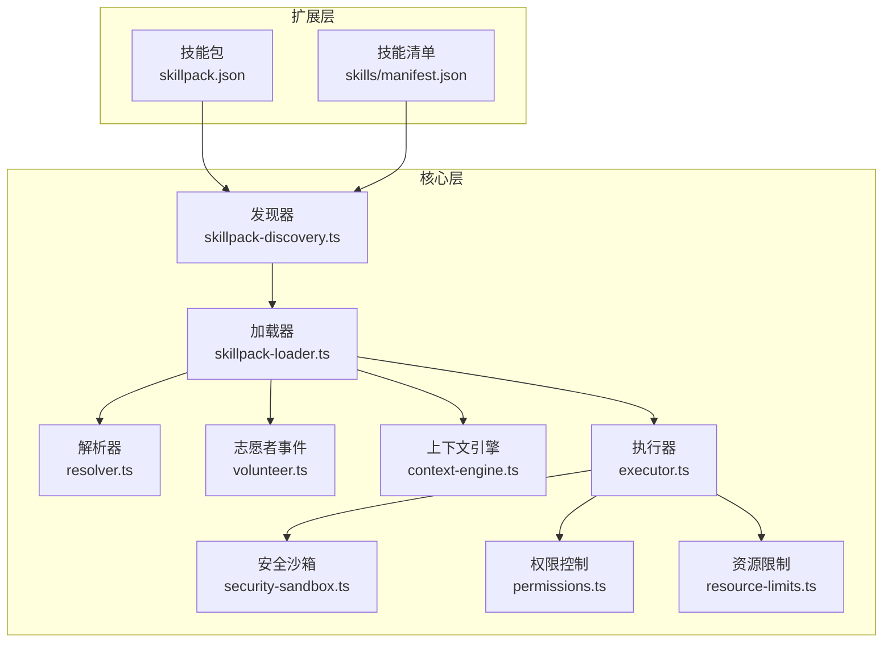
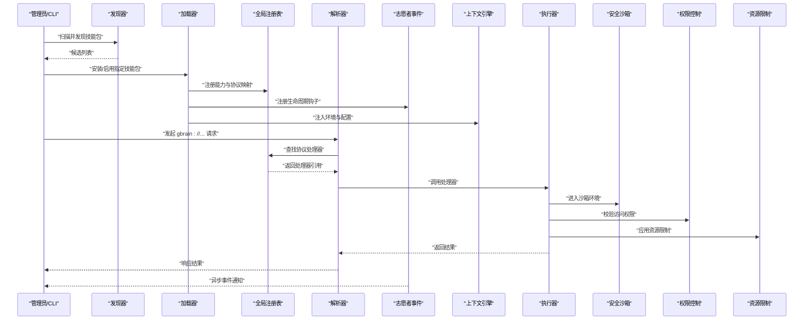
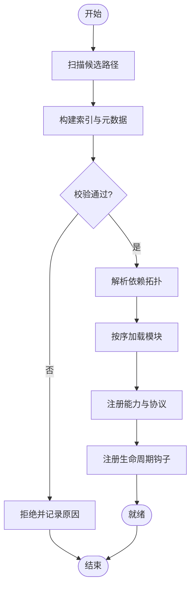
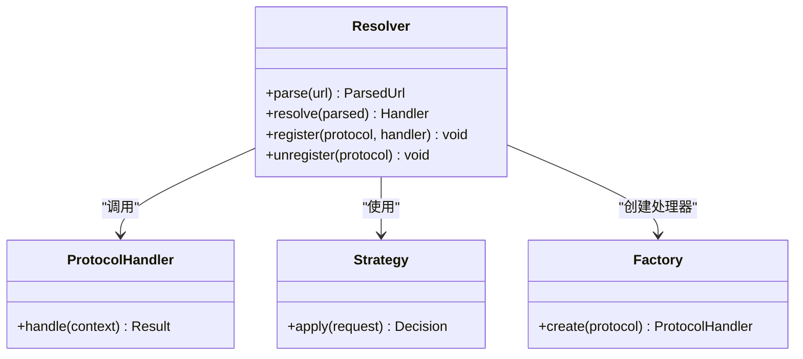
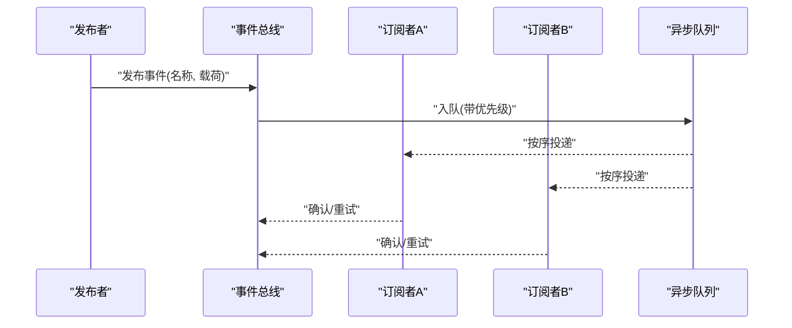
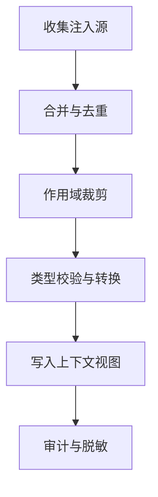
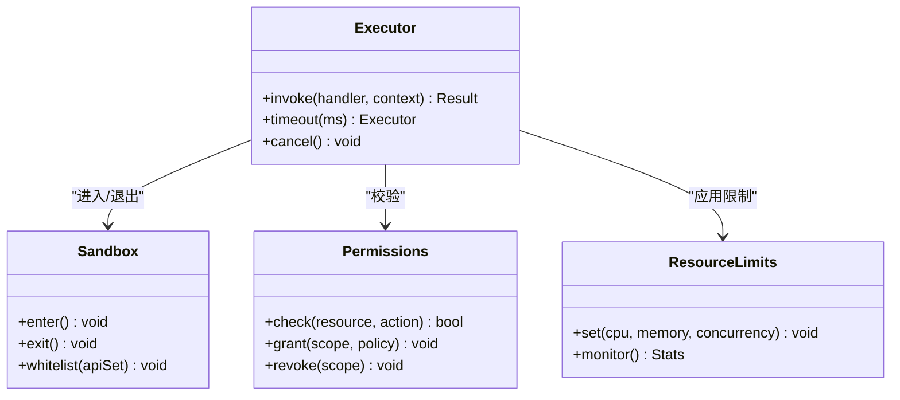
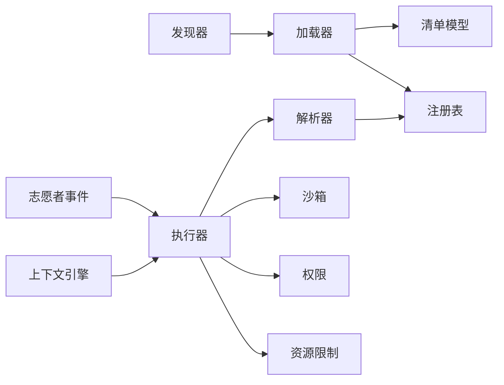

# 扩展机制设计

<cite>
**本文引用的文件**   
- [src/core/resolver.ts](file://src/core/resolver.ts)
- [src/core/volunteer.ts](file://src/core/volunteer.ts)
- [src/core/context-engine.ts](file://src/core/context-engine.ts)
- [src/core/plugin-loader.ts](file://src/core/plugin-loader.ts)
- [src/core/skillpack-manifest.ts](file://src/core/skillpack-manifest.ts)
- [src/core/skillpack-discovery.ts](file://src/core/skillpack-discovery.ts)
- [src/core/skillpack-loader.ts](file://src/core/skillpack-loader.ts)
- [src/core/executor.ts](file://src/core/executor.ts)
- [src/core/security-sandbox.ts](file://src/core/security-sandbox.ts)
- [src/core/permissions.ts](file://src/core/permissions.ts)
- [src/core/resource-limits.ts](file://src/core/resource-limits.ts)
- [examples/skillpack-reference/skillpack.json](file://examples/skillpack-reference/skillpack.json)
- [docs/GBRAIN_SKILLPACK.md](file://docs/GBRAIN_SKILLPACK.md)
- [docs/skillpack-anatomy.md](file://docs/skillpack-anatomy.md)
- [skills/manifest.json](file://skills/manifest.json)
</cite>

## 目录
1. [简介](#简介)
2. [项目结构](#项目结构)
3. [核心组件](#核心组件)
4. [架构总览](#架构总览)
5. [详细组件分析](#详细组件分析)
6. [依赖关系分析](#依赖关系分析)
7. [性能考量](#性能考量)
8. [故障排查指南](#故障排查指南)
9. [结论](#结论)
10. [附录](#附录)

## 简介
本文件系统性阐述 GBrain 的扩展机制设计，围绕以下关键主题展开：
- 技能包系统（Skillpack）的插件发现、加载与执行流程
- 解析器（Resolver）系统的设计模式：URL 解析、协议处理与动态绑定
- 志愿者（Volunteer）事件系统的发布订阅、回调注册与异步处理
- 上下文注入机制：环境变量、配置注入与运行时参数传递
- 自定义扩展开发指南：接口规范、最佳实践与测试策略
- 扩展安全沙箱、权限控制与资源限制的实现细节

目标读者包括扩展开发者、系统集成工程师与平台运维人员。文档在保持技术深度的同时，尽量以循序渐进的方式呈现，帮助不同背景的读者快速上手并深入理解。

## 项目结构
GBrain 的扩展能力由“技能包”作为基本单元进行组织与分发，并通过统一的解析器与事件系统进行集成。核心代码位于 src/core 下，示例与参考实现位于 examples/skillpack-reference 与 skills 目录中，相关规范与说明文档集中在 docs 目录。

图表来源
- [src/core/skillpack-discovery.ts](file://src/core/skillpack-discovery.ts)
- [src/core/skillpack-loader.ts](file://src/core/skillpack-loader.ts)
- [src/core/resolver.ts](file://src/core/resolver.ts)
- [src/core/volunteer.ts](file://src/core/volunteer.ts)
- [src/core/context-engine.ts](file://src/core/context-engine.ts)
- [src/core/executor.ts](file://src/core/executor.ts)
- [src/core/security-sandbox.ts](file://src/core/security-sandbox.ts)
- [src/core/permissions.ts](file://src/core/permissions.ts)
- [src/core/resource-limits.ts](file://src/core/resource-limits.ts)
- [examples/skillpack-reference/skillpack.json](file://examples/skillpack-reference/skillpack.json)
- [skills/manifest.json](file://skills/manifest.json)

章节来源
- [docs/GBRAIN_SKILLPACK.md](file://docs/GBRAIN_SKILLPACK.md)
- [docs/skillpack-anatomy.md](file://docs/skillpack-anatomy.md)
- [examples/skillpack-reference/skillpack.json](file://examples/skillpack-reference/skillpack.json)
- [skills/manifest.json](file://skills/manifest.json)

## 核心组件
本节对扩展机制的核心组件进行概览性说明，后续章节将逐一深入。

- 技能包发现器：扫描本地或远程位置，识别有效的技能包清单与元数据，构建候选集合。
- 技能包加载器：校验清单、解析依赖、初始化模块边界，并将能力注册到全局注册表。
- 解析器：统一 URL 与协议入口，按协议分派到具体处理器，支持动态绑定与优先级策略。
- 志愿者事件系统：提供事件总线、回调注册、生命周期钩子与异步调度。
- 上下文引擎：聚合环境变量、配置项与运行时参数，为扩展提供一致的上下文视图。
- 执行器与安全沙箱：负责扩展代码的执行隔离、权限校验与资源配额控制。
- 权限与资源限制：基于声明式策略与运行时约束，保障扩展行为的可控性与稳定性。

章节来源
- [src/core/skillpack-discovery.ts](file://src/core/skillpack-discovery.ts)
- [src/core/skillpack-loader.ts](file://src/core/skillpack-loader.ts)
- [src/core/resolver.ts](file://src/core/resolver.ts)
- [src/core/volunteer.ts](file://src/core/volunteer.ts)
- [src/core/context-engine.ts](file://src/core/context-engine.ts)
- [src/core/executor.ts](file://src/core/executor.ts)
- [src/core/security-sandbox.ts](file://src/core/security-sandbox.ts)
- [src/core/permissions.ts](file://src/core/permissions.ts)
- [src/core/resource-limits.ts](file://src/core/resource-limits.ts)

## 架构总览
下图展示了从技能包发现到执行的全链路交互，以及解析器与事件系统在其中的作用。

图表来源
- [src/core/skillpack-discovery.ts](file://src/core/skillpack-discovery.ts)
- [src/core/skillpack-loader.ts](file://src/core/skillpack-loader.ts)
- [src/core/resolver.ts](file://src/core/resolver.ts)
- [src/core/volunteer.ts](file://src/core/volunteer.ts)
- [src/core/context-engine.ts](file://src/core/context-engine.ts)
- [src/core/executor.ts](file://src/core/executor.ts)
- [src/core/security-sandbox.ts](file://src/core/security-sandbox.ts)
- [src/core/permissions.ts](file://src/core/permissions.ts)
- [src/core/resource-limits.ts](file://src/core/resource-limits.ts)

## 详细组件分析

### 技能包系统与插件发现、加载与执行
- 发现阶段
  - 扫描路径与索引：根据清单与索引文件定位可用技能包。
  - 元数据校验：验证版本兼容、依赖声明与签名信息。
  - 冲突检测：同协议或同名能力的冲突提示与解决策略。
- 加载阶段
  - 清单解析：读取 skillpack.json 并转换为内部模型。
  - 依赖解析：按声明顺序构建加载拓扑，避免循环依赖。
  - 模块边界：为每个技能包创建独立命名空间与上下文。
- 执行阶段
  - 能力注册：将处理器、事件钩子与资源提供者注册至全局注册表。
  - 协议绑定：将协议前缀映射到具体处理器函数。
  - 生命周期：启动、热重载、停止等钩子的有序触发。

图表来源
- [src/core/skillpack-discovery.ts](file://src/core/skillpack-discovery.ts)
- [src/core/skillpack-loader.ts](file://src/core/skillpack-loader.ts)
- [src/core/skillpack-manifest.ts](file://src/core/skillpack-manifest.ts)
- [examples/skillpack-reference/skillpack.json](file://examples/skillpack-reference/skillpack.json)

章节来源
- [src/core/skillpack-discovery.ts](file://src/core/skillpack-discovery.ts)
- [src/core/skillpack-loader.ts](file://src/core/skillpack-loader.ts)
- [src/core/skillpack-manifest.ts](file://src/core/skillpack-manifest.ts)
- [examples/skillpack-reference/skillpack.json](file://examples/skillpack-reference/skillpack.json)
- [docs/GBRAIN_SKILLPACK.md](file://docs/GBRAIN_SKILLPACK.md)
- [docs/skillpack-anatomy.md](file://docs/skillpack-anatomy.md)
- [skills/manifest.json](file://skills/manifest.json)

### 解析器（Resolver）系统：URL 解析、协议处理与动态绑定
- 设计模式
  - 策略模式：每种协议对应一个处理器策略，便于扩展新协议。
  - 责任链：支持多级解析器组合，如先本地后远端。
  - 工厂模式：根据 URL 构造处理器实例，支持懒加载。
- URL 解析
  - 标准化输入：规范化协议、主机、路径与查询参数。
  - 范围限定：结合上下文注入的作用域与命名空间。
- 协议处理
  - 协议注册：加载期完成协议到处理器的映射。
  - 动态绑定：运行期可更新映射，支持热插拔。
- 错误与回退
  - 明确错误码：区分未找到、无权限、超时等。
  - 回退策略：默认处理器或降级路径。

图表来源
- [src/core/resolver.ts](file://src/core/resolver.ts)

章节来源
- [src/core/resolver.ts](file://src/core/resolver.ts)

### 志愿者（Volunteer）事件系统：发布订阅、回调注册与异步处理
- 事件总线
  - 类型化事件：定义事件名与载荷结构，确保契约稳定。
  - 订阅管理：支持一次性订阅与持久订阅。
- 回调注册
  - 优先级：同一事件可注册多个回调，按优先级顺序执行。
  - 过滤：基于上下文或标签进行选择性投递。
- 异步处理
  - 并发控制：限制并发度，防止风暴。
  - 重试与补偿：失败重试、幂等保证与补偿动作。
- 生命周期钩子
  - 启动/停止：随技能包生命周期触发。
  - 健康检查：周期性探测与告警。

图表来源
- [src/core/volunteer.ts](file://src/core/volunteer.ts)

章节来源
- [src/core/volunteer.ts](file://src/core/volunteer.ts)

### 上下文注入机制：环境变量、配置注入与运行时参数
- 注入源
  - 环境变量：系统级与进程级变量。
  - 配置文件：静态配置与动态配置合并。
  - 运行时参数：请求级与会话级参数。
- 注入策略
  - 覆盖顺序：运行时 > 配置 > 环境变量 > 默认值。
  - 作用域隔离：按技能包与作用域隔离可见性。
- 安全与审计
  - 敏感字段脱敏：日志与遥测中的敏感信息保护。
  - 变更追踪：记录注入来源与时间戳。

图表来源
- [src/core/context-engine.ts](file://src/core/context-engine.ts)

章节来源
- [src/core/context-engine.ts](file://src/core/context-engine.ts)

### 执行器与安全沙箱、权限控制与资源限制
- 执行器
  - 调用封装：统一入口，捕获异常与指标。
  - 超时与取消：支持请求级超时与外部取消信号。
- 安全沙箱
  - 隔离执行：限制 I/O、网络与系统调用。
  - 白名单：仅允许受信任 API 暴露。
- 权限控制
  - 声明式策略：基于角色与资源的访问矩阵。
  - 最小权限：按需授予，动态撤销。
- 资源限制
  - CPU/内存上限：防止 OOM 与 CPU 饥饿。
  - 并发与队列长度：限流与背压。

图表来源
- [src/core/executor.ts](file://src/core/executor.ts)
- [src/core/security-sandbox.ts](file://src/core/security-sandbox.ts)
- [src/core/permissions.ts](file://src/core/permissions.ts)
- [src/core/resource-limits.ts](file://src/core/resource-limits.ts)

章节来源
- [src/core/executor.ts](file://src/core/executor.ts)
- [src/core/security-sandbox.ts](file://src/core/security-sandbox.ts)
- [src/core/permissions.ts](file://src/core/permissions.ts)
- [src/core/resource-limits.ts](file://src/core/resource-limits.ts)

### 自定义扩展开发指南
- 接口规范
  - 清单文件：遵循 skillpack.json 的结构与必填字段。
  - 能力定义：处理器、事件钩子与资源提供者的声明方式。
  - 协议约定：协议前缀、路径结构与查询参数规范。
- 最佳实践
  - 幂等与健壮：确保重复调用不产生副作用。
  - 错误分类：区分可恢复与不可恢复错误，提供诊断信息。
  - 可观测性：埋点、日志与指标上报。
- 测试策略
  - 单元测试：针对处理器与工具函数的断言。
  - 集成测试：端到端验证协议与事件链路。
  - 沙箱测试：模拟受限环境下的行为。
  - 回归与基准：性能与正确性回归用例。

章节来源
- [examples/skillpack-reference/skillpack.json](file://examples/skillpack-reference/skillpack.json)
- [docs/GBRAIN_SKILLPACK.md](file://docs/GBRAIN_SKILLPACK.md)
- [docs/skillpack-anatomy.md](file://docs/skillpack-anatomy.md)

## 依赖关系分析
- 组件耦合
  - 解析器依赖注册表与上下文；执行器依赖沙箱、权限与资源限制。
  - 志愿者事件系统与其他组件松耦合，通过事件总线解耦。
- 直接依赖
  - 加载器依赖发现器与清单模型；执行器依赖解析器与上下文。
- 间接依赖
  - 通过注册表与事件总线形成间接通信，降低硬耦合。
- 外部依赖
  - 文件系统、网络与数据库访问均受沙箱与权限控制。

图表来源
- [src/core/skillpack-discovery.ts](file://src/core/skillpack-discovery.ts)
- [src/core/skillpack-loader.ts](file://src/core/skillpack-loader.ts)
- [src/core/skillpack-manifest.ts](file://src/core/skillpack-manifest.ts)
- [src/core/resolver.ts](file://src/core/resolver.ts)
- [src/core/executor.ts](file://src/core/executor.ts)
- [src/core/security-sandbox.ts](file://src/core/security-sandbox.ts)
- [src/core/permissions.ts](file://src/core/permissions.ts)
- [src/core/resource-limits.ts](file://src/core/resource-limits.ts)
- [src/core/volunteer.ts](file://src/core/volunteer.ts)
- [src/core/context-engine.ts](file://src/core/context-engine.ts)

章节来源
- [src/core/skillpack-discovery.ts](file://src/core/skillpack-discovery.ts)
- [src/core/skillpack-loader.ts](file://src/core/skillpack-loader.ts)
- [src/core/skillpack-manifest.ts](file://src/core/skillpack-manifest.ts)
- [src/core/resolver.ts](file://src/core/resolver.ts)
- [src/core/executor.ts](file://src/core/executor.ts)
- [src/core/security-sandbox.ts](file://src/core/security-sandbox.ts)
- [src/core/permissions.ts](file://src/core/permissions.ts)
- [src/core/resource-limits.ts](file://src/core/resource-limits.ts)
- [src/core/volunteer.ts](file://src/core/volunteer.ts)
- [src/core/context-engine.ts](file://src/core/context-engine.ts)

## 性能考量
- 解析器缓存：对热点协议与路径进行结果缓存，减少重复计算。
- 事件批处理：批量投递与合并，降低队列开销。
- 执行限流：基于令牌桶或漏桶算法控制并发与速率。
- 资源监控：实时采集 CPU、内存与 I/O 指标，触发自动缩放或熔断。
- 冷启动优化：延迟加载处理器与惰性初始化上下文。

[本节为通用指导，无需特定文件来源]

## 故障排查指南
- 常见问题
  - 协议未注册：检查加载期是否成功注册处理器。
  - 权限不足：核对权限策略与资源访问矩阵。
  - 资源超限：查看资源限制阈值与监控指标。
  - 事件丢失：确认订阅者与队列状态，检查重试与补偿逻辑。
- 诊断步骤
  - 启用详细日志与审计，定位错误堆栈与上下文快照。
  - 使用最小复现用例与隔离环境，逐步缩小问题范围。
  - 回放事件与请求轨迹，对比期望与实际差异。

章节来源
- [src/core/executor.ts](file://src/core/executor.ts)
- [src/core/security-sandbox.ts](file://src/core/security-sandbox.ts)
- [src/core/permissions.ts](file://src/core/permissions.ts)
- [src/core/resource-limits.ts](file://src/core/resource-limits.ts)
- [src/core/volunteer.ts](file://src/core/volunteer.ts)

## 结论
GBrain 的扩展机制以技能包为核心单元，通过发现、加载与执行的完整链路，结合解析器与事件系统，实现了高内聚、低耦合的扩展生态。上下文注入与安全沙箱、权限控制和资源限制共同保障了扩展的安全性与稳定性。遵循本文档的接口规范与最佳实践，开发者可以快速构建高质量、可维护的扩展能力。

[本节为总结性内容，无需特定文件来源]

## 附录
- 术语表
  - 技能包：包含一组能力、协议与事件的打包单元。
  - 解析器：将 URL 与协议映射到具体处理器的组件。
  - 志愿者事件：系统内异步消息与生命周期钩子的抽象。
  - 上下文注入：将环境变量、配置与运行时参数注入到扩展运行时的过程。
  - 安全沙箱：限制扩展执行环境的隔离机制。
- 参考清单
  - 清单文件示例：参见示例技能包的清单文件。
  - 官方文档：技能包规范与解剖说明。

章节来源
- [examples/skillpack-reference/skillpack.json](file://examples/skillpack-reference/skillpack.json)
- [docs/GBRAIN_SKILLPACK.md](file://docs/GBRAIN_SKILLPACK.md)
- [docs/skillpack-anatomy.md](file://docs/skillpack-anatomy.md)