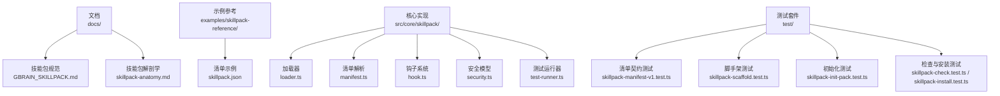
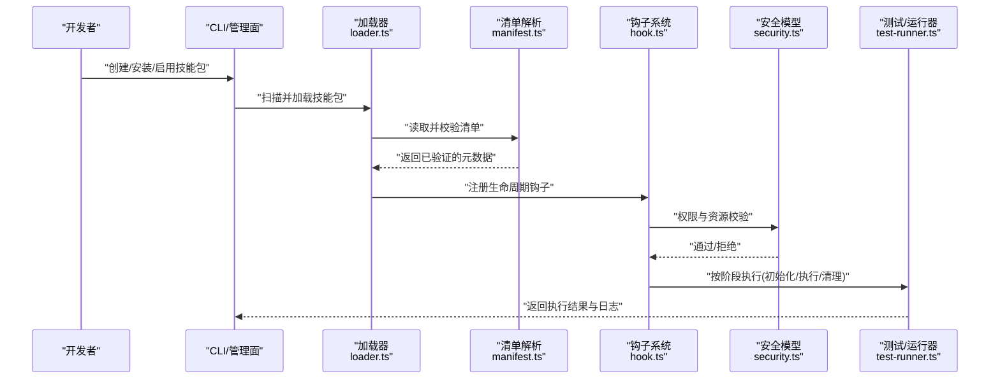
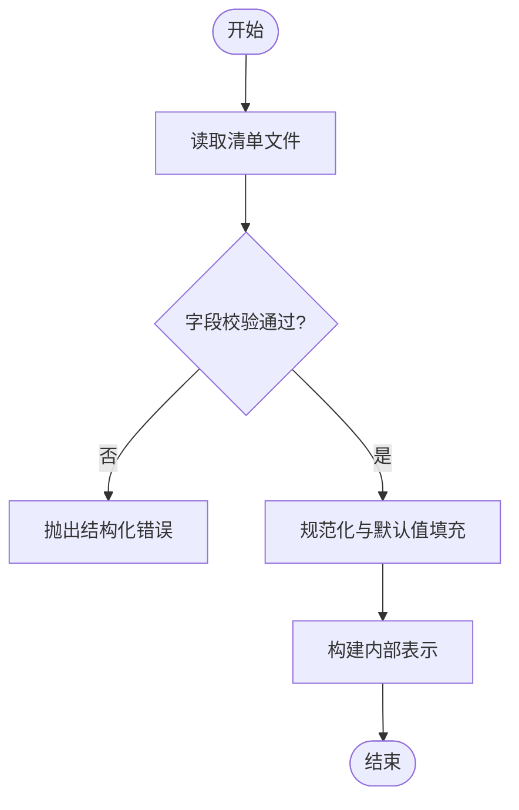
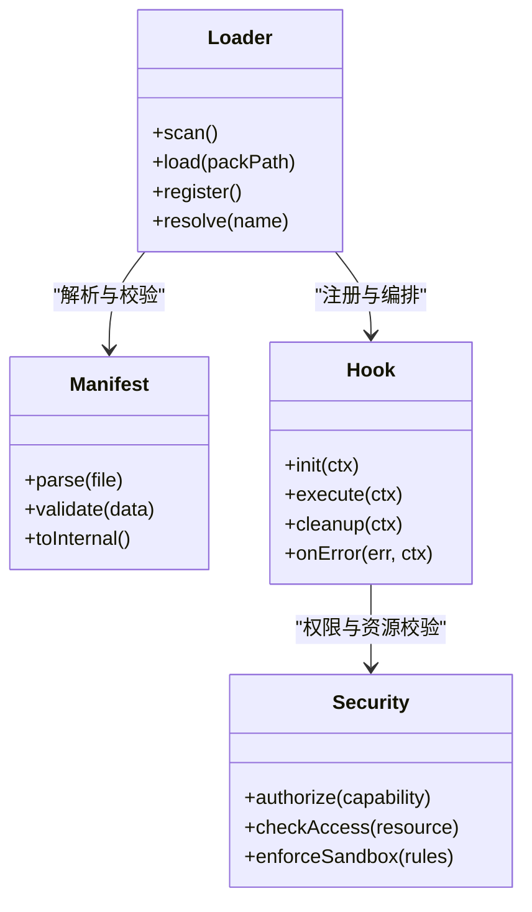
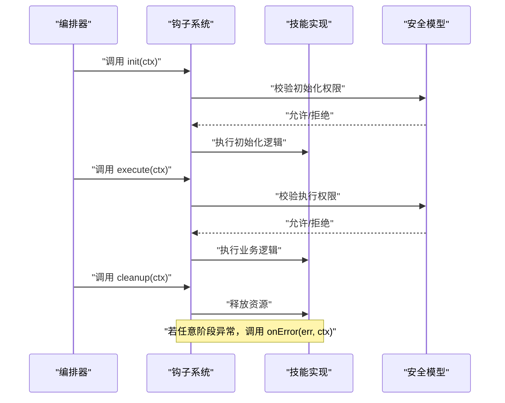
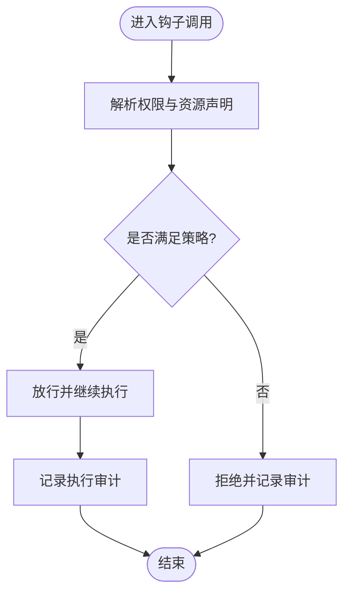
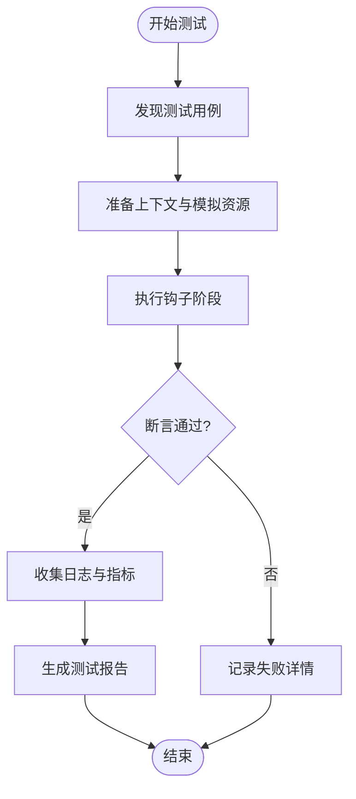
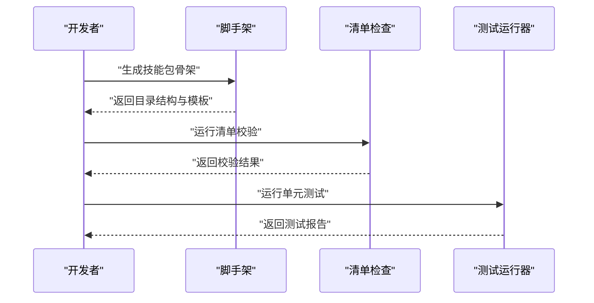
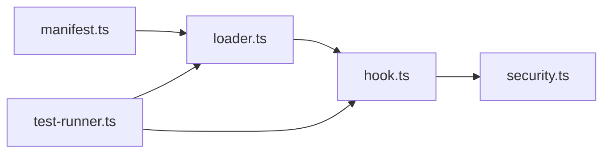

# 开发指南

<cite>
**本文引用的文件**   
- [README.md](file://README.md)
- [INSTALL.md](file://docs/INSTALL.md)
- [GBRAIN_SKILLPACK.md](file://docs/GBRAIN_SKILLPACK.md)
- [skillpack-anatomy.md](file://docs/skillpack-anatomy.md)
- [skillpack-manifest-v1.test.ts](file://test/skillpack-manifest-v1.test.ts)
- [skillpack-scaffold.test.ts](file://test/skillpack-scaffold.test.ts)
- [skillpack-init-pack.test.ts](file://test/skillpack-init-pack.test.ts)
- [skillpack-check.test.ts](file://test/skillpack-check.test.ts)
- [skillpack-install.test.ts](file://test/skillpack-install.test.ts)
- [skillpack-harvest-lint.test.ts](file://test/skillpack-harvest-lint.test.ts)
- [skillpack-reference/README.md](file://examples/skillpack-reference/README.md)
- [skillpack-reference/skillpack.json](file://examples/skillpack-reference/skillpack.json)
- [skills/_AGENT_README.md](file://skills/_AGENT_README.md)
- [src/core/skillpack/index.ts](file://src/core/skillpack/index.ts)
- [src/core/skillpack/loader.ts](file://src/core/skillpack/loader.ts)
- [src/core/skillpack/manifest.ts](file://src/core/skillpack/manifest.ts)
- [src/core/skillpack/hook.ts](file://src/core/skillpack/hook.ts)
- [src/core/skillpack/security.ts](file://src/core/skillpack/security.ts)
- [src/core/skillpack/test-runner.ts](file://src/core/skillpack/test-runner.ts)
</cite>

## 目录
1. [简介](#简介)
2. [项目结构](#项目结构)
3. [核心组件](#核心组件)
4. [架构总览](#架构总览)
5. [详细组件分析](#详细组件分析)
6. [依赖分析](#依赖分析)
7. [性能考虑](#性能考虑)
8. [故障排查指南](#故障排查指南)
9. [结论](#结论)
10. [附录](#附录)

## 简介
本指南面向希望为 GBrain 开发自定义技能包的工程师与研究者，覆盖从环境搭建、脚手架工具使用、依赖配置到开发工作流的全流程；深入说明技能包接口定义（入口函数签名、参数传递机制、返回值格式规范）；记录生命周期钩子（初始化、执行、清理、错误处理回调）；阐述安全模型（权限申请、资源访问控制、沙箱限制）；并提供调试与测试工具的使用指南（日志输出、性能分析、单元测试框架），最后给出完整示例与最佳实践建议。

## 项目结构
GBrain 仓库围绕“技能包”概念组织：文档层提供规范与教程，示例层提供参考实现，核心层提供加载、校验、运行与安全隔离能力，测试层覆盖契约与行为验证。

图表来源
- [GBRAIN_SKILLPACK.md:1-200](file://docs/GBRAIN_SKILLPACK.md#L1-L200)
- [skillpack-anatomy.md:1-200](file://docs/skillpack-anatomy.md#L1-L200)
- [examples/skillpack-reference/skillpack.json:1-200](file://examples/skillpack-reference/skillpack.json#L1-L200)
- [src/core/skillpack/loader.ts:1-200](file://src/core/skillpack/loader.ts#L1-L200)
- [src/core/skillpack/manifest.ts:1-200](file://src/core/skillpack/manifest.ts#L1-L200)
- [src/core/skillpack/hook.ts:1-200](file://src/core/skillpack/hook.ts#L1-L200)
- [src/core/skillpack/security.ts:1-200](file://src/core/skillpack/security.ts#L1-L200)
- [src/core/skillpack/test-runner.ts:1-200](file://src/core/skillpack/test-runner.ts#L1-L200)
- [test/skillpack-manifest-v1.test.ts:1-200](file://test/skillpack-manifest-v1.test.ts#L1-L200)
- [test/skillpack-scaffold.test.ts:1-200](file://test/skillpack-scaffold.test.ts#L1-L200)
- [test/skillpack-init-pack.test.ts:1-200](file://test/skillpack-init-pack.test.ts#L1-L200)
- [test/skillpack-check.test.ts:1-200](file://test/skillpack-check.test.ts#L1-L200)
- [test/skillpack-install.test.ts:1-200](file://test/skillpack-install.test.ts#L1-L200)

章节来源
- [README.md:1-200](file://README.md#L1-L200)
- [docs/INSTALL.md:1-200](file://docs/INSTALL.md#L1-L200)
- [docs/GBRAIN_SKILLPACK.md:1-200](file://docs/GBRAIN_SKILLPACK.md#L1-L200)
- [docs/skillpack-anatomy.md:1-200](file://docs/skillpack-anatomy.md#L1-L200)

## 核心组件
本节聚焦技能包在 GBrain 中的关键抽象与职责边界：清单与元数据、加载与发现、钩子与生命周期、安全与沙箱、测试与可观测性。

- 清单与元数据
  - 负责描述技能包版本、能力声明、权限需求、入口点、依赖与约束等。
  - 通过清单解析模块进行校验与规范化，确保运行时一致性。
- 加载与发现
  - 负责扫描、装载、注册技能包，建立能力索引与触发映射。
  - 支持本地与远程源的安装与更新。
- 钩子与生命周期
  - 提供初始化、执行、清理、错误处理等回调点，供技能包实现业务逻辑。
  - 统一编排调用顺序与上下文注入。
- 安全与沙箱
  - 基于权限模型与资源白名单对技能包进行最小授权。
  - 在受限环境中执行，阻断危险操作与越权访问。
- 测试与可观测性
  - 提供测试运行器与断言工具，支持单元与集成测试。
  - 标准化日志与指标输出，便于定位问题与性能分析。

章节来源
- [src/core/skillpack/manifest.ts:1-200](file://src/core/skillpack/manifest.ts#L1-L200)
- [src/core/skillpack/loader.ts:1-200](file://src/core/skillpack/loader.ts#L1-L200)
- [src/core/skillpack/hook.ts:1-200](file://src/core/skillpack/hook.ts#L1-L200)
- [src/core/skillpack/security.ts:1-200](file://src/core/skillpack/security.ts#L1-L200)
- [src/core/skillpack/test-runner.ts:1-200](file://src/core/skillpack/test-runner.ts#L1-L200)

## 架构总览
下图展示技能包从清单到运行的端到端路径：清单校验 → 加载注册 → 钩子编排 → 安全拦截 → 执行与清理 → 结果回传。

图表来源
- [src/core/skillpack/loader.ts:1-200](file://src/core/skillpack/loader.ts#L1-L200)
- [src/core/skillpack/manifest.ts:1-200](file://src/core/skillpack/manifest.ts#L1-L200)
- [src/core/skillpack/hook.ts:1-200](file://src/core/skillpack/hook.ts#L1-L200)
- [src/core/skillpack/security.ts:1-200](file://src/core/skillpack/security.ts#L1-L200)
- [src/core/skillpack/test-runner.ts:1-200](file://src/core/skillpack/test-runner.ts#L1-L200)

## 详细组件分析

### 清单与元数据（manifest）
- 职责
  - 定义技能包版本、名称、描述、入口点、能力声明、权限需求、依赖项、约束条件等。
  - 提供校验规则与默认值合并，保证后续加载与运行的一致性。
- 关键流程
  - 读取清单文件 → 类型校验 → 字段规范化 → 生成内部表示 → 暴露查询接口。
- 复杂度与优化
  - 清单解析通常为线性时间，随字段数量增长；可通过增量校验与缓存减少重复开销。
- 错误处理
  - 对缺失必填字段、类型不匹配、非法枚举值等进行明确报错，便于快速修复。

图表来源
- [src/core/skillpack/manifest.ts:1-200](file://src/core/skillpack/manifest.ts#L1-L200)

章节来源
- [test/skillpack-manifest-v1.test.ts:1-200](file://test/skillpack-manifest-v1.test.ts#L1-L200)
- [examples/skillpack-reference/skillpack.json:1-200](file://examples/skillpack-reference/skillpack.json#L1-L200)

### 加载与发现（loader）
- 职责
  - 扫描本地或远程技能包目录，解析清单，注册能力与触发器，维护运行期索引。
- 关键流程
  - 发现候选包 → 解析清单 → 校验依赖与版本 → 注册钩子与路由 → 暴露查询 API。
- 耦合与内聚
  - 与 manifest 强耦合，与 hook 与 security 松耦合，便于替换与扩展。
- 性能考量
  - 采用懒加载与按需注册策略，避免一次性加载全部包导致的启动延迟。

图表来源
- [src/core/skillpack/loader.ts:1-200](file://src/core/skillpack/loader.ts#L1-L200)
- [src/core/skillpack/manifest.ts:1-200](file://src/core/skillpack/manifest.ts#L1-L200)
- [src/core/skillpack/hook.ts:1-200](file://src/core/skillpack/hook.ts#L1-L200)
- [src/core/skillpack/security.ts:1-200](file://src/core/skillpack/security.ts#L1-L200)

章节来源
- [src/core/skillpack/loader.ts:1-200](file://src/core/skillpack/loader.ts#L1-L200)
- [test/skillpack-install.test.ts:1-200](file://test/skillpack-install.test.ts#L1-L200)

### 钩子与生命周期（hook）
- 职责
  - 定义统一的回调接口，包括初始化、执行、清理与错误处理，确保各阶段上下文一致。
- 关键流程
  - 初始化阶段注入上下文与资源句柄 → 执行阶段调用具体能力 → 清理阶段释放资源 → 错误阶段捕获并上报。
- 设计要点
  - 幂等性与可重试：初始化与清理应尽可能幂等，错误处理需具备恢复策略。
  - 超时与取消：在执行阶段支持超时与取消信号，防止长时间阻塞。

图表来源
- [src/core/skillpack/hook.ts:1-200](file://src/core/skillpack/hook.ts#L1-L200)
- [src/core/skillpack/security.ts:1-200](file://src/core/skillpack/security.ts#L1-L200)

章节来源
- [src/core/skillpack/hook.ts:1-200](file://src/core/skillpack/hook.ts#L1-L200)

### 安全模型（security）
- 职责
  - 基于清单声明的权限与资源访问策略，对技能包进行最小授权与沙箱限制。
- 关键流程
  - 解析权限声明 → 构建访问控制列表 → 在钩子调用前后进行拦截与校验 → 记录审计日志。
- 沙箱限制
  - 限制文件系统、网络、进程与系统调用等敏感能力，仅开放白名单资源。
- 可扩展性
  - 支持插件化策略，便于在不同部署环境调整安全级别。

图表来源
- [src/core/skillpack/security.ts:1-200](file://src/core/skillpack/security.ts#L1-L200)

章节来源
- [src/core/skillpack/security.ts:1-200](file://src/core/skillpack/security.ts#L1-L200)

### 测试与可观测性（test-runner）
- 职责
  - 提供统一的测试运行器，支持单测与集成测试，收集日志与指标，辅助定位问题。
- 关键流程
  - 发现测试用例 → 准备上下文与模拟资源 → 执行钩子阶段 → 断言结果与副作用 → 汇总报告。
- 可观测性
  - 标准化日志输出格式，包含时间戳、阶段、上下文与错误堆栈；可选性能指标采集。

图表来源
- [src/core/skillpack/test-runner.ts:1-200](file://src/core/skillpack/test-runner.ts#L1-L200)

章节来源
- [test/skillpack-check.test.ts:1-200](file://test/skillpack-check.test.ts#L1-L200)
- [test/skillpack-harvest-lint.test.ts:1-200](file://test/skillpack-harvest-lint.test.ts#L1-L200)

### 脚手架与示例（scaffold & reference）
- 脚手架
  - 提供命令与模板，快速生成技能包骨架、清单与基础测试，降低上手成本。
- 示例参考
  - 提供完整的最小可用示例，包括清单、入口实现、测试与文档，便于对照学习。
- 工作流
  - 生成 → 本地校验 → 运行测试 → 提交与发布。

图表来源
- [test/skillpack-scaffold.test.ts:1-200](file://test/skillpack-scaffold.test.ts#L1-L200)
- [test/skillpack-init-pack.test.ts:1-200](file://test/skillpack-init-pack.test.ts#L1-L200)
- [examples/skillpack-reference/README.md:1-200](file://examples/skillpack-reference/README.md#L1-L200)

章节来源
- [test/skillpack-scaffold.test.ts:1-200](file://test/skillpack-scaffold.test.ts#L1-L200)
- [test/skillpack-init-pack.test.ts:1-200](file://test/skillpack-init-pack.test.ts#L1-L200)
- [examples/skillpack-reference/README.md:1-200](file://examples/skillpack-reference/README.md#L1-L200)
- [examples/skillpack-reference/skillpack.json:1-200](file://examples/skillpack-reference/skillpack.json#L1-L200)

## 依赖分析
- 组件耦合
  - loader 依赖 manifest 与 hook，hook 依赖 security，test-runner 依赖 hook 与 loader。
- 外部依赖
  - 清单与示例作为外部输入，测试套件作为外部验证。
- 潜在循环依赖
  - 当前分层清晰，未见直接循环；建议在新增能力时保持单向依赖。

图表来源
- [src/core/skillpack/manifest.ts:1-200](file://src/core/skillpack/manifest.ts#L1-L200)
- [src/core/skillpack/loader.ts:1-200](file://src/core/skillpack/loader.ts#L1-L200)
- [src/core/skillpack/hook.ts:1-200](file://src/core/skillpack/hook.ts#L1-L200)
- [src/core/skillpack/security.ts:1-200](file://src/core/skillpack/security.ts#L1-L200)
- [src/core/skillpack/test-runner.ts:1-200](file://src/core/skillpack/test-runner.ts#L1-L200)

章节来源
- [src/core/skillpack/index.ts:1-200](file://src/core/skillpack/index.ts#L1-L200)

## 性能考虑
- 清单解析与校验
  - 建议引入缓存与增量校验，避免重复解析相同清单。
- 加载与注册
  - 采用懒加载与按需注册，减少启动时间与内存占用。
- 钩子执行
  - 合理设置超时与并发度，避免长任务阻塞主流程。
- 安全拦截
  - 将高频校验路径优化为常量时间判断，减少分支与对象分配。
- 测试运行
  - 并行执行独立用例，复用共享上下文，缩短整体测试时长。

[本节为通用指导，无需特定文件引用]

## 故障排查指南
- 常见问题
  - 清单校验失败：检查必填字段、类型与枚举值是否符合规范。
  - 权限被拒：确认权限声明与实际访问资源一致，必要时扩大白名单。
  - 执行超时：评估任务耗时，拆分长任务或增加超时阈值。
  - 资源泄漏：确保清理钩子正确释放文件句柄、网络连接与内存。
- 诊断步骤
  - 查看测试报告与日志，定位失败阶段与上下文。
  - 使用清单检查与脚手架自检，排除模板差异。
  - 逐步缩小范围，最小化复现用例以快速定位根因。

章节来源
- [test/skillpack-check.test.ts:1-200](file://test/skillpack-check.test.ts#L1-L200)
- [test/skillpack-harvest-lint.test.ts:1-200](file://test/skillpack-harvest-lint.test.ts#L1-L200)
- [skills/_AGENT_README.md:1-200](file://skills/_AGENT_README.md#L1-L200)

## 结论
通过清单驱动、钩子编排与安全沙箱，GBrain 提供了稳定且可扩展的技能包生态。遵循本文档的接口约定、生命周期与安全策略，结合脚手架与测试工具，可高效完成自定义技能包的开发、调试与发布。

[本节为总结性内容，无需特定文件引用]

## 附录
- 快速上手
  - 使用脚手架生成最小可用技能包，参照示例清单与实现进行定制。
  - 运行清单检查与单元测试，确保符合规范与预期行为。
- 最佳实践
  - 最小权限原则：仅在清单中声明必要权限。
  - 幂等与可恢复：初始化与清理尽量幂等，错误处理具备重试与降级策略。
  - 可观测性：输出结构化日志与指标，便于追踪与排障。
  - 渐进式演进：通过清单版本与兼容性策略平滑升级。

[本节为通用指导，无需特定文件引用]