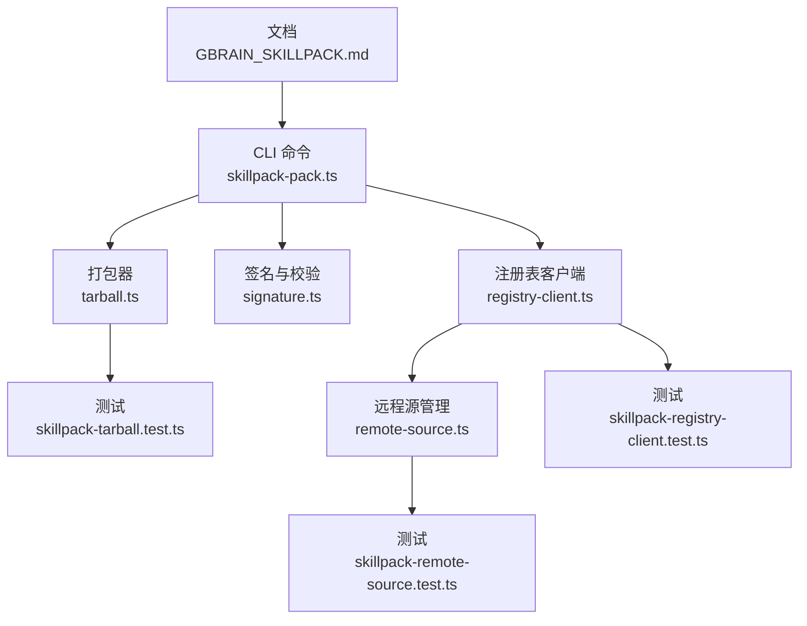
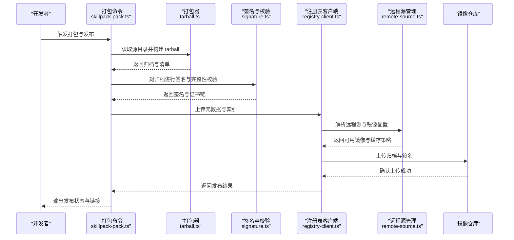
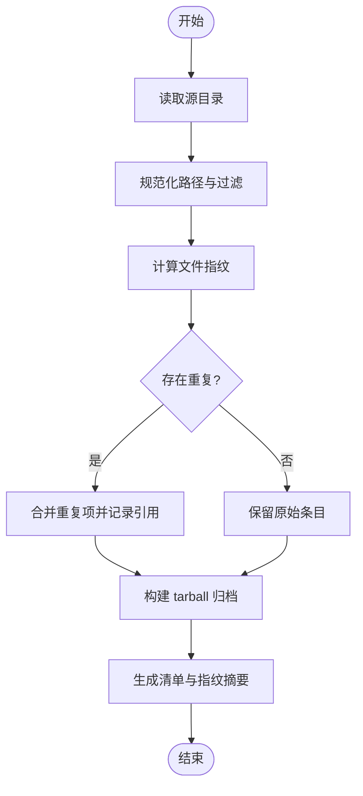
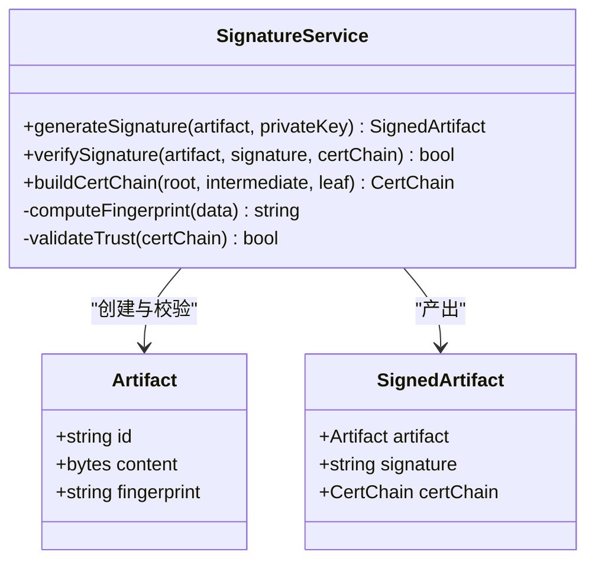
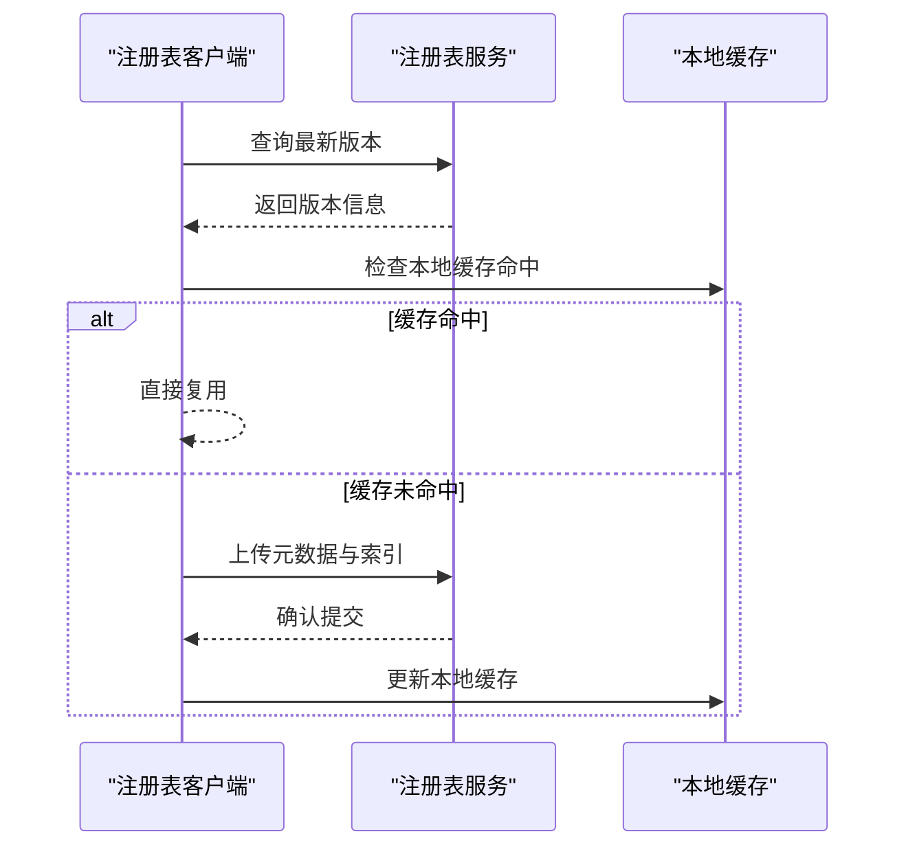
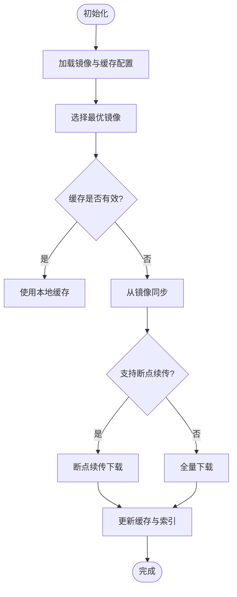
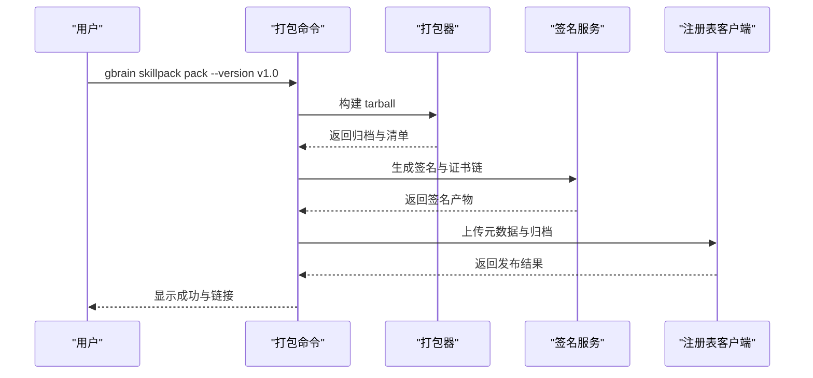
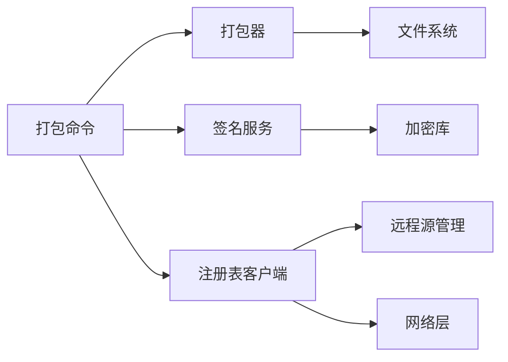

# 打包与分发

<cite>
**本文引用的文件**
- [GBRAIN_SKILLPACK.md](file://docs/GBRAIN_SKILLPACK.md)
- [skillpack-anatomy.md](file://docs/skillpack-anatomy.md)
- [RELEASING.md](file://docs/RELEASING.md)
- [skills/publish/index.ts](file://skills/publish/index.ts)
- [src/commands/skillpack-pack.ts](file://src/commands/skillpack-pack.ts)
- [src/core/skillpack/tarball.ts](file://src/core/skillpack/tarball.ts)
- [src/core/skillpack/signature.ts](file://src/core/skillpack/signature.ts)
- [src/core/skillpack/registry-client.ts](file://src/core/skillpack/registry-client.ts)
- [src/core/skillpack/remote-source.ts](file://src/core/skillpack/remote-source.ts)
- [test/skillpack-tarball.test.ts](file://test/skillpack-tarball.test.ts)
- [test/skillpack-registry-client.test.ts](file://test/skillpack-registry-client.test.ts)
- [test/skillpack-remote-source.test.ts](file://test/skillpack-remote-source.test.ts)
</cite>

## 目录
1. [简介](#简介)
2. [项目结构](#项目结构)
3. [核心组件](#核心组件)
4. [架构总览](#架构总览)
5. [详细组件分析](#详细组件分析)
6. [依赖关系分析](#依赖关系分析)
7. [性能考虑](#性能考虑)
8. [故障排查指南](#故障排查指南)
9. [结论](#结论)
10. [附录](#附录)

## 简介
本文件聚焦 GBrain 技能包的打包与分发机制，覆盖以下关键主题：
- 压缩格式与存储结构：tarball 打包算法、文件去重策略、增量更新支持
- 签名与验证：数字签名生成、证书链校验、完整性检查
- 发布流程：版本标记、元数据上传、索引更新
- 远程源管理：镜像仓库配置、缓存策略、同步协议
- 分发优化：带宽节省、并发下载、断点续传的实现细节

## 项目结构
围绕“打包与分发”的核心代码与文档分布如下：
- 规范与说明文档：技能包规范、结构解剖、发布流程
- CLI 命令入口：打包命令实现
- 核心库：tarball 打包、签名与校验、注册表客户端、远程源管理
- 测试用例：针对 tarball、注册表客户端、远程源的专项测试

图表来源
- [GBRAIN_SKILLPACK.md](file://docs/GBRAIN_SKILLPACK.md)
- [src/commands/skillpack-pack.ts](file://src/commands/skillpack-pack.ts)
- [src/core/skillpack/tarball.ts](file://src/core/skillpack/tarball.ts)
- [src/core/skillpack/signature.ts](file://src/core/skillpack/signature.ts)
- [src/core/skillpack/registry-client.ts](file://src/core/skillpack/registry-client.ts)
- [src/core/skillpack/remote-source.ts](file://src/core/skillpack/remote-source.ts)
- [test/skillpack-tarball.test.ts](file://test/skillpack-tarball.test.ts)
- [test/skillpack-registry-client.test.ts](file://test/skillpack-registry-client.test.ts)
- [test/skillpack-remote-source.test.ts](file://test/skillpack-remote-source.test.ts)

章节来源
- [GBRAIN_SKILLPACK.md](file://docs/GBRAIN_SKILLPACK.md)
- [skillpack-anatomy.md](file://docs/skillpack-anatomy.md)
- [RELEASING.md](file://docs/RELEASING.md)
- [src/commands/skillpack-pack.ts](file://src/commands/skillpack-pack.ts)
- [src/core/skillpack/tarball.ts](file://src/core/skillpack/tarball.ts)
- [src/core/skillpack/signature.ts](file://src/core/skillpack/signature.ts)
- [src/core/skillpack/registry-client.ts](file://src/core/skillpack/registry-client.ts)
- [src/core/skillpack/remote-source.ts](file://src/core/skillpack/remote-source.ts)
- [test/skillpack-tarball.test.ts](file://test/skillpack-tarball.test.ts)
- [test/skillpack-registry-client.test.ts](file://test/skillpack-registry-client.test.ts)
- [test/skillpack-remote-source.test.ts](file://test/skillpack-remote-source.test.ts)

## 核心组件
- 打包器（tarball）：负责将技能包内容按规范组织为可分发的归档文件，提供去重与增量能力。
- 签名与校验（signature）：负责生成数字签名、构建证书链、执行完整性校验。
- 注册表客户端（registry-client）：封装与注册表的交互，包括元数据上传、索引更新、版本查询。
- 远程源管理（remote-source）：管理镜像仓库配置、缓存策略与同步协议，支撑高效分发。
- CLI 命令（skillpack-pack）：对外暴露的打包入口，串联打包、签名、上传等步骤。

章节来源
- [src/commands/skillpack-pack.ts](file://src/commands/skillpack-pack.ts)
- [src/core/skillpack/tarball.ts](file://src/core/skillpack/tarball.ts)
- [src/core/skillpack/signature.ts](file://src/core/skillpack/signature.ts)
- [src/core/skillpack/registry-client.ts](file://src/core/skillpack/registry-client.ts)
- [src/core/skillpack/remote-source.ts](file://src/core/skillpack/remote-source.ts)

## 架构总览
下图展示了从打包到发布的端到端流程，以及各组件之间的调用关系。

图表来源
- [src/commands/skillpack-pack.ts](file://src/commands/skillpack-pack.ts)
- [src/core/skillpack/tarball.ts](file://src/core/skillpack/tarball.ts)
- [src/core/skillpack/signature.ts](file://src/core/skillpack/signature.ts)
- [src/core/skillpack/registry-client.ts](file://src/core/skillpack/registry-client.ts)
- [src/core/skillpack/remote-source.ts](file://src/core/skillpack/remote-source.ts)

## 详细组件分析

### 打包器（tarball）
- 职责
  - 将技能包内容按规范组织为 tarball 归档
  - 提供文件去重与增量更新支持
  - 生成用于校验的清单与指纹
- 关键点
  - 打包算法：遍历源目录，规范化路径，计算内容指纹，合并重复项
  - 增量支持：基于版本差异生成补丁或最小化变更集
  - 输出产物：归档文件、清单文件、指纹摘要
- 复杂度
  - 时间复杂度：O(N log N)（N 为文件数），主要受排序与去重影响
  - 空间复杂度：O(N)，用于缓存文件指纹与映射
- 错误处理
  - 非法路径与权限问题
  - 大文件与内存限制
  - 哈希冲突与回退策略

图表来源
- [src/core/skillpack/tarball.ts](file://src/core/skillpack/tarball.ts)
- [test/skillpack-tarball.test.ts](file://test/skillpack-tarball.test.ts)

章节来源
- [src/core/skillpack/tarball.ts](file://src/core/skillpack/tarball.ts)
- [test/skillpack-tarball.test.ts](file://test/skillpack-tarball.test.ts)

### 签名与校验（signature）
- 职责
  - 生成数字签名与证书链
  - 执行完整性校验与信任链验证
- 关键点
  - 签名算法：使用安全哈希与私钥签名
  - 证书链：包含根证书、中间证书与终端证书
  - 完整性检查：对比归档指纹与签名中的摘要
- 错误处理
  - 私钥不可用或格式错误
  - 证书链不完整或过期
  - 指纹不匹配导致拒绝加载

图表来源
- [src/core/skillpack/signature.ts](file://src/core/skillpack/signature.ts)

章节来源
- [src/core/skillpack/signature.ts](file://src/core/skillpack/signature.ts)

### 注册表客户端（registry-client）
- 职责
  - 与注册表交互，完成元数据上传与索引更新
  - 查询版本信息与可用性
- 关键点
  - 元数据结构：版本号、指纹、签名、描述、依赖
  - 索引更新：原子写入与回滚保障
  - 重试与幂等：网络异常下的可靠提交
- 错误处理
  - 认证失败与权限不足
  - 版本冲突与并发写入
  - 网络超时与降级策略

图表来源
- [src/core/skillpack/registry-client.ts](file://src/core/skillpack/registry-client.ts)
- [test/skillpack-registry-client.test.ts](file://test/skillpack-registry-client.test.ts)

章节来源
- [src/core/skillpack/registry-client.ts](file://src/core/skillpack/registry-client.ts)
- [test/skillpack-registry-client.test.ts](file://test/skillpack-registry-client.test.ts)

### 远程源管理（remote-source）
- 职责
  - 管理镜像仓库配置与选择
  - 维护缓存策略与同步协议
- 关键点
  - 镜像优先级：按延迟、带宽、地域选择最优镜像
  - 缓存策略：LRU、TTL、一致性校验
  - 同步协议：增量拉取、断点续传、并发分片
- 错误处理
  - 镜像不可达与回退
  - 缓存损坏与重建
  - 同步中断与恢复

图表来源
- [src/core/skillpack/remote-source.ts](file://src/core/skillpack/remote-source.ts)
- [test/skillpack-remote-source.test.ts](file://test/skillpack-remote-source.test.ts)

章节来源
- [src/core/skillpack/remote-source.ts](file://src/core/skillpack/remote-source.ts)
- [test/skillpack-remote-source.test.ts](file://test/skillpack-remote-source.test.ts)

### CLI 命令（skillpack-pack）
- 职责
  - 提供打包、签名、上传的一体化入口
  - 协调各组件完成发布流程
- 关键点
  - 参数解析：源目录、目标版本、签名选项、镜像配置
  - 流程编排：打包 → 签名 → 上传 → 验证
  - 用户反馈：进度、日志、错误提示
- 错误处理
  - 输入校验失败
  - 中间步骤异常与回滚
  - 最终状态报告

图表来源
- [src/commands/skillpack-pack.ts](file://src/commands/skillpack-pack.ts)

章节来源
- [src/commands/skillpack-pack.ts](file://src/commands/skillpack-pack.ts)

## 依赖关系分析
- 组件耦合
  - CLI 命令依赖打包器、签名服务、注册表客户端
  - 注册表客户端依赖远程源管理以选择镜像与缓存策略
- 外部依赖
  - 文件系统访问（打包与缓存）
  - 网络请求（注册表与镜像仓库）
  - 加密库（签名与校验）
- 循环依赖
  - 当前设计避免循环依赖，通过接口解耦

图表来源
- [src/commands/skillpack-pack.ts](file://src/commands/skillpack-pack.ts)
- [src/core/skillpack/tarball.ts](file://src/core/skillpack/tarball.ts)
- [src/core/skillpack/signature.ts](file://src/core/skillpack/signature.ts)
- [src/core/skillpack/registry-client.ts](file://src/core/skillpack/registry-client.ts)
- [src/core/skillpack/remote-source.ts](file://src/core/skillpack/remote-source.ts)

章节来源
- [src/commands/skillpack-pack.ts](file://src/commands/skillpack-pack.ts)
- [src/core/skillpack/tarball.ts](file://src/core/skillpack/tarball.ts)
- [src/core/skillpack/signature.ts](file://src/core/skillpack/signature.ts)
- [src/core/skillpack/registry-client.ts](file://src/core/skillpack/registry-client.ts)
- [src/core/skillpack/remote-source.ts](file://src/core/skillpack/remote-source.ts)

## 性能考虑
- 打包阶段
  - 并行扫描与哈希计算，减少 I/O 等待
  - 流式写入归档，降低内存峰值
- 签名阶段
  - 批量签名与流水线处理
  - 证书链预加载与缓存
- 分发阶段
  - 多镜像并发探测与选择
  - 分片下载与断点续传，提升弱网稳定性
  - 本地缓存命中率优化，减少重复传输

## 故障排查指南
- 打包失败
  - 检查源目录权限与路径合法性
  - 查看大文件与内存溢出日志
- 签名校验失败
  - 验证私钥与证书链完整性
  - 核对归档指纹与签名摘要
- 上传失败
  - 确认注册表认证与权限
  - 检查网络连通性与镜像可达性
- 缓存问题
  - 清理损坏缓存并重建
  - 调整 TTL 与 LRU 策略

章节来源
- [test/skillpack-tarball.test.ts](file://test/skillpack-tarball.test.ts)
- [test/skillpack-registry-client.test.ts](file://test/skillpack-registry-client.test.ts)
- [test/skillpack-remote-source.test.ts](file://test/skillpack-remote-source.test.ts)

## 结论
GBrain 的技能包打包与分发机制通过模块化设计与清晰的职责划分，实现了高内聚、低耦合的系统架构。打包器确保归档的高效与一致，签名服务保障安全性与可信度，注册表客户端与远程源管理协同完成可靠的发布与分发。配合完善的测试与故障排查指南，该机制具备良好的可维护性与扩展性。

## 附录
- 规范参考
  - 技能包规范与结构说明
  - 发布流程与最佳实践

章节来源
- [GBRAIN_SKILLPACK.md](file://docs/GBRAIN_SKILLPACK.md)
- [skillpack-anatomy.md](file://docs/skillpack-anatomy.md)
- [RELEASING.md](file://docs/RELEASING.md)