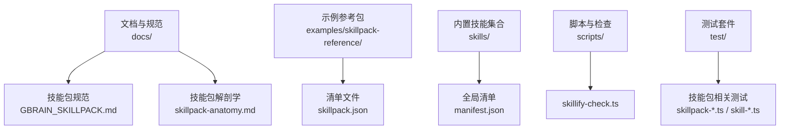
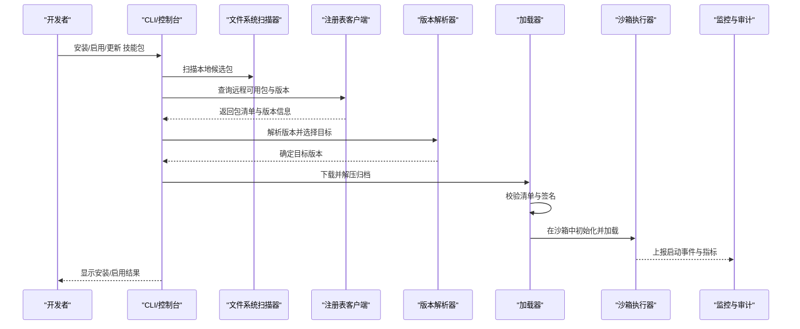
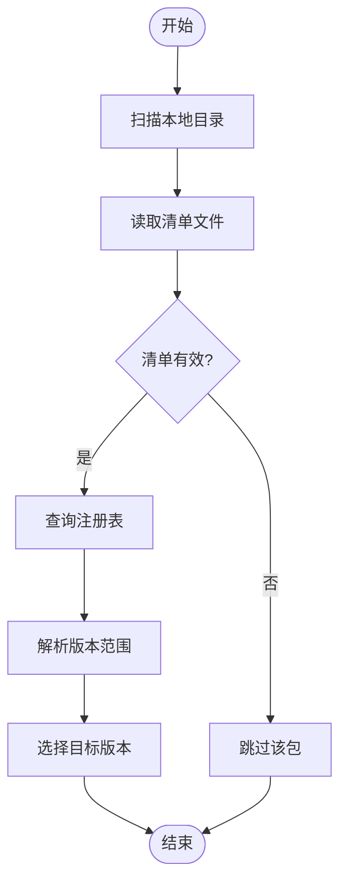
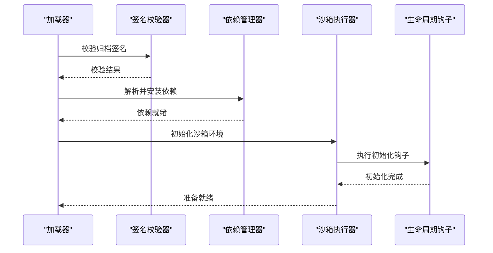
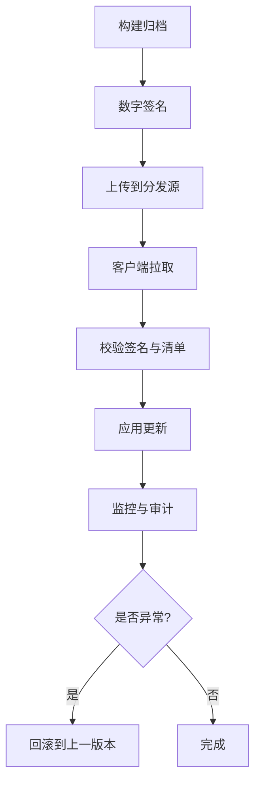
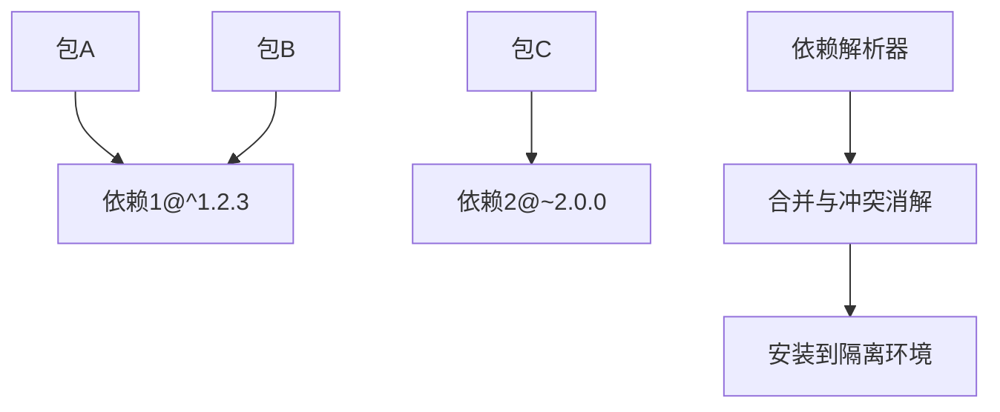

# 技能包系统

<cite>
**本文引用的文件**   
- [GBRAIN_SKILLPACK.md](file://docs/GBRAIN_SKILLPACK.md)
- [skillpack-anatomy.md](file://docs/skillpack-anatomy.md)
- [manifest.json](file://skills/manifest.json)
- [skillpack.json](file://examples/skillpack-reference/skillpack.json)
- [README.md](file://examples/skillpack-reference/README.md)
- [skillpack-check.ts](file://scripts/skillify-check.ts)
- [skillpack-harvest-lint.test.ts](file://test/skillpack-harvest-lint.test.ts)
- [skillpack-manifest-v1.test.ts](file://test/skillpack-manifest-v1.test.ts)
- [skillpack-install.test.ts](file://test/skillpack-install.test.ts)
- [skillpack-tarball.test.ts](file://test/skillpack-tarball.test.ts)
- [skillpack-registry-client.test.ts](file://test/skillpack-registry-client.test.ts)
- [skillpack-registry-schema.test.ts](file://test/skillpack-registry-schema.test.ts)
- [skillpack-bootstrap-display.test.ts](file://test/skillpack-bootstrap-display.test.ts)
- [skillpack-brain-resident-locate.test.ts](file://test/skillpack-brain-resident-locate.test.ts)
- [skillpack-changed-since-version.test.ts](file://test/skillpack-changed-since-version.test.ts)
- [skillpack-frontmatter-sources.test.ts](file://test/skillpack-frontmatter-sources.test.ts)
- [skillpack-init-pack.test.ts](file://test/skillpack-init-pack.test.ts)
- [skillpack-migrate-fence.test.ts](file://test/skillpack-migrate-fence.test.ts)
- [skillpack-nag-state.test.ts](file://test/skillpack-nag-state.test.ts)
- [skillpack-reference-apply.test.ts](file://test/skillpack-reference-apply.test.ts)
- [skillpack-reference-pack-is-ten.ts](file://test/skillpack-reference-pack-is-ten.ts)
- [skillpack-rubric-doctor.test.ts](file://test/skillpack-rubric-doctor.test.ts)
- [skillpack-scaffold-third-party.test.ts](file://test/skillpack-scaffold-third-party.test.ts)
- [skillpack-scaffold.test.ts](file://test/skillpack-scaffold.test.ts)
- [skillpack-scrub-legacy.test.ts](file://test/skillpack-scrub-legacy.test.ts)
- [skillpack-state.test.ts](file://test/skillpack-state.test.ts)
- [skillpack-trust-prompt.test.ts](file://test/skillpack-trust-prompt.test.ts)
- [skill-catalog-security.test.ts](file://test/skill-catalog-security.test.ts)
- [skill-catalog-transports.test.ts](file://test/skill-catalog-transports.test.ts)
- [skill-catalog.test.ts](file://test/skill-catalog.test.ts)
- [skill-manifest.test.ts](file://test/skill-manifest.test.ts)
- [skill-trigger-index.test.ts](file://test/skill-trigger-index.test.ts)
- [skillify-check.test.ts](file://test/skillify-check.test.ts)
- [skillify-scaffold.test.ts](file://test/skillify-scaffold.test.ts)
- [skillpack-apply-hunks.test.ts](file://test/skillpack-apply-hunks.test.ts)
- [skillpack-copy.test.ts](file://test/skillpack-copy.test.ts)
- [skillpack-endorse.test.ts](file://test/skillpack-endorse.test.ts)
- [skillpack-harvest.test.ts](file://test/skillpack-harvest.test.ts)
- [skillpack-init-brain-pack.test.ts](file://test/skillpack-init-brain-pack.test.ts)
- [skillpack-remote-source.test.ts](file://test/skillpack-remote-source.test.ts)
- [skillpack-reference.test.ts](file://test/skillpack-reference.test.ts)
- [active-pack-wiring.test.ts](file://test/active-pack-wiring.test.ts)
- [enrichable-pack.test.ts](file://test/enrichable-pack.test.ts)
- [extractable-pack.test.ts](file://test/extractable-pack.test.ts)
- [infer-type-pack.test.ts](file://test/infer-type-pack.test.ts)
- [lens-pack-manifests.test.ts](file://test/lens-pack-manifests.test.ts)
- [schema-pack-loader.test.ts](file://test/schema-pack-loader.test.ts)
- [schema-pack-registry-reload.test.ts](file://test/schema-pack-registry-reload.test.ts)
- [schema-pack-registry.test.ts](file://test/schema-pack-registry.test.ts)
- [schema-pack-sync.test.ts](file://test/schema-pack-sync.test.ts)
- [schema-pack-trust-boundary.test.ts](file://test/schema-pack-trust-boundary.test.ts)
- [source-resolver-with-tier.ts](file://test/source-resolver-with-tier.ts)
- [source-resolver.test.ts](file://test/source-resolver.test.ts)
- [sources-load.test.ts](file://test/sources-load.test.ts)
- [sources.test.ts](file://test/sources.test.ts)
</cite>

## 目录
1. [简介](#简介)
2. [项目结构](#项目结构)
3. [核心组件](#核心组件)
4. [架构总览](#架构总览)
5. [详细组件分析](#详细组件分析)
6. [依赖关系分析](#依赖关系分析)
7. [性能考量](#性能考量)
8. [故障排查指南](#故障排查指南)
9. [结论](#结论)
10. [附录](#附录)

## 简介
本文件系统化梳理 GBrain 技能包（Skillpack）体系，覆盖以下关键主题：
- 包结构与清单规范：定义 skillpack.json 的字段、版本策略与约束。
- 发现机制：文件系统扫描、注册表查询、版本解析与冲突消解。
- 加载与执行：沙箱隔离、权限控制、资源限制与生命周期钩子。
- 打包与分发：压缩格式、签名校验、更新策略与回滚。
- 自定义开发：接口契约、生命周期管理、错误处理与最佳实践。
- 测试与调试：测试框架、调试工具链与性能监控要点。

## 项目结构
技能包相关文档与示例位于 docs 与 examples 目录，核心实现与测试分布于 src 与 test 目录。为便于理解，下图给出与技能包相关的顶层组织概览（概念性）。

[本节为概念性说明，不直接分析具体文件]

## 核心组件
- 清单与元数据
  - 清单文件：每个技能包根目录包含一个清单文件，用于描述包的名称、版本、入口、依赖、能力声明等。
  - 全局清单：在 skills 目录下提供全局索引，便于快速发现与聚合。
- 发现与注册
  - 本地扫描：基于文件系统遍历，识别具备合法清单的目录作为候选包。
  - 远程注册表：通过客户端访问注册表服务，拉取可用包列表与版本信息。
  - 版本解析：遵循语义化版本规则，支持范围匹配与最高兼容选择。
- 加载与执行
  - 沙箱隔离：以受限进程或工作线程运行，限制系统调用与网络访问。
  - 权限控制：按能力白名单授予最小权限，结合信任边界进行校验。
  - 资源限制：CPU、内存、I/O 配额与超时保护。
- 打包与分发
  - 压缩格式：采用标准归档格式，包含清单、源码与必要资源。
  - 签名验证：对归档进行数字签名校验，确保来源可信与完整性。
  - 更新策略：支持增量更新、灰度发布与回滚。
- 开发与测试
  - 脚手架：提供初始化命令生成模板与默认配置。
  - 测试框架：单元测试、集成测试与端到端用例。
  - 调试工具：日志采集、断点注入与性能剖析。

章节来源
- [GBRAIN_SKILLPACK.md](file://docs/GBRAIN_SKILLPACK.md)
- [skillpack-anatomy.md](file://docs/skillpack-anatomy.md)
- [manifest.json](file://skills/manifest.json)
- [skillpack.json](file://examples/skillpack-reference/skillpack.json)
- [README.md](file://examples/skillpack-reference/README.md)

## 架构总览
下图展示技能包从发现到执行的端到端流程，涵盖本地与远程源、注册表、清单校验、沙箱执行与结果上报。

图表来源
- [skillpack-install.test.ts](file://test/skillpack-install.test.ts)
- [skillpack-registry-client.test.ts](file://test/skillpack-registry-client.test.ts)
- [skillpack-manifest-v1.test.ts](file://test/skillpack-manifest-v1.test.ts)
- [skillpack-tarball.test.ts](file://test/skillpack-tarball.test.ts)
- [skillpack-bootstrap-display.test.ts](file://test/skillpack-bootstrap-display.test.ts)

## 详细组件分析

### 清单与包结构
- 清单文件位置与命名：每个技能包根目录包含清单文件，用于描述包元数据与能力。
- 关键字段建议：
  - 标识：名称、唯一 ID、作者与维护者信息。
  - 版本：遵循语义化版本，支持预发布与构建元数据。
  - 入口：主模块路径、触发器与工具定义。
  - 依赖：内部包与外部库的版本范围。
  - 能力声明：网络、文件系统、数据库等权限需求。
  - 元数据：许可证、描述、图标、文档链接。
- 全局清单：在 skills 目录下维护全局索引，便于聚合与检索。

章节来源
- [GBRAIN_SKILLPACK.md](file://docs/GBRAIN_SKILLPACK.md)
- [skillpack-anatomy.md](file://docs/skillpack-anatomy.md)
- [manifest.json](file://skills/manifest.json)
- [skillpack.json](file://examples/skillpack-reference/skillpack.json)

### 发现机制
- 文件系统扫描：递归遍历候选目录，读取清单并过滤非法包。
- 注册表查询：通过客户端向注册表发起请求，获取包列表与版本信息。
- 版本解析：根据语义化版本规则计算满足范围的候选版本，优先选择稳定版。
- 冲突消解：当存在多版本时，依据依赖树与兼容性矩阵选择最优组合。

图表来源
- [skillpack-harvest.test.ts](file://test/skillpack-harvest.test.ts)
- [skillpack-registry-client.test.ts](file://test/skillpack-registry-client.test.ts)
- [skillpack-manifest-v1.test.ts](file://test/skillpack-manifest-v1.test.ts)

章节来源
- [skillpack-harvest.test.ts](file://test/skillpack-harvest.test.ts)
- [skillpack-registry-client.test.ts](file://test/skillpack-registry-client.test.ts)
- [skillpack-manifest-v1.test.ts](file://test/skillpack-manifest-v1.test.ts)

### 加载与执行
- 加载流程：
  - 下载与解压：从本地缓存或远程源获取归档并解压至工作目录。
  - 清单校验：验证清单字段完整性与类型正确性。
  - 签名验证：校验归档签名，拒绝未签名或签名失效的包。
  - 依赖安装：解析依赖并安装到隔离环境。
- 执行模型：
  - 沙箱隔离：使用受限进程或容器化环境，限制系统调用与网络访问。
  - 权限控制：基于能力白名单授予最小权限，结合信任边界进行校验。
  - 资源限制：设置 CPU、内存、I/O 配额与超时保护。
- 生命周期钩子：
  - 初始化：加载配置、建立连接、预热缓存。
  - 运行：响应触发器、执行业务逻辑、上报进度与结果。
  - 清理：释放资源、持久化状态、记录审计日志。

图表来源
- [skillpack-tarball.test.ts](file://test/skillpack-tarball.test.ts)
- [skillpack-bootstrap-display.test.ts](file://test/skillpack-bootstrap-display.test.ts)
- [skillpack-state.test.ts](file://test/skillpack-state.test.ts)

章节来源
- [skillpack-tarball.test.ts](file://test/skillpack-tarball.test.ts)
- [skillpack-bootstrap-display.test.ts](file://test/skillpack-bootstrap-display.test.ts)
- [skillpack-state.test.ts](file://test/skillpack-state.test.ts)

### 打包与分发
- 压缩格式：采用标准归档格式，包含清单、源码与资源文件。
- 签名验证：对归档进行数字签名，确保来源可信与完整性。
- 更新策略：
  - 增量更新：仅传输变更部分，减少带宽与时间开销。
  - 灰度发布：分批次推送新版本，观察稳定性后再全量发布。
  - 回滚：检测到异常时自动回滚到上一稳定版本。

图表来源
- [skillpack-tarball.test.ts](file://test/skillpack-tarball.test.ts)
- [skillpack-registry-client.test.ts](file://test/skillpack-registry-client.test.ts)

章节来源
- [skillpack-tarball.test.ts](file://test/skillpack-tarball.test.ts)
- [skillpack-registry-client.test.ts](file://test/skillpack-registry-client.test.ts)

### 自定义技能包开发指南
- 接口定义：
  - 触发器：定义事件类型、参数结构与返回值。
  - 工具：暴露可被调用的函数，明确输入输出与错误码。
  - 配置：提供环境变量与配置文件项，支持默认值与校验。
- 生命周期管理：
  - 初始化：加载配置、建立连接、预热缓存。
  - 运行：响应触发器、执行业务逻辑、上报进度与结果。
  - 清理：释放资源、持久化状态、记录审计日志。
- 错误处理：
  - 分类：区分业务错误、系统错误与网络错误。
  - 重试：对瞬态错误实施指数退避重试。
  - 降级：在依赖不可用时提供降级方案。
- 最佳实践：
  - 最小权限：仅申请必要的系统调用与网络访问。
  - 幂等性：确保多次执行不会产生副作用。
  - 可观测性：记录结构化日志与关键指标。

章节来源
- [GBRAIN_SKILLPACK.md](file://docs/GBRAIN_SKILLPACK.md)
- [skillpack-anatomy.md](file://docs/skillpack-anatomy.md)
- [README.md](file://examples/skillpack-reference/README.md)

### 测试框架与调试工具
- 测试框架：
  - 单元测试：针对清单解析、版本解析与依赖管理的独立测试。
  - 集成测试：模拟注册表交互、归档下载与签名校验。
  - 端到端测试：完整流程演练，包括安装、启用与执行。
- 调试工具：
  - 日志采集：收集运行时日志与审计事件。
  - 断点注入：在关键路径插入断点，辅助定位问题。
  - 性能剖析：监控 CPU、内存与 I/O 使用情况。
- 性能监控：
  - 指标上报：启动耗时、执行时长与错误率。
  - 告警阈值：设定阈值并触发告警通知。
  - 趋势分析：长期跟踪性能变化，识别退化。

章节来源
- [skillify-check.test.ts](file://test/skillify-check.test.ts)
- [skillify-scaffold.test.ts](file://test/skillify-scaffold.test.ts)
- [skillpack-scaffold.test.ts](file://test/skillpack-scaffold.test.ts)
- [skillpack-scaffold-third-party.test.ts](file://test/skillpack-scaffold-third-party.test.ts)
- [skillpack-harvest-lint.test.ts](file://test/skillpack-harvest-lint.test.ts)
- [skillpack-registry-schema.test.ts](file://test/skillpack-registry-schema.test.ts)
- [skillpack-bootstrap-display.test.ts](file://test/skillpack-bootstrap-display.test.ts)
- [skillpack-brain-resident-locate.test.ts](file://test/skillpack-brain-resident-locate.test.ts)
- [skillpack-changed-since-version.test.ts](file://test/skillpack-changed-since-version.test.ts)
- [skillpack-frontmatter-sources.test.ts](file://test/skillpack-frontmatter-sources.test.ts)
- [skillpack-init-pack.test.ts](file://test/skillpack-init-pack.test.ts)
- [skillpack-migrate-fence.test.ts](file://test/skillpack-migrate-fence.test.ts)
- [skillpack-nag-state.test.ts](file://test/skillpack-nag-state.test.ts)
- [skillpack-reference-apply.test.ts](file://test/skillpack-reference-apply.test.ts)
- [skillpack-reference-pack-is-ten.ts](file://test/skillpack-reference-pack-is-ten.ts)
- [skillpack-rubric-doctor.test.ts](file://test/skillpack-rubric-doctor.test.ts)
- [skillpack-scrub-legacy.test.ts](file://test/skillpack-scrub-legacy.test.ts)
- [skillpack-trust-prompt.test.ts](file://test/skillpack-trust-prompt.test.ts)
- [skill-catalog-security.test.ts](file://test/skill-catalog-security.test.ts)
- [skill-catalog-transports.test.ts](file://test/skill-catalog-transports.test.ts)
- [skill-catalog.test.ts](file://test/skill-catalog.test.ts)
- [skill-manifest.test.ts](file://test/skill-manifest.test.ts)
- [skill-trigger-index.test.ts](file://test/skill-trigger-index.test.ts)
- [skillpack-apply-hunks.test.ts](file://test/skillpack-apply-hunks.test.ts)
- [skillpack-copy.test.ts](file://test/skillpack-copy.test.ts)
- [skillpack-endorse.test.ts](file://test/skillpack-endorse.test.ts)
- [skillpack-init-brain-pack.test.ts](file://test/skillpack-init-brain-pack.test.ts)
- [skillpack-remote-source.test.ts](file://test/skillpack-remote-source.test.ts)
- [skillpack-reference.test.ts](file://test/skillpack-reference.test.ts)
- [active-pack-wiring.test.ts](file://test/active-pack-wiring.test.ts)
- [enrichable-pack.test.ts](file://test/enrichable-pack.test.ts)
- [extractable-pack.test.ts](file://test/extractable-pack.test.ts)
- [infer-type-pack.test.ts](file://test/infer-type-pack.test.ts)
- [lens-pack-manifests.test.ts](file://test/lens-pack-manifests.test.ts)
- [schema-pack-loader.test.ts](file://test/schema-pack-loader.test.ts)
- [schema-pack-registry-reload.test.ts](file://test/schema-pack-registry-reload.test.ts)
- [schema-pack-registry.test.ts](file://test/schema-pack-registry.test.ts)
- [schema-pack-sync.test.ts](file://test/schema-pack-sync.test.ts)
- [schema-pack-trust-boundary.test.ts](file://test/schema-pack-trust-boundary.test.ts)
- [source-resolver-with-tier.ts](file://test/source-resolver-with-tier.ts)
- [source-resolver.test.ts](file://test/source-resolver.test.ts)
- [sources-load.test.ts](file://test/sources-load.test.ts)
- [sources.test.ts](file://test/sources.test.ts)

## 依赖关系分析
技能包之间的依赖关系通过清单中的依赖声明进行管理，支持版本范围与可选依赖。下图展示依赖解析与冲突消解的概念流程。

图表来源
- [skillpack-manifest-v1.test.ts](file://test/skillpack-manifest-v1.test.ts)
- [skillpack-registry-client.test.ts](file://test/skillpack-registry-client.test.ts)

章节来源
- [skillpack-manifest-v1.test.ts](file://test/skillpack-manifest-v1.test.ts)
- [skillpack-registry-client.test.ts](file://test/skillpack-registry-client.test.ts)

## 性能考量
- 启动优化：
  - 懒加载：按需加载模块，减少初始内存占用。
  - 缓存预热：在初始化阶段预热常用资源，降低首次调用延迟。
- 执行优化：
  - 批处理：合并小任务，减少上下文切换开销。
  - 并发控制：限制并行度，避免资源争用。
- 监控与调优：
  - 指标采集：记录关键路径耗时与资源使用。
  - 热点分析：识别性能瓶颈并进行针对性优化。
  - 容量规划：根据负载趋势调整资源配额。

[本节为通用指导，不直接分析具体文件]

## 故障排查指南
- 常见问题：
  - 清单无效：检查字段完整性与类型正确性。
  - 签名失败：确认签名证书有效且未被吊销。
  - 依赖冲突：调整版本范围或移除冗余依赖。
  - 沙箱限制：确认权限白名单与资源配额设置合理。
- 诊断步骤：
  - 查看日志：收集运行时日志与审计事件。
  - 复现问题：在隔离环境中重现问题，排除干扰因素。
  - 逐步验证：从清单校验到依赖安装，逐层定位问题。
- 恢复策略：
  - 回滚版本：恢复到上一稳定版本。
  - 禁用包：暂时禁用问题包，保障系统可用性。
  - 联系维护者：提交问题报告并附上诊断信息。

章节来源
- [skillpack-check.ts](file://scripts/skillify-check.ts)
- [skillpack-harvest-lint.test.ts](file://test/skillpack-harvest-lint.test.ts)
- [skillpack-manifest-v1.test.ts](file://test/skillpack-manifest-v1.test.ts)
- [skillpack-install.test.ts](file://test/skillpack-install.test.ts)
- [skillpack-tarball.test.ts](file://test/skillpack-tarball.test.ts)
- [skillpack-registry-client.test.ts](file://test/skillpack-registry-client.test.ts)
- [skillpack-registry-schema.test.ts](file://test/skillpack-registry-schema.test.ts)
- [skillpack-bootstrap-display.test.ts](file://test/skillpack-bootstrap-display.test.ts)
- [skillpack-brain-resident-locate.test.ts](file://test/skillpack-brain-resident-locate.test.ts)
- [skillpack-changed-since-version.test.ts](file://test/skillpack-changed-since-version.test.ts)
- [skillpack-frontmatter-sources.test.ts](file://test/skillpack-frontmatter-sources.test.ts)
- [skillpack-init-pack.test.ts](file://test/skillpack-init-pack.test.ts)
- [skillpack-migrate-fence.test.ts](file://test/skillpack-migrate-fence.test.ts)
- [skillpack-nag-state.test.ts](file://test/skillpack-nag-state.test.ts)
- [skillpack-reference-apply.test.ts](file://test/skillpack-reference-apply.test.ts)
- [skillpack-reference-pack-is-ten.ts](file://test/skillpack-reference-pack-is-ten.ts)
- [skillpack-rubric-doctor.test.ts](file://test/skillpack-rubric-doctor.test.ts)
- [skillpack-scaffold-third-party.test.ts](file://test/skillpack-scaffold-third-party.test.ts)
- [skillpack-scaffold.test.ts](file://test/skillpack-scaffold.test.ts)
- [skillpack-scrub-legacy.test.ts](file://test/skillpack-scrub-legacy.test.ts)
- [skillpack-state.test.ts](file://test/skillpack-state.test.ts)
- [skillpack-trust-prompt.test.ts](file://test/skillpack-trust-prompt.test.ts)
- [skill-catalog-security.test.ts](file://test/skill-catalog-security.test.ts)
- [skill-catalog-transports.test.ts](file://test/skill-catalog-transports.test.ts)
- [skill-catalog.test.ts](file://test/skill-catalog.test.ts)
- [skill-manifest.test.ts](file://test/skill-manifest.test.ts)
- [skill-trigger-index.test.ts](file://test/skill-trigger-index.test.ts)
- [skillify-check.test.ts](file://test/skillify-check.test.ts)
- [skillify-scaffold.test.ts](file://test/skillify-scaffold.test.ts)
- [skillpack-apply-hunks.test.ts](file://test/skillpack-apply-hunks.test.ts)
- [skillpack-copy.test.ts](file://test/skillpack-copy.test.ts)
- [skillpack-endorse.test.ts](file://test/skillpack-endorse.test.ts)
- [skillpack-harvest.test.ts](file://test/skillpack-harvest.test.ts)
- [skillpack-init-brain-pack.test.ts](file://test/skillpack-init-brain-pack.test.ts)
- [skillpack-remote-source.test.ts](file://test/skillpack-remote-source.test.ts)
- [skillpack-reference.test.ts](file://test/skillpack-reference.test.ts)
- [active-pack-wiring.test.ts](file://test/active-pack-wiring.test.ts)
- [enrichable-pack.test.ts](file://test/enrichable-pack.test.ts)
- [extractable-pack.test.ts](file://test/extractable-pack.test.ts)
- [infer-type-pack.test.ts](file://test/infer-type-pack.test.ts)
- [lens-pack-manifests.test.ts](file://test/lens-pack-manifests.test.ts)
- [schema-pack-loader.test.ts](file://test/schema-pack-loader.test.ts)
- [schema-pack-registry-reload.test.ts](file://test/schema-pack-registry-reload.test.ts)
- [schema-pack-registry.test.ts](file://test/schema-pack-registry.test.ts)
- [schema-pack-sync.test.ts](file://test/schema-pack-sync.test.ts)
- [schema-pack-trust-boundary.test.ts](file://test/schema-pack-trust-boundary.test.ts)
- [source-resolver-with-tier.ts](file://test/source-resolver-with-tier.ts)
- [source-resolver.test.ts](file://test/source-resolver.test.ts)
- [sources-load.test.ts](file://test/sources-load.test.ts)
- [sources.test.ts](file://test/sources.test.ts)

## 结论
GBrain 技能包系统通过规范的清单文件、严格的签名校验与沙箱隔离，实现了安全、可扩展的技能扩展机制。其发现与加载流程兼顾本地与远程源，支持灵活的版本管理与依赖解析。配套的测试框架与调试工具为开发者提供了完善的开发生态。建议在实际使用中遵循最小权限原则，完善可观测性与容错设计，以确保系统的稳定性与安全性。

[本节为总结性内容，不直接分析具体文件]

## 附录
- 术语表：
  - 技能包：封装一组相关能力的可分发单元。
  - 清单：描述包元数据与依赖的配置文件。
  - 注册表：存储包元数据与版本的中心仓库。
  - 沙箱：隔离执行环境，限制系统与网络访问。
- 参考链接：
  - 规范文档：GBRAIN_SKILLPACK.md
  - 解剖学文档：skillpack-anatomy.md
  - 示例包：examples/skillpack-reference

[本节为补充信息，不直接分析具体文件]