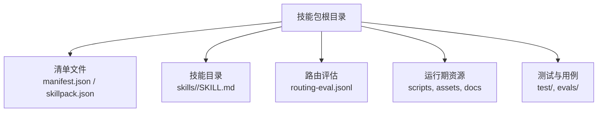
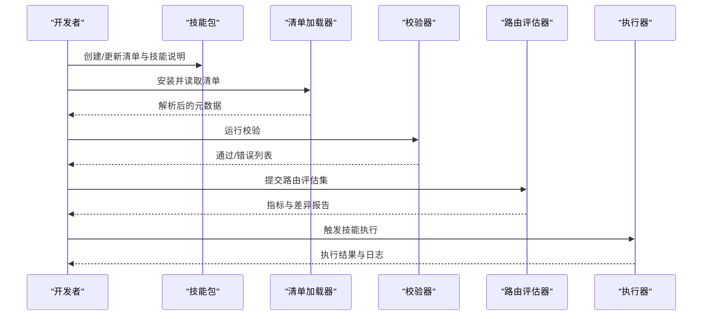
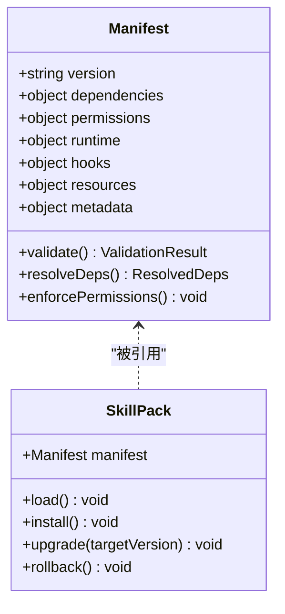
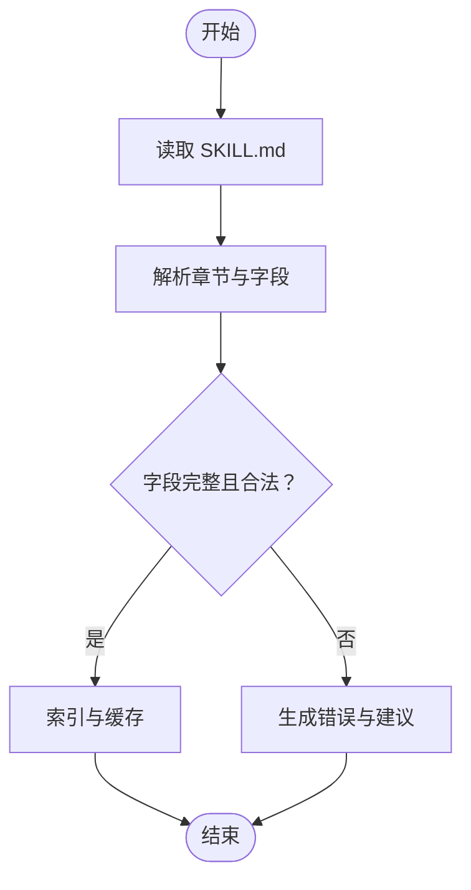
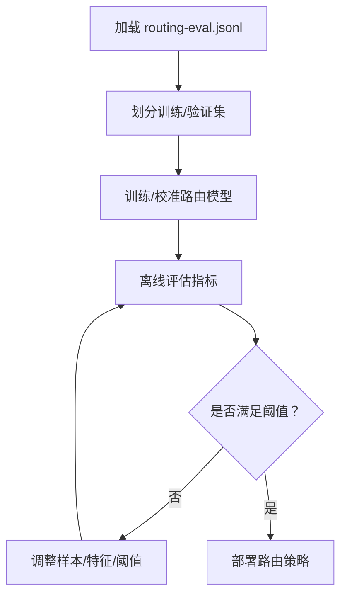
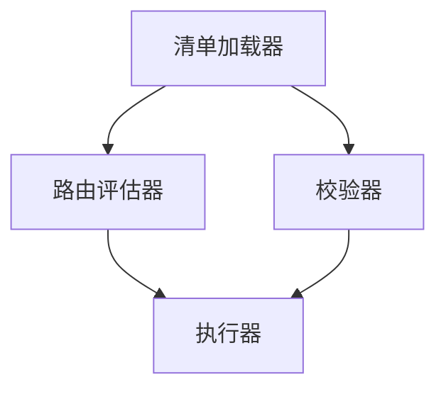

# 技能包结构规范

<cite>
**本文引用的文件**   
- [GBRAIN_SKILLPACK.md](file://docs/GBRAIN_SKILLPACK.md)
- [skillpack-anatomy.md](file://docs/skillpack-anatomy.md)
- [manifest.json](file://skills/manifest.json)
- [skillpack.json](file://examples/skillpack-reference/skillpack.json)
- [routing-eval.jsonl](file://evals/functional-area-resolver/routing-eval.jsonl)
- [SKILL.md](file://examples/skillpack-reference/skills/reference-pack/SKILL.md)
- [skillpack-manifest-v1.test.ts](file://test/skillpack-manifest-v1.test.ts)
- [skillpack-check.test.ts](file://test/skillpack-check.test.ts)
- [skillpack-scaffold.test.ts](file://test/skillpack-scaffold.test.ts)
- [skillpack-harvest-lint.test.ts](file://test/skillpack-harvest-lint.test.ts)
- [skillpack-reference.test.ts](file://test/skillpack-reference.test.ts)
- [skillpack-reference-apply.test.ts](file://test/skillpack-reference-apply.test.ts)
</cite>

## 目录
1. [简介](#简介)
2. [项目结构](#项目结构)
3. [核心组件](#核心组件)
4. [架构总览](#架构总览)
5. [详细组件分析](#详细组件分析)
6. [依赖分析](#依赖分析)
7. [性能考虑](#性能考虑)
8. [故障排查指南](#故障排查指南)
9. [结论](#结论)
10. [附录](#附录)

## 简介
本规范定义 GBrain 技能包的目录组织、清单与元数据约定、路由评估配置以及验证与错误处理机制。目标是为开发者提供从模板到发布的全链路参考，确保技能包在加载、解析、校验、执行和升级过程中具备一致性与可维护性。

## 项目结构
一个标准的 GBrain 技能包通常包含以下关键元素：
- 清单文件：位于包根目录的 manifest.json（或 skillpack.json），用于声明版本、依赖、权限、执行环境等元信息。
- 技能说明：每个技能目录下放置 SKILL.md，描述能力、输入输出、约束与示例。
- 路由评估：可选的 routing-eval.jsonl，用于训练/评估意图到技能的映射。
- 资源与脚本：按需存放代码、配置文件、测试与文档。

图表来源
- [manifest.json:1-200](file://skills/manifest.json#L1-L200)
- [skillpack.json:1-200](file://examples/skillpack-reference/skillpack.json#L1-L200)
- [SKILL.md:1-200](file://examples/skillpack-reference/skills/reference-pack/SKILL.md#L1-L200)
- [routing-eval.jsonl:1-200](file://evals/functional-area-resolver/routing-eval.jsonl#L1-L200)

章节来源
- [GBRAIN_SKILLPACK.md:1-200](file://docs/GBRAIN_SKILLPACK.md#L1-L200)
- [skillpack-anatomy.md:1-200](file://docs/skillpack-anatomy.md#L1-L200)

## 核心组件
- 清单文件（manifest.json 或 skillpack.json）
  - 字段涵盖：版本管理、依赖声明、权限配置、执行环境设置、入口与生命周期钩子、资源路径、元数据与标签等。
  - 建议遵循语义化版本；对依赖使用精确或兼容范围；明确运行时环境与平台要求。
- 技能说明（SKILL.md）
  - 描述技能用途、触发条件、输入参数、输出格式、副作用与注意事项。
  - 建议包含示例调用与失败场景说明，便于自动化评估与人类审阅。
- 路由评估（routing-eval.jsonl）
  - 每行一条样本，包含用户意图与期望技能匹配结果，用于训练/评估路由质量。
  - 建议覆盖边界用例、歧义意图与多技能竞争场景。

章节来源
- [manifest.json:1-200](file://skills/manifest.json#L1-L200)
- [skillpack.json:1-200](file://examples/skillpack-reference/skillpack.json#L1-L200)
- [SKILL.md:1-200](file://examples/skillpack-reference/skills/reference-pack/SKILL.md#L1-L200)
- [routing-eval.jsonl:1-200](file://evals/functional-area-resolver/routing-eval.jsonl#L1-L200)

## 架构总览
下图展示技能包从安装到加载、校验、路由与执行的端到端流程。

图表来源
- [manifest.json:1-200](file://skills/manifest.json#L1-L200)
- [skillpack.json:1-200](file://examples/skillpack-reference/skillpack.json#L1-L200)
- [routing-eval.jsonl:1-200](file://evals/functional-area-resolver/routing-eval.jsonl#L1-L200)
- [SKILL.md:1-200](file://examples/skillpack-reference/skills/reference-pack/SKILL.md#L1-L200)

## 详细组件分析

### 清单文件（manifest.json / skillpack.json）字段规范
- 版本管理
  - 版本号采用语义化版本；记录变更摘要与迁移步骤。
  - 支持向后兼容策略与弃用标记。
- 依赖声明
  - 列出外部技能包、系统库与模型依赖；指定最小/最大兼容版本。
  - 冲突检测与降级策略应可配置。
- 权限配置
  - 声明网络访问、文件系统读写、进程执行等权限；最小权限原则。
  - 敏感权限需显式授权并可审计。
- 执行环境设置
  - 指定运行时版本、环境变量、工作目录与沙箱策略。
  - 资源限制（CPU/内存/超时）与重试策略。
- 入口与生命周期
  - 定义初始化、就绪、关闭等钩子；注册工具与事件订阅。
- 资源与元数据
  - 图标、文档链接、作者与维护者信息；标签与分类。
- 安全与合规
  - 签名校验、白名单/黑名单、内容扫描与合规检查开关。

图表来源
- [manifest.json:1-200](file://skills/manifest.json#L1-L200)
- [skillpack.json:1-200](file://examples/skillpack-reference/skillpack.json#L1-L200)
- [skillpack-manifest-v1.test.ts:1-200](file://test/skillpack-manifest-v1.test.ts#L1-L200)

章节来源
- [manifest.json:1-200](file://skills/manifest.json#L1-L200)
- [skillpack.json:1-200](file://examples/skillpack-reference/skillpack.json#L1-L200)
- [skillpack-manifest-v1.test.ts:1-200](file://test/skillpack-manifest-v1.test.ts#L1-L200)

### 技能说明（SKILL.md）文件格式
- 必备章节
  - 名称与概述：清晰表达能力边界与适用场景。
  - 触发条件：何时由路由选择该技能。
  - 输入参数：类型、必填项、默认值与约束。
  - 输出格式：结构化返回与人类可读摘要。
  - 副作用与风险：对外部系统的写入、费用与耗时。
  - 示例：成功与失败用例。
- 可选章节
  - 依赖与前置条件、权限需求、监控与告警、回滚策略。
- 编写建议
  - 使用稳定术语；避免歧义；保持与清单字段一致。
  - 为自动化评估预留关键字段与示例。

图表来源
- [SKILL.md:1-200](file://examples/skillpack-reference/skills/reference-pack/SKILL.md#L1-L200)

章节来源
- [SKILL.md:1-200](file://examples/skillpack-reference/skills/reference-pack/SKILL.md#L1-L200)

### 路由评估（routing-eval.jsonl）配置与元数据
- 数据结构
  - 每行一条 JSON 对象，包含用户意图文本、上下文、期望技能标识与权重/置信度。
- 元数据
  - 数据集版本、采集时间、标注者、质量阈值与评估指标。
- 使用方式
  - 作为训练集或离线评测集；支持增量更新与回归对比。
- 最佳实践
  - 覆盖长尾与对抗样本；定期刷新；记录偏差与修正历史。

图表来源
- [routing-eval.jsonl:1-200](file://evals/functional-area-resolver/routing-eval.jsonl#L1-L200)

章节来源
- [routing-eval.jsonl:1-200](file://evals/functional-area-resolver/routing-eval.jsonl#L1-L200)

### 命名约定、编码与资源引用
- 命名约定
  - 技能包 slug 使用小写英文字母、数字与短横线；避免保留字与冲突名。
  - 技能目录与文件名遵循 kebab-case；常量与配置键使用 snake_case。
- 文件编码
  - 统一 UTF-8；禁止 BOM；换行符使用 LF。
- 资源引用
  - 相对路径引用资源；清单中集中声明资源哈希与版本；避免硬编码绝对路径。
  - 大资源建议外置存储并通过清单中的 URL 或 ID 引用。

章节来源
- [GBRAIN_SKILLPACK.md:1-200](file://docs/GBRAIN_SKILLPACK.md#L1-L200)
- [skillpack-anatomy.md:1-200](file://docs/skillpack-anatomy.md#L1-L200)

### 标准模板与最佳实践
- 模板结构
  - 根清单 + 多个 skills/<name>/SKILL.md + 可选 routing-eval.jsonl + test/ 与 evals/。
- 代码组织
  - 按功能域拆分目录；共享逻辑抽取为公共模块；严格隔离副作用。
- 配置文件
  - 将可变配置与环境相关项抽离至清单或外部配置源；保持幂等初始化。
- 测试布局
  - 单元测试靠近实现；集成测试置于 e2e/；评估用例置于 evals/。
- 发布流程
  - 本地校验 → 路由评估 → 预发灰度 → 全量发布；记录变更与回滚方案。

章节来源
- [skillpack-scaffold.test.ts:1-200](file://test/skillpack-scaffold.test.ts#L1-L200)
- [skillpack-reference.test.ts:1-200](file://test/skillpack-reference.test.ts#L1-L200)
- [skillpack-reference-apply.test.ts:1-200](file://test/skillpack-reference-apply.test.ts#L1-L200)

## 依赖分析
- 组件耦合
  - 清单加载器与校验器强耦合；路由评估器与执行器弱耦合，通过接口契约交互。
- 外部依赖
  - 清单解析、JSONL 解析、版本比较、权限校验与沙箱执行。
- 循环依赖
  - 应避免清单与执行器之间的双向依赖；通过事件总线或消息队列解耦。

图表来源
- [manifest.json:1-200](file://skills/manifest.json#L1-L200)
- [skillpack.json:1-200](file://examples/skillpack-reference/skillpack.json#L1-L200)
- [routing-eval.jsonl:1-200](file://evals/functional-area-resolver/routing-eval.jsonl#L1-L200)

章节来源
- [manifest.json:1-200](file://skills/manifest.json#L1-L200)
- [skillpack.json:1-200](file://examples/skillpack-reference/skillpack.json#L1-L200)

## 性能考虑
- 清单解析与校验应在安装时完成，运行时仅加载必要元数据。
- 路由评估批量处理与缓存命中优化；增量更新减少重复计算。
- 执行器资源限制与并发控制；失败快速返回与重试退避。
- 大资源分块加载与懒加载；按需下载与本地缓存。

## 故障排查指南
- 常见错误
  - 清单字段缺失或类型不合法；依赖版本冲突；权限不足；路由评估样本不足导致误判。
- 定位方法
  - 查看校验器错误列表与位置；核对路由评估指标与差异；检查执行器日志与资源可用性。
- 修复建议
  - 依据错误提示修正清单与 SKILL.md；补充路由评估样本；调整权限与资源限制；必要时回滚版本。

章节来源
- [skillpack-check.test.ts:1-200](file://test/skillpack-check.test.ts#L1-L200)
- [skillpack-harvest-lint.test.ts:1-200](file://test/skillpack-harvest-lint.test.ts#L1-L200)

## 结论
通过统一的清单与说明规范、严谨的路由评估与校验流程，GBrain 技能包可实现高内聚、低耦合的可插拔扩展。遵循本规范有助于提升稳定性、可维护性与可观测性，并为持续演进提供坚实基础。

## 附录
- 参考文档
  - 技能包解剖与结构说明
  - 清单字段与校验规则
  - 路由评估最佳实践
- 示例仓库
  - 参考技能包结构与清单样例

章节来源
- [skillpack-anatomy.md:1-200](file://docs/skillpack-anatomy.md#L1-L200)
- [GBRAIN_SKILLPACK.md:1-200](file://docs/GBRAIN_SKILLPACK.md#L1-L200)
- [skillpack.json:1-200](file://examples/skillpack-reference/skillpack.json#L1-L200)