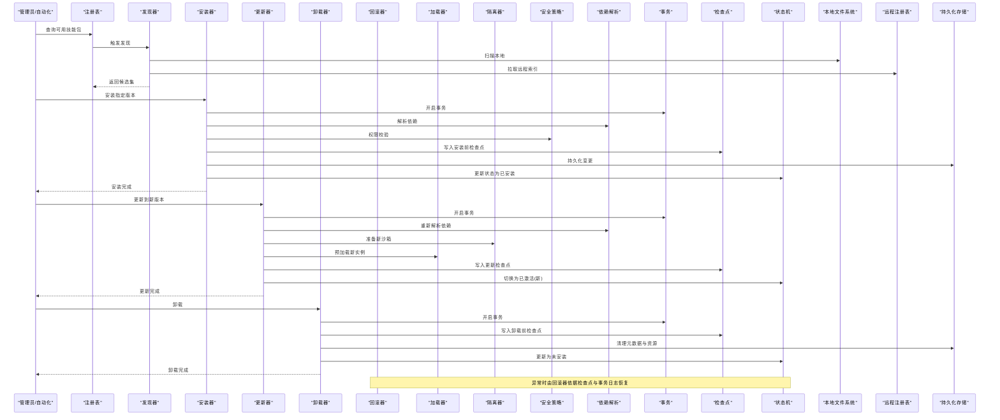
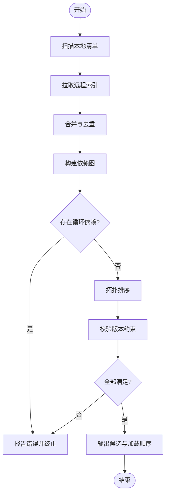
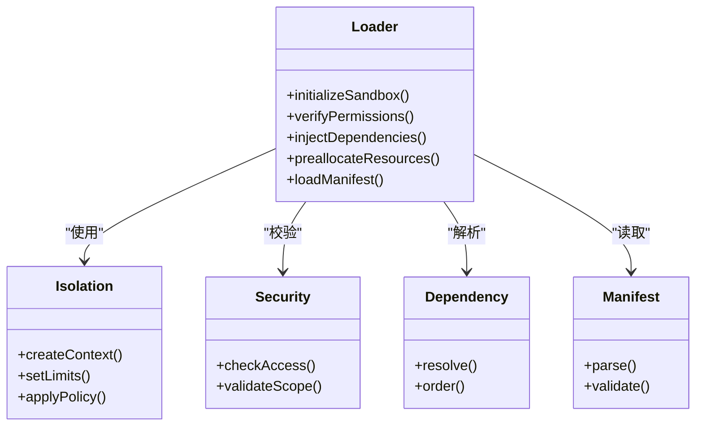
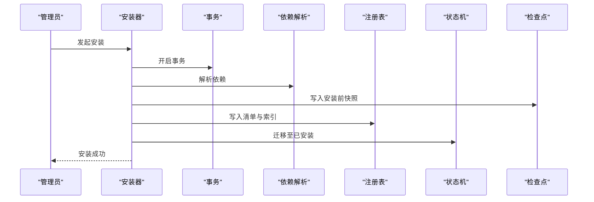
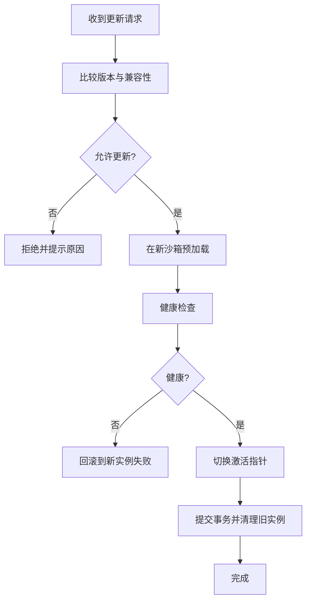
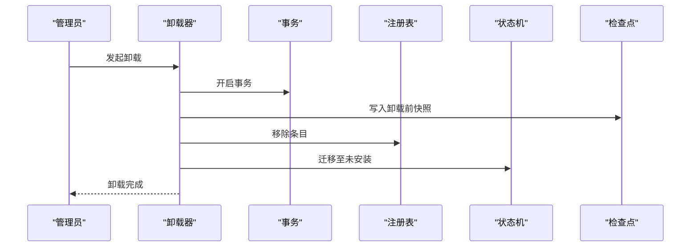
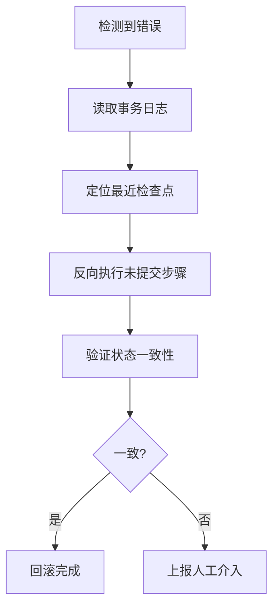
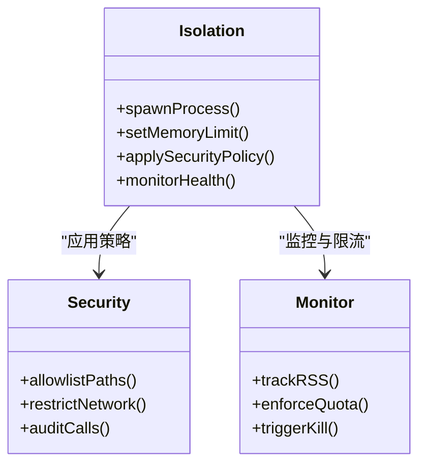
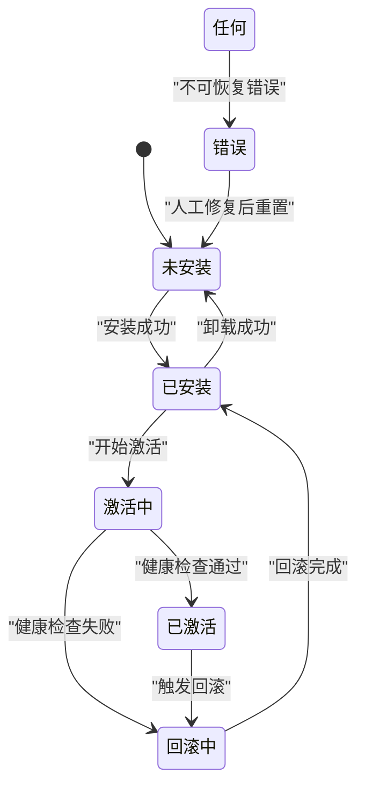
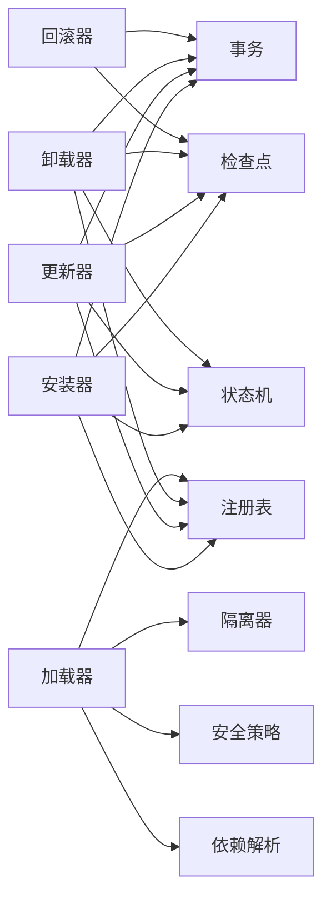

# 生命周期管理

<cite>
**本文引用的文件**
- [src/core/skillpack/registry.ts](file://src/core/skillpack/registry.ts)
- [src/core/skillpack/loader.ts](file://src/core/skillpack/loader.ts)
- [src/core/skillpack/discovery.ts](file://src/core/skillpack/discovery.ts)
- [src/core/skillpack/installer.ts](file://src/core/skillpack/installer.ts)
- [src/core/skillpack/updater.ts](file://src/core/skillpack/updater.ts)
- [src/core/skillpack/uninstaller.ts](file://src/core/skillpack/uninstaller.ts)
- [src/core/skillpack/rollback.ts](file://src/core/skillpack/rollback.ts)
- [src/core/skillpack/state.ts](file://src/core/skillpack/state.ts)
- [src/core/skillpack/isolation.ts](file://src/core/skillpack/isolation.ts)
- [src/core/skillpack/checkpoint.ts](file://src/core/skillpack/checkpoint.ts)
- [src/core/skillpack/manifest.ts](file://src/core/skillpack/manifest.ts)
- [src/core/skillpack/dependency.ts](file://src/core/skillpack/dependency.ts)
- [src/core/skillpack/security.ts](file://src/core/skillpack/security.ts)
- [src/core/skillpack/transaction.ts](file://src/core/skillpack/transaction.ts)
- [skills/manifest.json](file://skills/manifest.json)
- [examples/skillpack-reference/skillpack.json](file://examples/skillpack-reference/skillpack.json)
</cite>

## 目录
1. [简介](#简介)
2. [项目结构](#项目结构)
3. [核心组件](#核心组件)
4. [架构总览](#架构总览)
5. [详细组件分析](#详细组件分析)
6. [依赖关系分析](#依赖关系分析)
7. [性能考虑](#性能考虑)
8. [故障排查指南](#故障排查指南)
9. [结论](#结论)
10. [附录](#附录)

## 简介
本文件聚焦 GBrain 技能包的生命周期管理，覆盖安装、激活、更新、卸载与回滚的完整流程；深入说明技能包的发现机制（本地文件系统扫描、远程注册表查询、依赖解析算法）；记录加载流程（沙箱初始化、权限验证、依赖注入、资源预分配）；解释执行环境隔离机制（进程隔离、内存限制、安全边界控制）；并给出状态管理与故障恢复的实现细节（检查点保存、事务回滚、一致性保证）。文档面向不同技术背景的读者，提供从高层到代码级的渐进式理解路径。

## 项目结构
GBrain 的技能包子系统位于 src/core/skillpack 目录下，围绕“注册表—发现—加载—运行—状态—隔离—事务”等职责进行模块化拆分。示例与参考实现分别位于 examples/skillpack-reference 和 skills 目录中，用于展示清单格式与集成方式。

```mermaid
graph TB
subgraph "核心模块"
REG["注册表<br/>registry.ts"]
DISC["发现器<br/>discovery.ts"]
LOAD["加载器<br/>loader.ts"]
INST["安装器<br/>installer.ts"]
UPD["更新器<br/>updater.ts"]
UNINST["卸载器<br/>uninstaller.ts"]
RB["回滚器<br/>rollback.ts"]
ST["状态机<br/>state.ts"]
ISO["隔离器<br/>isolation.ts"]
CP["检查点<br/>checkpoint.ts"]
TX["事务<br/>transaction.ts"]
SEC["安全策略<br/>security.ts"]
DEP["依赖解析<br/>dependency.ts"]
MAN["清单模型<br/>manifest.ts"]
end
subgraph "外部数据源"
FS["本地文件系统"]
REM["远程注册表"]
DB["持久化存储"]
end
subgraph "示例与参考"
EX_REF["示例清单<br/>examples/skillpack-reference/skillpack.json"]
SK_MAN["内置清单索引<br/>skills/manifest.json"]
end
DISC --> FS
DISC --> REM
DISC --> MAN
REG <- --> ST
REG <- --> DB
INST --> REG
INST --> ST
INST --> TX
INST --> CP
UPD --> REG
UPD --> ST
UPD --> TX
UPD --> CP
UNINST --> REG
UNINST --> ST
UNINST --> TX
UNINST --> CP
RB --> ST
RB --> TX
RB --> CP
LOAD --> REG
LOAD --> ISO
LOAD --> SEC
LOAD --> DEP
LOAD --> ST
ISO --> DB
SEC --> DB
DEP --> MAN
```

图表来源
- [src/core/skillpack/registry.ts](file://src/core/skillpack/registry.ts)
- [src/core/skillpack/discovery.ts](file://src/core/skillpack/discovery.ts)
- [src/core/skillpack/loader.ts](file://src/core/skillpack/loader.ts)
- [src/core/skillpack/installer.ts](file://src/core/skillpack/installer.ts)
- [src/core/skillpack/updater.ts](file://src/core/skillpack/updater.ts)
- [src/core/skillpack/uninstaller.ts](file://src/core/skillpack/uninstaller.ts)
- [src/core/skillpack/rollback.ts](file://src/core/skillpack/rollback.ts)
- [src/core/skillpack/state.ts](file://src/core/skillpack/state.ts)
- [src/core/skillpack/isolation.ts](file://src/core/skillpack/isolation.ts)
- [src/core/skillpack/checkpoint.ts](file://src/core/skillpack/checkpoint.ts)
- [src/core/skillpack/transaction.ts](file://src/core/skillpack/transaction.ts)
- [src/core/skillpack/security.ts](file://src/core/skillpack/security.ts)
- [src/core/skillpack/dependency.ts](file://src/core/skillpack/dependency.ts)
- [src/core/skillpack/manifest.ts](file://src/core/skillpack/manifest.ts)
- [examples/skillpack-reference/skillpack.json](file://examples/skillpack-reference/skillpack.json)
- [skills/manifest.json](file://skills/manifest.json)

章节来源
- [src/core/skillpack/registry.ts](file://src/core/skillpack/registry.ts)
- [src/core/skillpack/discovery.ts](file://src/core/skillpack/discovery.ts)
- [src/core/skillpack/loader.ts](file://src/core/skillpack/loader.ts)
- [src/core/skillpack/installer.ts](file://src/core/skillpack/installer.ts)
- [src/core/skillpack/updater.ts](file://src/core/skillpack/updater.ts)
- [src/core/skillpack/uninstaller.ts](file://src/core/skillpack/uninstaller.ts)
- [src/core/skillpack/rollback.ts](file://src/core/skillpack/rollback.ts)
- [src/core/skillpack/state.ts](file://src/core/skillpack/state.ts)
- [src/core/skillpack/isolation.ts](file://src/core/skillpack/isolation.ts)
- [src/core/skillpack/checkpoint.ts](file://src/core/skillpack/checkpoint.ts)
- [src/core/skillpack/transaction.ts](file://src/core/skillpack/transaction.ts)
- [src/core/skillpack/security.ts](file://src/core/skillpack/security.ts)
- [src/core/skillpack/dependency.ts](file://src/core/skillpack/dependency.ts)
- [src/core/skillpack/manifest.ts](file://src/core/skillpack/manifest.ts)
- [examples/skillpack-reference/skillpack.json](file://examples/skillpack-reference/skillpack.json)
- [skills/manifest.json](file://skills/manifest.json)

## 核心组件
- 注册表：维护技能包元数据、版本、来源与可用能力索引，提供增删改查与一致性保障。
- 发现器：聚合本地文件系统扫描与远程注册表查询结果，去重合并，输出候选集合。
- 加载器：负责沙箱初始化、权限校验、依赖注入、资源预分配与运行时上下文构建。
- 安装器/更新器/卸载器：封装变更操作的前置校验、事务编排、检查点写入与失败回退。
- 回滚器：基于检查点与事务日志将系统恢复到一致状态。
- 状态机：定义技能包的状态空间与合法迁移，确保幂等与可观测性。
- 隔离器：为技能包创建受控执行环境，实施进程隔离、内存限制与安全边界。
- 检查点：在关键阶段落盘快照，支持断点续跑与快速恢复。
- 事务：以原子语义组织多步骤变更，保证 ACID 特性。
- 安全策略：白名单/黑名单、最小权限、网络与文件系统访问控制。
- 依赖解析：基于清单声明计算有向无环图，进行拓扑排序与冲突检测。
- 清单模型：统一描述技能包的结构、版本、能力、依赖与约束。

章节来源
- [src/core/skillpack/registry.ts](file://src/core/skillpack/registry.ts)
- [src/core/skillpack/discovery.ts](file://src/core/skillpack/discovery.ts)
- [src/core/skillpack/loader.ts](file://src/core/skillpack/loader.ts)
- [src/core/skillpack/installer.ts](file://src/core/skillpack/installer.ts)
- [src/core/skillpack/updater.ts](file://src/core/skillpack/updater.ts)
- [src/core/skillpack/uninstaller.ts](file://src/core/skillpack/uninstaller.ts)
- [src/core/skillpack/rollback.ts](file://src/core/skillpack/rollback.ts)
- [src/core/skillpack/state.ts](file://src/core/skillpack/state.ts)
- [src/core/skillpack/isolation.ts](file://src/core/skillpack/isolation.ts)
- [src/core/skillpack/checkpoint.ts](file://src/core/skillpack/checkpoint.ts)
- [src/core/skillpack/transaction.ts](file://src/core/skillpack/transaction.ts)
- [src/core/skillpack/security.ts](file://src/core/skillpack/security.ts)
- [src/core/skillpack/dependency.ts](file://src/core/skillpack/dependency.ts)
- [src/core/skillpack/manifest.ts](file://src/core/skillpack/manifest.ts)

## 架构总览
下图展示了生命周期各阶段的关键交互与数据流向。



图表来源
- [src/core/skillpack/registry.ts](file://src/core/skillpack/registry.ts)
- [src/core/skillpack/discovery.ts](file://src/core/skillpack/discovery.ts)
- [src/core/skillpack/installer.ts](file://src/core/skillpack/installer.ts)
- [src/core/skillpack/updater.ts](file://src/core/skillpack/updater.ts)
- [src/core/skillpack/uninstaller.ts](file://src/core/skillpack/uninstaller.ts)
- [src/core/skillpack/rollback.ts](file://src/core/skillpack/rollback.ts)
- [src/core/skillpack/loader.ts](file://src/core/skillpack/loader.ts)
- [src/core/skillpack/isolation.ts](file://src/core/skillpack/isolation.ts)
- [src/core/skillpack/security.ts](file://src/core/skillpack/security.ts)
- [src/core/skillpack/dependency.ts](file://src/core/skillpack/dependency.ts)
- [src/core/skillpack/transaction.ts](file://src/core/skillpack/transaction.ts)
- [src/core/skillpack/checkpoint.ts](file://src/core/skillpack/checkpoint.ts)
- [src/core/skillpack/state.ts](file://src/core/skillpack/state.ts)

## 详细组件分析

### 发现机制：本地扫描、远程查询与依赖解析
- 本地文件系统扫描：遍历已知根目录，读取清单文件，提取标识、版本、能力与依赖声明。
- 远程注册表查询：按命名空间或标签过滤，拉取最新索引与版本元数据，合并本地结果去重。
- 依赖解析算法：
  - 基于清单构建依赖有向图，进行环检测与版本约束求解。
  - 采用拓扑排序确定加载顺序，冲突时优先满足更高版本或显式锁定。
  - 对不满足约束的依赖提前失败，避免半安装状态。



图表来源
- [src/core/skillpack/discovery.ts](file://src/core/skillpack/discovery.ts)
- [src/core/skillpack/dependency.ts](file://src/core/skillpack/dependency.ts)
- [src/core/skillpack/manifest.ts](file://src/core/skillpack/manifest.ts)

章节来源
- [src/core/skillpack/discovery.ts](file://src/core/skillpack/discovery.ts)
- [src/core/skillpack/dependency.ts](file://src/core/skillpack/dependency.ts)
- [src/core/skillpack/manifest.ts](file://src/core/skillpack/manifest.ts)

### 加载流程：沙箱初始化、权限验证、依赖注入与资源预分配
- 沙箱初始化：根据隔离器配置创建受限执行上下文，绑定文件系统、网络与系统调用白名单。
- 权限验证：对照安全策略校验所需权限，拒绝越权请求。
- 依赖注入：按依赖解析顺序注入共享库、配置与运行时接口。
- 资源预分配：预热缓存、建立连接池、分配内存配额，减少冷启动延迟。



图表来源
- [src/core/skillpack/loader.ts](file://src/core/skillpack/loader.ts)
- [src/core/skillpack/isolation.ts](file://src/core/skillpack/isolation.ts)
- [src/core/skillpack/security.ts](file://src/core/skillpack/security.ts)
- [src/core/skillpack/dependency.ts](file://src/core/skillpack/dependency.ts)
- [src/core/skillpack/manifest.ts](file://src/core/skillpack/manifest.ts)

章节来源
- [src/core/skillpack/loader.ts](file://src/core/skillpack/loader.ts)
- [src/core/skillpack/isolation.ts](file://src/core/skillpack/isolation.ts)
- [src/core/skillpack/security.ts](file://src/core/skillpack/security.ts)
- [src/core/skillpack/dependency.ts](file://src/core/skillpack/dependency.ts)
- [src/core/skillpack/manifest.ts](file://src/core/skillpack/manifest.ts)

### 安装与激活：事务编排与状态迁移
- 前置校验：清单合法性、签名与完整性校验、依赖可满足性。
- 事务编排：下载/解压、写入清单与索引、注册能力、更新状态。
- 激活策略：热切换或冷启动，确保旧实例优雅退出与新实例接管。
- 幂等性：重复安装自动识别并跳过已完成步骤。



图表来源
- [src/core/skillpack/installer.ts](file://src/core/skillpack/installer.ts)
- [src/core/skillpack/transaction.ts](file://src/core/skillpack/transaction.ts)
- [src/core/skillpack/dependency.ts](file://src/core/skillpack/dependency.ts)
- [src/core/skillpack/registry.ts](file://src/core/skillpack/registry.ts)
- [src/core/skillpack/state.ts](file://src/core/skillpack/state.ts)
- [src/core/skillpack/checkpoint.ts](file://src/core/skillpack/checkpoint.ts)

章节来源
- [src/core/skillpack/installer.ts](file://src/core/skillpack/installer.ts)
- [src/core/skillpack/transaction.ts](file://src/core/skillpack/transaction.ts)
- [src/core/skillpack/dependency.ts](file://src/core/skillpack/dependency.ts)
- [src/core/skillpack/registry.ts](file://src/core/skillpack/registry.ts)
- [src/core/skillpack/state.ts](file://src/core/skillpack/state.ts)
- [src/core/skillpack/checkpoint.ts](file://src/core/skillpack/checkpoint.ts)

### 更新：灰度切换与一致性保证
- 版本比较：基于清单版本号与兼容性矩阵判断是否可升级。
- 并行准备：在新沙箱中预加载新版本，同时保持旧实例继续服务。
- 切换策略：流量切分或一次性切换，结合健康检查与回滚阈值。
- 一致性：通过事务与检查点确保更新前后状态一致。



图表来源
- [src/core/skillpack/updater.ts](file://src/core/skillpack/updater.ts)
- [src/core/skillpack/isolation.ts](file://src/core/skillpack/isolation.ts)
- [src/core/skillpack/transaction.ts](file://src/core/skillpack/transaction.ts)
- [src/core/skillpack/state.ts](file://src/core/skillpack/state.ts)

章节来源
- [src/core/skillpack/updater.ts](file://src/core/skillpack/updater.ts)
- [src/core/skillpack/isolation.ts](file://src/core/skillpack/isolation.ts)
- [src/core/skillpack/transaction.ts](file://src/core/skillpack/transaction.ts)
- [src/core/skillpack/state.ts](file://src/core/skillpack/state.ts)

### 卸载：资源回收与状态清理
- 停止运行：优雅关闭实例，释放句柄与连接。
- 清理资源：删除工作目录、缓存与临时文件。
- 更新索引：移除注册表条目与能力映射。
- 状态迁移：标记为未安装，保留审计日志。



图表来源
- [src/core/skillpack/uninstaller.ts](file://src/core/skillpack/uninstaller.ts)
- [src/core/skillpack/transaction.ts](file://src/core/skillpack/transaction.ts)
- [src/core/skillpack/registry.ts](file://src/core/skillpack/registry.ts)
- [src/core/skillpack/state.ts](file://src/core/skillpack/state.ts)
- [src/core/skillpack/checkpoint.ts](file://src/core/skillpack/checkpoint.ts)

章节来源
- [src/core/skillpack/uninstaller.ts](file://src/core/skillpack/uninstaller.ts)
- [src/core/skillpack/transaction.ts](file://src/core/skillpack/transaction.ts)
- [src/core/skillpack/registry.ts](file://src/core/skillpack/registry.ts)
- [src/core/skillpack/state.ts](file://src/core/skillpack/state.ts)
- [src/core/skillpack/checkpoint.ts](file://src/core/skillpack/checkpoint.ts)

### 回滚：检查点与事务日志驱动的一致性恢复
- 触发条件：安装/更新/卸载过程中发生不可恢复错误。
- 恢复策略：基于最近检查点与事务日志反向执行未完成步骤。
- 一致性保证：回滚后状态与事务开始前一致，避免脏写。



图表来源
- [src/core/skillpack/rollback.ts](file://src/core/skillpack/rollback.ts)
- [src/core/skillpack/checkpoint.ts](file://src/core/skillpack/checkpoint.ts)
- [src/core/skillpack/transaction.ts](file://src/core/skillpack/transaction.ts)

章节来源
- [src/core/skillpack/rollback.ts](file://src/core/skillpack/rollback.ts)
- [src/core/skillpack/checkpoint.ts](file://src/core/skillpack/checkpoint.ts)
- [src/core/skillpack/transaction.ts](file://src/core/skillpack/transaction.ts)

### 执行环境隔离：进程隔离、内存限制与安全边界
- 进程隔离：每个技能包在独立进程中运行，崩溃不影响宿主。
- 内存限制：设置最大堆大小与常驻内存上限，防止 OOM。
- 安全边界：文件系统只读挂载、网络白名单、系统调用拦截。
- 资源配额：CPU 时间片与 I/O 带宽限制，避免资源争用。



图表来源
- [src/core/skillpack/isolation.ts](file://src/core/skillpack/isolation.ts)
- [src/core/skillpack/security.ts](file://src/core/skillpack/security.ts)

章节来源
- [src/core/skillpack/isolation.ts](file://src/core/skillpack/isolation.ts)
- [src/core/skillpack/security.ts](file://src/core/skillpack/security.ts)

### 状态管理与故障恢复：检查点、事务与一致性
- 状态空间：未安装、已安装、激活中、已激活、回滚中、错误。
- 迁移规则：仅允许合法迁移，非法迁移被拒绝并记录审计事件。
- 检查点：在关键节点落盘快照，支持快速恢复与断点续跑。
- 事务：多步骤变更包裹在事务内，失败则整体回滚。



图表来源
- [src/core/skillpack/state.ts](file://src/core/skillpack/state.ts)
- [src/core/skillpack/checkpoint.ts](file://src/core/skillpack/checkpoint.ts)
- [src/core/skillpack/transaction.ts](file://src/core/skillpack/transaction.ts)

章节来源
- [src/core/skillpack/state.ts](file://src/core/skillpack/state.ts)
- [src/core/skillpack/checkpoint.ts](file://src/core/skillpack/checkpoint.ts)
- [src/core/skillpack/transaction.ts](file://src/core/skillpack/transaction.ts)

### 清单与示例：结构与约定
- 清单字段：标识、版本、能力、依赖、权限、资源限制、入口点等。
- 示例清单：参考示例中的清单结构，便于第三方扩展与集成。
- 内置索引：skills/manifest.json 汇总内置技能包信息，加速发现与安装。

章节来源
- [src/core/skillpack/manifest.ts](file://src/core/skillpack/manifest.ts)
- [examples/skillpack-reference/skillpack.json](file://examples/skillpack-reference/skillpack.json)
- [skills/manifest.json](file://skills/manifest.json)

## 依赖关系分析
- 组件耦合：
  - 安装器/更新器/卸载器强依赖事务与检查点，弱依赖注册表与状态机。
  - 加载器依赖隔离器、安全策略与依赖解析，松耦合于注册表。
  - 回滚器依赖检查点与事务日志，独立于具体变更操作。
- 外部依赖：
  - 本地文件系统：清单与资源文件读写。
  - 远程注册表：版本索引与元数据获取。
  - 持久化存储：注册表与状态持久化。



图表来源
- [src/core/skillpack/installer.ts](file://src/core/skillpack/installer.ts)
- [src/core/skillpack/updater.ts](file://src/core/skillpack/updater.ts)
- [src/core/skillpack/uninstaller.ts](file://src/core/skillpack/uninstaller.ts)
- [src/core/skillpack/loader.ts](file://src/core/skillpack/loader.ts)
- [src/core/skillpack/rollback.ts](file://src/core/skillpack/rollback.ts)
- [src/core/skillpack/transaction.ts](file://src/core/skillpack/transaction.ts)
- [src/core/skillpack/checkpoint.ts](file://src/core/skillpack/checkpoint.ts)
- [src/core/skillpack/registry.ts](file://src/core/skillpack/registry.ts)
- [src/core/skillpack/state.ts](file://src/core/skillpack/state.ts)
- [src/core/skillpack/isolation.ts](file://src/core/skillpack/isolation.ts)
- [src/core/skillpack/security.ts](file://src/core/skillpack/security.ts)
- [src/core/skillpack/dependency.ts](file://src/core/skillpack/dependency.ts)

章节来源
- [src/core/skillpack/installer.ts](file://src/core/skillpack/installer.ts)
- [src/core/skillpack/updater.ts](file://src/core/skillpack/updater.ts)
- [src/core/skillpack/uninstaller.ts](file://src/core/skillpack/uninstaller.ts)
- [src/core/skillpack/loader.ts](file://src/core/skillpack/loader.ts)
- [src/core/skillpack/rollback.ts](file://src/core/skillpack/rollback.ts)
- [src/core/skillpack/transaction.ts](file://src/core/skillpack/transaction.ts)
- [src/core/skillpack/checkpoint.ts](file://src/core/skillpack/checkpoint.ts)
- [src/core/skillpack/registry.ts](file://src/core/skillpack/registry.ts)
- [src/core/skillpack/state.ts](file://src/core/skillpack/state.ts)
- [src/core/skillpack/isolation.ts](file://src/core/skillpack/isolation.ts)
- [src/core/skillpack/security.ts](file://src/core/skillpack/security.ts)
- [src/core/skillpack/dependency.ts](file://src/core/skillpack/dependency.ts)

## 性能考虑
- 并发控制：安装/更新/卸载操作串行化，避免竞争条件。
- 增量发现：缓存本地扫描结果与远程索引，减少重复 IO 与网络开销。
- 预加载优化：按需预热依赖与缓存，降低首次调用延迟。
- 资源配额：合理设置内存与 CPU 限制，避免雪崩效应。
- 批处理：批量更新时复用事务与检查点，提升吞吐。

[本节为通用指导，无需列出章节来源]

## 故障排查指南
- 常见问题
  - 依赖冲突：检查依赖解析日志与版本约束，必要时调整清单或锁定版本。
  - 权限不足：核对安全策略白名单，确认文件系统与网络访问授权。
  - 健康检查失败：查看新实例日志与指标，确认资源配额与健康探针配置。
  - 回滚失败：检查检查点完整性与事务日志连续性，必要时人工干预。
- 诊断工具
  - 状态快照：导出当前状态机与注册表视图。
  - 事务审计：回放事务日志，定位失败步骤。
  - 隔离监控：观察进程 RSS、CPU 使用率与系统调用审计。

章节来源
- [src/core/skillpack/state.ts](file://src/core/skillpack/state.ts)
- [src/core/skillpack/transaction.ts](file://src/core/skillpack/transaction.ts)
- [src/core/skillpack/checkpoint.ts](file://src/core/skillpack/checkpoint.ts)
- [src/core/skillpack/security.ts](file://src/core/skillpack/security.ts)
- [src/core/skillpack/isolation.ts](file://src/core/skillpack/isolation.ts)

## 结论
GBrain 技能包生命周期管理通过清晰的模块划分与严格的变更编排，实现了高可靠、可观测与可恢复的运维体验。发现机制兼顾本地与远程源，依赖解析确保正确性与安全性；加载流程在沙箱中完成权限与资源治理；事务与检查点共同保障一致性；隔离器与安全策略构筑了健壮的执行边界。建议在生产环境中启用完整的审计与监控，并结合灰度发布策略以降低风险。

[本节为总结性内容，无需列出章节来源]

## 附录
- 清单字段约定与示例请参考清单模型与示例清单文件。
- 内置技能包索引位于 skills/manifest.json，可用于快速安装与验证。

章节来源
- [src/core/skillpack/manifest.ts](file://src/core/skillpack/manifest.ts)
- [examples/skillpack-reference/skillpack.json](file://examples/skillpack-reference/skillpack.json)
- [skills/manifest.json](file://skills/manifest.json)