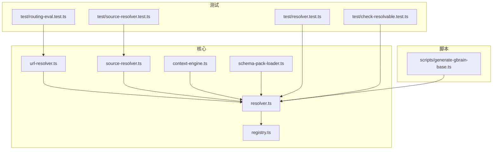
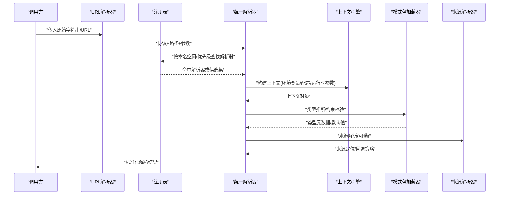
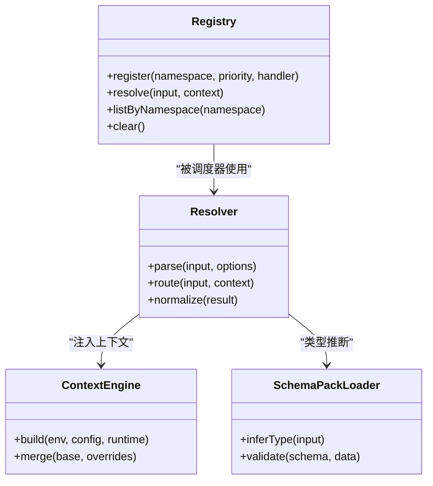
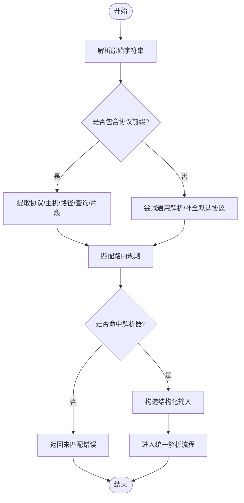
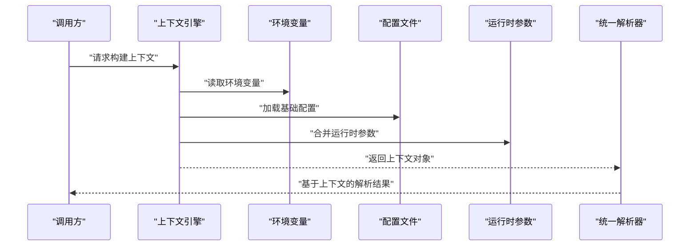
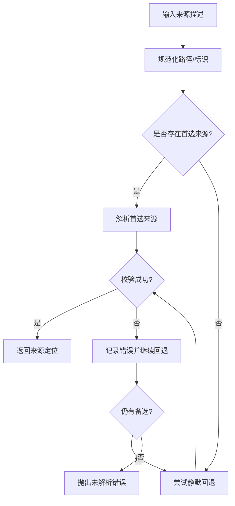
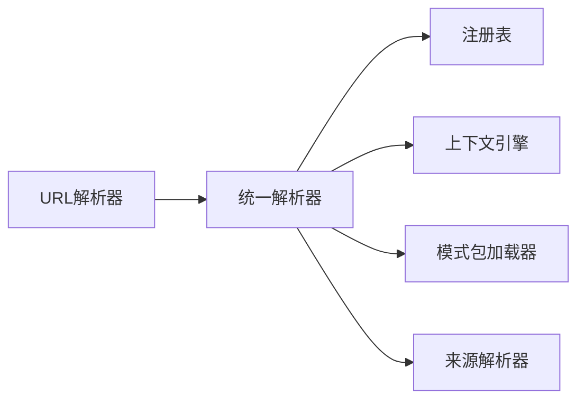

# 解析器系统

<cite>
**本文引用的文件**   
- [src/core/resolver.ts](file://src/core/resolver.ts)
- [src/core/url-resolver.ts](file://src/core/url-resolver.ts)
- [src/core/registry.ts](file://src/core/registry.ts)
- [src/core/context-engine.ts](file://src/core/context-engine.ts)
- [src/core/schema-pack-loader.ts](file://src/core/schema-pack-loader.ts)
- [src/core/source-resolver.ts](file://src/core/source-resolver.ts)
- [test/resolver.test.ts](file://test/resolver.test.ts)
- [test/check-resolvable.test.ts](file://test/check-resolvable.test.ts)
- [test/check-resolvable-cli.test.ts](file://test/check-resolvable-cli.test.ts)
- [test/check-resolvable-openclaw-compact.test.ts](file://test/check-resolvable-openclaw-compact.test.ts)
- [test/file-resolver.test.ts](file://test/file-resolver.test.ts)
- [test/source-resolver.test.ts](file://test/source-resolver.test.ts)
- [test/source-resolver-silent-fallback.test.ts](file://test/source-resolver-silent-fallback.test.ts)
- [test/source-resolver-with-tier.test.ts](file://test/source-resolver-with-tier.test.ts)
- [test/source-resolver-sole-non-default.test.ts](file://test/source-resolver-sole-non-default.test.ts)
- [test/contextual-retrieval-resolver.test.ts](file://test/contextual-retrieval-resolver.test.ts)
- [test/contextual-retrieval-service-pure.test.ts](file://test/contextual-retrieval-service-pure.test.ts)
- [test/resolve-prepare.test.ts](file://test/resolve-prepare.test.ts)
- [test/resolvers.test.ts](file://test/resolvers.test.ts)
- [test/routing-eval.test.ts](file://test/routing-eval.test.ts)
- [test/routing-eval-cli.test.ts](file://test/routing-eval-cli.test.ts)
- [scripts/generate-gbrain-base.ts](file://scripts/generate-gbrain-base.ts)
</cite>

## 目录
1. [简介](#简介)
2. [项目结构](#项目结构)
3. [核心组件](#核心组件)
4. [架构总览](#架构总览)
5. [详细组件分析](#详细组件分析)
6. [依赖关系分析](#依赖关系分析)
7. [性能考量](#性能考量)
8. [故障排查指南](#故障排查指南)
9. [结论](#结论)
10. [附录](#附录)

## 简介
本文件系统性梳理 GBrain 的“解析器系统”，围绕统一接口、动态发现与类型推断、URL 解析机制（协议识别、参数提取、路由匹配）、注册与管理（命名空间、优先级、冲突解决）、上下文感知解析（环境变量注入、配置合并、运行时参数传递）展开，并提供自定义解析器的开发指南、测试框架与调试工具、安全考虑等实践建议。文档面向不同技术背景的读者，既提供高层概览，也给出代码级映射与可视化图示。

## 项目结构
GBrain 的解析器能力分布在 core 模块中，并通过测试与脚本进行验证与生成。关键位置如下：
- 核心解析器与注册表：src/core/resolver.ts、src/core/registry.ts
- URL 解析与路由：src/core/url-resolver.ts
- 上下文引擎：src/core/context-engine.ts
- 模式包加载与类型推断：src/core/schema-pack-loader.ts
- 来源解析器（Source Resolver）：src/core/source-resolver.ts
- 测试与 CLI 校验：test/* 下的 resolver、source-resolver、routing-eval、check-resolvable 系列
- 基座生成脚本：scripts/generate-gbrain-base.ts

图表来源
- [src/core/resolver.ts](file://src/core/resolver.ts)
- [src/core/registry.ts](file://src/core/registry.ts)
- [src/core/url-resolver.ts](file://src/core/url-resolver.ts)
- [src/core/context-engine.ts](file://src/core/context-engine.ts)
- [src/core/schema-pack-loader.ts](file://src/core/schema-pack-loader.ts)
- [src/core/source-resolver.ts](file://src/core/source-resolver.ts)
- [test/resolver.test.ts](file://test/resolver.test.ts)
- [test/source-resolver.test.ts](file://test/source-resolver.test.ts)
- [test/routing-eval.test.ts](file://test/routing-eval.test.ts)
- [test/check-resolvable.test.ts](file://test/check-resolvable.test.ts)
- [scripts/generate-gbrain-base.ts](file://scripts/generate-gbrain-base.ts)

章节来源
- [src/core/resolver.ts](file://src/core/resolver.ts)
- [src/core/registry.ts](file://src/core/registry.ts)
- [src/core/url-resolver.ts](file://src/core/url-resolver.ts)
- [src/core/context-engine.ts](file://src/core/context-engine.ts)
- [src/core/schema-pack-loader.ts](file://src/core/schema-pack-loader.ts)
- [src/core/source-resolver.ts](file://src/core/source-resolver.ts)
- [test/resolver.test.ts](file://test/resolver.test.ts)
- [test/source-resolver.test.ts](file://test/source-resolver.test.ts)
- [test/routing-eval.test.ts](file://test/routing-eval.test.ts)
- [test/check-resolvable.test.ts](file://test/check-resolvable.test.ts)
- [scripts/generate-gbrain-base.ts](file://scripts/generate-gbrain-base.ts)

## 核心组件
- 统一解析接口与调度器：定义统一的解析入口、策略选择与结果归一化，屏蔽具体实现差异。
- 注册表：集中管理解析器实例，支持命名空间、优先级排序与冲突消解。
- URL 解析器：负责协议识别、参数提取与路由匹配，将原始字符串转换为结构化目标。
- 上下文引擎：在解析过程中注入环境变量、合并配置、透传运行时参数，形成上下文感知的解析。
- 模式包加载器：基于 schema pack 进行类型推断与约束校验，驱动动态发现与扩展。
- 来源解析器：针对数据源（如文件系统、远程仓库等）的路径与标识解析，支持静默回退与分层策略。

章节来源
- [src/core/resolver.ts](file://src/core/resolver.ts)
- [src/core/registry.ts](file://src/core/registry.ts)
- [src/core/url-resolver.ts](file://src/core/url-resolver.ts)
- [src/core/context-engine.ts](file://src/core/context-engine.ts)
- [src/core/schema-pack-loader.ts](file://src/core/schema-pack-loader.ts)
- [src/core/source-resolver.ts](file://src/core/source-resolver.ts)

## 架构总览
下图展示了从输入到最终解析结果的端到端流程，包括 URL 解析、注册表查找、上下文注入、类型推断与结果返回。

图表来源
- [src/core/url-resolver.ts](file://src/core/url-resolver.ts)
- [src/core/registry.ts](file://src/core/registry.ts)
- [src/core/resolver.ts](file://src/core/resolver.ts)
- [src/core/context-engine.ts](file://src/core/context-engine.ts)
- [src/core/schema-pack-loader.ts](file://src/core/schema-pack-loader.ts)
- [src/core/source-resolver.ts](file://src/core/source-resolver.ts)

## 详细组件分析

### 统一解析接口与调度器
- 设计要点
  - 统一入口：对外暴露一致的解析方法，内部根据输入特征选择具体解析器。
  - 策略选择：结合命名空间、协议前缀、类型元数据进行路由。
  - 结果归一化：输出稳定结构，便于上层消费与序列化。
- 关键职责
  - 解析生命周期编排：预处理→路由→执行→后处理。
  - 错误分类与提示：区分未找到、不匹配、类型错误等场景。
- 优化点
  - 缓存热点解析结果，减少重复计算。
  - 对长链解析进行短路评估，尽早失败。

章节来源
- [src/core/resolver.ts](file://src/core/resolver.ts)
- [test/resolver.test.ts](file://test/resolver.test.ts)
- [test/resolvers.test.ts](file://test/resolvers.test.ts)

### 注册表：命名空间、优先级与冲突解决
- 命名空间
  - 通过命名空间隔离不同领域或协议的解析器，避免全局污染。
- 优先级
  - 解析器可声明优先级；当多个候选匹配时，优先选择更高优先级者。
- 冲突解决
  - 若存在同名且同优先级的解析器，采用显式覆盖或报错策略，确保确定性。
- 动态发现
  - 启动阶段扫描已注册的解析器，按需加载并建立索引。

图表来源
- [src/core/registry.ts](file://src/core/registry.ts)
- [src/core/resolver.ts](file://src/core/resolver.ts)
- [src/core/context-engine.ts](file://src/core/context-engine.ts)
- [src/core/schema-pack-loader.ts](file://src/core/schema-pack-loader.ts)

章节来源
- [src/core/registry.ts](file://src/core/registry.ts)
- [test/resolver.test.ts](file://test/resolver.test.ts)

### URL 解析机制：协议识别、参数提取与路由匹配
- 协议识别
  - 基于前缀或正则匹配识别协议（如 http、https、file、custom 等）。
- 参数提取
  - 查询串、片段、路径段分别解析为键值对与结构化字段。
- 路由匹配
  - 将协议+路径模板与注册表中的解析器规则进行匹配，确定目标处理器。
- 容错与降级
  - 对非法格式返回明确错误；对未知协议尝试通用解析器或回退策略。

图表来源
- [src/core/url-resolver.ts](file://src/core/url-resolver.ts)
- [src/core/resolver.ts](file://src/core/resolver.ts)

章节来源
- [src/core/url-resolver.ts](file://src/core/url-resolver.ts)
- [test/routing-eval.test.ts](file://test/routing-eval.test.ts)
- [test/routing-eval-cli.test.ts](file://test/routing-eval-cli.test.ts)

### 上下文感知的解析过程：环境变量注入、配置合并与运行时参数
- 环境变量注入
  - 从进程环境读取密钥、开关、端点等，避免硬编码。
- 配置合并
  - 基础配置与环境覆盖、运行时参数叠加，形成最终上下文。
- 运行时参数传递
  - 将调用方提供的选项（如超时、重试、日志级别）注入解析链路。
- 安全性
  - 对敏感信息进行脱敏与最小权限原则，防止泄露。

图表来源
- [src/core/context-engine.ts](file://src/core/context-engine.ts)
- [src/core/resolver.ts](file://src/core/resolver.ts)

章节来源
- [src/core/context-engine.ts](file://src/core/context-engine.ts)
- [test/contextual-retrieval-resolver.test.ts](file://test/contextual-retrieval-resolver.test.ts)
- [test/contextual-retrieval-service-pure.test.ts](file://test/contextual-retrieval-service-pure.test.ts)

### 类型推断与动态发现：Schema Pack 集成
- 类型推断
  - 基于 schema pack 的元数据，自动推断输入类型、必填字段与默认值。
- 约束校验
  - 在解析前后进行数据形状与取值范围校验，提升鲁棒性。
- 动态发现
  - 新 schema 上线后无需重启即可参与解析决策。

章节来源
- [src/core/schema-pack-loader.ts](file://src/core/schema-pack-loader.ts)
- [test/resolve-prepare.test.ts](file://test/resolve-prepare.test.ts)

### 来源解析器：路径与标识解析、静默回退与分层
- 路径解析
  - 支持相对/绝对路径、别名与符号链接解析。
- 标识解析
  - 将人类可读标识映射到唯一来源 ID。
- 静默回退
  - 当首选来源不可用时，按策略回退至备选来源，保证可用性。
- 分层策略
  - 根据 tier 或权重选择最优来源，兼顾性能与一致性。

图表来源
- [src/core/source-resolver.ts](file://src/core/source-resolver.ts)

章节来源
- [src/core/source-resolver.ts](file://src/core/source-resolver.ts)
- [test/source-resolver.test.ts](file://test/source-resolver.test.ts)
- [test/source-resolver-silent-fallback.test.ts](file://test/source-resolver-silent-fallback.test.ts)
- [test/source-resolver-with-tier.test.ts](file://test/source-resolver-with-tier.test.ts)
- [test/source-resolver-sole-non-default.test.ts](file://test/source-resolver-sole-non-default.test.ts)
- [test/file-resolver.test.ts](file://test/file-resolver.test.ts)

## 依赖关系分析
- 组件耦合
  - 统一解析器强依赖注册表与上下文引擎；URL 解析器作为前置步骤，产出结构化输入供统一解析器使用。
  - 来源解析器通常作为可选后置步骤，用于落地到具体存储或远端服务。
- 外部依赖
  - 环境变量与配置文件由运行时提供；schema pack 由包管理器或部署管线注入。
- 循环依赖
  - 通过接口抽象与延迟加载避免循环引用。

图表来源
- [src/core/url-resolver.ts](file://src/core/url-resolver.ts)
- [src/core/resolver.ts](file://src/core/resolver.ts)
- [src/core/registry.ts](file://src/core/registry.ts)
- [src/core/context-engine.ts](file://src/core/context-engine.ts)
- [src/core/schema-pack-loader.ts](file://src/core/schema-pack-loader.ts)
- [src/core/source-resolver.ts](file://src/core/source-resolver.ts)

章节来源
- [src/core/resolver.ts](file://src/core/resolver.ts)
- [src/core/registry.ts](file://src/core/registry.ts)
- [src/core/url-resolver.ts](file://src/core/url-resolver.ts)
- [src/core/context-engine.ts](file://src/core/context-engine.ts)
- [src/core/schema-pack-loader.ts](file://src/core/schema-pack-loader.ts)
- [src/core/source-resolver.ts](file://src/core/source-resolver.ts)

## 性能考量
- 解析缓存
  - 对高频 URL 与来源路径进行结果缓存，降低重复开销。
- 短路评估
  - 在路由与类型校验阶段尽早失败，避免不必要的后续处理。
- 批量处理
  - 对批量解析任务采用批处理与并行策略，提高吞吐。
- 资源限制
  - 设置超时、内存上限与并发度，防止异常放大。

[本节为通用指导，不涉及具体文件分析]

## 故障排查指南
- 常见问题
  - 未找到解析器：检查命名空间与优先级是否正确注册。
  - 协议不匹配：确认 URL 前缀与路由规则一致。
  - 类型错误：查看 schema pack 的类型定义与默认值。
  - 来源不可用：启用静默回退并检查备选来源配置。
- 诊断工具
  - 使用 check-resolvable 系列命令快速验证解析可行性。
  - 运行 routing-eval 评估路由命中率与性能。
- 日志与追踪
  - 开启解析链路日志，记录输入、上下文与中间结果。
  - 对关键路径添加埋点，便于定位瓶颈。

章节来源
- [test/check-resolvable.test.ts](file://test/check-resolvable.test.ts)
- [test/check-resolvable-cli.test.ts](file://test/check-resolvable-cli.test.ts)
- [test/check-resolvable-openclaw-compact.test.ts](file://test/check-resolvable-openclaw-compact.test.ts)
- [test/routing-eval.test.ts](file://test/routing-eval.test.ts)
- [test/routing-eval-cli.test.ts](file://test/routing-eval-cli.test.ts)

## 结论
GBrain 的解析器系统以统一接口为核心，结合注册表、URL 解析、上下文引擎与 schema pack 类型推断，实现了高内聚、低耦合的可扩展解析能力。通过命名空间与优先级管理、静默回退与分层策略，系统在可用性与稳定性方面具备良好保障。配合完善的测试与诊断工具，开发者可以高效地扩展与定制解析行为。

[本节为总结性内容，不涉及具体文件分析]

## 附录

### 自定义解析器开发指南
- 接口实现
  - 遵循统一解析接口，实现 parse/route/normalize 等方法。
  - 在注册表中声明命名空间与优先级，确保正确路由。
- 错误处理
  - 明确区分未找到、不匹配、类型错误等场景，返回结构化错误信息。
- 性能优化
  - 利用缓存与短路评估；避免在热路径中进行昂贵操作。
- 安全考虑
  - 对输入进行严格校验；对敏感信息进行脱敏；遵循最小权限原则。
- 测试与调试
  - 编写单元测试覆盖正常路径与边界条件。
  - 使用 check-resolvable 与 routing-eval 进行集成验证。

章节来源
- [src/core/resolver.ts](file://src/core/resolver.ts)
- [src/core/registry.ts](file://src/core/registry.ts)
- [test/resolver.test.ts](file://test/resolver.test.ts)
- [test/check-resolvable.test.ts](file://test/check-resolvable.test.ts)
- [test/routing-eval.test.ts](file://test/routing-eval.test.ts)

### 基座生成与初始化
- 基座生成
  - 使用 generate-gbrain-base 脚本生成基础解析器骨架与注册样板，加速开发。
- 初始化流程
  - 启动时加载 schema pack、注册解析器、预热缓存，确保首次解析性能。

章节来源
- [scripts/generate-gbrain-base.ts](file://scripts/generate-gbrain-base.ts)
- [src/core/schema-pack-loader.ts](file://src/core/schema-pack-loader.ts)
- [src/core/registry.ts](file://src/core/registry.ts)