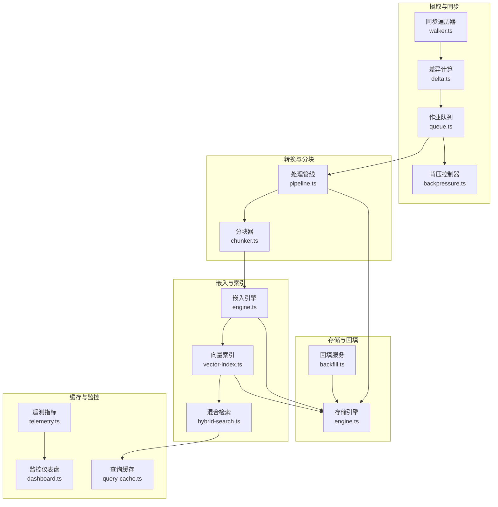
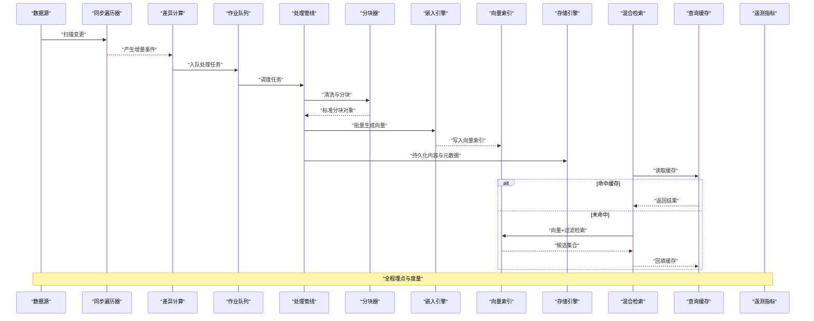
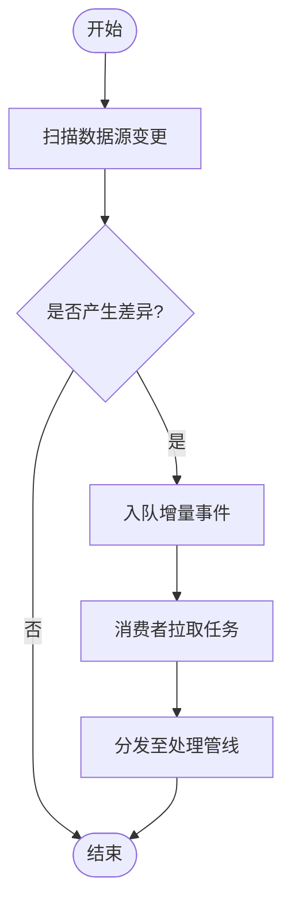
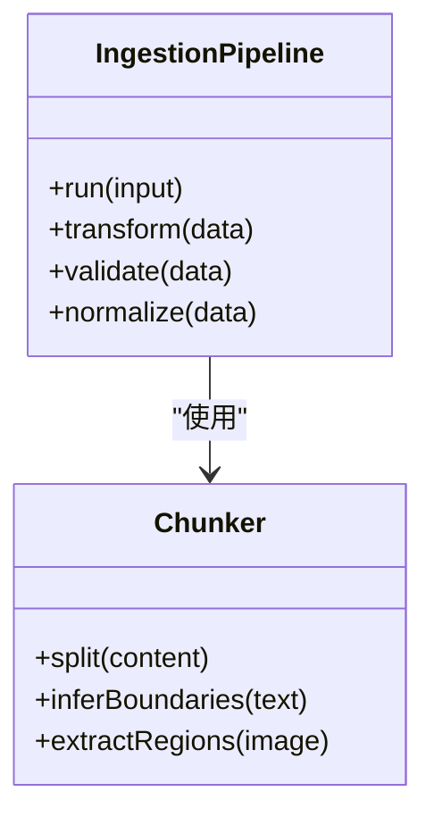
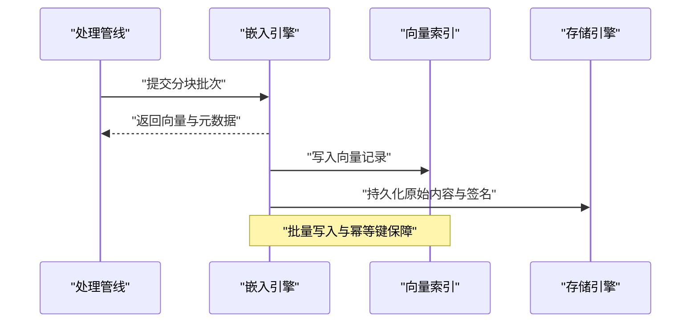
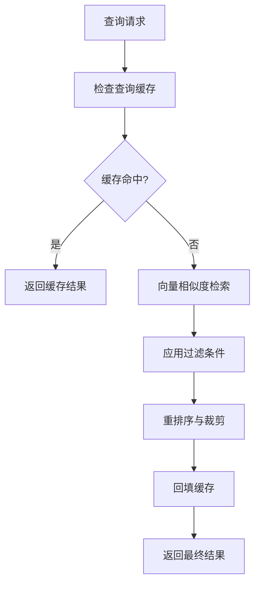
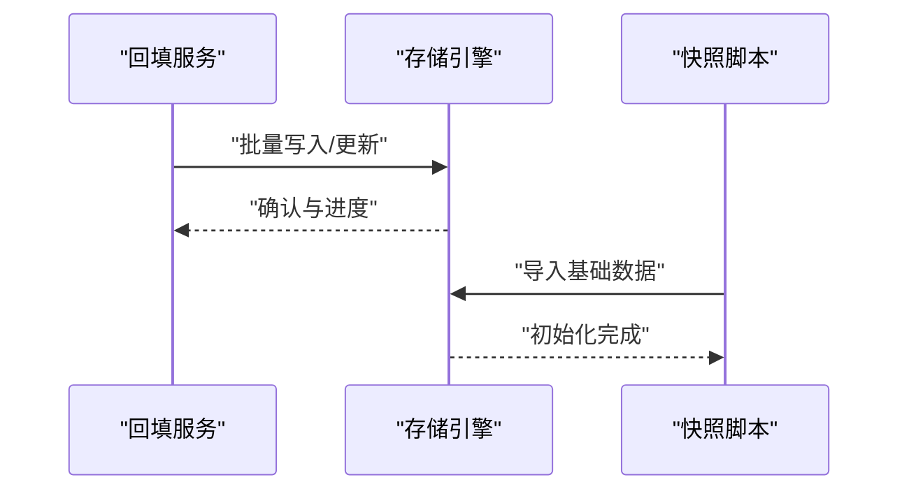
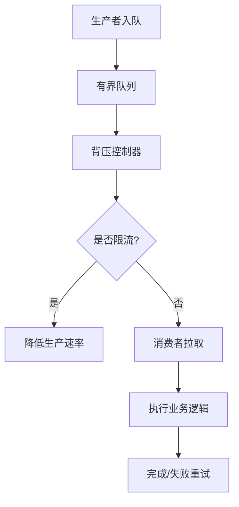
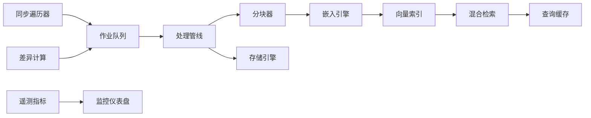

# 数据流架构

<cite>
**本文引用的文件**   
- [src/core/ingestion/index.ts](file://src/core/ingestion/index.ts)
- [src/core/ingestion/pipeline.ts](file://src/core/ingestion/pipeline.ts)
- [src/core/ingestion/chunker.ts](file://src/core/ingestion/chunker.ts)
- [src/core/embedding/engine.ts](file://src/core/embedding/engine.ts)
- [src/core/search/vector-index.ts](file://src/core/search/vector-index.ts)
- [src/core/search/hybrid-search.ts](file://src/core/search/hybrid-search.ts)
- [src/core/storage/engine.ts](file://src/core/storage/engine.ts)
- [src/core/storage/backfill.ts](file://src/core/storage/backfill.ts)
- [src/core/sync/walker.ts](file://src/core/sync/walker.ts)
- [src/core/sync/delta.ts](file://src/core/sync/delta.ts)
- [src/core/jobs/queue.ts](file://src/core/jobs/queue.ts)
- [src/core/jobs/backpressure.ts](file://src/core/jobs/backpressure.ts)
- [src/core/cache/query-cache.ts](file://src/core/cache/query-cache.ts)
- [src/core/metrics/telemetry.ts](file://src/core/metrics/telemetry.ts)
- [src/core/monitoring/dashboard.ts](file://src/core/monitoring/dashboard.ts)
- [scripts/generate-gbrain-base.ts](file://scripts/generate-gbrain-base.ts)
- [scripts/build-pglite-snapshot.ts](file://scripts/build-pglite-snapshot.ts)
</cite>

## 目录
1. [简介](#简介)
2. [项目结构](#项目结构)
3. [核心组件](#核心组件)
4. [架构总览](#架构总览)
5. [详细组件分析](#详细组件分析)
6. [依赖分析](#依赖分析)
7. [性能考虑](#性能考虑)
8. [故障排查指南](#故障排查指南)
9. [结论](#结论)
10. [附录](#附录)

## 简介
本文件面向 GBrain 的数据流架构，系统性梳理从多模态数据摄取、增量同步与实时流处理，到清洗转换、标准化、向量嵌入生成、索引构建与语义检索的完整管道。文档同时覆盖缓存策略、批处理优化、背压机制、一致性保证、事务与冲突解决，以及监控、性能分析与调试工具的使用建议，帮助读者快速理解并高效运维 GBrain 的数据流水线。

## 项目结构
GBrain 的数据流相关代码主要分布在 core 子系统中，围绕“摄取—转换—嵌入—索引—检索”的主路径组织，辅以作业队列、存储引擎、缓存与监控等横切能力：
- 摄取与同步：负责发现变更、拉取源数据、解析多模态内容并进入处理管线
- 转换与分块：对文本、图像、音视频等进行清洗、规范化与分块
- 嵌入与索引：将分块转换为向量，写入向量索引，支持混合检索
- 存储与回填：持久化结构化与非结构化数据，提供回填与快照能力
- 作业与背压：以队列驱动异步任务，结合背压控制吞吐
- 缓存与监控：查询缓存加速热点访问，遥测与仪表盘支撑可观测性

图表来源
- [src/core/sync/walker.ts](file://src/core/sync/walker.ts)
- [src/core/sync/delta.ts](file://src/core/sync/delta.ts)
- [src/core/jobs/queue.ts](file://src/core/jobs/queue.ts)
- [src/core/jobs/backpressure.ts](file://src/core/jobs/backpressure.ts)
- [src/core/ingestion/pipeline.ts](file://src/core/ingestion/pipeline.ts)
- [src/core/ingestion/chunker.ts](file://src/core/ingestion/chunker.ts)
- [src/core/embedding/engine.ts](file://src/core/embedding/engine.ts)
- [src/core/search/vector-index.ts](file://src/core/search/vector-index.ts)
- [src/core/search/hybrid-search.ts](file://src/core/search/hybrid-search.ts)
- [src/core/storage/engine.ts](file://src/core/storage/engine.ts)
- [src/core/storage/backfill.ts](file://src/core/storage/backfill.ts)
- [src/core/cache/query-cache.ts](file://src/core/cache/query-cache.ts)
- [src/core/metrics/telemetry.ts](file://src/core/metrics/telemetry.ts)
- [src/core/monitoring/dashboard.ts](file://src/core/monitoring/dashboard.ts)

章节来源
- [src/core/ingestion/index.ts](file://src/core/ingestion/index.ts)
- [src/core/ingestion/pipeline.ts](file://src/core/ingestion/pipeline.ts)
- [src/core/ingestion/chunker.ts](file://src/core/ingestion/chunker.ts)
- [src/core/embedding/engine.ts](file://src/core/embedding/engine.ts)
- [src/core/search/vector-index.ts](file://src/core/search/vector-index.ts)
- [src/core/search/hybrid-search.ts](file://src/core/search/hybrid-search.ts)
- [src/core/storage/engine.ts](file://src/core/storage/engine.ts)
- [src/core/storage/backfill.ts](file://src/core/storage/backfill.ts)
- [src/core/sync/walker.ts](file://src/core/sync/walker.ts)
- [src/core/sync/delta.ts](file://src/core/sync/delta.ts)
- [src/core/jobs/queue.ts](file://src/core/jobs/queue.ts)
- [src/core/jobs/backpressure.ts](file://src/core/jobs/backpressure.ts)
- [src/core/cache/query-cache.ts](file://src/core/cache/query-cache.ts)
- [src/core/metrics/telemetry.ts](file://src/core/metrics/telemetry.ts)
- [src/core/monitoring/dashboard.ts](file://src/core/monitoring/dashboard.ts)

## 核心组件
- 摄取入口与管线编排：统一接入多模态数据，编排清洗、分块、嵌入、索引与落盘流程
- 同步与差异：基于文件系统或远端源的变更检测，产出最小增量集
- 作业队列与背压：以有界队列承载异步任务，按下游容量动态调节上游速率
- 分块与标准化：按语义边界切分，执行去噪、编码归一、元数据补全
- 嵌入与索引：批量调用嵌入模型，生成向量并写入索引，支持更新与重建
- 混合检索：融合向量相似度与全文/结构化过滤，返回高相关性结果
- 存储与回填：抽象底层存储，提供幂等写入、事务与回填能力
- 缓存与监控：热点查询缓存、端到端指标采集与可视化

章节来源
- [src/core/ingestion/index.ts](file://src/core/ingestion/index.ts)
- [src/core/ingestion/pipeline.ts](file://src/core/ingestion/pipeline.ts)
- [src/core/ingestion/chunker.ts](file://src/core/ingestion/chunker.ts)
- [src/core/embedding/engine.ts](file://src/core/embedding/engine.ts)
- [src/core/search/vector-index.ts](file://src/core/search/vector-index.ts)
- [src/core/search/hybrid-search.ts](file://src/core/search/hybrid-search.ts)
- [src/core/storage/engine.ts](file://src/core/storage/engine.ts)
- [src/core/storage/backfill.ts](file://src/core/storage/backfill.ts)
- [src/core/sync/walker.ts](file://src/core/sync/walker.ts)
- [src/core/sync/delta.ts](file://src/core/sync/delta.ts)
- [src/core/jobs/queue.ts](file://src/core/jobs/queue.ts)
- [src/core/jobs/backpressure.ts](file://src/core/jobs/backpressure.ts)
- [src/core/cache/query-cache.ts](file://src/core/cache/query-cache.ts)
- [src/core/metrics/telemetry.ts](file://src/core/metrics/telemetry.ts)
- [src/core/monitoring/dashboard.ts](file://src/core/monitoring/dashboard.ts)

## 架构总览
下图展示从数据源到知识检索的关键阶段与交互关系，强调增量同步、批处理与背压协同工作，确保在大规模多模态数据下保持低延迟与高吞吐。

图表来源
- [src/core/sync/walker.ts](file://src/core/sync/walker.ts)
- [src/core/sync/delta.ts](file://src/core/sync/delta.ts)
- [src/core/jobs/queue.ts](file://src/core/jobs/queue.ts)
- [src/core/ingestion/pipeline.ts](file://src/core/ingestion/pipeline.ts)
- [src/core/ingestion/chunker.ts](file://src/core/ingestion/chunker.ts)
- [src/core/embedding/engine.ts](file://src/core/embedding/engine.ts)
- [src/core/search/vector-index.ts](file://src/core/search/vector-index.ts)
- [src/core/storage/engine.ts](file://src/core/storage/engine.ts)
- [src/core/search/hybrid-search.ts](file://src/core/search/hybrid-search.ts)
- [src/core/cache/query-cache.ts](file://src/core/cache/query-cache.ts)
- [src/core/metrics/telemetry.ts](file://src/core/metrics/telemetry.ts)

## 详细组件分析

### 摄取与同步（增量与实时）
- 同步遍历器负责发现源端变化，输出最小增量事件集；差异计算模块对比基线状态，生成新增、更新、删除三类事件
- 增量事件进入作业队列，由消费者按需并行处理；对于高频小变更，采用合并窗口减少抖动
- 实时流通过事件驱动触发管线，避免轮询开销

图表来源
- [src/core/sync/walker.ts](file://src/core/sync/walker.ts)
- [src/core/sync/delta.ts](file://src/core/sync/delta.ts)
- [src/core/jobs/queue.ts](file://src/core/jobs/queue.ts)
- [src/core/ingestion/pipeline.ts](file://src/core/ingestion/pipeline.ts)

章节来源
- [src/core/sync/walker.ts](file://src/core/sync/walker.ts)
- [src/core/sync/delta.ts](file://src/core/sync/delta.ts)
- [src/core/jobs/queue.ts](file://src/core/jobs/queue.ts)

### 转换与分块（清洗、标准化与多模态）
- 管线阶段包含解码、去噪、编码归一、元数据补全、安全校验与类型推断
- 分块器根据语义边界进行切分，支持文本段落、代码片段、表格与图像区域等多模态单元
- 标准化输出为统一的“分块对象”，便于后续嵌入与索引

图表来源
- [src/core/ingestion/pipeline.ts](file://src/core/ingestion/pipeline.ts)
- [src/core/ingestion/chunker.ts](file://src/core/ingestion/chunker.ts)

章节来源
- [src/core/ingestion/pipeline.ts](file://src/core/ingestion/pipeline.ts)
- [src/core/ingestion/chunker.ts](file://src/core/ingestion/chunker.ts)

### 向量嵌入生成与索引构建
- 嵌入引擎接收标准分块对象，批量调用嵌入模型，生成稠密向量并附带签名与维度信息
- 向量索引支持增量写入、批量覆写与版本化，确保检索一致性与可回滚
- 索引生命周期包括创建、更新、压缩与重建，配合回填服务完成历史数据补齐

图表来源
- [src/core/embedding/engine.ts](file://src/core/embedding/engine.ts)
- [src/core/search/vector-index.ts](file://src/core/search/vector-index.ts)
- [src/core/storage/engine.ts](file://src/core/storage/engine.ts)

章节来源
- [src/core/embedding/engine.ts](file://src/core/embedding/engine.ts)
- [src/core/search/vector-index.ts](file://src/core/search/vector-index.ts)
- [src/core/storage/engine.ts](file://src/core/storage/engine.ts)

### 语义搜索与混合检索
- 混合检索将向量相似度与全文/结构化过滤组合，提升召回质量与可控性
- 检索前优先查询缓存，命中直接返回；未命中则执行索引检索并回填缓存
- 支持按来源、时间、标签等条件过滤，并提供重排序与结果裁剪

图表来源
- [src/core/search/hybrid-search.ts](file://src/core/search/hybrid-search.ts)
- [src/core/search/vector-index.ts](file://src/core/search/vector-index.ts)
- [src/core/cache/query-cache.ts](file://src/core/cache/query-cache.ts)

章节来源
- [src/core/search/hybrid-search.ts](file://src/core/search/hybrid-search.ts)
- [src/core/cache/query-cache.ts](file://src/core/cache/query-cache.ts)

### 存储、回填与快照
- 存储引擎抽象底层实现，提供幂等写入、事务与并发控制
- 回填服务用于历史数据补齐与迁移，支持断点续传与进度上报
- 快照脚本可用于快速初始化或恢复环境

图表来源
- [src/core/storage/backfill.ts](file://src/core/storage/backfill.ts)
- [src/core/storage/engine.ts](file://src/core/storage/engine.ts)
- [scripts/build-pglite-snapshot.ts](file://scripts/build-pglite-snapshot.ts)

章节来源
- [src/core/storage/backfill.ts](file://src/core/storage/backfill.ts)
- [src/core/storage/engine.ts](file://src/core/storage/engine.ts)
- [scripts/build-pglite-snapshot.ts](file://scripts/build-pglite-snapshot.ts)

### 作业队列与背压机制
- 作业队列维护有界缓冲区，消费者按容量拉取任务，防止内存溢出
- 背压控制器监测下游延迟与错误率，动态调整上游生产速率
- 失败任务具备重试与退避策略，关键路径支持优先级与隔离

图表来源
- [src/core/jobs/queue.ts](file://src/core/jobs/queue.ts)
- [src/core/jobs/backpressure.ts](file://src/core/jobs/backpressure.ts)

章节来源
- [src/core/jobs/queue.ts](file://src/core/jobs/queue.ts)
- [src/core/jobs/backpressure.ts](file://src/core/jobs/backpressure.ts)

### 缓存策略与批处理优化
- 查询缓存按查询指纹与参数哈希命中，支持TTL与失效策略
- 批处理在嵌入与索引阶段聚合请求，降低外部模型调用与I/O开销
- 批大小与并发度可调，结合背压实现稳定吞吐

章节来源
- [src/core/cache/query-cache.ts](file://src/core/cache/query-cache.ts)
- [src/core/embedding/engine.ts](file://src/core/embedding/engine.ts)
- [src/core/search/vector-index.ts](file://src/core/search/vector-index.ts)

### 数据一致性、事务与冲突解决
- 写入路径采用幂等键与版本号，确保重复写入不破坏一致性
- 事务包裹关键步骤（如索引更新与内容持久化），失败时整体回滚
- 冲突场景（如并发更新）通过乐观锁与合并策略解决，保留审计轨迹

章节来源
- [src/core/storage/engine.ts](file://src/core/storage/engine.ts)
- [src/core/search/vector-index.ts](file://src/core/search/vector-index.ts)

### 监控、性能分析与调试
- 遥测指标覆盖端到端延迟、吞吐、错误率与资源占用
- 仪表盘提供关键视图：队列积压、背压状态、索引健康与检索命中率
- 调试工具支持回放增量事件、导出中间产物与定位瓶颈

章节来源
- [src/core/metrics/telemetry.ts](file://src/core/metrics/telemetry.ts)
- [src/core/monitoring/dashboard.ts](file://src/core/monitoring/dashboard.ts)

## 依赖分析
数据流各组件之间的耦合关系如下：
- 摄取与同步依赖作业队列与存储引擎
- 转换与分块依赖管线编排与存储引擎
- 嵌入与索引依赖存储引擎与向量索引
- 检索依赖向量索引与查询缓存
- 监控与仪表盘依赖遥测指标

图表来源
- [src/core/sync/walker.ts](file://src/core/sync/walker.ts)
- [src/core/sync/delta.ts](file://src/core/sync/delta.ts)
- [src/core/jobs/queue.ts](file://src/core/jobs/queue.ts)
- [src/core/ingestion/pipeline.ts](file://src/core/ingestion/pipeline.ts)
- [src/core/ingestion/chunker.ts](file://src/core/ingestion/chunker.ts)
- [src/core/embedding/engine.ts](file://src/core/embedding/engine.ts)
- [src/core/search/vector-index.ts](file://src/core/search/vector-index.ts)
- [src/core/search/hybrid-search.ts](file://src/core/search/hybrid-search.ts)
- [src/core/storage/engine.ts](file://src/core/storage/engine.ts)
- [src/core/cache/query-cache.ts](file://src/core/cache/query-cache.ts)
- [src/core/metrics/telemetry.ts](file://src/core/metrics/telemetry.ts)
- [src/core/monitoring/dashboard.ts](file://src/core/monitoring/dashboard.ts)

章节来源
- [src/core/sync/walker.ts](file://src/core/sync/walker.ts)
- [src/core/sync/delta.ts](file://src/core/sync/delta.ts)
- [src/core/jobs/queue.ts](file://src/core/jobs/queue.ts)
- [src/core/ingestion/pipeline.ts](file://src/core/ingestion/pipeline.ts)
- [src/core/ingestion/chunker.ts](file://src/core/ingestion/chunker.ts)
- [src/core/embedding/engine.ts](file://src/core/embedding/engine.ts)
- [src/core/search/vector-index.ts](file://src/core/search/vector-index.ts)
- [src/core/search/hybrid-search.ts](file://src/core/search/hybrid-search.ts)
- [src/core/storage/engine.ts](file://src/core/storage/engine.ts)
- [src/core/cache/query-cache.ts](file://src/core/cache/query-cache.ts)
- [src/core/metrics/telemetry.ts](file://src/core/metrics/telemetry.ts)
- [src/core/monitoring/dashboard.ts](file://src/core/monitoring/dashboard.ts)

## 性能考虑
- 批处理大小与并发度需根据嵌入模型与索引写入能力调优，避免尾部延迟放大
- 背压阈值应结合下游错误率与延迟分布动态调整，防止雪崩
- 查询缓存命中率直接影响检索延迟，建议对热点查询设置较长TTL与合理失效策略
- 回填与快照操作应在低峰期执行，避免影响在线服务

[本节为通用指导，无需特定文件引用]

## 故障排查指南
- 队列积压：检查作业队列长度与消费者消费速率，关注背压告警
- 嵌入失败：查看嵌入引擎日志与模型调用配额，必要时降级或重试
- 索引不一致：核对幂等键与版本号，必要时触发索引重建
- 检索异常：验证过滤条件与缓存失效策略，检查索引健康状态
- 监控缺失：确认遥测指标上报链路，核对仪表盘配置

章节来源
- [src/core/jobs/queue.ts](file://src/core/jobs/queue.ts)
- [src/core/jobs/backpressure.ts](file://src/core/jobs/backpressure.ts)
- [src/core/embedding/engine.ts](file://src/core/embedding/engine.ts)
- [src/core/search/vector-index.ts](file://src/core/search/vector-index.ts)
- [src/core/cache/query-cache.ts](file://src/core/cache/query-cache.ts)
- [src/core/metrics/telemetry.ts](file://src/core/metrics/telemetry.ts)
- [src/core/monitoring/dashboard.ts](file://src/core/monitoring/dashboard.ts)

## 结论
GBrain 的数据流架构以增量同步与作业队列为核心，结合背压与批处理实现高吞吐与低延迟；通过标准化分块、批量嵌入与混合检索形成稳定的知识提取闭环；存储层提供事务与幂等保障，监控与仪表盘贯穿全链路，便于运维与排障。建议在部署中持续调优批大小、并发度与缓存策略，并结合回填与快照能力保障系统韧性。

[本节为总结性内容，无需特定文件引用]

## 附录
- 基础数据生成与初始化脚本可用于快速搭建环境
- 参考文档与测试用例有助于理解具体行为与边界条件

章节来源
- [scripts/generate-gbrain-base.ts](file://scripts/generate-gbrain-base.ts)
- [scripts/build-pglite-snapshot.ts](file://scripts/build-pglite-snapshot.ts)