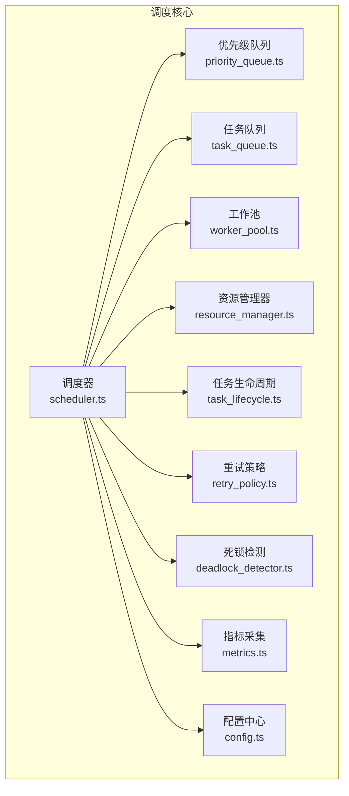
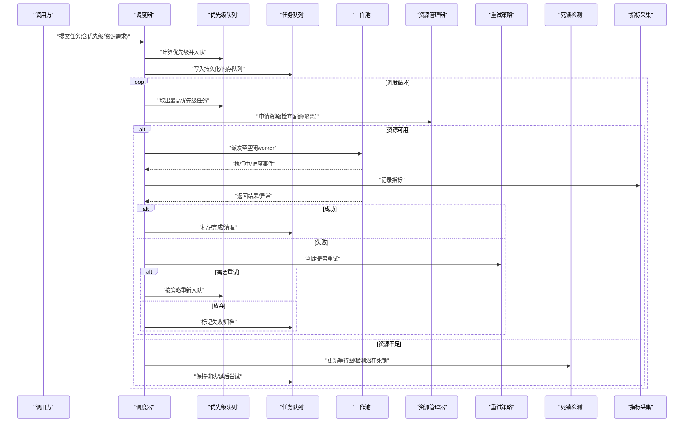
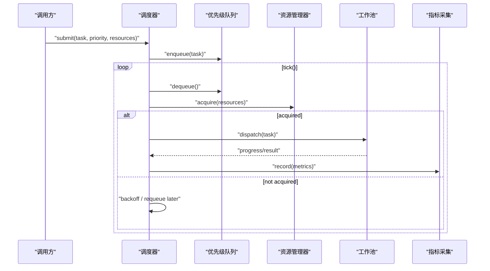
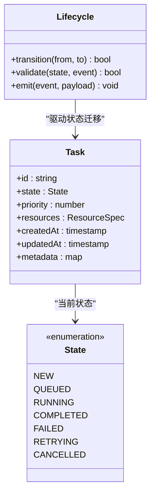
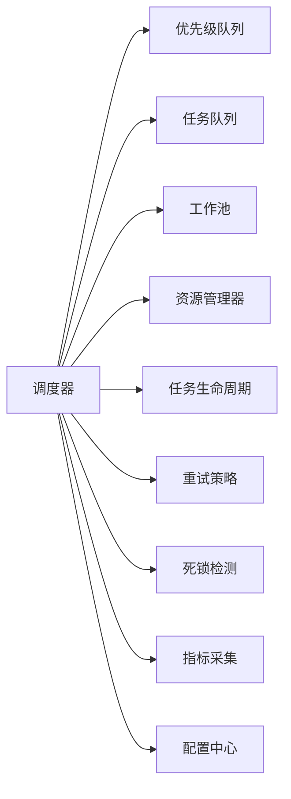
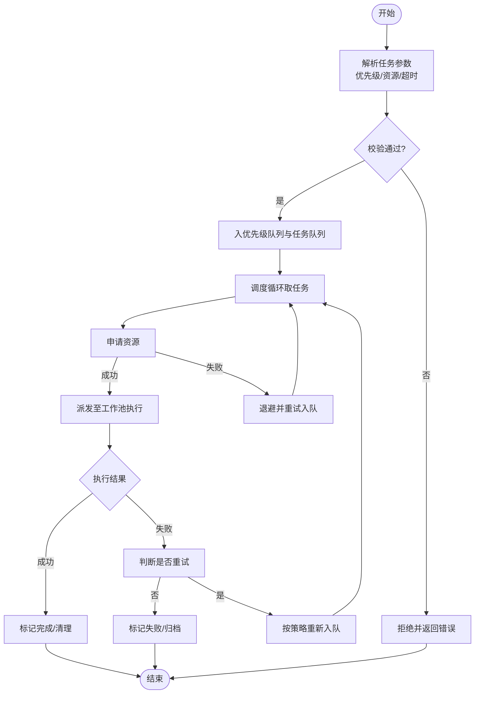

# 任务调度器

<cite>
**本文引用的文件**   
- [src/core/scheduler.ts](file://src/core/scheduler.ts)
- [src/core/queue/priority_queue.ts](file://src/core/queue/priority_queue.ts)
- [src/core/queue/task_queue.ts](file://src/core/queue/task_queue.ts)
- [src/core/worker_pool.ts](file://src/core/worker_pool.ts)
- [src/core/resource_manager.ts](file://src/core/resource_manager.ts)
- [src/core/task_lifecycle.ts](file://src/core/task_lifecycle.ts)
- [src/core/retry_policy.ts](file://src/core/retry_policy.ts)
- [src/core/deadlock_detector.ts](file://src/core/deadlock_detector.ts)
- [src/core/metrics.ts](file://src/core/metrics.ts)
- [src/core/config.ts](file://src/core/config.ts)
</cite>

## 目录
1. [简介](#简介)
2. [项目结构](#项目结构)
3. [核心组件](#核心组件)
4. [架构总览](#架构总览)
5. [详细组件分析](#详细组件分析)
6. [依赖关系分析](#依赖关系分析)
7. [性能考虑](#性能考虑)
8. [故障排查指南](#故障排查指南)
9. [结论](#结论)
10. [附录](#附录)

## 简介
本文件面向任务调度器的设计与实现，系统性阐述以下主题：
- 调度算法：优先级队列、时间片轮转与资源分配策略
- 任务生命周期：提交、排队、执行、完成与清理
- 并发模型：异步任务处理与同步任务协调
- 配置项：并发度限制、超时控制、资源隔离等
- 可观测性：状态跟踪与进度报告机制
- 可靠性：故障恢复、重试与死锁检测
- 调优与监控：关键参数与指标建议

## 项目结构
调度子系统位于 core 层，围绕“任务—队列—工作池—资源—可观测”的层次组织。下图给出模块级概览（概念图）：

[此图为概念结构示意，不直接映射具体源码文件，故无图示来源]

## 核心组件
- 调度器：编排任务从入队到出队、分配、执行、回收的全流程；维护调度策略与全局约束。
- 优先级队列：基于堆或类似结构实现 O(log n) 插入/弹出，支持按权重/到期时间/等级排序。
- 任务队列：承载待执行任务集合，提供多队列/分片能力以缓解热点。
- 工作池：管理 worker 生命周期、任务派发与结果回传，支持动态扩缩容。
- 资源管理器：抽象 CPU/内存/外部配额等资源，提供申请、释放与隔离语义。
- 任务生命周期：定义状态机（新建、排队、运行、完成、失败、重试、取消等）及转换规则。
- 重试策略：指数退避、抖动、最大重试次数、幂等键与去重。
- 死锁检测：基于等待图/资源占用图的周期扫描与告警/自愈。
- 指标采集：吞吐、延迟、队列长度、资源利用率、错误率等。
- 配置中心：集中管理调度策略、并发度、超时、隔离域等开关与阈值。

章节来源
- [src/core/scheduler.ts](file://src/core/scheduler.ts)
- [src/core/queue/priority_queue.ts](file://src/core/queue/priority_queue.ts)
- [src/core/queue/task_queue.ts](file://src/core/queue/task_queue.ts)
- [src/core/worker_pool.ts](file://src/core/worker_pool.ts)
- [src/core/resource_manager.ts](file://src/core/resource_manager.ts)
- [src/core/task_lifecycle.ts](file://src/core/task_lifecycle.ts)
- [src/core/retry_policy.ts](file://src/core/retry_policy.ts)
- [src/core/deadlock_detector.ts](file://src/core/deadlock_detector.ts)
- [src/core/metrics.ts](file://src/core/metrics.ts)
- [src/core/config.ts](file://src/core/config.ts)

## 架构总览
调度器作为中枢，将“策略—数据—执行—观测”解耦。整体交互如下：

图示来源
- [src/core/scheduler.ts](file://src/core/scheduler.ts)
- [src/core/queue/priority_queue.ts](file://src/core/queue/priority_queue.ts)
- [src/core/queue/task_queue.ts](file://src/core/queue/task_queue.ts)
- [src/core/worker_pool.ts](file://src/core/worker_pool.ts)
- [src/core/resource_manager.ts](file://src/core/resource_manager.ts)
- [src/core/retry_policy.ts](file://src/core/retry_policy.ts)
- [src/core/deadlock_detector.ts](file://src/core/deadlock_detector.ts)
- [src/core/metrics.ts](file://src/core/metrics.ts)

## 详细组件分析

### 调度器（Scheduler）
职责
- 统一入口：接收任务提交请求，解析策略与资源需求
- 调度循环：周期性从优先级队列取任务，结合资源可用性派发
- 策略编排：组合优先级、时间片、抢占、公平性、隔离域等
- 可观测：上报关键指标与状态变更

关键流程（时序）

图示来源
- [src/core/scheduler.ts](file://src/core/scheduler.ts)
- [src/core/queue/priority_queue.ts](file://src/core/queue/priority_queue.ts)
- [src/core/resource_manager.ts](file://src/core/resource_manager.ts)
- [src/core/worker_pool.ts](file://src/core/worker_pool.ts)
- [src/core/metrics.ts](file://src/core/metrics.ts)

章节来源
- [src/core/scheduler.ts](file://src/core/scheduler.ts)

### 优先级队列（PriorityQueue）
数据结构与复杂度
- 典型采用二叉堆/斐波那契堆，插入/删除均摊 O(log n)，top 访问 O(1)
- 支持自定义比较函数：权重、到期时间、公平因子、租户/隔离域

操作要点
- 入队：计算综合优先级（权重+时效+公平补偿），插入堆
- 出队：弹出最高优先级任务，必要时触发公平补偿
- 惰性删除：支持延迟清理无效条目，降低写放大

章节来源
- [src/core/queue/priority_queue.ts](file://src/core/queue/priority_queue.ts)

### 任务队列（TaskQueue）
功能
- 多队列/分片：按租户、类型、隔离域划分，避免单点瓶颈
- 持久化与恢复：崩溃后可从持久层恢复未完成任务
- 背压：当队列深度超过阈值时，拒绝新任务或降级

章节来源
- [src/core/queue/task_queue.ts](file://src/core/queue/task_queue.ts)

### 工作池（WorkerPool）
职责
- Worker 生命周期管理：启动、健康检查、优雅退出
- 任务派发：根据负载与亲和性选择目标 worker
- 结果聚合：收集进度、日志、指标与异常

并发模型
- 异步任务：通过事件驱动/消息通道传递进度与结果
- 同步协调：对强一致场景提供屏障/等待原语，确保阶段完成后再推进

章节来源
- [src/core/worker_pool.ts](file://src/core/worker_pool.ts)

### 资源管理器（ResourceManager）
策略
- 资源抽象：CPU、内存、GPU、外部配额（如 API 限流）
- 分配模式：独占/共享、配额上限、预留与抢占
- 隔离域：按租户/业务域进行资源隔离与配额管控

章节来源
- [src/core/resource_manager.ts](file://src/core/resource_manager.ts)

### 任务生命周期（TaskLifecycle）
状态机（类图）

图示来源
- [src/core/task_lifecycle.ts](file://src/core/task_lifecycle.ts)

章节来源
- [src/core/task_lifecycle.ts](file://src/core/task_lifecycle.ts)

### 重试策略（RetryPolicy）
策略要素
- 最大重试次数、退避基数、退避上限、抖动系数
- 条件重试：仅对特定错误码/异常类型重试
- 幂等与去重：基于幂等键避免重复执行

章节来源
- [src/core/retry_policy.ts](file://src/core/retry_policy.ts)

### 死锁检测（DeadlockDetector）
方法
- 构建等待图：节点为任务/资源，边表示“任务等待资源”
- 周期扫描：检测环路与长等待，触发告警/自动化解法（如取消低优先级任务）
- 保护窗口：避免误报，引入稳定期与阈值

章节来源
- [src/core/deadlock_detector.ts](file://src/core/deadlock_detector.ts)

### 指标采集（Metrics）
指标类别
- 吞吐：入队速率、出队速率、完成速率
- 延迟：排队时长、执行时长、端到端延迟
- 资源：CPU/内存/GPU 使用率、配额占用
- 质量：错误率、重试率、超时率、死锁告警数

章节来源
- [src/core/metrics.ts](file://src/core/metrics.ts)

### 配置中心（Config）
关键选项（示例）
- 并发度：max_concurrency、per_tenant_concurrency
- 超时：task_timeout、idle_timeout、reconnect_timeout
- 资源隔离：isolation_domains、quota_per_domain
- 队列：shard_count、backpressure_threshold
- 重试：max_retries、base_backoff_ms、jitter_factor
- 观测：metrics_interval、log_level

章节来源
- [src/core/config.ts](file://src/core/config.ts)

## 依赖关系分析
模块间依赖与耦合关系如下：

图示来源
- [src/core/scheduler.ts](file://src/core/scheduler.ts)
- [src/core/queue/priority_queue.ts](file://src/core/queue/priority_queue.ts)
- [src/core/queue/task_queue.ts](file://src/core/queue/task_queue.ts)
- [src/core/worker_pool.ts](file://src/core/worker_pool.ts)
- [src/core/resource_manager.ts](file://src/core/resource_manager.ts)
- [src/core/task_lifecycle.ts](file://src/core/task_lifecycle.ts)
- [src/core/retry_policy.ts](file://src/core/retry_policy.ts)
- [src/core/deadlock_detector.ts](file://src/core/deadlock_detector.ts)
- [src/core/metrics.ts](file://src/core/metrics.ts)
- [src/core/config.ts](file://src/core/config.ts)

章节来源
- [src/core/scheduler.ts](file://src/core/scheduler.ts)

## 性能考虑
- 队列优化
  - 批量出队/入队以降低锁竞争
  - 分片队列减少热点，按租户/类型路由
  - 惰性删除与压缩，降低存储压力
- 调度算法
  - 多级反馈队列：短任务优先，长任务降权
  - 公平因子：防止饥饿，定期补偿低优先级任务
  - 抢占与时间片：对交互式任务给予更高响应性
- 资源管理
  - 预分配与池化，减少频繁申请/释放开销
  - 超卖与弹性伸缩：在安全边界内提升利用率
- 可观测与自适应
  - 基于指标动态调整并发度与退避参数
  - 慢消费者检测与限速，避免雪崩

[本节为通用指导，无需源码引用]

## 故障排查指南
常见问题与定位步骤
- 任务堆积
  - 检查队列深度与出队速率，确认是否存在背压阈值触发
  - 观察资源配额是否耗尽，隔离域是否过载
- 高延迟
  - 查看排队时长与执行时长分布，识别热点 worker
  - 检查重试风暴与退避策略是否过激
- 频繁失败
  - 核对重试条件与幂等键，避免无限重试
  - 关注超时设置与外部依赖稳定性
- 死锁/卡住
  - 启用死锁检测，查看等待图环路
  - 针对长等待任务实施降级或取消

章节来源
- [src/core/deadlock_detector.ts](file://src/core/deadlock_detector.ts)
- [src/core/retry_policy.ts](file://src/core/retry_policy.ts)
- [src/core/metrics.ts](file://src/core/metrics.ts)

## 结论
本调度器以“优先级+时间片+资源隔离”为核心，配合可靠的重试与死锁检测，形成高吞吐、低延迟且具备弹性的任务执行体系。通过完善的指标与配置，可在不同业务场景下快速调优与落地。

[本节为总结，无需源码引用]

## 附录

### 任务提交流程（流程图）

[此图为概念流程示意，不直接映射具体源码文件，故无图示来源]