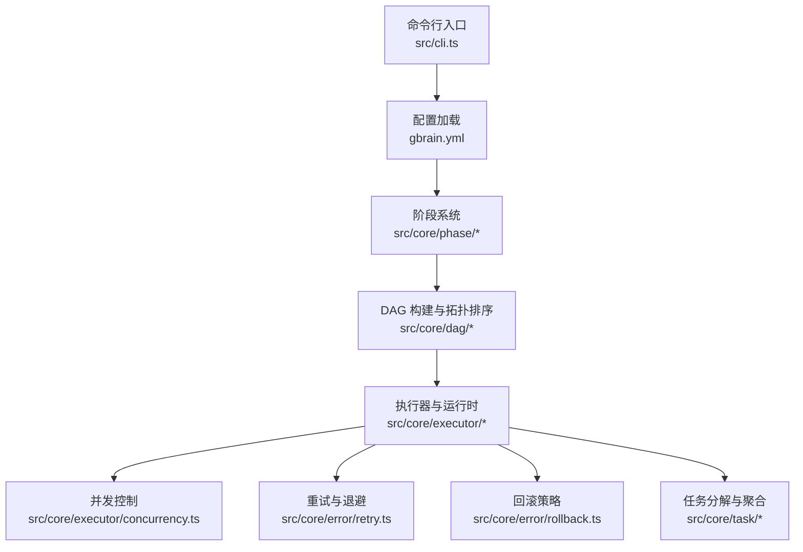
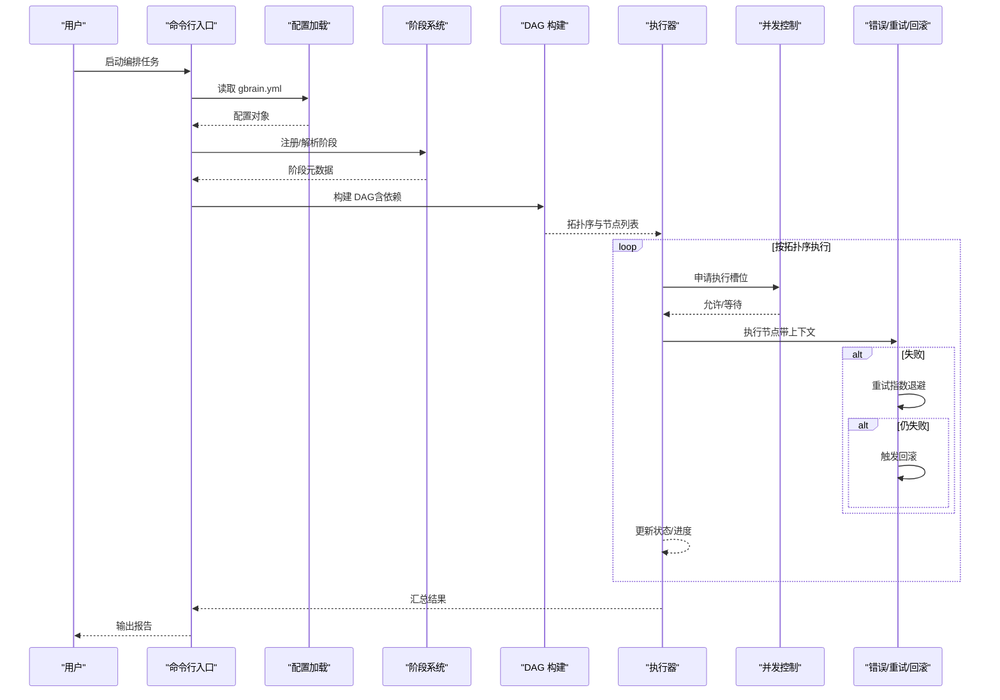
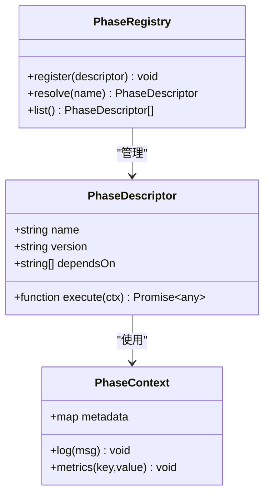
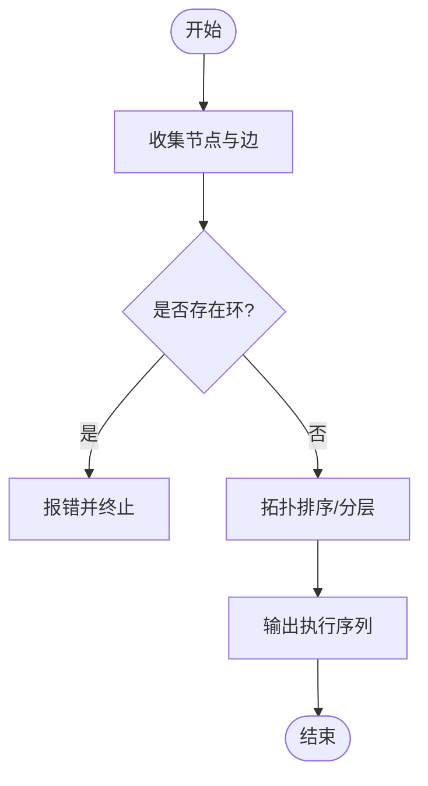
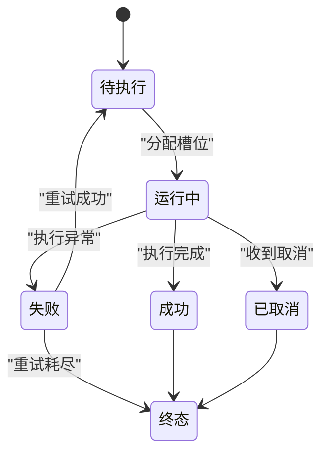
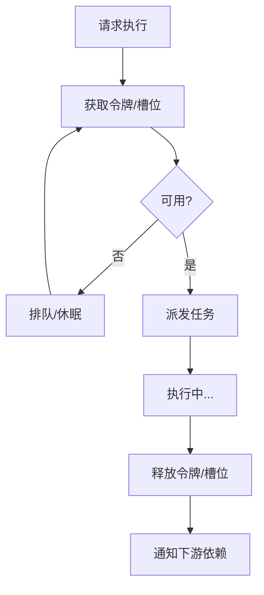
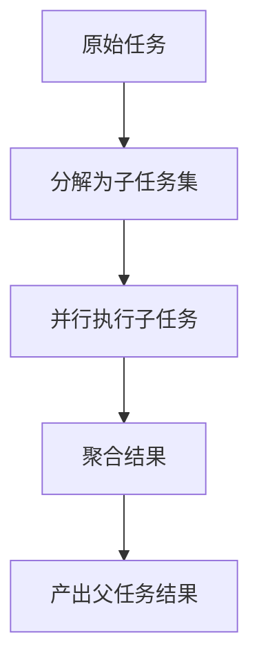
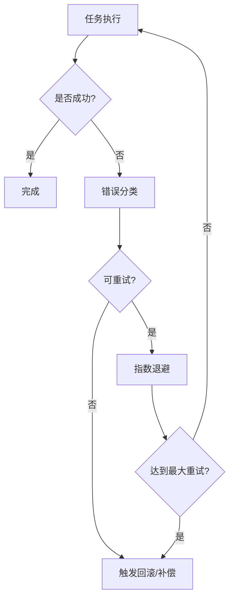
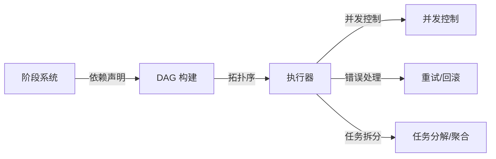

# 工作流编排引擎

<cite>
**本文引用的文件**   
- [README.md](file://README.md)
- [package.json](file://package.json)
- [src/cli.ts](file://src/cli.ts)
- [src/core/phase/index.ts](file://src/core/phase/index.ts)
- [src/core/phase/types.ts](file://src/core/phase/types.ts)
- [src/core/phase/builder.ts](file://src/core/phase/builder.ts)
- [src/core/executor/index.ts](file://src/core/executor/index.ts)
- [src/core/executor/runtime.ts](file://src/core/executor/runtime.ts)
- [src/core/executor/concurrency.ts](file://src/core/executor/concurrency.ts)
- [src/core/dag/index.ts](file://src/core/dag/index.ts)
- [src/core/dag/topo.ts](file://src/core/dag/topo.ts)
- [src/core/task/decomposer.ts](file://src/core/task/decomposer.ts)
- [src/core/task/aggregator.ts](file://src/core/task/aggregator.ts)
- [src/core/error/retry.ts](file://src/core/error/retry.ts)
- [src/core/error/rollback.ts](file://src/core/error/rollback.ts)
- [gbrain.yml](file://gbrain.yml)
</cite>

## 目录
1. [简介](#简介)
2. [项目结构](#项目结构)
3. [核心组件](#核心组件)
4. [架构总览](#架构总览)
5. [详细组件分析](#详细组件分析)
6. [依赖关系分析](#依赖关系分析)
7. [性能考量](#性能考量)
8. [故障排查指南](#故障排查指南)
9. [结论](#结论)
10. [附录](#附录)

## 简介
本文件面向“工作流编排引擎”的设计与实现，系统性阐述工作流的定义、解析与执行机制，覆盖 DAG（有向无环图）构建、依赖分析与执行顺序确定；阶段（Phase）系统的设计与扩展；任务分解策略与结果聚合；并发控制（并行、同步点、负载均衡）；配置语法规范与最佳实践；以及错误处理、重试与回滚策略。文档力求在工程细节与可读性之间取得平衡，帮助读者快速理解并高效使用工作流编排能力。

## 项目结构
仓库采用分层组织：入口命令层、核心运行时（DAG、阶段、执行器）、任务分解与聚合、错误与重试、以及配置与示例。下图给出与编排引擎相关的顶层模块划分及相互关系。

图表来源
- [src/cli.ts:1-200](file://src/cli.ts#L1-L200)
- [gbrain.yml:1-200](file://gbrain.yml#L1-L200)
- [src/core/phase/index.ts:1-200](file://src/core/phase/index.ts#L1-L200)
- [src/core/dag/index.ts:1-200](file://src/core/dag/index.ts#L1-L200)
- [src/core/executor/index.ts:1-200](file://src/core/executor/index.ts#L1-L200)
- [src/core/executor/concurrency.ts:1-200](file://src/core/executor/concurrency.ts#L1-L200)
- [src/core/error/retry.ts:1-200](file://src/core/error/retry.ts#L1-L200)
- [src/core/error/rollback.ts:1-200](file://src/core/error/rollback.ts#L1-L200)
- [src/core/task/decomposer.ts:1-200](file://src/core/task/decomposer.ts#L1-L200)
- [src/core/task/aggregator.ts:1-200](file://src/core/task/aggregator.ts#L1-L200)

章节来源
- [README.md:1-200](file://README.md#L1-L200)
- [package.json:1-200](file://package.json#L1-L200)
- [src/cli.ts:1-200](file://src/cli.ts#L1-L200)
- [gbrain.yml:1-200](file://gbrain.yml#L1-L200)

## 核心组件
- 阶段（Phase）系统：提供预定义阶段与可扩展的自定义阶段注册机制，支持生命周期钩子与上下文传递。
- DAG 构建与拓扑排序：基于阶段与任务依赖生成 DAG，进行环检测与线性化执行序列计算。
- 执行器与运行时：负责调度节点执行、状态管理、进度上报与资源清理。
- 并发控制：通过线程池/进程池或异步队列实现并行度上限、背压与负载均衡。
- 任务分解与聚合：将复杂任务拆分为子任务，按依赖关系执行后汇总结果。
- 错误处理、重试与回滚：统一异常分类、指数退避重试、可插拔的回滚策略。

章节来源
- [src/core/phase/types.ts:1-200](file://src/core/phase/types.ts#L1-L200)
- [src/core/phase/builder.ts:1-200](file://src/core/phase/builder.ts#L1-L200)
- [src/core/dag/topo.ts:1-200](file://src/core/dag/topo.ts#L1-L200)
- [src/core/executor/runtime.ts:1-200](file://src/core/executor/runtime.ts#L1-L200)
- [src/core/executor/concurrency.ts:1-200](file://src/core/executor/concurrency.ts#L1-L200)
- [src/core/task/decomposer.ts:1-200](file://src/core/task/decomposer.ts#L1-L200)
- [src/core/task/aggregator.ts:1-200](file://src/core/task/aggregator.ts#L1-L200)
- [src/core/error/retry.ts:1-200](file://src/core/error/retry.ts#L1-L200)
- [src/core/error/rollback.ts:1-200](file://src/core/error/rollback.ts#L1-L200)

## 架构总览
下图展示从配置到执行的端到端流程：CLI 读取配置，解析阶段与任务，构建 DAG，执行器依据拓扑序调度，期间由并发控制器限制并行度，错误处理器捕获异常并触发重试/回滚。

图表来源
- [src/cli.ts:1-200](file://src/cli.ts#L1-L200)
- [gbrain.yml:1-200](file://gbrain.yml#L1-L200)
- [src/core/phase/index.ts:1-200](file://src/core/phase/index.ts#L1-L200)
- [src/core/dag/index.ts:1-200](file://src/core/dag/index.ts#L1-L200)
- [src/core/executor/index.ts:1-200](file://src/core/executor/index.ts#L1-L200)
- [src/core/executor/concurrency.ts:1-200](file://src/core/executor/concurrency.ts#L1-L200)
- [src/core/error/retry.ts:1-200](file://src/core/error/retry.ts#L1-L200)
- [src/core/error/rollback.ts:1-200](file://src/core/error/rollback.ts#L1-L200)

## 详细组件分析

### 阶段（Phase）系统
- 设计要点
  - 阶段类型：预定义阶段（如初始化、准备、执行、收尾）与自定义阶段（通过注册表扩展）。
  - 生命周期：进入前校验、执行体、退出后清理；支持中间态持久化与恢复。
  - 上下文：跨阶段共享的键值空间，用于传递工件路径、指标、临时状态等。
  - 扩展方式：提供统一的接口契约与注册 API，避免侵入式修改。
- 关键数据结构
  - Phase 描述符：名称、版本、输入/输出契约、依赖的阶段集合、执行函数签名。
  - 阶段实例：运行期状态、上下文句柄、日志与度量通道。
- 复杂度与性能
  - 阶段注册为 O(1)，解析阶段依赖为 O(V+E)。
  - 上下文读写为 O(1)，建议避免大对象频繁拷贝，改用引用或外部存储。

图表来源
- [src/core/phase/types.ts:1-200](file://src/core/phase/types.ts#L1-L200)
- [src/core/phase/builder.ts:1-200](file://src/core/phase/builder.ts#L1-L200)
- [src/core/phase/index.ts:1-200](file://src/core/phase/index.ts#L1-L200)

章节来源
- [src/core/phase/types.ts:1-200](file://src/core/phase/types.ts#L1-L200)
- [src/core/phase/builder.ts:1-200](file://src/core/phase/builder.ts#L1-L200)
- [src/core/phase/index.ts:1-200](file://src/core/phase/index.ts#L1-L200)

### DAG 构建与拓扑排序
- 构建流程
  - 收集所有阶段与任务节点，建立边表示依赖关系。
  - 环检测：若存在环则拒绝执行并返回具体环信息。
  - 拓扑排序：生成多组可并行执行的层级，便于后续并发调度。
- 算法特性
  - 时间复杂度 O(V+E)，空间复杂度 O(V+E)。
  - 支持增量更新：新增/删除节点时局部重算。
- 可视化与调试
  - 导出 DOT/JSON 供外部工具渲染。
  - 记录关键路径与瓶颈节点。

图表来源
- [src/core/dag/index.ts:1-200](file://src/core/dag/index.ts#L1-L200)
- [src/core/dag/topo.ts:1-200](file://src/core/dag/topo.ts#L1-L200)

章节来源
- [src/core/dag/index.ts:1-200](file://src/core/dag/index.ts#L1-L200)
- [src/core/dag/topo.ts:1-200](file://src/core/dag/topo.ts#L1-L200)

### 执行器与运行时
- 职责
  - 维护运行期状态机（待执行、运行中、成功、失败、已取消）。
  - 驱动拓扑序执行，协调并发控制与错误处理。
  - 提供进度事件、指标采集与检查点。
- 关键流程
  - 入队：根据拓扑序将节点加入调度队列。
  - 出队：受并发控制器许可后派发执行。
  - 完成：更新下游依赖就绪状态，必要时触发聚合。
- 健壮性
  - 心跳与超时保护，防止僵尸任务。
  - 优雅关闭：收到中断信号后停止新任务，等待在途任务完成或取消。

图表来源
- [src/core/executor/index.ts:1-200](file://src/core/executor/index.ts#L1-L200)
- [src/core/executor/runtime.ts:1-200](file://src/core/executor/runtime.ts#L1-L200)

章节来源
- [src/core/executor/index.ts:1-200](file://src/core/executor/index.ts#L1-L200)
- [src/core/executor/runtime.ts:1-200](file://src/core/executor/runtime.ts#L1-L200)

### 并发控制（并行、同步点、负载均衡）
- 并行度上限
  - 全局最大并发数与每阶段独立并发数。
  - 基于令牌桶或队列容量实现背压。
- 同步点
  - 显式屏障：等待一组节点全部完成后继续。
  - 条件同步：当满足某谓词时放行下游。
- 负载均衡
  - 按资源标签（CPU/GPU/IO）选择合适执行槽位。
  - 亲和性与反亲和性约束，避免热点。

图表来源
- [src/core/executor/concurrency.ts:1-200](file://src/core/executor/concurrency.ts#L1-L200)

章节来源
- [src/core/executor/concurrency.ts:1-200](file://src/core/executor/concurrency.ts#L1-L200)

### 任务分解与结果聚合
- 分解策略
  - 规则驱动：按输入规模、数据类型或外部配额切分。
  - 自适应：根据历史耗时与资源占用动态调整粒度。
- 子任务管理
  - 父子关系映射、继承上下文、隔离错误域。
- 结果聚合
  - 合并策略：去重、归并、加权平均、投票等。
  - 幂等性：重复聚合不改变最终结果。

图表来源
- [src/core/task/decomposer.ts:1-200](file://src/core/task/decomposer.ts#L1-L200)
- [src/core/task/aggregator.ts:1-200](file://src/core/task/aggregator.ts#L1-L200)

章节来源
- [src/core/task/decomposer.ts:1-200](file://src/core/task/decomposer.ts#L1-L200)
- [src/core/task/aggregator.ts:1-200](file://src/core/task/aggregator.ts#L1-L200)

### 错误处理、重试与回滚
- 错误分类
  - 可重试（网络抖动、限流）、不可重试（参数错误、权限不足）。
- 重试策略
  - 指数退避、抖动、最大重试次数、重试窗口。
- 回滚策略
  - 声明式快照：在执行前保存必要状态，失败时恢复。
  - 补偿操作：对副作用进行反向修正。
- 传播与熔断
  - 上游感知失败，快速失败或降级执行。
  - 熔断阈值与冷却时间，避免雪崩。

图表来源
- [src/core/error/retry.ts:1-200](file://src/core/error/retry.ts#L1-L200)
- [src/core/error/rollback.ts:1-200](file://src/core/error/rollback.ts#L1-L200)

章节来源
- [src/core/error/retry.ts:1-200](file://src/core/error/retry.ts#L1-L200)
- [src/core/error/rollback.ts:1-200](file://src/core/error/rollback.ts#L1-L200)

## 依赖关系分析
- 模块耦合
  - 执行器强依赖 DAG 与并发控制；弱依赖错误处理（可通过策略注入）。
  - 阶段系统与 DAG 解耦：阶段仅暴露依赖声明，不参与调度。
- 外部依赖
  - 配置加载来自 YAML；日志与指标通过适配器接入。
- 潜在循环
  - 严格禁止阶段间循环依赖；DAG 层做静态环检测。

图表来源
- [src/core/phase/index.ts:1-200](file://src/core/phase/index.ts#L1-L200)
- [src/core/dag/index.ts:1-200](file://src/core/dag/index.ts#L1-L200)
- [src/core/executor/index.ts:1-200](file://src/core/executor/index.ts#L1-L200)
- [src/core/executor/concurrency.ts:1-200](file://src/core/executor/concurrency.ts#L1-L200)
- [src/core/error/retry.ts:1-200](file://src/core/error/retry.ts#L1-L200)
- [src/core/error/rollback.ts:1-200](file://src/core/error/rollback.ts#L1-L200)
- [src/core/task/decomposer.ts:1-200](file://src/core/task/decomposer.ts#L1-L200)
- [src/core/task/aggregator.ts:1-200](file://src/core/task/aggregator.ts#L1-L200)

章节来源
- [src/core/phase/index.ts:1-200](file://src/core/phase/index.ts#L1-L200)
- [src/core/dag/index.ts:1-200](file://src/core/dag/index.ts#L1-L200)
- [src/core/executor/index.ts:1-200](file://src/core/executor/index.ts#L1-L200)
- [src/core/executor/concurrency.ts:1-200](file://src/core/executor/concurrency.ts#L1-L200)
- [src/core/error/retry.ts:1-200](file://src/core/error/retry.ts#L1-L200)
- [src/core/error/rollback.ts:1-200](file://src/core/error/rollback.ts#L1-L200)
- [src/core/task/decomposer.ts:1-200](file://src/core/task/decomposer.ts#L1-L200)
- [src/core/task/aggregator.ts:1-200](file://src/core/task/aggregator.ts#L1-L200)

## 性能考量
- 并行度调优
  - 根据 CPU/IO/GPU 资源特征设置不同阶段的并发上限。
  - 使用背压避免内存膨胀与 GC 压力。
- I/O 与缓存
  - 对读多写少的中间产物启用本地/分布式缓存。
  - 批量写入与合并减少锁竞争。
- 监控与观测
  - 关键路径耗时、吞吐、失败率、重试次数、回滚次数。
  - 采样日志与结构化指标，便于定位热点与瓶颈。

## 故障排查指南
- 常见问题
  - 环依赖：检查阶段/任务依赖声明，确认无闭环。
  - 并发不足：观察队列积压与槽位利用率，适当提升上限。
  - 重试风暴：检查退避参数与抖动，避免雪崩。
  - 回滚失败：确认快照完整性与补偿幂等性。
- 诊断步骤
  - 导出 DAG 与执行轨迹，定位失败节点与上游影响。
  - 查看阶段上下文与指标，判断是否为资源争用或外部依赖问题。
  - 开启更细粒度的日志与追踪 ID，复现问题链路。

章节来源
- [src/core/dag/topo.ts:1-200](file://src/core/dag/topo.ts#L1-L200)
- [src/core/executor/runtime.ts:1-200](file://src/core/executor/runtime.ts#L1-L200)
- [src/core/error/retry.ts:1-200](file://src/core/error/retry.ts#L1-L200)
- [src/core/error/rollback.ts:1-200](file://src/core/error/rollback.ts#L1-L200)

## 结论
本工作流编排引擎以“阶段+DAG+执行器”为核心，结合可插拔的并发控制、错误处理与任务分解聚合能力，提供了高内聚、低耦合且可扩展的执行框架。通过合理的配置与最佳实践，可在保证稳定性的同时获得良好的吞吐与弹性。

## 附录

### 配置文件语法规范（gbrain.yml）
- 顶层字段
  - workflow：工作流元信息与全局开关
  - phases：阶段定义与依赖
  - tasks：任务定义与参数
  - concurrency：并发与负载均衡策略
  - retry：重试与退避策略
  - rollback：回滚策略与快照范围
  - observability：日志与指标输出
- 关键字段说明
  - phases[].depends_on：字符串数组，声明前置阶段
  - tasks[].fanout：子任务拆分策略与上限
  - concurrency.global_max：全局最大并发
  - retry.max_attempts：最大重试次数
  - rollback.snapshot_scope：需要快照的数据范围
- 最佳实践
  - 明确阶段边界与输入输出契约，避免隐式共享状态
  - 合理设置 fanout 与 global_max，避免资源过载
  - 对幂等性要求高的操作启用重试；对副作用操作谨慎回滚
  - 为关键路径添加指标与告警

章节来源
- [gbrain.yml:1-200](file://gbrain.yml#L1-L200)