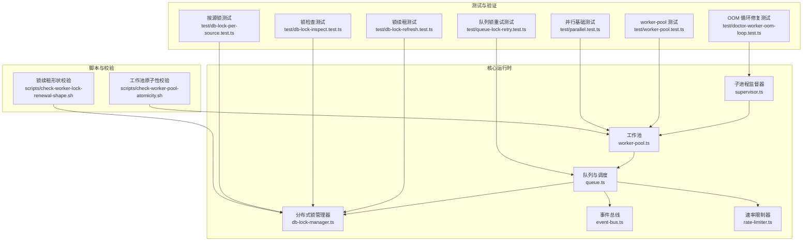
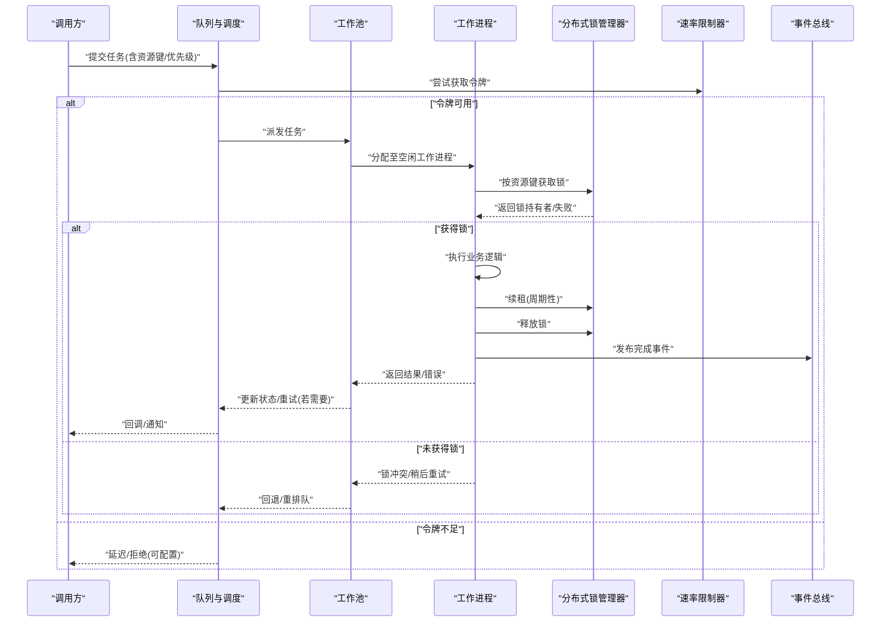
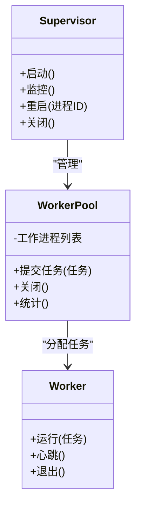
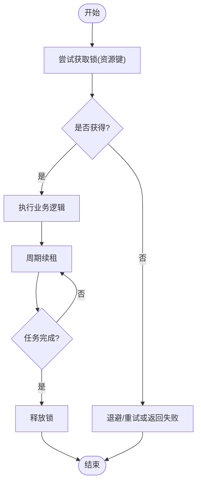
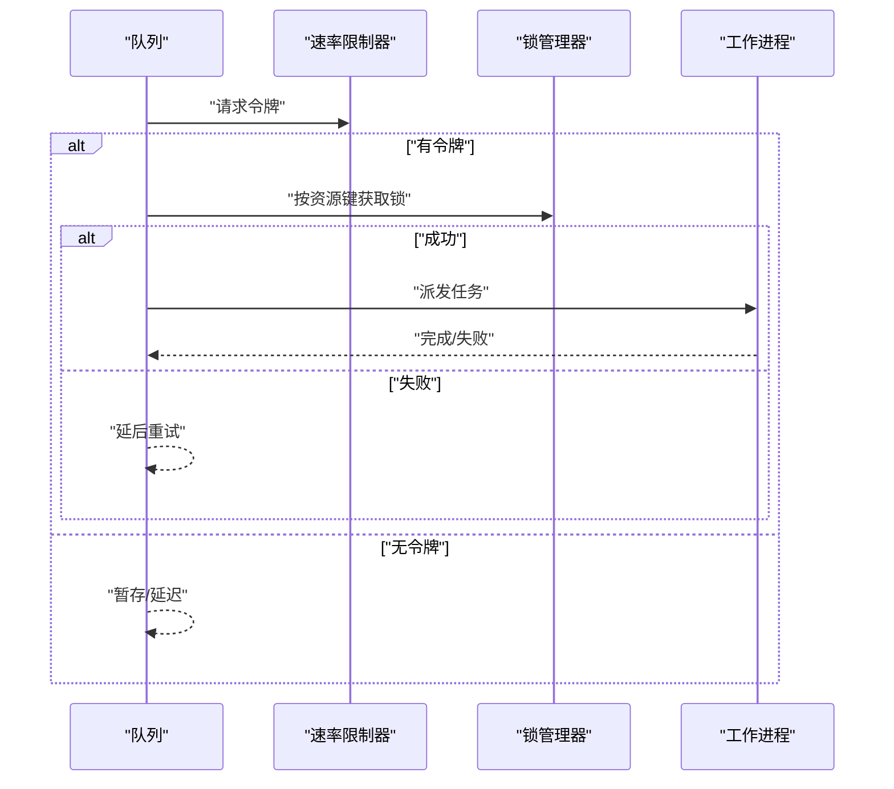
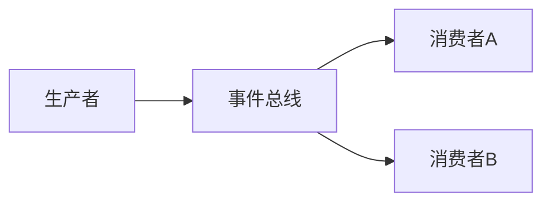
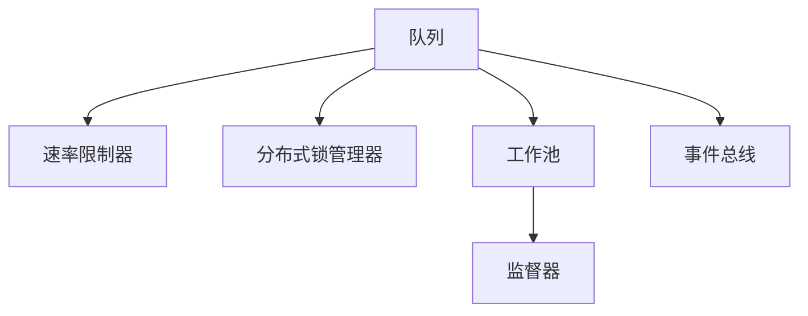

# 并发控制机制

<cite>
**本文引用的文件**   
- [src/core/worker-pool.ts](file://src/core/worker-pool.ts)
- [src/core/supervisor.ts](file://src/core/supervisor.ts)
- [src/core/db-lock-manager.ts](file://src/core/db-lock-manager.ts)
- [src/core/queue.ts](file://src/core/queue.ts)
- [src/core/event-bus.ts](file://src/core/event-bus.ts)
- [src/core/rate-limiter.ts](file://src/core/rate-limiter.ts)
- [scripts/check-worker-pool-atomicity.sh](file://scripts/check-worker-pool-atomicity.sh)
- [scripts/check-worker-lock-renewal-shape.sh](file://scripts/check-worker-lock-renewal-shape.sh)
- [test/parallel.test.ts](file://test/parallel.test.ts)
- [test/worker-pool.test.ts](file://test/worker-pool.test.ts)
- [test/db-lock-refresh.test.ts](file://test/db-lock-refresh.test.ts)
- [test/db-lock-inspect.test.ts](file://test/db-lock-inspect.test.ts)
- [test/db-lock-per-source.test.ts](file://test/db-lock-per-source.test.ts)
- [test/queue-lock-retry.test.ts](file://test/queue-lock-retry.test.ts)
- [test/doctor-worker-oom-loop.test.ts](file://test/doctor-worker-oom-loop.test.ts)
</cite>

## 目录
1. [简介](#简介)
2. [项目结构](#项目结构)
3. [核心组件](#核心组件)
4. [架构总览](#架构总览)
5. [详细组件分析](#详细组件分析)
6. [依赖关系分析](#依赖关系分析)
7. [性能考量](#性能考量)
8. [故障排查指南](#故障排查指南)
9. [结论](#结论)
10. [附录](#附录)

## 简介
本文件系统性梳理并文档化该仓库中的并发控制机制，覆盖以下关键主题：
- 工作流并发执行模型：并行任务执行、线程池（工作进程）管理、内存隔离
- 同步点设计：屏障同步、条件等待、事件驱动同步
- 负载均衡策略：动态扩缩容、任务分发、热点规避
- 锁机制实现：分布式锁、细粒度锁、锁升级策略
- 并发安全编程最佳实践与常见陷阱
- 并发性能监控、瓶颈分析与调优指南

## 项目结构
围绕并发控制的核心代码主要分布在 src/core 下，配套测试位于 test 目录，脚本位于 scripts 目录。下图给出与并发相关的顶层模块概览。

图表来源
- [src/core/worker-pool.ts](file://src/core/worker-pool.ts)
- [src/core/supervisor.ts](file://src/core/supervisor.ts)
- [src/core/queue.ts](file://src/core/queue.ts)
- [src/core/db-lock-manager.ts](file://src/core/db-lock-manager.ts)
- [src/core/event-bus.ts](file://src/core/event-bus.ts)
- [src/core/rate-limiter.ts](file://src/core/rate-limiter.ts)
- [scripts/check-worker-pool-atomicity.sh](file://scripts/check-worker-pool-atomicity.sh)
- [scripts/check-worker-lock-renewal-shape.sh](file://scripts/check-worker-lock-renewal-shape.sh)
- [test/worker-pool.test.ts](file://test/worker-pool.test.ts)
- [test/parallel.test.ts](file://test/parallel.test.ts)
- [test/db-lock-refresh.test.ts](file://test/db-lock-refresh.test.ts)
- [test/db-lock-inspect.test.ts](file://test/db-lock-inspect.test.ts)
- [test/db-lock-per-source.test.ts](file://test/db-lock-per-source.test.ts)
- [test/queue-lock-retry.test.ts](file://test/queue-lock-retry.test.ts)
- [test/doctor-worker-oom-loop.test.ts](file://test/doctor-worker-oom-loop.test.ts)

章节来源
- [src/core/worker-pool.ts](file://src/core/worker-pool.ts)
- [src/core/supervisor.ts](file://src/core/supervisor.ts)
- [src/core/queue.ts](file://src/core/queue.ts)
- [src/core/db-lock-manager.ts](file://src/core/db-lock-manager.ts)
- [src/core/event-bus.ts](file://src/core/event-bus.ts)
- [src/core/rate-limiter.ts](file://src/core/rate-limiter.ts)
- [scripts/check-worker-pool-atomicity.sh](file://scripts/check-worker-pool-atomicity.sh)
- [scripts/check-worker-lock-renewal-shape.sh](file://scripts/check-worker-lock-renewal-shape.sh)
- [test/worker-pool.test.ts](file://test/worker-pool.test.ts)
- [test/parallel.test.ts](file://test/parallel.test.ts)
- [test/db-lock-refresh.test.ts](file://test/db-lock-refresh.test.ts)
- [test/db-lock-inspect.test.ts](file://test/db-lock-inspect.test.ts)
- [test/db-lock-per-source.test.ts](file://test/db-lock-per-source.test.ts)
- [test/queue-lock-retry.test.ts](file://test/queue-lock-retry.test.ts)
- [test/doctor-worker-oom-loop.test.ts](file://test/doctor-worker-oom-loop.test.ts)

## 核心组件
- 工作池（Worker Pool）：负责创建、复用和回收工作进程；提供任务提交、并发度上限、背压与优雅关闭等能力。
- 子进程监督器（Supervisor）：负责工作进程的启动、健康检查、崩溃恢复与资源清理。
- 队列与调度（Queue）：承载待处理任务，支持优先级、限流、重试与幂等语义。
- 分布式锁管理器（DB Lock Manager）：基于数据库的分布式锁，提供获取、续租、释放与检查能力，支持按资源键的细粒度锁。
- 事件总线（Event Bus）：进程内/跨进程的事件发布订阅，用于解耦与异步协调。
- 速率限制器（Rate Limiter）：令牌桶或漏桶实现，保护下游服务与数据库免受突发流量冲击。

章节来源
- [src/core/worker-pool.ts](file://src/core/worker-pool.ts)
- [src/core/supervisor.ts](file://src/core/supervisor.ts)
- [src/core/queue.ts](file://src/core/queue.ts)
- [src/core/db-lock-manager.ts](file://src/core/db-lock-manager.ts)
- [src/core/event-bus.ts](file://src/core/event-bus.ts)
- [src/core/rate-limiter.ts](file://src/core/rate-limiter.ts)

## 架构总览
下图展示从任务入队到工作进程执行的端到端流程，以及锁、速率限制与事件的参与点。

图表来源
- [src/core/queue.ts](file://src/core/queue.ts)
- [src/core/worker-pool.ts](file://src/core/worker-pool.ts)
- [src/core/db-lock-manager.ts](file://src/core/db-lock-manager.ts)
- [src/core/rate-limiter.ts](file://src/core/rate-limiter.ts)
- [src/core/event-bus.ts](file://src/core/event-bus.ts)

## 详细组件分析

### 工作池与工作进程生命周期
- 职责边界
  - 工作池：维护固定或弹性大小的工作进程集合，提供任务提交接口、并发上限控制、背压与优雅关闭。
  - 监督器：监控工作进程健康，自动重启异常进程，收集指标，防止僵尸进程。
- 并发模型
  - 每个工作进程为独立内存空间，天然具备内存隔离。
  - 通过队列+工作池将“生产者-消费者”解耦，避免阻塞主循环。
- 关键行为
  - 任务提交：带优先级与可选超时；当池满时触发背压（丢弃/延迟/排队）。
  - 进程回收：检测心跳/退出码，必要时重建进程。
  - 优雅关闭：停止接受新任务，等待在途任务完成或强制终止。

图表来源
- [src/core/supervisor.ts](file://src/core/supervisor.ts)
- [src/core/worker-pool.ts](file://src/core/worker-pool.ts)

章节来源
- [src/core/worker-pool.ts](file://src/core/worker-pool.ts)
- [src/core/supervisor.ts](file://src/core/supervisor.ts)
- [test/worker-pool.test.ts](file://test/worker-pool.test.ts)
- [test/doctor-worker-oom-loop.test.ts](file://test/doctor-worker-oom-loop.test.ts)
- [scripts/check-worker-pool-atomicity.sh](file://scripts/check-worker-pool-atomicity.sh)

### 分布式锁管理器（数据库锁）
- 目标
  - 在多进程/多实例环境下保证同一资源的互斥访问。
  - 支持锁续租以应对长事务/长任务。
  - 提供锁检查与诊断能力。
- 关键特性
  - 细粒度锁：以资源键为粒度，降低锁竞争。
  - 锁升级：从读锁到写锁的升级路径（如适用），需遵循一致的加锁顺序以避免死锁。
  - 公平性与抢占：根据业务需求选择 FIFO 或抢占式策略。
- 典型操作
  - 获取锁：失败则快速失败或指数退避重试。
  - 续租：周期性刷新 TTL，避免长时间任务被误判过期。
  - 释放锁：确保幂等，避免重复释放导致竞态。
  - 检查锁：用于诊断与告警。

图表来源
- [src/core/db-lock-manager.ts](file://src/core/db-lock-manager.ts)

章节来源
- [src/core/db-lock-manager.ts](file://src/core/db-lock-manager.ts)
- [test/db-lock-refresh.test.ts](file://test/db-lock-refresh.test.ts)
- [test/db-lock-inspect.test.ts](file://test/db-lock-inspect.test.ts)
- [test/db-lock-per-source.test.ts](file://test/db-lock-per-source.test.ts)
- [scripts/check-worker-lock-renewal-shape.sh](file://scripts/check-worker-lock-renewal-shape.sh)

### 队列与调度（含速率限制与重试）
- 功能要点
  - 任务持久化与幂等：支持去重键、幂等写入与断点续跑。
  - 优先级与分区：按业务域或资源键分区，减少热点。
  - 速率限制：令牌桶/漏桶保护下游。
  - 重试与退避：可配置最大重试次数与退避策略。
- 与锁协作
  - 出队后先尝试获取分布式锁，未获锁的任务回退或延后重试。

图表来源
- [src/core/queue.ts](file://src/core/queue.ts)
- [src/core/rate-limiter.ts](file://src/core/rate-limiter.ts)
- [src/core/db-lock-manager.ts](file://src/core/db-lock-manager.ts)

章节来源
- [src/core/queue.ts](file://src/core/queue.ts)
- [src/core/rate-limiter.ts](file://src/core/rate-limiter.ts)
- [test/queue-lock-retry.test.ts](file://test/queue-lock-retry.test.ts)

### 事件总线（事件驱动同步）
- 作用
  - 解耦组件间通信，支撑异步编排与最终一致性。
  - 作为“条件等待”的替代方案：消费者订阅事件而非忙轮询。
- 使用建议
  - 事件命名规范与版本化，避免破坏性变更。
  - 对关键事件增加幂等处理与去重键。

图表来源
- [src/core/event-bus.ts](file://src/core/event-bus.ts)

章节来源
- [src/core/event-bus.ts](file://src/core/event-bus.ts)

### 并发安全编程最佳实践与常见陷阱
- 最佳实践
  - 明确临界区：仅对共享状态加锁，缩小临界区范围。
  - 锁顺序一致：全局约定加锁顺序，避免死锁。
  - 优先无共享：尽量使用不可变数据与消息传递。
  - 幂等与重试：所有外部交互与副作用必须幂等。
  - 超时与取消：为所有 I/O 与锁获取设置合理超时。
  - 观测性：埋点记录锁等待时间、队列积压、工作池利用率。
- 常见陷阱
  - 长事务持锁：将耗时逻辑移出临界区。
  - 锁升级不当：严格遵循“先读后写”的顺序与超时。
  - 忙轮询：用事件或条件变量替代自旋。
  - 忽略背压：池满时应拒绝或延迟，避免 OOM。
  - 非幂等重试：导致重复副作用。

[本节为通用指导，不直接分析具体文件]

## 依赖关系分析
- 组件耦合
  - 队列依赖速率限制器与锁管理器，形成“准入控制→锁→执行”的链路。
  - 工作池与监督器强耦合，共同保障进程级可靠性。
  - 事件总线弱耦合，适合横向扩展消费者。
- 潜在环路与风险
  - 锁与队列的重试路径需避免无限循环，应结合退避与熔断。
  - 事件消费侧应避免产生新的锁竞争热点。

图表来源
- [src/core/queue.ts](file://src/core/queue.ts)
- [src/core/rate-limiter.ts](file://src/core/rate-limiter.ts)
- [src/core/db-lock-manager.ts](file://src/core/db-lock-manager.ts)
- [src/core/worker-pool.ts](file://src/core/worker-pool.ts)
- [src/core/supervisor.ts](file://src/core/supervisor.ts)
- [src/core/event-bus.ts](file://src/core/event-bus.ts)

章节来源
- [src/core/queue.ts](file://src/core/queue.ts)
- [src/core/rate-limiter.ts](file://src/core/rate-limiter.ts)
- [src/core/db-lock-manager.ts](file://src/core/db-lock-manager.ts)
- [src/core/worker-pool.ts](file://src/core/worker-pool.ts)
- [src/core/supervisor.ts](file://src/core/supervisor.ts)
- [src/core/event-bus.ts](file://src/core/event-bus.ts)

## 性能考量
- 并发度与吞吐
  - 工作池大小应与 CPU/IO 特性匹配；CPU 密集可按核数缩放，IO 密集可适当放大。
  - 队列深度与背压阈值需结合下游容量设定。
- 锁竞争与热点
  - 采用细粒度锁与分片键，分散热点。
  - 对热点资源引入随机抖动与退避，避免惊群效应。
- 速率限制
  - 令牌桶参数需与下游 SLA 对齐，避免过度限流或过载。
- 内存隔离与泄漏
  - 工作进程定期重启，防止长期运行的内存泄漏累积。
  - 大对象尽量走外部存储，避免跨进程拷贝。
- 观测与定位
  - 采集锁等待时长、队列长度、工作池利用率、任务 P99/P999 延迟。
  - 对热点资源进行单独看板，便于快速定位瓶颈。

[本节为通用指导，不直接分析具体文件]

## 故障排查指南
- 常见问题
  - 锁续租失败：检查续租间隔与任务时长比例、数据库连接稳定性。
  - 队列堆积：检查速率限制器阈值、工作池容量与下游处理能力。
  - 工作进程频繁重启：关注 OOM、崩溃日志与系统资源水位。
  - 死锁/活锁：审查加锁顺序与重试策略，缩短临界区。
- 诊断手段
  - 使用锁检查接口查看当前持有者与等待者。
  - 通过脚本校验锁续租形状与工作池原子性。
  - 利用事件总线追踪任务生命周期。

章节来源
- [test/db-lock-refresh.test.ts](file://test/db-lock-refresh.test.ts)
- [test/db-lock-inspect.test.ts](file://test/db-lock-inspect.test.ts)
- [test/queue-lock-retry.test.ts](file://test/queue-lock-retry.test.ts)
- [test/doctor-worker-oom-loop.test.ts](file://test/doctor-worker-oom-loop.test.ts)
- [scripts/check-worker-lock-renewal-shape.sh](file://scripts/check-worker-lock-renewal-shape.sh)
- [scripts/check-worker-pool-atomicity.sh](file://scripts/check-worker-pool-atomicity.sh)

## 结论
本并发控制体系以“队列+工作池+分布式锁+速率限制+事件总线”为核心，兼顾高吞吐、低延迟与强一致性。通过细粒度锁、事件驱动与严格的背压/重试策略，系统在复杂负载下仍能提供稳定可靠的执行环境。配合完善的观测与诊断工具，可有效识别并消除瓶颈，持续优化整体性能。

[本节为总结性内容，不直接分析具体文件]

## 附录
- 相关测试用例参考
  - 并行基础与并发正确性：[test/parallel.test.ts](file://test/parallel.test.ts)
  - 工作池行为与边界：[test/worker-pool.test.ts](file://test/worker-pool.test.ts)
  - 锁续租与检查：[test/db-lock-refresh.test.ts](file://test/db-lock-refresh.test.ts)、[test/db-lock-inspect.test.ts](file://test/db-lock-inspect.test.ts)
  - 按源锁与热点规避：[test/db-lock-per-source.test.ts](file://test/db-lock-per-source.test.ts)
  - 队列锁重试与幂等：[test/queue-lock-retry.test.ts](file://test/queue-lock-retry.test.ts)
  - 工作进程 OOM 循环修复：[test/doctor-worker-oom-loop.test.ts](file://test/doctor-worker-oom-loop.test.ts)
- 自动化校验脚本
  - 工作池原子性：[scripts/check-worker-pool-atomicity.sh](file://scripts/check-worker-pool-atomicity.sh)
  - 锁续租形状：[scripts/check-worker-lock-renewal-shape.sh](file://scripts/check-worker-lock-renewal-shape.sh)