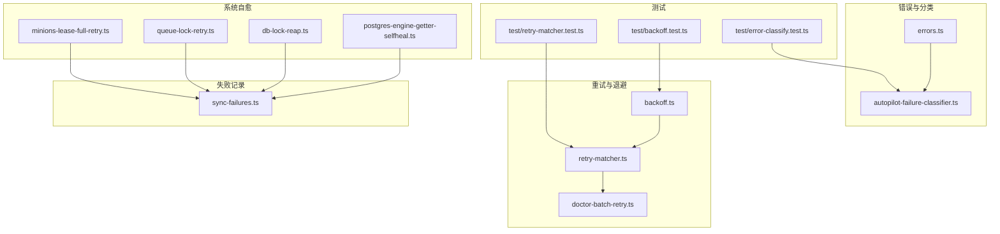
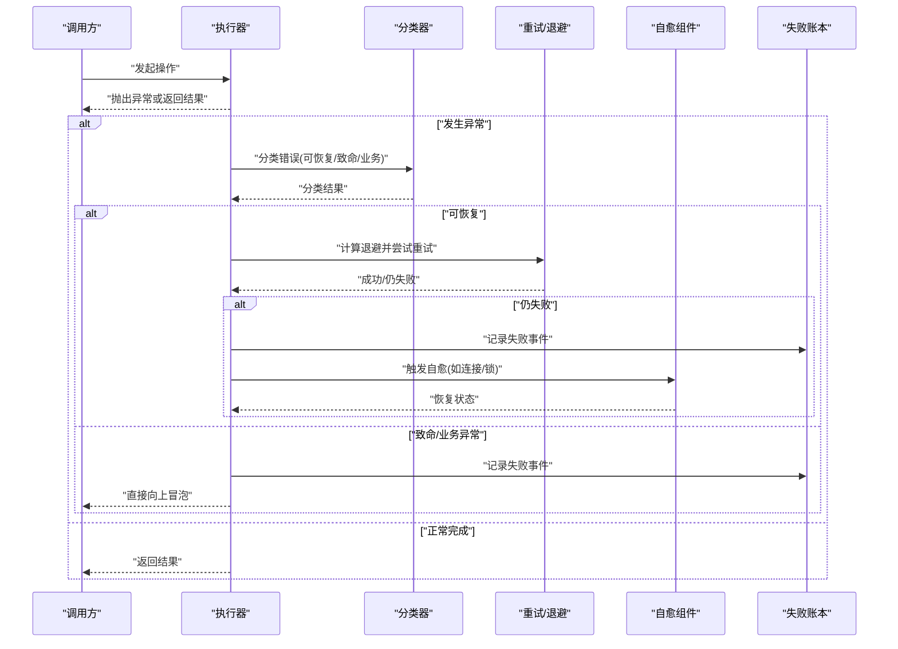
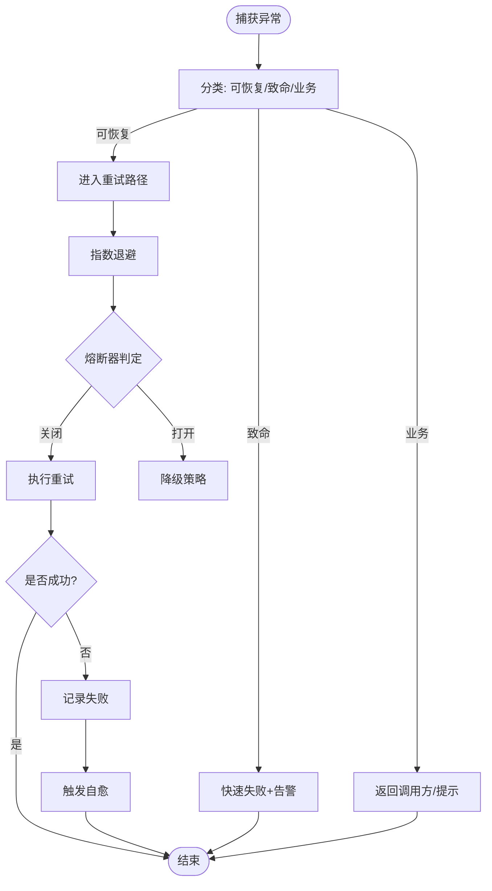
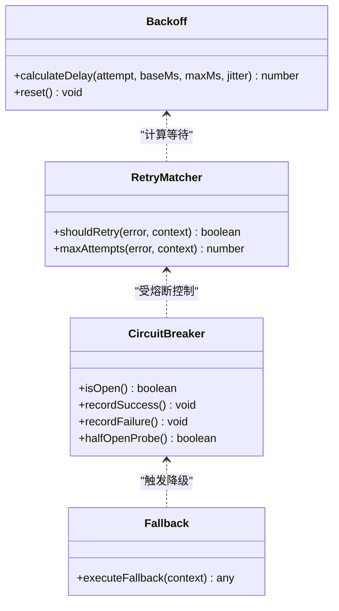
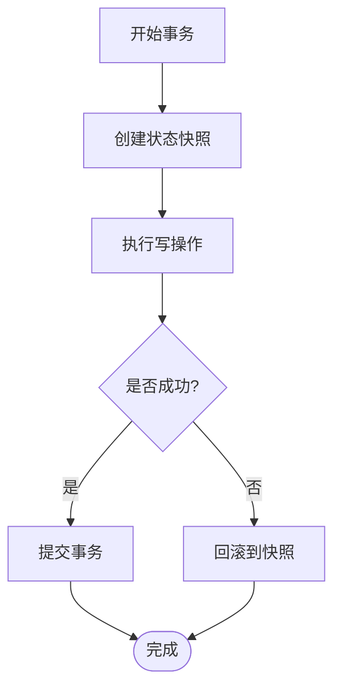
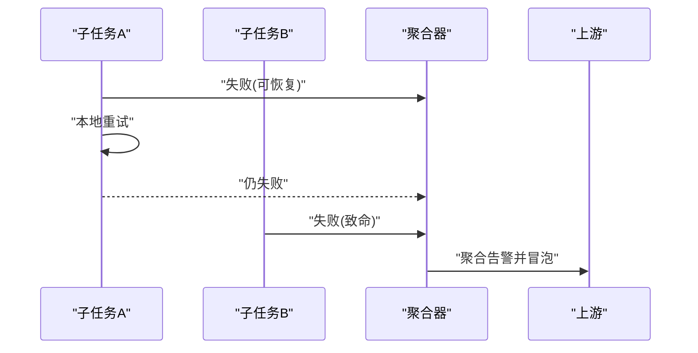
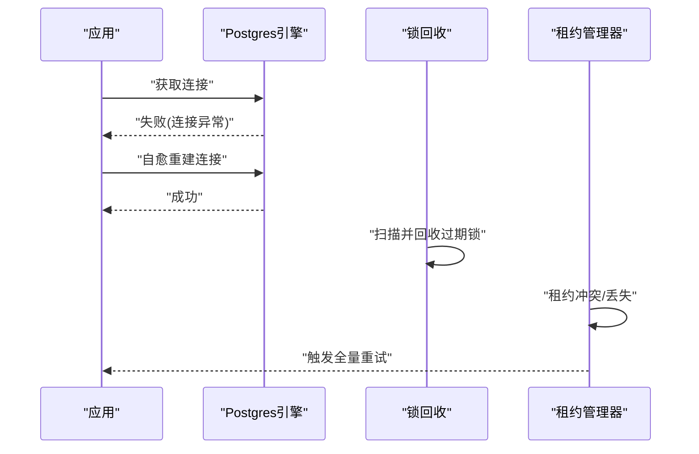
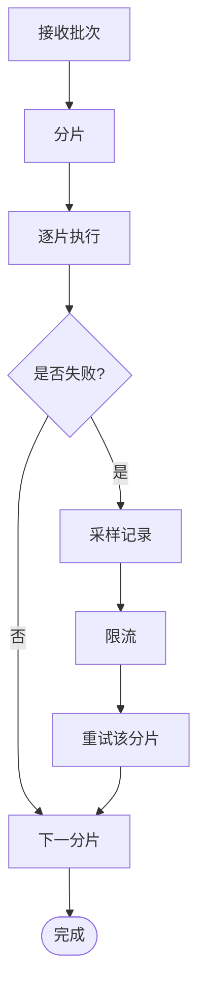
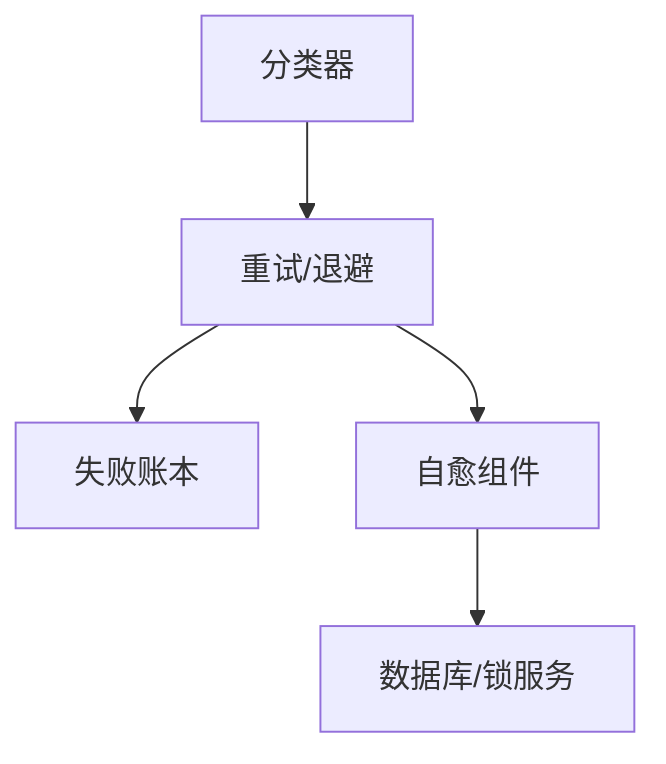

# 错误处理与恢复

<cite>
**本文引用的文件**   
- [src/core/errors.ts](file://src/core/errors.ts)
- [src/core/backoff.ts](file://src/core/backoff.ts)
- [src/core/retry-matcher.ts](file://src/core/retry-matcher.ts)
- [src/core/autopilot-failure-classifier.ts](file://src/core/autopilot-failure-classifier.ts)
- [src/core/sync-failures.ts](file://src/core/sync-failures.ts)
- [src/core/db-lock-reap.ts](file://src/core/db-lock-reap.ts)
- [src/core/postgres-engine-getter-selfheal.ts](file://src/core/postgres-engine-getter-selfheal.ts)
- [src/core/queue-lock-retry.ts](file://src/core/queue-lock-retry.ts)
- [src/core/minions-lease-full-retry.ts](file://src/core/minions-lease-full-retry.ts)
- [src/core/doctor-batch-retry.ts](file://src/core/doctor-batch-retry.ts)
- [test/backoff.test.ts](file://test/backoff.test.ts)
- [test/error-classify.test.ts](file://test/error-classify.test.ts)
- [test/retry-matcher.test.ts](file://test/retry-matcher.test.ts)
</cite>

## 目录
1. [简介](#简介)
2. [项目结构](#项目结构)
3. [核心组件](#核心组件)
4. [架构总览](#架构总览)
5. [详细组件分析](#详细组件分析)
6. [依赖关系分析](#依赖关系分析)
7. [性能考量](#性能考量)
8. [故障排查指南](#故障排查指南)
9. [结论](#结论)
10. [附录](#附录)

## 简介
本文件系统化梳理仓库中的错误分类、处理策略与恢复机制，覆盖可恢复错误、致命错误与业务异常的分类原则；重试机制（指数退避、熔断器、降级）；回滚与一致性保障（事务性操作、状态快照）；错误传播与冒泡规则（局部隔离与全局聚合）；监控告警配置与诊断日志最佳实践。文档以源码为依据，辅以图示帮助理解。

## 项目结构
围绕错误处理与恢复的关键代码主要分布在 core 层与测试用例中：
- 错误类型与分类：错误定义、分类器
- 重试与退避：通用退避算法、重试匹配器、批量重试
- 系统自愈：数据库连接自愈、锁回收、租约全量重试
- 同步失败记录：用于统计与决策的失败账本
- 测试：对退避、分类、匹配器的行为验证

图表来源
- [src/core/errors.ts](file://src/core/errors.ts)
- [src/core/autopilot-failure-classifier.ts](file://src/core/autopilot-failure-classifier.ts)
- [src/core/backoff.ts](file://src/core/backoff.ts)
- [src/core/retry-matcher.ts](file://src/core/retry-matcher.ts)
- [src/core/doctor-batch-retry.ts](file://src/core/doctor-batch-retry.ts)
- [src/core/postgres-engine-getter-selfheal.ts](file://src/core/postgres-engine-getter-selfheal.ts)
- [src/core/db-lock-reap.ts](file://src/core/db-lock-reap.ts)
- [src/core/queue-lock-retry.ts](file://src/core/queue-lock-retry.ts)
- [src/core/minions-lease-full-retry.ts](file://src/core/minions-lease-full-retry.ts)
- [src/core/sync-failures.ts](file://src/core/sync-failures.ts)
- [test/backoff.test.ts](file://test/backoff.test.ts)
- [test/error-classify.test.ts](file://test/error-classify.test.ts)
- [test/retry-matcher.test.ts](file://test/retry-matcher.test.ts)

章节来源
- [src/core/errors.ts](file://src/core/errors.ts)
- [src/core/autopilot-failure-classifier.ts](file://src/core/autopilot-failure-classifier.ts)
- [src/core/backoff.ts](file://src/core/backoff.ts)
- [src/core/retry-matcher.ts](file://src/core/retry-matcher.ts)
- [src/core/doctor-batch-retry.ts](file://src/core/doctor-batch-retry.ts)
- [src/core/postgres-engine-getter-selfheal.ts](file://src/core/postgres-engine-getter-selfheal.ts)
- [src/core/db-lock-reap.ts](file://src/core/db-lock-reap.ts)
- [src/core/queue-lock-retry.ts](file://src/core/queue-lock-retry.ts)
- [src/core/minions-lease-full-retry.ts](file://src/core/minions-lease-full-retry.ts)
- [src/core/sync-failures.ts](file://src/core/sync-failures.ts)
- [test/backoff.test.ts](file://test/backoff.test.ts)
- [test/error-classify.test.ts](file://test/error-classify.test.ts)
- [test/retry-matcher.test.ts](file://test/retry-matcher.test.ts)

## 核心组件
- 错误类型与分类
  - 统一错误模型与分类器，将运行时异常划分为可恢复、致命与业务异常三类，为后续重试、熔断与降级提供依据。
- 重试与退避
  - 通用指数退避实现，结合重试匹配器按错误类型与上下文决定是否重试及等待时长。
  - 批量任务级重试封装，便于在批处理场景下复用。
- 系统自愈
  - 数据库连接获取器具备自愈能力，自动探测并恢复连接问题。
  - 分布式锁回收与队列锁重试，避免死锁与长驻阻塞。
  - 子进程租约的全量重试，保证任务执行期的一致性。
- 失败记录
  - 统一的失败账本，记录失败事件、原因与时间线，支撑熔断与降级决策。

章节来源
- [src/core/errors.ts](file://src/core/errors.ts)
- [src/core/autopilot-failure-classifier.ts](file://src/core/autopilot-failure-classifier.ts)
- [src/core/backoff.ts](file://src/core/backoff.ts)
- [src/core/retry-matcher.ts](file://src/core/retry-matcher.ts)
- [src/core/doctor-batch-retry.ts](file://src/core/doctor-batch-retry.ts)
- [src/core/postgres-engine-getter-selfheal.ts](file://src/core/postgres-engine-getter-selfheal.ts)
- [src/core/db-lock-reap.ts](file://src/core/db-lock-reap.ts)
- [src/core/queue-lock-retry.ts](file://src/core/queue-lock-retry.ts)
- [src/core/minions-lease-full-retry.ts](file://src/core/minions-lease-full-retry.ts)
- [src/core/sync-failures.ts](file://src/core/sync-failures.ts)

## 架构总览
下图展示错误从产生到分类、重试、自愈与记录的端到端流程。

图表来源
- [src/core/autopilot-failure-classifier.ts](file://src/core/autopilot-failure-classifier.ts)
- [src/core/backoff.ts](file://src/core/backoff.ts)
- [src/core/retry-matcher.ts](file://src/core/retry-matcher.ts)
- [src/core/postgres-engine-getter-selfheal.ts](file://src/core/postgres-engine-getter-selfheal.ts)
- [src/core/db-lock-reap.ts](file://src/core/db-lock-reap.ts)
- [src/core/queue-lock-retry.ts](file://src/core/queue-lock-retry.ts)
- [src/core/minions-lease-full-retry.ts](file://src/core/minions-lease-full-retry.ts)
- [src/core/sync-failures.ts](file://src/core/sync-failures.ts)

## 详细组件分析

### 错误分类与处理策略
- 分类维度
  - 可恢复错误：网络抖动、临时资源不可用等，适合重试与自愈。
  - 致命错误：数据损坏、严重配置错误等，不应重试，需快速失败并告警。
  - 业务异常：参数校验失败、权限不足等，通常不重试，直接返回给调用方。
- 处理策略
  - 可恢复错误进入重试通道，结合指数退避与熔断器控制风险。
  - 致命错误立即上报并终止当前工作流，必要时触发降级。
  - 业务异常由上层进行用户提示或路由修正。

图表来源
- [src/core/autopilot-failure-classifier.ts](file://src/core/autopilot-failure-classifier.ts)
- [src/core/backoff.ts](file://src/core/backoff.ts)
- [src/core/retry-matcher.ts](file://src/core/retry-matcher.ts)
- [src/core/sync-failures.ts](file://src/core/sync-failures.ts)

章节来源
- [src/core/autopilot-failure-classifier.ts](file://src/core/autopilot-failure-classifier.ts)
- [src/core/backoff.ts](file://src/core/backoff.ts)
- [src/core/retry-matcher.ts](file://src/core/retry-matcher.ts)
- [src/core/sync-failures.ts](file://src/core/sync-failures.ts)

### 重试机制：指数退避、熔断器与降级
- 指数退避
  - 基于基础间隔与上限，动态增长等待时间，降低瞬时压力。
  - 支持抖动以避免“惊群效应”。
- 重试匹配器
  - 根据错误类型、错误码与上下文决定是否可以重试以及最大重试次数。
- 熔断器与降级
  - 当失败率超过阈值时打开熔断，短路请求并切换到降级逻辑，待稳定后半开探测恢复。

图表来源
- [src/core/backoff.ts](file://src/core/backoff.ts)
- [src/core/retry-matcher.ts](file://src/core/retry-matcher.ts)
- [src/core/sync-failures.ts](file://src/core/sync-failures.ts)

章节来源
- [src/core/backoff.ts](file://src/core/backoff.ts)
- [src/core/retry-matcher.ts](file://src/core/retry-matcher.ts)
- [src/core/sync-failures.ts](file://src/core/sync-failures.ts)

### 回滚机制：事务性操作、状态快照与一致性
- 事务性操作
  - 关键写路径采用事务包裹，确保原子性与一致性。
- 状态快照
  - 在执行前创建快照，失败时通过快照恢复至一致点。
- 一致性保证
  - 结合幂等键与去重策略，避免重复写入导致的不一致。

[本节为概念性说明，未直接分析具体文件]

### 错误传播与冒泡规则
- 局部错误隔离
  - 在模块边界内捕获并分类，避免污染上游上下文。
- 全局错误聚合
  - 将多个子任务的失败汇总到统一账本，便于整体评估与告警。
- 冒泡规则
  - 可恢复错误在本地重试后仍失败才冒泡；致命错误立即冒泡；业务异常由上层处理。

[本节为概念性说明，未直接分析具体文件]

### 自愈与锁管理
- 数据库连接自愈
  - 获取连接时检测健康状态，失败则重建连接并重试。
- 锁回收与重试
  - 定期扫描过期锁并回收，队列锁失败时按策略重试。
- 子进程租约全量重试
  - 租约丢失或冲突时，触发全量重试以保证任务连续性。

图表来源
- [src/core/postgres-engine-getter-selfheal.ts](file://src/core/postgres-engine-getter-selfheal.ts)
- [src/core/db-lock-reap.ts](file://src/core/db-lock-reap.ts)
- [src/core/queue-lock-retry.ts](file://src/core/queue-lock-retry.ts)
- [src/core/minions-lease-full-retry.ts](file://src/core/minions-lease-full-retry.ts)

章节来源
- [src/core/postgres-engine-getter-selfheal.ts](file://src/core/postgres-engine-getter-selfheal.ts)
- [src/core/db-lock-reap.ts](file://src/core/db-lock-reap.ts)
- [src/core/queue-lock-retry.ts](file://src/core/queue-lock-retry.ts)
- [src/core/minions-lease-full-retry.ts](file://src/core/minions-lease-full-retry.ts)

### 批量任务重试
- 批量重试封装
  - 对一批任务进行分片与重试，支持部分失败与整体进度跟踪。
- 失败采样与限流
  - 对高频失败进行采样记录，避免日志风暴；对重试速率进行限流保护下游。

图表来源
- [src/core/doctor-batch-retry.ts](file://src/core/doctor-batch-retry.ts)
- [src/core/sync-failures.ts](file://src/core/sync-failures.ts)

章节来源
- [src/core/doctor-batch-retry.ts](file://src/core/doctor-batch-retry.ts)
- [src/core/sync-failures.ts](file://src/core/sync-failures.ts)

## 依赖关系分析
- 低耦合高内聚
  - 分类器独立于重试与自愈，便于替换与扩展。
  - 重试与退避解耦，可通过匹配器灵活控制。
- 外部依赖
  - 数据库连接与锁服务作为外部依赖，通过自愈与重试屏蔽不稳定因素。
- 潜在循环依赖
  - 当前设计避免循环引用，自愈与重试均单向依赖分类与失败账本。

图表来源
- [src/core/autopilot-failure-classifier.ts](file://src/core/autopilot-failure-classifier.ts)
- [src/core/backoff.ts](file://src/core/backoff.ts)
- [src/core/retry-matcher.ts](file://src/core/retry-matcher.ts)
- [src/core/postgres-engine-getter-selfheal.ts](file://src/core/postgres-engine-getter-selfheal.ts)
- [src/core/db-lock-reap.ts](file://src/core/db-lock-reap.ts)
- [src/core/sync-failures.ts](file://src/core/sync-failures.ts)

章节来源
- [src/core/autopilot-failure-classifier.ts](file://src/core/autopilot-failure-classifier.ts)
- [src/core/backoff.ts](file://src/core/backoff.ts)
- [src/core/retry-matcher.ts](file://src/core/retry-matcher.ts)
- [src/core/postgres-engine-getter-selfheal.ts](file://src/core/postgres-engine-getter-selfheal.ts)
- [src/core/db-lock-reap.ts](file://src/core/db-lock-reap.ts)
- [src/core/sync-failures.ts](file://src/core/sync-failures.ts)

## 性能考量
- 退避参数调优
  - 合理设置基础间隔、上限与抖动，平衡延迟与吞吐。
- 熔断阈值
  - 根据业务容忍度调整失败率与冷却时间，避免误判。
- 重试风暴防护
  - 使用随机化与限流抑制并发峰值。
- 失败采样
  - 对高频错误进行采样记录，减少存储与IO压力。

[本节为一般性指导，无需特定文件来源]

## 故障排查指南
- 定位步骤
  - 查看失败账本，筛选最近的高频错误与趋势。
  - 检查分类器输出，确认错误归类是否正确。
  - 观察重试与退避日志，判断是否因参数不当导致过度重试。
  - 核查自愈组件状态，确认连接与锁是否被正确恢复。
- 常见症状与对策
  - 频繁超时：检查网络与下游服务健康，适当增大退避上限。
  - 锁竞争：启用锁回收与重试，优化持有时间。
  - 连接抖动：开启连接自愈，增加健康检查频率。
- 日志与指标
  - 为每类错误添加结构化字段（错误码、上下文、耗时）。
  - 暴露关键指标（失败率、重试次数、熔断状态、锁回收计数）。

章节来源
- [src/core/sync-failures.ts](file://src/core/sync-failures.ts)
- [src/core/autopilot-failure-classifier.ts](file://src/core/autopilot-failure-classifier.ts)
- [src/core/backoff.ts](file://src/core/backoff.ts)
- [src/core/postgres-engine-getter-selfheal.ts](file://src/core/postgres-engine-getter-selfheal.ts)
- [src/core/db-lock-reap.ts](file://src/core/db-lock-reap.ts)

## 结论
本方案通过清晰的错误分类、稳健的重试与自愈机制、完善的失败记录与监控，构建了高可用的错误处理体系。建议在生产环境持续校准退避与熔断参数，完善日志与指标采集，并结合自动化演练提升系统的韧性。

[本节为总结性内容，无需特定文件来源]

## 附录
- 单元测试参考
  - 退避算法行为验证
  - 错误分类器行为验证
  - 重试匹配器行为验证

章节来源
- [test/backoff.test.ts](file://test/backoff.test.ts)
- [test/error-classify.test.ts](file://test/error-classify.test.ts)
- [test/retry-matcher.test.ts](file://test/retry-matcher.test.ts)