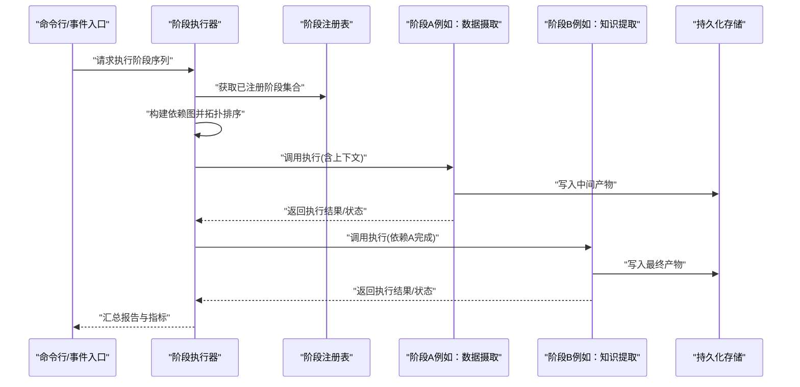
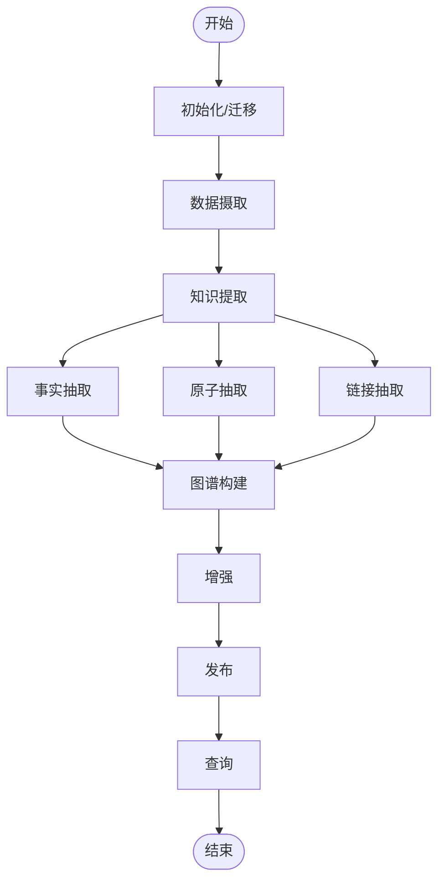

# 阶段管理系统

<cite>
**本文引用的文件**   
- [src/core/phase.ts](file://src/core/phase.ts)
- [src/core/phases/index.ts](file://src/core/phases/index.ts)
- [src/core/phases/data-ingest.ts](file://src/core/phases/data-ingest.ts)
- [src/core/phases/knowledge-extract.ts](file://src/core/phases/knowledge-extract.ts)
- [src/core/phases/graph-build.ts](file://src/core/phases/graph-build.ts)
- [src/core/phases/auto-think.ts](file://src/core/phases/auto-think.ts)
- [src/core/phases/enrich.ts](file://src/core/phases/enrich.ts)
- [src/core/phases/publish.ts](file://src/core/phases/publish.ts)
- [src/core/phases/query.ts](file://src/core/phases/query.ts)
- [src/core/phases/setup.ts](file://src/core/phases/setup.ts)
- [src/core/phases/migrate.ts](file://src/core/phases/migrate.ts)
- [src/core/phases/sync.ts](file://src/core/phases/sync.ts)
- [src/core/phases/cycle.ts](file://src/core/phases/cycle.ts)
- [src/core/phases/doctor.ts](file://src/core/phases/doctor.ts)
- [src/core/phases/embed-backfill.ts](file://src/core/phases/embed-backfill.ts)
- [src/core/phases/reindex-code.ts](file://src/core/phases/reindex-code.ts)
- [src/core/phases/facts-extract.ts](file://src/core/phases/facts-extract.ts)
- [src/core/phases/extract-atoms.ts](file://src/core/phases/extract-atoms.ts)
- [src/core/phases/link-extraction.ts](file://src/core/phases/link-extraction.ts)
- [src/core/phases/schema-unify.ts](file://src/core/phases/schema-unify.ts)
- [src/core/phases/schema-author.ts](file://src/core/phases/schema-author.ts)
- [src/core/phases/skillify.ts](file://src/core/phases/skillify.ts)
- [src/core/phases/skillpack-harvest.ts](file://src/core/phases/skillpack-harvest.ts)
- [src/core/phases/skillpack-check.ts](file://src/core/phases/skillpack-check.ts)
- [src/core/phases/skillpack-apply.ts](file://src/core/phases/skillpack-apply.ts)
- [src/core/phases/skillpack-init.ts](file://src/core/phases/skillpack-init.ts)
- [src/core/phases/skillpack-install.ts](file://src/core/phases/skillpack-install.ts)
- [src/core/phases/skillpack-scaffold.ts](file://src/core/phases/skillpack-scaffold.ts)
- [src/core/phases/skillpack-manifest-v1.ts](file://src/core/phases/skillpack-manifest-v1.ts)
- [src/core/phases/skillpack-state.ts](file://src/core/phases/skillpack-state.ts)
- [src/core/phases/skillpack-trust-prompt.ts](file://src/core/phases/skillpack-trust-prompt.ts)
- [src/core/phases/skillpack-rubric-doctor.ts](file://src/core/phases/skillpack-rubric-doctor.ts)
- [src/core/phases/skillpack-reference-apply.ts](file://src/core/phases/skillpack-reference-apply.ts)
- [src/core/phases/skillpack-reference.ts](file://src/core/phases/skillpack-reference.ts)
- [src/core/phases/skillpack-registry-client.ts](file://src/core/phases/skillpack-registry-client.ts)
- [src/core/phases/skillpack-registry-schema.ts](file://src/core/phases/skillpack-registry-schema.ts)
- [src/core/phases/skillpack-remote-source.ts](file://src/core/phases/skillpack-remote-source.ts)
- [src/core/phases/skillpack-scrub-legacy.ts](file://src/core/phases/skillpack-scrub-legacy.ts)
- [src/core/phases/skillpack-tarball.ts](file://src/core/phases/skillpack-tarball.ts)
- [src/core/phases/skillpack-migrate-fence.ts](file://src/core/phases/skillpack-migrate-fence.ts)
- [src/core/phases/skillpack-nag-state.ts](file://src/core/phases/skillpack-nag-state.ts)
- [src/core/phases/skillpack-brain-resident-locate.ts](file://src/core/phases/skillpack-brain-resident-locate.ts)
- [src/core/phases/skillpack-changed-since-version.ts](file://src/core/phases/skillpack-changed-since-version.ts)
- [src/core/phases/skillpack-copy.ts](file://src/core/phases/skillpack-copy.ts)
- [src/core/phases/skillpack-harvest-lint.ts](file://src/core/phases/skillpack-harvest-lint.ts)
- [src/core/phases/skillpack-init-brain-pack.ts](file://src/core/phases/skillpack-init-brain-pack.ts)
- [src/core/phases/skillpack-scaffold-third-party.ts](file://src/core/phases/skillpack-scaffold-third-party.ts)
- [src/core/phases/skillpack-bootstrap-display.ts](file://src/core/phases/skillpack-bootstrap-display.ts)
- [src/core/phases/skillpack-anatomy.ts](file://src/core/phases/skillpack-anatomy.ts)
- [src/core/phases/skillpack-check.test.ts](file://tests/skillpack-check.test.ts)
- [src/core/phases/skillpack-harvest.test.ts](file://tests/skillpack-harvest.test.ts)
- [src/core/phases/skillpack-install.test.ts](file://tests/skillpack-install.test.ts)
- [src/core/phases/skillpack-manifest-v1.test.ts](file://tests/skillpack-manifest-v1.test.ts)
- [src/core/phases/skillpack-reference.test.ts](file://tests/skillpack-reference.test.ts)
- [src/core/phases/skillpack-registry-client.test.ts](file://tests/skillpack-registry-client.test.ts)
- [src/core/phases/skillpack-registry-schema.test.ts](file://tests/skillpack-registry-schema.test.ts)
- [src/core/phases/skillpack-scaffold.test.ts](file://tests/skillpack-scaffold.test.ts)
- [src/core/phases/skillpack-state.test.ts](file://tests/skillpack-state.test.ts)
- [src/core/phases/skillpack-tarball.test.ts](file://tests/skillpack-tarball.test.ts)
- [src/core/phases/skillpack-trust-prompt.test.ts](file://tests/skillpack-trust-prompt.test.ts)
- [src/core/phases/skillpack-rubric-doctor.test.ts](file://tests/skillpack-rubric-doctor.test.ts)
- [src/core/phases/skillpack-reference-apply.test.ts](file://tests/skillpack-reference-apply.test.ts)
- [src/core/phases/skillpack-remote-source.test.ts](file://tests/skillpack-remote-source.test.ts)
- [src/core/phases/skillpack-scrub-legacy.test.ts](file://tests/skillpack-sscrub-legacy.test.ts)
- [src/core/phases/skillpack-migrate-fence.test.ts](file://tests/skillpack-migrate-fence.test.ts)
- [src/core/phases/skillpack-nag-state.test.ts](file://tests/skillpack-nag-state.test.ts)
- [src/core/phases/skillpack-brain-resident-locate.test.ts](file://tests/skillpack-brain-resident-locate.test.ts)
- [src/core/phases/skillpack-changed-since-version.test.ts](file://tests/skillpack-changed-since-version.test.ts)
- [src/core/phases/skillpack-copy.test.ts](file://tests/skillpack-copy.test.ts)
- [src/core/phases/skillpack-harvest-lint.test.ts](file://tests/skillpack-harvest-lint.test.ts)
- [src/core/phases/skillpack-init-brain-pack.test.ts](file://tests/skillpack-init-brain-pack.test.ts)
- [src/core/phases/skillpack-scaffold-third-party.test.ts](file://tests/skillpack-scaffold-third-party.test.ts)
- [src/core/phases/skillpack-bootstrap-display.test.ts](file://tests/skillpack-bootstrap-display.test.ts)
- [src/core/phases/skillpack-anatomy.test.ts](file://tests/skillpack-anatomy.test.ts)
- [src/core/phases/skillpack-reference-apply.test.ts](file://tests/skillpack-reference-apply.test.ts)
- [src/core/phases/skillpack-reference.test.ts](file://tests/skillpack-reference.test.ts)
- [src/core/phases/skillpack-registry-client.test.ts](file://tests/skillpack-registry-client.test.ts)
- [src/core/phases/skillpack-registry-schema.test.ts](file://tests/skillpack-registry-schema.test.ts)
- [src/core/phases/skillpack-scaffold.test.ts](file://tests/skillpack-scaffold.test.ts)
- [src/core/phases/skillpack-state.test.ts](file://tests/skillpack-state.test.ts)
- [src/core/phases/skillpack-tarball.test.ts](file://tests/skillpack-tarball.test.ts)
- [src/core/phases/skillpack-trust-prompt.test.ts](file://tests/skillpack-trust-prompt.test.ts)
- [src/core/phases/skillpack-rubric-doctor.test.ts](file://tests/skillpack-rubric-doctor.test.ts)
- [src/core/phases/skillpack-reference-apply.test.ts](file://tests/skillpack-reference-apply.test.ts)
- [src/core/phases/skillpack-remote-source.test.ts](file://tests/skillpack-remote-source.test.ts)
- [src/core/phases/skillpack-scrub-legacy.test.ts](file://tests/skillpack-scrub-legacy.test.ts)
- [src/core/phases/skillpack-migrate-fence.test.ts](file://tests/skillpack-migrate-fence.test.ts)
- [src/core/phases/skillpack-nag-state.test.ts](file://tests/skillpack-nag-state.test.ts)
- [src/core/phases/skillpack-brain-resident-locate.test.ts](file://tests/skillpack-brain-resident-locate.test.ts)
- [src/core/phases/skillpack-changed-since-version.test.ts](file://tests/skillpack-changed-since-version.test.ts)
- [src/core/phases/skillpack-copy.test.ts](file://tests/skillpack-copy.test.ts)
- [src/core/phases/skillpack-harvest-lint.test.ts](file://tests/skillpack-harvest-lint.test.ts)
- [src/core/phases/skillpack-init-brain-pack.test.ts](file://tests/skillpack-init-brain-pack.test.ts)
- [src/core/phases/skillpack-scaffold-third-party.test.ts](file://tests/skillpack-scaffold-third-party.test.ts)
- [src/core/phases/skillpack-bootstrap-display.test.ts](file://tests/skillpack-bootstrap-display.test.ts)
- [src/core/phases/skillpack-anatomy.test.ts](file://tests/skillpack-anatomy.test.ts)
</cite>

## 目录
1. [简介](#简介)
2. [项目结构](#项目结构)
3. [核心组件](#核心组件)
4. [架构总览](#架构总览)
5. [详细组件分析](#详细组件分析)
6. [依赖关系分析](#依赖关系分析)
7. [性能考虑](#性能考虑)
8. [故障排查指南](#故障排查指南)
9. [结论](#结论)
10. [附录](#附录)

## 简介
本文件面向“阶段（Phase）管理系统”的设计与实现，系统性阐述阶段的定义、注册、执行机制，预定义阶段（数据摄取、知识提取、图谱构建等）的实现要点，自定义阶段的开发规范（接口、依赖声明、错误处理），阶段间依赖管理与执行顺序控制，配置最佳实践与性能优化建议，以及监控、日志与调试工具的使用方法。文档力求兼顾技术深度与可读性，帮助读者快速理解并高效扩展系统能力。

## 项目结构
阶段管理相关代码集中在 core 子系统中，采用“按功能域组织 + 集中注册”的结构：
- 核心抽象与运行时：位于 src/core/phase.ts，提供阶段类型、生命周期钩子、执行器与调度策略。
- 预定义阶段实现：位于 src/core/phases/*，每个阶段一个模块，职责单一、可独立测试。
- 阶段索引与聚合：位于 src/core/phases/index.ts，负责汇总与导出可用阶段集合。
- 测试用例：位于 tests/* 下对应模块的 .test.ts，覆盖关键路径与边界条件。

```mermaid
graph TB
A["core/phase.ts<br/>阶段抽象与执行器"] --> B["phases/index.ts<br/>阶段索引与导出"]
B --> C["phases/data-ingest.ts<br/>数据摄取阶段"]
B --> D["phases/knowledge-extract.ts<br/>知识提取阶段"]
B --> E["phases/graph-build.ts<br/>图谱构建阶段"]
B --> F["phases/auto-think.ts<br/>自动思考阶段"]
B --> G["phases/enrich.ts<br/>增强阶段"]
B --> H["phases/publish.ts<br/>发布阶段"]
B --> I["phases/query.ts<br/>查询阶段"]
B --> J["phases/setup.ts<br/>初始化阶段"]
B --> K["phases/migrate.ts<br/>迁移阶段"]
B --> L["phases/sync.ts<br/>同步阶段"]
B --> M["phases/cycle.ts<br/>周期编排阶段"]
B --> N["phases/doctor.ts<br/>诊断阶段"]
B --> O["phases/embed-backfill.ts<br/>嵌入回填阶段"]
B --> P["phases/reindex-code.ts<br/>代码重索引阶段"]
B --> Q["phases/facts-extract.ts<br/>事实抽取阶段"]
B --> R["phases/extract-atoms.ts<br/>原子抽取阶段"]
B --> S["phases/link-extraction.ts<br/>链接抽取阶段"]
B --> T["phases/schema-unify.ts<br/>模式统一阶段"]
B --> U["phases/schema-author.ts<br/>模式作者阶段"]
B --> V["phases/skillify.ts<br/>技能化阶段"]
B --> W["phases/skillpack-*.<br/>技能包系列阶段"]
```

图表来源
- [src/core/phase.ts](file://src/core/phase.ts)
- [src/core/phases/index.ts](file://src/core/phases/index.ts)
- [src/core/phases/data-ingest.ts](file://src/core/phases/data-ingest.ts)
- [src/core/phases/knowledge-extract.ts](file://src/core/phases/knowledge-extract.ts)
- [src/core/phases/graph-build.ts](file://src/core/phases/graph-build.ts)

章节来源
- [src/core/phase.ts](file://src/core/phase.ts)
- [src/core/phases/index.ts](file://src/core/phases/index.ts)

## 核心组件
本节聚焦阶段系统的核心抽象与运行期行为，包括阶段定义、生命周期、注册表、执行器与调度策略。

- 阶段定义与生命周期
  - 阶段对象包含元信息（名称、版本、描述）、输入输出契约、依赖声明、可选的并行度与超时设置、以及生命周期钩子（如初始化、执行、清理）。
  - 生命周期通常包括：准备（解析参数、校验上下文）、执行（核心逻辑）、收尾（资源释放、状态持久化）。
- 注册与发现
  - 通过集中索引将各阶段模块导出为统一集合，供执行器在启动时加载。
  - 支持动态扩展：新增阶段只需在索引中注册，无需修改执行器。
- 执行器与调度
  - 执行器根据依赖图进行拓扑排序，确保无环且满足先后约束。
  - 支持串行与并行两种执行模式；对具备幂等性的阶段可启用并发以提升吞吐。
  - 执行过程包含进度上报、中断信号处理、重试与回滚策略。
- 错误处理与恢复
  - 阶段应抛出结构化错误，携带错误码、上下文与可恢复标志。
  - 执行器捕获异常后记录日志、更新状态，并根据策略决定是否重试或中止。
- 配置与上下文
  - 阶段通过上下文访问共享状态（如源列表、任务队列、存储句柄）。
  - 配置项支持环境变量与配置文件合并，提供默认值与校验。

章节来源
- [src/core/phase.ts](file://src/core/phase.ts)
- [src/core/phases/index.ts](file://src/core/phases/index.ts)

## 架构总览
下图展示阶段系统在运行时的整体交互：入口触发（命令或事件）→ 解析配置 → 加载阶段集合 → 构建依赖图 → 拓扑排序 → 执行器驱动阶段执行 → 结果落盘与上报。

图表来源
- [src/core/phase.ts](file://src/core/phase.ts)
- [src/core/phases/index.ts](file://src/core/phases/index.ts)
- [src/core/phases/data-ingest.ts](file://src/core/phases/data-ingest.ts)
- [src/core/phases/knowledge-extract.ts](file://src/core/phases/knowledge-extract.ts)
- [src/core/phases/graph-build.ts](file://src/core/phases/graph-build.ts)

## 详细组件分析

### 数据摄取阶段（Data Ingestion）
- 职责
  - 从多源采集原始数据，进行格式归一化、去重与初步校验。
  - 产出标准化片段（chunk）与元数据，供后续阶段消费。
- 关键流程
  - 扫描源 → 拉取内容 → 分块 → 清洗 → 写入暂存区。
- 并发与批处理
  - 支持按源并发拉取，按批次写入以降低内存峰值。
- 错误与重试
  - 网络失败与临时错误采用指数退避重试；不可恢复错误标记并跳过。
- 典型使用
  - 作为知识提取的前置阶段，保证下游输入稳定。

章节来源
- [src/core/phases/data-ingest.ts](file://src/core/phases/data-ingest.ts)

### 知识提取阶段（Knowledge Extraction）
- 职责
  - 从标准化片段中提取实体、关系、属性与上下文摘要。
  - 生成结构化知识表示，便于图谱构建与检索。
- 关键流程
  - 读取片段 → 模型/规则抽取 → 规范化 → 冲突消解 → 写入知识层。
- 质量保障
  - 抽取结果附带置信度与来源溯源；支持人工复核通道。
- 依赖关系
  - 强依赖数据摄取阶段；可与增强阶段协作提升质量。

章节来源
- [src/core/phases/knowledge-extract.ts](file://src/core/phases/knowledge-extract.ts)

### 图谱构建阶段（Graph Build）
- 职责
  - 基于知识层构建节点与边，维护一致性、唯一性与版本化。
  - 提供图谱查询与可视化所需的基础设施。
- 关键流程
  - 汇聚知识 → 实体对齐 → 边推理 → 冲突合并 → 提交事务。
- 性能优化
  - 批量写入、索引预热、增量更新。
- 依赖关系
  - 依赖知识提取阶段；可被发布与查询阶段消费。

章节来源
- [src/core/phases/graph-build.ts](file://src/core/phases/graph-build.ts)

### 自动思考阶段（Auto Think）
- 职责
  - 在关键阶段完成后触发反思与总结，生成洞察与建议。
- 适用场景
  - 周期性复盘、异常检测后的根因分析、质量评估辅助。
- 注意事项
  - 避免阻塞主链路；可作为异步任务或按需触发。

章节来源
- [src/core/phases/auto-think.ts](file://src/core/phases/auto-think.ts)

### 增强阶段（Enrich）
- 职责
  - 对已有数据进行补充与增强（如标签、分类、相似度、外部知识注入）。
- 策略
  - 可插拔增强器，支持规则与模型混合策略。
- 依赖关系
  - 可作用于知识层或图谱层，视具体增强目标而定。

章节来源
- [src/core/phases/enrich.ts](file://src/core/phases/enrich.ts)

### 发布阶段（Publish）
- 职责
  - 将最终产物对外暴露（API、索引、缓存、消息总线）。
- 特性
  - 灰度发布、回滚、健康检查与流量切换。
- 依赖关系
  - 依赖图谱构建与增强阶段完成。

章节来源
- [src/core/phases/publish.ts](file://src/core/phases/publish.ts)

### 查询阶段（Query）
- 职责
  - 提供统一的查询入口，路由到合适的后端（向量、全文、图查询）。
- 特性
  - 意图识别、结果融合、权限过滤与审计。
- 依赖关系
  - 依赖发布阶段产出的索引与图谱。

章节来源
- [src/core/phases/query.ts](file://src/core/phases/query.ts)

### 初始化与迁移（Setup & Migrate）
- 初始化阶段
  - 环境自检、依赖安装、配置校验、基础数据准备。
- 迁移阶段
  - 数据库与存储结构的向后兼容升级，支持断点续跑与回滚。
- 依赖关系
  - 通常在流水线最前端执行，其他阶段依赖其就绪状态。

章节来源
- [src/core/phases/setup.ts](file://src/core/phases/setup.ts)
- [src/core/phases/migrate.ts](file://src/core/phases/migrate.ts)

### 同步与周期编排（Sync & Cycle）
- 同步阶段
  - 与外部源保持增量同步，处理删除与变更传播。
- 周期编排
  - 组合多个阶段形成可重复执行的流水线，支持定时与事件驱动。
- 可靠性
  - 锁机制、幂等设计、失败重试与补偿。

章节来源
- [src/core/phases/sync.ts](file://src/core/phases/sync.ts)
- [src/core/phases/cycle.ts](file://src/core/phases/cycle.ts)

### 诊断与健康检查（Doctor）
- 职责
  - 巡检系统健康、数据一致性与性能指标，输出修复建议。
- 能力
  - 问题定位、自愈脚本、告警集成。
- 使用方式
  - 定期运行或在异常时触发。

章节来源
- [src/core/phases/doctor.ts](file://src/core/phases/doctor.ts)

### 嵌入回填与代码重索引（Embed Backfill & Reindex Code）
- 嵌入回填
  - 对历史数据补算向量嵌入，支持分批与断点续传。
- 代码重索引
  - 针对代码库变更重建索引，提升检索质量。
- 性能
  - 高并发、限流与配额控制。

章节来源
- [src/core/phases/embed-backfill.ts](file://src/core/phases/embed-backfill.ts)
- [src/core/phases/reindex-code.ts](file://src/core/phases/reindex-code.ts)

### 事实抽取、原子抽取与链接抽取（Facts/Atoms/Links）
- 事实抽取
  - 从非结构化文本中抽取可验证的事实三元组。
- 原子抽取
  - 细粒度语义单元抽取，支撑更精准的检索与推理。
- 链接抽取
  - 识别跨文档引用与内部链接，增强知识连通性。
- 协同
  - 三者常串联或并联使用，共同提升知识质量。

章节来源
- [src/core/phases/facts-extract.ts](file://src/core/phases/facts-extract.ts)
- [src/core/phases/extract-atoms.ts](file://src/core/phases/extract-atoms.ts)
- [src/core/phases/link-extraction.ts](file://src/core/phases/link-extraction.ts)

### 模式与技能包（Schema & Skillpack）
- 模式统一与作者
  - 统一数据模式、提供模式编辑与校验工具链。
- 技能化与技能包
  - 将能力封装为可复用技能，支持打包、分发、安装与版本管理。
- 参考与清单
  - 提供参考实现与清单模板，降低接入成本。

章节来源
- [src/core/phases/schema-unify.ts](file://src/core/phases/schema-unify.ts)
- [src/core/phases/schema-author.ts](file://src/core/phases/schema-author.ts)
- [src/core/phases/skillify.ts](file://src/core/phases/skillify.ts)
- [src/core/phases/skillpack-*.ts](file://src/core/phases/skillpack-*.ts)

## 依赖关系分析
阶段间的依赖通过声明式字段表达，执行器据此构建有向无环图并进行拓扑排序。常见依赖模式：
- 线性依赖：数据摄取 → 知识提取 → 图谱构建 → 发布。
- 分支依赖：知识提取同时驱动事实抽取与链接抽取，再汇聚至图谱构建。
- 可选依赖：增强阶段可按需插入，不阻塞主干。
- 循环保护：若检测到环，执行器拒绝执行并提示修正依赖。

图表来源
- [src/core/phases/index.ts](file://src/core/phases/index.ts)
- [src/core/phases/data-ingest.ts](file://src/core/phases/data-ingest.ts)
- [src/core/phases/knowledge-extract.ts](file://src/core/phases/knowledge-extract.ts)
- [src/core/phases/graph-build.ts](file://src/core/phases/graph-build.ts)
- [src/core/phases/enrich.ts](file://src/core/phases/enrich.ts)
- [src/core/phases/publish.ts](file://src/core/phases/publish.ts)
- [src/core/phases/query.ts](file://src/core/phases/query.ts)

章节来源
- [src/core/phases/index.ts](file://src/core/phases/index.ts)

## 性能考虑
- 并发与批处理
  - 对无副作用的阶段启用并发；对写密集型阶段采用批量写入与事务合并。
- 资源限制
  - 设置最大并发、内存上限与超时时间，防止资源耗尽。
- 缓存与增量
  - 利用中间产物缓存与增量计算减少重复工作。
- 背压与限流
  - 对外部服务调用实施限流与退避，避免雪崩。
- 监控与观测
  - 关键指标：阶段耗时、吞吐、错误率、资源占用；结合分布式追踪定位瓶颈。

[本节为通用指导，不直接分析具体文件]

## 故障排查指南
- 常见问题
  - 依赖环：检查阶段声明的依赖是否构成环，必要时拆分或引入间接阶段。
  - 超时与重试：调整阶段超时与重试策略，区分可恢复与不可恢复错误。
  - 资源不足：提高并发阈值或增加实例；优化批大小与内存占用。
- 日志与追踪
  - 阶段内记录结构化日志，包含阶段名、输入摘要、关键步骤与错误堆栈。
  - 为长耗时操作添加进度事件，便于前端或CLI实时反馈。
- 诊断工具
  - 使用诊断阶段进行健康检查与指标收集；必要时导出快照用于离线分析。
- 回滚与恢复
  - 对破坏性操作开启事务与快照；失败时自动回滚或进入安全模式。

章节来源
- [src/core/phases/doctor.ts](file://src/core/phases/doctor.ts)
- [src/core/phases/cycle.ts](file://src/core/phases/cycle.ts)

## 结论
阶段管理系统以清晰的抽象与灵活的调度为核心，通过声明式依赖与统一执行器实现了可扩展、可观测、可恢复的数据处理流水线。预定义阶段覆盖了从数据摄取到发布查询的全链路，配合增强、诊断与技能化工具，能够满足复杂业务场景的需求。遵循本文的开发规范与最佳实践，可快速构建高质量、高性能的自定义阶段。

[本节为总结性内容，不直接分析具体文件]

## 附录

### 自定义阶段开发指南
- 接口规范
  - 定义阶段元信息（名称、版本、描述）、输入输出契约、依赖声明、可选并发与超时。
  - 实现生命周期钩子：准备、执行、收尾；确保幂等与可中断。
- 依赖声明
  - 仅声明必要依赖，避免过度耦合；使用可选依赖提升灵活性。
- 错误处理
  - 抛出结构化错误，包含错误码、上下文与可恢复标志；记录详细日志。
- 测试与验证
  - 编写单元测试与集成测试，覆盖正常路径与异常路径；模拟外部依赖失败。
- 配置与环境
  - 支持环境变量与配置文件；提供默认值与校验；敏感信息脱敏。
- 发布与文档
  - 在索引中注册新阶段；提供使用说明与示例；更新依赖图与文档。

章节来源
- [src/core/phase.ts](file://src/core/phase.ts)
- [src/core/phases/index.ts](file://src/core/phases/index.ts)

### 阶段监控、日志与调试
- 监控
  - 暴露阶段级指标（耗时、吞吐、错误率）；集成告警与看板。
- 日志
  - 结构化日志、分级输出、上下文关联；避免泄露敏感信息。
- 调试
  - 支持单步执行与断点；导出中间产物用于离线分析；提供回放能力。

章节来源
- [src/core/phases/doctor.ts](file://src/core/phases/doctor.ts)
- [src/core/phases/cycle.ts](file://src/core/phases/cycle.ts)