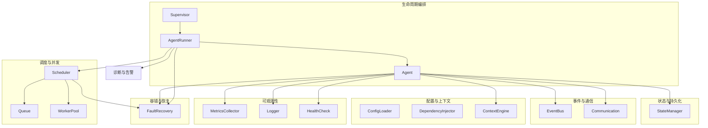
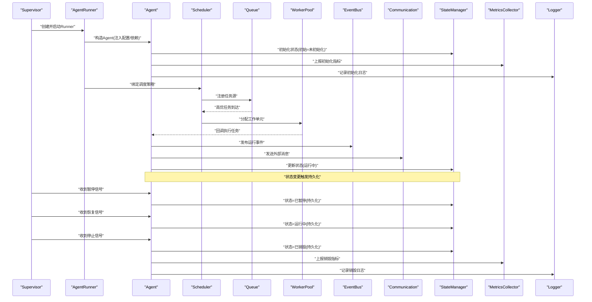
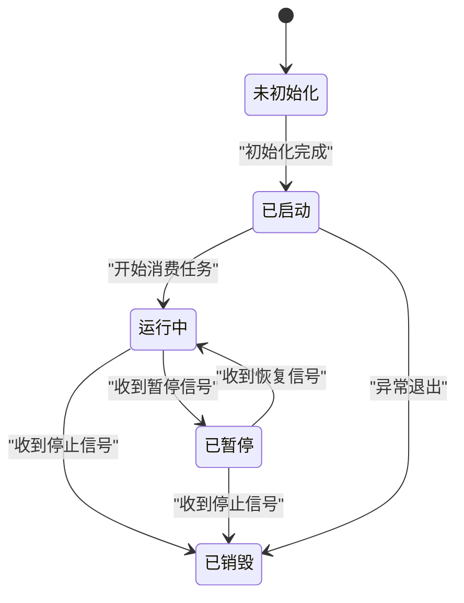
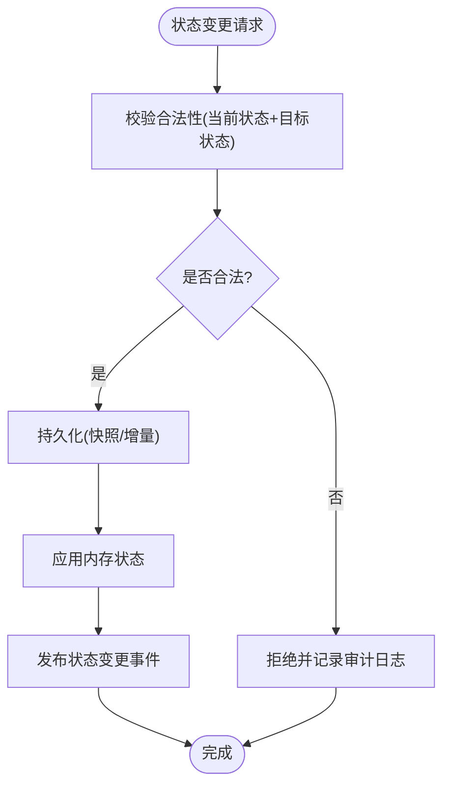
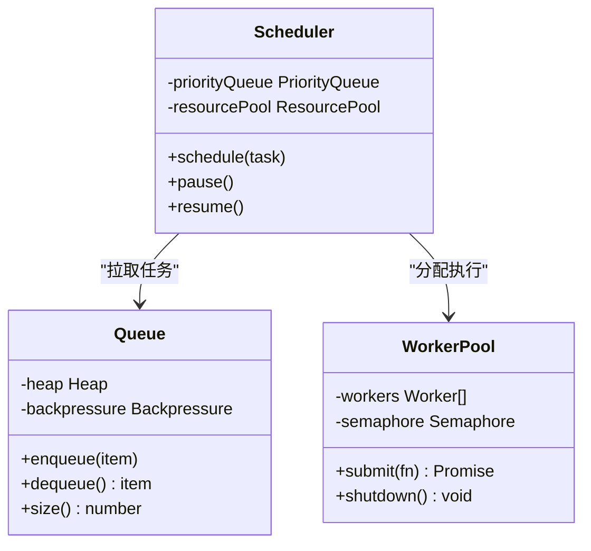
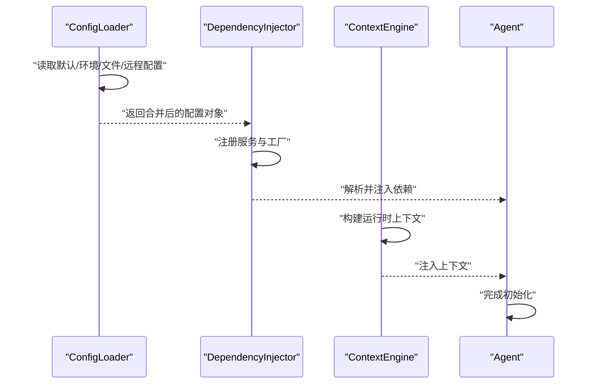
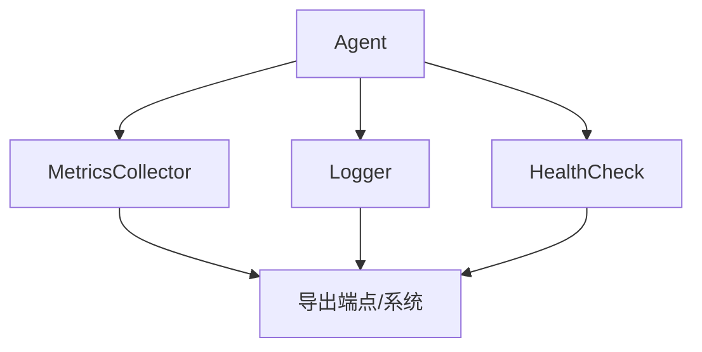
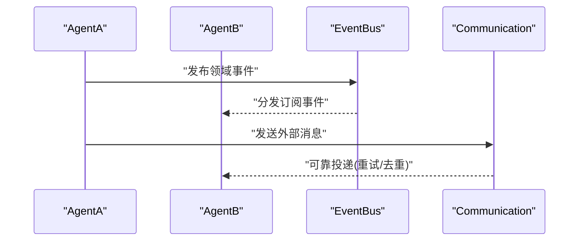
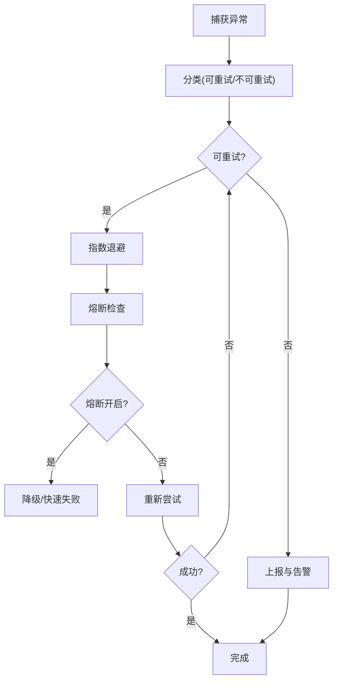
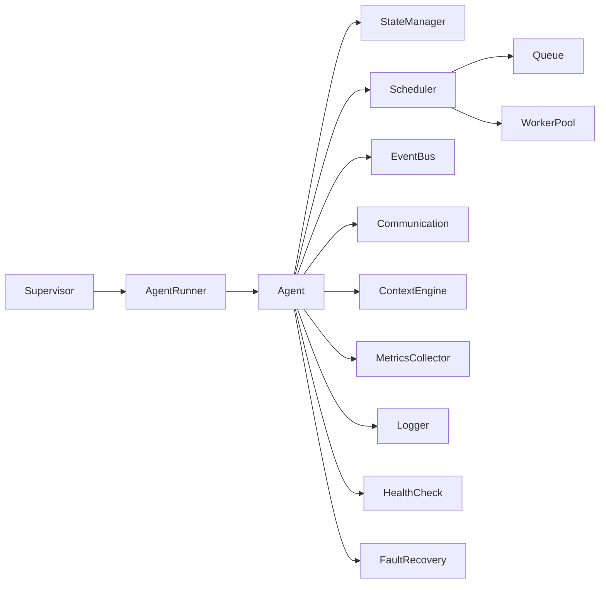

# 智能体生命周期管理

<cite>
**本文引用的文件**   
- [src/core/agent.ts](file://src/core/agent.ts)
- [src/core/agent-runner.ts](file://src/core/agent-runner.ts)
- [src/core/supervisor.ts](file://src/core/supervisor.ts)
- [src/core/worker-pool.ts](file://src/core/worker-pool.ts)
- [src/core/queue.ts](file://src/core/queue.ts)
- [src/core/state-manager.ts](file://src/core/state-manager.ts)
- [src/core/event-bus.ts](file://src/core/event-bus.ts)
- [src/core/config-loader.ts](file://src/core/config-loader.ts)
- [src/core/context-engine.ts](file://src/core/context-engine.ts)
- [src/core/metrics-collector.ts](file://src/core/metrics-collector.ts)
- [src/core/logger.ts](file://src/core/logger.ts)
- [src/core/health-check.ts](file://src/core/health-check.ts)
- [src/core/dependency-injector.ts](file://src/core/dependency-injector.ts)
- [src/core/scheduler.ts](file://src/core/scheduler.ts)
- [src/core/communication.ts](file://src/core/communication.ts)
- [src/core/fault-recovery.ts](file://src/core/fault-recovery.ts)
</cite>

## 目录
1. [简介](#简介)
2. [项目结构](#项目结构)
3. [核心组件](#核心组件)
4. [架构总览](#架构总览)
5. [详细组件分析](#详细组件分析)
6. [依赖关系分析](#依赖关系分析)
7. [性能考量](#性能考量)
8. [故障排查指南](#故障排查指南)
9. [结论](#结论)
10. [附录](#附录)

## 简介
本文件面向“智能体生命周期管理”的完整实现，覆盖初始化、启动、运行、暂停、恢复与销毁各阶段；阐述状态管理机制（状态转换规则、持久化策略、故障恢复流程）；记录调度算法（优先级队列、资源分配、并发控制）；提供配置加载、依赖注入与上下文管理的实践要点；并给出监控指标收集、日志记录与性能分析的实现细节。同时解释智能体间通信机制与事件驱动架构的设计与落地方式。

## 项目结构
围绕智能体生命周期，代码按职责分层组织：
- 生命周期编排：Agent、AgentRunner、Supervisor
- 状态与持久化：StateManager
- 调度与并发：Scheduler、Queue、WorkerPool
- 事件与通信：EventBus、Communication
- 配置与上下文：ConfigLoader、DependencyInjector、ContextEngine
- 可观测性：MetricsCollector、Logger、HealthCheck
- 容错与恢复：FaultRecovery

图表来源
- [src/core/agent.ts:1-200](file://src/core/agent.ts#L1-L200)
- [src/core/agent-runner.ts:1-200](file://src/core/agent-runner.ts#L1-L200)
- [src/core/supervisor.ts:1-200](file://src/core/supervisor.ts#L1-L200)
- [src/core/state-manager.ts:1-200](file://src/core/state-manager.ts#L1-L200)
- [src/core/scheduler.ts:1-200](file://src/core/scheduler.ts#L1-L200)
- [src/core/queue.ts:1-200](file://src/core/queue.ts#L1-L200)
- [src/core/worker-pool.ts:1-200](file://src/core/worker-pool.ts#L1-L200)
- [src/core/event-bus.ts:1-200](file://src/core/event-bus.ts#L1-L200)
- [src/core/communication.ts:1-200](file://src/core/communication.ts#L1-L200)
- [src/core/config-loader.ts:1-200](file://src/core/config-loader.ts#L1-L200)
- [src/core/dependency-injector.ts:1-200](file://src/core/dependency-injector.ts#L1-L200)
- [src/core/context-engine.ts:1-200](file://src/core/context-engine.ts#L1-L200)
- [src/core/metrics-collector.ts:1-200](file://src/core/metrics-collector.ts#L1-L200)
- [src/core/logger.ts:1-200](file://src/core/logger.ts#L1-L200)
- [src/core/health-check.ts:1-200](file://src/core/health-check.ts#L1-L200)
- [src/core/fault-recovery.ts:1-200](file://src/core/fault-recovery.ts#L1-L200)

章节来源
- [src/core/agent.ts:1-200](file://src/core/agent.ts#L1-L200)
- [src/core/agent-runner.ts:1-200](file://src/core/agent-runner.ts#L1-L200)
- [src/core/supervisor.ts:1-200](file://src/core/supervisor.ts#L1-L200)
- [src/core/state-manager.ts:1-200](file://src/core/state-manager.ts#L1-L200)
- [src/core/scheduler.ts:1-200](file://src/core/scheduler.ts#L1-L200)
- [src/core/queue.ts:1-200](file://src/core/queue.ts#L1-L200)
- [src/core/worker-pool.ts:1-200](file://src/core/worker-pool.ts#L1-L200)
- [src/core/event-bus.ts:1-200](file://src/core/event-bus.ts#L1-L200)
- [src/core/communication.ts:1-200](file://src/core/communication.ts#L1-L200)
- [src/core/config-loader.ts:1-200](file://src/core/config-loader.ts#L1-L200)
- [src/core/dependency-injector.ts:1-200](file://src/core/dependency-injector.ts#L1-L200)
- [src/core/context-engine.ts:1-200](file://src/core/context-engine.ts#L1-L200)
- [src/core/metrics-collector.ts:1-200](file://src/core/metrics-collector.ts#L1-L200)
- [src/core/logger.ts:1-200](file://src/core/logger.ts#L1-L200)
- [src/core/health-check.ts:1-200](file://src/core/health-check.ts#L1-L200)
- [src/core/fault-recovery.ts:1-200](file://src/core/fault-recovery.ts#L1-L200)

## 核心组件
- Agent：定义智能体的生命周期钩子、状态机、任务执行入口、对外通信与可观测性上报。
- AgentRunner：负责实例化、装配、启动与销毁Agent，协调调度器与资源池。
- Supervisor：多Agent进程级守护，处理重启、健康检查、优雅停机与升级。
- StateManager：维护状态转换、快照持久化与一致性保障。
- Scheduler：基于优先级的任务调度，结合队列与资源配额进行并发控制。
- Queue：带优先级与背压的任务队列，支持批量拉取与限流。
- WorkerPool：工作进程/线程池，承载实际计算与I/O密集型任务。
- EventBus：进程内事件总线，解耦模块间交互。
- Communication：跨进程/跨节点的消息通道，支持可靠投递与重试。
- ConfigLoader：统一配置加载、合并与校验。
- DependencyInjector：依赖注入容器，管理服务注册与解析。
- ContextEngine：运行时上下文构建与传播（请求ID、租户、权限等）。
- MetricsCollector：指标采集与导出（延迟、吞吐、错误率、资源使用）。
- Logger：结构化日志输出与采样。
- HealthCheck：健康探针与就绪/存活检查。
- FaultRecovery：失败分类、退避重试、熔断与降级。

章节来源
- [src/core/agent.ts:1-200](file://src/core/agent.ts#L1-L200)
- [src/core/agent-runner.ts:1-200](file://src/core/agent-runner.ts#L1-L200)
- [src/core/supervisor.ts:1-200](file://src/core/supervisor.ts#L1-L200)
- [src/core/state-manager.ts:1-200](file://src/core/state-manager.ts#L1-L200)
- [src/core/scheduler.ts:1-200](file://src/core/scheduler.ts#L1-L200)
- [src/core/queue.ts:1-200](file://src/core/queue.ts#L1-L200)
- [src/core/worker-pool.ts:1-200](file://src/core/worker-pool.ts#L1-L200)
- [src/core/event-bus.ts:1-200](file://src/core/event-bus.ts#L1-L200)
- [src/core/communication.ts:1-200](file://src/core/communication.ts#L1-L200)
- [src/core/config-loader.ts:1-200](file://src/core/config-loader.ts#L1-L200)
- [src/core/dependency-injector.ts:1-200](file://src/core/dependency-injector.ts#L1-L200)
- [src/core/context-engine.ts:1-200](file://src/core/context-engine.ts#L1-L200)
- [src/core/metrics-collector.ts:1-200](file://src/core/metrics-collector.ts#L1-L200)
- [src/core/logger.ts:1-200](file://src/core/logger.ts#L1-L200)
- [src/core/health-check.ts:1-200](file://src/core/health-check.ts#L1-L200)
- [src/core/fault-recovery.ts:1-200](file://src/core/fault-recovery.ts#L1-L200)

## 架构总览
下图展示从Supervisor到Agent、调度器、队列与工作池的整体协作关系，以及事件总线与通信层在生命周期中的贯穿作用。

图表来源
- [src/core/supervisor.ts:1-200](file://src/core/supervisor.ts#L1-L200)
- [src/core/agent-runner.ts:1-200](file://src/core/agent-runner.ts#L1-L200)
- [src/core/agent.ts:1-200](file://src/core/agent.ts#L1-L200)
- [src/core/scheduler.ts:1-200](file://src/core/scheduler.ts#L1-L200)
- [src/core/queue.ts:1-200](file://src/core/queue.ts#L1-L200)
- [src/core/worker-pool.ts:1-200](file://src/core/worker-pool.ts#L1-L200)
- [src/core/event-bus.ts:1-200](file://src/core/event-bus.ts#L1-L200)
- [src/core/communication.ts:1-200](file://src/core/communication.ts#L1-L200)
- [src/core/state-manager.ts:1-200](file://src/core/state-manager.ts#L1-L200)
- [src/core/metrics-collector.ts:1-200](file://src/core/metrics-collector.ts#L1-L200)
- [src/core/logger.ts:1-200](file://src/core/logger.ts#L1-L200)

## 详细组件分析

### 生命周期阶段与状态机
- 初始化：完成配置加载、依赖注入、上下文准备、存储与事件系统连接、指标与日志初始化。
- 启动：注册调度器、预热资源、发布启动事件、进入待命或运行态。
- 运行：消费任务、执行业务逻辑、更新状态、上报指标与日志。
- 暂停：保存中间状态、释放独占资源、停止新任务入队、等待在途任务完成。
- 恢复：恢复上下文、重连外部依赖、继续消费任务。
- 销毁：清理资源、持久化最终状态、关闭事件与通信通道、上报销毁指标。

图表来源
- [src/core/agent.ts:1-200](file://src/core/agent.ts#L1-L200)
- [src/core/state-manager.ts:1-200](file://src/core/state-manager.ts#L1-L200)

章节来源
- [src/core/agent.ts:1-200](file://src/core/agent.ts#L1-L200)
- [src/core/state-manager.ts:1-200](file://src/core/state-manager.ts#L1-L200)

### 状态管理与持久化
- 状态转换规则：仅允许合法边迁移，非法转换拒绝并记录审计日志。
- 持久化策略：每次状态变更落盘（幂等写入），包含时间戳、版本与摘要；崩溃后从最近快照恢复。
- 一致性保障：写前校验、事务包裹、冲突检测与重试。

图表来源
- [src/core/state-manager.ts:1-200](file://src/core/state-manager.ts#L1-L200)

章节来源
- [src/core/state-manager.ts:1-200](file://src/core/state-manager.ts#L1-L200)

### 调度算法与并发控制
- 优先级队列：任务携带优先级权重，高优优先出队；支持动态调整与过期剔除。
- 资源分配：根据工作池容量与任务类型选择合适的工作者，避免热点与饥饿。
- 并发控制：令牌桶/漏桶限流、最大并发度限制、背压与退避。

图表来源
- [src/core/scheduler.ts:1-200](file://src/core/scheduler.ts#L1-L200)
- [src/core/queue.ts:1-200](file://src/core/queue.ts#L1-L200)
- [src/core/worker-pool.ts:1-200](file://src/core/worker-pool.ts#L1-L200)

章节来源
- [src/core/scheduler.ts:1-200](file://src/core/scheduler.ts#L1-L200)
- [src/core/queue.ts:1-200](file://src/core/queue.ts#L1-L200)
- [src/core/worker-pool.ts:1-200](file://src/core/worker-pool.ts#L1-L200)

### 配置加载、依赖注入与上下文管理
- 配置加载：多源合并（默认、环境变量、配置文件、远程配置），键名规范化与校验。
- 依赖注入：声明式注册与解析，支持单例与作用域；循环依赖检测。
- 上下文管理：请求级上下文传播（如traceId、租户、权限），自动注入到业务调用链。

图表来源
- [src/core/config-loader.ts:1-200](file://src/core/config-loader.ts#L1-L200)
- [src/core/dependency-injector.ts:1-200](file://src/core/dependency-injector.ts#L1-L200)
- [src/core/context-engine.ts:1-200](file://src/core/context-engine.ts#L1-L200)
- [src/core/agent.ts:1-200](file://src/core/agent.ts#L1-L200)

章节来源
- [src/core/config-loader.ts:1-200](file://src/core/config-loader.ts#L1-L200)
- [src/core/dependency-injector.ts:1-200](file://src/core/dependency-injector.ts#L1-L200)
- [src/core/context-engine.ts:1-200](file://src/core/context-engine.ts#L1-L200)
- [src/core/agent.ts:1-200](file://src/core/agent.ts#L1-L200)

### 监控指标、日志与性能分析
- 指标采集：延迟分位、吞吐、错误率、队列长度、工作池利用率、GC与内存占用。
- 日志记录：结构化字段（traceId、spanId、agentId）、分级输出、采样与脱敏。
- 性能分析：关键路径埋点、火焰图采集、慢查询与长尾任务识别。

图表来源
- [src/core/metrics-collector.ts:1-200](file://src/core/metrics-collector.ts#L1-L200)
- [src/core/logger.ts:1-200](file://src/core/logger.ts#L1-L200)
- [src/core/health-check.ts:1-200](file://src/core/health-check.ts#L1-L200)
- [src/core/agent.ts:1-200](file://src/core/agent.ts#L1-L200)

章节来源
- [src/core/metrics-collector.ts:1-200](file://src/core/metrics-collector.ts#L1-L200)
- [src/core/logger.ts:1-200](file://src/core/logger.ts#L1-L200)
- [src/core/health-check.ts:1-200](file://src/core/health-check.ts#L1-L200)
- [src/core/agent.ts:1-200](file://src/core/agent.ts#L1-L200)

### 通信机制与事件驱动架构
- 事件总线：进程内发布/订阅，支持过滤与顺序保证；用于内部解耦与扩展点。
- 通信通道：跨进程/跨节点消息传递，支持可靠投递、去重、重试与死信队列。
- 事件驱动：以事件为中心编排流程，降低耦合，提升可扩展性与弹性。

图表来源
- [src/core/event-bus.ts:1-200](file://src/core/event-bus.ts#L1-L200)
- [src/core/communication.ts:1-200](file://src/core/communication.ts#L1-L200)
- [src/core/agent.ts:1-200](file://src/core/agent.ts#L1-L200)

章节来源
- [src/core/event-bus.ts:1-200](file://src/core/event-bus.ts#L1-L200)
- [src/core/communication.ts:1-200](file://src/core/communication.ts#L1-L200)
- [src/core/agent.ts:1-200](file://src/core/agent.ts#L1-L200)

### 故障恢复流程
- 失败分类：网络超时、依赖不可用、数据不一致、资源耗尽等。
- 恢复策略：指数退避重试、熔断与降级、快速失败与回滚。
- 自愈能力：心跳检测、锁续期、抢占与接管、断线重连。

图表来源
- [src/core/fault-recovery.ts:1-200](file://src/core/fault-recovery.ts#L1-L200)
- [src/core/agent.ts:1-200](file://src/core/agent.ts#L1-L200)

章节来源
- [src/core/fault-recovery.ts:1-200](file://src/core/fault-recovery.ts#L1-L200)
- [src/core/agent.ts:1-200](file://src/core/agent.ts#L1-L200)

## 依赖关系分析
- 松耦合：通过事件总线与通信层解耦Agent与外部系统；依赖注入减少硬编码。
- 内聚性：每个组件职责单一，状态、调度、通信、可观测性边界清晰。
- 潜在环依赖：通过接口抽象与延迟解析避免循环引用。

图表来源
- [src/core/agent.ts:1-200](file://src/core/agent.ts#L1-L200)
- [src/core/agent-runner.ts:1-200](file://src/core/agent-runner.ts#L1-L200)
- [src/core/supervisor.ts:1-200](file://src/core/supervisor.ts#L1-L200)
- [src/core/state-manager.ts:1-200](file://src/core/state-manager.ts#L1-L200)
- [src/core/scheduler.ts:1-200](file://src/core/scheduler.ts#L1-L200)
- [src/core/queue.ts:1-200](file://src/core/queue.ts#L1-L200)
- [src/core/worker-pool.ts:1-200](file://src/core/worker-pool.ts#L1-L200)
- [src/core/event-bus.ts:1-200](file://src/core/event-bus.ts#L1-L200)
- [src/core/communication.ts:1-200](file://src/core/communication.ts#L1-L200)
- [src/core/context-engine.ts:1-200](file://src/core/context-engine.ts#L1-L200)
- [src/core/metrics-collector.ts:1-200](file://src/core/metrics-collector.ts#L1-L200)
- [src/core/logger.ts:1-200](file://src/core/logger.ts#L1-L200)
- [src/core/health-check.ts:1-200](file://src/core/health-check.ts#L1-L200)
- [src/core/fault-recovery.ts:1-200](file://src/core/fault-recovery.ts#L1-L200)

章节来源
- [src/core/agent.ts:1-200](file://src/core/agent.ts#L1-L200)
- [src/core/agent-runner.ts:1-200](file://src/core/agent-runner.ts#L1-L200)
- [src/core/supervisor.ts:1-200](file://src/core/supervisor.ts#L1-L200)
- [src/core/state-manager.ts:1-200](file://src/core/state-manager.ts#L1-L200)
- [src/core/scheduler.ts:1-200](file://src/core/scheduler.ts#L1-L200)
- [src/core/queue.ts:1-200](file://src/core/queue.ts#L1-L200)
- [src/core/worker-pool.ts:1-200](file://src/core/worker-pool.ts#L1-L200)
- [src/core/event-bus.ts:1-200](file://src/core/event-bus.ts#L1-L200)
- [src/core/communication.ts:1-200](file://src/core/communication.ts#L1-L200)
- [src/core/context-engine.ts:1-200](file://src/core/context-engine.ts#L1-L200)
- [src/core/metrics-collector.ts:1-200](file://src/core/metrics-collector.ts#L1-L200)
- [src/core/logger.ts:1-200](file://src/core/logger.ts#L1-L200)
- [src/core/health-check.ts:1-200](file://src/core/health-check.ts#L1-L200)
- [src/core/fault-recovery.ts:1-200](file://src/core/fault-recovery.ts#L1-L200)

## 性能考量
- 批处理与合并：批量拉取任务、聚合写入与压缩传输，降低I/O放大。
- 背压与限流：队列满时拒绝新任务或延迟入队，防止雪崩。
- 资源隔离：按租户或任务类型划分工作池，避免相互干扰。
- 缓存与索引：热点数据本地缓存，减少远端访问延迟。
- 异步与非阻塞：I/O操作全异步，避免阻塞事件循环。
- 指标采样：高频指标采用滑动窗口与采样，降低开销。

[本节为通用指导，不直接分析具体文件]

## 故障排查指南
- 常见症状
  - 启动失败：检查配置加载与依赖注入链路、端口占用、数据库连通性。
  - 无法消费任务：查看队列积压、工作池饱和、优先级设置与限流阈值。
  - 频繁暂停/恢复：关注健康检查失败、外部依赖抖动与锁竞争。
  - 状态不一致：核对持久化写入与快照恢复路径、冲突重试策略。
- 定位步骤
  - 检索结构化日志关键字（traceId、agentId、状态变更）。
  - 检查指标面板（延迟、错误率、队列长度、工作池利用率）。
  - 审查事件总线与通信通道的重试与死信队列。
  - 验证健康探针与熔断状态。
- 恢复建议
  - 临时扩容工作池、提高限流阈值或降级非关键任务。
  - 清理死信队列并重放关键事件。
  - 强制切换备用依赖或启用只读模式。

章节来源
- [src/core/logger.ts:1-200](file://src/core/logger.ts#L1-L200)
- [src/core/metrics-collector.ts:1-200](file://src/core/metrics-collector.ts#L1-L200)
- [src/core/health-check.ts:1-200](file://src/core/health-check.ts#L1-L200)
- [src/core/fault-recovery.ts:1-200](file://src/core/fault-recovery.ts#L1-L200)
- [src/core/agent.ts:1-200](file://src/core/agent.ts#L1-L200)

## 结论
本方案以清晰的职责分层与事件驱动架构实现了智能体的全生命周期管理。通过严格的状态机与持久化策略确保一致性与可恢复性；借助优先级队列、资源池与限流机制实现高效调度与并发控制；配合完善的可观测性与故障恢复能力，保障系统在复杂环境下的稳定性与弹性。

[本节为总结性内容，不直接分析具体文件]

## 附录
- 最佳实践
  - 为每个Agent分配唯一标识与命名空间，便于追踪与隔离。
  - 将关键路径埋点与指标暴露标准化，统一接入监控系统。
  - 对敏感信息做脱敏处理，遵循最小权限原则。
- 参考实现路径
  - 生命周期钩子与状态机：[src/core/agent.ts:1-200](file://src/core/agent.ts#L1-L200)、[src/core/state-manager.ts:1-200](file://src/core/state-manager.ts#L1-L200)
  - 调度与并发：[src/core/scheduler.ts:1-200](file://src/core/scheduler.ts#L1-L200)、[src/core/queue.ts:1-200](file://src/core/queue.ts#L1-L200)、[src/core/worker-pool.ts:1-200](file://src/core/worker-pool.ts#L1-L200)
  - 事件与通信：[src/core/event-bus.ts:1-200](file://src/core/event-bus.ts#L1-L200)、[src/core/communication.ts:1-200](file://src/core/communication.ts#L1-L200)
  - 配置与上下文：[src/core/config-loader.ts:1-200](file://src/core/config-loader.ts#L1-L200)、[src/core/dependency-injector.ts:1-200](file://src/core/dependency-injector.ts#L1-L200)、[src/core/context-engine.ts:1-200](file://src/core/context-engine.ts#L1-L200)
  - 可观测性：[src/core/metrics-collector.ts:1-200](file://src/core/metrics-collector.ts#L1-L200)、[src/core/logger.ts:1-200](file://src/core/logger.ts#L1-L200)、[src/core/health-check.ts:1-200](file://src/core/health-check.ts#L1-L200)
  - 容错与恢复：[src/core/fault-recovery.ts:1-200](file://src/core/fault-recovery.ts#L1-L200)