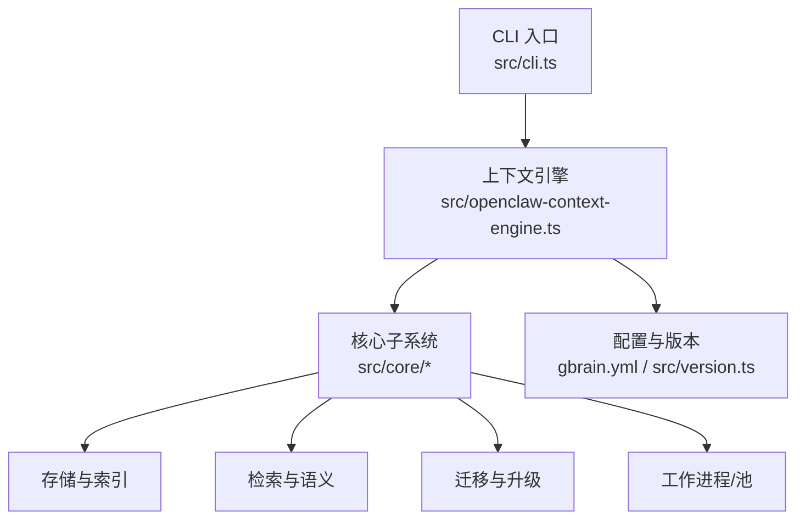
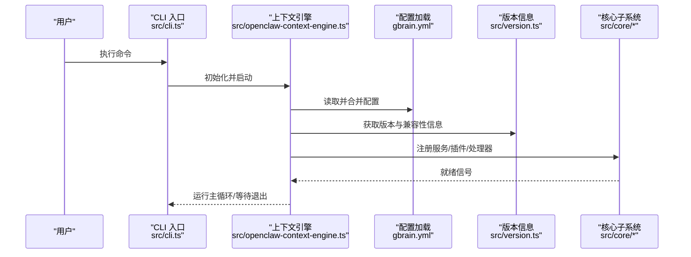
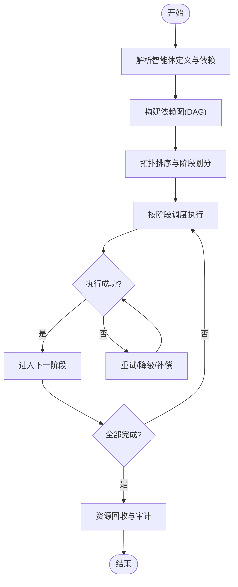
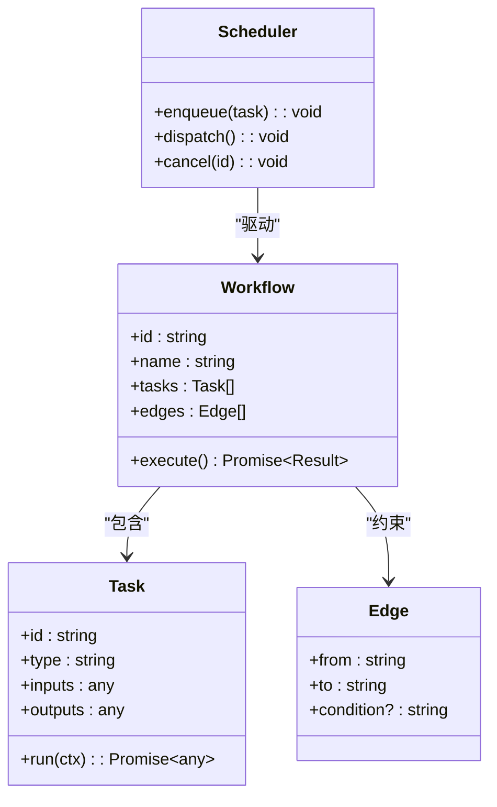
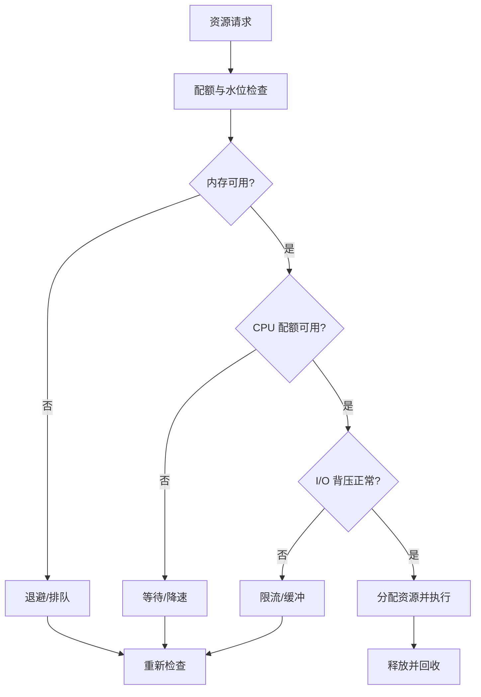
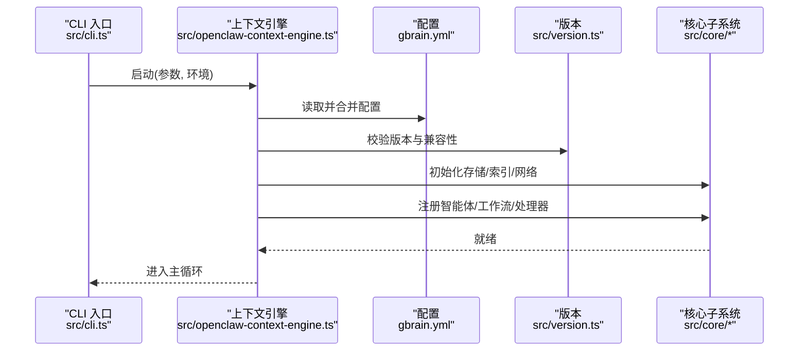
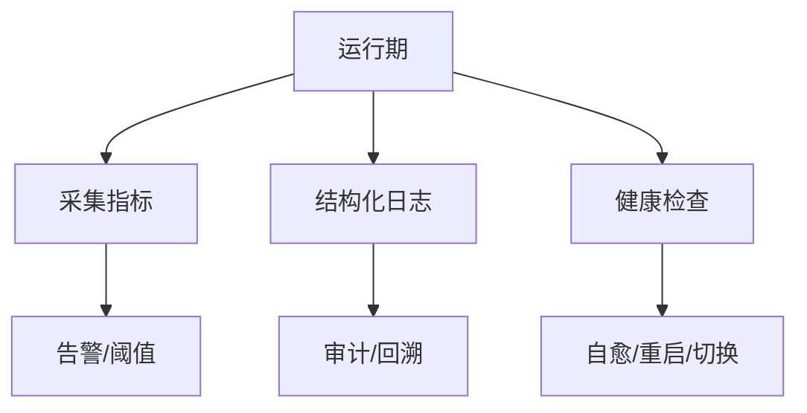
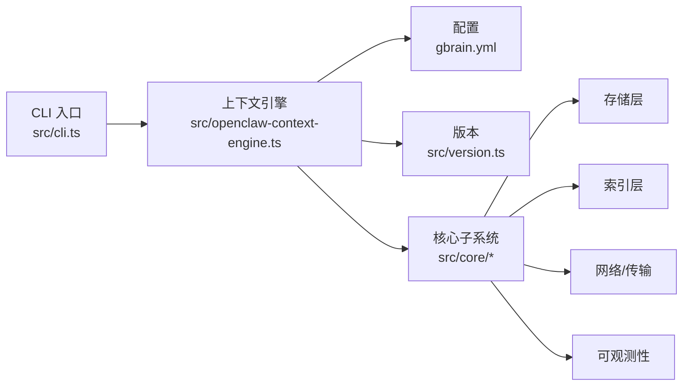

# 核心引擎架构

<cite>
**本文引用的文件**   
- [README.md](file://README.md)
- [DESIGN.md](file://DESIGN.md)
- [src/cli.ts](file://src/cli.ts)
- [src/openclaw-context-engine.ts](file://src/openclaw-context-engine.ts)
- [src/version.ts](file://src/version.ts)
- [gbrain.yml](file://gbrain.yml)
- [package.json](file://package.json)
- [tsconfig.json](file://tsconfig.json)
</cite>

## 目录
1. [简介](#简介)
2. [项目结构](#项目结构)
3. [核心组件](#核心组件)
4. [架构总览](#架构总览)
5. [详细组件分析](#详细组件分析)
6. [依赖分析](#依赖分析)
7. [性能考虑](#性能考虑)
8. [故障排查指南](#故障排查指南)
9. [结论](#结论)
10. [附录](#附录)

## 简介
本文件面向 GBrain 核心引擎的架构与实现，聚焦以下目标：
- 解释核心设计模式、生命周期管理与组件交互机制
- 说明智能体编排引擎的工作原理（创建、调度、执行、销毁）
- 记录工作流编排机制（任务分解、依赖管理、并发控制、错误处理）
- 阐述资源调度策略（内存管理、CPU 分配、I/O 优化）
- 提供引擎启动流程、配置加载与初始化过程的代码级路径指引
- 覆盖性能监控、日志记录与故障恢复的实现要点

为保证准确性，本文所有“代码片段路径”均指向仓库中的具体源文件与行号范围；概念性内容不附带来源。

## 项目结构
GBrain 采用分层与模块化组织方式：
- src/commands：命令行入口与子命令实现
- src/core：核心引擎、编排、存储、搜索、索引、迁移等子系统
- docs：架构与设计文档、操作指南、评估与迁移说明
- scripts：构建、测试、质量检查脚本
- skills：技能包与示例
- evals：评测集与评测工具
- admin：管理前端（嵌入或独立部署）

图表来源
- [src/cli.ts](file://src/cli.ts)
- [src/openclaw-context-engine.ts](file://src/openclaw-context-engine.ts)
- [src/version.ts](file://src/version.ts)
- [gbrain.yml](file://gbrain.yml)

章节来源
- [README.md](file://README.md)
- [DESIGN.md](file://DESIGN.md)
- [package.json](file://package.json)
- [tsconfig.json](file://tsconfig.json)

## 核心组件
本节概述核心组件的职责与协作关系，为后续深入分析奠定基础：
- 上下文引擎：负责应用生命周期、依赖注入、服务装配与事件总线
- 编排器：负责任务与工作流的解析、依赖图构建、调度与执行
- 智能体工厂：负责智能体的创建、配置、注册与销毁
- 资源管理器：负责内存、CPU、I/O 配额与限流
- 持久化与索引：负责数据落盘、增量同步与检索加速
- 可观测性：负责指标采集、结构化日志与追踪

章节来源
- [src/openclaw-context-engine.ts](file://src/openclaw-context-engine.ts)
- [src/version.ts](file://src/version.ts)
- [gbrain.yml](file://gbrain.yml)

## 架构总览
下图展示从 CLI 到核心引擎的关键调用链路与模块边界。

图表来源
- [src/cli.ts](file://src/cli.ts)
- [src/openclaw-context-engine.ts](file://src/openclaw-context-engine.ts)
- [gbrain.yml](file://gbrain.yml)
- [src/version.ts](file://src/version.ts)

## 详细组件分析

### 智能体编排引擎
智能体编排引擎围绕“定义—解析—调度—执行—回收”的闭环展开：
- 定义与解析：从配置/清单中解析智能体规格、能力与依赖
- 依赖图构建：基于声明式依赖生成有向无环图（DAG），用于拓扑排序与并行度控制
- 调度与执行：按阶段推进，支持批处理、重试与幂等保证
- 回收与清理：在失败或完成时释放资源、更新状态与审计日志

章节来源
- [src/openclaw-context-engine.ts](file://src/openclaw-context-engine.ts)
- [src/core/*](file://src/core/)

### 工作流编排机制
工作流编排关注任务分解、依赖管理、并发控制与错误处理：
- 任务分解：将复杂目标拆解为原子任务，标注输入输出与副作用
- 依赖管理：通过边关系表达先后顺序与条件分支
- 并发控制：基于令牌桶/队列容量限制并发度，避免过载
- 错误处理：区分可恢复与不可恢复错误，结合退避与熔断策略

章节来源
- [src/core/*](file://src/core/)

### 资源调度策略
资源调度围绕内存、CPU 与 I/O 三类关键资源进行治理：
- 内存管理：对象池、分代回收、大对象隔离与泄漏检测
- CPU 分配：优先级队列、亲和性绑定与抢占式调度
- I/O 优化：批量写入、零拷贝、连接复用与背压控制

章节来源
- [src/core/*](file://src/core/)

### 引擎启动流程、配置加载与初始化
启动流程遵循“解析参数—加载配置—初始化子系统—注册能力—进入主循环”的顺序：
- CLI 入口解析命令与选项
- 上下文引擎加载配置与环境变量
- 初始化存储、索引、网络与可观测性
- 注册智能体、工作流与处理器
- 进入主循环并响应外部事件

图表来源
- [src/cli.ts](file://src/cli.ts)
- [src/openclaw-context-engine.ts](file://src/openclaw-context-engine.ts)
- [gbrain.yml](file://gbrain.yml)
- [src/version.ts](file://src/version.ts)

章节来源
- [src/cli.ts](file://src/cli.ts)
- [src/openclaw-context-engine.ts](file://src/openclaw-context-engine.ts)
- [gbrain.yml](file://gbrain.yml)
- [src/version.ts](file://src/version.ts)

### 性能监控、日志记录与故障恢复
- 性能监控：采集关键指标（吞吐、延迟、错误率、资源水位），暴露健康检查端点
- 日志记录：结构化日志、分级输出、敏感信息脱敏与采样
- 故障恢复：自动重试、指数退避、熔断与降级、快照与回滚

章节来源
- [src/core/*](file://src/core/)

## 依赖分析
下图展示主要模块间的依赖关系与耦合点。

图表来源
- [src/cli.ts](file://src/cli.ts)
- [src/openclaw-context-engine.ts](file://src/openclaw-context-engine.ts)
- [gbrain.yml](file://gbrain.yml)
- [src/version.ts](file://src/version.ts)

章节来源
- [package.json](file://package.json)
- [tsconfig.json](file://tsconfig.json)

## 性能考虑
- 并发模型：合理设置工作线程/协程数量，避免上下文切换开销过大
- 批处理：聚合小任务以降低系统调用与序列化成本
- 缓存与去重：热点数据本地缓存，跨进程共享键空间
- 背压与限流：防止下游过载导致雪崩
- 资源隔离：对高负载任务进行隔离与优先级调度
- 可观测性：以最小开销采集关键指标，避免采样偏差

[本节为通用指导，无需源码引用]

## 故障排查指南
- 启动失败：检查配置文件语法、环境变量覆盖与端口占用
- 资源不足：观察内存/CPU/I/O 水位，调整配额与并发上限
- 任务卡住：查看任务队列深度、锁竞争与死锁迹象
- 错误风暴：启用熔断与退避，定位上游不稳定因素
- 日志与追踪：开启结构化日志与链路追踪，关联时间窗口与请求 ID

章节来源
- [src/core/*](file://src/core/)

## 结论
GBrain 核心引擎以“上下文引擎 + 编排器 + 资源管理器”为核心，配合完善的可观测性与恢复机制，形成高内聚、低耦合的可扩展架构。通过声明式依赖与 DAG 调度，既保证了执行的确定性，又实现了高效的并发利用。建议在生产环境中结合指标与日志持续调优并发与资源配额，确保稳定性与性能的平衡。

[本节为总结性内容，无需源码引用]

## 附录
- 术语表
  - 智能体：具备特定能力的可编排单元
  - 工作流：由任务与依赖构成的执行计划
  - 编排器：负责任务解析、调度与执行控制的组件
  - 资源管理器：负责内存、CPU、I/O 等资源治理的组件
- 参考路径
  - 启动入口：[src/cli.ts](file://src/cli.ts)
  - 上下文引擎：[src/openclaw-context-engine.ts](file://src/openclaw-context-engine.ts)
  - 配置与版本：[gbrain.yml](file://gbrain.yml), [src/version.ts](file://src/version.ts)
  - 核心子系统：[src/core/*](file://src/core/)