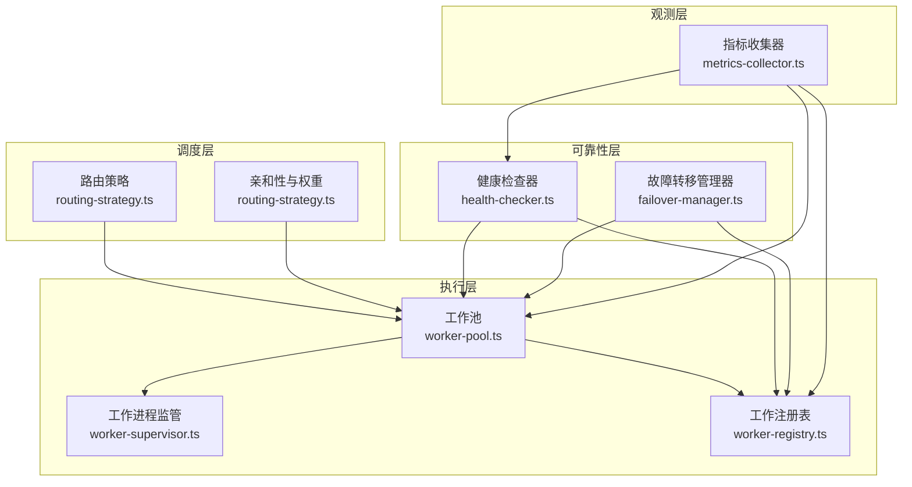
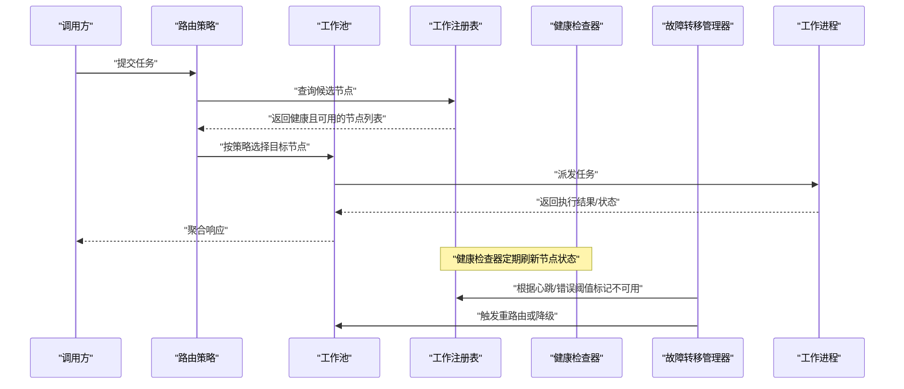
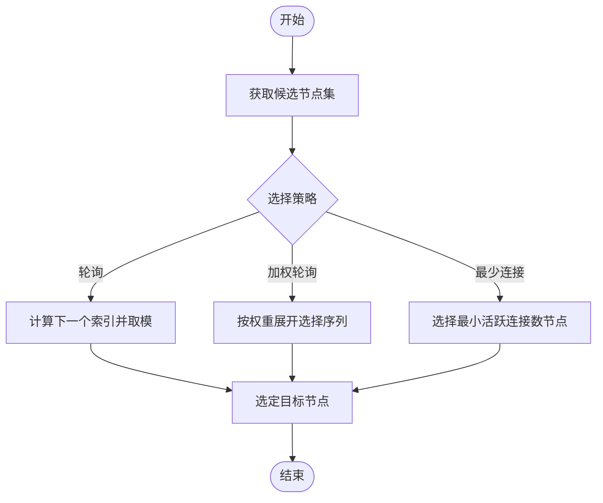
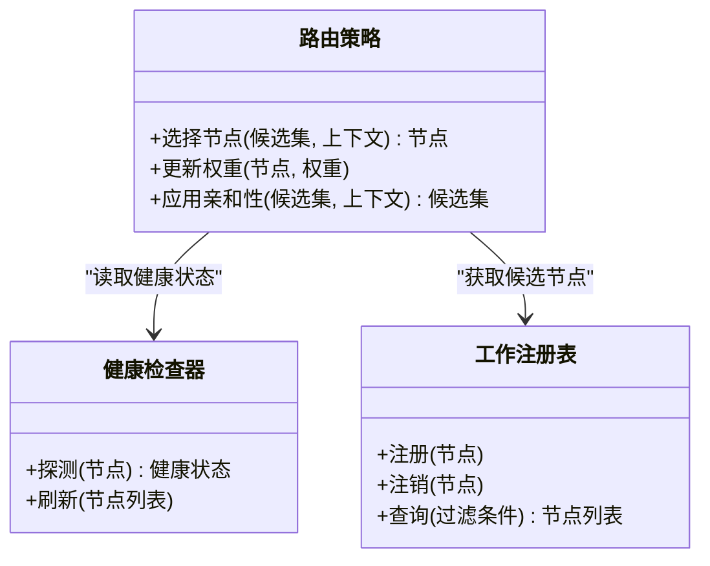
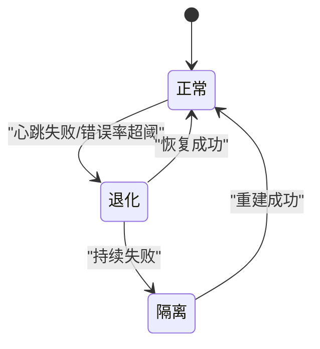
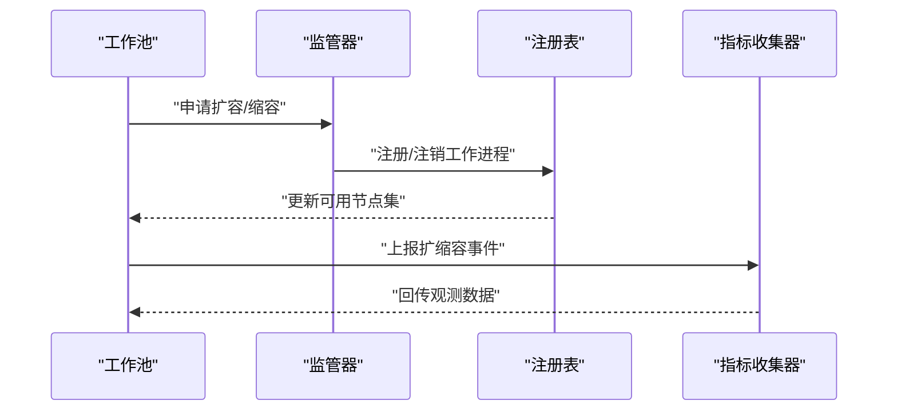
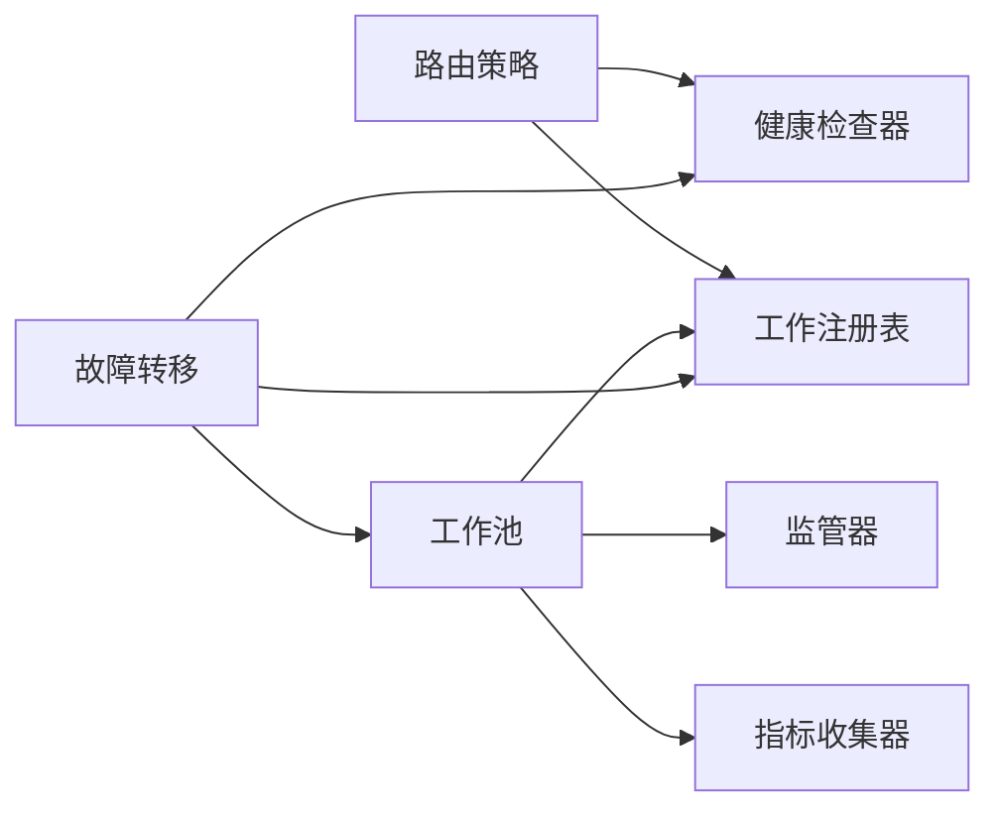

# 负载均衡策略

<cite>
**本文引用的文件**   
- [src/core/worker-pool.ts](file://src/core/worker-pool.ts)
- [src/core/worker-supervisor.ts](file://src/core/worker-supervisor.ts)
- [src/core/worker-registry.ts](file://src/core/worker-registry.ts)
- [src/core/health-checker.ts](file://src/core/health-checker.ts)
- [src/core/routing-strategy.ts](file://src/core/routing-strategy.ts)
- [src/core/failover-manager.ts](file://src/core/failover-manager.ts)
- [src/core/metrics-collector.ts](file://src/core/metrics-collector.ts)
- [scripts/check-worker-pool-atomicity.sh](file://scripts/check-worker-pool-atomicity.sh)
- [test/worker-pool.test.ts](file://test/worker-pool.test.ts)
- [test/worker-registry.serial.test.ts](file://test/worker-registry.serial.test.ts)
- [test/doctor-pool-reap-health.test.ts](file://test/doctor-pool-reap-health.test.ts)
</cite>

## 目录
1. [简介](#简介)
2. [项目结构](#项目结构)
3. [核心组件](#核心组件)
4. [架构总览](#架构总览)
5. [详细组件分析](#详细组件分析)
6. [依赖关系分析](#依赖关系分析)
7. [性能考量](#性能考量)
8. [故障排查指南](#故障排查指南)
9. [结论](#结论)
10. [附录](#附录)

## 简介
本文件围绕任务分发与节点选择，系统化阐述负载均衡策略的设计与实现。重点覆盖：
- 任务分发算法：轮询、加权轮询、最少连接数
- 节点选择机制：健康检查、负载评估、亲和性规则
- 故障转移：心跳检测、自动恢复、降级处理
- 工作池管理：动态扩缩容、资源隔离、状态同步
- 监控指标、性能调优与故障排查

## 项目结构
本项目将负载均衡相关能力拆分为多个职责清晰的模块：路由策略、工作池与工作进程生命周期管理、健康检查、故障转移、指标采集等。下图给出与源码映射的概览视图。

图表来源
- [src/core/routing-strategy.ts](file://src/core/routing-strategy.ts)
- [src/core/worker-pool.ts](file://src/core/worker-pool.ts)
- [src/core/worker-supervisor.ts](file://src/core/worker-supervisor.ts)
- [src/core/worker-registry.ts](file://src/core/worker-registry.ts)
- [src/core/health-checker.ts](file://src/core/health-checker.ts)
- [src/core/failover-manager.ts](file://src/core/failover-manager.ts)
- [src/core/metrics-collector.ts](file://src/core/metrics-collector.ts)

章节来源
- [src/core/worker-pool.ts](file://src/core/worker-pool.ts)
- [src/core/worker-supervisor.ts](file://src/core/worker-supervisor.ts)
- [src/core/worker-registry.ts](file://src/core/worker-registry.ts)
- [src/core/health-checker.ts](file://src/core/health-checker.ts)
- [src/core/routing-strategy.ts](file://src/core/routing-strategy.ts)
- [src/core/failover-manager.ts](file://src/core/failover-manager.ts)
- [src/core/metrics-collector.ts](file://src/core/metrics-collector.ts)

## 核心组件
- 路由策略（Routing Strategy）
  - 提供多种分发算法：轮询、加权轮询、最少连接数
  - 支持亲和性规则与权重配置，决定目标节点的选择顺序
- 工作池（Worker Pool）
  - 维护可用工作进程集合，负责任务派发与回收
  - 暴露扩缩容接口，配合监管器完成进程生命周期管理
- 工作进程监管（Worker Supervisor）
  - 负责进程的启动、重启、优雅退出与资源清理
- 工作注册表（Worker Registry）
  - 集中记录工作进程元数据、状态与健康信息
- 健康检查器（Health Checker）
  - 周期性探测节点健康度，更新可达性与负载指标
- 故障转移管理器（Failover Manager）
  - 基于心跳与错误阈值触发故障转移，协调降级与恢复
- 指标收集器（Metrics Collector）
  - 采集并导出关键指标，支撑可观测性与告警

章节来源
- [src/core/routing-strategy.ts](file://src/core/routing-strategy.ts)
- [src/core/worker-pool.ts](file://src/core/worker-pool.ts)
- [src/core/worker-supervisor.ts](file://src/core/worker-supervisor.ts)
- [src/core/worker-registry.ts](file://src/core/worker-registry.ts)
- [src/core/health-checker.ts](file://src/core/health-checker.ts)
- [src/core/failover-manager.ts](file://src/core/failover-manager.ts)
- [src/core/metrics-collector.ts](file://src/core/metrics-collector.ts)

## 架构总览
下图展示一次典型的任务分发流程，从请求进入路由到最终落盘至工作进程，以及健康与故障转移的协同。

图表来源
- [src/core/routing-strategy.ts](file://src/core/routing-strategy.ts)
- [src/core/worker-pool.ts](file://src/core/worker-pool.ts)
- [src/core/worker-registry.ts](file://src/core/worker-registry.ts)
- [src/core/health-checker.ts](file://src/core/health-checker.ts)
- [src/core/failover-manager.ts](file://src/core/failover-manager.ts)

## 详细组件分析

### 路由策略与任务分发算法
- 轮询（Round Robin）
  - 在健康节点间均匀分配，适合同质化节点
- 加权轮询（Weighted Round Robin）
  - 依据节点权重比例分配，权重可由容量、历史表现或配置决定
- 最少连接数（Least Connections）
  - 优先选择当前并发较低或排队较短的节点，降低尾部延迟

图表来源
- [src/core/routing-strategy.ts](file://src/core/routing-strategy.ts)

章节来源
- [src/core/routing-strategy.ts](file://src/core/routing-strategy.ts)

### 节点选择机制
- 健康检查
  - 通过周期性探针更新节点健康状态，剔除不健康节点
- 负载评估
  - 结合活跃连接数、队列长度、CPU/内存使用率等指标进行综合评分
- 亲和性规则
  - 支持会话/租户/数据域等维度的亲和性约束，确保特定请求路由到合适节点

图表来源
- [src/core/routing-strategy.ts](file://src/core/routing-strategy.ts)
- [src/core/health-checker.ts](file://src/core/health-checker.ts)
- [src/core/worker-registry.ts](file://src/core/worker-registry.ts)

章节来源
- [src/core/routing-strategy.ts](file://src/core/routing-strategy.ts)
- [src/core/health-checker.ts](file://src/core/health-checker.ts)
- [src/core/worker-registry.ts](file://src/core/worker-registry.ts)

### 故障转移策略
- 心跳检测
  - 工作进程定期上报心跳，超时则判定为异常
- 自动恢复
  - 检测到异常后尝试重启或迁移任务到新节点
- 降级处理
  - 在部分节点不可用时，采用只读路径、限流或拒绝新请求等策略保障整体可用性

图表来源
- [src/core/failover-manager.ts](file://src/core/failover-manager.ts)
- [src/core/health-checker.ts](file://src/core/health-checker.ts)
- [src/core/worker-registry.ts](file://src/core/worker-registry.ts)

章节来源
- [src/core/failover-manager.ts](file://src/core/failover-manager.ts)
- [src/core/health-checker.ts](file://src/core/health-checker.ts)
- [src/core/worker-registry.ts](file://src/core/worker-registry.ts)

### 工作池管理与状态同步
- 动态扩缩容
  - 根据负载指标与策略自动增减工作进程数量
- 资源隔离
  - 每个工作进程独立运行环境，避免相互影响
- 状态同步
  - 通过注册表与指标收集器保持全局一致视图

图表来源
- [src/core/worker-pool.ts](file://src/core/worker-pool.ts)
- [src/core/worker-supervisor.ts](file://src/core/worker-supervisor.ts)
- [src/core/worker-registry.ts](file://src/core/worker-registry.ts)
- [src/core/metrics-collector.ts](file://src/core/metrics-collector.ts)

章节来源
- [src/core/worker-pool.ts](file://src/core/worker-pool.ts)
- [src/core/worker-supervisor.ts](file://src/core/worker-supervisor.ts)
- [src/core/worker-registry.ts](file://src/core/worker-registry.ts)
- [src/core/metrics-collector.ts](file://src/core/metrics-collector.ts)

## 依赖关系分析
- 低耦合高内聚
  - 路由策略仅依赖注册表与健康检查器提供的抽象视图
  - 工作池专注于任务派发与生命周期编排
- 直接依赖
  - 路由策略 → 工作注册表、健康检查器
  - 工作池 → 工作注册表、监管器、指标收集器
  - 故障转移 → 健康检查器、工作注册表、工作池
- 潜在循环依赖
  - 通过事件与回调解耦，避免模块间直接互相引用

图表来源
- [src/core/routing-strategy.ts](file://src/core/routing-strategy.ts)
- [src/core/worker-pool.ts](file://src/core/worker-pool.ts)
- [src/core/worker-supervisor.ts](file://src/core/worker-supervisor.ts)
- [src/core/worker-registry.ts](file://src/core/worker-registry.ts)
- [src/core/health-checker.ts](file://src/core/health-checker.ts)
- [src/core/failover-manager.ts](file://src/core/failover-manager.ts)
- [src/core/metrics-collector.ts](file://src/core/metrics-collector.ts)

章节来源
- [src/core/routing-strategy.ts](file://src/core/routing-strategy.ts)
- [src/core/worker-pool.ts](file://src/core/worker-pool.ts)
- [src/core/worker-supervisor.ts](file://src/core/worker-supervisor.ts)
- [src/core/worker-registry.ts](file://src/core/worker-registry.ts)
- [src/core/health-checker.ts](file://src/core/health-checker.ts)
- [src/core/failover-manager.ts](file://src/core/failover-manager.ts)
- [src/core/metrics-collector.ts](file://src/core/metrics-collector.ts)

## 性能考量
- 算法复杂度
  - 轮询与加权轮询近似 O(1)，最少连接数需维护堆或排序结构，通常为 O(log n)
- 缓存与预取
  - 对健康状态与权重进行短期缓存，减少频繁查询带来的开销
- 批量与批处理
  - 合并健康探测与指标上报，降低系统抖动
- 背压与限流
  - 当后端处理能力不足时，主动限制入站流量，保护系统稳定
- 扩缩容平滑过渡
  - 渐进式扩容，避免冷启动风暴；缩容前进行任务迁移与 draining

[本节为通用指导，无需具体文件引用]

## 故障排查指南
- 常见问题定位
  - 节点频繁上下线：检查心跳间隔与超时阈值是否合理
  - 任务倾斜：确认权重与亲和性配置是否符合预期
  - 扩缩容抖动：观察扩缩容触发条件与冷却时间
- 诊断步骤
  - 查看注册表中的节点状态与健康指标
  - 核对健康检查器的探测日志与失败原因
  - 审查故障转移决策链路与降级开关
- 验证脚本与测试
  - 使用原子性检查脚本验证工作池操作的幂等与一致性
  - 参考单元测试用例复现问题场景

章节来源
- [scripts/check-worker-pool-atomicity.sh](file://scripts/check-worker-pool-atomicity.sh)
- [test/worker-pool.test.ts](file://test/worker-pool.test.ts)
- [test/worker-registry.serial.test.ts](file://test/worker-registry.serial.test.ts)
- [test/doctor-pool-reap-health.test.ts](file://test/doctor-pool-reap-health.test.ts)

## 结论
通过将路由策略、工作池、健康检查与故障转移解耦设计，系统在可扩展性、稳定性与可观测性方面取得良好平衡。建议在生产环境中结合业务特征选择合适的分发算法与亲和性规则，并通过完善的监控与自动化手段实现弹性伸缩与快速自愈。

[本节为总结性内容，无需具体文件引用]

## 附录
- 术语
  - 亲和性：将特定请求定向到具备相同属性或数据的节点
  - 退化：在部分能力受损时维持基本功能的服务模式
  - 扩缩容：根据负载动态调整工作进程数量
- 最佳实践
  - 为不同节点设置差异化权重以反映真实容量
  - 对关键路径启用最少连接数策略以降低尾延迟
  - 建立健康检查与故障转移的联动闭环，缩短故障发现与恢复时间

[本节为概念性内容，无需具体文件引用]