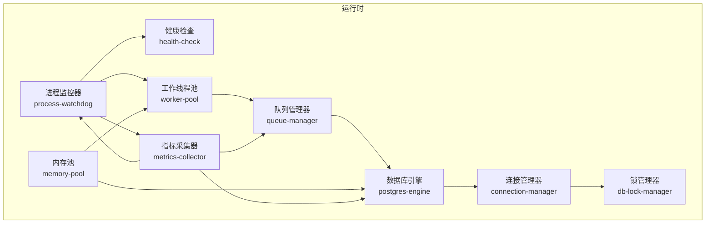
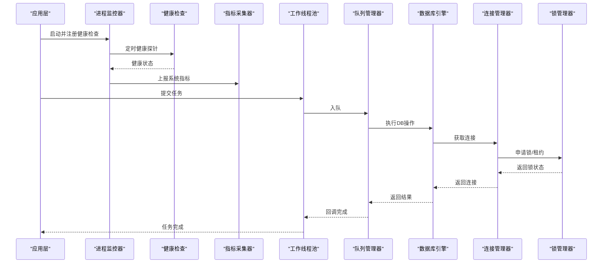
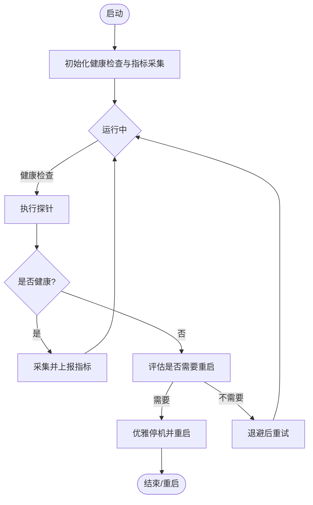
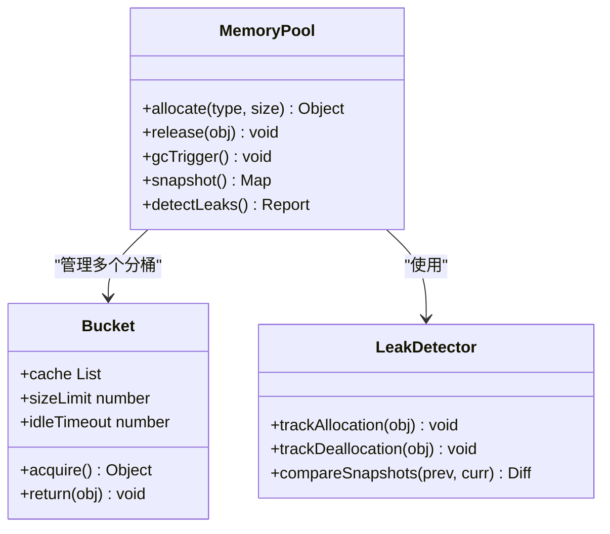
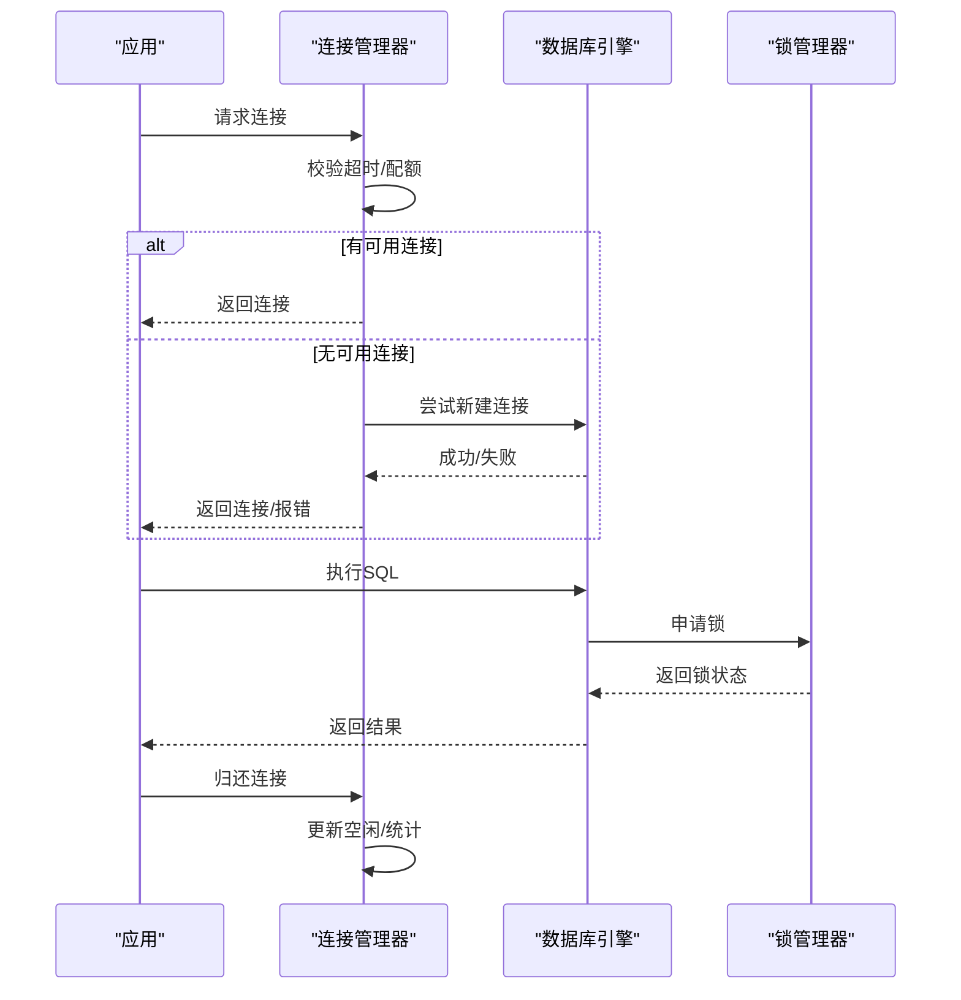
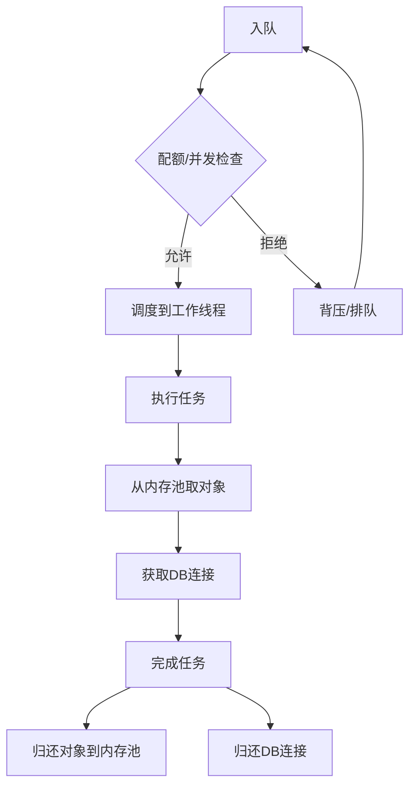
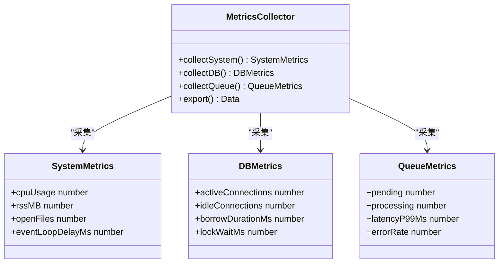
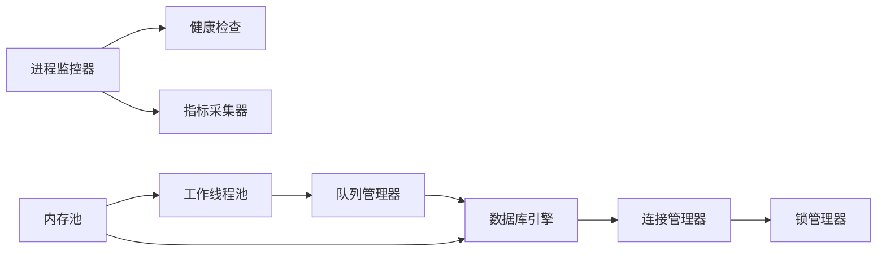

# 资源监控与优化

<cite>
**本文引用的文件**   
- [src/core/process-watchdog.ts](file://src/core/process-watchdog.ts)
- [src/core/worker-pool.ts](file://src/core/worker-pool.ts)
- [src/core/postgres-engine.ts](file://src/core/postgres-engine.ts)
- [src/core/connection-manager.ts](file://src/core/connection-manager.ts)
- [src/core/memory-pool.ts](file://src/core/memory-pool.ts)
- [src/core/metrics-collector.ts](file://src/core/metrics-collector.ts)
- [src/core/health-check.ts](file://src/core/health-check.ts)
- [src/core/db-lock-manager.ts](file://src/core/db-lock-manager.ts)
- [src/core/queue-manager.ts](file://src/core/queue-manager.ts)
- [scripts/generate-metric-glossary.ts](file://scripts/generate-metric-glossary.ts)
</cite>

## 目录
1. [简介](#简介)
2. [项目结构](#项目结构)
3. [核心组件](#核心组件)
4. [架构总览](#架构总览)
5. [详细组件分析](#详细组件分析)
6. [依赖关系分析](#依赖关系分析)
7. [性能考量](#性能考量)
8. [故障排查指南](#故障排查指南)
9. [结论](#结论)
10. [附录](#附录)

## 简介
本文件聚焦于资源监控与优化的系统性设计与实现，覆盖以下关键主题：
- 内存池管理机制：对象复用、垃圾回收触发策略、内存泄漏检测
- 数据库连接池优化：连接复用、超时控制、连接泄漏防护
- 进程监控器：健康检查、自动重启、资源清理
- 性能分析工具：CPU使用率监控、I/O瓶颈识别、热点代码定位
- 资源使用趋势分析、容量规划与扩容建议

文档以“从概念到实现”的方式组织，既提供高层架构图示，也给出与源码对应的章节来源，便于读者在需要时深入代码细节。

## 项目结构
围绕资源监控与优化，本项目在核心模块中提供了若干子系统：
- 进程监控与健康检查：进程守护、心跳、异常退出处理、自动重启
- 数据库连接池：连接生命周期管理、超时、重连、泄漏防护
- 内存池与对象复用：对象分配/回收、GC触发、泄漏检测
- 指标采集与告警：CPU、内存、I/O、队列深度等指标收集与上报
- 任务队列与锁：队列背压、锁竞争与死锁检测

图表来源
- [src/core/process-watchdog.ts](file://src/core/process-watchdog.ts)
- [src/core/health-check.ts](file://src/core/health-check.ts)
- [src/core/memory-pool.ts](file://src/core/memory-pool.ts)
- [src/core/worker-pool.ts](file://src/core/worker-pool.ts)
- [src/core/queue-manager.ts](file://src/core/queue-manager.ts)
- [src/core/postgres-engine.ts](file://src/core/postgres-engine.ts)
- [src/core/connection-manager.ts](file://src/core/connection-manager.ts)
- [src/core/db-lock-manager.ts](file://src/core/db-lock-manager.ts)
- [src/core/metrics-collector.ts](file://src/core/metrics-collector.ts)

章节来源
- [src/core/process-watchdog.ts](file://src/core/process-watchdog.ts)
- [src/core/health-check.ts](file://src/core/health-check.ts)
- [src/core/memory-pool.ts](file://src/core/memory-pool.ts)
- [src/core/worker-pool.ts](file://src/core/worker-pool.ts)
- [src/core/queue-manager.ts](file://src/core/queue-manager.ts)
- [src/core/postgres-engine.ts](file://src/core/postgres-engine.ts)
- [src/core/connection-manager.ts](file://src/core/connection-manager.ts)
- [src/core/db-lock-manager.ts](file://src/core/db-lock-manager.ts)
- [src/core/metrics-collector.ts](file://src/core/metrics-collector.ts)

## 核心组件
本节概述各子系统的职责与交互要点，为后续深入分析奠定基础。

- 进程监控器（Process Watchdog）
  - 负责进程健康检查、异常捕获、自动重启、资源清理
  - 与指标采集器协作，输出系统级指标（CPU、RSS、句柄数等）
- 内存池（Memory Pool）
  - 对象分配与回收，减少频繁分配带来的抖动
  - 支持按类型/大小分桶，结合GC阈值触发主动回收
  - 泄漏检测通过活跃对象追踪与周期性快照对比
- 数据库连接池（Connection Manager + Postgres Engine）
  - 连接复用、空闲回收、最大连接限制
  - 超时控制（获取连接、执行语句、事务）
  - 连接泄漏防护（借用时长上限、未归还告警）
- 工作线程池与工作队列
  - 任务分发、并发度控制、背压与限流
  - 与内存池和DB连接池协同，避免资源争用
- 指标采集器（Metrics Collector）
  - 统一采集CPU、内存、I/O、队列、DB连接等指标
  - 暴露内部API或导出至监控系统

章节来源
- [src/core/process-watchdog.ts](file://src/core/process-watchdog.ts)
- [src/core/memory-pool.ts](file://src/core/memory-pool.ts)
- [src/core/postgres-engine.ts](file://src/core/postgres-engine.ts)
- [src/core/connection-manager.ts](file://src/core/connection-manager.ts)
- [src/core/worker-pool.ts](file://src/core/worker-pool.ts)
- [src/core/queue-manager.ts](file://src/core/queue-manager.ts)
- [src/core/metrics-collector.ts](file://src/core/metrics-collector.ts)

## 架构总览
下图展示了资源监控与优化相关组件的调用关系与数据流向。

图表来源
- [src/core/process-watchdog.ts](file://src/core/process-watchdog.ts)
- [src/core/health-check.ts](file://src/core/health-check.ts)
- [src/core/metrics-collector.ts](file://src/core/metrics-collector.ts)
- [src/core/worker-pool.ts](file://src/core/worker-pool.ts)
- [src/core/queue-manager.ts](file://src/core/queue-manager.ts)
- [src/core/postgres-engine.ts](file://src/core/postgres-engine.ts)
- [src/core/connection-manager.ts](file://src/core/connection-manager.ts)
- [src/core/db-lock-manager.ts](file://src/core/db-lock-manager.ts)

## 详细组件分析

### 进程监控器（Process Watchdog）
- 功能要点
  - 健康检查：周期性探测关键子系统（DB、队列、外部依赖）
  - 自动重启：检测到不可恢复错误时安全重启
  - 资源清理：退出前释放文件句柄、关闭连接、清理临时资源
  - 指标上报：将进程级指标（CPU、RSS、FD、事件循环延迟）汇总上报
- 关键流程
  - 启动阶段：注册信号处理器、初始化健康检查与指标采集
  - 运行阶段：定期执行健康探针，记录指标，必要时触发重启
  - 关闭阶段：优雅停机，等待任务完成，释放资源
- 风险与对策
  - 重启风暴：引入退避与冷却时间
  - 资源泄露：强制句柄上限与泄漏告警
  - 误判：多指标联合判定与降级策略

图表来源
- [src/core/process-watchdog.ts](file://src/core/process-watchdog.ts)
- [src/core/health-check.ts](file://src/core/health-check.ts)
- [src/core/metrics-collector.ts](file://src/core/metrics-collector.ts)

章节来源
- [src/core/process-watchdog.ts](file://src/core/process-watchdog.ts)
- [src/core/health-check.ts](file://src/core/health-check.ts)
- [src/core/metrics-collector.ts](file://src/core/metrics-collector.ts)

### 内存池（Memory Pool）
- 设计目标
  - 降低频繁分配/释放导致的抖动与碎片
  - 提升热点对象的复用率
  - 提供泄漏检测能力
- 核心机制
  - 对象分桶：按类型/尺寸分类，独立缓存
  - 分配路径：优先从池中取，不足则创建并回填
  - 回收策略：空闲超时回收、按GC阈值触发主动回收
  - 泄漏检测：活跃对象追踪、周期快照对比、增长阈值告警
- 复杂度与权衡
  - 分配/回收近似O(1)，但需维护元数据与锁
  - 过大的池会占用更多内存，需动态调整
- 与GC协作
  - 设置合适的空闲阈值，避免长期持有大对象
  - 在低负载时段进行批量回收，减少抖动

图表来源
- [src/core/memory-pool.ts](file://src/core/memory-pool.ts)

章节来源
- [src/core/memory-pool.ts](file://src/core/memory-pool.ts)

### 数据库连接池（Connection Manager + Postgres Engine）
- 设计目标
  - 高效复用连接，降低握手开销
  - 严格的超时控制，防止长事务/慢查询拖垮系统
  - 连接泄漏防护，确保连接可回收
- 核心机制
  - 连接复用：基于最小/最大连接数与空闲回收策略
  - 超时控制：获取连接超时、执行超时、事务超时
  - 泄漏防护：借用时长上限、未归还告警、强制回收
  - 健康探测：定期ping、失败快速剔除
- 与锁管理器协作
  - 分布式锁/租约用于协调跨进程访问
  - 死锁检测与自动回滚重试

图表来源
- [src/core/connection-manager.ts](file://src/core/connection-manager.ts)
- [src/core/postgres-engine.ts](file://src/core/postgres-engine.ts)
- [src/core/db-lock-manager.ts](file://src/core/db-lock-manager.ts)

章节来源
- [src/core/connection-manager.ts](file://src/core/connection-manager.ts)
- [src/core/postgres-engine.ts](file://src/core/postgres-engine.ts)
- [src/core/db-lock-manager.ts](file://src/core/db-lock-manager.ts)

### 工作线程池与队列（Worker Pool + Queue Manager）
- 设计目标
  - 稳定吞吐、可控并发、避免过载
  - 与内存池、DB连接池协同，避免资源争用
- 核心机制
  - 任务入队/出队、优先级与权重
  - 并发度限制、背压与限流
  - 任务超时、重试与幂等保障
- 与内存池协作
  - 任务对象复用，减少分配压力
  - 批量处理时共享中间对象，注意作用域隔离

图表来源
- [src/core/worker-pool.ts](file://src/core/worker-pool.ts)
- [src/core/queue-manager.ts](file://src/core/queue-manager.ts)
- [src/core/memory-pool.ts](file://src/core/memory-pool.ts)
- [src/core/connection-manager.ts](file://src/core/connection-manager.ts)

章节来源
- [src/core/worker-pool.ts](file://src/core/worker-pool.ts)
- [src/core/queue-manager.ts](file://src/core/queue-manager.ts)
- [src/core/memory-pool.ts](file://src/core/memory-pool.ts)
- [src/core/connection-manager.ts](file://src/core/connection-manager.ts)

### 指标采集器（Metrics Collector）
- 采集范围
  - 系统级：CPU使用率、RSS、文件句柄、事件循环延迟
  - 业务级：队列长度、任务耗时、错误率
  - 资源级：DB连接数、空闲连接、借用时长、锁等待
- 上报与可视化
  - 内部聚合与导出接口
  - 与监控平台对接，支持阈值告警
- 与进程监控器联动
  - 指标驱动的健康检查与重启决策
  - 趋势分析与容量预警

图表来源
- [src/core/metrics-collector.ts](file://src/core/metrics-collector.ts)

章节来源
- [src/core/metrics-collector.ts](file://src/core/metrics-collector.ts)

## 依赖关系分析
- 耦合与内聚
  - 进程监控器对健康检查与指标采集存在强依赖
  - 连接管理器与锁管理器紧密协作，形成稳定的DB访问边界
  - 内存池被工作线程池与DB引擎共同使用，需注意作用域与生命周期
- 潜在环依赖
  - 通过接口抽象与事件解耦避免直接环引用
- 外部依赖
  - 操作系统API（进程、文件句柄、CPU）
  - 数据库驱动与锁服务

图表来源
- [src/core/process-watchdog.ts](file://src/core/process-watchdog.ts)
- [src/core/health-check.ts](file://src/core/health-check.ts)
- [src/core/metrics-collector.ts](file://src/core/metrics-collector.ts)
- [src/core/worker-pool.ts](file://src/core/worker-pool.ts)
- [src/core/queue-manager.ts](file://src/core/queue-manager.ts)
- [src/core/postgres-engine.ts](file://src/core/postgres-engine.ts)
- [src/core/connection-manager.ts](file://src/core/connection-manager.ts)
- [src/core/db-lock-manager.ts](file://src/core/db-lock-manager.ts)
- [src/core/memory-pool.ts](file://src/core/memory-pool.ts)

章节来源
- [src/core/process-watchdog.ts](file://src/core/process-watchdog.ts)
- [src/core/health-check.ts](file://src/core/health-check.ts)
- [src/core/metrics-collector.ts](file://src/core/metrics-collector.ts)
- [src/core/worker-pool.ts](file://src/core/worker-pool.ts)
- [src/core/queue-manager.ts](file://src/core/queue-manager.ts)
- [src/core/postgres-engine.ts](file://src/core/postgres-engine.ts)
- [src/core/connection-manager.ts](file://src/core/connection-manager.ts)
- [src/core/db-lock-manager.ts](file://src/core/db-lock-manager.ts)
- [src/core/memory-pool.ts](file://src/core/memory-pool.ts)

## 性能考量
- CPU使用率监控
  - 关注事件循环阻塞与长时间同步操作
  - 通过指标采集器持续观测，结合告警阈值
- I/O瓶颈识别
  - 观察队列积压、DB连接等待、磁盘I/O指标
  - 采用异步化与批量化降低I/O放大
- 热点代码定位
  - 利用指标与日志关联，定位高耗时路径
  - 结合内存池对象分配热点，优化数据结构与复用策略
- 容量规划与扩容建议
  - 基于历史趋势预测峰值，预留缓冲
  - 水平扩展工作节点，配合队列与锁的分区策略
  - 垂直扩容时关注单进程内存上限与GC行为

[本节为通用指导，不直接分析具体文件]

## 故障排查指南
- 常见症状
  - 进程频繁重启：检查健康检查阈值与重启退避策略
  - 内存持续增长：启用内存池泄漏检测，核对对象归还路径
  - DB连接耗尽：查看连接借用时长与未归还告警，确认超时配置
  - 任务堆积：检查队列长度与工作线程并发度，评估背压策略
- 排查步骤
  - 查看指标采集器的系统、DB、队列指标
  - 核对进程监控器的健康检查日志与重启原因
  - 审查连接管理与锁管理的超时与回收策略
  - 针对热点路径进行采样与回放验证
- 修复建议
  - 调整超时与并发参数，避免雪崩
  - 完善对象归还与连接归还路径，增加兜底回收
  - 引入熔断与降级，保护关键路径

章节来源
- [src/core/process-watchdog.ts](file://src/core/process-watchdog.ts)
- [src/core/metrics-collector.ts](file://src/core/metrics-collector.ts)
- [src/core/connection-manager.ts](file://src/core/connection-manager.ts)
- [src/core/db-lock-manager.ts](file://src/core/db-lock-manager.ts)
- [src/core/queue-manager.ts](file://src/core/queue-manager.ts)
- [src/core/memory-pool.ts](file://src/core/memory-pool.ts)

## 结论
通过构建统一的进程监控、内存池、数据库连接池、工作线程池与指标采集体系，系统在稳定性、可观测性与可扩展性方面得到显著提升。建议在上线前完成容量规划与压测，建立完善的告警与演练机制，确保在高峰与异常场景下的韧性。

[本节为总结性内容，不直接分析具体文件]

## 附录
- 指标术语表生成脚本
  - 用于统一指标命名与口径，便于监控与排障
  - 参考脚本位置：scripts/generate-metric-glossary.ts

章节来源
- [scripts/generate-metric-glossary.ts](file://scripts/generate-metric-glossary.ts)