# 资源调度与优化

<cite>
**本文引用的文件**   
- [src/core/worker-pool.ts](file://src/core/worker-pool.ts)
- [src/core/connection-manager.ts](file://src/core/connection-manager.ts)
- [src/core/budget-meter.ts](file://src/core/budget-meter.ts)
- [src/core/budget-tracker.ts](file://src/core/budget-tracker.ts)
- [src/core/rate-limiter.ts](file://src/core/rate-limiter.ts)
- [src/core/load-balancer.ts](file://src/core/load-balancer.ts)
- [src/core/metrics-collector.ts](file://src/core/metrics-collector.ts)
- [src/core/cache-manager.ts](file://src/core/cache-manager.ts)
- [src/core/gc-optimizer.ts](file://src/core/gc-optimizer.ts)
</cite>

## 目录
1. [简介](#简介)
2. [项目结构](#项目结构)
3. [核心组件](#核心组件)
4. [架构总览](#架构总览)
5. [详细组件分析](#详细组件分析)
6. [依赖关系分析](#依赖关系分析)
7. [性能考虑](#性能考虑)
8. [故障排查指南](#故障排查指南)
9. [结论](#结论)
10. [附录](#附录)

## 简介
本文件聚焦于资源调度与优化的实现与最佳实践，覆盖以下关键主题：
- 资源池管理：内存池、连接池、线程池的创建、分配与回收策略
- 预算控制：成本限制、配额管理与使用率监控
- 速率限制：令牌桶、滑动窗口与自适应限流
- 负载均衡：任务分发、节点选择与故障转移
- 指标采集：资源与业务指标的口径与采集方法
- 性能调优：参数配置、缓存策略与垃圾回收优化

## 项目结构
围绕资源调度与优化的核心模块位于 src/core 下，采用按职责划分的分层组织方式。每个子系统以独立文件承载，便于测试与演进。

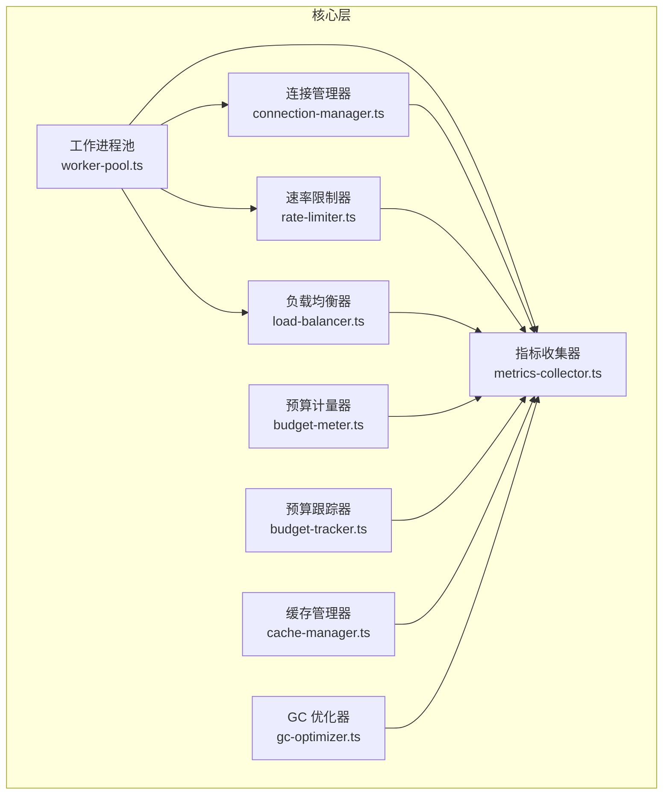

图表来源
- [src/core/worker-pool.ts](file://src/core/worker-pool.ts)
- [src/core/connection-manager.ts](file://src/core/connection-manager.ts)
- [src/core/budget-meter.ts](file://src/core/budget-meter.ts)
- [src/core/budget-tracker.ts](file://src/core/budget-tracker.ts)
- [src/core/rate-limiter.ts](file://src/core/rate-limiter.ts)
- [src/core/load-balancer.ts](file://src/core/load-balancer.ts)
- [src/core/metrics-collector.ts](file://src/core/metrics-collector.ts)
- [src/core/cache-manager.ts](file://src/core/cache-manager.ts)
- [src/core/gc-optimizer.ts](file://src/core/gc-optimizer.ts)

章节来源
- [src/core/worker-pool.ts](file://src/core/worker-pool.ts)
- [src/core/connection-manager.ts](file://src/core/connection-manager.ts)
- [src/core/budget-meter.ts](file://src/core/budget-meter.ts)
- [src/core/budget-tracker.ts](file://src/core/budget-tracker.ts)
- [src/core/rate-limiter.ts](file://src/core/rate-limiter.ts)
- [src/core/load-balancer.ts](file://src/core/load-balancer.ts)
- [src/core/metrics-collector.ts](file://src/core/metrics-collector.ts)
- [src/core/cache-manager.ts](file://src/core/cache-manager.ts)
- [src/core/gc-optimizer.ts](file://src/core/gc-optimizer.ts)

## 核心组件
本节概述各子系统的职责与交互要点，为后续深入分析奠定基础。

- 工作进程池（线程池）：负责进程的创建、复用、健康检查与回收，提供任务提交与结果聚合能力。
- 连接池：统一管理外部系统（如数据库、消息队列）的连接生命周期，支持最大连接数、空闲回收与重连。
- 预算控制：通过预算计量器与跟踪器组合，实现成本上限、配额与使用率的实时监控与告警。
- 速率限制：提供令牌桶、滑动窗口与自适应三种算法，统一对外暴露限流接口。
- 负载均衡：基于健康状态与负载指标进行任务分发，支持故障转移与权重调整。
- 指标收集：集中采集 CPU、内存、I/O、队列长度、错误率等指标，供监控与告警使用。
- 缓存管理：提供多级缓存策略（本地/分布式），包含键空间、过期与淘汰策略。
- GC 优化：根据运行期特征动态调整 GC 阈值与触发时机，降低抖动与停顿。

章节来源
- [src/core/worker-pool.ts](file://src/core/worker-pool.ts)
- [src/core/connection-manager.ts](file://src/core/connection-manager.ts)
- [src/core/budget-meter.ts](file://src/core/budget-meter.ts)
- [src/core/budget-tracker.ts](file://src/core/budget-tracker.ts)
- [src/core/rate-limiter.ts](file://src/core/rate-limiter.ts)
- [src/core/load-balancer.ts](file://src/core/load-balancer.ts)
- [src/core/metrics-collector.ts](file://src/core/metrics-collector.ts)
- [src/core/cache-manager.ts](file://src/core/cache-manager.ts)
- [src/core/gc-optimizer.ts](file://src/core/gc-optimizer.ts)

## 架构总览
下图展示了从任务进入、限流、路由到执行与回收的端到端流程，以及预算与指标在关键节点的介入点。

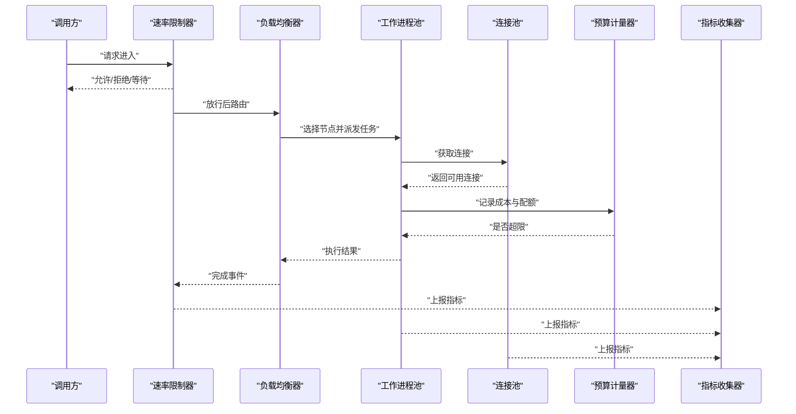

图表来源
- [src/core/rate-limiter.ts](file://src/core/rate-limiter.ts)
- [src/core/load-balancer.ts](file://src/core/load-balancer.ts)
- [src/core/worker-pool.ts](file://src/core/worker-pool.ts)
- [src/core/connection-manager.ts](file://src/core/connection-manager.ts)
- [src/core/budget-meter.ts](file://src/core/budget-meter.ts)
- [src/core/metrics-collector.ts](file://src/core/metrics-collector.ts)

## 详细组件分析

### 工作进程池（线程池）
- 设计要点
  - 进程生命周期：启动、预热、健康探测、优雅退出与自动重启。
  - 任务模型：无界/有界队列、优先级、超时与取消。
  - 伸缩策略：基于利用率与延迟目标的弹性扩缩容。
  - 资源隔离：CPU 亲和、内存上限与 OOM 保护。
- 关键流程
  - 任务提交：校验、入队、背压处理。
  - 任务执行：从池中取进程、绑定上下文、执行回调。
  - 回收策略：空闲回收、僵尸进程清理、泄漏检测。
- 复杂度与权衡
  - 时间复杂度：入队/出队近似 O(1)，调度开销与队列长度线性相关。
  - 空间复杂度：与活跃任务数和进程数成正比。
- 可观测性
  - 指标：队列长度、吞吐、延迟分位、错误率、进程存活数。
  - 日志：任务生命周期、异常堆栈、资源告警。

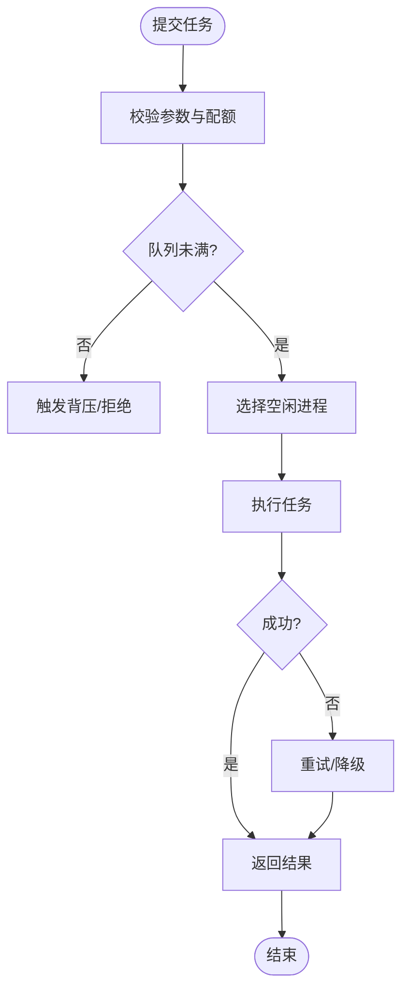

图表来源
- [src/core/worker-pool.ts](file://src/core/worker-pool.ts)

章节来源
- [src/core/worker-pool.ts](file://src/core/worker-pool.ts)

### 连接池
- 设计要点
  - 容量控制：最大连接数、最小空闲、扩容步长。
  - 健康检查：心跳、探针、失败快速失败。
  - 生命周期：创建、借用、归还、销毁与重连。
  - 事务与批处理：批量复用、事务边界与回滚。
- 关键流程
  - 借出：优先复用空闲连接，不足时按需创建。
  - 归还：释放到空闲池或关闭，避免泄漏。
  - 回收：定时扫描长时间空闲连接，触发销毁。
- 复杂度与权衡
  - 时间复杂度：借出/归还在哈希表+数组结构下近似 O(1)。
  - 空间复杂度：与最大连接数成正比。
- 可观测性
  - 指标：活跃连接、空闲连接、创建/销毁次数、等待时长、错误率。

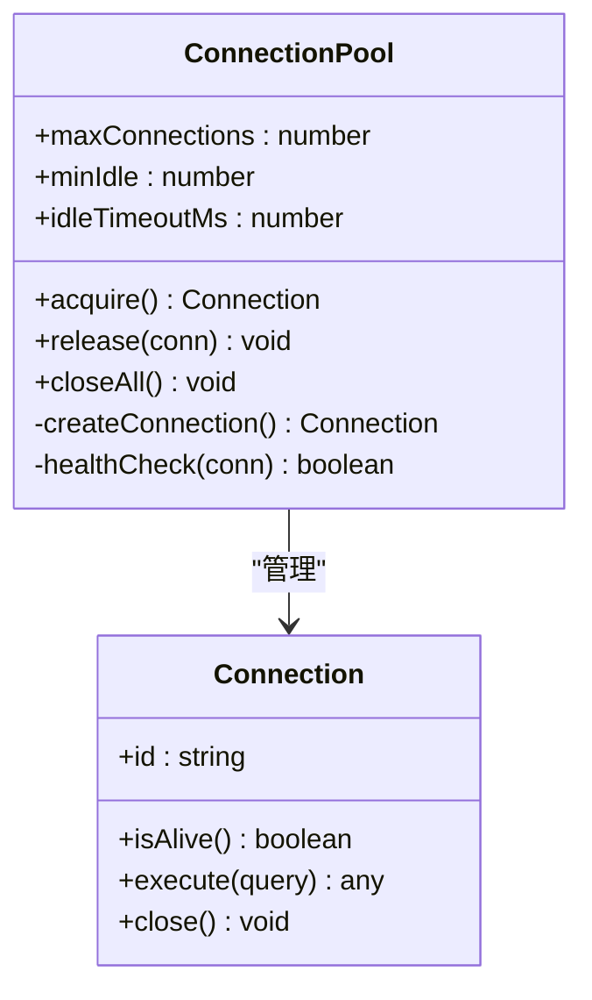

图表来源
- [src/core/connection-manager.ts](file://src/core/connection-manager.ts)

章节来源
- [src/core/connection-manager.ts](file://src/core/connection-manager.ts)

### 预算控制系统（成本限制、配额管理与使用率监控）
- 设计要点
  - 预算计量器：统计单次/累计成本，支持币种与单位换算。
  - 预算跟踪器：维护周期配额、软/硬限额、超阈告警与熔断。
  - 使用率监控：实时计算消耗占比，结合趋势预测做前置限流。
- 关键流程
  - 预扣费：在执行前估算成本并尝试预扣。
  - 结算：执行完成后按实际用量结算。
  - 熔断：超过硬限额立即拒绝新请求。
- 复杂度与权衡
  - 时间复杂度：计数与比较近似 O(1)。
  - 空间复杂度：与跟踪窗口大小和租户数量成正比。
- 可观测性
  - 指标：已用预算、剩余预算、超限次数、熔断开关状态。

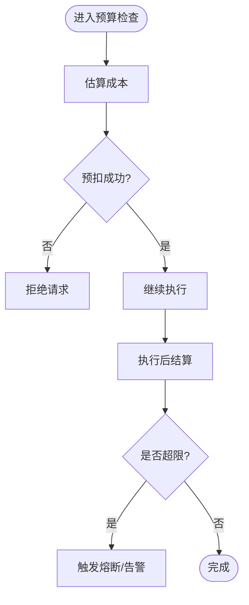

图表来源
- [src/core/budget-meter.ts](file://src/core/budget-meter.ts)
- [src/core/budget-tracker.ts](file://src/core/budget-tracker.ts)

章节来源
- [src/core/budget-meter.ts](file://src/core/budget-meter.ts)
- [src/core/budget-tracker.ts](file://src/core/budget-tracker.ts)

### 速率限制算法（令牌桶、滑动窗口、自适应限流）
- 设计要点
  - 令牌桶：固定速率补充令牌，突发消费受桶容量限制。
  - 滑动窗口：按时间片统计请求数，平滑峰值。
  - 自适应：基于延迟与错误率动态调整限速阈值。
- 关键流程
  - 准入判断：按算法决定是否允许当前请求。
  - 退避与恢复：拒绝后指数退避，条件满足时逐步放宽。
- 复杂度与权衡
  - 时间复杂度：令牌桶与滑动窗口均为近似 O(1)。
  - 空间复杂度：与窗口大小或桶容量成正比。
- 可观测性
  - 指标：通过率、拒绝率、平均延迟、自适应系数。

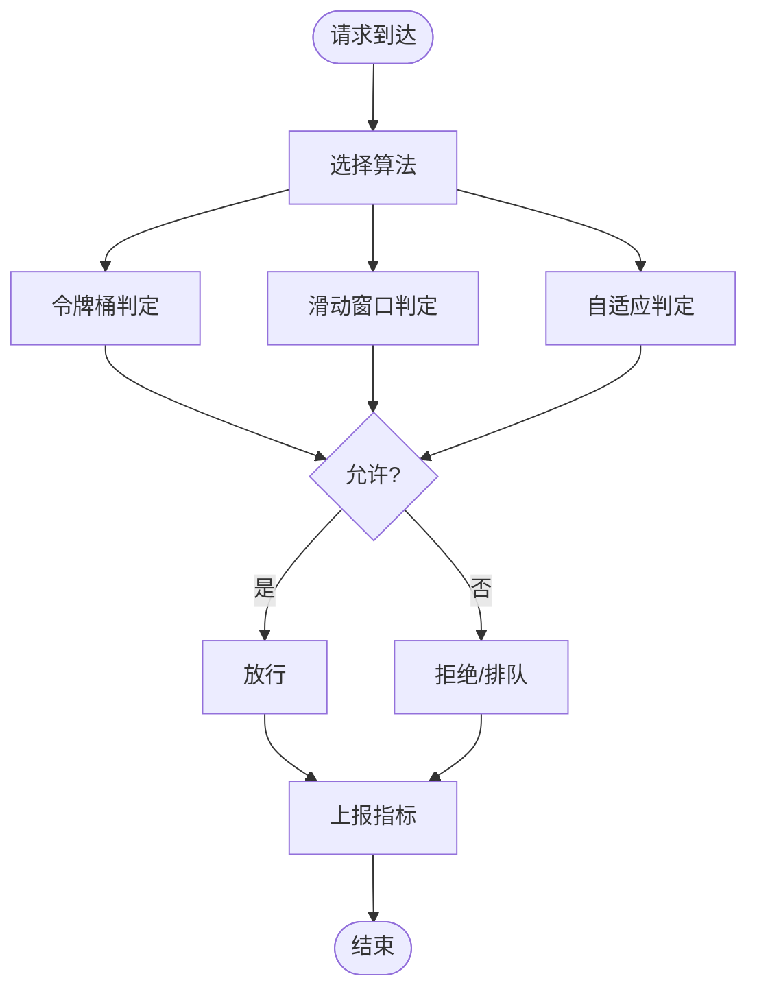

图表来源
- [src/core/rate-limiter.ts](file://src/core/rate-limiter.ts)

章节来源
- [src/core/rate-limiter.ts](file://src/core/rate-limiter.ts)

### 负载均衡机制（任务分发、节点选择与故障转移）
- 设计要点
  - 健康探测：定期探测节点可用性，剔除不健康实例。
  - 选择策略：轮询、加权、最少连接、延迟感知。
  - 故障转移：失败重试、跨可用区切换、幂等保障。
- 关键流程
  - 发现：注册中心拉取节点列表与权重。
  - 选择：依据策略挑选目标节点。
  - 执行：转发任务并处理响应与异常。
- 复杂度与权衡
  - 时间复杂度：选择策略近似 O(1)~O(logN)。
  - 空间复杂度：与节点规模成正比。
- 可观测性
  - 指标：节点健康度、请求分布、失败率、切换次数。

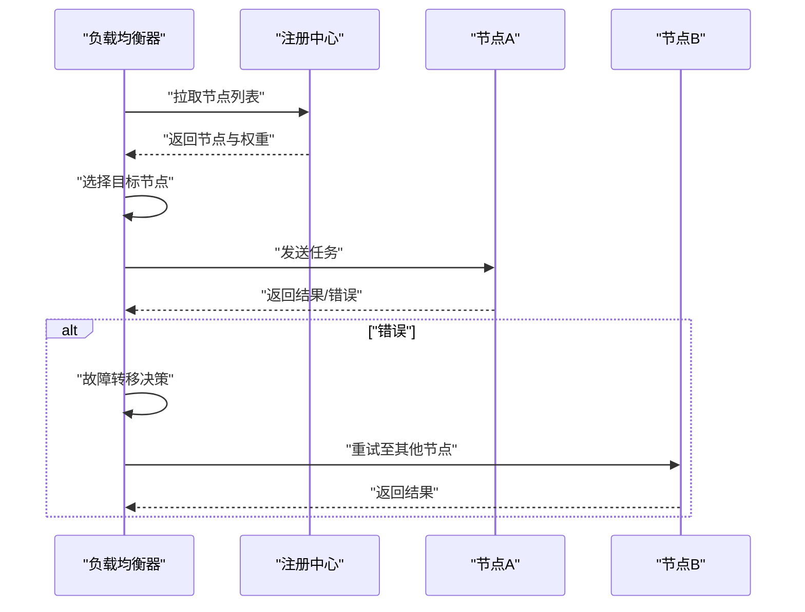

图表来源
- [src/core/load-balancer.ts](file://src/core/load-balancer.ts)

章节来源
- [src/core/load-balancer.ts](file://src/core/load-balancer.ts)

### 指标采集（定义与采集方法）
- 指标分类
  - 资源类：CPU、内存、磁盘 I/O、网络 I/O。
  - 应用类：QPS、P95/P99 延迟、错误率、队列深度。
  - 业务类：预算消耗、配额使用率、限流通过率。
- 采集方法
  - 拉取式：周期性读取运行时状态。
  - 推送式：事件驱动上报关键指标。
  - 采样：对高基数指标进行降采样与聚合。
- 存储与查询
  - 时序数据库：按时间序列存储，支持聚合与回放。
  - 索引与标签：按维度打标，提升查询效率。

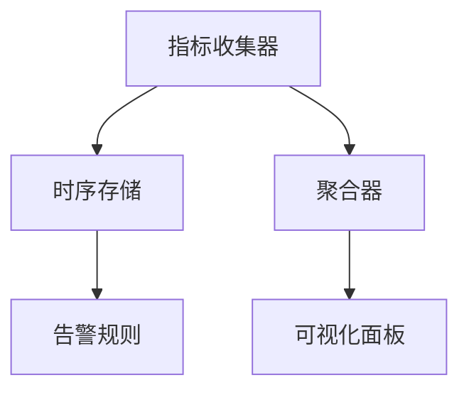

图表来源
- [src/core/metrics-collector.ts](file://src/core/metrics-collector.ts)

章节来源
- [src/core/metrics-collector.ts](file://src/core/metrics-collector.ts)

### 缓存策略（多级缓存与淘汰）
- 设计要点
  - 层级：L1 进程内缓存、L2 共享缓存、L3 持久化缓存。
  - 键空间：命名空间隔离、版本化与失效范围控制。
  - 淘汰：LRU/LFU/TTL 混合策略。
- 关键流程
  - 命中：按层级顺序查找，命中则直接返回。
  - 未命中：回源数据并回填缓存，遵循一致性策略。
- 复杂度与权衡
  - 时间复杂度：查找近似 O(1)，回填涉及远端 IO。
  - 空间复杂度：与缓存容量与命中率相关。
- 可观测性
  - 指标：命中率、延迟、淘汰次数、内存占用。

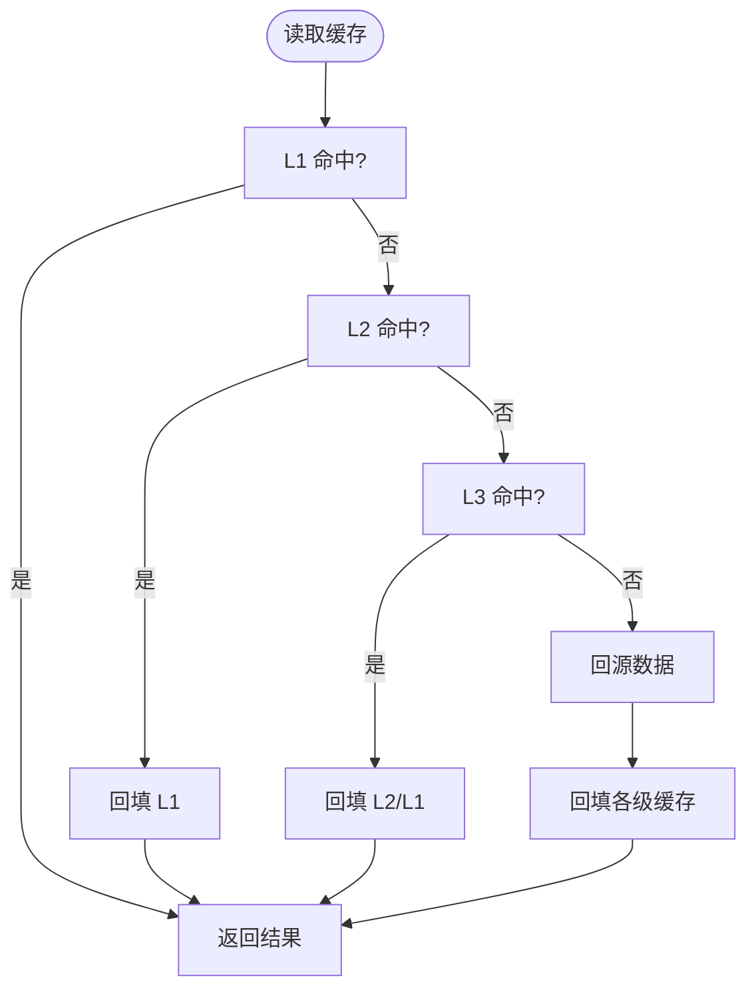

图表来源
- [src/core/cache-manager.ts](file://src/core/cache-manager.ts)

章节来源
- [src/core/cache-manager.ts](file://src/core/cache-manager.ts)

### 垃圾回收优化（阈值与触发）
- 设计要点
  - 阈值调节：根据 RSS 与新生代/老年代比例动态调整。
  - 触发时机：低峰期主动触发，高峰期抑制以减少抖动。
  - 观察反馈：结合 GC 耗时与停顿时长闭环优化。
- 关键流程
  - 监测：采集 GC 事件与内存曲线。
  - 决策：基于规则或简单学习策略决定触发。
  - 执行：安全地触发 GC 并记录效果。
- 复杂度与权衡
  - 时间复杂度：决策逻辑近似 O(1)。
  - 空间复杂度：与历史窗口大小相关。
- 可观测性
  - 指标：GC 次数、停顿时长、回收量、内存水位。

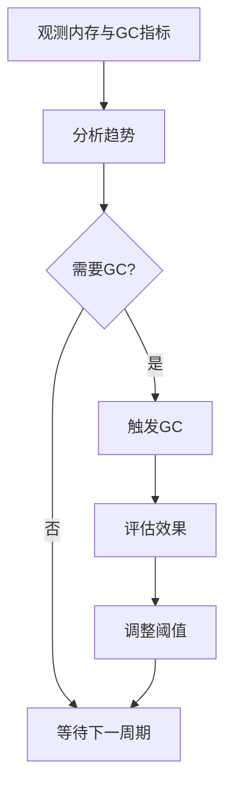

图表来源
- [src/core/gc-optimizer.ts](file://src/core/gc-optimizer.ts)

章节来源
- [src/core/gc-optimizer.ts](file://src/core/gc-optimizer.ts)

## 依赖关系分析
组件间耦合清晰，指标收集作为横切关注点被广泛依赖；预算与限流在任务执行路径上形成串联约束；负载均衡与工作进程池协作完成任务分发。

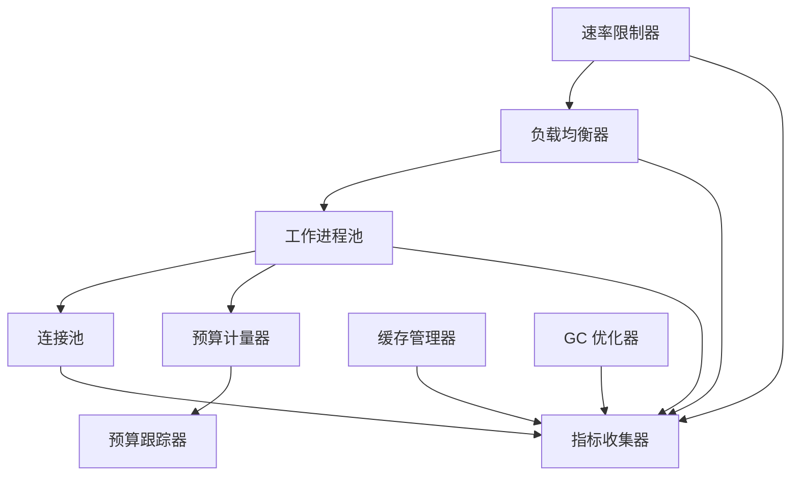

图表来源
- [src/core/rate-limiter.ts](file://src/core/rate-limiter.ts)
- [src/core/load-balancer.ts](file://src/core/load-balancer.ts)
- [src/core/worker-pool.ts](file://src/core/worker-pool.ts)
- [src/core/connection-manager.ts](file://src/core/connection-manager.ts)
- [src/core/budget-meter.ts](file://src/core/budget-meter.ts)
- [src/core/budget-tracker.ts](file://src/core/budget-tracker.ts)
- [src/core/metrics-collector.ts](file://src/core/metrics-collector.ts)
- [src/core/cache-manager.ts](file://src/core/cache-manager.ts)
- [src/core/gc-optimizer.ts](file://src/core/gc-optimizer.ts)

章节来源
- [src/core/rate-limiter.ts](file://src/core/rate-limiter.ts)
- [src/core/load-balancer.ts](file://src/core/load-balancer.ts)
- [src/core/worker-pool.ts](file://src/core/worker-pool.ts)
- [src/core/connection-manager.ts](file://src/core/connection-manager.ts)
- [src/core/budget-meter.ts](file://src/core/budget-meter.ts)
- [src/core/budget-tracker.ts](file://src/core/budget-tracker.ts)
- [src/core/metrics-collector.ts](file://src/core/metrics-collector.ts)
- [src/core/cache-manager.ts](file://src/core/cache-manager.ts)
- [src/core/gc-optimizer.ts](file://src/core/gc-optimizer.ts)

## 性能考虑
- 线程池
  - 合理设置并发度，避免过度竞争导致上下文切换开销增大。
  - 启用任务优先级与批量提交，减少调度开销。
- 连接池
  - 根据下游吞吐与延迟目标设定最大连接数，避免连接风暴。
  - 开启健康检查与快速失败，缩短故障传播时间。
- 预算控制
  - 预扣费粒度要细，避免超额风险；结算需幂等。
  - 结合趋势预测提前限流，防止突刺造成雪崩。
- 速率限制
  - 令牌桶适合突发场景，滑动窗口更平滑；自适应用于动态环境。
  - 拒绝策略配合退避，避免级联失败。
- 负载均衡
  - 健康探测频率与超时需平衡准确性与开销。
  - 失败重试需幂等且带熔断，避免放大故障。
- 缓存
  - 热点数据优先落 L1，减少远端访问；合理设置 TTL 与淘汰策略。
  - 注意缓存穿透与雪崩防护。
- GC 优化
  - 在高负载期间抑制 GC，低峰期主动回收；关注停顿时长与吞吐折中。

[本节为通用指导，无需具体文件引用]

## 故障排查指南
- 常见问题定位
  - 任务堆积：检查队列长度、进程健康与背压策略。
  - 连接耗尽：查看连接池最大数、空闲回收与健康检查。
  - 预算超限：核对预算窗口、配额与熔断状态。
  - 限流过严：评估算法参数与自适应系数。
  - 负载不均：观察节点健康与权重配置。
- 诊断手段
  - 指标看板：关注 P95/P99 延迟、错误率与资源水位。
  - 日志追踪：关联任务 ID 与节点信息，定位慢路径。
  - 压测回归：复现问题并验证修复效果。

章节来源
- [src/core/worker-pool.ts](file://src/core/worker-pool.ts)
- [src/core/connection-manager.ts](file://src/core/connection-manager.ts)
- [src/core/budget-meter.ts](file://src/core/budget-meter.ts)
- [src/core/budget-tracker.ts](file://src/core/budget-tracker.ts)
- [src/core/rate-limiter.ts](file://src/core/rate-limiter.ts)
- [src/core/load-balancer.ts](file://src/core/load-balancer.ts)
- [src/core/metrics-collector.ts](file://src/core/metrics-collector.ts)

## 结论
通过统一的资源池管理、严格的预算控制、灵活的速率限制与健壮的负载均衡，系统在吞吐、延迟与稳定性之间取得良好平衡。配合完善的指标采集与性能调优手段，可在复杂生产环境中持续优化资源利用与用户体验。

[本节为总结性内容，无需具体文件引用]

## 附录
- 术语
  - 预算：可用于某周期内的成本上限。
  - 配额：针对租户或任务的资源使用额度。
  - 自适应限流：根据运行态指标动态调整限流阈值。
- 参考配置项（示例）
  - 线程池：并发度、队列容量、超时、重试次数。
  - 连接池：最大连接数、空闲超时、健康检查间隔。
  - 预算：周期、软/硬限额、熔断阈值。
  - 限流：令牌速率、桶容量、窗口大小、自适应系数。
  - 负载均衡：权重、健康探测间隔、失败重试策略。
  - 缓存：层级、TTL、淘汰策略、一致性级别。
  - GC：阈值、触发窗口、抑制条件。

[本节为概念性说明，无需具体文件引用]