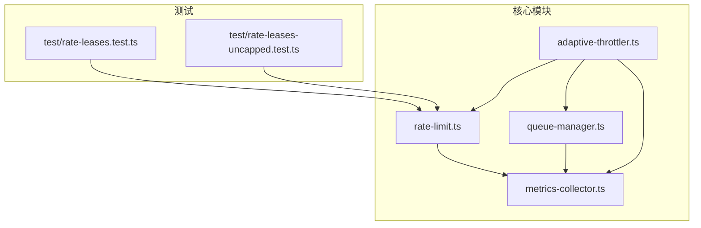
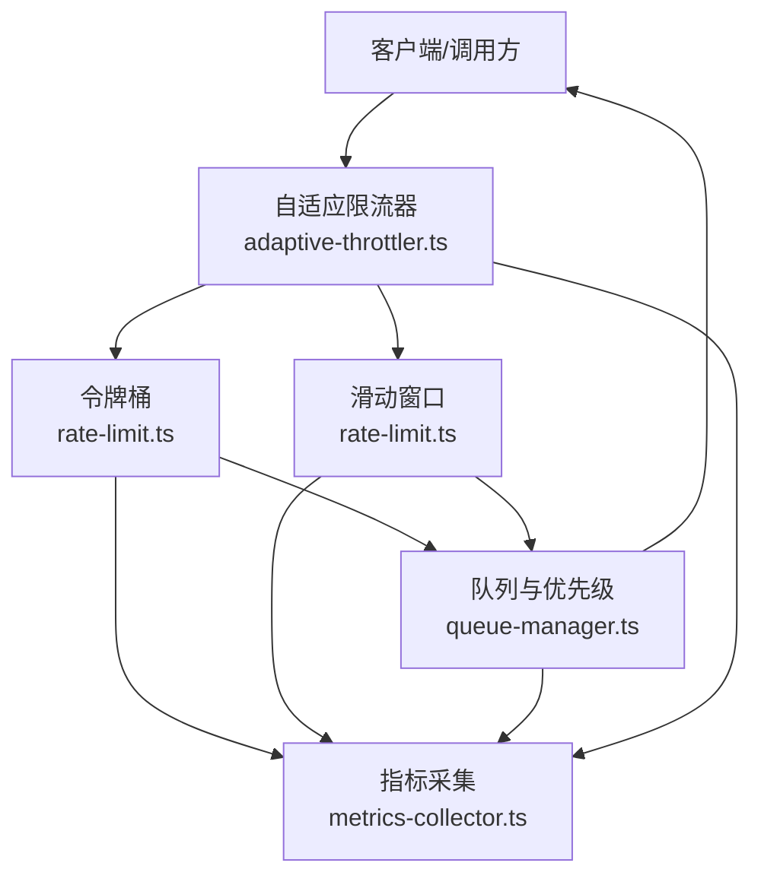
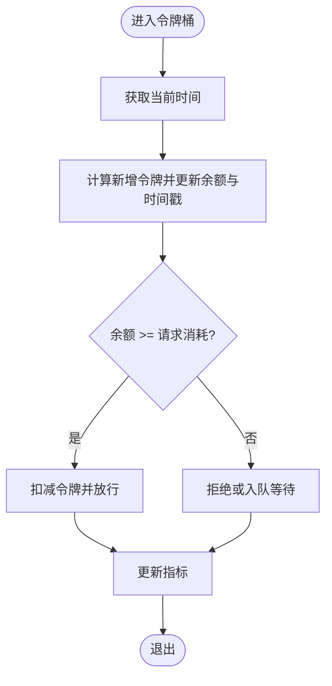
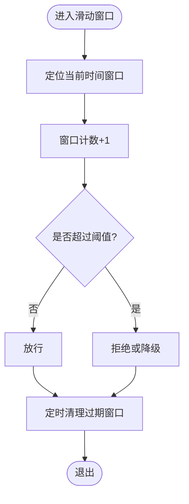
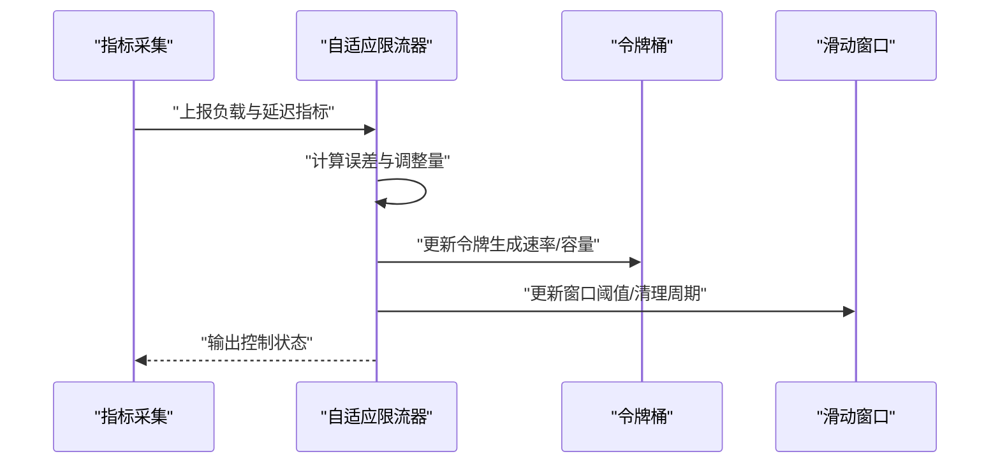
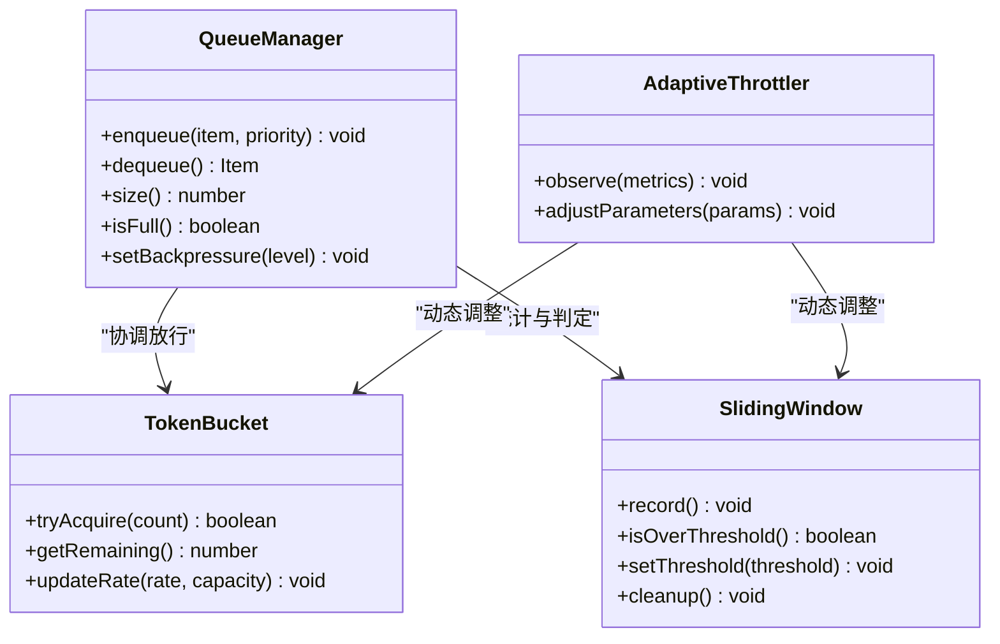
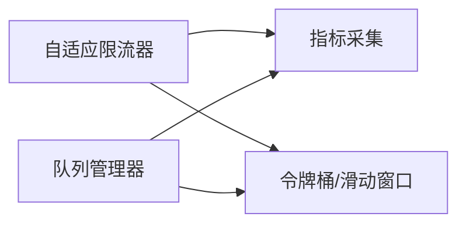

# 速率限制机制

<cite>
**本文引用的文件**   
- [src/core/rate-limit.ts](file://src/core/rate-limit.ts)
- [src/core/queue-manager.ts](file://src/core/queue-manager.ts)
- [src/core/adaptive-throttler.ts](file://src/core/adaptive-throttler.ts)
- [src/core/metrics-collector.ts](file://src/core/metrics-collector.ts)
- [test/rate-leases.test.ts](file://test/rate-leases.test.ts)
- [test/rate-leases-uncapped.test.ts](file://test/rate-leases-uncapped.test.ts)
</cite>

## 目录
1. [简介](#简介)
2. [项目结构](#项目结构)
3. [核心组件](#核心组件)
4. [架构总览](#架构总览)
5. [详细组件分析](#详细组件分析)
6. [依赖关系分析](#依赖关系分析)
7. [性能考量](#性能考量)
8. [故障排查指南](#故障排查指南)
9. [结论](#结论)
10. [附录](#附录)

## 简介
本文件系统性梳理仓库中的速率限制机制，覆盖令牌桶算法、滑动窗口算法、自适应限流策略与并发控制。文档面向不同技术背景的读者，提供从概念到实现细节的渐进式说明，并给出配置参数、监控指标与优化建议，帮助在生产环境中稳定、可控地管理请求吞吐与资源占用。

## 项目结构
与速率限制相关的核心代码位于 src/core 目录下，测试用例位于 test 目录。整体组织遵循“按功能域”划分：
- 令牌桶与滑动窗口：rate-limit.ts
- 队列调度与优先级：queue-manager.ts
- 自适应限流：adaptive-throttler.ts
- 指标采集：metrics-collector.ts
- 行为验证：test/rate-leases*.ts

图表来源
- [src/core/rate-limit.ts](file://src/core/rate-limit.ts)
- [src/core/queue-manager.ts](file://src/core/queue-manager.ts)
- [src/core/adaptive-throttler.ts](file://src/core/adaptive-throttler.ts)
- [src/core/metrics-collector.ts](file://src/core/metrics-collector.ts)
- [test/rate-leases.test.ts](file://test/rate-leases.test.ts)
- [test/rate-leases-uncapped.test.ts](file://test/rate-leases-uncapped.test.ts)

章节来源
- [src/core/rate-limit.ts](file://src/core/rate-limit.ts)
- [src/core/queue-manager.ts](file://src/core/queue-manager.ts)
- [src/core/adaptive-throttler.ts](file://src/core/adaptive-throttler.ts)
- [src/core/metrics-collector.ts](file://src/core/metrics-collector.ts)
- [test/rate-leases.test.ts](file://test/rate-leases.test.ts)
- [test/rate-leases-uncapped.test.ts](file://test/rate-leases-uncapped.test.ts)

## 核心组件
- 令牌桶（Token Bucket）
  - 负责以固定速率生成令牌，支持容量上限与突发处理。
  - 关键能力：令牌生成速率、容量限制、突发允许度、时间推进与惰性更新。
- 滑动窗口（Sliding Window）
  - 基于时间窗口的计数统计，用于平滑限流与趋势感知。
  - 关键能力：窗口管理、计数器维护、过期清理与聚合统计。
- 自适应限流（Adaptive Throttling）
  - 根据系统负载与外部约束动态调整限速策略。
  - 关键能力：负载感知、反馈控制、动态阈值与回退策略。
- 并发控制（Concurrency Control）
  - 通过锁管理、队列调度与优先级处理保障并发安全与公平性。
  - 关键能力：互斥锁、有界队列、优先级队列、背压与超时。
- 指标采集（Metrics Collection）
  - 采集限流相关指标，支撑可观测性与调优。
  - 关键能力：QPS、拒绝率、延迟分位、令牌余额、窗口计数等。

章节来源
- [src/core/rate-limit.ts](file://src/core/rate-limit.ts)
- [src/core/queue-manager.ts](file://src/core/queue-manager.ts)
- [src/core/adaptive-throttler.ts](file://src/core/adaptive-throttler.ts)
- [src/core/metrics-collector.ts](file://src/core/metrics-collector.ts)

## 架构总览
下图展示了各组件之间的交互关系与数据流向。自适应层作为上层控制器，依据指标与负载信号调节令牌桶与滑动窗口的参数；令牌桶与滑动窗口共同决定放行或拒绝；队列管理器在需要时进行排队与优先级调度；指标采集贯穿全链路，为自适应决策提供输入。

图表来源
- [src/core/adaptive-throttler.ts](file://src/core/adaptive-throttler.ts)
- [src/core/rate-limit.ts](file://src/core/rate-limit.ts)
- [src/core/queue-manager.ts](file://src/core/queue-manager.ts)
- [src/core/metrics-collector.ts](file://src/core/metrics-collector.ts)

## 详细组件分析

### 令牌桶算法（Token Bucket）
- 设计要点
  - 令牌生成速率：单位时间内新增令牌数量，决定长期吞吐上限。
  - 容量限制：令牌桶最大容量，限制突发规模。
  - 突发处理：当桶中有足够令牌时，允许短时突发超过平均速率。
  - 惰性更新：仅在访问时推进时间并计算新增令牌，降低开销。
- 并发安全
  - 使用细粒度锁保护令牌余额与时间戳，避免竞态条件。
  - 批量扣减时采用原子操作或临界区，确保一致性。
- 复杂度
  - 单次申请：O(1) 时间与空间。
  - 批量申请：O(k)，k 为请求数。
- 典型流程
  - 进入：读取当前时间与上次更新时间，计算应补充令牌数，更新余额与时间戳。
  - 判断：若余额大于等于请求消耗，则放行并扣减；否则拒绝或排队。
  - 记录：更新指标（如剩余令牌、拒绝次数）。

图表来源
- [src/core/rate-limit.ts](file://src/core/rate-limit.ts)

章节来源
- [src/core/rate-limit.ts](file://src/core/rate-limit.ts)

### 滑动窗口算法（Sliding Window）
- 设计要点
  - 时间窗口管理：将时间划分为固定或滑动的区间，维护每个区间的计数。
  - 计数器维护：对进入与离开窗口的请求进行增减，保持窗口内总数准确。
  - 过期清理：定期清理过期窗口项，防止内存增长。
- 并发安全
  - 使用读写锁或分段锁减少竞争，提升高并发下的吞吐。
  - 增量更新与批量清理分离，避免长事务阻塞。
- 复杂度
  - 单点查询：O(1) 均摊（配合哈希索引）。
  - 清理任务：O(n)，n 为过期窗口数量。
- 典型流程
  - 进入：定位当前窗口，增加计数。
  - 判断：若窗口计数超过阈值，则拒绝或降级。
  - 清理：后台任务移除过期窗口项。

图表来源
- [src/core/rate-limit.ts](file://src/core/rate-limit.ts)

章节来源
- [src/core/rate-limit.ts](file://src/core/rate-limit.ts)

### 自适应限流策略（Adaptive Throttling）
- 设计要点
  - 负载感知：采集系统负载（CPU、内存、I/O）、下游延迟与错误率。
  - 动态调整：基于反馈控制（如PID思想）调整令牌桶速率与滑动窗口阈值。
  - 回退策略：在异常或过载时快速降速，恢复后逐步回升。
- 控制回路
  - 测量：周期性采样指标。
  - 比较：与目标阈值对比，计算误差。
  - 调整：根据误差与历史变化调整参数。
  - 执行：下发新参数至令牌桶与滑动窗口。
- 稳定性
  - 引入迟滞与最小步长，避免频繁震荡。
  - 设置上下限与安全边界，防止极端调整。

图表来源
- [src/core/adaptive-throttler.ts](file://src/core/adaptive-throttler.ts)
- [src/core/rate-limit.ts](file://src/core/rate-limit.ts)
- [src/core/metrics-collector.ts](file://src/core/metrics-collector.ts)

章节来源
- [src/core/adaptive-throttler.ts](file://src/core/adaptive-throttler.ts)
- [src/core/metrics-collector.ts](file://src/core/metrics-collector.ts)

### 并发控制机制（锁管理、队列调度、优先级）
- 锁管理
  - 使用互斥锁保护共享状态（令牌余额、窗口计数），避免写冲突。
  - 读多写少场景下可采用读写锁，提高并发读性能。
- 队列调度
  - 有界队列承载被拒绝的请求，结合背压策略控制上游压力。
  - 支持超时与重试，避免无限堆积。
- 优先级处理
  - 高优先级请求优先获得令牌或更快出队。
  - 低优先级请求在拥塞时更容易被丢弃或延后。
- 公平性与饥饿避免
  - 引入公平队列或轮转策略，防止低优先级长期饥饿。

图表来源
- [src/core/queue-manager.ts](file://src/core/queue-manager.ts)
- [src/core/rate-limit.ts](file://src/core/rate-limit.ts)
- [src/core/adaptive-throttler.ts](file://src/core/adaptive-throttler.ts)

章节来源
- [src/core/queue-manager.ts](file://src/core/queue-manager.ts)
- [src/core/rate-limit.ts](file://src/core/rate-limit.ts)
- [src/core/adaptive-throttler.ts](file://src/core/adaptive-throttler.ts)

## 依赖关系分析
- 组件耦合
  - 自适应限流器依赖指标采集与限流器（令牌桶/滑动窗口）。
  - 队列管理器依赖限流器结果进行调度与优先级排序。
  - 指标采集独立于业务逻辑，便于替换与扩展。
- 潜在循环依赖
  - 通过接口抽象与事件驱动解耦，避免直接循环引用。
- 外部依赖
  - 时间源、锁原语、队列数据结构、指标后端（如日志或遥测系统）。

图表来源
- [src/core/adaptive-throttler.ts](file://src/core/adaptive-throttler.ts)
- [src/core/rate-limit.ts](file://src/core/rate-limit.ts)
- [src/core/queue-manager.ts](file://src/core/queue-manager.ts)
- [src/core/metrics-collector.ts](file://src/core/metrics-collector.ts)

章节来源
- [src/core/adaptive-throttler.ts](file://src/core/adaptive-throttler.ts)
- [src/core/rate-limit.ts](file://src/core/rate-limit.ts)
- [src/core/queue-manager.ts](file://src/core/queue-manager.ts)
- [src/core/metrics-collector.ts](file://src/core/metrics-collector.ts)

## 性能考量
- 令牌桶
  - 惰性更新避免无请求时的无效计算。
  - 批量扣减合并多次锁持有，降低锁竞争。
- 滑动窗口
  - 使用哈希映射加速窗口定位。
  - 异步清理过期项，避免阻塞主路径。
- 自适应限流
  - 采样频率与调整步长需权衡响应速度与稳定性。
  - 引入迟滞与最小步长，抑制抖动。
- 队列与优先级
  - 有界队列长度与背压阈值需结合下游处理能力设定。
  - 优先级队列使用堆结构，保证 O(log n) 插入与弹出。
- 指标采集
  - 局部聚合与采样降低写入开销。
  - 异步上报，避免影响主流程。

[本节为通用性能指导，不直接分析具体文件]

## 故障排查指南
- 常见问题
  - 令牌不足导致大量拒绝：检查令牌生成速率与容量配置，观察指标中剩余令牌与拒绝率。
  - 滑动窗口误判：确认窗口大小与阈值设置，检查清理任务是否正常执行。
  - 自适应震荡：调整迟滞与最小步长，降低采样频率或增大调整周期。
  - 队列堆积：扩大队列容量或增强下游处理能力，启用更激进的背压。
- 诊断步骤
  - 查看指标：QPS、拒绝率、延迟分位、令牌余额、窗口计数。
  - 核对配置：令牌速率、容量、窗口阈值、清理周期、队列长度。
  - 复现实验：在测试环境模拟峰值流量，观察自适应调整效果。
- 参考测试
  - 行为验证用例有助于理解正常与异常路径。

章节来源
- [test/rate-leases.test.ts](file://test/rate-leases.test.ts)
- [test/rate-leases-uncapped.test.ts](file://test/rate-leases-uncapped.test.ts)

## 结论
本速率限制机制通过令牌桶与滑动窗口的组合，结合自适应控制与并发调度，实现了在高并发场景下的稳定吞吐与弹性伸缩。合理的配置与持续的指标观测是保障系统健壮性的关键。建议在上线前完成容量规划与压测，并在运行期持续优化参数与策略。

[本节为总结性内容，不直接分析具体文件]

## 附录

### 配置参数清单（示例）
- 令牌桶
  - 令牌生成速率：每秒新增令牌数
  - 容量上限：最大令牌数
  - 突发系数：允许超出平均速率的倍数
- 滑动窗口
  - 窗口时长：统计时间跨度
  - 阈值：窗口内最大允许请求数
  - 清理间隔：过期项清理周期
- 自适应限流
  - 目标延迟：期望延迟分位
  - 负载阈值：触发降速的负载指标
  - 调整步长：每次调整的幅度
  - 迟滞带：避免频繁切换的缓冲区间
- 队列与优先级
  - 队列容量：最大排队数
  - 优先级权重：高/中/低优先级比例
  - 超时时间：排队最长等待时间
  - 背压级别：触发上游减速的阈值

[本节为通用配置说明，不直接分析具体文件]

### 监控指标清单（示例）
- 令牌桶：剩余令牌、累计发放、累计拒绝、更新次数
- 滑动窗口：窗口计数、阈值命中次数、清理次数
- 自适应：调整次数、误差均值、控制输出
- 队列：入队/出队速率、堆积深度、超时丢弃数
- 端到端：QPS、P95/P99 延迟、错误率

[本节为通用指标说明，不直接分析具体文件]