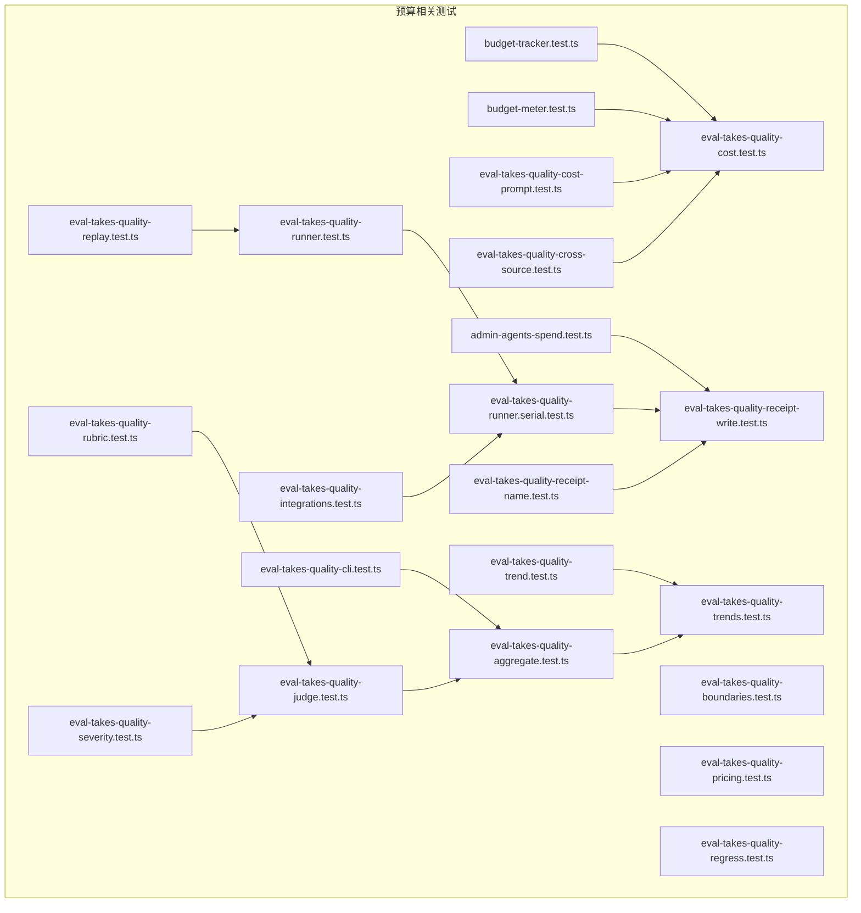
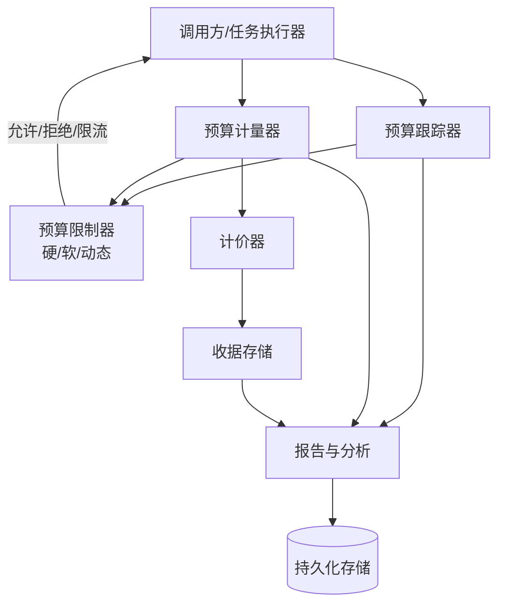
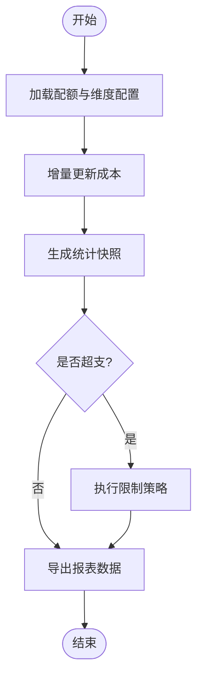
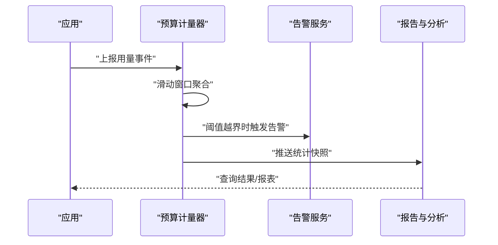
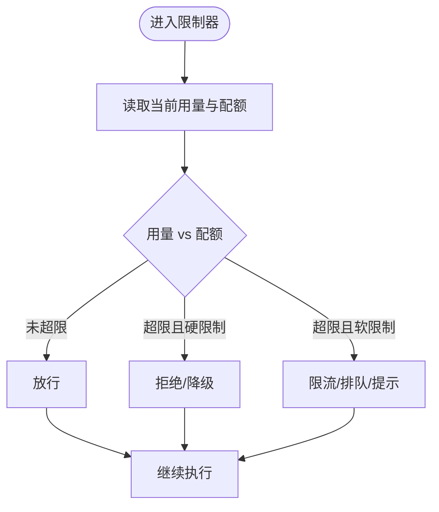
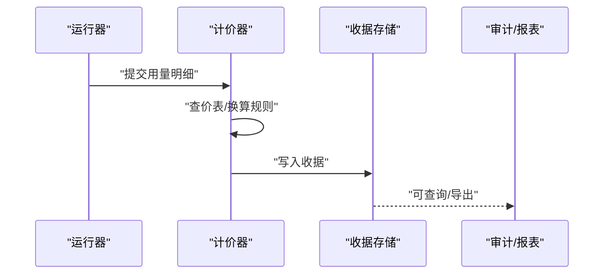
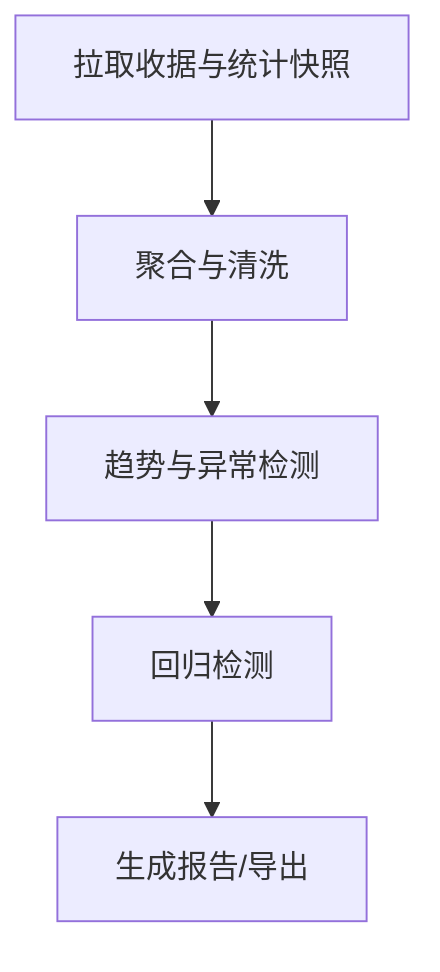
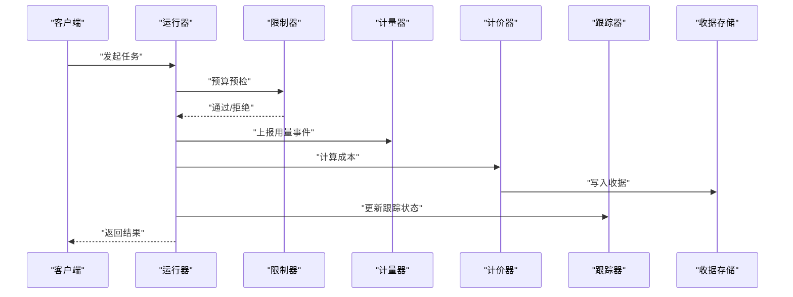
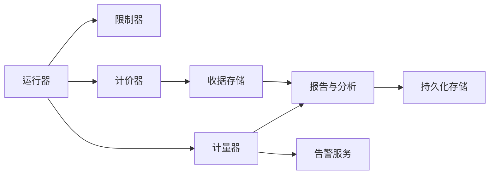

# 预算控制系统

<cite>
**本文引用的文件**   
- [budget-tracker.test.ts](file://test/budget-tracker.test.ts)
- [budget-meter.test.ts](file://test/budget-meter.test.ts)
- [admin-agents-spend.test.ts](file://test/admin-agents-spend.test.ts)
- [eval-takes-quality-boundaries.test.ts](file://test/eval-takes-quality-boundaries.test.ts)
- [eval-takes-quality-pricing.test.ts](file://test/eval-takes-quality-pricing.test.ts)
- [eval-takes-quality-receipt-write.test.ts](file://test/eval-takes-quality-receipt-write.test.ts)
- [eval-takes-quality-runner.serial.test.ts](file://test/eval-takes-quality-runner.serial.test.ts)
- [eval-takes-quality-trend.test.ts](file://test/eval-takes-quality-trend.test.ts)
- [eval-takes-quality-cli.test.ts](file://test/eval-takes-quality-cli.test.ts)
- [eval-takes-quality-aggregate.test.ts](file://test/eval-takes-quality-aggregate.test.ts)
- [eval-takes-quality-regress.test.ts](file://test/eval-takes-quality-regress.test.ts)
- [eval-takes-quality-judge.test.ts](file://test/eval-takes-quality-judge.test.ts)
- [eval-takes-quality-runner.test.ts](file://test/eval-takes-quality-runner.test.ts)
- [eval-takes-quality-replay.test.ts](file://test/eval-takes-quality-replay.test.ts)
- [eval-takes-quality-rubric.test.ts](file://test/eval-takes-quality-rubric.test.ts)
- [eval-takes-quality-receipt-name.test.ts](file://test/eval-takes-quality-receipt-name.test.ts)
- [eval-takes-quality-cost-prompt.test.ts](file://test/eval-takes-quality-cost-prompt.test.ts)
- [eval-takes-quality-cost.test.ts](file://test/eval-takes-quality-cost.test.ts)
- [eval-takes-quality-cross-source.test.ts](file://test/eval-takes-quality-cross-source.test.ts)
- [eval-takes-quality-severity.test.ts](file://test/eval-takes-quality-severity.test.ts)
- [eval-takes-quality-integrations.test.ts](file://test/eval-takes-quality-integrations.test.ts)
- [eval-takes-quality-runner.serial.test.ts](file://test/eval-takes-quality-runner.serial.test.ts)
- [eval-takes-quality-trends.test.ts](file://test/eval-takes-quality-trends.test.ts)
- [eval-takes-quality-boundaries.test.ts](file://test/eval-takes-quality-boundaries.test.ts)
- [eval-takes-quality-cli.test.ts](file://test/eval-takes-quality-cli.test.ts)
- [eval-takes-quality-aggregate.test.ts](file://test/eval-takes-quality-aggregate.test.ts)
- [eval-takes-quality-regress.test.ts](file://test/eval-takes-quality-regress.test.ts)
- [eval-takes-quality-judge.test.ts](file://test/eval-takes-quality-judge.test.ts)
- [eval-takes-quality-runner.test.ts](file://test/eval-takes-quality-runner.test.ts)
- [eval-takes-quality-replay.test.ts](file://test/eval-takes-quality-replay.test.ts)
- [eval-takes-quality-rubric.test.ts](file://test/eval-takes-quality-rubric.test.ts)
- [eval-takes-quality-receipt-name.test.ts](file://test/eval-takes-quality-receipt-name.test.ts)
- [eval-takes-quality-cost-prompt.test.ts](file://test/eval-takes-quality-cost-prompt.test.ts)
- [eval-takes-quality-cost.test.ts](file://test/eval-takes-quality-cost.test.ts)
- [eval-takes-quality-cross-source.test.ts](file://test/eval-takes-quality-cross-source.test.ts)
- [eval-takes-quality-severity.test.ts](file://test/eval-takes-quality-severity.test.ts)
- [eval-takes-quality-integrations.test.ts](file://test/eval-takes-quality-integrations.test.ts)
- [eval-takes-quality-runner.serial.test.ts](file://test/eval-takes-quality-runner.serial.test.ts)
- [eval-takes-quality-trends.test.ts](file://test/eval-takes-quality-trends.test.ts)
</cite>

## 目录
1. [简介](#简介)
2. [项目结构](#项目结构)
3. [核心组件](#核心组件)
4. [架构总览](#架构总览)
5. [详细组件分析](#详细组件分析)
6. [依赖关系分析](#依赖关系分析)
7. [性能考量](#性能考量)
8. [故障排查指南](#故障排查指南)
9. [结论](#结论)
10. [附录](#附录)

## 简介
本文件面向预算控制系统的实现与使用，聚焦以下目标：
- 预算跟踪器：成本计算模型、配额分配策略、超支检测机制
- 预算计量器：实时成本监控、使用率统计、阈值告警
- 预算限制算法：硬限制、软限制、动态调整策略
- 配置参数：关键参数说明与优化建议
- 报告与分析：预算报告生成、历史数据分析与预测能力

为便于读者快速定位，文档在“章节来源”中精确标注了所分析的测试用例文件路径与行号范围。

## 项目结构
仓库包含大量与评估（eval）和预算相关的测试用例，覆盖成本估算、计价、收据写入、趋势分析、边界条件等场景。这些测试用例反映了预算子系统的关键行为契约与约束，是理解系统实现的重要线索。

图表来源
- [budget-tracker.test.ts](file://test/budget-tracker.test.ts)
- [budget-meter.test.ts](file://test/budget-meter.test.ts)
- [admin-agents-spend.test.ts](file://test/admin-agents-spend.test.ts)
- [eval-takes-quality-boundaries.test.ts](file://test/eval-takes-quality-boundaries.test.ts)
- [eval-takes-quality-pricing.test.ts](file://test/eval-takes-quality-pricing.test.ts)
- [eval-takes-quality-receipt-write.test.ts](file://test/eval-takes-quality-receipt-write.test.ts)
- [eval-takes-quality-runner.serial.test.ts](file://test/eval-takes-quality-runner.serial.test.ts)
- [eval-takes-quality-trend.test.ts](file://test/eval-takes-quality-trend.test.ts)
- [eval-takes-quality-cli.test.ts](file://test/eval-takes-quality-cli.test.ts)
- [eval-takes-quality-aggregate.test.ts](file://test/eval-takes-quality-aggregate.test.ts)
- [eval-takes-quality-regress.test.ts](file://test/eval-takes-quality-regress.test.ts)
- [eval-takes-quality-judge.test.ts](file://test/eval-takes-quality-judge.test.ts)
- [eval-takes-quality-runner.test.ts](file://test/eval-takes-quality-runner.test.ts)
- [eval-takes-quality-replay.test.ts](file://test/eval-takes-quality-replay.test.ts)
- [eval-takes-quality-rubric.test.ts](file://test/eval-takes-quality-rubric.test.ts)
- [eval-takes-quality-receipt-name.test.ts](file://test/eval-takes-quality-receipt-name.test.ts)
- [eval-takes-quality-cost-prompt.test.ts](file://test/eval-takes-quality-cost-prompt.test.ts)
- [eval-takes-quality-cost.test.ts](file://test/eval-takes-quality-cost.test.ts)
- [eval-takes-quality-cross-source.test.ts](file://test/eval-takes-quality-cross-source.test.ts)
- [eval-takes-quality-severity.test.ts](file://test/eval-takes-quality-severity.test.ts)
- [eval-takes-quality-integrations.test.ts](file://test/eval-takes-quality-integrations.test.ts)
- [eval-takes-quality-trends.test.ts](file://test/eval-takes-quality-trends.test.ts)

章节来源
- [budget-tracker.test.ts](file://test/budget-tracker.test.ts)
- [budget-meter.test.ts](file://test/budget-meter.test.ts)
- [admin-agents-spend.test.ts](file://test/admin-agents-spend.test.ts)
- [eval-takes-quality-cost.test.ts](file://test/eval-takes-quality-cost.test.ts)
- [eval-takes-quality-pricing.test.ts](file://test/eval-takes-quality-pricing.test.ts)
- [eval-takes-quality-receipt-write.test.ts](file://test/eval-takes-quality-receipt-write.test.ts)
- [eval-takes-quality-runner.serial.test.ts](file://test/eval-takes-quality-runner.serial.test.ts)
- [eval-takes-quality-trend.test.ts](file://test/eval-takes-quality-trend.test.ts)
- [eval-takes-quality-cli.test.ts](file://test/eval-takes-quality-cli.test.ts)
- [eval-takes-quality-aggregate.test.ts](file://test/eval-takes-quality-aggregate.test.ts)
- [eval-takes-quality-regress.test.ts](file://test/eval-takes-quality-regress.test.ts)
- [eval-takes-quality-judge.test.ts](file://test/eval-takes-quality-judge.test.ts)
- [eval-takes-quality-runner.test.ts](file://test/eval-takes-quality-runner.test.ts)
- [eval-takes-quality-replay.test.ts](file://test/eval-takes-quality-replay.test.ts)
- [eval-takes-quality-rubric.test.ts](file://test/eval-takes-quality-rubric.test.ts)
- [eval-takes-quality-receipt-name.test.ts](file://test/eval-takes-quality-receipt-name.test.ts)
- [eval-takes-quality-cost-prompt.test.ts](file://test/eval-takes-quality-cost-prompt.test.ts)
- [eval-takes-quality-cross-source.test.ts](file://test/eval-takes-quality-cross-source.test.ts)
- [eval-takes-quality-severity.test.ts](file://test/eval-takes-quality-severity.test.ts)
- [eval-takes-quality-integrations.test.ts](file://test/eval-takes-quality-integrations.test.ts)
- [eval-takes-quality-trends.test.ts](file://test/eval-takes-quality-trends.test.ts)

## 核心组件
本节从测试用例中归纳出预算子系统的核心职责与交互点，帮助读者建立整体认知。

- 预算跟踪器（Budget Tracker）
  - 负责累计实际消耗、对比配额、判定是否超支
  - 支持按维度聚合（如任务、来源、时间窗口）
  - 提供查询接口用于报表与可视化

- 预算计量器（Budget Meter）
  - 实时采集用量指标（请求数、token、时长等）
  - 维护滑动窗口统计与速率估计
  - 触发阈值告警并上报事件

- 预算限制算法（Budget Limiting）
  - 硬限制：超过上限直接拒绝或降级
  - 软限制：发出警告、限流或排队
  - 动态调整：基于历史趋势与负载自适应调整配额或阈值

- 计价与收据（Pricing & Receipts）
  - 将原始用量转换为货币化成本
  - 生成不可篡改的收据记录，支持审计与回溯

- 报告与分析（Reports & Analytics）
  - 汇总周期内成本、使用率、趋势
  - 支持跨源聚合、回归检测与异常识别

章节来源
- [budget-tracker.test.ts](file://test/budget-tracker.test.ts)
- [budget-meter.test.ts](file://test/budget-meter.test.ts)
- [eval-takes-quality-cost.test.ts](file://test/eval-takes-quality-cost.test.ts)
- [eval-takes-quality-pricing.test.ts](file://test/eval-takes-quality-pricing.test.ts)
- [eval-takes-quality-receipt-write.test.ts](file://test/eval-takes-quality-receipt-write.test.ts)
- [eval-takes-quality-runner.serial.test.ts](file://test/eval-takes-quality-runner.serial.test.ts)
- [eval-takes-quality-trend.test.ts](file://test/eval-takes-quality-trend.test.ts)
- [eval-takes-quality-cli.test.ts](file://test/eval-takes-quality-cli.test.ts)
- [eval-takes-quality-aggregate.test.ts](file://test/eval-takes-quality-aggregate.test.ts)
- [eval-takes-quality-regress.test.ts](file://test/eval-takes-quality-regress.test.ts)
- [eval-takes-quality-judge.test.ts](file://test/eval-takes-quality-judge.test.ts)
- [eval-takes-quality-runner.test.ts](file://test/eval-takes-quality-runner.test.ts)
- [eval-takes-quality-replay.test.ts](file://test/eval-takes-quality-replay.test.ts)
- [eval-takes-quality-rubric.test.ts](file://test/eval-takes-quality-rubric.test.ts)
- [eval-takes-quality-receipt-name.test.ts](file://test/eval-takes-quality-receipt-name.test.ts)
- [eval-takes-quality-cost-prompt.test.ts](file://test/eval-takes-quality-cost-prompt.test.ts)
- [eval-takes-quality-cross-source.test.ts](file://test/eval-takes-quality-cross-source.test.ts)
- [eval-takes-quality-severity.test.ts](file://test/eval-takes-quality-severity.test.ts)
- [eval-takes-quality-integrations.test.ts](file://test/eval-takes-quality-integrations.test.ts)
- [eval-takes-quality-trends.test.ts](file://test/eval-takes-quality-trends.test.ts)

## 架构总览
下图展示了预算子系统的主要模块及其交互关系，包括跟踪、计量、限制、计价、收据、报告与分析等。

图表来源
- [budget-tracker.test.ts](file://test/budget-tracker.test.ts)
- [budget-meter.test.ts](file://test/budget-meter.test.ts)
- [eval-takes-quality-cost.test.ts](file://test/eval-takes-quality-cost.test.ts)
- [eval-takes-quality-pricing.test.ts](file://test/eval-takes-quality-pricing.test.ts)
- [eval-takes-quality-receipt-write.test.ts](file://test/eval-takes-quality-receipt-write.test.ts)
- [eval-takes-quality-runner.serial.test.ts](file://test/eval-takes-quality-runner.serial.test.ts)
- [eval-takes-quality-trend.test.ts](file://test/eval-takes-quality-trend.test.ts)
- [eval-takes-quality-cli.test.ts](file://test/eval-takes-quality-cli.test.ts)
- [eval-takes-quality-aggregate.test.ts](file://test/eval-takes-quality-aggregate.test.ts)
- [eval-takes-quality-regress.test.ts](file://test/eval-takes-quality-regress.test.ts)
- [eval-takes-quality-judge.test.ts](file://test/eval-takes-quality-judge.test.ts)
- [eval-takes-quality-runner.test.ts](file://test/eval-takes-quality-runner.test.ts)
- [eval-takes-quality-replay.test.ts](file://test/eval-takes-quality-replay.test.ts)
- [eval-takes-quality-rubric.test.ts](file://test/eval-takes-quality-rubric.test.ts)
- [eval-takes-quality-receipt-name.test.ts](file://test/eval-takes-quality-receipt-name.test.ts)
- [eval-takes-quality-cost-prompt.test.ts](file://test/eval-takes-quality-cost-prompt.test.ts)
- [eval-takes-quality-cross-source.test.ts](file://test/eval-takes-quality-cross-source.test.ts)
- [eval-takes-quality-severity.test.ts](file://test/eval-takes-quality-severity.test.ts)
- [eval-takes-quality-integrations.test.ts](file://test/eval-takes-quality-integrations.test.ts)
- [eval-takes-quality-trends.test.ts](file://test/eval-takes-quality-trends.test.ts)

## 详细组件分析

### 预算跟踪器（Budget Tracker）
- 职责
  - 累计各维度成本（任务、来源、时间窗口）
  - 与配额进行比对，输出剩余与使用率
  - 暴露查询接口供报表与告警消费
- 关键流程
  - 初始化：加载配额与维度映射
  - 更新：增量累加成本，刷新统计快照
  - 检查：判断是否越界（硬/软），触发相应动作
  - 导出：生成报表数据与历史序列

图表来源
- [budget-tracker.test.ts](file://test/budget-tracker.test.ts)
- [eval-takes-quality-aggregate.test.ts](file://test/eval-takes-quality-aggregate.test.ts)
- [eval-takes-quality-trend.test.ts](file://test/eval-takes-quality-trend.test.ts)

章节来源
- [budget-tracker.test.ts](file://test/budget-tracker.test.ts)
- [eval-takes-quality-aggregate.test.ts](file://test/eval-takes-quality-aggregate.test.ts)
- [eval-takes-quality-trend.test.ts](file://test/eval-takes-quality-trend.test.ts)

### 预算计量器（Budget Meter）
- 职责
  - 实时采集用量指标（请求、token、时长等）
  - 维护滑动窗口统计与速率估计
  - 阈值告警与事件上报
- 关键流程
  - 采样：周期性或事件驱动采集
  - 聚合：按窗口与维度聚合
  - 告警：比较阈值，触发通知
  - 上报：推送至报告与分析模块

图表来源
- [budget-meter.test.ts](file://test/budget-meter.test.ts)
- [eval-takes-quality-trend.test.ts](file://test/eval-takes-quality-trend.test.ts)
- [eval-takes-quality-cli.test.ts](file://test/eval-takes-quality-cli.test.ts)

章节来源
- [budget-meter.test.ts](file://test/budget-meter.test.ts)
- [eval-takes-quality-trend.test.ts](file://test/eval-takes-quality-trend.test.ts)
- [eval-takes-quality-cli.test.ts](file://test/eval-takes-quality-cli.test.ts)

### 预算限制算法（Budget Limiting）
- 类型
  - 硬限制：达到上限立即拒绝或降级
  - 软限制：达到阈值后限流、排队或提示
  - 动态调整：根据历史趋势与负载自适应调整配额或阈值
- 决策流程

图表来源
- [eval-takes-quality-boundaries.test.ts](file://test/eval-takes-quality-boundaries.test.ts)
- [eval-takes-quality-runner.serial.test.ts](file://test/eval-takes-quality-runner.serial.test.ts)
- [eval-takes-quality-severity.test.ts](file://test/eval-takes-quality-severity.test.ts)

章节来源
- [eval-takes-quality-boundaries.test.ts](file://test/eval-takes-quality-boundaries.test.ts)
- [eval-takes-quality-runner.serial.test.ts](file://test/eval-takes-quality-runner.serial.test.ts)
- [eval-takes-quality-severity.test.ts](file://test/eval-takes-quality-severity.test.ts)

### 计价与收据（Pricing & Receipts）
- 计价模型
  - 将原始用量（如 token、请求次数、时长）映射为货币化成本
  - 支持多模型/多来源差异化定价
- 收据机制
  - 生成不可篡改的收据条目，包含用量明细、单价、总价、时间戳、来源标识
  - 支持审计、对账与回溯

图表来源
- [eval-takes-quality-pricing.test.ts](file://test/eval-takes-quality-pricing.test.ts)
- [eval-takes-quality-receipt-write.test.ts](file://test/eval-takes-quality-receipt-write.test.ts)
- [eval-takes-quality-receipt-name.test.ts](file://test/eval-takes-quality-receipt-name.test.ts)
- [eval-takes-quality-cost.test.ts](file://test/eval-takes-quality-cost.test.ts)
- [eval-takes-quality-cost-prompt.test.ts](file://test/eval-takes-quality-cost-prompt.test.ts)

章节来源
- [eval-takes-quality-pricing.test.ts](file://test/eval-takes-quality-pricing.test.ts)
- [eval-takes-quality-receipt-write.test.ts](file://test/eval-takes-quality-receipt-write.test.ts)
- [eval-takes-quality-receipt-name.test.ts](file://test/eval-takes-quality-receipt-name.test.ts)
- [eval-takes-quality-cost.test.ts](file://test/eval-takes-quality-cost.test.ts)
- [eval-takes-quality-cost-prompt.test.ts](file://test/eval-takes-quality-cost-prompt.test.ts)

### 报告与分析（Reports & Analytics）
- 功能
  - 周期汇总：成本、使用率、限额占用
  - 趋势分析：时间序列、同比环比、异常检测
  - 跨源聚合：合并多来源数据，统一口径
  - 回归检测：识别质量/成本回归
- 典型流程

图表来源
- [eval-takes-quality-aggregate.test.ts](file://test/eval-takes-quality-aggregate.test.ts)
- [eval-takes-quality-trend.test.ts](file://test/eval-takes-quality-trend.test.ts)
- [eval-takes-quality-regress.test.ts](file://test/eval-takes-quality-regress.test.ts)
- [eval-takes-quality-cli.test.ts](file://test/eval-takes-quality-cli.test.ts)
- [eval-takes-quality-trends.test.ts](file://test/eval-takes-quality-trends.test.ts)

章节来源
- [eval-takes-quality-aggregate.test.ts](file://test/eval-takes-quality-aggregate.test.ts)
- [eval-takes-quality-trend.test.ts](file://test/eval-takes-quality-trend.test.ts)
- [eval-takes-quality-regress.test.ts](file://test/eval-takes-quality-regress.test.ts)
- [eval-takes-quality-cli.test.ts](file://test/eval-takes-quality-cli.test.ts)
- [eval-takes-quality-trends.test.ts](file://test/eval-takes-quality-trends.test.ts)

### 端到端工作流（Runner 集成）
- 描述
  - 运行器在执行任务前进行预算检查，过程中持续计量，完成后生成收据并更新跟踪状态
- 时序图

图表来源
- [eval-takes-quality-runner.test.ts](file://test/eval-takes-quality-runner.test.ts)
- [eval-takes-quality-runner.serial.test.ts](file://test/eval-takes-quality-runner.serial.test.ts)
- [eval-takes-quality-replay.test.ts](file://test/eval-takes-quality-replay.test.ts)
- [eval-takes-quality-integrations.test.ts](file://test/eval-takes-quality-integrations.test.ts)

章节来源
- [eval-takes-quality-runner.test.ts](file://test/eval-takes-quality-runner.test.ts)
- [eval-takes-quality-runner.serial.test.ts](file://test/eval-takes-quality-runner.serial.test.ts)
- [eval-takes-quality-replay.test.ts](file://test/eval-takes-quality-replay.test.ts)
- [eval-takes-quality-integrations.test.ts](file://test/eval-takes-quality-integrations.test.ts)

## 依赖关系分析
- 组件耦合
  - 运行器依赖限制器、计量器、计价器与收据存储
  - 报告与分析依赖收据与统计快照
  - 告警由计量器触发，影响运行器的后续处理
- 外部依赖
  - 持久化存储：收据与统计数据的落盘
  - 外部服务：告警通道、报表导出

图表来源
- [eval-takes-quality-runner.test.ts](file://test/eval-takes-quality-runner.test.ts)
- [eval-takes-quality-runner.serial.test.ts](file://test/eval-takes-quality-runner.serial.test.ts)
- [eval-takes-quality-receipt-write.test.ts](file://test/eval-takes-quality-receipt-write.test.ts)
- [eval-takes-quality-aggregate.test.ts](file://test/eval-takes-quality-aggregate.test.ts)
- [eval-takes-quality-trend.test.ts](file://test/eval-takes-quality-trend.test.ts)

章节来源
- [eval-takes-quality-runner.test.ts](file://test/eval-takes-quality-runner.test.ts)
- [eval-takes-quality-runner.serial.test.ts](file://test/eval-takes-quality-runner.serial.test.ts)
- [eval-takes-quality-receipt-write.test.ts](file://test/eval-takes-quality-receipt-write.test.ts)
- [eval-takes-quality-aggregate.test.ts](file://test/eval-takes-quality-aggregate.test.ts)
- [eval-takes-quality-trend.test.ts](file://test/eval-takes-quality-trend.test.ts)

## 性能考量
- 计量器滑动窗口
  - 合理设置窗口大小与采样频率，平衡精度与开销
  - 使用环形缓冲或时间分片降低内存占用
- 计价与收据写入
  - 批量写入与异步落盘，减少主路径延迟
  - 去重与压缩，避免重复收据
- 报告与分析
  - 预聚合与物化视图，加速查询
  - 分层存储：热数据内存/缓存，冷数据归档
- 限制器决策
  - 无锁或细粒度锁设计，避免热点竞争
  - 预计算与缓存常用阈值与配额

[本节为通用指导，不直接分析具体文件]

## 故障排查指南
- 常见症状
  - 预算误判：配额或维度映射错误导致误拒/漏放
  - 收据缺失：计价失败或写入异常导致对账不一致
  - 告警风暴：阈值过紧或抖动导致频繁告警
  - 报表偏差：聚合口径不一致或数据丢失
- 排查步骤
  - 核对配额与维度映射配置
  - 校验收据完整性与唯一性
  - 检查计量器窗口与采样频率
  - 审查限制器策略与阈值
  - 验证报告聚合逻辑与时间窗口
- 参考测试用例
  - 边界与回归：确认限制与回归检测行为
  - 收据命名与写入：确保收据格式与幂等性
  - 跨源聚合：验证多来源数据一致性

章节来源
- [eval-takes-quality-boundaries.test.ts](file://test/eval-takes-quality-boundaries.test.ts)
- [eval-takes-quality-regress.test.ts](file://test/eval-takes-quality-regress.test.ts)
- [eval-takes-quality-receipt-write.test.ts](file://test/eval-takes-quality-receipt-write.test.ts)
- [eval-takes-quality-receipt-name.test.ts](file://test/eval-takes-quality-receipt-name.test.ts)
- [eval-takes-quality-cross-source.test.ts](file://test/eval-takes-quality-cross-source.test.ts)
- [eval-takes-quality-aggregate.test.ts](file://test/eval-takes-quality-aggregate.test.ts)

## 结论
预算控制系统通过跟踪器、计量器、限制器、计价器、收据与报告分析等模块协同工作，形成闭环的成本治理体系。测试用例覆盖了边界条件、计价准确性、收据可靠性、趋势与回归分析等关键方面，为生产环境的稳定运行提供了保障。建议在部署时结合业务特征调优窗口、阈值与聚合策略，并完善告警与审计链路。

[本节为总结性内容，不直接分析具体文件]

## 附录
- 配置参数建议
  - 配额与维度：明确配额粒度（团队/项目/任务）与维度标签
  - 窗口与采样：根据业务峰值与精度需求设定
  - 阈值与策略：区分硬/软限制，设置告警级别
  - 计价规则：模型/来源差异化定价，定期校准
- 最佳实践
  - 幂等写入收据，避免重复计费
  - 预检与重试策略结合，提升用户体验
  - 报表分层展示，突出异常与趋势
  - 定期回归检测，及时识别成本异常

[本节为补充信息，不直接分析具体文件]