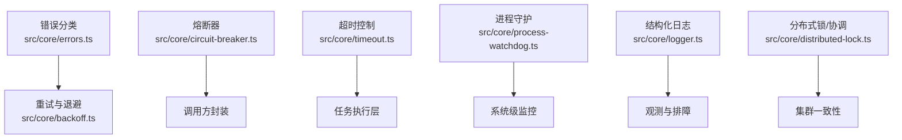
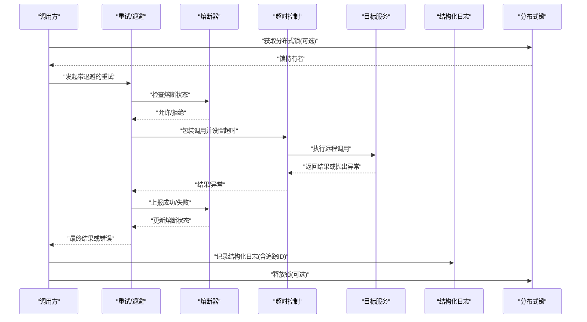
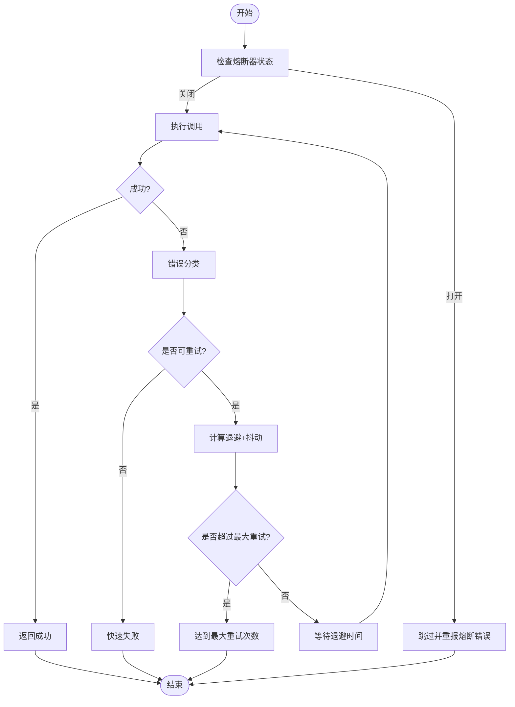
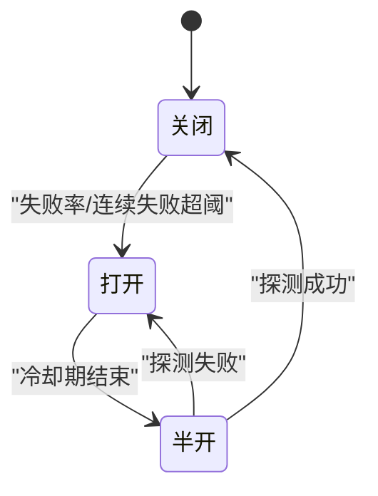
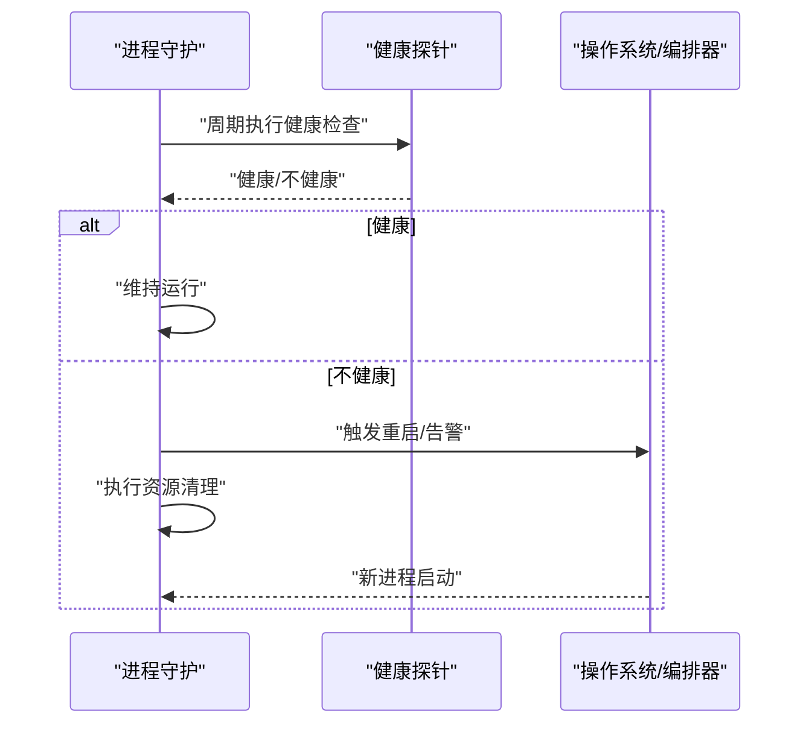
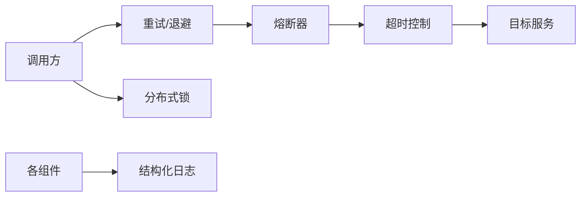

# 错误处理与故障恢复

<cite>
**本文引用的文件**   
- [src/core/errors.ts](file://src/core/errors.ts)
- [src/core/backoff.ts](file://src/core/backoff.ts)
- [src/core/circuit-breaker.ts](file://src/core/circuit-breaker.ts)
- [src/core/timeout.ts](file://src/core/timeout.ts)
- [src/core/process-watchdog.ts](file://src/core/process-watchdog.ts)
- [src/core/logger.ts](file://src/core/logger.ts)
- [src/core/distributed-lock.ts](file://src/core/distributed-lock.ts)
- [test/backoff.test.ts](file://test/backoff.test.ts)
- [test/error-classify.test.ts](file://test/error-classify.test.ts)
- [test/process-watchdog.test.ts](file://test/process-watchdog.test.ts)
- [test/process-watchdog.serial.test.ts](file://test/process-watchdog.serial.test.ts)
</cite>

## 目录
1. [简介](#简介)
2. [项目结构](#项目结构)
3. [核心组件](#核心组件)
4. [架构总览](#架构总览)
5. [详细组件分析](#详细组件分析)
6. [依赖关系分析](#依赖关系分析)
7. [性能考量](#性能考量)
8. [故障排查指南](#故障排查指南)
9. [结论](#结论)
10. [附录](#附录)

## 简介
本文件聚焦于错误处理与故障恢复体系，覆盖以下关键主题：
- 异常分类体系：可恢复错误、致命错误、超时错误的识别与处理策略
- 重试机制：指数退避、抖动算法、最大重试次数控制
- 熔断器模式：熔断条件、半开状态与自动恢复逻辑
- 进程守护：健康检查、自动重启与资源清理
- 结构化日志与追踪 ID 生成策略
- 分布式环境下的故障检测与协调机制

## 项目结构
围绕错误处理与故障恢复的核心实现主要位于 src/core 目录，配套测试位于 test 目录。下图展示了与本主题直接相关的模块及其职责边界。

图表来源
- [src/core/errors.ts](file://src/core/errors.ts)
- [src/core/backoff.ts](file://src/core/backoff.ts)
- [src/core/circuit-breaker.ts](file://src/core/circuit-breaker.ts)
- [src/core/timeout.ts](file://src/core/timeout.ts)
- [src/core/process-watchdog.ts](file://src/core/process-watchdog.ts)
- [src/core/logger.ts](file://src/core/logger.ts)
- [src/core/distributed-lock.ts](file://src/core/distributed-lock.ts)

章节来源
- [src/core/errors.ts](file://src/core/errors.ts)
- [src/core/backoff.ts](file://src/core/backoff.ts)
- [src/core/circuit-breaker.ts](file://src/core/circuit-breaker.ts)
- [src/core/timeout.ts](file://src/core/timeout.ts)
- [src/core/process-watchdog.ts](file://src/core/process-watchdog.ts)
- [src/core/logger.ts](file://src/core/logger.ts)
- [src/core/distributed-lock.ts](file://src/core/distributed-lock.ts)

## 核心组件
- 错误分类与类型化异常：提供统一的错误基类与细分类型（如可恢复、致命、超时），便于上层按策略处理。
- 重试与退避：封装指数退避与抖动策略，支持最大重试次数与可配置参数。
- 熔断器：基于失败率/连续失败次数的熔断判定，支持半开探测与自动恢复。
- 超时控制：为外部调用或长任务提供统一超时语义与取消传播。
- 进程守护：健康检查、自动重启、资源清理与优雅退出。
- 结构化日志与追踪 ID：标准化日志字段与请求链路追踪。
- 分布式协调：基于分布式锁的互斥与领导选举，避免重复执行与脑裂。

章节来源
- [src/core/errors.ts](file://src/core/errors.ts)
- [src/core/backoff.ts](file://src/core/backoff.ts)
- [src/core/circuit-breaker.ts](file://src/core/circuit-breaker.ts)
- [src/core/timeout.ts](file://src/core/timeout.ts)
- [src/core/process-watchdog.ts](file://src/core/process-watchdog.ts)
- [src/core/logger.ts](file://src/core/logger.ts)
- [src/core/distributed-lock.ts](file://src/core/distributed-lock.ts)

## 架构总览
下图展示了一次典型远程调用的端到端容错路径：从入口到重试、熔断、超时、日志与分布式协调的全链路。

图表来源
- [src/core/backoff.ts](file://src/core/backoff.ts)
- [src/core/circuit-breaker.ts](file://src/core/circuit-breaker.ts)
- [src/core/timeout.ts](file://src/core/timeout.ts)
- [src/core/logger.ts](file://src/core/logger.ts)
- [src/core/distributed-lock.ts](file://src/core/distributed-lock.ts)

## 详细组件分析

### 异常分类体系
- 设计要点
  - 统一基类：所有业务异常继承自同一基类，便于捕获与统计。
  - 分类维度：可恢复错误（网络抖动、限流）、致命错误（数据损坏、权限不足）、超时错误（上游响应慢）。
  - 元数据：每个异常携带上下文信息（操作名、目标地址、耗时、追踪ID等），用于定位与告警。
- 处理策略
  - 可恢复错误：结合重试与退避；若达到上限则降级或短路。
  - 致命错误：立即中止当前流程，触发告警与人工介入。
  - 超时错误：优先快速失败，必要时进入重试但需限制总时长。
- 验证方式
  - 单元测试覆盖各类异常的构造、序列化与分类判断。

章节来源
- [src/core/errors.ts](file://src/core/errors.ts)
- [test/error-classify.test.ts](file://test/error-classify.test.ts)

### 重试机制（指数退避 + 抖动 + 最大重试）
- 关键参数
  - 初始延迟、增长系数、最大延迟、抖动因子、最大重试次数、是否对特定错误码重试。
- 行为特征
  - 指数退避：每次失败后等待时间按指数增长，避免雪崩。
  - 抖动：在退避基础上叠加随机扰动，降低多实例同时重试导致的“惊群效应”。
  - 最大重试：超过阈值后直接失败，交由上层熔断或降级。
- 集成点
  - 与熔断器联动：熔断开启时跳过重试。
  - 与超时联动：累计重试时间不得超过整体超时预算。
- 测试要点
  - 验证退避序列、抖动范围、最大重试边界与中断信号。

图表来源
- [src/core/backoff.ts](file://src/core/backoff.ts)
- [src/core/circuit-breaker.ts](file://src/core/circuit-breaker.ts)

章节来源
- [src/core/backoff.ts](file://src/core/backoff.ts)
- [test/backoff.test.ts](file://test/backoff.test.ts)

### 熔断器模式
- 状态机
  - 关闭：正常放行，统计失败率/连续失败数。
  - 打开：拒绝请求，快速失败，等待冷却期。
  - 半开：允许少量探测请求，成功则关闭，失败则重新打开。
- 触发条件
  - 失败率阈值、连续失败次数、最小采样量。
- 恢复逻辑
  - 冷却期结束后进入半开；探测成功则关闭，失败则再次打开并重置计数。
- 指标与观测
  - 暴露当前状态、最近失败率、探测结果、切换历史。

图表来源
- [src/core/circuit-breaker.ts](file://src/core/circuit-breaker.ts)

章节来源
- [src/core/circuit-breaker.ts](file://src/core/circuit-breaker.ts)

### 超时控制
- 设计要点
  - 为单次调用或重试批次设置整体超时预算。
  - 支持取消信号传播，确保资源及时释放。
- 使用建议
  - 外层设置硬超时，内层根据业务重要性设置软超时。
  - 与重试配合时，需保证累计重试时间不超过硬超时。

章节来源
- [src/core/timeout.ts](file://src/core/timeout.ts)

### 进程守护（健康检查、自动重启、资源清理）
- 健康检查
  - 周期性探针：CPU/内存/句柄/队列积压/依赖可达性。
  - 就绪/存活探针：供编排系统决定是否转发流量或重启。
- 自动重启
  - 非零退出码或探针失败触发重启；具备重启退避与防抖。
- 资源清理
  - 优雅退出钩子：关闭连接池、刷新缓冲、释放锁、停止调度。
- 测试要点
  - 模拟崩溃、OOM、依赖不可用场景，验证重启与清理行为。

图表来源
- [src/core/process-watchdog.ts](file://src/core/process-watchdog.ts)

章节来源
- [src/core/process-watchdog.ts](file://src/core/process-watchdog.ts)
- [test/process-watchdog.test.ts](file://test/process-watchdog.test.ts)
- [test/process-watchdog.serial.test.ts](file://test/process-watchdog.serial.test.ts)

### 结构化日志与追踪 ID
- 结构化字段
  - 级别、时间戳、进程标识、追踪ID、操作名、目标、耗时、错误码、堆栈摘要。
- 追踪 ID 生成
  - 请求入口生成唯一 ID，贯穿重试、并发分支与下游调用，便于全链路聚合。
- 脱敏与安全
  - 敏感字段过滤、日志大小限制、采样策略。

章节来源
- [src/core/logger.ts](file://src/core/logger.ts)

### 分布式环境下的故障检测与协调
- 分布式锁
  - 基于共享存储的互斥原语，支持过期与续租，防止重复执行。
- 领导选举与主备切换
  - 通过锁或心跳实现单点角色，故障时自动切换。
- 分区容忍
  - 在网络分区期间保持幂等与一致性约束，避免双写。
- 观测与诊断
  - 锁竞争热点、持有时长、抢占事件、超时与续租失败统计。

章节来源
- [src/core/distributed-lock.ts](file://src/core/distributed-lock.ts)

## 依赖关系分析
- 低耦合高内聚
  - 重试、熔断、超时、守护、日志、分布式锁各自独立，通过接口组合使用。
- 关键依赖链
  - 调用方 → 重试 → 熔断 → 超时 → 目标服务
  - 调用方 → 分布式锁（可选）→ 业务逻辑 → 锁释放
  - 所有组件 → 结构化日志（含追踪ID）
- 潜在风险
  - 重试与熔断的参数不当可能导致雪崩或假阳性熔断。
  - 分布式锁的时钟漂移与网络抖动需要合理超时与续租策略。

图表来源
- [src/core/backoff.ts](file://src/core/backoff.ts)
- [src/core/circuit-breaker.ts](file://src/core/circuit-breaker.ts)
- [src/core/timeout.ts](file://src/core/timeout.ts)
- [src/core/distributed-lock.ts](file://src/core/distributed-lock.ts)
- [src/core/logger.ts](file://src/core/logger.ts)

章节来源
- [src/core/backoff.ts](file://src/core/backoff.ts)
- [src/core/circuit-breaker.ts](file://src/core/circuit-breaker.ts)
- [src/core/timeout.ts](file://src/core/timeout.ts)
- [src/core/distributed-lock.ts](file://src/core/distributed-lock.ts)
- [src/core/logger.ts](file://src/core/logger.ts)

## 性能考量
- 重试与退避
  - 合理设置初始延迟与增长系数，避免过度等待；抖动因子不宜过大以免抖动失控。
- 熔断器
  - 失败率阈值与最小采样量需平衡误判与漏判；半开探测频率不宜过高。
- 超时
  - 硬超时应小于上游 SLA，软超时用于内部优先级控制。
- 守护
  - 健康检查间隔与重启退避需避免频繁重启风暴。
- 分布式锁
  - 续租周期与锁超时需匹配业务最长执行时间，避免误释放。

## 故障排查指南
- 常见问题
  - 频繁熔断：检查失败率阈值、采样量与上游稳定性。
  - 重试风暴：调整退避与抖动参数，确认是否对非幂等操作启用重试。
  - 超时频发：核对上下游超时预算分配与网络质量。
  - 进程反复重启：查看健康探针指标与系统资源水位。
  - 分布式锁竞争：观察锁持有时长、抢占事件与续租失败。
- 定位手段
  - 通过追踪 ID 聚合全链路日志。
  - 关注熔断状态切换与重试次数分布。
  - 采集进程守护的探针时序与重启事件。

章节来源
- [src/core/circuit-breaker.ts](file://src/core/circuit-breaker.ts)
- [src/core/backoff.ts](file://src/core/backoff.ts)
- [src/core/timeout.ts](file://src/core/timeout.ts)
- [src/core/process-watchdog.ts](file://src/core/process-watchdog.ts)
- [src/core/logger.ts](file://src/core/logger.ts)
- [src/core/distributed-lock.ts](file://src/core/distributed-lock.ts)

## 结论
通过将异常分类、重试退避、熔断器、超时控制、进程守护、结构化日志与分布式协调有机结合，系统在复杂环境下具备更强的韧性与可观测性。合理的参数配置与完善的测试覆盖是保障稳定性的关键。

## 附录
- 最佳实践清单
  - 对所有外部依赖启用超时与熔断。
  - 仅对幂等操作启用重试，并限制最大重试次数。
  - 为关键路径配置健康探针与自动重启。
  - 统一注入追踪 ID，确保跨组件可关联。
  - 在分布式场景中采用分布式锁进行互斥与领导选举。