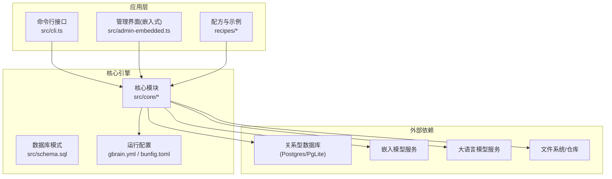
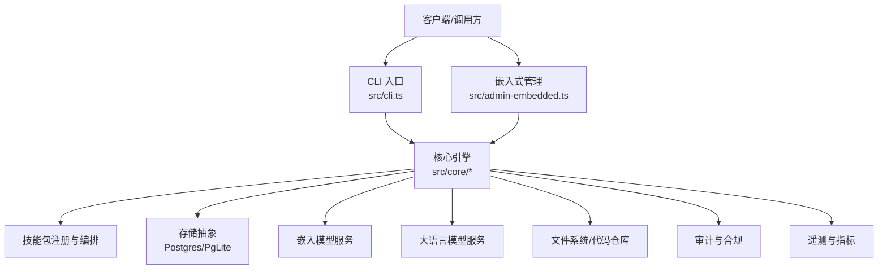
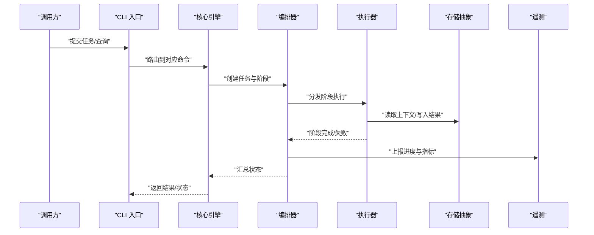
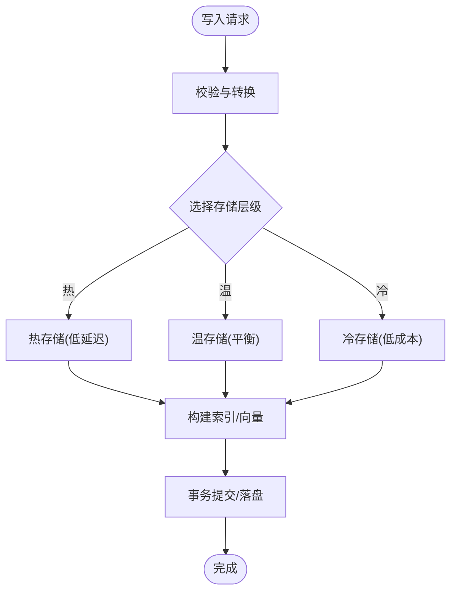
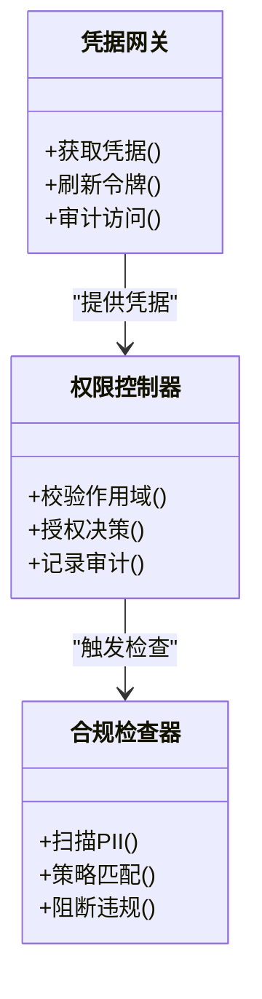
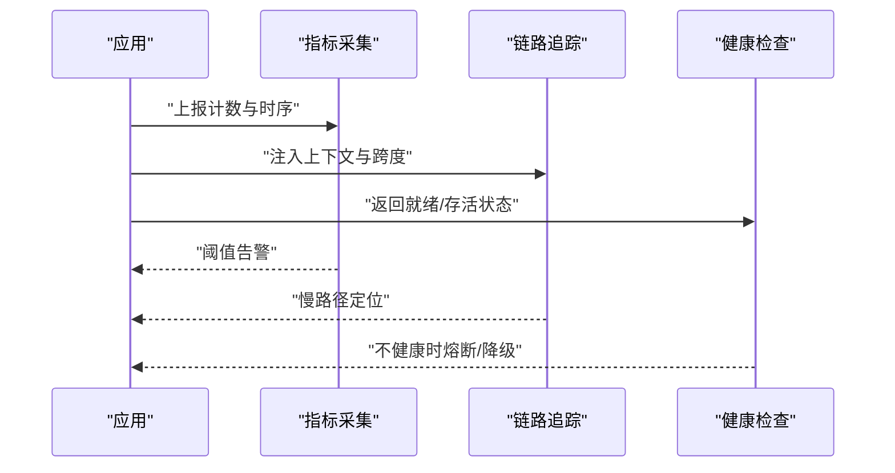
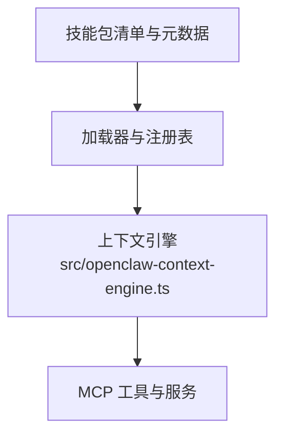
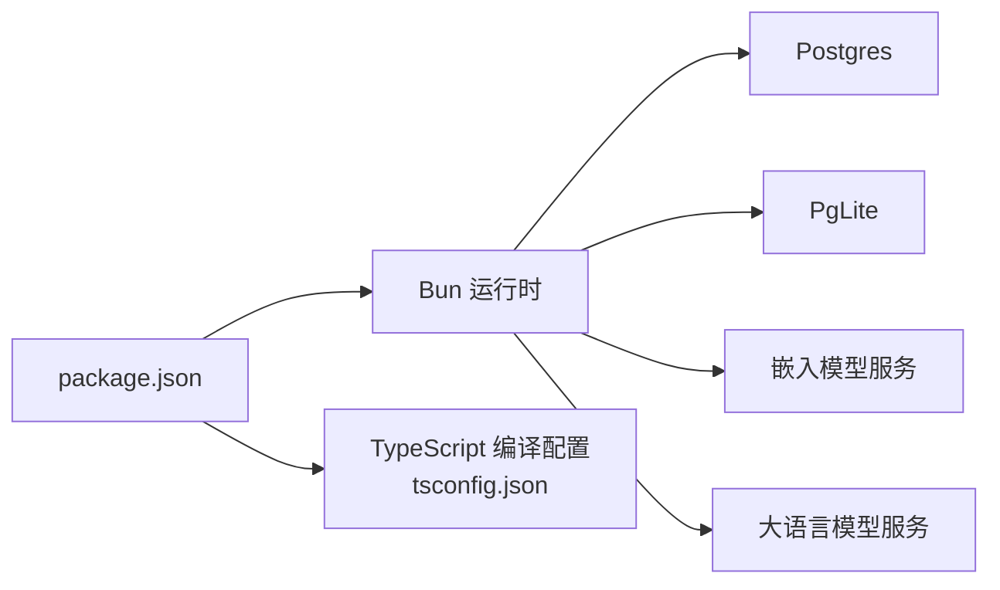

# 系统架构

<cite>
**本文引用的文件**   
- [README.md](file://README.md)
- [DESIGN.md](file://DESIGN.md)
- [package.json](file://package.json)
- [gbrain.yml](file://gbrain.yml)
- [src/cli.ts](file://src/cli.ts)
- [src/admin-embedded.ts](file://src/admin-embedded.ts)
- [src/openclaw-context-engine.ts](file://src/openclaw-context-engine.ts)
- [src/schema.sql](file://src/schema.sql)
- [docker-compose.ci.yml](file://docker-compose.ci.yml)
- [docker-compose.test.yml](file://docker-compose.test.yml)
- [bunfig.toml](file://bunfig.toml)
- [tsconfig.json](file://tsconfig.json)
- [docs/ENGINES.md](file://docs/ENGINES.md)
- [docs/storage-tiering.md](file://docs/storage-tiering.md)
- [docs/guardrails.md](file://docs/guardrails.md)
- [docs/progress-events.md](file://docs/progress-events.md)
- [docs/GBRAIN_RECOMMENDED_SCHEMA.md](file://docs/GBRAIN_RECOMMENDED_SCHEMA.md)
- [docs/GBRAIN_SKILLPACK.md](file://docs/GBRAIN_SKILLPACK.md)
- [docs/INSTALL.md](file://docs/INSTALL.md)
- [docs/UPGRADING_DOWNSTREAM_AGENTS.md](file://docs/UPGRADING_DOWNSTREAM_AGENTS.md)
- [recipes/credential-gateway.md](file://recipes/credential-gateway.md)
- [recipes/retrieval-reflex.md](file://recipes/retrieval-reflex.md)
- [recipes/agent-voice.md](file://recipes/agent-voice.md)
</cite>

## 目录
1. [简介](#简介)
2. [项目结构](#项目结构)
3. [核心组件](#核心组件)
4. [架构总览](#架构总览)
5. [详细组件分析](#详细组件分析)
6. [依赖分析](#依赖分析)
7. [性能考虑](#性能考虑)
8. [故障排查指南](#故障排查指南)
9. [结论](#结论)
10. [附录](#附录)

## 简介
本架构文档面向 GBrain 的系统设计与实现，聚焦高层设计、架构模式与系统边界，解释核心引擎的组件交互、数据流与集成模式。同时覆盖技术决策与权衡、约束条件、基础设施需求、可扩展性与部署拓扑，并处理安全性、监控与灾难恢复等横切关注点。文档还记录技术栈、第三方依赖与版本兼容性，以及多租户支持、分布式部署与高可用设计要点。

## 项目结构
GBrain 采用“核心引擎 + 技能包（Skillpack）+ 命令与工具 + 管理前端 + 文档与示例”的分层组织方式：
- 核心引擎位于 src/core，提供知识图谱、检索、嵌入、同步、工作流编排、数据库抽象、权限与安全、调度与子代理等能力。
- 命令入口在 src/commands，CLI 启动器在 src/cli.ts；嵌入式管理界面由 src/admin-embedded.ts 提供。
- 配置与运行时参数通过 gbrain.yml 与 bunfig.toml 管理；TypeScript 编译配置在 tsconfig.json。
- 文档集中在 docs，包含架构、设计、操作指南与最佳实践。
- 示例与配方在 recipes，展示常见集成场景（如凭证网关、检索反射、语音智能体）。
- 测试与评估在 test 与 evals 目录，覆盖功能、回归、性能与质量评估。
- 容器化与 CI 使用 docker-compose.* 配置文件。

图表来源
- [src/cli.ts:1-200](file://src/cli.ts#L1-L200)
- [src/admin-embedded.ts:1-200](file://src/admin-embedded.ts#L1-L200)
- [src/schema.sql:1-200](file://src/schema.sql#L1-L200)
- [gbrain.yml:1-200](file://gbrain.yml#L1-L200)
- [bunfig.toml:1-200](file://bunfig.toml#L1-L200)

章节来源
- [README.md:1-200](file://README.md#L1-L200)
- [DESIGN.md:1-200](file://DESIGN.md#L1-L200)
- [package.json:1-200](file://package.json#L1-L200)
- [gbrain.yml:1-200](file://gbrain.yml#L1-L200)
- [bunfig.toml:1-200](file://bunfig.toml#L1-L200)
- [tsconfig.json:1-200](file://tsconfig.json#L1-L200)

## 核心组件
- 引擎与编排：负责任务编排、阶段流水线、并发控制、重试与退避、锁与租约、进度事件上报。
- 数据与存储：统一数据库抽象（Postgres/PgLite）、迁移与模式演进、分层存储策略、索引与向量检索。
- 知识与检索：实体解析、链接提取、事实抽取、语义嵌入、混合检索与重排。
- 安全与权限：信任边界、作用域隔离、凭据网关、审计日志与合规检查。
- 可观测性：指标、追踪、健康检查、错误分类与诊断。
- 扩展机制：技能包（Skillpack）加载、注册与生命周期管理；MCP 工具与服务集成。
- 管理与运维：CLI 命令、嵌入式管理界面、升级与迁移、回滚与快照。

章节来源
- [docs/ENGINES.md:1-200](file://docs/ENGINES.md#L1-L200)
- [docs/storage-tiering.md:1-200](file://docs/storage-tiering.md#L1-L200)
- [docs/guardrails.md:1-200](file://docs/guardrails.md#L1-L200)
- [docs/progress-events.md:1-200](file://docs/progress-events.md#L1-L200)
- [docs/GBRAIN_SKILLPACK.md:1-200](file://docs/GBRAIN_SKILLPACK.md#L1-L200)

## 架构总览
GBrain 采用“进程内核心 + 插件式扩展”的架构模式，结合“命令驱动 + 嵌入式管理”的双入口形态。核心引擎通过统一的数据库抽象访问持久化层，并通过适配器接入外部嵌入模型与大语言模型服务。技能包作为可插拔单元，定义数据模式、处理逻辑与触发器，被引擎动态加载与编排。

图表来源
- [src/cli.ts:1-200](file://src/cli.ts#L1-L200)
- [src/admin-embedded.ts:1-200](file://src/admin-embedded.ts#L1-L200)
- [src/openclaw-context-engine.ts:1-200](file://src/openclaw-context-engine.ts#L1-L200)
- [src/schema.sql:1-200](file://src/schema.sql#L1-L200)
- [docs/GBRAIN_SKILLPACK.md:1-200](file://docs/GBRAIN_SKILLPACK.md#L1-L200)

## 详细组件分析

### 引擎与编排子系统
- 职责：任务生命周期管理、阶段流水线、并发与限流、失败重试与退避、锁与租约协调、进度事件上报。
- 关键流程：
  - 任务提交 → 编排器分配阶段 → 执行器调用技能或内置处理器 → 写入存储 → 更新进度与状态。
  - 异常路径：捕获错误、分类与上报、触发重试或降级策略、记录审计日志。
- 优化点：批处理与合并写、惰性加载与缓存、分片与并行度调优、锁粒度细化。

图表来源
- [src/cli.ts:1-200](file://src/cli.ts#L1-L200)
- [docs/progress-events.md:1-200](file://docs/progress-events.md#L1-L200)

章节来源
- [docs/progress-events.md:1-200](file://docs/progress-events.md#L1-L200)

### 数据与存储子系统
- 职责：统一数据库抽象、模式迁移、读写分离与连接池、索引与向量检索、分层存储策略。
- 关键特性：
  - 模式演进：基于 SQL 脚本与迁移编排，保证向后兼容与可回滚。
  - 分层存储：热/温/冷数据分层，按访问频率与成本进行放置与回收。
  - 检索优化：全文检索与向量检索混合，重排与去重策略。
- 约束与权衡：一致性 vs 可用性、延迟 vs 吞吐、成本 vs 精度。

图表来源
- [src/schema.sql:1-200](file://src/schema.sql#L1-L200)
- [docs/storage-tiering.md:1-200](file://docs/storage-tiering.md#L1-L200)

章节来源
- [docs/storage-tiering.md:1-200](file://docs/storage-tiering.md#L1-L200)
- [src/schema.sql:1-200](file://src/schema.sql#L1-L200)

### 安全与权限子系统
- 职责：信任边界、作用域隔离、凭据管理、审计与合规检查。
- 关键机制：
  - 凭据网关：集中管理密钥与令牌，限制暴露面与访问范围。
  - 作用域：按租户/资源维度隔离数据与操作权限。
  - 审计：记录敏感操作与访问轨迹，支持回溯与告警。
- 风险缓解：输入校验、SSRF 防护、最小权限原则、机密信息脱敏。

图表来源
- [docs/guardrails.md:1-200](file://docs/guardrails.md#L1-L200)
- [recipes/credential-gateway.md:1-200](file://recipes/credential-gateway.md#L1-L200)

章节来源
- [docs/guardrails.md:1-200](file://docs/guardrails.md#L1-L200)
- [recipes/credential-gateway.md:1-200](file://recipes/credential-gateway.md#L1-L200)

### 可观测性与监控子系统
- 职责：指标采集、链路追踪、健康检查、错误分类与诊断。
- 关键指标：
  - 任务成功率、延迟分布、队列积压、资源使用率。
  - 存储 I/O 与索引构建耗时、嵌入与 LLM 调用成本。
- 诊断工具：
  - 进度事件流、错误堆栈与上下文快照、慢查询与热点分析。

图表来源
- [docs/progress-events.md:1-200](file://docs/progress-events.md#L1-L200)

章节来源
- [docs/progress-events.md:1-200](file://docs/progress-events.md#L1-L200)

### 扩展与集成子系统
- 技能包（Skillpack）：定义数据模式、处理逻辑、触发器与依赖，支持安装、升级与卸载。
- MCP 集成：通过标准协议暴露工具与服务，便于外部系统集成。
- 上下文引擎：为智能体提供上下文组装与检索增强。

图表来源
- [docs/GBRAIN_SKILLPACK.md:1-200](file://docs/GBRAIN_SKILLPACK.md#L1-L200)
- [src/openclaw-context-engine.ts:1-200](file://src/openclaw-context-engine.ts#L1-L200)

章节来源
- [docs/GBRAIN_SKILLPACK.md:1-200](file://docs/GBRAIN_SKILLPACK.md#L1-L200)
- [src/openclaw-context-engine.ts:1-200](file://src/openclaw-context-engine.ts#L1-L200)

## 依赖分析
- 运行时与语言：TypeScript/Bun 环境，依赖管理通过 package.json 与 bun.lock。
- 数据库：Postgres 与 PgLite 双后端，适配层屏蔽差异并提供迁移与连接管理。
- 外部服务：嵌入模型与大语言模型服务，通过配置与凭据网关接入。
- 容器与编排：docker-compose 用于本地与 CI 环境，简化依赖与网络拓扑。

图表来源
- [package.json:1-200](file://package.json#L1-L200)
- [tsconfig.json:1-200](file://tsconfig.json#L1-L200)
- [docker-compose.ci.yml:1-200](file://docker-compose.ci.yml#L1-L200)
- [docker-compose.test.yml:1-200](file://docker-compose.test.yml#L1-L200)

章节来源
- [package.json:1-200](file://package.json#L1-L200)
- [tsconfig.json:1-200](file://tsconfig.json#L1-L200)
- [docker-compose.ci.yml:1-200](file://docker-compose.ci.yml#L1-L200)
- [docker-compose.test.yml:1-200](file://docker-compose.test.yml#L1-L200)

## 性能考虑
- 并发与批处理：合理设置线程/进程池大小，合并小写与批量写入，减少锁竞争。
- 索引与检索：针对高频查询建立复合索引，向量检索采用近似最近邻与重排优化。
- 缓存与分层：热点数据缓存、冷热分层存储，降低 I/O 与成本。
- 资源隔离：按租户或任务类型划分资源配额，避免相互干扰。
- 监控与调优：基于指标与追踪定位瓶颈，持续优化流水线与算法参数。

[本节为通用指导，无需特定文件引用]

## 故障排查指南
- 常见问题：
  - 数据库连接不稳定：检查连接池、超时与重试策略，查看健康检查与自动重连。
  - 任务卡住或超时：审查锁与租约、队列积压与消费者速率，调整并发与超时。
  - 嵌入或 LLM 调用失败：验证凭据与配额，启用重试与降级，记录错误上下文。
- 诊断步骤：
  - 查看进度事件与审计日志，定位失败阶段与原因。
  - 收集指标与追踪跨度，识别慢路径与热点。
  - 复现问题并缩小范围，必要时启用调试模式与快照。

章节来源
- [docs/guardrails.md:1-200](file://docs/guardrails.md#L1-L200)
- [docs/progress-events.md:1-200](file://docs/progress-events.md#L1-L200)

## 结论
GBrain 以“核心引擎 + 技能包 + 命令与管理”的分层架构，提供了可扩展、可观测、安全的智能体平台。通过统一的存储抽象与分层策略、完善的权限与审计、以及丰富的集成与扩展机制，系统在性能、可靠性与可维护性之间取得良好平衡。未来可在多租户与分布式方面进一步增强，以满足更大规模与更高可用性的需求。

[本节为总结性内容，无需特定文件引用]

## 附录

### 技术栈与版本兼容性
- 语言与运行时：TypeScript、Bun。
- 数据库：Postgres、PgLite（嵌入式）。
- 外部服务：嵌入模型与大语言模型服务（通过配置与凭据网关接入）。
- 容器与编排：Docker Compose（CI 与测试环境）。
- 参考：
  - 安装与环境准备：[docs/INSTALL.md](file://docs/INSTALL.md)
  - 下游智能体升级指南：[docs/UPGRADING_DOWNSTREAM_AGENTS.md](file://docs/UPGRADING_DOWNSTREAM_AGENTS.md)

章节来源
- [docs/INSTALL.md:1-200](file://docs/INSTALL.md#L1-L200)
- [docs/UPGRADING_DOWNSTREAM_AGENTS.md:1-200](file://docs/UPGRADING_DOWNSTREAM_AGENTS.md#L1-L200)

### 多租户支持与隔离
- 作用域与命名空间：按租户隔离数据与资源，确保访问边界清晰。
- 权限与策略：基于角色的访问控制与细粒度策略，支持动态生效。
- 资源配额：CPU/内存/IO 配额与限流，防止跨租户干扰。
- 建议：在存储层引入租户前缀或独立 schema，并在索引中纳入租户键。

[本节为概念性内容，无需特定文件引用]

### 分布式部署与高可用
- 节点无状态：将计算节点设计为无状态，通过共享存储与消息队列协调。
- 数据库高可用：主从复制、自动故障转移与只读副本。
- 负载均衡：前置负载均衡器分发请求，健康检查与优雅下线。
- 容灾与备份：定期快照与异地备份，演练恢复流程。

[本节为概念性内容，无需特定文件引用]

### 部署拓扑与基础设施
- 本地与开发：单进程 + PgLite，快速迭代与调试。
- 生产环境：多进程/多实例 + Postgres 集群 + 对象存储 + 缓存与消息中间件。
- 参考：
  - CI 与测试编排：[docker-compose.ci.yml](file://docker-compose.ci.yml)、[docker-compose.test.yml](file://docker-compose.test.yml)
  - 运行配置：[gbrain.yml](file://gbrain.yml)、[bunfig.toml](file://bunfig.toml)

章节来源
- [docker-compose.ci.yml:1-200](file://docker-compose.ci.yml#L1-L200)
- [docker-compose.test.yml:1-200](file://docker-compose.test.yml#L1-L200)
- [gbrain.yml:1-200](file://gbrain.yml#L1-L200)
- [bunfig.toml:1-200](file://bunfig.toml#L1-L200)

### 集成模式与示例
- 凭证网关：集中管理凭据，限制暴露面与访问范围。
- 检索反射：根据反馈优化检索策略与重排权重。
- 语音智能体：集成语音输入与输出，端到端处理链路。
- 参考：
  - [recipes/credential-gateway.md](file://recipes/credential-gateway.md)
  - [recipes/retrieval-reflex.md](file://recipes/retrieval-reflex.md)
  - [recipes/agent-voice.md](file://recipes/agent-voice.md)

章节来源
- [recipes/credential-gateway.md:1-200](file://recipes/credential-gateway.md#L1-L200)
- [recipes/retrieval-reflex.md:1-200](file://recipes/retrieval-reflex.md#L1-L200)
- [recipes/agent-voice.md:1-200](file://recipes/agent-voice.md#L1-L200)

### 数据模型与推荐模式
- 推荐模式：遵循 GBRAIN 推荐的数据模式与字段约定，提升一致性与可维护性。
- 参考：
  - [docs/GBRAIN_RECOMMENDED_SCHEMA.md](file://docs/GBRAIN_RECOMMENDED_SCHEMA.md)
  - [src/schema.sql](file://src/schema.sql)

章节来源
- [docs/GBRAIN_RECOMMENDED_SCHEMA.md:1-200](file://docs/GBRAIN_RECOMMENDED_SCHEMA.md#L1-L200)
- [src/schema.sql:1-200](file://src/schema.sql#L1-L200)